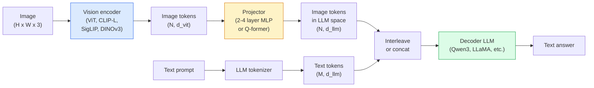

# Vision-Language Models：ViT-MLP-LLM 模式

> Vision encoder 把一张 image 转成 tokens。MLP projector 把这些 tokens 映射到 LLM 的 embedding space。Language model 完成剩下的事。这个模式：ViT-MLP-LLM，就是 2026 年每个 production VLM。

**类型:** Learn + Use
**语言:** Python
**先修:** Phase 4 Lesson 14 (ViT), Phase 4 Lesson 18 (CLIP), Phase 7 Lesson 02 (Self-Attention)
**时间:** ~75 minutes

## 学习目标

- 说出 ViT-MLP-LLM architecture，并解释三个 components 各自贡献什么
- 按 parameter count、context length 和 benchmark performance 比较 Qwen3-VL、InternVL3.5、LLaVA-Next 和 GLM-4.6V
- 解释 DeepStack：为什么 multi-level ViT features 比单一 last-layer feature 更能收紧 vision-language alignment
- 在 production 中用 Cross-Modal Error Rate（CMER）度量 VLM hallucination，并根据该信号采取行动

## 要解决的问题

CLIP（Phase 4 Lesson 18）给你一个 images 与 text 共享的 embedding space，这足够做 zero-shot classification 和 retrieval。但它不能回答“这张图里有多少辆红色汽车？”因为 CLIP 不生成 text：它只给 similarities 打分。

Vision-Language Models（VLMs）：Qwen3-VL、InternVL3.5、LLaVA-Next、GLM-4.6V，把 CLIP-family image encoder 接到一个完整 language model 上。模型看到一张 image 加一个 question，并生成 answer。到 2026 年，open-source VLMs 在 multimodal benchmarks（MMMU、MMBench、DocVQA、ChartQA、MathVista、OSWorld）上已经能 rival 或 beat GPT-5 和 Gemini-2.5-Pro。

三件套（ViT、projector、LLM）就是标准。模型之间的差异在于使用哪个 ViT、哪个 projector、哪个 LLM、training data，以及 alignment recipe。一旦你理解了这个模式，替换任何 component 都是机械操作。

## 核心概念

### ViT-MLP-LLM architecture



1. **Vision encoder**：一个 pretrained ViT（CLIP-L/14、SigLIP、DINOv3 或 fine-tuned variant）。产生 patch tokens。
2. **Projector**：一个小模块（2-4 layer MLP，或 Q-former），把 vision tokens 映射到 LLM 的 embedding dimension。这是大多数 fine-tuning 发生的地方。
3. **LLM**：一个 decoder-only language model（Qwen3、Llama、Mistral、GLM、InternLM）。按 sequence 读取 vision + text tokens，并生成 text。

原则上，三个部件都可训练。实践中，vision encoder 和 LLM 大多保持 frozen，只训练 projector：用很低成本换取数十亿参数信号。

### DeepStack

Vanilla projection 只使用最后一个 ViT layer。DeepStack（Qwen3-VL）从多个 ViT depths 采样 features 并把它们 stack 起来。更深 layers 携带 high-level semantics；较浅 layers 携带 fine-grained spatial 和 textural information。把二者都输入 LLM，可以缩小“图像里有什么”（semantics）与“具体在哪里”（spatial grounding）之间的差距。

### 三个 training stages

现代 VLMs 分阶段训练：

1. **Alignment**：freeze ViT 和 LLM。只在 image-caption pairs 上训练 projector。教会 projector 把 vision space 映射到 language space。
2. **Pre-training**：unfreeze everything。在 large-scale interleaved image-text data（500M+ pairs）上训练。构建模型的 visual knowledge。
3. **Instruction tuning**：在 curated (image, question, answer) triples 上 fine-tune。教授 conversational behaviour 和 task formats。这一步把“vision-aware LM”变成可用 assistant。

大多数 LoRA fine-tunes 会用小型 labelled dataset 针对 stage 3。

### Model family comparison（early 2026）

| Model | Params | Vision encoder | LLM | Context | Strengths |
|-------|--------|----------------|-----|---------|-----------|
| Qwen3-VL-235B-A22B (MoE) | 235B (22B active) | custom ViT + DeepStack | Qwen3 | 256K | General SOTA, GUI agent |
| Qwen3-VL-30B-A3B (MoE) | 30B (3B active) | custom ViT + DeepStack | Qwen3 | 256K | Smaller MoE alternative |
| Qwen3-VL-8B (dense) | 8B | custom ViT | Qwen3 | 128K | Production dense default |
| InternVL3.5-38B | 38B | InternViT-6B | Qwen3 + GPT-OSS | 128K | Strong MMBench / MMVet |
| InternVL3.5-241B-A28B | 241B (28B active) | InternViT-6B | Qwen3 | 128K | Competitive with GPT-4o |
| LLaVA-Next 72B | 72B | SigLIP | Llama-3 | 32K | Open, easy to fine-tune |
| GLM-4.6V | ~70B | custom | GLM | 64K | Open-source, strong OCR |
| MiniCPM-V-2.6 | 8B | SigLIP | MiniCPM | 32K | Edge-friendly |

### Visual agents

Qwen3-VL-235B 在 OSWorld 上达到全球顶尖表现：这是一个评估 **visual agents** 操作 GUIs（desktop、mobile、web）的 benchmark。模型看到 screenshot，理解 UI，并发出 actions（click、type、scroll）。结合 tools 之后，它能闭环完成常见 desktop tasks。这就是大多数 2026 年 "AI PC" demos 在底层运行的东西。

### Agentic capabilities + RoPE variants

VLMs 需要知道 video 中某一 frame 发生在 **什么时候**。Qwen3-VL 从 T-RoPE（temporal rotary position embeddings）演进到 **text-based time alignment**：把显式 timestamp text tokens 与 video frames interleave。模型看到 "`<timestamp 00:32>` frame, prompt"，于是可以推理 temporal relationships。

### Alignment problem

爬取数据集中有 12% 的 image-text pairs 包含并未完全 grounded in the image 的描述。用这种数据训练的 VLM 会默默学会 hallucinate：捏造 objects、误读 numbers、编造 relationships。在 production 中，这是主导性的 failure mode。

Skywork.ai 引入了 **Cross-Modal Error Rate (CMER)** 来跟踪它：

```text
CMER = fraction of outputs where the text confidence is high but the image-text similarity (via a CLIP-family checker) is low
```

高 CMER 意味着模型在自信地说一些没有 grounded in the image 的内容。监控 CMER 并把它当作 production KPI，使他们部署中的 hallucination rate 降低了约 35%。关键不是“修好模型”，而是“把 high-CMER outputs route 到 human review”。

### 用 LoRA / QLoRA fine-tuning

对大多数团队来说，full fine-tuning 一个 70B VLM 够不着。对 attention + projector layers 做 LoRA（rank 16-64），或使用带 4-bit base weights 的 QLoRA，可以放在单张 A100 / H100 上。成本：5,000-50,000 examples，$100-$5,000 compute，2-10 hours training。

### Spatial reasoning 仍然很弱

当前 VLMs 在 spatial reasoning benchmarks（above-below、left-right、counting、distance）上得分 50-60%。如果你的 use case 依赖“哪个 object 在哪个上方”，要重度验证：generic VLM performance 低于人类。纯 spatial tasks 上比 VLM 更好的替代方案包括：specialised keypoint / pose estimator、depth model，或 detection model 加 box geometry post-processing。

## 动手实现

### Step 1: Projector

这是你最常训练的部分。一个带 GELU 的 2-4 layer MLP。

```python
import torch
import torch.nn as nn


class Projector(nn.Module):
    def __init__(self, vit_dim=768, llm_dim=4096, hidden=4096):
        super().__init__()
        self.net = nn.Sequential(
            nn.Linear(vit_dim, hidden),
            nn.GELU(),
            nn.Linear(hidden, llm_dim),
        )

    def forward(self, x):
        return self.net(x)
```

Input 是一个 `(N_patches, d_vit)` token tensor。Output 是 `(N_patches, d_llm)`。LLM 会把每个 output row 当成另一个 token。

### Step 2: 组装端到端 ViT-MLP-LLM

Minimal VLM 的 forward pass skeleton。真实代码会使用 `transformers`；这里展示 conceptual layout。

```python
class MinimalVLM(nn.Module):
    def __init__(self, vit, projector, llm, image_token_id):
        super().__init__()
        self.vit = vit
        self.projector = projector
        self.llm = llm
        self.image_token_id = image_token_id  # placeholder token in text prompt

    def forward(self, image, input_ids, attention_mask):
        # 1. vision features
        vision_tokens = self.vit(image)                     # (B, N_patches, d_vit)
        vision_embeds = self.projector(vision_tokens)       # (B, N_patches, d_llm)

        # 2. text embeddings
        text_embeds = self.llm.get_input_embeddings()(input_ids)  # (B, M, d_llm)

        # 3. replace image placeholder tokens with vision embeds
        merged = self._merge(text_embeds, vision_embeds, input_ids)

        # 4. run LLM
        return self.llm(inputs_embeds=merged, attention_mask=attention_mask)

    def _merge(self, text_embeds, vision_embeds, input_ids):
        out = text_embeds.clone()
        expected = vision_embeds.size(1)
        for b in range(input_ids.size(0)):
            positions = (input_ids[b] == self.image_token_id).nonzero(as_tuple=True)[0]
            if len(positions) != expected:
                raise ValueError(
                    f"batch item {b} has {len(positions)} image tokens but vision_embeds has {expected} patches."
                    " Every sample in the batch must be pre-padded to the same number of image placeholder tokens.")
            out[b, positions] = vision_embeds[b]
        return out
```

Text 中的 `<image>` placeholder token 会被替换成真实 image embeddings：这与 LLaVA、Qwen-VL 和 InternVL 使用的是同一个 pattern。

### Step 3: CMER computation

一个轻量 runtime check。

```python
import torch.nn.functional as F


def cross_modal_error_rate(image_emb, text_emb, text_confidence, sim_threshold=0.25, conf_threshold=0.8):
    """
    image_emb, text_emb: embeddings of image and generated text (normalised internally)
    text_confidence:     mean per-token probability in [0, 1]
    Returns:             fraction of high-confidence outputs with low image-text alignment
    """
    image_emb = F.normalize(image_emb, dim=-1)
    text_emb = F.normalize(text_emb, dim=-1)
    sim = (image_emb * text_emb).sum(dim=-1)        # cosine similarity
    high_conf_low_sim = (text_confidence > conf_threshold) & (sim < sim_threshold)
    return high_conf_low_sim.float().mean().item()
```

把 CMER 当成 production KPI。按 endpoint、prompt type、customer 监控它。CMER 上升表示模型开始在某个 input distribution 上 hallucinate。

### Step 4: Toy VLM classifier（可运行）

演示 projector 可以被训练。Fake "ViT features" 输入；一个 tiny LLM-style token 预测 class。

```python
class ToyVLM(nn.Module):
    def __init__(self, vit_dim=32, llm_dim=64, num_classes=5):
        super().__init__()
        self.projector = Projector(vit_dim, llm_dim, hidden=64)
        self.head = nn.Linear(llm_dim, num_classes)

    def forward(self, vision_tokens):
        projected = self.projector(vision_tokens)
        pooled = projected.mean(dim=1)
        return self.head(pooled)
```

你可以在 synthetic (feature, class) pairs 上用少于 200 steps 拟合它，足以展示 projector pattern 可行。

## 实际使用

2026 年 production teams 使用 VLMs 有三种方式：

- **Hosted API**：OpenAI Vision、Anthropic Claude Vision、Google Gemini Vision。Zero infra，但有 vendor risk。
- **Open-source self-host**：通过 `transformers` 和 `vllm` 部署 Qwen3-VL 或 InternVL3.5。完全控制，但 upfront effort 更高。
- **Fine-tune on domain**：加载 Qwen2.5-VL-7B 或 LLaVA-1.6-7B，在 5k-50k custom examples 上做 LoRA，并用 `vllm` 或 `TGI` serving。

```python
from transformers import AutoProcessor, AutoModelForVision2Seq
import torch
from PIL import Image

model_id = "Qwen/Qwen3-VL-8B-Instruct"
processor = AutoProcessor.from_pretrained(model_id)
model = AutoModelForVision2Seq.from_pretrained(model_id, torch_dtype=torch.bfloat16, device_map="auto")

messages = [{
    "role": "user",
    "content": [
        {"type": "image", "image": Image.open("plot.png")},
        {"type": "text", "text": "What does this chart show?"},
    ],
}]
inputs = processor.apply_chat_template(messages, add_generation_prompt=True, tokenize=True, return_dict=True, return_tensors="pt").to("cuda")
generated = model.generate(**inputs, max_new_tokens=256)
answer = processor.decode(generated[0][inputs["input_ids"].shape[1]:], skip_special_tokens=True)
```

`apply_chat_template` 隐藏了 `<image>` placeholder tokenisation；模型内部处理 merge。

## 交付成果

本课产出：

- `outputs/prompt-vlm-selector.md`：根据 accuracy、latency、context length 和 budget，在 Qwen3-VL / InternVL3.5 / LLaVA-Next / API 中做选择。
- `outputs/skill-cmer-monitor.md`：生成代码，用 cross-modal error rate、per-endpoint dashboards 和 alerting thresholds 来 instrument 一个 production VLM endpoint。

## 练习

1. **(Easy)** 在五张 images 上，用任意 open VLM 跑三个 prompts（"what is this?"、"count the objects"、"describe the scene"）。手动把每个 answer 标为 correct / partially correct / hallucinated。计算一个 first-pass CMER-like rate。
2. **(Medium)** 用 LoRA（rank 16）在目标 domain 的 500 张带 captions images 上 fine-tune Qwen2.5-VL-3B 或 LLaVA-1.6-7B。比较 zero-shot 与 fine-tuned 的 MMBench-style accuracy。
3. **(Hard)** 把 VLM 的 image encoder 从默认 SigLIP/CLIP 换成 DINOv3。只重新训练 projector（frozen LLM + frozen DINOv3）。测量 dense-prediction tasks（counting、spatial reasoning）是否改善。

## 关键术语

| Term | 人们常说 | 实际含义 |
|------|----------------|----------------------|
| ViT-MLP-LLM | "The VLM pattern" | Vision encoder + projector + language model；每个 2026 VLM 都是这个结构 |
| Projector | "The bridge" | 2-4 layer MLP（或 Q-former），把 vision tokens 映射到 LLM embedding space |
| DeepStack | "Qwen3-VL feature trick" | Stack multi-level ViT features，而不是只用 last-layer |
| Image token | "<image> placeholder" | Text stream 中被 projected vision embeddings 替换的 special token |
| CMER | "Hallucination KPI" | Cross-Modal Error Rate；text confidence 高但 image-text similarity 低时会升高 |
| Visual agent | "VLM that clicks" | 带 tool calls 操作 GUIs（OSWorld、mobile、web）的 VLM |
| Q-former | "Fixed-count token bridge" | BLIP-2 style projector，产生固定数量的 visual query tokens |
| Alignment / pre-training / instruction tuning | "Three stages" | 标准 VLM training pipeline |

## 延伸阅读

- [Qwen3-VL Technical Report (arXiv 2511.21631)](https://arxiv.org/abs/2511.21631)
- [InternVL3.5 Advancing Open-Source Multimodal Models (arXiv 2508.18265)](https://arxiv.org/html/2508.18265v1)
- [LLaVA-Next series](https://llava-vl.github.io/blog/2024-05-10-llava-next-stronger-llms/)
- [BentoML: Best Open-Source VLMs 2026](https://www.bentoml.com/blog/multimodal-ai-a-guide-to-open-source-vision-language-models)
- [MMMU: Multi-discipline Multimodal Understanding benchmark](https://mmmu-benchmark.github.io/)
- [VLMs in manufacturing (Robotics Tomorrow, March 2026)](https://www.roboticstomorrow.com/story/2026/03/when-machines-learn-to-see-like-experts-the-rise-of-vision-language-models-in-manufacturing/26335/)
