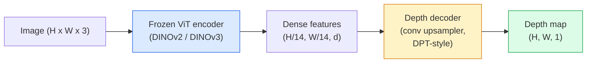

# Monocular Depth 与 Geometry Estimation

> Depth map 是一张 single-channel image，其中每个 pixel 都是它到 camera 的距离。过去，如果没有 stereo 或 LiDAR，就几乎不可能从一帧 RGB 里预测它。到 2026 年，一个 frozen ViT encoder 加一个 lightweight head，就能达到与 ground truth 相差几个百分点的水平。

**类型:** Build + Use
**语言:** Python
**先修:** Phase 4 Lesson 14 (ViT), Phase 4 Lesson 17 (Self-Supervised Vision), Phase 4 Lesson 07 (U-Net)
**时间:** ~60 minutes

## 学习目标

- 区分 relative depth 与 metric depth，并说明每个 production model（MiDaS、Marigold、Depth Anything V3、ZoeDepth）解决的是哪一种
- 使用 Depth Anything V3（DINOv2 backbone）为任意 single images 预测 depth，不需要 calibration
- 解释为什么 monocular depth 能从一张 image 中工作（perspective cues、texture gradients、learned priors），以及它不能恢复什么（absolute scale、occluded geometry）
- 使用 depth map 和 pinhole camera intrinsics 把 2D detections 提升为 3D points

## 要解决的问题

Depth 是 2D computer vision 中缺失的轴。给定 RGB，你知道物体在 image plane 中出现在哪里；但不知道它们离你有多远。Depth sensors（stereo rigs、LiDAR、time-of-flight）能直接解决这个问题，但昂贵、脆弱，并且 range 有限。

Monocular depth estimation：从单张 RGB frame 预测 depth，过去会产生模糊且不可靠的输出。到 2026 年，大型 pretrained encoders 改变了这一点：Depth Anything V3 使用 frozen DINOv2 backbone，可以生成跨 indoor、outdoor、medical 和 satellite domains 泛化的 depth maps。Marigold 把 depth 重写为 conditional diffusion problem。ZoeDepth 回归真实 metric distances。

Depth 也是连接 2D detection 与 3D understanding 的桥梁：把 detected box 的 pixels 乘以 depth，就能把 2D object 提升到 3D point cloud。这是每个 AR occlusion system、每条 obstacle-avoidance pipeline，以及每个“pick up the cup” robot 的核心。

## 核心概念

### Relative vs metric depth

- **Relative depth**：没有真实世界单位的有序 `z` values。“Pixel A 比 pixel B 更近，但距离比例没有锚定到 metres。”
- **Metric depth**：从 camera 出发，以 metres 为单位的 absolute distance。要求模型学到 image cues 与真实距离之间的统计关系。

MiDaS 和 Depth Anything V3 产生 relative depth。Marigold 产生 relative depth。ZoeDepth、UniDepth 和 Metric3D 产生 metric depth。Metric models 对 camera intrinsics 敏感；relative models 则不敏感。

### Encoder-decoder pattern



Depth Anything V3 会 freeze encoder，只训练 DPT-style decoder。Encoder 提供 rich features；decoder 把它们 interpolation 回 image resolution，并回归 depth。

### 为什么单张 image 也能产生 depth

一张 2D image 包含许多与 depth 相关的 monocular cues：

- **Perspective**：3D 中的 parallel lines 会在 2D 中汇聚。
- **Texture gradient**：远处 surfaces 的 texture 更小、更密。
- **Occlusion order**：较近 objects 会遮挡较远 objects。
- **Size constancy**：已知 objects（cars、humans）给出 approximate scale。
- **Atmospheric perspective**：outdoor scenes 中，远处 objects 看起来更朦胧、更蓝。

在 billions of images 上训练的 ViT 会内化这些 cues。只要有足够数据和强 backbone，monocular depth 即便没有 explicit 3D supervision，也能达到合理 accuracy。

### Monocular depth 做不到什么

- 没有 intrinsics 或 scene 中的 known object，就没有 **absolute metric scale**。网络可以预测“cup 离 camera 的距离是 spoon 的两倍”，但不知道 cup 是 1 m 还是 10 m 远。
- **Occluded geometry**：chair 的背面看不见，无法可靠推断。
- **真正 untextured / reflective surfaces**：mirrors、glass、uniform walls。网络会报告 plausible 但错误的 depth。

### 2026 年的 Depth Anything V3

- 使用 vanilla DINOv2 ViT-L/14 作为 encoder（frozen）。
- DPT decoder。
- 在多源 posed image pairs 上训练（除了 photometric consistency，不需要 explicit depth supervision）。
- 能从 **任意数量的 visual inputs 中预测空间一致的 geometry，不管是否有 known camera poses**。
- 在 monocular depth、any-view geometry、visual rendering、camera pose estimation 上达到 SOTA。

这是 2026 年当你需要 depth 时可以直接调用的 drop-in model。

### Marigold：用于 depth 的 diffusion

Marigold（Ke et al., CVPR 2024）把 depth estimation 重写为 conditional image-to-image diffusion。Conditioning：RGB。Target：depth map。使用 pretrained Stable Diffusion 2 U-Net 作为 backbone。输出 depth maps 在 object boundaries 处异常清晰。Trade-off：inference 比 feed-forward models 更慢（10-50 denoising steps）。

### Intrinsics 与 pinhole camera

要把带 depth `d` 的 pixel `(u, v)` 提升为 camera coordinates 中的 3D point `(X, Y, Z)`：

```text
fx, fy, cx, cy = camera intrinsics
X = (u - cx) * d / fx
Y = (v - cy) * d / fy
Z = d
```

Intrinsics 来自 EXIF metadata、calibration pattern，或 monocular intrinsics estimator（Perspective Fields、UniDepth）。没有 intrinsics 时，你仍然可以假设 60-70° FOV 和 moderate-resolution principals 来渲染 point cloud：适合 visualisation，不适合 measurement。

### Evaluation

两个标准 metrics：

- **AbsRel**（absolute relative error）：`mean(|d_pred - d_gt| / d_gt)`。越低越好。Production models 为 0.05-0.1。
- **delta < 1.25**（threshold accuracy）：满足 `max(d_pred/d_gt, d_gt/d_pred) < 1.25` 的 pixels 占比。越高越好。SOTA 为 0.9+。

对 relative depth（Depth Anything V3、MiDaS），evaluation 使用这两个 metrics 的 scale-and-shift invariant 版本。

## 动手实现

### Step 1: Depth metrics

```python
import torch

def abs_rel_error(pred, target, mask=None):
    if mask is not None:
        pred = pred[mask]
        target = target[mask]
    return (torch.abs(pred - target) / target.clamp(min=1e-6)).mean().item()


def delta_accuracy(pred, target, threshold=1.25, mask=None):
    if mask is not None:
        pred = pred[mask]
        target = target[mask]
    ratio = torch.maximum(pred / target.clamp(min=1e-6), target / pred.clamp(min=1e-6))
    return (ratio < threshold).float().mean().item()
```

Evaluation 前始终 mask invalid depth pixels（zero、NaN、saturated）。

### Step 2: Scale-and-shift alignment

对 relative-depth models，先把 prediction 对齐到 ground truth，再计算 metrics。对 `a * pred + b = target` 做 least-squares fit：

```python
def align_scale_shift(pred, target, mask=None):
    if mask is not None:
        p = pred[mask]
        t = target[mask]
    else:
        p = pred.flatten()
        t = target.flatten()
    A = torch.stack([p, torch.ones_like(p)], dim=1)
    coeffs, *_ = torch.linalg.lstsq(A, t.unsqueeze(-1))
    a, b = coeffs[:2, 0]
    return a * pred + b
```

Evaluation MiDaS / Depth Anything 时，在 `abs_rel_error` 前运行 `align_scale_shift`。

### Step 3: 把 depth 提升到 point cloud

```python
import numpy as np

def depth_to_point_cloud(depth, intrinsics):
    H, W = depth.shape
    fx, fy, cx, cy = intrinsics
    v, u = np.meshgrid(np.arange(H), np.arange(W), indexing="ij")
    z = depth
    x = (u - cx) * z / fx
    y = (v - cy) * z / fy
    return np.stack([x, y, z], axis=-1)


depth = np.random.uniform(0.5, 4.0, (240, 320))
intr = (320.0, 320.0, 160.0, 120.0)
pc = depth_to_point_cloud(depth, intr)
print(f"point cloud shape: {pc.shape}  (H, W, 3)")
```

一个函数，服务所有 3D-lifted application。把 point cloud 导出到 `.ply`，并在 MeshLab 或 CloudCompare 中打开。

### Step 4: 用 synthetic depth scene 做 smoke test

```python
def synthetic_depth(size=96):
    yy, xx = np.meshgrid(np.arange(size), np.arange(size), indexing="ij")
    # Floor: linear gradient from near (top) to far (bottom)
    depth = 1.0 + (yy / size) * 4.0
    # Box in the middle: closer
    mask = (np.abs(xx - size / 2) < size / 6) & (np.abs(yy - size * 0.6) < size / 6)
    depth[mask] = 2.0
    return depth.astype(np.float32)


gt = torch.from_numpy(synthetic_depth(96))
pred = gt + 0.3 * torch.randn_like(gt)  # simulated prediction
aligned = align_scale_shift(pred, gt)
print(f"before align  absRel = {abs_rel_error(pred, gt):.3f}")
print(f"after align   absRel = {abs_rel_error(aligned, gt):.3f}")
```

### Step 5: Depth Anything V3 usage (reference)

```python
import torch
from transformers import pipeline
from PIL import Image

pipe = pipeline(task="depth-estimation", model="LiheYoung/depth-anything-v2-large")

image = Image.open("street.jpg").convert("RGB")
out = pipe(image)
depth_np = np.array(out["depth"])
```

三行。`out["depth"]` 是一个 PIL grayscale；转换成 numpy 后用于数学计算。对 Depth Anything V3，等具体模型发布后替换 model id 即可；API 不变。

## 实际使用

- **Depth Anything V3**（Meta AI / ByteDance, 2024-2026）：relative depth 的默认选择。Production 中最快的 ViT-large-backbone model。
- **Marigold**（ETH, 2024）：最高 visual quality，inference 慢。
- **UniDepth**（ETH, 2024）：带 camera intrinsics estimation 的 metric depth。
- **ZoeDepth**（Intel, 2023）：metric depth；更老，但仍可靠。
- **MiDaS v3.1**：legacy 但稳定；适合做 baseline comparison。

典型 integration pattern：

1. RGB frame arrives。
2. Depth model 产生 depth map。
3. Detector 产生 boxes。
4. 通过 depth 把 box centroids 提升到 3D；如果有 point cloud，就与之 merge。
5. Downstream：AR occlusion、path planning、object-size estimation、stereo replacement。

Real-time 使用时，Depth Anything V2 Small（INT8 quantised）在 consumer GPU 上以 518x518 达到约 30 fps。

## 交付成果

本课产出：

- `outputs/prompt-depth-model-picker.md`：根据 latency、metric-vs-relative need 和 scene type，在 Depth Anything V3、Marigold、UniDepth、MiDaS 中做选择。
- `outputs/skill-depth-to-pointcloud.md`：一个 skill，用正确的 intrinsics handling 从 depth maps 构建 point clouds，并导出到 `.ply`。

## 练习

1. **(Easy)** 在你桌子的任意 10 张 images 上运行 Depth Anything V2。把 depth 保存成 grayscale PNGs 并检查。找出一个 predicted depth 看起来错误的 object，并解释 monocular cues 为什么失败。
2. **(Medium)** 给定 Depth Anything V2 的 RGB + depth，提升为 point cloud 并用 `open3d` 渲染。比较两个 scenes（indoor / outdoor），并记录哪一个更可信。
3. **(Hard)** 取五对只在某个 known object 位置上不同的 images（例如 bottle 靠近 30 cm）。用 UniDepth 对两张图预测 metric depth。报告 predicted distance delta 与真实 30 cm 的差距。

## 关键术语

| Term | 人们常说 | 实际含义 |
|------|----------------|----------------------|
| Monocular depth | "Single-image depth" | 从单张 RGB frame 估计 depth，不使用 stereo 或 LiDAR |
| Relative depth | "Ordered depth" | 没有真实世界单位的有序 z-values |
| Metric depth | "Absolute distance" | 以 metres 为单位的 depth；需要 calibration 或用 metric supervision 训练的模型 |
| AbsRel | "Absolute relative error" | \|d_pred - d_gt\| / d_gt 的均值；标准 depth metric |
| Delta accuracy | "delta < 1.25" | Prediction 在 ground truth 25% 以内的 pixels 占比 |
| Pinhole camera | "fx, fy, cx, cy" | 用于把 (u, v, d) 提升到 (X, Y, Z) 的 camera model |
| DPT | "Dense Prediction Transformer" | 在 frozen ViT encoders 之上的 conv-based decoder，用于 depth |
| DINOv2 backbone | "The reason it works" | 不需要 depth labels 也能跨 domains 泛化的 self-supervised features |

## 延伸阅读

- [Depth Anything V3 paper page](https://depth-anything.github.io/)：带 DINOv2 encoder 的 SOTA monocular depth
- [Marigold (Ke et al., CVPR 2024)](https://marigoldmonodepth.github.io/)：diffusion-based depth estimation
- [UniDepth (Piccinelli et al., 2024)](https://arxiv.org/abs/2403.18913)：带 intrinsics 的 metric depth
- [MiDaS v3.1 (Intel ISL)](https://github.com/isl-org/MiDaS)：canonical relative-depth baseline
- [DINOv3 blog post (Meta)](https://ai.meta.com/blog/dinov3-self-supervised-vision-model/)：提升 depth accuracy 的 encoder family
