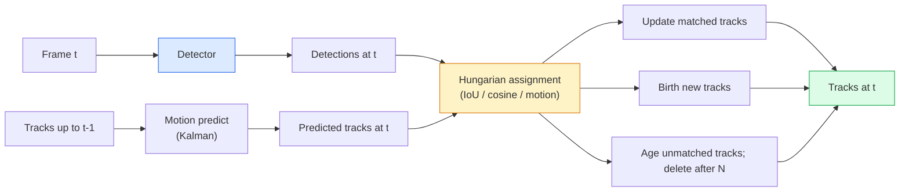

# Multi-Object Tracking 与 Video Memory

> Tracking 是 detection 加 association。每帧都 detect。把这一帧的 detections 按 ID 匹配到上一帧的 tracks。

**类型:** Build
**语言:** Python
**先修:** Phase 4 Lesson 06 (YOLO Detection), Phase 4 Lesson 08 (Mask R-CNN), Phase 4 Lesson 24 (SAM 3)
**时间:** ~60 minutes

## 学习目标

- 区分 tracking-by-detection 与 query-based tracking，并说出 algorithm families（SORT、DeepSORT、ByteTrack、BoT-SORT、SAM 2 memory tracker、SAM 3.1 Object Multiplex）
- 从零实现用于 classic tracking-by-detection 的 IoU + Hungarian assignment
- 解释 SAM 2 的 memory bank，以及为什么它比 IoU-based association 更能处理 occlusion
- 读懂三种 tracking metrics（MOTA、IDF1、HOTA），并为给定 use case 选择该关注哪一个

## 要解决的问题

Detector 告诉你 single frame 里的 objects 在哪里。Tracker 告诉你 frame `t` 中的哪个 detection，与 frame `t-1` 中的某个 detection 是同一个 object。没有它，你无法统计 objects crossing a line，无法跟踪被遮挡的球，也无法知道“car #4 已经在 lane 里待了 8 seconds”。

Tracking 是每个 video-facing product 的必需品：sports analytics、surveillance、autonomous driving、medical video analysis、wildlife monitoring、wordmark counting。核心 building blocks 是共享的：per-frame detector、motion model（Kalman filter 或更丰富的东西）、association step（在 IoU / cosine / learned features 上运行 Hungarian algorithm），以及 track lifecycle（birth、update、death）。

2026 年带来了两种新模式：**SAM 2 memory-based tracking**（用 feature-memory 替代 motion-model association）和 **SAM 3.1 Object Multiplex**（为同一 concept 的许多 instances 使用 shared memory）。本课先走一遍 classical stack，再进入 memory-based approach。

## 核心概念

### Tracking-by-detection



你在 2026 年会遇到的每个 tracker，都是这个 loop 的一种变化。差异在于：

- **SORT**（2016）：Kalman filter + IoU Hungarian。简单、快速，没有 appearance model。
- **DeepSORT**（2017）：SORT + 每条 track 一个 CNN-based appearance feature（ReID embedding）。更能处理 crossings。
- **ByteTrack**（2021）：把 low-confidence detections 作为 second stage 进行 association；不需要 appearance features，但在 MOT17 上表现顶尖。
- **BoT-SORT**（2022）：Byte + camera motion compensation + ReID。
- **StrongSORT / OC-SORT**：带更好 motion 和 appearance 的 ByteTrack descendants。

### 用一段话理解 Kalman filter

Kalman filter 为每条 track 维护一个带 covariance 的 state `(x, y, w, h, dx, dy, dw, dh)`。每帧先用 constant-velocity model **predict** state，再用 matched detection **update**。当 predict uncertainty 高时，update 会更信任 detection。这带来平滑 trajectories，并让 track 能穿过短暂 occlusion（1-5 frames）继续存在。

每个 classical tracker 都会在 motion-prediction step 中使用 Kalman filter。

### Hungarian algorithm

给定一个 `M x N` cost matrix（tracks x detections），寻找让 total cost 最小的一对一 assignment。Cost 通常是 `1 - IoU(track_bbox, detection_bbox)`，或者 appearance features 的 negative cosine similarity。Runtime 是 O((M+N)^3)；当 M、N 不超过约 1000 时，通过 `scipy.optimize.linear_sum_assignment` 在 Python 中运行足够快。

### ByteTrack 的关键思想

标准 trackers 会丢弃 low-confidence detections（< 0.5）。ByteTrack 把它们保留下来作为 **second-stage candidates**：在 tracks 与 high-confidence detections 完成匹配之后，unmatched tracks 会尝试用略松的 IoU threshold 匹配 low-confidence detections。这样可以恢复短暂 occlusions，并减少 crowds 附近的 ID switches。

### SAM 2 memory-based tracking

SAM 2 通过维护 per-instance spatio-temporal features 的 **memory bank** 来处理 video。给定某帧上的 prompt（click、box、text），它会把 instance 编码进 memory。在后续 frames 中，memory 会与新 frame 的 features 做 cross-attention，decoder 为新 frame 中的同一个 instance 产生 mask。

没有 Kalman filter，没有 Hungarian assignment。Association 隐含在 memory-attention operation 里。

Pros：

- 对 large occlusions 鲁棒（memory 跨很多 frames 携带 instance identity）。
- 与 SAM 3 的 text prompts 结合时支持 open-vocabulary。
- 不需要单独 motion model。

Cons：

- 对 many-object tracking 来说比 ByteTrack 慢。
- Memory bank 会增长；限制 context window。

### SAM 3.1 Object Multiplex

之前 SAM 2 / SAM 3 tracking 会为每个 instance 保留单独 memory bank。50 个 objects，就有 50 个 memory banks。Object Multiplex（March 2026）把它们压成一个 shared memory，并使用 **per-instance query tokens**。Cost 随 instances 数量 sub-linearly 增长。

Multiplex 是 2026 年 crowd tracking 的新默认：concert crowds、warehouse workers、traffic intersections。

### 必须知道的三个 metrics

- **MOTA (Multi-Object Tracking Accuracy)**：1 - (FN + FP + ID switches) / GT。按 error type 加权；一个同时混合 detection 和 association failures 的单一 metric。
- **IDF1 (ID F1)**：ID precision 与 recall 的 harmonic mean。专门关注每条 ground-truth track 能否随时间保持自己的 ID。对 ID-switch-sensitive tasks 比 MOTA 更好。
- **HOTA (Higher Order Tracking Accuracy)**：分解为 detection accuracy（DetA）和 association accuracy（AssA）。自 2020 年以来的 community standard；最全面。

对 surveillance（who is who）：报告 IDF1。对 sports analytics（counting passes）：报告 HOTA。对 general academic comparison：报告 HOTA。

## 动手实现

### Step 1: IoU-based cost matrix

```python
import numpy as np


def bbox_iou(a, b):
    """
    a, b: (N, 4) arrays of [x1, y1, x2, y2].
    Returns (N_a, N_b) IoU matrix.
    """
    ax1, ay1, ax2, ay2 = a[:, 0], a[:, 1], a[:, 2], a[:, 3]
    bx1, by1, bx2, by2 = b[:, 0], b[:, 1], b[:, 2], b[:, 3]
    inter_x1 = np.maximum(ax1[:, None], bx1[None, :])
    inter_y1 = np.maximum(ay1[:, None], by1[None, :])
    inter_x2 = np.minimum(ax2[:, None], bx2[None, :])
    inter_y2 = np.minimum(ay2[:, None], by2[None, :])
    inter = np.clip(inter_x2 - inter_x1, 0, None) * np.clip(inter_y2 - inter_y1, 0, None)
    area_a = (ax2 - ax1) * (ay2 - ay1)
    area_b = (bx2 - bx1) * (by2 - by1)
    union = area_a[:, None] + area_b[None, :] - inter
    return inter / np.clip(union, 1e-8, None)
```

### Step 2: Minimal SORT-style tracker

这里为了简洁省略 fixed constant-velocity Kalman：我们只使用简单 IoU association；production 中 Kalman predict 是必要的。`sort` Python package 提供了完整版本。

```python
from scipy.optimize import linear_sum_assignment


class Track:
    def __init__(self, tid, bbox, frame):
        self.id = tid
        self.bbox = bbox
        self.last_frame = frame
        self.hits = 1

    def update(self, bbox, frame):
        self.bbox = bbox
        self.last_frame = frame
        self.hits += 1


class SimpleTracker:
    def __init__(self, iou_threshold=0.3, max_age=5):
        self.tracks = []
        self.next_id = 1
        self.iou_threshold = iou_threshold
        self.max_age = max_age

    def step(self, detections, frame):
        if not self.tracks:
            for d in detections:
                self.tracks.append(Track(self.next_id, d, frame))
                self.next_id += 1
            return [(t.id, t.bbox) for t in self.tracks]

        track_boxes = np.array([t.bbox for t in self.tracks])
        det_boxes = np.array(detections) if len(detections) else np.empty((0, 4))

        iou = bbox_iou(track_boxes, det_boxes) if len(det_boxes) else np.zeros((len(track_boxes), 0))
        cost = 1 - iou
        cost[iou < self.iou_threshold] = 1e6

        matched_track = set()
        matched_det = set()
        if cost.size > 0:
            row, col = linear_sum_assignment(cost)
            for r, c in zip(row, col):
                if cost[r, c] < 1.0:
                    self.tracks[r].update(det_boxes[c], frame)
                    matched_track.add(r); matched_det.add(c)

        for i, d in enumerate(det_boxes):
            if i not in matched_det:
                self.tracks.append(Track(self.next_id, d, frame))
                self.next_id += 1

        self.tracks = [t for t in self.tracks if frame - t.last_frame <= self.max_age]
        return [(t.id, t.bbox) for t in self.tracks]
```

60 行。输入 per-frame detections，返回 per-frame track IDs。真实系统会加入 Kalman predict、ByteTrack 的 second-stage re-match 和 appearance features。

### Step 3: Synthetic trajectory test

```python
def synthetic_frames(num_frames=20, num_objects=3, H=240, W=320, seed=0):
    rng = np.random.default_rng(seed)
    starts = rng.uniform(20, 200, size=(num_objects, 2))
    velocities = rng.uniform(-5, 5, size=(num_objects, 2))
    frames = []
    for f in range(num_frames):
        dets = []
        for i in range(num_objects):
            cx, cy = starts[i] + f * velocities[i]
            dets.append([cx - 10, cy - 10, cx + 10, cy + 10])
        frames.append(dets)
    return frames


tracker = SimpleTracker()
for f, dets in enumerate(synthetic_frames()):
    tracks = tracker.step(dets, f)
```

三个位于直线运动中的 objects 应该在全部 20 frames 中保持自己的 IDs。

### Step 4: ID-switch metric

```python
def count_id_switches(tracks_per_frame, gt_per_frame):
    """
    tracks_per_frame:  list of list of (track_id, bbox)
    gt_per_frame:      list of list of (gt_id, bbox)
    Returns number of ID switches.
    """
    prev_assignment = {}
    switches = 0
    for tracks, gts in zip(tracks_per_frame, gt_per_frame):
        if not tracks or not gts:
            continue
        t_boxes = np.array([b for _, b in tracks])
        g_boxes = np.array([b for _, b in gts])
        iou = bbox_iou(g_boxes, t_boxes)
        for g_idx, (gt_id, _) in enumerate(gts):
            j = iou[g_idx].argmax()
            if iou[g_idx, j] > 0.5:
                t_id = tracks[j][0]
                if gt_id in prev_assignment and prev_assignment[gt_id] != t_id:
                    switches += 1
                prev_assignment[gt_id] = t_id
    return switches
```

这是一个简化的 IDF1-adjacent metric：统计 ground-truth object 改变其 assigned predicted track ID 的次数。真实 MOTA / IDF1 / HOTA tooling 在 `py-motmetrics` 和 `TrackEval` 中。

## 实际使用

2026 年的 production trackers：

- `ultralytics`：内置 YOLOv8 + ByteTrack / BoT-SORT。`results = model.track(source, tracker="bytetrack.yaml")`。默认选择。
- `supervision`（Roboflow）：ByteTrack wrappers 加 annotation utilities。
- SAM 2 / SAM 3.1：通过 `processor.track()` 做 memory-based tracking。
- Custom stack：detector（YOLOv8 / RT-DETR）+ `sort-tracker` / `OC-SORT` / `StrongSORT`。

选择：

- Pedestrians / cars / boxes，30+ fps：**ByteTrack with ultralytics**。
- Crowd 中同一 class 的许多 instances：**SAM 3.1 Object Multiplex**。
- 有 heavy occlusions 且 appearance 可识别：**DeepSORT / StrongSORT**（ReID features）。
- Sports / complex interactions：**BoT-SORT** 或 learned trackers（MOTRv3）。

## 交付成果

本课产出：

- `outputs/prompt-tracker-picker.md`：根据 scene type、occlusion patterns 和 latency budget，在 SORT / ByteTrack / BoT-SORT / SAM 2 / SAM 3.1 中做选择。
- `outputs/skill-mot-evaluator.md`：编写一个完整 evaluation harness，用 ground-truth tracks 评估 MOTA / IDF1 / HOTA。

## 练习

1. **(Easy)** 用 3、10 和 30 个 objects 运行上面的 synthetic tracker。报告每种情况的 ID-switch count。识别 simple IoU-only association 从哪里开始失败。
2. **(Medium)** 在 association 前加入 constant-velocity Kalman predict step。展示短暂（2-3 frame）occlusions 不再导致 ID switches。
3. **(Hard)** 把 SAM 2 的 memory-based tracker（通过 `transformers`）集成为一个 alternative tracker backend。在一段 30-second crowd clip 上运行 SimpleTracker 和 SAM 2，并比较 ID-switch counts；为 5 个 salient people 手动标注 ground-truth IDs。

## 关键术语

| Term | 人们常说 | 实际含义 |
|------|----------------|----------------------|
| Tracking-by-detection | "Detect then associate" | Per-frame detector + 在 IoU / appearance 上做 Hungarian assignment |
| Kalman filter | "Motion predict" | Linear dynamics + covariance，用于平滑 track predictions 和处理 occlusion |
| Hungarian algorithm | "Optimal assignment" | 求解 minimum-cost bipartite matching problem；`scipy.optimize.linear_sum_assignment` |
| ByteTrack | "Low-confidence second pass" | 把 unmatched tracks 重新匹配到 low-confidence detections，以恢复短暂 occlusions |
| DeepSORT | "SORT + appearance" | 添加 ReID feature 用于 cross-frame matching；更好地保持 ID |
| Memory bank | "SAM 2 trick" | 跨 frames 存储的 per-instance spatio-temporal features；cross-attention 替代显式 association |
| Object Multiplex | "SAM 3.1 shared memory" | Single shared memory 加 per-instance queries，用于快速 many-object tracking |
| HOTA | "Modern tracking metric" | 分解为 detection 和 association accuracy；community standard |

## 延伸阅读

- [SORT (Bewley et al., 2016)](https://arxiv.org/abs/1602.00763)：minimal tracking-by-detection paper
- [DeepSORT (Wojke et al., 2017)](https://arxiv.org/abs/1703.07402)：adds appearance feature
- [ByteTrack (Zhang et al., 2022)](https://arxiv.org/abs/2110.06864)：low-confidence second pass
- [BoT-SORT (Aharon et al., 2022)](https://arxiv.org/abs/2206.14651)：camera motion compensation
- [HOTA (Luiten et al., 2020)](https://arxiv.org/abs/2009.07736)：decomposed tracking metric
- [SAM 2 video segmentation (Meta, 2024)](https://ai.meta.com/sam2/)：memory-based tracker
- [SAM 3.1 Object Multiplex (Meta, March 2026)](https://ai.meta.com/blog/segment-anything-model-3/)
