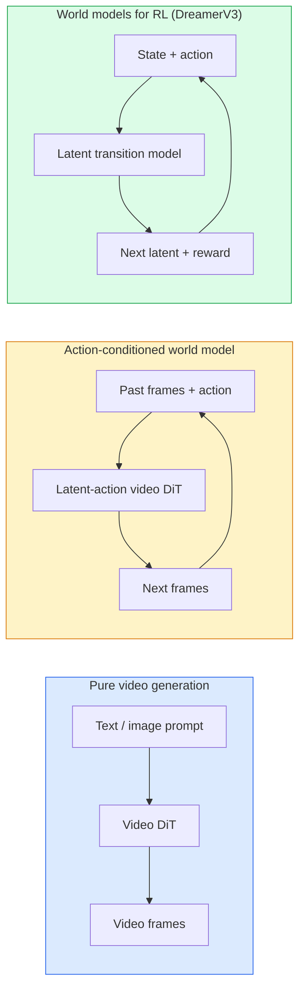

# World Models 与 Video Diffusion

> 一个能预测场景未来几秒的视频模型，就是 world simulator。把这种预测 condition 在 actions 上，你就得到了一个 learned game engine。

**类型:** Learn + Build
**语言:** Python
**先修:** Phase 4 Lesson 10 (Diffusion), Phase 4 Lesson 12 (Video Understanding), Phase 4 Lesson 23 (DiT + Rectified Flow)
**时间:** ~75 minutes

## 学习目标

- 解释 pure video generation model（Sora 2）与 action-conditioned world model（Genie 3、DreamerV3）之间的区别
- 描述 video DiT：spatio-temporal patches、3D position encoding、跨 `(T, H, W)` tokens 的 joint attention
- 追踪 world model 如何接入 robotics：VLM plans → video model simulates → inverse dynamics emits actions
- 为给定 use case（creative video、interactive sim、autonomous-driving synthesis）在 Sora 2、Genie 3、Runway GWM-1 Worlds、Wan-Video 和 HunyuanVideo 中做选择

## 要解决的问题

Video generation 与 world modelling 在 2026 年汇合了。一个能够生成连贯一分钟视频的模型，从某种意义上已经学会了世界如何运动：object permanence、gravity、causality、style。如果你把这个预测 condition 在 actions（walk left、open the door）上，video model 就会变成一个 learnable simulator，可以替代 game engine、driving simulator 或 robotics environment。

利害关系很具体。Genie 3 可以从 single image 生成 playable environments。Runway GWM-1 Worlds 合成无限可探索 scenes。Sora 2 生成带 synchronized audio 和 modelled physics 的 minute-long videos。NVIDIA Cosmos-Drive、Wayve Gaia-2 和 Tesla DrivingWorld 为 autonomous-vehicle training data 生成 realistic driving video。World-model paradigm 正悄悄接管 robotics 中的 sim-to-real。

本课是 Phase 4 的“大图景”课。它把 image generation、video understanding 和 agentic reasoning 连接到 dominant research 正在走向的 architecture pattern。

## 核心概念

### World-modelling 的三大家族



- **Sora 2** 是 conditioned on prompts 的 pure video generation。没有 action interface。你不能在 rollout 中途“steer”它。
- **Genie 3**、**GWM-1 Worlds**、**Mirage / Magica** 是 action-conditioned world models。它们从 observed video 中 infer latent actions，再把 future frame predictions condition 在 actions 上。它们是 interactive 的：你按 keys 或移动 camera，scene 会响应。
- **DreamerV3** 和经典 RL world-model family 在 latent space 中预测，带 explicit action conditioning，并在 reward signal 上训练。视觉性较弱，但对 sample-efficient RL 更有用。

### Video DiT architecture

```text
Video latent:          (C, T, H, W)
Patchify (spatial):    grid of P_h x P_w patches per frame
Patchify (temporal):   group P_t frames into a temporal patch
Resulting tokens:      (T / P_t) * (H / P_h) * (W / P_w) tokens
```

Positional encoding 是 3D 的：每个 `(t, h, w)` coordinate 都有 rotary 或 learned embedding。Attention 可以是：

- **Full joint**：所有 tokens attend to all tokens。N tokens 时为 O(N^2)。对长 videos 来说代价过高。
- **Divided**：交替使用 temporal attention（同一 spatial position，跨 time：`(H*W) * T^2`）和 spatial attention（同一 timestep，跨 space：`T * (H*W)^2`）。TimeSformer 和大多数 video DiTs 使用它。
- **Window**：在 `(t, h, w)` 中使用 local windows。Video Swin 使用它。

每个 2026 年 video diffusion model 都使用这三种模式之一，再加上 AdaLN conditioning（Lesson 23）和 rectified flow。

### Conditioning on actions：latent action models

Genie 通过判别式地预测连续 frames 之间的 action，为每帧学习一个 **latent action**。模型的 decoder 随后 condition 在 inferred latent action 上，而不是 explicit keyboard keys 上。Inference 时，用户可以指定一个 latent action（或从 fresh prior sample 一个），模型就会生成与该 action 一致的 next frame。

Sora 完全跳过 action interface。它的 decoder 从 past spacetime tokens 预测 next spacetime tokens。Prompt 只 condition 起点；生成中途没有东西 steer 它。

### Physical plausibility

Sora 2 的 2026 release 明确宣传 **physical plausibility**：weight、balance、object permanence、cause-and-effect。团队通过 hand-rated plausibility scores 进行测量；相比 Sora 1，模型在 dropped objects、characters colliding 和 failures-on-purpose（a missed jump）上有明显改善。

Plausibility 仍是主导 failure mode。2024-2025 年 people eating spaghetti 或 drinking from glasses 的视频暴露了模型缺乏 persistent object representation。2026 models（Sora 2、Runway Gen-5、HunyuanVideo）减少但没有消除这些问题。

### Autonomous driving world models

Driving world models 会生成 realistic road scenes，并 condition 在 trajectories、bounding boxes 或 navigation maps 上。用途：

- **Cosmos-Drive-Dreams**（NVIDIA）：为 RL training 生成分钟级 driving video。
- **Gaia-2**（Wayve）：trajectory-conditioned scene synthesis，用于 policy evaluation。
- **DrivingWorld**（Tesla）：模拟多样 weather、time-of-day、traffic conditions。
- **Vista**（ByteDance）：reactive driving scene synthesis。

它们替代昂贵的 real-world data collection，尤其是 corner cases：夜间行人乱穿马路、icy intersections、unusual vehicle types。否则这些情况需要数百万英里的 driving 才能收集。

### Robotics stack：VLM + video model + inverse dynamics

正在兴起的三组件 robotics loop：

1. **VLM** 解析 goal（"pick up the red cup"），规划 high-level action sequence。
2. **Video generation model** 模拟执行每个 action 会是什么样：预测未来 N frames 的 observations。
3. **Inverse dynamics model** 提取能产生这些 observations 的具体 motor commands。

这替代了 reward shaping 和 sample-heavy RL。World model 负责 imagination；inverse dynamics 负责闭合 actuation loop。Genie Envisioner 是其中一个实例；许多研究组正在收敛到这个结构。

### 评估

- **Visual quality**：FVD（Fréchet Video Distance）、user studies。
- **Prompt alignment**：每帧 CLIPScore、VQA-style evaluation。
- **Physical plausibility**：在 benchmark suite 上 hand-rated（Sora 2 的 internal benchmark、VBench）。
- **Controllability**（用于 interactive world models）：action → observation consistency；能否回到 prior state？

### 2026 年模型格局

| Model | Use | Parameters | Output | License |
|-------|-----|------------|--------|---------|
| Sora 2 | text-to-video, audio | — | 1-min 1080p + audio | API only |
| Runway Gen-5 | text/image-to-video | — | 10s clips | API |
| Runway GWM-1 Worlds | interactive world | — | infinite 3D rollout | API |
| Genie 3 | interactive world from image | 11B+ | playable frames | research preview |
| Wan-Video 2.1 | open text-to-video | 14B | high-quality clips | non-commercial |
| HunyuanVideo | open text-to-video | 13B | 10s clips | permissive |
| Cosmos / Cosmos-Drive | autonomous driving sim | 7-14B | driving scenes | NVIDIA open |
| Magica / Mirage 2 | AI-native game engine | — | modifiable worlds | product |

## 动手实现

### Step 1: 视频的 3D patchify

```python
import torch
import torch.nn as nn


class VideoPatch3D(nn.Module):
    def __init__(self, in_channels=4, dim=64, patch_t=2, patch_h=2, patch_w=2):
        super().__init__()
        self.proj = nn.Conv3d(
            in_channels, dim,
            kernel_size=(patch_t, patch_h, patch_w),
            stride=(patch_t, patch_h, patch_w),
        )
        self.patch_t = patch_t
        self.patch_h = patch_h
        self.patch_w = patch_w

    def forward(self, x):
        # x: (N, C, T, H, W)
        x = self.proj(x)
        n, c, t, h, w = x.shape
        tokens = x.reshape(n, c, t * h * w).transpose(1, 2)
        return tokens, (t, h, w)
```

一个 stride 等于 kernel 的 3D conv，就是 spatio-temporal patchifier。`(T, H, W) -> (T/2, H/2, W/2)` token grid。

### Step 2: 3D rotary position encoding

Rotary Position Embeddings（RoPE）分别沿 `t`、`h`、`w` axes 应用：

```python
def rope_3d(tokens, t_dim, h_dim, w_dim, grid):
    """
    tokens: (N, T*H*W, D)
    grid: (T, H, W) sizes
    t_dim + h_dim + w_dim == D
    """
    T, H, W = grid
    n, seq, d = tokens.shape
    if t_dim + h_dim + w_dim != d:
        raise ValueError(f"t_dim+h_dim+w_dim ({t_dim}+{h_dim}+{w_dim}) must equal D={d}")
    assert seq == T * H * W
    t_idx = torch.arange(T, device=tokens.device).repeat_interleave(H * W)
    h_idx = torch.arange(H, device=tokens.device).repeat_interleave(W).repeat(T)
    w_idx = torch.arange(W, device=tokens.device).repeat(T * H)
    # Simplified: just scale channels by frequencies. Real RoPE rotates pairs.
    freqs_t = torch.exp(-torch.log(torch.tensor(10000.0)) * torch.arange(t_dim // 2, device=tokens.device) / (t_dim // 2))
    freqs_h = torch.exp(-torch.log(torch.tensor(10000.0)) * torch.arange(h_dim // 2, device=tokens.device) / (h_dim // 2))
    freqs_w = torch.exp(-torch.log(torch.tensor(10000.0)) * torch.arange(w_dim // 2, device=tokens.device) / (w_dim // 2))
    emb_t = torch.cat([torch.sin(t_idx[:, None] * freqs_t), torch.cos(t_idx[:, None] * freqs_t)], dim=-1)
    emb_h = torch.cat([torch.sin(h_idx[:, None] * freqs_h), torch.cos(h_idx[:, None] * freqs_h)], dim=-1)
    emb_w = torch.cat([torch.sin(w_idx[:, None] * freqs_w), torch.cos(w_idx[:, None] * freqs_w)], dim=-1)
    return tokens + torch.cat([emb_t, emb_h, emb_w], dim=-1)
```

这里是简化的 additive form。真实 RoPE 会按 frequencies 旋转 paired channels；positional information 相同。

### Step 3: Divided attention block

```python
class DividedAttentionBlock(nn.Module):
    def __init__(self, dim=64, heads=2):
        super().__init__()
        self.time_attn = nn.MultiheadAttention(dim, heads, batch_first=True)
        self.space_attn = nn.MultiheadAttention(dim, heads, batch_first=True)
        self.ln1 = nn.LayerNorm(dim)
        self.ln2 = nn.LayerNorm(dim)
        self.ln3 = nn.LayerNorm(dim)
        self.mlp = nn.Sequential(nn.Linear(dim, 4 * dim), nn.GELU(), nn.Linear(4 * dim, dim))

    def forward(self, x, grid):
        T, H, W = grid
        n, seq, d = x.shape
        # time attention: same (h, w), across t
        xt = x.view(n, T, H * W, d).permute(0, 2, 1, 3).reshape(n * H * W, T, d)
        a, _ = self.time_attn(self.ln1(xt), self.ln1(xt), self.ln1(xt), need_weights=False)
        xt = (xt + a).reshape(n, H * W, T, d).permute(0, 2, 1, 3).reshape(n, seq, d)
        # space attention: same t, across (h, w)
        xs = xt.view(n, T, H * W, d).reshape(n * T, H * W, d)
        a, _ = self.space_attn(self.ln2(xs), self.ln2(xs), self.ln2(xs), need_weights=False)
        xs = (xs + a).reshape(n, T, H * W, d).reshape(n, seq, d)
        xs = xs + self.mlp(self.ln3(xs))
        return xs
```

Time attention 会在每个 spatial position 内跨 time attend；space attention 会在每个 frame 内跨 positions attend。用两个 O(T^2 + (HW)^2) operations 取代一个 O((THW)^2) operation。这是 TimeSformer 和每个现代 video DiT 的核心。

### Step 4: 组合一个 tiny video DiT

```python
class TinyVideoDiT(nn.Module):
    def __init__(self, in_channels=4, dim=64, depth=2, heads=2):
        super().__init__()
        self.patch = VideoPatch3D(in_channels=in_channels, dim=dim, patch_t=2, patch_h=2, patch_w=2)
        self.blocks = nn.ModuleList([DividedAttentionBlock(dim, heads) for _ in range(depth)])
        self.out = nn.Linear(dim, in_channels * 2 * 2 * 2)

    def forward(self, x):
        tokens, grid = self.patch(x)
        for blk in self.blocks:
            tokens = blk(tokens, grid)
        return self.out(tokens), grid
```

这不是一个可用的 video generator；它是 structural demo，确保每个部件的 shapes 都正确。

### Step 5: Check shapes

```python
vid = torch.randn(1, 4, 8, 16, 16)  # (N, C, T, H, W)
model = TinyVideoDiT()
out, grid = model(vid)
print(f"input  {tuple(vid.shape)}")
print(f"tokens grid {grid}")
print(f"output {tuple(out.shape)}")
```

Patch 后预期 `grid = (4, 8, 8)`，`out = (1, 256, 32)`；head 会投影到 per-token spatio-temporal patches，准备 un-patchified 回 video。

## 实际使用

2026 年 production access patterns：

- **Sora 2 API**（OpenAI）：text-to-video、synchronized audio。Premium pricing。
- **Runway Gen-5 / GWM-1**（Runway）：image-to-video、interactive worlds。
- **Wan-Video 2.1 / HunyuanVideo**：open-source self-host。
- **Cosmos / Cosmos-Drive**（NVIDIA）：driving simulation open weights。
- **Genie 3**：research preview，需要 request access。

构建 interactive world-model demo：从 Wan-Video 开始获得 quality，再叠加 latent-action adapter 来实现 interactivity。做 autonomous driving simulation：Cosmos-Drive 是 2026 年 open reference。

真实 robotics stack：

1. Language goal -> VLM (Qwen3-VL) -> high-level plan。
2. Plan -> latent-action video model -> imagined rollout。
3. Rollout -> inverse dynamics model -> low-level actions。
4. Actions executed -> observation fed back into step 1。

## 交付成果

本课产出：

- `outputs/prompt-video-model-picker.md`：根据 task、license 和 latency，在 Sora 2 / Runway / Wan / HunyuanVideo / Cosmos 之间做选择。
- `outputs/skill-physical-plausibility-checks.md`：一个 skill，定义 automated checks（object permanence、gravity、continuity），用于在发布前检查任何 generated video。

## 练习

1. **(Easy)** 计算一个 5-second 360p video 在 patch-t=2、patch-h=8、patch-w=8 时的 token count。推理这个 size 下 attention 的 memory。
2. **(Medium)** 把上面的 divided attention block 换成 full joint attention block，并测量 shape 和 parameter count。解释为什么真实 video models 必须使用 divided attention。
3. **(Hard)** 构建一个 minimal latent-action video model：取一个 (frame_t, action_t, frame_{t+1}) triples 数据集（任意简单 2D game），训练一个 conditioned on action embeddings 的 tiny video DiT，并展示不同 actions 会产生不同 next frames。

## 关键术语

| Term | 人们常说 | 实际含义 |
|------|----------------|----------------------|
| World model | "Learned simulator" | 给定 state 和 action，预测 future observations 的模型 |
| Video DiT | "Spacetime transformer" | 带 3D patchification 和 divided attention 的 diffusion transformer |
| Latent action | "Inferred control" | 从 frame pairs 中 inferred 的离散或连续 action latent；用于 condition next-frame generation |
| Divided attention | "Time then space" | 每个 block 两次 attention operations：先跨 time，再跨 space，让 O(N^2) 可控 |
| Object permanence | "Things stay real" | Video models 必须学习的 scene property；food、glassware 上的经典 failure mode |
| FVD | "Fréchet Video Distance" | FID 的 video equivalent；主要 visual quality metric |
| Inverse dynamics model | "Observations to actions" | 给定 (state, next state)，输出连接二者的 action；闭合 robotics loop |
| Cosmos-Drive | "NVIDIA driving sim" | 用于 RL 和 evaluation 的 open-weights autonomous-driving world model |

## 延伸阅读

- [Sora technical report (OpenAI)](https://openai.com/index/video-generation-models-as-world-simulators/)
- [Genie: Generative Interactive Environments (Bruce et al., 2024)](https://arxiv.org/abs/2402.15391)：latent action world models
- [TimeSformer (Bertasius et al., 2021)](https://arxiv.org/abs/2102.05095)：video transformers 的 divided attention
- [DreamerV3 (Hafner et al., 2023)](https://arxiv.org/abs/2301.04104)：用于 RL 的 world models
- [Cosmos-Drive-Dreams (NVIDIA, 2025)](https://research.nvidia.com/labs/toronto-ai/cosmos-drive-dreams/)：driving world model
- [Top 10 Video Generation Models 2026 (DataCamp)](https://www.datacamp.com/blog/top-video-generation-models)
- [From Video Generation to World Model — survey repo](https://github.com/ziqihuangg/Awesome-From-Video-Generation-to-World-Model/)
