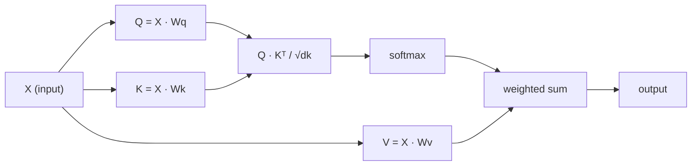

# 从零实现 Self-Attention

> Attention 是一张 lookup table，每个词都会问“谁对我重要？”并学习答案。

**类型：** Build
**语言：** Python
**先修：** Phase 3 (Deep Learning Core), Phase 5 Lesson 10 (Sequence-to-Sequence)
**时间：** ~90 分钟

## 学习目标

- 只用 NumPy 从零实现 scaled dot-product self-attention，包括 query/key/value projections 和 softmax-weighted sum
- 构建一个 multi-head attention layer，完成 heads 切分、parallel attention 计算和结果拼接
- 追踪 attention matrix 如何捕捉 token 关系，并解释为什么用 sqrt(d_k) 缩放能防止 softmax saturation
- 应用 causal masking，把 bidirectional attention 转换为 autoregressive（decoder-style）attention

## 要解决的问题

RNN 一次处理一个 token。到达 token 50 时，来自 token 1 的信息已经被挤过 50 次压缩步骤。长程依赖被压进固定大小的 hidden state，这个瓶颈不是再多 LSTM gating 就能完全解决的。

2014 年 Bahdanau attention 论文展示了修复方法：让 decoder 回看每个 encoder position，并决定哪些位置对当前 step 重要。但它仍然是接在 RNN 上的。2017 年 “Attention Is All You Need” 论文问了一个更尖锐的问题：如果 attention 是 *唯一* 机制会怎样？没有 recurrence。没有 convolution。只有 attention。

Self-attention 让序列中的每个位置在单个并行 step 中 attend 到每个其他位置。这正是 transformers 快速、可扩展并占据主导地位的原因。

## 核心概念

### 数据库查询类比

把 attention 想成一次软数据库查询：

```text
Traditional database:
  Query: "capital of France"  -->  exact match  -->  "Paris"

Attention:
  Query: "capital of France"  -->  similarity to ALL keys  -->  weighted blend of ALL values
```

每个 token 生成三个 vector：
- **Query (Q)**： “What am I looking for?”
- **Key (K)**： “What do I contain?”
- **Value (V)**： “What information do I provide if selected?”

query 与所有 keys 的 dot product 会产生 attention scores。高分意味着“这个 key 匹配我的 query”。这些 scores 会给 values 加权。输出是 values 的加权和。

### Q、K、V 计算

每个 token embedding 都通过三个 learned weight matrices 做 projection：

```text
Input embeddings (sequence of n tokens, each d-dimensional):

  X = [x1, x2, x3, ..., xn]       shape: (n, d)

Three weight matrices:

  Wq  shape: (d, dk)
  Wk  shape: (d, dk)
  Wv  shape: (d, dv)

Projections:

  Q = X @ Wq    shape: (n, dk)      each token's query
  K = X @ Wk    shape: (n, dk)      each token's key
  V = X @ Wv    shape: (n, dv)      each token's value
```

从一个 token 看，视觉上是这样：

```text
             Wq
  x_i ------[*]------> q_i    "What am I looking for?"
       |
       |     Wk
       +----[*]------> k_i    "What do I contain?"
       |
       |     Wv
       +----[*]------> v_i    "What do I offer?"
```

### Attention Matrix

一旦你为所有 token 得到 Q、K、V，attention scores 就形成一个矩阵：

```text
Scores = Q @ K^T    shape: (n, n)

              k1    k2    k3    k4    k5
        +-----+-----+-----+-----+-----+
   q1   | 2.1 | 0.3 | 0.1 | 0.8 | 0.2 |   <- how much q1 attends to each key
        +-----+-----+-----+-----+-----+
   q2   | 0.4 | 1.9 | 0.7 | 0.1 | 0.3 |
        +-----+-----+-----+-----+-----+
   q3   | 0.2 | 0.6 | 2.3 | 0.5 | 0.1 |
        +-----+-----+-----+-----+-----+
   q4   | 0.9 | 0.1 | 0.4 | 1.7 | 0.6 |
        +-----+-----+-----+-----+-----+
   q5   | 0.1 | 0.3 | 0.2 | 0.5 | 2.0 |
        +-----+-----+-----+-----+-----+

Each row: one token's attention over the entire sequence
```

一次看一个 query 扫过所有 keys：每一行给每个 token 打分，softmax 把分数变成权重，context vector 是 values 的加权混合。

```figure
attention-matrix
```

### 为什么要缩放？

dot products 会随维度 dk 增长。如果 dk = 64，dot products 可能落在几十的范围，把 softmax 推到梯度消失的区域。修复方法：除以 sqrt(dk)。

```text
Scaled scores = (Q @ K^T) / sqrt(dk)
```

这会把值保持在 softmax 能产生有用梯度的范围内。

### Softmax 把 scores 变成 weights

Softmax 把 raw scores 转换为每一行上的概率分布：

```text
Raw scores for q1:   [2.1, 0.3, 0.1, 0.8, 0.2]
                            |
                         softmax
                            |
Attention weights:   [0.52, 0.09, 0.07, 0.14, 0.08]   (sums to ~1.0)
```

现在每个 token 都有一组 weights，表示它应该在多大程度上 attend 到每个其他 token。

### Values 的加权和

每个 token 的最终输出是所有 value vectors 的加权和：

```text
output_i = sum( attention_weight[i][j] * v_j  for all j )

For token 1:
  output_1 = 0.52 * v1 + 0.09 * v2 + 0.07 * v3 + 0.14 * v4 + 0.08 * v5
```

### 完整 Pipeline



一行公式：

```text
Attention(Q, K, V) = softmax( Q @ K^T / sqrt(dk) ) @ V
```

## 动手实现

### Step 1：从零实现 Softmax

Softmax 把 raw logits 转换为 probabilities。为了 numerical stability，先减去最大值。

```python
import numpy as np

def softmax(x):
    shifted = x - np.max(x, axis=-1, keepdims=True)
    exp_x = np.exp(shifted)
    return exp_x / np.sum(exp_x, axis=-1, keepdims=True)

logits = np.array([2.0, 1.0, 0.1])
print(f"logits:  {logits}")
print(f"softmax: {softmax(logits)}")
print(f"sum:     {softmax(logits).sum():.4f}")
```

### Step 2：Scaled dot-product attention

核心函数。接收 Q、K、V matrices，并返回 attention output 和 weight matrix。

```python
def scaled_dot_product_attention(Q, K, V):
    dk = Q.shape[-1]
    scores = Q @ K.T / np.sqrt(dk)
    weights = softmax(scores)
    output = weights @ V
    return output, weights
```

### Step 3：带 learned projections 的 Self-attention class

一个完整 self-attention module，包含 Wq、Wk、Wv weight matrices，并用类似 Xavier 的 scaling 初始化。

```python
class SelfAttention:
    def __init__(self, d_model, dk, dv, seed=42):
        rng = np.random.default_rng(seed)
        scale = np.sqrt(2.0 / (d_model + dk))
        self.Wq = rng.normal(0, scale, (d_model, dk))
        self.Wk = rng.normal(0, scale, (d_model, dk))
        scale_v = np.sqrt(2.0 / (d_model + dv))
        self.Wv = rng.normal(0, scale_v, (d_model, dv))
        self.dk = dk

    def forward(self, X):
        Q = X @ self.Wq
        K = X @ self.Wk
        V = X @ self.Wv
        output, weights = scaled_dot_product_attention(Q, K, V)
        return output, weights
```

### Step 4：在一个句子上运行

为一个句子创建 fake embeddings，并观察 attention weights。

```python
sentence = ["The", "cat", "sat", "on", "the", "mat"]
n_tokens = len(sentence)
d_model = 8
dk = 4
dv = 4

rng = np.random.default_rng(42)
X = rng.normal(0, 1, (n_tokens, d_model))

attn = SelfAttention(d_model, dk, dv, seed=42)
output, weights = attn.forward(X)

print("Attention weights (each row: where that token looks):\n")
print(f"{'':>6}", end="")
for token in sentence:
    print(f"{token:>6}", end="")
print()

for i, token in enumerate(sentence):
    print(f"{token:>6}", end="")
    for j in range(n_tokens):
        w = weights[i][j]
        print(f"{w:6.3f}", end="")
    print()
```

### Step 5：用 ASCII heatmap 可视化 attention

把 attention weights 映射到字符，做一个快速视觉表示。

```python
def ascii_heatmap(weights, tokens, chars=" ░▒▓█"):
    n = len(tokens)
    print(f"\n{'':>6}", end="")
    for t in tokens:
        print(f"{t:>6}", end="")
    print()

    for i in range(n):
        print(f"{tokens[i]:>6}", end="")
        for j in range(n):
            level = int(weights[i][j] * (len(chars) - 1) / weights.max())
            level = min(level, len(chars) - 1)
            print(f"{'  ' + chars[level] + '   '}", end="")
        print()

ascii_heatmap(weights, sentence)
```

## 实际使用

PyTorch 的 `nn.MultiheadAttention` 做的正是我们构建的东西，外加 multi-head splitting 和 output projection：

```python
import torch
import torch.nn as nn

d_model = 8
n_heads = 2
seq_len = 6

mha = nn.MultiheadAttention(embed_dim=d_model, num_heads=n_heads, batch_first=True)

X_torch = torch.randn(1, seq_len, d_model)

output, attn_weights = mha(X_torch, X_torch, X_torch)

print(f"Input shape:            {X_torch.shape}")
print(f"Output shape:           {output.shape}")
print(f"Attention weight shape: {attn_weights.shape}")
print(f"\nAttn weights (averaged over heads):")
print(attn_weights[0].detach().numpy().round(3))
```

关键区别是：multi-head attention 会并行运行多个 attention functions，每个都有自己的 Q、K、V projections，大小为 dk = d_model / n_heads，然后拼接结果。这让模型能同时 attend 到不同关系类型。

## 交付成果

本课产出：
- `outputs/prompt-attention-explainer.md`：一个通过数据库查询类比解释 attention 的 prompt

## 练习

1. 修改 `scaled_dot_product_attention`，让它接受一个可选 mask matrix，在 softmax 前把某些位置设为 negative infinity（causal/decoder masking 就是这么做的）
2. 从零实现 multi-head attention：把 Q、K、V 切成 `n_heads` 个 chunks，在每个 head 上运行 attention，拼接，并通过最终 weight matrix Wo 做 projection
3. 取两个长度相同的不同句子，把它们喂给同一个 SelfAttention instance，并比较它们的 attention patterns。什么变了？什么保持不变？

## 关键术语

| Term | What people say | What it actually means |
|------|----------------|----------------------|
| Query (Q) | “The question vector” | 输入的 learned projection，表示这个 token 正在寻找什么信息 |
| Key (K) | “The label vector” | learned projection，表示这个 token 包含什么信息，用来和 queries 匹配 |
| Value (V) | “The content vector” | 携带实际信息的 learned projection，会基于 attention scores 被聚合 |
| Scaled dot-product attention | “The attention formula” | softmax(QK^T / sqrt(dk)) @ V；缩放防止高维 softmax saturation |
| Self-attention | “The token looks at itself and others” | Q、K、V 都来自同一序列的 attention，让每个位置 attend 到每个其他位置 |
| Attention weights | “How much focus” | 位置上的概率分布，由 scaled dot products 上的 softmax 产生 |
| Multi-head attention | “Parallel attention” | 用不同 projections 运行多个 attention functions，然后拼接结果以得到更丰富表示 |

## 延伸阅读

- [Attention Is All You Need (Vaswani et al., 2017)](https://arxiv.org/abs/1706.03762) - 原始 transformer 论文
- [The Illustrated Transformer (Jay Alammar)](https://jalammar.github.io/illustrated-transformer/) - 完整架构的最佳视觉 walkthrough
- [The Annotated Transformer (Harvard NLP)](https://nlp.seas.harvard.edu/annotated-transformer/) - 带解释的逐行 PyTorch implementation
