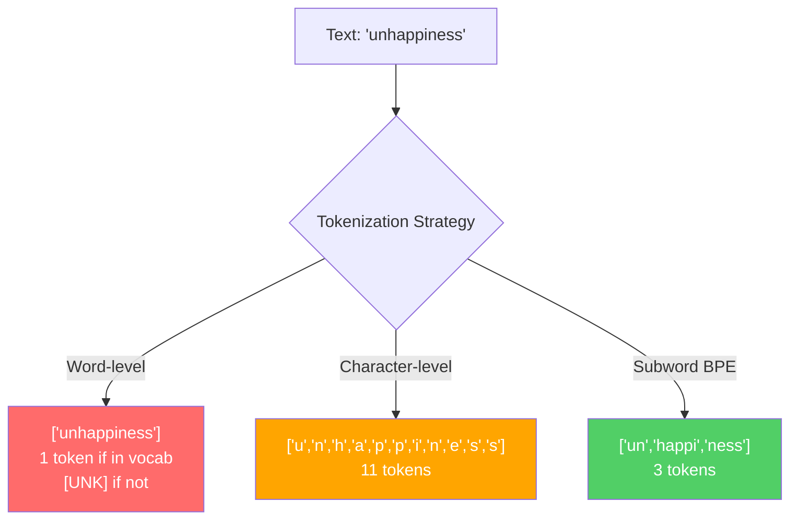
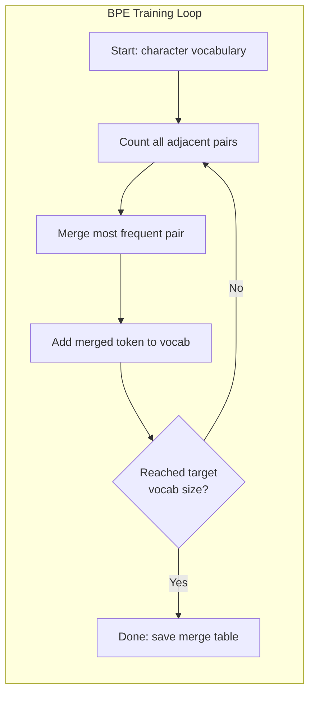
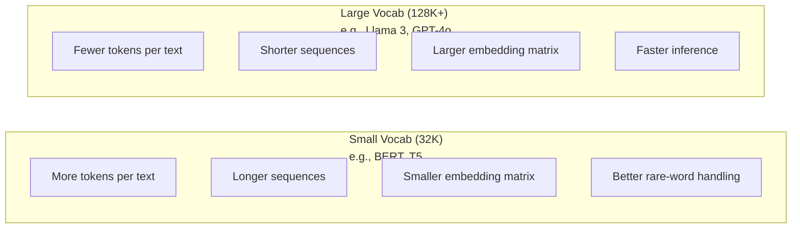

# 分词器：BPE、WordPiece、SentencePiece

> 你的 LLM 不读英文。它读整数。tokenizer 决定这些整数承载的是意义，还是浪费。

**类型:** Build
**语言:** Python
**先修:** Phase 05（NLP Foundations）
**时间:** ~90 分钟

## 学习目标

- 从零实现 BPE、WordPiece 和 Unigram tokenization 算法，并比较它们的 merge strategies
- 解释 vocabulary size 如何影响模型效率：太小会产生长序列，太大会浪费 embedding parameters
- 分析跨语言和代码中的 tokenization artifacts，识别特定 tokenizers 会在哪里失效
- 使用 tiktoken 和 sentencepiece 库 tokenize 文本，并检查生成的 token IDs

## 要解决的问题

你的 LLM 不读英文。它也不读任何语言。它读数字。

“Hello, world!” 和 [15496, 11, 995, 0] 之间的差距就是 tokenizer。每个单词、每个空格、每个标点都必须先转换成整数，模型才能处理。这个转换不是中立的。它会把假设烙进模型里，而且之后无法撤销。

做错了，模型就会浪费 capacity，用多个 tokens 编码常见词。“unfortunately” 变成四个 tokens，而不是一个。你的 128K context window 对多音节词密集文本来说刚刚缩水了 75%。做对了，同样的 context window 能容纳两倍的意义。“这个模型很会处理代码”和“这个模型一遇到 Python 就卡住”的差别，往往取决于 tokenizer 是如何训练的。

你对 GPT-4 或 Claude 发起的每次 API 调用都按 token 计价。模型生成的每个 token 都要花 compute。表示输出所需 token 越少，端到端 inference 越快。Tokenization 不是 preprocessing。它是 architecture。

## 核心概念

### 三种失败的方法（以及一种胜出的方法）

有三种显而易见的方法可以把文本转换成数字。其中两种无法规模化。

**Word-level tokenization** 按空格和标点切分。“The cat sat” 变成 ["The", "cat", "sat"]。简单。但 “tokenization” 怎么办？“GPT-4o” 呢？像 “Geschwindigkeitsbegrenzung” 这样的德语复合词呢？Word-level 需要巨大的 vocabulary，才能覆盖每种语言里的每个词。漏掉一个词，你就得到可怕的 `[UNK]` token：模型在说“我不知道这是什么”。仅英文就有超过一百万种词形。再加上代码、URL、科学计数法和 100 种其他语言，你需要无限 vocabulary。

**Character-level tokenization** 走向另一个方向。“hello” 变成 ["h", "e", "l", "l", "o"]。Vocabulary 很小（几百个字符）。永远没有 unknown tokens。但序列会变得极长。一个 word-level 下 10 个 tokens 的句子，可能变成 50 个 character-level tokens。模型必须学会 “t”、“h”、“e” 合起来表示 “the”：把 attention capacity 消耗在三岁小孩都会的事情上。

**Subword tokenization** 找到甜点区。常见词保持完整：“the” 是一个 token。稀有词拆成有意义的片段：“unhappiness” 变成 ["un", "happi", "ness"]。Vocabulary 保持可管理（30K 到 128K tokens）。序列保持较短。Unknown tokens 基本消失，因为任何词都可以由 subword pieces 构成。

每个现代 LLM 都使用 subword tokenization。GPT-2、GPT-4、BERT、Llama 3、Claude：全都是。问题在于用哪种算法。



### BPE：Byte Pair Encoding

BPE 是一种贪心压缩算法，被重新用于 tokenization。这个想法简单到可以写在索引卡上。

从单个字符开始。统计训练语料中的每个相邻 pair。把最频繁的 pair 合并成一个新 token。重复，直到达到目标 vocabulary size。

```figure
tokenizer-bpe
```

下面是在一个包含 “lower”、“lowest” 和 “newest” 的小语料上运行 BPE：

```text
Corpus (with word frequencies):
  "lower"  x5
  "lowest" x2
  "newest" x6

Step 0 -- Start with characters:
  l o w e r       (x5)
  l o w e s t     (x2)
  n e w e s t     (x6)

Step 1 -- Count adjacent pairs:
  (e,s): 8    (s,t): 8    (l,o): 7    (o,w): 7
  (w,e): 13   (e,r): 5    (n,e): 6    ...

Step 2 -- Merge most frequent pair (w,e) -> "we":
  l o we r        (x5)
  l o we s t      (x2)
  n e we s t      (x6)

Step 3 -- Recount and merge (e,s) -> "es":
  l o we r        (x5)
  l o we s t      (x2)    <- 'es' only forms from 'e'+'s', not 'we'+'s'
  n e we s t      (x6)    <- wait, the 'e' before 'we' and 's' after 'we'

Actually tracking this precisely:
  After "we" merge, remaining pairs:
  (l,o): 7   (o,we): 7   (we,r): 5   (we,s): 8
  (s,t): 8   (n,e): 6    (e,we): 6

Step 3 -- Merge (we,s) -> "wes" or (s,t) -> "st" (tied at 8, pick first):
  Merge (we,s) -> "wes":
  l o we r        (x5)
  l o wes t       (x2)
  n e wes t       (x6)

Step 4 -- Merge (wes,t) -> "west":
  l o we r        (x5)
  l o west        (x2)
  n e west        (x6)

...continue until target vocab size reached.
```

merge table 就是 tokenizer。要 encode 新文本，就按学习到的顺序应用 merges。训练语料决定哪些 merges 存在，而这个选择会永久塑造模型看到的内容。



### Byte-Level BPE（GPT-2、GPT-3、GPT-4）

标准 BPE 操作 Unicode 字符。Byte-level BPE 操作 raw bytes（0-255）。这给你一个正好 256 的 base vocabulary，能处理任何语言或编码，并且永远不会产生 unknown token。

GPT-2 引入了这种方法。base vocabulary 覆盖每个可能 byte。BPE merges 在它上面构建。OpenAI 的 tiktoken 库用这些 vocabulary sizes 实现 byte-level BPE：

- GPT-2：50,257 tokens
- GPT-3.5/GPT-4：~100,256 tokens（cl100k_base encoding）
- GPT-4o：200,019 tokens（o200k_base encoding）

### WordPiece（BERT）

WordPiece 看起来类似 BPE，但选择 merges 的方式不同。它不是用 raw frequency，而是最大化训练数据 likelihood：

```text
BPE merge criterion:      count(A, B)
WordPiece merge criterion: count(AB) / (count(A) * count(B))
```

BPE 问：“哪个 pair 出现最频繁？”WordPiece 问：“哪个 pair 共同出现得比偶然预期更频繁？”这个微妙差异会产生不同 vocabulary。WordPiece 偏好 co-occurrence 出乎意料的 merges，而不只是频繁的 merges。

WordPiece 还用 “##” 前缀标记 continuation subwords：

```text
"unhappiness" -> ["un", "##happi", "##ness"]
"embedding"   -> ["em", "##bed", "##ding"]
```

“##” 前缀告诉你这个 piece 延续了前一个 token。BERT 使用 vocabulary 为 30,522 tokens 的 WordPiece。每个 BERT 变体都是这样：DistilBERT；RoBERTa 的 tokenizer 实际上是 BPE，但 BERT 本身是 WordPiece。

### SentencePiece（Llama、T5）

SentencePiece 把输入视为原始 Unicode 字符流，包括 whitespace。没有 pre-tokenization step。没有关于 word boundaries 的语言特定规则。这让它真正 language-agnostic：它适用于中文、日文、泰文，以及其他不用空格分隔词的语言。

SentencePiece 支持两种算法：
- **BPE mode**：和标准 BPE 相同的 merge logic，应用于原始字符序列
- **Unigram mode**：从一个大 vocabulary 开始，迭代移除对整体 likelihood 影响最小的 tokens。BPE 的反向：prune 而不是 merge。

Llama 2 使用 vocabulary 为 32,000 tokens 的 SentencePiece BPE。T5 使用 32,000 tokens 的 SentencePiece Unigram。注意：Llama 3 切换为基于 tiktoken 的 byte-level BPE tokenizer，包含 128,256 tokens。

### Vocabulary Size 权衡

这是一个真实工程决策，并且有可测量后果。



具体数字。对于 128K vocabulary 和 4,096 维 embeddings，仅 embedding matrix 就是 128,000 x 4,096 = 5.24 亿参数。对于 32K vocabulary，它是 1.31 亿参数。仅 tokenizer 选择就造成 4 亿参数差异。

但更大的 vocabularies 会更激进地压缩文本。同一段英文 paragraph，在 32K vocabulary 下可能需要 100 tokens，在 128K vocabulary 下可能只需要 70 tokens。这意味着 generation 期间少 30% 的 forward passes。对服务数百万请求的模型来说，这是 compute cost 的直接下降。

趋势很清楚：vocabulary sizes 正在增长。GPT-2 使用 50,257。GPT-4 使用 ~100K。Llama 3 使用 128K。GPT-4o 使用 200K。

| Model | Vocab Size | Tokenizer Type | Avg Tokens per English Word |
|-------|-----------|----------------|---------------------------|
| BERT | 30,522 | WordPiece | ~1.4 |
| GPT-2 | 50,257 | Byte-level BPE | ~1.3 |
| Llama 2 | 32,000 | SentencePiece BPE | ~1.4 |
| GPT-4 | ~100,256 | Byte-level BPE | ~1.2 |
| Llama 3 | 128,256 | Byte-level BPE (tiktoken) | ~1.1 |
| GPT-4o | 200,019 | Byte-level BPE | ~1.0 |

### 多语言税

主要在英文上训练的 tokenizers 对其他语言很残酷。GPT-2 tokenizer 中韩文平均每个词 2-3 tokens。中文可能更糟。这意味着韩国用户实际上拥有的 context window 只有英文用户的一半：支付同样价格，却获得更低的信息密度。

这就是为什么 Llama 3 把 vocabulary 从 32K 扩到 128K。更多 tokens 专用于非英文 scripts，意味着跨语言 compression 更公平。

## 动手实现

### Step 1：Character-Level Tokenizer

从基础开始。character-level tokenizer 把每个字符映射到它的 Unicode code point。不需要训练。没有 unknown tokens。只是直接映射。

```python
class CharTokenizer:
    def encode(self, text):
        return [ord(c) for c in text]

    def decode(self, tokens):
        return "".join(chr(t) for t in tokens)
```

“hello” 变成 [104, 101, 108, 108, 111]。每个字符都是自己的 token。这是我们要改进的 baseline。

### Step 2：从零实现 BPE Tokenizer

真正的实现。我们在 raw bytes 上训练（像 GPT-2 一样），统计 pairs，合并最频繁者，并按顺序记录每个 merge。merge table 就是 tokenizer。

```python
from collections import Counter

class BPETokenizer:
    def __init__(self):
        self.merges = {}
        self.vocab = {}

    def _get_pairs(self, tokens):
        pairs = Counter()
        for i in range(len(tokens) - 1):
            pairs[(tokens[i], tokens[i + 1])] += 1
        return pairs

    def _merge_pair(self, tokens, pair, new_token):
        merged = []
        i = 0
        while i < len(tokens):
            if i < len(tokens) - 1 and tokens[i] == pair[0] and tokens[i + 1] == pair[1]:
                merged.append(new_token)
                i += 2
            else:
                merged.append(tokens[i])
                i += 1
        return merged

    def train(self, text, num_merges):
        tokens = list(text.encode("utf-8"))
        self.vocab = {i: bytes([i]) for i in range(256)}

        for i in range(num_merges):
            pairs = self._get_pairs(tokens)
            if not pairs:
                break
            best_pair = max(pairs, key=pairs.get)
            new_token = 256 + i
            tokens = self._merge_pair(tokens, best_pair, new_token)
            self.merges[best_pair] = new_token
            self.vocab[new_token] = self.vocab[best_pair[0]] + self.vocab[best_pair[1]]

        return self

    def encode(self, text):
        tokens = list(text.encode("utf-8"))
        for pair, new_token in self.merges.items():
            tokens = self._merge_pair(tokens, pair, new_token)
        return tokens

    def decode(self, tokens):
        byte_sequence = b"".join(self.vocab[t] for t in tokens)
        return byte_sequence.decode("utf-8", errors="replace")
```

训练循环是 BPE 的核心：统计 pairs，合并 winner，重复。每次 merge 都会减少总 token count。`num_merges` 轮之后，vocabulary 从 256（base bytes）增长到 256 + num_merges。

Encoding 会按照 merges 被学习到的精确顺序应用它们。这很重要。如果 merge 1 创建了 “th”，merge 5 创建了 “the”，encoding 必须先应用 merge 1，这样 “the” 才能在 merge 5 中由 “th” + “e” 形成。

Decoding 是反向过程：在 vocabulary 中查找每个 token ID，拼接 bytes，decode 为 UTF-8。

### Step 3：Encode 和 Decode Roundtrip

```python
corpus = (
    "The cat sat on the mat. The cat ate the rat. "
    "The dog sat on the log. The dog ate the frog. "
    "Natural language processing is the study of how computers "
    "understand and generate human language. "
    "Tokenization is the first step in any NLP pipeline."
)

tokenizer = BPETokenizer()
tokenizer.train(corpus, num_merges=40)

test_sentences = [
    "The cat sat on the mat.",
    "Natural language processing",
    "tokenization pipeline",
    "unhappiness",
]

for sentence in test_sentences:
    encoded = tokenizer.encode(sentence)
    decoded = tokenizer.decode(encoded)
    raw_bytes = len(sentence.encode("utf-8"))
    ratio = len(encoded) / raw_bytes
    print(f"'{sentence}'")
    print(f"  Tokens: {len(encoded)} (from {raw_bytes} bytes) -- ratio: {ratio:.2f}")
    print(f"  Roundtrip: {'PASS' if decoded == sentence else 'FAIL'}")
```

compression ratio 告诉你 tokenizer 有多有效。ratio 为 0.50 表示 tokenizer 把文本压缩到 raw bytes 一半数量的 tokens。越低越好。在训练语料上，ratio 会很好。在像 “unhappiness” 这样 out-of-distribution 的文本上（它没有出现在语料中），ratio 会更差：tokenizer 会回退到 character-level encoding 来处理没见过的 patterns。

### Step 4：和 tiktoken 比较

```python
import tiktoken

enc = tiktoken.get_encoding("cl100k_base")

texts = [
    "The cat sat on the mat.",
    "unhappiness",
    "Hello, world!",
    "def fibonacci(n): return n if n < 2 else fibonacci(n-1) + fibonacci(n-2)",
    "Geschwindigkeitsbegrenzung",
]

for text in texts:
    our_tokens = tokenizer.encode(text)
    tiktoken_tokens = enc.encode(text)
    tiktoken_pieces = [enc.decode([t]) for t in tiktoken_tokens]
    print(f"'{text}'")
    print(f"  Our BPE:   {len(our_tokens)} tokens")
    print(f"  tiktoken:  {len(tiktoken_tokens)} tokens -> {tiktoken_pieces}")
```

tiktoken 使用完全相同的算法，但在数百 GB 文本上用 100,000 merges 训练。算法是一样的。差别是训练数据和 merge 数量。你在一段 paragraph 上用 40 merges 训练出的 tokenizer，无法在大规模语料和 100K merges 上与 tiktoken 竞争。但机制相同。

### Step 5：Vocabulary Analysis

```python
def analyze_vocabulary(tokenizer, test_texts):
    total_tokens = 0
    total_chars = 0
    token_usage = Counter()

    for text in test_texts:
        encoded = tokenizer.encode(text)
        total_tokens += len(encoded)
        total_chars += len(text)
        for t in encoded:
            token_usage[t] += 1

    print(f"Vocabulary size: {len(tokenizer.vocab)}")
    print(f"Total tokens across all texts: {total_tokens}")
    print(f"Total characters: {total_chars}")
    print(f"Avg tokens per character: {total_tokens / total_chars:.2f}")

    print(f"\nMost used tokens:")
    for token_id, count in token_usage.most_common(10):
        token_bytes = tokenizer.vocab[token_id]
        display = token_bytes.decode("utf-8", errors="replace")
        print(f"  Token {token_id:4d}: '{display}' (used {count} times)")

    unused = [t for t in tokenizer.vocab if t not in token_usage]
    print(f"\nUnused tokens: {len(unused)} out of {len(tokenizer.vocab)}")
```

这会揭示 vocabulary 中的 Zipf distribution。少数 tokens 占主导（spaces、“the”、“e”）。大多数 tokens 很少使用。生产 tokenizers 会针对这个分布优化：常见 patterns 得到短 token IDs，稀有 patterns 得到更长表示。

## 实际使用

你的 scratch BPE 已经能工作。现在看看生产工具是什么样。

### tiktoken（OpenAI）

```python
import tiktoken

enc = tiktoken.get_encoding("cl100k_base")

text = "Tokenizers convert text to integers"
tokens = enc.encode(text)
print(f"Tokens: {tokens}")
print(f"Pieces: {[enc.decode([t]) for t in tokens]}")
print(f"Roundtrip: {enc.decode(tokens)}")
```

tiktoken 用 Rust 编写并带 Python bindings。它每秒可以 encode 数百万 tokens。同一个 BPE 算法，工业级实现。

### Hugging Face tokenizers

```python
from tokenizers import Tokenizer
from tokenizers.models import BPE
from tokenizers.trainers import BpeTrainer
from tokenizers.pre_tokenizers import ByteLevel

tokenizer = Tokenizer(BPE())
tokenizer.pre_tokenizer = ByteLevel()

trainer = BpeTrainer(vocab_size=1000, special_tokens=["<pad>", "<eos>", "<unk>"])
tokenizer.train(["corpus.txt"], trainer)

output = tokenizer.encode("The cat sat on the mat.")
print(f"Tokens: {output.tokens}")
print(f"IDs: {output.ids}")
```

Hugging Face tokenizers 库底层也是 Rust。它能在数秒内训练 GB 级语料上的 BPE。这是训练你自己的模型时会使用的工具。

### 加载 Llama 的 Tokenizer

```python
from transformers import AutoTokenizer

tokenizer = AutoTokenizer.from_pretrained("meta-llama/Llama-3.1-8B")

text = "Tokenizers are the unsung heroes of LLMs"
tokens = tokenizer.encode(text)
print(f"Token IDs: {tokens}")
print(f"Tokens: {tokenizer.convert_ids_to_tokens(tokens)}")
print(f"Vocab size: {tokenizer.vocab_size}")

multilingual = ["Hello world", "Hola mundo", "Bonjour le monde"]
for text in multilingual:
    ids = tokenizer.encode(text)
    print(f"'{text}' -> {len(ids)} tokens")
```

Llama 3 的 128K vocabulary 对非英文文本的压缩显著好于 GPT-2 的 50K vocabulary。你可以自己验证：用多种语言 encode 同一句子并统计 tokens。

## 交付成果

本课产出 `outputs/prompt-tokenizer-analyzer.md`：一个可复用 prompt，用于分析任意文本与模型组合的 tokenization efficiency。给它一段文本样本，它会告诉你哪个模型的 tokenizer 处理得最好。

## 练习

1. 修改 BPE tokenizer，让它在每个 merge step 打印 vocabulary。观察 “t” + “h” 如何变成 “th”，再看 “th” + “e” 如何变成 “the”。跟踪常见英文单词如何 piece by piece 地组装起来。

2. 向 BPE tokenizer 添加 special tokens（`<pad>`、`<eos>`、`<unk>`）。给它们分配 IDs 0、1、2，并相应平移其他 tokens。实现一个 pre-tokenization step，在运行 BPE 前按 whitespace 切分。

3. 实现 WordPiece merge criterion（likelihood ratio 而不是 frequency）。用相同语料和相同 merge 数训练 BPE 与 WordPiece。比较得到的 vocabularies：哪一个产生更有语言学意义的 subwords？

4. 构建一个 multilingual tokenizer efficiency benchmark。取英文、西班牙文、中文、韩文和阿拉伯文各 10 个句子。用 tiktoken（cl100k_base）tokenize，并测量平均 tokens per character。量化每种语言的“multilingual tax”。

5. 在更大的 corpus 上训练你的 BPE tokenizer（下载一篇 Wikipedia article）。调节 merge 数量，使同一文本上的 compression ratio 达到 tiktoken 的 10% 以内。这会迫使你理解 corpus size、merge count 与 compression quality 的关系。

## 关键术语

| 术语 | 大家常说 | 实际含义 |
|------|----------------|----------------------|
| Token | “一个词” | 模型 vocabulary 中的一个单位：可以是字符、subword、word 或 multi-word chunk |
| BPE | “某种压缩东西” | Byte Pair Encoding：迭代合并最频繁的相邻 token pair，直到达到目标 vocabulary size |
| WordPiece | “BERT 的 tokenizer” | 类似 BPE，但 merges 最大化 likelihood ratio count(AB)/(count(A)*count(B))，而不是 raw frequency |
| SentencePiece | “一个 tokenizer library” | 不做 pre-tokenization、直接操作 raw Unicode 的 language-agnostic tokenizer，支持 BPE 和 Unigram 算法 |
| Vocabulary size | “它认识多少词” | unique tokens 总数：GPT-2 有 50,257，BERT 有 30,522，Llama 3 有 128,256 |
| Fertility | “不是 tokenizer 术语” | 每个词的平均 token 数：衡量跨语言 tokenizer efficiency（1.0 是完美，3.0 表示模型要多做三倍工作） |
| Byte-level BPE | “GPT 的 tokenizer” | 在 raw bytes（0-255）而不是 Unicode 字符上运行的 BPE，保证任何输入都没有 unknown tokens |
| Merge table | “tokenizer 文件” | 训练期间学习到的有序 pair merges 列表：这就是 tokenizer，且顺序很重要 |
| Pre-tokenization | “按空格切分” | subword tokenization 之前应用的规则：whitespace splitting、digit separation、punctuation handling |
| Compression ratio | “tokenizer 有多高效” | 生成的 tokens 除以 input bytes：越低表示压缩越好、inference 越快 |

## 延伸阅读

- [Sennrich et al., 2016 -- "Neural Machine Translation of Rare Words with Subword Units"](https://arxiv.org/abs/1508.07909)：把 1994 年压缩算法变成现代 tokenization 基础、将 BPE 引入 NLP 的论文
- [Kudo & Richardson, 2018 -- "SentencePiece: A simple and language independent subword tokenizer"](https://arxiv.org/abs/1808.06226)：让 multilingual models 变得实用的 language-agnostic tokenization
- [OpenAI tiktoken repository](https://github.com/openai/tiktoken)：生产级 Rust BPE 实现，带 Python bindings，用于 GPT-3.5/4/4o
- [Hugging Face Tokenizers documentation](https://huggingface.co/docs/tokenizers)：具备 Rust 性能的生产级 tokenizer training
