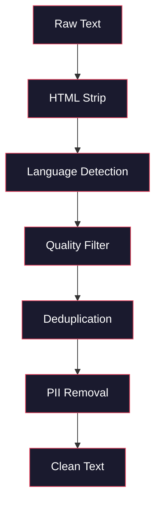
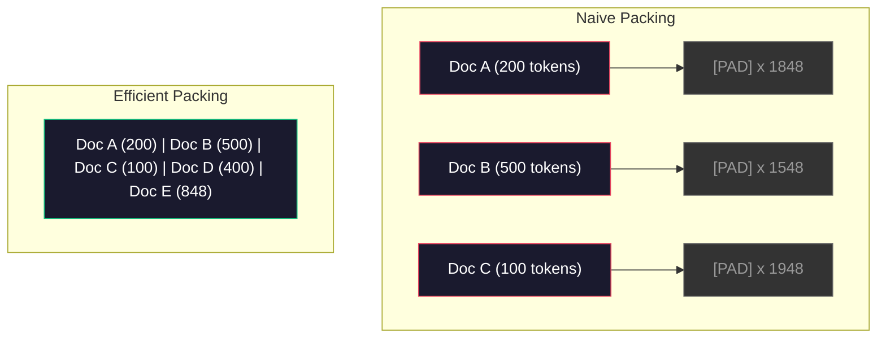

# Pre-Training 的数据管线

> 模型是一面镜子。它会反映你喂给它的数据。喂垃圾，它就会用完美流畅度反映垃圾。

**类型:** Build
**语言:** Python
**先修:** Phase 10, Lessons 01-02 (Tokenizers, Building a Tokenizer)
**时间:** ~90 minutes

## 学习目标

- 构建 streaming data pipeline，在不把 TB 级文本全部载入内存的情况下完成 tokenization、chunking、shuffling 和 batching
- 实现真实 pre-training pipelines 中使用的数据质量过滤器（deduplication、language detection、content filtering）
- 创建固定长度 training sequences，并正确处理 attention masks 与 document boundaries
- Profile pipeline throughput，确保 dataloader 能跟上 GPU training speed

## 要解决的问题

你有 tokenizer 了。现在你需要数据。

不是一个 dataset。不是一个 CSV file。而是 TB 级文本——cleaned、deduplicated、filtered for quality、tokenized into fixed-length sequences，并且以 randomized batches 的形式足够快地送出，让你的 8-GPU cluster 永远不用等下一批数据。

多数人以为训练 LLM 重点是 model architecture。不是。Llama 3 使用 15.6 trillion tokens。GPT-3 使用 300 billion。DeepSeek-V2 使用 8.1 trillion。三者架构大致相同：堆叠 transformer blocks，里面有 attention 和 feedforward layers。输出质量差异压倒性地来自数据。

DeepMind 的 Chinchilla 论文把这件事说得很精确。对于给定 compute budget，model parameters 与 training tokens 之间有一个最优比例。Chinchilla 证明，2022 年大多数模型都严重 undertrained——它们的参数量相对见过的数据太多。一个用 1.4 trillion tokens 训练的 70B parameter model（Chinchilla-optimal）超过了用 300 billion tokens 训练的 280B model（Gopher）。

你的 data pipeline 决定模型学到语言，还是学到噪声。

## 核心概念

### 数据从哪里来

每个 large language model 都在混合来源上训练。多数实验室严格保密确切配比，但我们已足够了解这些类别。

| Source | Size | Quality | Used By |
|--------|------|---------|---------|
| Common Crawl | ~250 TB raw | Low (needs heavy filtering) | GPT-3, Llama, most open models |
| Wikipedia | ~20 GB | High | Every major LLM |
| GitHub code | ~1 TB+ | Medium (lots of duplicates, dead code) | StarCoder, CodeLlama, DeepSeek-Coder |
| Books (BookCorpus, Pile) | ~100 GB | High | GPT-2, GPT-3, early models |
| Academic papers (arXiv, S2ORC) | ~100 GB | High for STEM | Llama, Galactica |
| StackOverflow, Reddit | ~100 GB | Medium | Llama, Falcon |
| Curated web (C4, RefinedWeb) | ~5 TB | Medium-High (pre-filtered) | T5, Falcon |

Llama 3 公开了自己的 data mix：大约 50% web data、25% code、13% books and academic papers、8% math data、4% multilingual web data。总量是来自超过 5 TB raw text 的 15.6 trillion tokens。

比例和总量一样重要。Web data 太多，模型会变成 Reddit parrot。Code 太少，它就不会编程。Math 太少，它就推理失败。调好这个 mix 是训练 LLM 最难的部分之一，而且没有公式——需要实验和评估。

### Data Cleaning

Raw web data 非常脏。典型 Common Crawl dump 包含：

- HTML tags 和 JavaScript
- Boilerplate headers、footers、navigation menus
- Duplicate pages（exact 和 near-duplicate）
- Machine-generated spam
- Personally identifiable information (PII)
- Low-quality text（keyword lists、SEO spam）
- 以文本形式编码的 non-text content

Cleaning 不是可选项。它决定模型是生成 coherent paragraphs，还是输出 HTML tags 与 product listings 的混合物。



每一步都会去掉一种噪声：

**HTML stripping:** 去除所有 markup。只保留可见文本内容。`trafilatura` 或 `readability` 这类库会提取 article content，同时丢弃 navigation、ads 和 boilerplate。

**Language detection:** 使用 fastText 的 language identification model（lid.176.bin）分类每个 document。只保留目标语言。一个被分类为 English 但 confidence 低于 0.8 的 document，很可能不是干净英语。

**Quality filtering:** 有趣的地方在这里。RefinedWeb（Falcon 背后的 dataset）使用 perplexity-based filter：先在 Wikipedia 上训练一个 small language model，再给每个 document 打分。High perplexity 表示 document 不像 Wikipedia——可能是 spam、keyword lists 或 machine-generated content。Perplexity 超过阈值的 documents 会被移除。

**Deduplication:** 最有影响力的 cleaning step。Common Crawl 包含海量重复页面——legal disclaimers、cookie notices、terms of service。在 duplicates 上训练浪费 compute，并可能让模型记忆和逐字吐出特定 passages。

**PII removal:** Names、email addresses、phone numbers、social security numbers。Structured PII 用 regex-based detection，上下文中的 names 用 NER models。

### Deduplication with MinHash

Exact deduplication 很容易：hash 每个 document，移除 duplicates。但 near-duplicates 才是真问题。同一篇新闻文章的两份副本，周围 ads 略有不同，就是 near-duplicates。内容 95% 相同，但 byte-for-byte 不同。

MinHash + Locality-Sensitive Hashing (LSH) 可以高效解决。


思路：

1. **Shingling:** 把每个 document 转成 n-grams 集合（例如 word 或 character 5-grams）。“the quick brown fox” 使用 3-word shingles 会变成 {"the quick brown", "quick brown fox"}。

2. **MinHash:** 对每个 document 的 shingle set 计算 k 个 hash values。每个 hash value 是在不同 hash function 下，所有 shingles 中的最小 hash。这会生成固定大小的 “signature”，用于近似任意两个 documents 的 Jaccard similarity。

3. **LSH:** 根据 MinHash signature 的 bands 把 documents 分桶。落入同一 bucket 的 documents 是 candidate near-duplicates。这避免比较所有 pairs——你只比较 candidates。

4. **Verify:** 对每个 candidate pair，计算 exact Jaccard similarity。如果 similarity 超过阈值（通常 0.8），移除一份。

Llama 团队报告称，通过 deduplication 移除了约 38% 的 web data。这不是小数。超过三分之一的 Common Crawl 是 duplicate 或 near-duplicate content。

### Sequence Packing

你的模型需要 fixed-length input sequences。你的 documents 是 variable length。有的 50 tokens。有的 50,000 tokens。

朴素方法：把每个 document pad 到最大 sequence length。这会把巨大 compute 浪费在对学习没有贡献的 padding tokens 上。

更好方法：把多个 documents pack 到同一个 sequence，用 end-of-sequence tokens 分隔。一个 2048-token sequence 可能包含三个短 documents，中间用 [EOS] tokens 连接。



Attention mask 必须正确设置。Document A 的 tokens 不应在同一个 packed sequence 内 attend to Document B 的 tokens。这需要 block-diagonal attention mask。

Long documents 会在 sequence boundaries 处被 truncate 或 split 成 chunks。Split point 很重要：mid-sentence split 会迫使模型看到不完整思想。有些 pipelines 会尽可能把 splits 对齐到 paragraph 或 sentence boundaries。

### The Chinchilla Scaling Law

对于固定 compute budget C（以 FLOPs 计），optimal model size N 与 dataset size D 遵循：

```text
N_opt ~ C^0.5
D_opt ~ C^0.5
```

实践中，这意味着你应该大致同等扩展 model size 和 dataset size。参数多 10x 的模型，需要大约多 10x 的 training tokens 才能达到相同 loss。

| Model | Parameters | Training Tokens | Chinchilla-Optimal? |
|-------|-----------|----------------|-------------------|
| GPT-3 | 175B | 300B | No (undertrained 3-4x) |
| Chinchilla | 70B | 1.4T | Yes (by design) |
| Llama 2 | 70B | 2T | Overtrained (intentionally) |
| Llama 3 | 70B | 15T | Heavily overtrained |

Llama 3 故意违反 Chinchilla law。Meta 发现，在更多数据上 overtraining——远超 compute-optimal ratio——会产生更适合 inference 的模型。额外训练成本只支付一次，但更小的模型可以永远更便宜地 serve。这有时称为 “inference-optimal” scaling approach，并从 2024 年起成为行业标准。

## 动手实现

### Step 1: Text Cleaning

Strip HTML、normalize whitespace、remove non-text content。我们会使用 public domain text（Project Gutenberg）作为小 corpus。

```python
import re

def clean_text(text):
    text = re.sub(r"<[^>]+>", "", text)
    text = re.sub(r"http\S+", "", text)
    text = re.sub(r"[^\x20-\x7E\n]", "", text)
    text = re.sub(r"\n{3,}", "\n\n", text)
    text = re.sub(r" {2,}", " ", text)
    return text.strip()

def quality_filter(text, min_words=50, max_ratio_caps=0.3, max_ratio_special=0.1):
    words = text.split()
    if len(words) < min_words:
        return False
    caps_ratio = sum(1 for w in words if w.isupper()) / len(words)
    if caps_ratio > max_ratio_caps:
        return False
    special_chars = sum(1 for c in text if not c.isalnum() and not c.isspace())
    if special_chars / max(len(text), 1) > max_ratio_special:
        return False
    return True
```

Quality filter 会抓住 SEO spam（ALL CAPS）、machine-generated noise（high special character ratio）和 stub pages（too short）。仅这三项检查就能从 web crawls 中移除惊人数目的垃圾。

### Step 2: MinHash Deduplication

从零实现 MinHash。不需要外部库——只用 `hashlib`。

```python
import hashlib
from collections import defaultdict

def get_shingles(text, k=5):
    words = text.lower().split()
    if len(words) < k:
        return set()
    return {" ".join(words[i:i+k]) for i in range(len(words) - k + 1)}

def minhash_signature(shingles, num_hashes=128):
    signature = []
    for i in range(num_hashes):
        min_hash = float("inf")
        for shingle in shingles:
            h = int(hashlib.sha256(f"{i}:{shingle}".encode()).hexdigest(), 16)
            min_hash = min(min_hash, h)
        signature.append(min_hash)
    return signature

def lsh_buckets(signature, bands=16):
    rows_per_band = len(signature) // bands
    buckets = []
    for b in range(bands):
        start = b * rows_per_band
        band_data = tuple(signature[start:start + rows_per_band])
        bucket_hash = hashlib.md5(str(band_data).encode()).hexdigest()
        buckets.append((b, bucket_hash))
    return buckets

def deduplicate(documents, threshold=0.8, num_hashes=128, bands=16):
    signatures = []
    shingle_sets = []
    for doc in documents:
        shingles = get_shingles(doc)
        shingle_sets.append(shingles)
        signatures.append(minhash_signature(shingles, num_hashes))

    bucket_map = defaultdict(list)
    for doc_idx, sig in enumerate(signatures):
        for band_id, bucket_hash in lsh_buckets(sig, bands):
            bucket_map[(band_id, bucket_hash)].append(doc_idx)

    duplicate_pairs = set()
    for bucket_docs in bucket_map.values():
        if len(bucket_docs) < 2:
            continue
        for i in range(len(bucket_docs)):
            for j in range(i + 1, len(bucket_docs)):
                duplicate_pairs.add((bucket_docs[i], bucket_docs[j]))

    removed = set()
    for i, j in duplicate_pairs:
        if i in removed or j in removed:
            continue
        s1, s2 = shingle_sets[i], shingle_sets[j]
        if not s1 or not s2:
            continue
        jaccard = len(s1 & s2) / len(s1 | s2)
        if jaccard >= threshold:
            removed.add(j)

    return [doc for idx, doc in enumerate(documents) if idx not in removed], len(removed)
```

`num_hashes=128` 和 `bands=16` 参数控制 precision-recall tradeoff。更多 hashes 给出更准确的 similarity estimates。更多 bands 提高 recall（捕获更多 duplicates），代价是更多 false positives。这些值对典型 web text 很好用。

### Step 3: Tokenize and Pack Sequences

取 clean、deduplicated text，tokenize 它，并 pack 成训练用 fixed-length sequences。

```python
def tokenize_corpus(documents, tokenizer):
    all_tokens = []
    for doc in documents:
        tokens = tokenizer.encode(doc)
        all_tokens.extend(tokens)
        all_tokens.append(tokenizer.eos_id)
    return all_tokens

def pack_sequences(token_ids, seq_length, pad_id=0):
    sequences = []
    attention_masks = []
    for i in range(0, len(token_ids), seq_length):
        seq = token_ids[i:i + seq_length]
        mask = [1] * len(seq)
        if len(seq) < seq_length:
            pad_count = seq_length - len(seq)
            seq = seq + [pad_id] * pad_count
            mask = mask + [0] * pad_count
        sequences.append(seq)
        attention_masks.append(mask)
    return sequences, attention_masks
```

### Step 4: DataLoader for Training

Yield randomized batches of packed sequences。这就是 training loop 消费的内容。

```python
import random

class PreTrainingDataLoader:
    def __init__(self, sequences, attention_masks, batch_size, shuffle=True):
        self.sequences = sequences
        self.attention_masks = attention_masks
        self.batch_size = batch_size
        self.shuffle = shuffle

    def __len__(self):
        return (len(self.sequences) + self.batch_size - 1) // self.batch_size

    def __iter__(self):
        indices = list(range(len(self.sequences)))
        if self.shuffle:
            random.shuffle(indices)
        for start in range(0, len(indices), self.batch_size):
            batch_idx = indices[start:start + self.batch_size]
            batch_seqs = [self.sequences[i] for i in batch_idx]
            batch_masks = [self.attention_masks[i] for i in batch_idx]
            yield batch_seqs, batch_masks
```

### Step 5: Dataset Statistics

计算真正重要的数字：total tokens、unique tokens、compression ratio、document length distribution。

```python
from collections import Counter

def compute_statistics(documents, token_ids, sequences, tokenizer_vocab_size):
    total_chars = sum(len(d) for d in documents)
    total_tokens = len(token_ids)
    unique_tokens = len(set(token_ids))
    compression_ratio = total_chars / total_tokens

    doc_lengths = [len(d.split()) for d in documents]
    avg_doc_length = sum(doc_lengths) / max(len(doc_lengths), 1)
    max_doc_length = max(doc_lengths) if doc_lengths else 0
    min_doc_length = min(doc_lengths) if doc_lengths else 0

    token_counts = Counter(token_ids)
    top_tokens = token_counts.most_common(10)

    non_pad_tokens = sum(sum(1 for t in seq if t != 0) for seq in sequences)
    total_positions = sum(len(seq) for seq in sequences)
    utilization = non_pad_tokens / max(total_positions, 1)

    stats = {
        "total_documents": len(documents),
        "total_characters": total_chars,
        "total_tokens": total_tokens,
        "unique_tokens": unique_tokens,
        "vocab_utilization": unique_tokens / tokenizer_vocab_size,
        "compression_ratio": compression_ratio,
        "avg_doc_length_words": avg_doc_length,
        "max_doc_length_words": max_doc_length,
        "min_doc_length_words": min_doc_length,
        "num_sequences": len(sequences),
        "sequence_utilization": utilization,
        "top_10_tokens": top_tokens,
    }
    return stats
```

Compression ratio 告诉你 tokenizer 在这个 corpus 上有多高效。English text 通常压缩到每 token 约 3-4 characters。如果你看到 1.5 characters per token，说明 tokenizer 切得太碎。如果看到 8+，说明它学到了非常 domain-specific merges。

Sequence utilization 告诉你 packed sequences 中有多少是真数据、多少是 padding。低于 90% 表示 packing 低效——你在 padding tokens 上浪费 compute。

## 实际使用

### Compare With HuggingFace Datasets

通过 HuggingFace 的 datasets library 加载同一个 corpus，并比较 pipeline speed。

```python
from datasets import load_dataset
from transformers import AutoTokenizer

ds = load_dataset("wikitext", "wikitext-2-raw-v1", split="train")
tokenizer = AutoTokenizer.from_pretrained("meta-llama/Meta-Llama-3-8B")

import time

start = time.time()
tokenized = ds.map(
    lambda x: tokenizer(x["text"], truncation=True, max_length=2048),
    batched=True,
    num_proc=4,
)
hf_time = time.time() - start
total_tokens = sum(len(t) for t in tokenized["input_ids"])
print(f"HuggingFace: {total_tokens:,} tokens in {hf_time:.2f}s ({total_tokens/hf_time:,.0f} tokens/sec)")
```

HuggingFace pipeline 底层使用 Rust tokenizers，并在 4 cores 上并行处理。你的纯 Python pipeline 会慢 10-50x。这种差距就是 production teams 使用 compiled tokenizers 的原因。算法相同。差别在实现语言。

## 交付成果

本课产出一个用于验证和调试 LLM training pipelines 数据质量的 prompt。见 `outputs/prompt-data-quality-checker.md`。

## 练习

1. **Easy:** 使用简单 heuristic（character set analysis）把 language detection 加到 cleaning pipeline 中。只保留 English documents，并测量移除了多少 documents。
2. **Medium:** 在 MinHash near-deduplication 之外，使用 SHA-256 hashes 实现 exact deduplication。在 web-scraped corpus 上比较两种方法捕获的 duplicates 数量。
3. **Hard:** 构建 perplexity-based quality filter。在 Wikipedia text 上训练 small bigram language model，为每个 document 计算 perplexity，并移除 bottom 20%。比较在 filtered vs unfiltered data 上训练时的 model output quality。

## 关键术语

| Term | What people say | What it actually means |
|------|----------------|----------------------|
| Common Crawl | “The internet” | 每月抓取 web 的 non-profit——约 250TB raw，是多数 LLM training data 的起点 |
| MinHash | “Some hashing trick” | 使用固定大小 signatures 估计 sets 的 Jaccard similarity 的技术——支持大规模 near-duplicate detection |
| LSH | “Locality-Sensitive Hashing” | 把相似 items 分到同一个 bucket 的方法——把 pairwise comparisons 从 O(n^2) 降到 near-linear |
| Sequence packing | “Concatenating documents” | 用正确 attention masks 把多个 documents 放入 fixed-length sequences——消除 padding waste |
| Chinchilla scaling | “Train on more data” | 对固定 compute budget，最佳性能要求 model size 与 training tokens 大致等比例扩展 |
| Fertility | “Tokens per word” | 每个 word 的平均 tokens 数——GPT-4 英语约 1.3，非拉丁 scripts 更高 |
| Data mixing | “Choosing training data” | Code vs text vs math vs multilingual data 的比例——没有公式，需要实验 |
| Perplexity filter | “Quality scoring” | 用 small language model 给 documents 打分——high perplexity 表示文本不像 clean reference data |
| Deduplication | “Removing copies” | 移除 exact 和 near-duplicate documents——通常移除 raw web data 的 30-40% |
| Attention mask | “Which tokens to look at” | 防止 packed sequences 中跨 document boundaries attention 的 binary mask |

## 延伸阅读

- [Hoffmann et al., 2022 -- Training Compute-Optimal Large Language Models (Chinchilla)](https://arxiv.org/abs/2203.15556) -- 改变我们思考 data scale 方式的论文
- [Penedo et al., 2023 -- The RefinedWeb Dataset for Falcon LLM](https://arxiv.org/abs/2306.01116) -- 如何把 Common Crawl filter 到高质量
- [Touvron et al., 2023 -- Llama 2: Open Foundation and Fine-Tuned Chat Models](https://arxiv.org/abs/2307.09288) -- Llama 2 的 data pipeline 细节
- [Lee et al., 2022 -- Deduplicating Training Data Makes Language Models Better](https://arxiv.org/abs/2107.06499) -- 为什么 deduplication 比你想象的重要
- [Broder, 1997 -- On the Resemblance and Containment of Documents](https://ieeexplore.ieee.org/document/666900) -- 原始 MinHash 论文
- [Meta, 2024 -- Llama 3 Technical Report](https://arxiv.org/abs/2407.21783) -- 15.6T tokens、data mixing ratios、filtering pipeline
