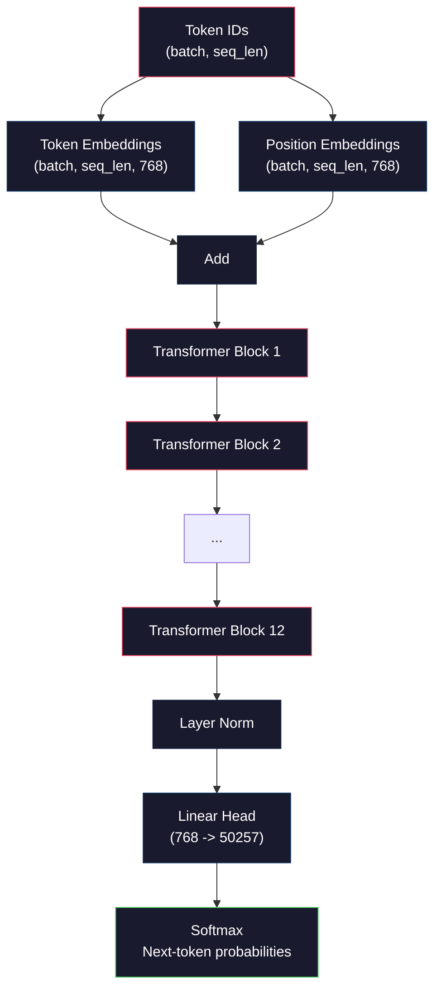
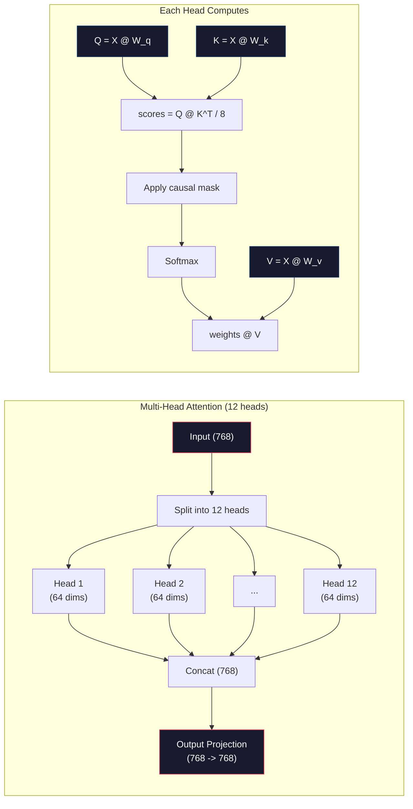
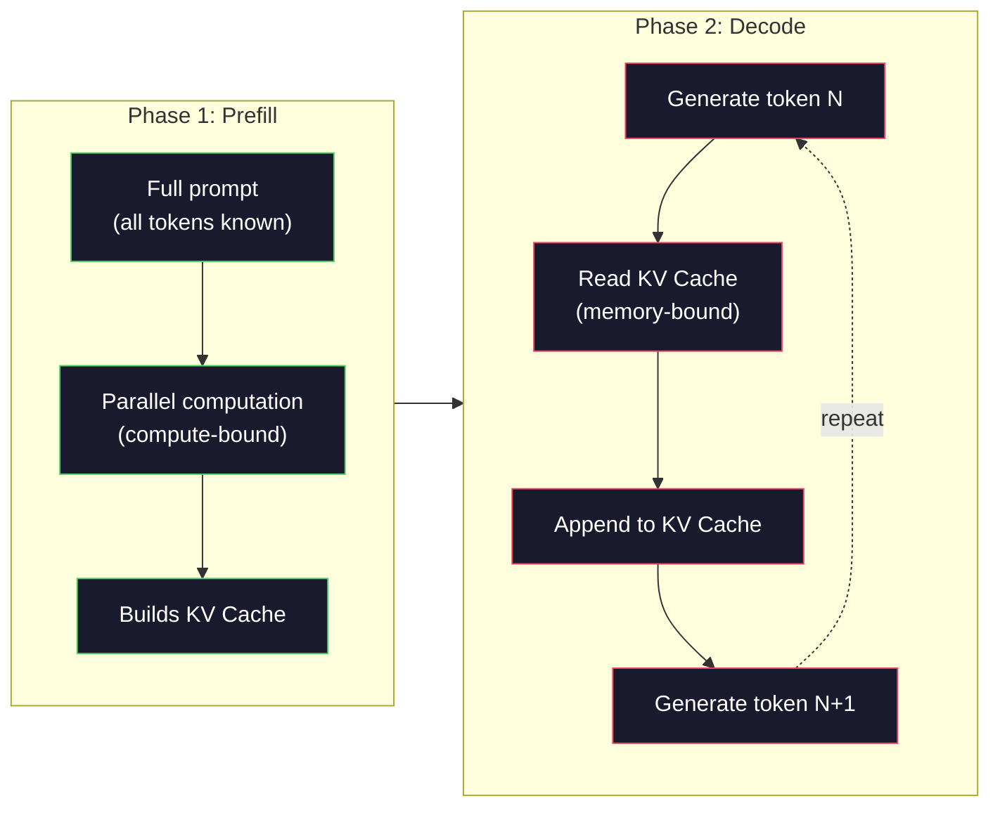

# Pre-Training 一个 Mini GPT（124M Parameters）

> GPT-2 Small 有 124 million parameters。那是 12 个 transformer layers、12 个 attention heads 和 768-dimensional embeddings。你可以在单张 GPU 上从零训练它，几个小时内完成。多数人从不这样做。他们使用 pre-trained checkpoints。但如果你没有亲手训练过一个，你其实并不了解自己正在构建产品所依赖的模型内部发生了什么。

**类型:** Build
**语言:** Python (with numpy)
**先修:** Phase 10, Lessons 01-03 (Tokenizers, Building a Tokenizer, Data Pipelines)
**时间:** ~120 minutes

## 学习目标

- 从零实现完整 GPT-2 architecture（124M parameters）：token embeddings、positional embeddings、transformer blocks 和 language model head
- 使用 next-token prediction 与 cross-entropy loss，在 text corpus 上训练 GPT model
- 实现 autoregressive text generation，包括 temperature sampling 和 top-k/top-p filtering
- 监控 training loss curves，并验证模型学到了 coherent language patterns

## 要解决的问题

你知道 transformer 是什么。你读过图。你能背出 “attention is all you need”，也能在白板上画出标着 “Multi-Head Attention” 的方框。

这些都不意味着你理解模型生成文本时发生了什么。

GPT-2 Small 中有 124,438,272 个参数（with weight tying）。每一个参数都是通过训练循环设定的：forward pass、compute loss、backward pass、update weights。十二个 transformer blocks。每个 block 十二个 attention heads。768-dimensional embedding space。50,257 tokens 的 vocabulary。每次模型生成一个 token，全部 124 million parameters 都参与一条 matrix multiplication chain，把 token IDs sequence 转成 next token 的 probability distribution。

如果你从没亲手构建过它，你就在使用黑箱。你可以调用 API。可以 fine-tune。但当事情出错——模型 hallucinate、重复自己、拒绝遵循 instructions——你没有关于*为什么*的 mental model。

本课从零构建 GPT-2 Small。不是 PyTorch。是 numpy。每一次 matrix multiplication 都可见。每个 gradient 都由你的代码计算。你会看见 124 million numbers 如何共同谋划去预测下一个词。

## 核心概念

### The GPT Architecture

GPT 是 autoregressive language model。“Autoregressive” 意味着它一次生成一个 token，每个 token 都 conditioned on 所有 previous tokens。架构是一叠 transformer decoder blocks。

从 token IDs 到 next-token probabilities 的完整 computation graph：

1. Token IDs 输入。Shape: (batch_size, seq_len)。
2. Token embedding lookup。每个 ID 映射为 768-dimensional vector。Shape: (batch_size, seq_len, 768)。
3. Position embedding lookup。每个位置（0, 1, 2, ...）映射为 768-dimensional vector。Shape 相同。
4. Add token embeddings + position embeddings。
5. 通过 12 个 transformer blocks。
6. Final layer normalization。
7. Linear projection 到 vocabulary size。Shape: (batch_size, seq_len, vocab_size)。
8. Softmax 得到 probabilities。

这就是整个模型。没有 convolutions。没有 recurrence。只有 embeddings、attention、feedforward networks 和 layer norms 堆叠 12 次。



### The Transformer Block

12 个 blocks 中每个都遵循同一模式。Pre-norm architecture（GPT-2 使用 pre-norm，而不是原始 transformer 的 post-norm）：

1. LayerNorm
2. Multi-Head Self-Attention
3. Residual connection（把 input 加回来）
4. LayerNorm
5. Feed-Forward Network (MLP)
6. Residual connection（把 input 加回来）

Residual connections 至关重要。没有它们，backpropagation 时 gradients 到达 block 1 前就会消失。有了它们，gradients 可以通过 “skip” path 从 loss 直接流到任意 layer。这就是你能堆 12、32，甚至 96 个 blocks 的原因（GPT-4 传闻使用 120 个）。

### Attention：核心机制

Self-attention 让每个 token 看向所有 previous tokens，并决定应该关注每个 token 多少。数学如下。

对每个 token position，从 input 计算三个 vectors：
- **Query (Q)**：“我在寻找什么？”
- **Key (K)**：“我包含什么？”
- **Value (V)**：“我携带什么信息？”

```text
Q = input @ W_q    (768 -> 768)
K = input @ W_k    (768 -> 768)
V = input @ W_v    (768 -> 768)

attention_scores = Q @ K^T / sqrt(d_k)
attention_scores = mask(attention_scores)   # causal mask: -inf for future positions
attention_weights = softmax(attention_scores)
output = attention_weights @ V
```

Causal mask 让 GPT 成为 autoregressive。Position 5 可以 attend to positions 0-5，但不能 attend to 6、7、8 等。这样模型在训练期间就不能通过看 future tokens “cheating”。

**Multi-head attention** 把 768-dimensional space 分成 12 个 heads，每个 64 dimensions。每个 head 学习不同 attention pattern。一个 head 可能追踪 syntactic relationships（subject-verb agreement）。另一个可能追踪 semantic similarity（synonyms）。另一个可能追踪 positional proximity（nearby words）。12 个 heads 的 outputs 被 concatenate，并投影回 768 dimensions。



除以 sqrt(d_k)——sqrt(64) = 8——是 scaling。没有它，高维 vectors 的 dot products 会变大，把 softmax 推入 gradients 几乎为零的区域。这是原始 “Attention Is All You Need” 论文中的关键 insight 之一。

### KV Cache：为什么 Inference 很快

训练时，你一次处理整个 sequence。推理时，你一次生成一个 token。如果没有优化，生成 token N 需要重新计算所有 N-1 个 previous tokens 的 attention。这是每个 generated token O(N^2)，或长度 N sequence 总计 O(N^3)。

KV Cache 解决这一点。为每个 token 计算 K 和 V 后存储它们。生成 token N+1 时，你只需要为新 token 计算 Q，并查找所有 previous tokens 的 cached K 和 V。这把 K 与 V 计算的 per-token cost 从 O(N) 降到 O(1)。Attention score calculation 仍然是 O(N)，因为你要 attend to 所有 previous positions，但避免了 input 上冗余 matrix multiplications。

对 12 layers、12 heads 的 GPT-2，KV cache 每 token 存储 2（K + V）x 12 layers x 12 heads x 64 dims = 18,432 values。1024-token sequence 在 FP32 下约 75MB。对 128 layers 的 Llama 3 405B，单个 sequence 的 KV cache 可能超过 10GB。这就是 long-context inference memory-bound 的原因。

### Prefill vs Decode：Inference 的两个阶段

向 LLM 发送 prompt 时，inference 分为两个明显阶段。

**Prefill** 并行处理你的整个 prompt。所有 tokens 已知，所以模型可以同时计算所有 positions 的 attention。这个阶段 compute-bound——GPU 正以满吞吐做 matrix multiplications。对 A100 上 1000-token prompt，prefill 大约 20-50ms。

**Decode** 一次生成一个 token。每个新 token 都依赖所有 previous tokens。这个阶段 memory-bound——bottleneck 是从 GPU memory 读取 model weights 和 KV cache，而不是 matrix math 本身。GPU compute cores 大多在等 memory reads。对 GPT-2，每个 decode step 需要的时间几乎与 matmuls 的 FLOPs 无关，因为 memory bandwidth 是约束。

这个区别对 production systems 很重要。Prefill throughput 随 GPU compute 扩展（更多 FLOPS = 更快 prefill）。Decode throughput 随 memory bandwidth 扩展（更快 memory = 更快 decode）。这也是 NVIDIA H100 相比 A100 重点提升 memory bandwidth 的原因——它会直接加速 token generation。



### The Training Loop

训练 LLM 就是 next-token prediction。给定 tokens [0, 1, 2, ..., N-1]，预测 tokens [1, 2, 3, ..., N]。Loss function 是模型预测 probability distribution 与实际 next token 之间的 cross-entropy。

一次 training step：

1. **Forward pass**：让 batch 通过全部 12 blocks。得到每个 position 的 logits（pre-softmax scores）。
2. **Compute loss**：logits 与 target tokens（输入向右 shift 一位）之间的 cross-entropy。
3. **Backward pass**：用 backpropagation 为全部 124M parameters 计算 gradients。
4. **Optimizer step**：更新 weights。GPT-2 使用 Adam，带 learning rate warmup 和 cosine decay。

Learning rate schedule 比你可能以为的更重要。GPT-2 在前 2,000 steps 从 0 warm up 到 peak learning rate，然后按 cosine curve decay。用高 learning rate 开始会让模型 diverge。后期保持恒定高 learning rate 会导致 oscillation。Warmup-then-decay 模式被每个 major LLM 使用。

### GPT-2 Small：数字

| Component | Shape | Parameters |
|-----------|-------|------------|
| Token embeddings | (50257, 768) | 38,597,376 |
| Position embeddings | (1024, 768) | 786,432 |
| Per-block attention (W_q, W_k, W_v, W_out) | 4 x (768, 768) | 2,359,296 |
| Per-block FFN (up + down) | (768, 3072) + (3072, 768) | 4,718,592 |
| Per-block LayerNorms (2x) | 2 x 768 x 2 | 3,072 |
| Final LayerNorm | 768 x 2 | 1,536 |
| **Total per block** | | **7,080,960** |
| **Total (12 blocks)** | | **85,054,464 + 39,383,808 = 124,438,272** |

Output projection（logits head）与 token embedding matrix 共享 weights。这称为 weight tying——它把 parameter count 减少 38M，并提升性能，因为它迫使模型对 input 和 output 使用同一 representation space。

## 动手实现

### Step 1: Embedding Layer

Token embeddings 把 50,257 个可能 tokens 中的每一个映射为 768-dimensional vector。Position embeddings 添加每个 token 在 sequence 中位置的信息。两者相加。

```python
import numpy as np

class Embedding:
    def __init__(self, vocab_size, embed_dim, max_seq_len):
        self.token_embed = np.random.randn(vocab_size, embed_dim) * 0.02
        self.pos_embed = np.random.randn(max_seq_len, embed_dim) * 0.02

    def forward(self, token_ids):
        seq_len = token_ids.shape[-1]
        tok_emb = self.token_embed[token_ids]
        pos_emb = self.pos_embed[:seq_len]
        return tok_emb + pos_emb
```

Initialization 的 0.02 standard deviation 来自 GPT-2 论文。太大时，初始 forward passes 会产生极端值并 destabilize training。太小时，初始 outputs 对所有 inputs 几乎相同，早期 gradient signals 会没用。

### Step 2: Self-Attention with Causal Mask

先做 single-head attention。Causal mask 在 softmax 前把 future positions 设为 negative infinity，确保每个 position 只能 attend to 自己和更早 positions。

```python
def attention(Q, K, V, mask=None):
    d_k = Q.shape[-1]
    scores = Q @ K.transpose(0, -1, -2 if Q.ndim == 4 else 1) / np.sqrt(d_k)
    if mask is not None:
        scores = scores + mask
    weights = np.exp(scores - scores.max(axis=-1, keepdims=True))
    weights = weights / weights.sum(axis=-1, keepdims=True)
    return weights @ V
```

Softmax implementation 会在 exponentiating 前减去 maximum。否则 exp(large_number) 会 overflow 到 infinity。这是 numerical stability trick，不改变输出，因为对任意 constant c，softmax(x - c) = softmax(x)。

### Step 3: Multi-Head Attention

把 768-dimensional input 拆成 12 个 heads，每个 64 dimensions。每个 head 独立计算 attention。Concatenate 结果并投影回 768 dimensions。

```python
class MultiHeadAttention:
    def __init__(self, embed_dim, num_heads):
        self.num_heads = num_heads
        self.head_dim = embed_dim // num_heads
        self.W_q = np.random.randn(embed_dim, embed_dim) * 0.02
        self.W_k = np.random.randn(embed_dim, embed_dim) * 0.02
        self.W_v = np.random.randn(embed_dim, embed_dim) * 0.02
        self.W_out = np.random.randn(embed_dim, embed_dim) * 0.02

    def forward(self, x, mask=None):
        batch, seq_len, d = x.shape
        Q = (x @ self.W_q).reshape(batch, seq_len, self.num_heads, self.head_dim).transpose(0, 2, 1, 3)
        K = (x @ self.W_k).reshape(batch, seq_len, self.num_heads, self.head_dim).transpose(0, 2, 1, 3)
        V = (x @ self.W_v).reshape(batch, seq_len, self.num_heads, self.head_dim).transpose(0, 2, 1, 3)

        scores = Q @ K.transpose(0, 1, 3, 2) / np.sqrt(self.head_dim)
        if mask is not None:
            scores = scores + mask
        weights = np.exp(scores - scores.max(axis=-1, keepdims=True))
        weights = weights / weights.sum(axis=-1, keepdims=True)
        attn_out = weights @ V

        attn_out = attn_out.transpose(0, 2, 1, 3).reshape(batch, seq_len, d)
        return attn_out @ self.W_out
```

reshape-transpose-reshape dance 是 multi-head attention 最容易混乱的部分。发生的是：`(batch, seq_len, 768)` tensor 变成 `(batch, seq_len, 12, 64)`，再变成 `(batch, 12, seq_len, 64)`。现在 12 个 heads 中每个都有自己的 `(seq_len, 64)` matrix 来运行 attention。Attention 后反向执行：`(batch, 12, seq_len, 64)` 变回 `(batch, seq_len, 12, 64)`，再变回 `(batch, seq_len, 768)`。

### Step 4: Transformer Block

一个完整 transformer block：LayerNorm、带 residual 的 multi-head attention、LayerNorm、带 residual 的 feedforward。

```python
class LayerNorm:
    def __init__(self, dim, eps=1e-5):
        self.gamma = np.ones(dim)
        self.beta = np.zeros(dim)
        self.eps = eps

    def forward(self, x):
        mean = x.mean(axis=-1, keepdims=True)
        var = x.var(axis=-1, keepdims=True)
        return self.gamma * (x - mean) / np.sqrt(var + self.eps) + self.beta


class FeedForward:
    def __init__(self, embed_dim, ff_dim):
        self.W1 = np.random.randn(embed_dim, ff_dim) * 0.02
        self.b1 = np.zeros(ff_dim)
        self.W2 = np.random.randn(ff_dim, embed_dim) * 0.02
        self.b2 = np.zeros(embed_dim)

    def forward(self, x):
        h = x @ self.W1 + self.b1
        h = np.maximum(0, h)  # GELU approximation: ReLU for simplicity
        return h @ self.W2 + self.b2


class TransformerBlock:
    def __init__(self, embed_dim, num_heads, ff_dim):
        self.ln1 = LayerNorm(embed_dim)
        self.attn = MultiHeadAttention(embed_dim, num_heads)
        self.ln2 = LayerNorm(embed_dim)
        self.ffn = FeedForward(embed_dim, ff_dim)

    def forward(self, x, mask=None):
        x = x + self.attn.forward(self.ln1.forward(x), mask)
        x = x + self.ffn.forward(self.ln2.forward(x))
        return x
```

Feedforward network 把 768-dimensional input 扩展到 3,072 dimensions（4x），应用 nonlinearity，再投影回 768。这种 expansion-contraction pattern 让模型在每个 position 上拥有更“宽”的内部表示可用。GPT-2 使用 GELU activation，但这里为了简单使用 ReLU——对理解 architecture 来说差异不大。

### Step 5: Full GPT Model

堆叠 12 个 transformer blocks。在前面加 embedding layer，在后面加 output projection。

```python
class MiniGPT:
    def __init__(self, vocab_size=50257, embed_dim=768, num_heads=12,
                 num_layers=12, max_seq_len=1024, ff_dim=3072):
        self.embedding = Embedding(vocab_size, embed_dim, max_seq_len)
        self.blocks = [
            TransformerBlock(embed_dim, num_heads, ff_dim)
            for _ in range(num_layers)
        ]
        self.ln_f = LayerNorm(embed_dim)
        self.vocab_size = vocab_size
        self.embed_dim = embed_dim

    def forward(self, token_ids):
        seq_len = token_ids.shape[-1]
        mask = np.triu(np.full((seq_len, seq_len), -1e9), k=1)

        x = self.embedding.forward(token_ids)
        for block in self.blocks:
            x = block.forward(x, mask)
        x = self.ln_f.forward(x)

        logits = x @ self.embedding.token_embed.T
        return logits

    def count_parameters(self):
        total = 0
        total += self.embedding.token_embed.size
        total += self.embedding.pos_embed.size
        for block in self.blocks:
            total += block.attn.W_q.size + block.attn.W_k.size
            total += block.attn.W_v.size + block.attn.W_out.size
            total += block.ffn.W1.size + block.ffn.b1.size
            total += block.ffn.W2.size + block.ffn.b2.size
            total += block.ln1.gamma.size + block.ln1.beta.size
            total += block.ln2.gamma.size + block.ln2.beta.size
        total += self.ln_f.gamma.size + self.ln_f.beta.size
        return total
```

注意 weight tying：`logits = x @ self.embedding.token_embed.T`。Output projection 复用 token embedding matrix（转置）。这不只是省参数技巧。它意味着模型用同一个 vector space 来理解 tokens（embeddings）和预测 tokens（output）。

### Step 6: Training Loop

真实训练 124M parameters 需要 GPU 和 PyTorch。这个 training loop 在可用纯 numpy 运行的小模型上展示机制。我们使用 tiny model（4 layers、4 heads、128 dims），让它可 tractable。

```python
def cross_entropy_loss(logits, targets):
    batch, seq_len, vocab_size = logits.shape
    logits_flat = logits.reshape(-1, vocab_size)
    targets_flat = targets.reshape(-1)

    max_logits = logits_flat.max(axis=-1, keepdims=True)
    log_softmax = logits_flat - max_logits - np.log(
        np.exp(logits_flat - max_logits).sum(axis=-1, keepdims=True)
    )

    loss = -log_softmax[np.arange(len(targets_flat)), targets_flat].mean()
    return loss


def train_mini_gpt(text, vocab_size=256, embed_dim=128, num_heads=4,
                   num_layers=4, seq_len=64, num_steps=200, lr=3e-4):
    tokens = np.array(list(text.encode("utf-8")[:2048]))
    model = MiniGPT(
        vocab_size=vocab_size, embed_dim=embed_dim, num_heads=num_heads,
        num_layers=num_layers, max_seq_len=seq_len, ff_dim=embed_dim * 4
    )

    print(f"Model parameters: {model.count_parameters():,}")
    print(f"Training tokens: {len(tokens):,}")
    print(f"Config: {num_layers} layers, {num_heads} heads, {embed_dim} dims")
    print()

    for step in range(num_steps):
        start_idx = np.random.randint(0, max(1, len(tokens) - seq_len - 1))
        batch_tokens = tokens[start_idx:start_idx + seq_len + 1]

        input_ids = batch_tokens[:-1].reshape(1, -1)
        target_ids = batch_tokens[1:].reshape(1, -1)

        logits = model.forward(input_ids)
        loss = cross_entropy_loss(logits, target_ids)

        if step % 20 == 0:
            print(f"Step {step:4d} | Loss: {loss:.4f}")

    return model
```

Loss 起始接近 ln(vocab_size)——对 256-token byte-level vocabulary，这就是 ln(256) = 5.55。Random model 给每个 token 分配相同概率。随着训练推进，loss 下降，因为模型学会预测常见模式：`"t"` 后的 `"h"`、句号后的空格，等等。

生产中，你会使用 Adam optimizer、gradient accumulation、learning rate warmup 和 gradient clipping。Forward-pass-loss-backward-update loop 完全相同。Optimizer 更复杂。

### Step 7: Text Generation

Generation 使用训练好的模型一次预测一个 token。每个 prediction 都从 output distribution 中 sample（或 greedily 取 argmax）。

```python
def generate(model, prompt_tokens, max_new_tokens=100, temperature=0.8):
    tokens = list(prompt_tokens)
    seq_len = model.embedding.pos_embed.shape[0]

    for _ in range(max_new_tokens):
        context = np.array(tokens[-seq_len:]).reshape(1, -1)
        logits = model.forward(context)
        next_logits = logits[0, -1, :]

        next_logits = next_logits / temperature
        probs = np.exp(next_logits - next_logits.max())
        probs = probs / probs.sum()

        next_token = np.random.choice(len(probs), p=probs)
        tokens.append(next_token)

    return tokens
```

Temperature 控制随机性。Temperature 1.0 使用 raw distribution。Temperature 0.5 会 sharpen（更 deterministic——模型更常选 top choices）。Temperature 1.5 会 flatten（更 random——低概率 tokens 得到更大机会）。Temperature 0.0 是 greedy decoding（总是选最高概率 token）。

`tokens[-seq_len:]` window 是必要的，因为模型有 maximum context length（GPT-2 是 1024）。超过它后，必须丢弃最旧 tokens。这就是每个人都在说的 “context window”。

## 实际使用

### Full Training and Generation Demo

```python
corpus = """The transformer architecture has revolutionized natural language processing.
Attention mechanisms allow the model to focus on relevant parts of the input.
Self-attention computes relationships between all pairs of positions in a sequence.
Multi-head attention splits the representation into multiple subspaces.
Each attention head can learn different types of relationships.
The feedforward network provides nonlinear transformations at each position.
Residual connections enable gradient flow through deep networks.
Layer normalization stabilizes training by normalizing activations.
Position embeddings give the model information about token ordering.
The causal mask ensures autoregressive generation during training.
Pre-training on large text corpora teaches the model general language understanding.
Fine-tuning adapts the pre-trained model to specific downstream tasks."""

model = train_mini_gpt(corpus, num_steps=200)

prompt = list("The transformer".encode("utf-8"))
output_tokens = generate(model, prompt, max_new_tokens=100, temperature=0.8)
generated_text = bytes(output_tokens).decode("utf-8", errors="replace")
print(f"\nGenerated: {generated_text}")
```

在小 corpus 和小模型上，generated text 最多半连贯。它会从 training text 学到一些 byte-level patterns，但不能像 GPT-2 那样用 40GB training data 和完整 124M parameter architecture 泛化。重点不是 output quality。重点是你能 trace 每一步：embedding lookup、attention computation、feedforward transformation、logit projection、softmax 和 sampling。每个 operation 都可见。

## 交付成果

本课产出 `outputs/prompt-gpt-architecture-analyzer.md`——一个分析任何 GPT-style model 架构选择的 prompt。给它 model card 或 technical report，它会拆解 parameter allocation、attention design 和 scaling decisions。

## 练习

1. 把模型改成 24 layers 和 16 heads，而不是 12/12。统计 parameters。Doubling depth 与 doubling width（embedding dimension）相比如何？

2. 实现 GELU activation function（GELU(x) = x * 0.5 * (1 + erf(x / sqrt(2))))，并替换 feedforward network 中的 ReLU。每种 activation 都训练 500 steps，比较 final loss。

3. 给 generation function 添加 KV cache。第一次 forward pass 后为每层存储 K 和 V tensors，并在后续 tokens 中复用。测量 speedup：分别用 cache 和不用 cache 生成 200 tokens，比较 wall-clock time。

4. 实现 top-k sampling（只考虑 k 个最高 probability tokens）和 top-p sampling（nucleus sampling：考虑 cumulative probability 超过 p 的最小 token set）。在 temperature 0.8 下比较 top-k=50 与 top-p=0.95 的 output quality。

5. 构建 training loss curve plotter。训练模型 1000 steps，并画 loss vs step。识别三个阶段：rapid initial descent（学习 common bytes）、slower middle phase（学习 byte patterns）和 plateau（在 small corpus 上 overfitting）。不管你训练 128-dim model 还是 GPT-4，这条曲线的形状相同。

## 关键术语

| Term | What people say | What it actually means |
|------|----------------|----------------------|
| Autoregressive | “一次生成一个词” | 每个 output token 都 conditioned on 所有 previous tokens——模型预测 P(token_n \| token_0, ..., token_{n-1}) |
| Causal mask | “它不能看未来” | 由 -infinity values 组成的 upper-triangular matrix，训练时防止 attention to future positions |
| Multi-head attention | “多种 attention patterns” | 把 Q、K、V 拆成并行 heads（例如 GPT-2 的 12 heads × 64 dims），让每个 head 学不同 relationship types |
| KV Cache | “为了速度的缓存” | 存储 previous tokens 计算出的 Key 和 Value tensors，避免 autoregressive generation 中的冗余计算 |
| Prefill | “处理 prompt” | 第一个 inference phase，所有 prompt tokens 并行处理——在 GPU FLOPS 上 compute-bound |
| Decode | “生成 tokens” | 第二个 inference phase，一次生成一个 token——在 GPU bandwidth 上 memory-bound |
| Weight tying | “共享 embeddings” | 用同一个 matrix 做 input token embeddings 和 output projection head——GPT-2 中节省 38M params |
| Residual connection | “Skip connection” | 把 input 直接加到 sublayer output 上（x + sublayer(x)）——让 gradients 能穿过深层 networks |
| Layer normalization | “Normalizing activations” | 沿 feature dimension normalize 到 mean 0、variance 1，并带 learnable scale 和 bias parameters |
| Cross-entropy loss | “预测错了多少” | -log(分配给正确 next token 的 probability)，对所有 positions 平均——标准 LLM training objective |

## 延伸阅读

- [Radford et al., 2019 -- "Language Models are Unsupervised Multitask Learners" (GPT-2)](https://cdn.openai.com/better-language-models/language_models_are_unsupervised_multitask_learners.pdf) -- 介绍 124M 到 1.5B parameter family 的 GPT-2 论文
- [Vaswani et al., 2017 -- "Attention Is All You Need"](https://arxiv.org/abs/1706.03762) -- 原始 transformer 论文，包含 scaled dot-product attention 和 multi-head attention
- [Llama 3 Technical Report](https://arxiv.org/abs/2407.21783) -- Meta 如何用 16K GPUs 把 GPT architecture 扩到 405B parameters
- [Pope et al., 2022 -- "Efficiently Scaling Transformer Inference"](https://arxiv.org/abs/2211.05102) -- formalized prefill vs decode 和 KV cache analysis 的论文
