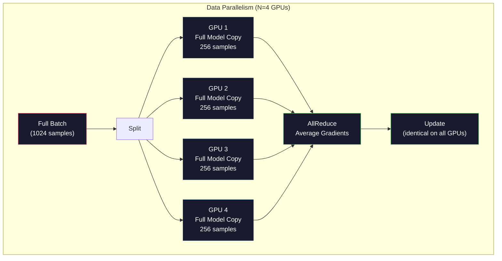
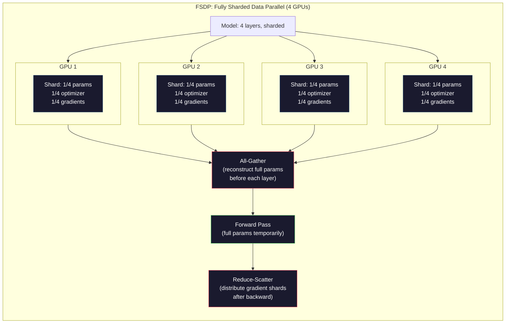
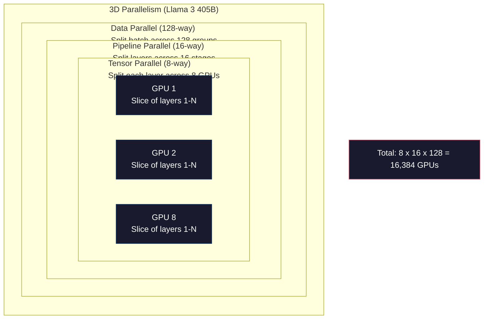

# Scaling：Distributed Training、FSDP、DeepSpeed

> 你的 124M model 可以在一张 GPU 上训练。现在试试 7 billion parameters。模型放不进内存。数据在单机上要跑数周。规模起来后，distributed training 不是可选项，而是唯一的前进路径。

**类型:** Build
**语言:** Python
**先修:** Phase 10, Lesson 04 (Pre-Training a Mini GPT)
**时间:** ~120 minutes

## 学习目标

- 解释三种 parallelism（data、tensor、pipeline），以及如何根据 model 和 cluster size 判断何时需要每一种
- 使用 PyTorch DDP 实现 data-parallel training，并在多张 GPUs 间同步 gradients
- 计算给定 model size 的 memory budget（weights + optimizer states + gradients + activations），确定最低硬件需求
- 配置 FSDP 或 DeepSpeed ZeRO stages，把 model states shard 到多张 GPUs 上，以容纳超过单卡内存的模型

## 要解决的问题

一个 7B parameter model 在 FP16 下，仅 weights 就需要 14GB。Adam optimizer 为每个 parameter 存储两份额外副本（first and second moment estimates），又是 28GB。Backpropagation 期间 gradients 再加 14GB。还没存一个 activation，你已经用了 56GB。

NVIDIA A100 有 80GB memory。

80GB 中 56GB 已被占用。剩下 24GB 给 activations——forward pass 中计算出的 intermediate values，它们必须保留到 backpropagation。对于 2048-token sequence、4096-dimensional model，单层 activations 约 64MB。32 layers 需要每 sample 2GB。Batch size 8 需要 16GB。你有 24GB。Batch size 12 就炸了。

现在试试 70B parameters。Weights alone：FP16 下 140GB。单 GPU 放不下。你至少需要 2 张 A100（2 x 80GB = 160GB）才能只存 weights。加上 optimizer states 和 gradients 后需要更多：最低 3+ GPUs，实际取决于 sharding strategy，通常是 8-16。

Llama 3 405B 在 16,384 张 NVIDIA H100 GPUs 上训练。训练运行估计花费 $100 million compute。DeepSeek V3 通过更聪明的 architecture（Mixture of Experts 意味着每 token 只激活一部分 parameters）和 training efficiency，用约 $5.6 million 训练了可比模型。

本课覆盖让 large-scale training 成为可能的四种策略：data parallelism、tensor parallelism、pipeline parallelism 和 fully sharded data parallelism。你会先用 pure Python 模拟每一种，理解机制，然后再接触 distributed training framework。

## 核心概念

### 为什么必须分布式

下面是真实模型的 memory math。每个数字都是计算出来的，不是估计。

| Model | Params | Weights (FP16) | Adam States | Gradients (FP16) | Total (no activations) |
|-------|--------|----------------|-------------|------------------|----------------------|
| GPT-2 Small | 124M | 248 MB | 992 MB | 248 MB | 1.5 GB |
| Llama 3 8B | 8B | 16 GB | 64 GB | 16 GB | 96 GB |
| Llama 3 70B | 70B | 140 GB | 560 GB | 140 GB | 840 GB |
| Llama 3 405B | 405B | 810 GB | 3,240 GB | 810 GB | 4,860 GB |

“Adam States” 列是杀手。Adam 为每个 parameter 存一个 running mean（m）和一个 running variance（v），二者都是 FP32。对 70B model，这是 70B x 4 bytes x 2 = 560GB。光 optimizer 就需要七张 A100。

单张 H100 有 80GB。Llama 3 405B 至少需要 61 张 H100 才能容纳 weights、optimizer 和 gradients。加上 activations，数字还会继续增长。Meta 使用 16,384 GPUs 不是因为他们想这么做，而是因为不得不这么做。

### Data Parallelism

最简单的 distributed strategy。把完整模型复制到 N 张 GPUs。把每个 training batch 拆成 N 等份。每张 GPU 在自己的 data shard 上跑 forward 和 backward pass。Backward 后，跨所有 GPUs 平均 gradients。每张 GPU 用同一个 averaged gradients 更新自己的 weight copy，使所有副本保持同步。

**The good:** Throughput 线性扩展。N 张 GPUs 每 step 处理 N 倍数据。Communication 仅限于 gradient averaging，并可与 computation overlap。

**The bad:** 每张 GPU 都持有完整 model、optimizer states 和 gradients。对 70B model，每张 GPU 需要 840GB。Data parallelism 不会降低 per-GPU memory。它只减少 training time。

**The math:** Effective batch size = per_gpu_batch_size x N。N=64 GPUs、per-GPU batch 16 时，effective batch 是 1,024。Llama 3 使用每 step 16 million tokens 的 effective batch size。



### Tensor Parallelism

把单个 layers 拆到多张 GPUs 上。一次 matrix multiplication 被分给多张 GPUs，每张计算结果的一部分。

考虑 feedforward layer 中形状为 (8192, 8192) 的 weight matrix。使用 4-way tensor parallelism 时，每张 GPU 持有一个 (8192, 2048) shard。每张 GPU 用 input 乘自己的 shard，产生 partial result。Partial results 通过 all-reduce 或 all-gather 合并成 full output。

**The good:** 降低每张 GPU 的 model weights memory。70B model 拆到 8 张 GPUs 上，意味着每张 GPU 约持有 8.75B parameters 的 weights。

**The bad:** 每层之后都需要快速 inter-GPU communication。每次 matmul 后的 all-reduce 会增加 latency。这在同节点 NVLink（GPUs 间 900 GB/s）上效果很好，但跨 InfiniBand 节点（400 Gb/s，约 50 GB/s）效果很差。Tensor parallelism 几乎总是限制在单节点内（8 GPUs）。

**Real usage:** Megatron-LM 率先使用 tensor parallelism。Llama 3 405B 在每个节点内使用 8-way tensor parallelism。

### Pipeline Parallelism

按 layers 拆分模型。GPU 1 运行 layers 1-8。GPU 2 运行 layers 9-16。GPU 3 运行 layers 17-24。GPU 4 运行 layers 25-32。Data 流经 pipeline：GPU 1 计算自己的 layers 并把 activations 发送给 GPU 2，GPU 2 计算自己的 layers 并发送给 GPU 3，如此继续。

**The good:** GPUs 之间 communication 很少——只传 layer boundaries 的 activations，它们比 gradients 或 weights 小得多。因为 bandwidth requirements 低，可以跨节点工作。

**The bad:** Pipeline bubbles。当 GPU 4 正在计算 micro-batch 1 的 forward pass 时，GPUs 1、2、3 是 idle（它们已经 forward 完自己的部分）。Backward pass 时模式反转。Naive pipelining 下，N 个 pipeline stages 的 GPU utilization 只有 1/N。

**GPipe and PipeDream** 通过把 batch 拆成 micro-batches 解决 bubble problem。GPU 1 一完成 micro-batch 1 的 forward，就开始 micro-batch 2。这会在 pipeline stages 之间 overlap computation。使用 M micro-batches 和 N stages 时，bubble fraction 降到 (N-1)/M。M=16、N=4 时，bubble 是 3/16 = 18.75% idle time。

### FSDP: Fully Sharded Data Parallel

FSDP 把 data parallelism 的 scalability 与 sharding 的 memory efficiency 结合起来。不是每张 GPU 持有完整模型，而是每张 GPU 只持有 parameters、gradients 和 optimizer states 的 1/N。

在某层 forward pass 之前，FSDP 运行 **all-gather**，从所有 GPUs 收集完整 parameters 到每张 GPU 的 memory。Forward pass 后，每张 GPU 丢弃 non-local parameters。Backward 期间再次 all-gather，以重构 parameters 用于 gradient computation。Backward 后，**reduce-scatter** 分发 gradient shards，让每张 GPU 只存储 gradients 的 1/N。

**70B model on 8 GPUs 的 math：**

| Component | Without FSDP | With FSDP |
|-----------|-------------|-----------|
| Weights (FP16) | 140 GB per GPU | 17.5 GB per GPU |
| Adam States (FP32) | 560 GB per GPU | 70 GB per GPU |
| Gradients (FP16) | 140 GB per GPU | 17.5 GB per GPU |
| **Total** | **840 GB per GPU** | **105 GB per GPU** |

没有 FSDP 时，70B model 放不进单张 80GB GPU。8 GPUs 上使用 FSDP 后，每张 GPU 仍用 105GB——等等，还是放不下。你至少需要 16 GPUs 才能低于 80GB per GPU，或者把 FSDP 与 activation checkpointing 结合（backward 时 recompute activations，而不是存储它们）。

Communication cost 高于 vanilla data parallelism，因为每层前都有 all-gather。但 memory savings 让原本不可能的 training runs 变得可能。



### DeepSpeed ZeRO

DeepSpeed 的 ZeRO（Zero Redundancy Optimizer）概念上与 FSDP 相同，但由 Microsoft 独立开发。它定义三个 stages，每个 stage 更激进地 sharding：

| Stage | Shards | Memory Savings | Communication |
|-------|--------|---------------|---------------|
| ZeRO-1 | Optimizer states only | ~4x reduction | Same as data parallel |
| ZeRO-2 | + Gradients | ~8x reduction | Slightly more |
| ZeRO-3 | + Parameters | ~Nx reduction (N GPUs) | All-gather per layer |

ZeRO-3 等价于 FSDP。命名不同，机制相同。DeepSpeed 证明概念后，PyTorch 添加了 FSDP native implementation。

DeepSpeed 还引入 ZeRO-Offload（把 optimizer states offload 到 CPU RAM，后者更便宜更大）和 ZeRO-Infinity（offload 到 NVMe SSDs）。这些用 compute speed 换 memory capacity——offloaded operations 更慢，但释放 GPU memory。

### Mixed Precision Training

现代训练同时使用多种 floating-point formats：

- **Forward pass**: FP16 或 BF16（16-bit）。内存是 FP32 的一半。Matmuls 在 tensor cores 上快 2x。
- **Master weights**: FP32（32-bit）。Optimizer 为 weight updates 的 numerical precision 维护它。
- **Loss scaling**: Backward pass 前把 loss 乘一个大常数，防止 FP16 gradients underflow 到 zero。Optimizer step 前再除回来。

BF16（Brain Float 16）与 FP32 有相同 exponent range（8 exponent bits），但 precision 更低（7 mantissa bits vs FP32 的 23）。它很少需要 loss scaling，因为能表示相同范围的值。FP16 有 5 exponent bits 和 10 mantissa bits——能表示细粒度值，但在极端 magnitude 下容易 overflow/underflow。

Google TPUs 原生使用 BF16。NVIDIA A100 和 H100 同时支持 FP16 与 BF16。行业已大体转向 BF16，因为它消除了 loss scaling 的麻烦。

**7B model 的 memory comparison：**

| Precision | Weights | Optimizer | Gradients | Total |
|-----------|---------|-----------|-----------|-------|
| FP32 everywhere | 28 GB | 56 GB | 28 GB | 112 GB |
| Mixed (BF16 + FP32 master) | 14 GB | 56 GB | 14 GB | 84 GB |

Mixed precision 为这个模型节省 28GB。Optimizer states 仍保持 FP32——大部分 memory 就在这里。

### Megatron-LM and 3D Parallelism

真实 large-scale training 会组合三种 parallelisms：

- **Data parallelism** 跨 node groups（scale batch size）
- **Tensor parallelism** 在节点内（把 layers 拆到 8 GPUs）
- **Pipeline parallelism** 跨节点（把 layer groups 拆到 machines）

Llama 3 405B on 16,384 H100s：
- 每个节点内 8-way tensor parallelism（每节点 8 GPUs）
- 跨节点 16-way pipeline parallelism（16 pipeline stages）
- 剩余维度上 128-way data parallelism（16,384 / 8 / 16 = 128）

这种 3D decomposition（8 x 16 x 128 = 16,384）就是扩展到数千 GPUs 的方式。每张 GPU 看到不同 data shard（data parallel），持有每层的一片（tensor parallel），并计算不同 layers 集合（pipeline parallel）。

DeepSeek V3 采用了不同路径。它的 Mixture of Experts architecture 每 token 只激活 671B parameters 中的 37B。这意味着每张 GPU 只需要 compute（并存储 activations）active parameters。它在 2,048 张 H800 GPUs 上训练——不到 Meta GPU 数量的 1/8——成本 $5.6M，而 Meta 估计 $100M。



## 动手实现

### Step 1: Simulate Data Parallelism

把 batch 拆到 simulated GPUs 上。每张 GPU 在自己的 shard 上计算 forward pass。平均 “gradients”（我们把它们模拟为 loss values）。

```python
import numpy as np

def simulate_data_parallelism(data, num_gpus, model_fn):
    batch_size = len(data)
    shard_size = batch_size // num_gpus
    remainder = batch_size % num_gpus

    gpu_losses = []
    gpu_gradients = []

    offset = 0
    for gpu_id in range(num_gpus):
        extra = 1 if gpu_id < remainder else 0
        shard = data[offset:offset + shard_size + extra]
        offset += shard_size + extra

        loss, grad = model_fn(shard)
        gpu_losses.append(loss)
        gpu_gradients.append(grad)

    avg_loss = np.mean(gpu_losses)
    avg_gradient = np.mean(gpu_gradients, axis=0)

    return avg_loss, avg_gradient
```

All-reduce operation（平均 gradients）是 data parallelism 中唯一 communication。实践中，这使用 NVIDIA GPUs 上的 NCCL library，后者实现 ring all-reduce：每张 GPU 把自己 gradients 的 1/N 发送给邻居，从另一邻居接收 1/N，N-1 steps 后每张 GPU 都拥有完整 average。总通信量：2 x gradient_size x (N-1)/N，大 N 下接近 gradient size 的 2x。

### Step 2: Simulate Tensor Parallelism

把 weight matrix 拆到 GPUs 上。每张 GPU 计算 partial matrix multiplication。合并结果。

```python
def simulate_tensor_parallelism(input_data, weight_matrix, num_gpus):
    d_in, d_out = weight_matrix.shape
    assert d_out % num_gpus == 0, f"d_out {d_out} not divisible by num_gpus {num_gpus}"
    shard_size = d_out // num_gpus

    partial_results = []
    for gpu_id in range(num_gpus):
        start = gpu_id * shard_size
        end = start + shard_size
        weight_shard = weight_matrix[:, start:end]

        partial = input_data @ weight_shard
        partial_results.append(partial)

    full_output = np.concatenate(partial_results, axis=-1)

    direct_output = input_data @ weight_matrix
    error = np.abs(full_output - direct_output).max()

    return full_output, error
```

Error 应该正好为 zero（或 machine epsilon）。Tensor parallelism 数学上精确——它产生与在单张 GPU 上计算完整 matmul 相同的结果。Split 沿 output dimension，因此每张 GPU 产生不同 columns chunk，concatenation 重建 full result。

Column-parallel linear layers（split output dimension）使用 concatenate。Row-parallel（split input dimension）使用 sum。在 transformer FFN 中，第一个 linear（expand）使用 column-parallel，第二个 linear（contract）使用 row-parallel。这避免了两层之间的一次 all-reduce。

### Step 3: Simulate Pipeline Parallelism

把 model layers 拆到 virtual GPUs。展示 bubble problem：早期 stages 在后期 stages 计算时 idle。

```python
def simulate_pipeline_parallelism(num_layers, num_stages, num_microbatches):
    layers_per_stage = num_layers // num_stages

    timeline = {}
    clock = 0

    for mb in range(num_microbatches):
        for stage in range(num_stages):
            start_time = max(
                timeline.get((stage, mb - 1, "fwd"), (0, 0))[1] if mb > 0 else 0,
                timeline.get((stage - 1, mb, "fwd"), (0, 0))[1] if stage > 0 else 0,
            )
            end_time = start_time + layers_per_stage
            timeline[(stage, mb, "fwd")] = (start_time, end_time)

    last_fwd_end = max(v[1] for v in timeline.values())

    for mb in range(num_microbatches - 1, -1, -1):
        for stage in range(num_stages - 1, -1, -1):
            deps = [last_fwd_end]
            if mb < num_microbatches - 1 and (stage, mb + 1, "bwd") in timeline:
                deps.append(timeline[(stage, mb + 1, "bwd")][1])
            if stage < num_stages - 1 and (stage + 1, mb, "bwd") in timeline:
                deps.append(timeline[(stage + 1, mb, "bwd")][1])
            start_time = max(deps)
            end_time = start_time + layers_per_stage
            timeline[(stage, mb, "bwd")] = (start_time, end_time)

    total_time = max(v[1] for v in timeline.values())
    compute_time = num_microbatches * num_stages * layers_per_stage * 2
    bubble_fraction = 1.0 - compute_time / (total_time * num_stages)

    return timeline, total_time, bubble_fraction
```

4 stages、1 micro-batch 时，bubble fraction 是 75%——任何时刻四张 GPUs 中有三张 idle。16 micro-batches 时，它降到约 19%。消除 bubbles 的成本是 memory：你必须同时存储所有 in-flight micro-batches 的 activations。

### Step 4: Memory Calculator

计算训练任意 model size 的精确 memory requirements。

```python
def memory_calculator(
    params_billions,
    precision_bytes=2,
    optimizer="adam",
    num_gpus=1,
    sharding="none",
    sequence_length=2048,
    batch_size_per_gpu=1,
    hidden_dim=None,
    num_layers=None,
):
    params = params_billions * 1e9

    weight_memory = params * precision_bytes

    if optimizer == "adam":
        optimizer_memory = params * 4 * 2
    elif optimizer == "sgd":
        optimizer_memory = params * 4
    else:
        optimizer_memory = 0

    gradient_memory = params * precision_bytes

    total_no_activation = weight_memory + optimizer_memory + gradient_memory

    if hidden_dim and num_layers:
        activation_per_layer = (
            sequence_length * batch_size_per_gpu * hidden_dim * precision_bytes * 4
        )
        activation_memory = activation_per_layer * num_layers
    else:
        activation_memory = params * precision_bytes * 0.5

    if sharding == "fsdp" or sharding == "zero3":
        weight_memory /= num_gpus
        optimizer_memory /= num_gpus
        gradient_memory /= num_gpus
    elif sharding == "zero2":
        optimizer_memory /= num_gpus
        gradient_memory /= num_gpus
    elif sharding == "zero1":
        optimizer_memory /= num_gpus

    per_gpu_total = weight_memory + optimizer_memory + gradient_memory + activation_memory

    return {
        "params_billions": params_billions,
        "weights_gb": weight_memory / 1e9,
        "optimizer_gb": optimizer_memory / 1e9,
        "gradients_gb": gradient_memory / 1e9,
        "activations_gb": activation_memory / 1e9,
        "per_gpu_total_gb": per_gpu_total / 1e9,
        "total_across_gpus_gb": per_gpu_total * num_gpus / 1e9,
        "fits_on_80gb": per_gpu_total / 1e9 <= 80,
        "num_gpus": num_gpus,
        "sharding": sharding,
    }
```

这个 calculator 回答每个 ML engineer 都会问的问题：“我需要多少 GPUs？” 输入 model size，看它是否 fit。调整 sharding strategy，直到 per-GPU total 降到 80GB 以下。

### Step 5: Mixed Precision Simulation

比较 FP32、FP16 和 mixed precision training 的 memory usage。

```python
def mixed_precision_comparison(params_billions):
    params = params_billions * 1e9

    fp32_weights = params * 4
    fp32_optimizer = params * 4 * 2
    fp32_gradients = params * 4
    fp32_total = fp32_weights + fp32_optimizer + fp32_gradients

    fp16_weights = params * 2
    fp16_master = params * 4
    fp16_optimizer = params * 4 * 2
    fp16_gradients = params * 2
    fp16_total = fp16_weights + fp16_master + fp16_optimizer + fp16_gradients

    mixed_weights = params * 2
    mixed_optimizer = params * 4 * 2
    mixed_gradients = params * 2
    mixed_total = mixed_weights + mixed_optimizer + mixed_gradients

    return {
        "fp32_total_gb": fp32_total / 1e9,
        "fp16_with_master_gb": fp16_total / 1e9,
        "mixed_bf16_gb": mixed_total / 1e9,
        "savings_vs_fp32": 1 - mixed_total / fp32_total,
    }
```

多数人最意外的一点：mixed precision 不会把 memory 减半。Optimizer states（Adam 的 m 和 v）无论 precision 如何都保持 FP32。7B model 的 FP32 training 用 112GB。Mixed precision 用 84GB。这是 25% reduction，不是 50%。Optimizer 占主导。

## 实际使用

### Run All Simulations

```python
def run_all_demos():
    print("=" * 70)
    print("DATA PARALLELISM SIMULATION")
    print("=" * 70)

    np.random.seed(42)
    data = np.random.randn(64, 32)
    weight = np.random.randn(32, 16)

    def model_fn(batch):
        output = batch @ weight
        loss = np.mean(output ** 2)
        grad = 2 * batch.T @ (batch @ weight) / len(batch)
        return loss, grad

    for n_gpus in [1, 2, 4, 8]:
        loss, grad = simulate_data_parallelism(data, n_gpus, model_fn)
        print(f"  {n_gpus} GPUs: loss={loss:.4f}, grad_norm={np.linalg.norm(grad):.4f}")

    print()
    print("=" * 70)
    print("TENSOR PARALLELISM SIMULATION")
    print("=" * 70)

    x = np.random.randn(4, 8192)
    W = np.random.randn(8192, 8192)

    for n_gpus in [1, 2, 4, 8]:
        output, error = simulate_tensor_parallelism(x, W, n_gpus)
        print(f"  {n_gpus} GPUs: output_shape={output.shape}, max_error={error:.2e}")

    print()
    print("=" * 70)
    print("PIPELINE PARALLELISM SIMULATION")
    print("=" * 70)

    for n_mb in [1, 4, 8, 16, 32]:
        _, total_t, bubble = simulate_pipeline_parallelism(32, 4, n_mb)
        print(f"  {n_mb:2d} micro-batches: total_time={total_t:4d}, bubble={bubble:.1%}")

    print()
    print("=" * 70)
    print("MEMORY CALCULATOR")
    print("=" * 70)

    configs = [
        (7, "none", 1),
        (7, "fsdp", 8),
        (70, "none", 1),
        (70, "fsdp", 8),
        (70, "fsdp", 16),
        (405, "fsdp", 64),
        (405, "fsdp", 128),
    ]

    print(f"  {'Model':>8} {'Sharding':>8} {'GPUs':>5} {'Per-GPU':>10} {'Fits 80GB':>10}")
    print("  " + "-" * 50)
    for params, shard, gpus in configs:
        result = memory_calculator(params, num_gpus=gpus, sharding=shard)
        fits = "Yes" if result["fits_on_80gb"] else "No"
        print(f"  {params:>6}B {shard:>8} {gpus:>5} {result['per_gpu_total_gb']:>8.1f}GB {fits:>10}")

    print()
    print("=" * 70)
    print("MIXED PRECISION COMPARISON")
    print("=" * 70)

    for params_b in [7, 13, 70, 405]:
        result = mixed_precision_comparison(params_b)
        print(f"  {params_b}B: FP32={result['fp32_total_gb']:.0f}GB, "
              f"Mixed BF16={result['mixed_bf16_gb']:.0f}GB, "
              f"Savings={result['savings_vs_fp32']:.0%}")
```

## 交付成果

本课产出 `outputs/prompt-distributed-training-planner.md`——一个接收 model size 和 available hardware 后生成完整 distributed training plan 的 prompt：parallelism strategy、memory budget、communication overhead 和 expected throughput。

## 练习

1. 修改 memory calculator，使其包含 activation checkpointing。使用 checkpointing 时，只在每第 K 层存 activations（典型 K=1，表示全部 recompute）。展示 memory-compute tradeoff：checkpointing 节省多少 memory？又会让训练慢多少（full checkpointing 大约多 33% compute）？

2. 扩展 pipeline parallelism simulation，实现 PipeDream 使用的 1F1B（one forward, one backward）schedule。对 4 stages 和 8 micro-batches，与 naive schedule 比较 bubble fraction。1F1B schedule 应有更小 peak memory，因为它更早启动 backward passes。

3. 实现 gradient accumulation simulator。不要每个 micro-batch 后 all-reduce，而是在本地累积 gradients K steps 后再 all-reduce。展示这会把 communication 降低 K 倍，同时产生完全相同 final gradients（因此训练相同）。

4. 构建 cost estimator。给定 model size、target token count、GPU type（A100 at $2/hr, H100 at $3.50/hr）和 parallelism strategy，估算总 training cost。用已知 costs 验证：Llama 3 405B reportedly cost ~$100M，DeepSeek V3 cost ~$5.6M。

5. 给 memory calculator 添加 ZeRO-Offload。假设每节点 CPU RAM 512GB、NVMe 2TB。展示把 optimizer states offload 到 CPU 后，70B model 如何能在 4 GPUs 而不是 16 GPUs 上训练，代价是 optimizer steps 慢 30-50%。

## 关键术语

| Term | What people say | What it actually means |
|------|----------------|----------------------|
| Data parallelism | “Copy the model to every GPU” | 每张 GPU 处理不同 data shard；每 step 后通过 all-reduce 平均 gradients |
| Tensor parallelism | “Split a layer across GPUs” | Partition weight matrices，使每张 GPU 计算 matmul 的一部分；需要快速 NVLink interconnect |
| Pipeline parallelism | “Split layers across GPUs” | 每张 GPU 运行不同 layer group；data 通过 pipeline，并用 micro-batches 减少 bubbles |
| FSDP | “Shard everything” | Fully Sharded Data Parallel——每张 GPU 持有 weights、gradients、optimizer states 的 1/N；compute 前 all-gather |
| ZeRO | “DeepSpeed's version of FSDP” | Zero Redundancy Optimizer，有 3 stages：shard optimizer（Stage 1）、+ gradients（Stage 2）、+ parameters（Stage 3） |
| All-reduce | “Average across GPUs” | Collective operation，使每张 GPU 最终得到所有 GPUs inputs 的 sum（或 average）——通常实现为 ring all-reduce |
| All-gather | “Collect from all GPUs” | Collective operation，使每张 GPU 最终得到所有 GPUs data 的 concatenation——FSDP 用它重构 full parameters |
| Reduce-scatter | “Sum and distribute” | Collective operation，reduce（sum）data 并把不同 chunks scatter 到不同 GPUs——FSDP 用于 gradient sharding |
| Mixed precision | “Train in half precision” | Forward/backward 用 FP16/BF16，optimizer states 用 FP32——节省约 25% memory，不是 50%，因为 optimizer 占主导 |
| Pipeline bubble | “Idle time in the pipeline” | GPUs 等待上一 stage data 时 idle 的时间比例——通过更多 micro-batches 降低 |

## 延伸阅读

- [Rajbhandari et al., 2020 -- "ZeRO: Memory Optimizations Toward Training Trillion Parameter Models"](https://arxiv.org/abs/1910.02054) -- 定义三个 sharding stages 的 DeepSpeed ZeRO 论文
- [Shoeybi et al., 2020 -- "Megatron-LM: Training Multi-Billion Parameter Language Models Using Model Parallelism"](https://arxiv.org/abs/1909.08053) -- NVIDIA 面向 transformers 的 tensor parallelism
- [Narayanan et al., 2021 -- "Efficient Large-Scale Language Model Training on GPU Clusters Using Megatron-LM"](https://arxiv.org/abs/2104.04473) -- 组合 data、tensor、pipeline 的 3D parallelism
- [Zhao et al., 2023 -- "PyTorch FSDP: Experiences on Scaling Fully Sharded Data Parallel"](https://arxiv.org/abs/2304.11277) -- PyTorch native FSDP implementation
- [Llama 3 Technical Report](https://arxiv.org/abs/2407.21783) -- 使用 3D parallelism 的 16,384 GPU training 细节
- [DeepSeek-V3 Technical Report](https://arxiv.org/abs/2412.19437) -- MoE architecture 如何把 training cost 降低一个数量级
