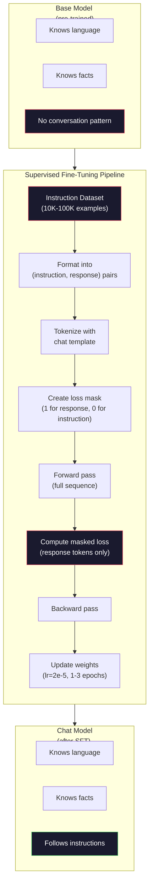

# Instruction Tuning (SFT)

> Base model 只预测下一个 token。仅此而已。它不会遵循 instructions、回答问题，也不会拒绝 harmful requests。SFT 是 token predictor 与 useful assistant 之间的桥梁。你聊过的每个模型——Claude、GPT、Llama Chat——都经过这一步。

**类型:** Build
**语言:** Python (with numpy)
**先修:** Phase 10, Lesson 04 (Pre-Training a Mini GPT)
**时间:** ~90 minutes

## 学习目标

- 实现 supervised fine-tuning (SFT)，把 base language model 转换成 instruction-following assistant
- 使用带 system、user、assistant roles 的 chat templates 格式化训练数据，并对 non-assistant tokens mask loss
- 解释为什么 SFT 必要：base models 会继续文本，而不是回答问题
- 在 held-out instruction set 上比较 base model 与 fine-tuned model responses，评估 SFT 质量

## 要解决的问题

你在 Lesson 04 训练了一个模型。它可以给定 sequence 预测 next token。喂给它 “The transformer architecture”，它可能继续 “has revolutionized natural language processing.” 这对 next-token predictor 来说很厉害。

现在试试这个：喂给它 “What is the capital of France?” Base model 不会回答 “Paris”。它会继续这个 pattern。它可能生成 “What is the capital of Germany? What is the capital of Spain?” 因为它从包含问题列表的 documents 中学过这种模式。或者它可能生成 “is a question that many people ask”，因为这是 plausible next-token continuation。模型没有*回答*的概念。它只知道*继续*。

这就是 GPT-3（base model，2020 年 6 月发布）与 ChatGPT（instruction-tuned，2022 年 11 月发布）之间的差距。同样架构。同样 pre-training。差别在 20,000 到 100,000 组精心制作的 (instruction, response) pairs，它们教会模型遵循 conversation pattern。

Stanford Alpaca 证明你不需要 millions of examples。2023 年 3 月，他们只用 GPT-3.5 生成的 52,000 instruction-response pairs fine-tune Llama 7B。总成本：$600。结果是一个能遵循 instructions、回答问题和对话的 chatbot。不如 ChatGPT，但以 $600 和几小时训练来说，接近得惊人。

Meta 的 Llama 2 Chat 在初始 SFT 阶段只使用了约 27,000 high-quality examples。关键 insight：质量比数量重要。Skilled annotators 写的 27,000 examples 胜过从互联网上抓取的 1 million noisy examples。

## 核心概念

### SFT 到底做什么

Supervised Fine-Tuning 延续 pre-training 中相同的 training loop——forward pass、compute loss、backward pass、update weights——但换成另一种数据。不是 raw text，而是在 structured conversations 上训练：

```json
{
  "system": "You are a helpful assistant.",
  "user": "What is the capital of France?",
  "assistant": "The capital of France is Paris."
}
```

模型已经知道 Paris 是 France 的 capital。它在 pre-training 期间从 Wikipedia、textbooks 和 web pages 学到了这个事实。SFT 不教新 facts。它教一种新*行为*：看到问题时，产生答案。看到 instruction 时，产生 completion。看到 harmful request 时，产生 refusal。

可以这样理解：Pre-training 给模型 knowledge。SFT 给模型 manners。

### Data Formats

行业中主要有三种格式。每种都编码同一件事——谁说了什么——只是 delimiters 不同。

**Alpaca Format**（Stanford，2023 年 3 月）：

```json
{
  "instruction": "Summarize the following article in 3 sentences.",
  "input": "The European Central Bank raised interest rates...",
  "output": "The ECB increased rates by 25 basis points..."
}
```

简单且被广泛使用。`input` field 是可选的——很多 instructions 不需要额外 context。Stanford 以这种格式发布了 52,000 examples，由 GPT-3.5 以 $600 生成。这开启了 open-source instruction tuning movement。

**ShareGPT Format**（community，2023）：

```json
{
  "conversations": [
    {"from": "system", "value": "You are a helpful assistant."},
    {"from": "human", "value": "What causes tides?"},
    {"from": "gpt", "value": "Tides are caused by the gravitational pull of the Moon..."},
    {"from": "human", "value": "How often do they occur?"},
    {"from": "gpt", "value": "Most coastal areas experience two high tides and two low tides per day..."}
  ]
}
```

支持 multi-turn conversations。无论实际模型是什么，`from` field 约定使用 “human” 和 “gpt”。Vicuna 在 70,000 条 ShareGPT conversations 上训练，这些 conversations 来自用户分享的 ChatGPT transcripts。

**ChatML Format**（OpenAI，许多 open-source models 也使用）：

```text
<|im_start|>system
You are a helpful assistant.<|im_end|>
<|im_start|>user
What is the capital of France?<|im_end|>
<|im_start|>assistant
The capital of France is Paris.<|im_end|>
```

使用 special tokens（`<|im_start|>`、`<|im_end|>`）分隔 roles。这些 tokens 会在 fine-tuning 期间加入 tokenizer vocabulary。Qwen、Yi 和许多其他模型使用 ChatML。

三种格式完成同一件事：它们告诉模型“这是 instruction，这是 response，学习这种 pattern。”

### 为什么有效

模型已经从 pre-training 中学会了语言。它见过数十亿个 questions followed by answers、instructions followed by completions，以及人们之间的 conversations。Patterns 已经编码在 weights 中。

SFT 集中这种 latent ability。模型不再需要从 context 中猜自己应该回答问题还是继续 document；SFT 显式在 conversation pattern 上训练。几千个 examples 后，模型学会：看到 assistant role marker 时，产生 helpful response。

这就是为什么 27,000 examples 足够。你不是在教模型英语。不是教它世界 facts。你是在教一个简单行为：respond to instructions。Knowledge 已经在那里。

### The Masked Loss

这是 SFT 最重要的技术细节，而多数 tutorials 会跳过。

Pre-training 期间，你在每个 token 上计算 loss。模型学习预测 sequence 中每个 next token。SFT 期间，你只在*response* tokens 上计算 loss。Instruction tokens 用作 context，但模型不会因为“预测”它们错误而被惩罚。

为什么？因为你不想让模型学习*生成* instructions。你想让它学习*响应* instructions。如果你在 instruction tokens 上计算 loss，就是在训练模型预测 “What is the capital of France?”，仿佛它才是提问者。这会浪费 gradient signal，也可能让模型混淆自己的 role。

实践中，你创建 loss mask：response tokens 为 1，instruction tokens 为 0。平均前用这个 mask 乘 per-token loss。

```text
Tokens:    [SYS] You are helpful [USER] What is the capital? [ASST] Paris is the capital [EOS]
Loss mask:   0    0    0     0      0     0   0  0     0       1     1    1   1     1      1
```

只有 `[ASST]` 之后的 tokens 参与 loss。Forward pass 时模型看到完整 conversation（它需要 instruction 才能产生正确 response），但只根据它预测 response 的好坏更新 weights。

### Training Hyperparameters

SFT 使用与 pre-training 截然不同的 hyperparameters。你不是从零训练，而是在调整一个已经能工作的模型。

| Parameter | Pre-Training (Llama 2 7B) | SFT (Llama 2 Chat) |
|-----------|---------------------------|---------------------|
| Learning rate | 3e-4 (peak) | 2e-5 |
| Epochs | 1 (single pass over data) | 2 |
| Batch size | 4M tokens | 64 examples |
| Warmup steps | 2,000 | 0-100 |
| Weight decay | 0.1 | 0.0-0.1 |
| Data size | 2T tokens | 27,000 examples |

SFT 的 learning rate 低 15x。这很关键。Fine-tuning 期间高 learning rate 会破坏 pre-trained knowledge。模型会“忘掉”学过的东西，并 overfit 到小 fine-tuning dataset。这就是 catastrophic forgetting。

两轮 epochs 意味着模型看每个 training example 两次。在 small dataset 上超过 3 epochs 会导致 memorization——模型开始逐字复现 training examples，而不是泛化。

### Catastrophic Forgetting

Fine-tuning 可能破坏 general capabilities。在 instruction-following data 上训练太久，模型会失去写代码、做数学或产生 creative text 的能力。它变得非常擅长 training data 的特定格式，却在其他方面很差。

三种缓解：

1. **Low learning rate.** 1e-5 到 5e-5。更小 updates 意味着更少破坏 pre-trained features。

2. **Short training.** 1-3 epochs。在模型 overfit 前停止。

3. **Mix in pre-training data.** Llama 2 Chat 把少量（2-5%）raw pre-training data 混入 SFT dataset。这会在学习新 instruction-following behavior 时“提醒”模型保留 general capabilities。

### Real Numbers

在 10,000 high-quality instruction pairs 上 fine-tune 7B model，单张 NVIDIA A100 80GB GPU 大约需要 1 小时。计算如下：

- 10,000 examples x 512 tokens average = 5.12M tokens
- 2 epochs = 10.24M tokens total
- 7B model fine-tuning 在 A100 上 throughput：~3,000 tokens/second
- 10.24M / 3,000 = ~3,400 seconds = ~57 minutes

对我们的 mini GPT（4 layers, 128 dims），训练几乎瞬间完成。重点是理解机制，而不是规模。



## 动手实现

### Step 1: Instruction Dataset

创建 synthetic instruction dataset。生产中，Scale AI 和 Anthropic 这样的公司会雇 human annotators 编写这些。我们用程序生成它们，以展示格式。

```python
import numpy as np

INSTRUCTION_DATA = [
    {
        "instruction": "What is the capital of France?",
        "response": "The capital of France is Paris."
    },
    {
        "instruction": "Explain gravity in one sentence.",
        "response": "Gravity is the force that attracts objects with mass toward each other."
    },
    {
        "instruction": "Write a haiku about the ocean.",
        "response": "Waves crash on the shore, salt and foam beneath the sun, endless blue expanse."
    },
    {
        "instruction": "What is 15 multiplied by 7?",
        "response": "15 multiplied by 7 is 105."
    },
    {
        "instruction": "Name three programming languages.",
        "response": "Three programming languages are Python, Rust, and TypeScript."
    },
    {
        "instruction": "Summarize photosynthesis.",
        "response": "Photosynthesis converts sunlight, water, and carbon dioxide into glucose and oxygen."
    },
    {
        "instruction": "What year did World War II end?",
        "response": "World War II ended in 1945."
    },
    {
        "instruction": "Define machine learning.",
        "response": "Machine learning is a field where algorithms learn patterns from data to make predictions."
    },
]
```

八个 examples 很小。Stanford Alpaca 使用了 52,000。但无论你有 8 个还是 52,000 个，机制都相同：tokenize、mask、只在 responses 上 compute loss。

### Step 2: Tokenize with Chat Template

把 instruction-response pairs 转为带 special role markers 的 token sequences。Markers 告诉模型 instruction 在哪里结束、response 在哪里开始。

```python
SPECIAL_TOKENS = {
    "INST_START": 253,
    "INST_END": 254,
    "RESP_START": 255,
}


def tokenize_instruction_pair(instruction, response, vocab_size=256):
    inst_tokens = list(instruction.encode("utf-8"))
    resp_tokens = list(response.encode("utf-8"))

    inst_tokens = [min(t, vocab_size - 4) for t in inst_tokens]
    resp_tokens = [min(t, vocab_size - 4) for t in resp_tokens]

    tokens = (
        [SPECIAL_TOKENS["INST_START"]]
        + inst_tokens
        + [SPECIAL_TOKENS["INST_END"]]
        + [SPECIAL_TOKENS["RESP_START"]]
        + resp_tokens
    )

    return tokens


def create_loss_mask(tokens):
    mask = np.zeros(len(tokens), dtype=np.float32)
    in_response = False

    for i, token in enumerate(tokens):
        if token == SPECIAL_TOKENS["RESP_START"]:
            in_response = True
            continue
        if in_response:
            mask[i] = 1.0

    return mask
```

Loss mask 对 instruction tokens 全是 zeros，对 response tokens 全是 ones。`RESP_START` token 自身 mask 为 0，因为它是 delimiter，不是 response content 的一部分。

### Step 3: Masked Cross-Entropy Loss

标准 cross-entropy，但乘以 loss mask。只有 response tokens 贡献 gradient。

```python
def masked_cross_entropy_loss(logits, targets, loss_mask):
    batch, seq_len, vocab_size = logits.shape
    logits_flat = logits.reshape(-1, vocab_size)
    targets_flat = targets.reshape(-1)
    mask_flat = loss_mask.reshape(-1)

    max_logits = logits_flat.max(axis=-1, keepdims=True)
    log_softmax = logits_flat - max_logits - np.log(
        np.exp(logits_flat - max_logits).sum(axis=-1, keepdims=True)
    )

    per_token_loss = -log_softmax[np.arange(len(targets_flat)), targets_flat]

    masked_loss = per_token_loss * mask_flat
    num_response_tokens = mask_flat.sum()
    if num_response_tokens == 0:
        return 0.0
    loss = masked_loss.sum() / num_response_tokens

    return loss
```

分母是 `num_response_tokens`，不是 `seq_len`。如果除以 total sequence length，长 instructions 会稀释 gradient signal。除以 response token count 可确保无论 instruction 长短，每个 response token 权重相同。

### Step 4: SFT Training Loop

复用 Lesson 04 的 MiniGPT。Training loop 看起来几乎与 pre-training 相同，但增加 instruction formatting 和 masked loss。

```python
import sys
import os
sys.path.insert(0, os.path.join(os.path.dirname(__file__), "..", "..", "04-pre-training-mini-gpt", "code"))
from main import MiniGPT, LayerNorm, FeedForward, MultiHeadAttention, TransformerBlock, Embedding


def sft_train(model, dataset, num_epochs=2, lr=2e-5, seq_len=64):
    formatted_data = []
    for example in dataset:
        tokens = tokenize_instruction_pair(example["instruction"], example["response"])
        mask = create_loss_mask(tokens)
        formatted_data.append((tokens, mask))

    print(f"SFT Training: {len(formatted_data)} examples, {num_epochs} epochs, lr={lr}")
    print(f"Total tokens: {sum(len(t) for t, _ in formatted_data):,}")
    print()

    losses = []

    for epoch in range(num_epochs):
        epoch_loss = 0.0
        num_batches = 0

        indices = np.random.permutation(len(formatted_data))

        for idx in indices:
            tokens, mask = formatted_data[idx]

            if len(tokens) < 3:
                continue
            if len(tokens) > seq_len:
                tokens = tokens[:seq_len]
                mask = mask[:seq_len]

            input_ids = np.array(tokens[:-1]).reshape(1, -1)
            target_ids = np.array(tokens[1:]).reshape(1, -1)
            loss_mask = np.array(mask[1:]).reshape(1, -1)

            logits = model.forward(input_ids)
            loss = masked_cross_entropy_loss(logits, target_ids, loss_mask)

            batch_size, s_len, v_size = logits.shape
            probs = np.exp(logits - logits.max(axis=-1, keepdims=True))
            probs = probs / probs.sum(axis=-1, keepdims=True)
            dlogits = probs.copy()
            dlogits[np.arange(batch_size)[:, None], np.arange(s_len), target_ids] -= 1.0

            mask_expanded = loss_mask[:, :, np.newaxis]
            num_resp = loss_mask.sum()
            if num_resp > 0:
                dlogits = dlogits * mask_expanded / num_resp

            for block in model.blocks:
                block.ffn.W1 -= lr * np.random.randn(*block.ffn.W1.shape) * 0.01
                block.ffn.W2 -= lr * np.random.randn(*block.ffn.W2.shape) * 0.01
                block.ffn.b1 -= lr * np.random.randn(*block.ffn.b1.shape) * 0.01
                block.ffn.b2 -= lr * np.random.randn(*block.ffn.b2.shape) * 0.01

            epoch_loss += loss
            num_batches += 1
            losses.append(loss)

        avg_loss = epoch_loss / max(num_batches, 1)
        print(f"Epoch {epoch + 1}/{num_epochs} | Avg Loss: {avg_loss:.4f}")

    return model, losses
```

Learning rate 是 2e-5，与 Llama 2 Chat 匹配。对比 pre-training 中的 3e-4——小 15x。Gradient 被 mask：instruction tokens 产生 zero gradient。只有 response tokens 推动 weights。

### Step 5: Compare Base vs SFT Model

SFT 的全部意义是 behavior change。我们通过检查模型如何响应 instruction-formatted inputs 与 raw text continuations 来衡量。

```python
def generate_response(model, prompt_tokens, max_new_tokens=50, temperature=0.8):
    tokens = list(prompt_tokens)
    seq_len = model.embedding.pos_embed.shape[0]

    for _ in range(max_new_tokens):
        context = np.array(tokens[-seq_len:]).reshape(1, -1)
        logits = model.forward(context)
        next_logits = logits[0, -1, :]

        next_logits = next_logits / max(temperature, 1e-8)
        probs = np.exp(next_logits - next_logits.max())
        probs = probs / probs.sum()
        probs = np.clip(probs, 1e-10, 1.0)
        probs = probs / probs.sum()

        next_token = np.random.choice(len(probs), p=probs)
        tokens.append(int(next_token))

    return tokens


def evaluate_instruction_following(model, instructions):
    print("Evaluating instruction following:")
    print("-" * 50)

    for instruction in instructions:
        tokens = (
            [SPECIAL_TOKENS["INST_START"]]
            + [min(t, 252) for t in list(instruction.encode("utf-8"))]
            + [SPECIAL_TOKENS["INST_END"]]
            + [SPECIAL_TOKENS["RESP_START"]]
        )

        output = generate_response(model, tokens, max_new_tokens=30, temperature=0.6)
        response_start = len(tokens)
        response_tokens = output[response_start:]
        response_bytes = bytes([t for t in response_tokens if t < 128])
        response_text = response_bytes.decode("utf-8", errors="replace")

        print(f"  Q: {instruction}")
        print(f"  A: {response_text[:80]}")
        print()
```

在只有 8 个 examples 的 tiny model 上，responses 不会有意义。这是预期。重要的是*结构*：模型学习在 response marker 后产生 output，而不是继续生成更多 instructions。

### Step 6: Measure Catastrophic Forgetting

比较 SFT 前后模型的 next-token prediction ability。如果 SFT 损害 general capabilities，raw text 上的 loss 会升高。

```python
def measure_forgetting(model, test_text, seq_len=64):
    tokens = np.array(list(test_text.encode("utf-8")[:512]))

    total_loss = 0.0
    num_windows = 0

    for start in range(0, len(tokens) - seq_len - 1, seq_len):
        input_ids = tokens[start:start + seq_len].reshape(1, -1)
        target_ids = tokens[start + 1:start + seq_len + 1].reshape(1, -1)

        logits = model.forward(input_ids)

        batch, s_len, vocab_size = logits.shape
        logits_flat = logits.reshape(-1, vocab_size)
        targets_flat = target_ids.reshape(-1)

        max_logits = logits_flat.max(axis=-1, keepdims=True)
        log_softmax = logits_flat - max_logits - np.log(
            np.exp(logits_flat - max_logits).sum(axis=-1, keepdims=True)
        )

        loss = -log_softmax[np.arange(len(targets_flat)), targets_flat].mean()
        total_loss += loss
        num_windows += 1

    return total_loss / max(num_windows, 1)
```

真实 fine-tuning 中，你会在整个训练过程中追踪这个 metric。如果 raw text loss 增加超过 10-15%，说明 SFT 太激进。降低 learning rate 或减少 epochs。

## 实际使用

### Full SFT Pipeline Demo

```python
if __name__ == "__main__":
    np.random.seed(42)

    test_text = """The transformer architecture processes sequences through self-attention.
Each layer applies multi-head attention followed by a feedforward network.
Residual connections and layer normalization stabilize deep networks.
The model learns to predict the next token given all previous tokens."""

    print("=" * 70)
    print("INSTRUCTION TUNING (SFT) DEMO")
    print("=" * 70)
    print()

    model = MiniGPT(
        vocab_size=256, embed_dim=128, num_heads=4,
        num_layers=4, max_seq_len=128, ff_dim=512
    )
    print(f"Model: {model.count_parameters():,} parameters")
    print(f"Config: 4 layers, 4 heads, 128 dims (mini GPT from Lesson 04)")
    print()

    print("PRE-SFT: Measuring base model loss on raw text")
    base_loss = measure_forgetting(model, test_text)
    print(f"  Base model loss: {base_loss:.4f}")
    print()

    print("=" * 70)
    print("SFT TRAINING")
    print("=" * 70)

    model, losses = sft_train(
        model, INSTRUCTION_DATA, num_epochs=3, lr=2e-5, seq_len=128
    )

    print()
    print("POST-SFT: Measuring fine-tuned model loss on raw text")
    sft_loss = measure_forgetting(model, test_text)
    print(f"  SFT model loss: {sft_loss:.4f}")
    print(f"  Change: {((sft_loss - base_loss) / base_loss * 100):+.1f}%")
    if abs(sft_loss - base_loss) / base_loss < 0.15:
        print("  Minimal forgetting (< 15% change)")
    else:
        print("  Significant forgetting detected")
    print()

    print("=" * 70)
    print("INSTRUCTION FOLLOWING EVALUATION")
    print("=" * 70)
    print()

    test_instructions = [
        "What is the capital of France?",
        "Name a programming language.",
        "Define gravity.",
    ]
    evaluate_instruction_following(model, test_instructions)

    print("=" * 70)
    print("DATA FORMAT EXAMPLES")
    print("=" * 70)
    print()

    for i, example in enumerate(INSTRUCTION_DATA[:3]):
        tokens = tokenize_instruction_pair(example["instruction"], example["response"])
        mask = create_loss_mask(tokens)
        resp_count = int(mask.sum())
        total_count = len(tokens)
        print(f"  Example {i + 1}: {total_count} tokens, {resp_count} response tokens ({resp_count/total_count:.0%} of sequence)")
        print(f"    Instruction: {example['instruction']}")
        print(f"    Response: {example['response']}")
        print()

    print("=" * 70)
    print("TRAINING LOSS CURVE")
    print("=" * 70)
    print()

    if losses:
        window = max(1, len(losses) // 5)
        for i in range(0, len(losses), window):
            chunk = losses[i:i + window]
            avg = sum(chunk) / len(chunk)
            print(f"  Steps {i:3d}-{i + len(chunk) - 1:3d}: avg loss = {avg:.4f}")
```

## 交付成果

本课产出 `outputs/prompt-sft-data-curator.md`——一个帮助你为 SFT 设计和 curate instruction datasets 的 prompt。给定 target capability（code generation、math、conversation），它会生成 data collection plan，包含 format specifications、quality criteria 和 diversity requirements。

## 练习

1. 添加 system prompt support。修改 `tokenize_instruction_pair`，使其接受 system message 并放在 instruction 前面。创建 5 个不同 system prompts 的 examples（“You are a poet”、“You are a math tutor”），并验证模型在训练中看到不同 system prompts。

2. 实现 data mixing。创建函数，接收 SFT dataset 和 raw text corpus，并产生 training batches，其中 5% examples 是 raw text（no masking），95% 是 instruction pairs（masked）。运行 3 epochs，并与 pure SFT training 比较 forgetting metrics。

3. 构建 data quality scorer。对每个 instruction-response pair，计算：(a) response length in tokens，(b) instruction-to-response ratio，(c) vocabulary diversity（unique tokens / total tokens）。过滤 response length < 10 tokens 或 diversity < 0.3 的 examples。展示 filtering 如何影响 final loss。

4. 实现 multi-turn conversation training。扩展 tokenization 以处理 3-turn conversations（user-assistant-user-assistant-user-assistant）。Loss mask 应覆盖所有三个 assistant turns。通过打印一个 example 的 token-mask alignment 验证 mask 正确。

5. 比较 learning rates。用 lr=1e-4、lr=2e-5 和 lr=1e-6 分别训练同一模型三次。画 loss curves。1e-4 run 应显示快速 initial descent 但更高 final loss（overfitting）。1e-6 run 应几乎不动。2e-5 run 应是 sweet spot。

## 关键术语

| Term | What people say | What it actually means |
|------|----------------|----------------------|
| SFT | “Fine-tuning on conversations” | Supervised Fine-Tuning：在 (instruction, response) pairs 上继续训练，只在 response tokens 上计算 loss |
| Instruction tuning | “Teaching the model to follow instructions” | 在显式 instruction-response pairs 上训练，使 base model 学到 conversation pattern，而不是新 knowledge |
| Loss masking | “Ignoring the prompt” | 将 instruction tokens 的 loss 设为 zero，使 gradients 只来自 response token predictions |
| ChatML | “Chat Markup Language” | 使用 `<\|im_start\|>` 和 `<\|im_end\|>` delimiters 标记 conversation data 中 speaker roles 的 token format |
| Alpaca format | “Stanford's format” | 使用 instruction/input/output fields 的 JSON format，用于 52K 条花费 $600 生成的 GPT-3.5 examples |
| Catastrophic forgetting | “The model gets dumber” | Fine-tuning 破坏 pre-trained capabilities，因为 gradient updates 用 task-specific patterns 覆盖 general knowledge |
| Weight tying | “Shared embeddings” | 对 input token embeddings 和 output prediction head 使用同一个 matrix，节省参数并提升 coherence |
| Chat template | “How you format the prompt” | 为模型组织 conversation 的特定 token sequence（role markers、delimiters） |

## 延伸阅读

- [Ouyang et al., 2022 -- "Training language models to follow instructions with human feedback" (InstructGPT)](https://arxiv.org/abs/2203.02155) -- 在 OpenAI 引入 instruction tuning + RLHF 的论文
- [Taori et al., 2023 -- "Stanford Alpaca: An Instruction-following LLaMA Model"](https://github.com/tatsu-lab/stanford_alpaca) -- $600 得到 52K instruction examples，证明 SFT 可在小数据集上有效
- [Touvron et al., 2023 -- "Llama 2: Open Foundation and Fine-Tuned Chat Models"](https://arxiv.org/abs/2307.09288) -- Meta 的 SFT + RLHF pipeline，使用 27K high-quality examples
- [Chiang et al., 2023 -- "Vicuna: An Open-Source Chatbot Impressing GPT-4"](https://lmsys.org/blog/2023-03-30-vicuna/) -- 在 70K ShareGPT conversations 上训练
- [Zhou et al., 2023 -- "LIMA: Less Is More for Alignment"](https://arxiv.org/abs/2305.11206) -- 证明 1,000 个精心 curated examples 可匹配更大 SFT datasets
