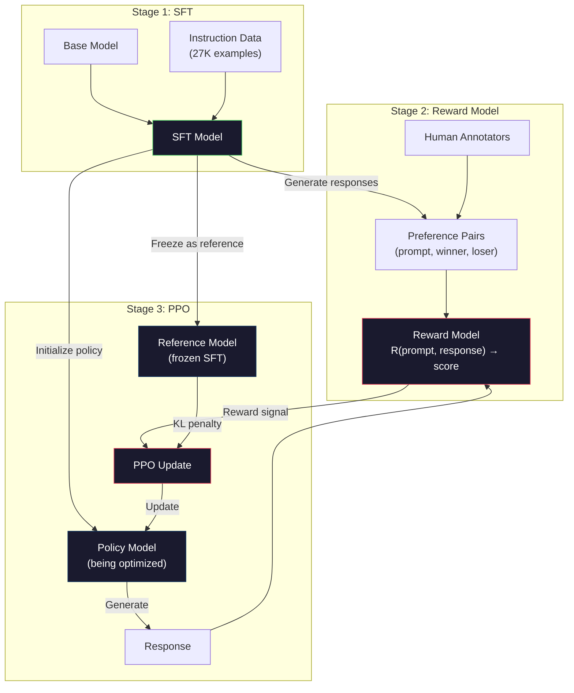
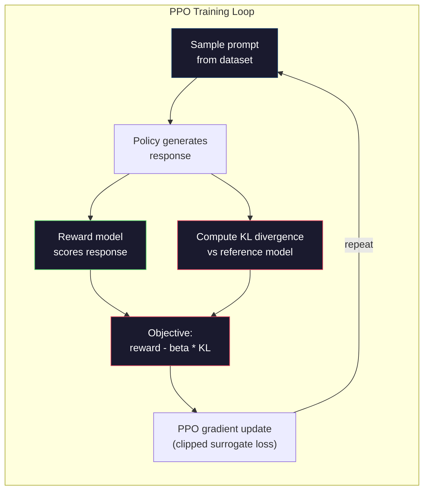

# RLHF：Reward Model + PPO

> SFT 教模型遵循 instructions。但它不会教模型哪个 response 更好。两个语法正确、事实准确的答案，在 helpfulness 上可能差别巨大。RLHF 是把 human judgment 编码进模型行为的方法。它让 Claude helpful，让 GPT polite。

**类型:** Build
**语言:** Python (with numpy)
**先修:** Phase 10, Lesson 06 (Instruction Tuning / SFT)
**时间:** ~90 minutes

## 学习目标

- 构建 reward model，从 human preference pairs（chosen vs rejected）中为 response quality 打分
- 实现 PPO training loop，用带 KL penalty 的 reward model 优化 language model policy
- 解释为什么 RLHF 需要三个 models（SFT、reward、policy），以及 KL constraint 如何防止 reward hacking
- 通过比较 preference optimization 前后的 response quality，评估 RLHF 的效果

## 要解决的问题

问模型 “Explain quantum computing”，它可能生成：

**Response A:** “Quantum computing uses qubits that can exist in superposition, meaning they can be 0, 1, or both simultaneously. This allows quantum computers to process certain calculations exponentially faster than classical computers. Key algorithms include Shor's algorithm for factoring large numbers and Grover's algorithm for searching unsorted databases.”

**Response B:** “Quantum computing is a type of computing that uses quantum mechanical phenomena. It was first proposed in the 1980s. Richard Feynman suggested that quantum systems could be simulated by quantum computers. The field has grown significantly since then. Many companies are now working on quantum computers. IBM, Google, and others have made progress. Quantum supremacy was claimed by Google in 2019.”

两个 responses 都事实正确。语法都没问题。都遵循了 instruction。但 Response A 明显更好。它更 concise、更 informative、结构更好。Human 每次都会选 A。

SFT 无法捕捉这种区别。它在“正确” responses 上训练模型，但没有机制表达“这个 response 比那个更好”。它把每个 training example 都视为同样好。如果 A 和 B 都出现在 SFT dataset 中，模型会同等学习二者。

RLHF 解决这个问题。它训练 reward model 来预测 human 更偏好哪个 response，然后用这个 reward signal 推动 language model 产生更高质量 outputs。InstructGPT（ChatGPT 前身）使用 RLHF 显著提升 GPT-3 的 helpfulness、truthfulness 和 harmlessness。OpenAI 内部评估者 85% 的时候更偏好 InstructGPT outputs，而非 GPT-3 outputs，尽管 InstructGPT 小 135x（1.3B vs 175B parameters）。

## 核心概念

### 三个阶段

RLHF 不是单次训练。它是三个顺序阶段组成的 pipeline，每一步基于前一步。

**Stage 1: SFT.** 在 instruction-response pairs 上训练 base model（Lesson 06）。这得到一个能遵循 instructions 的模型，但它不知道哪些 responses 比其他更好。

**Stage 2: Reward Model.** 收集 human preference data：向 annotators 展示同一 prompt 的两个 responses，并问“哪个更好？”训练模型预测这些 preferences。Reward model 接收 (prompt, response) 作为 input，输出 scalar score。

**Stage 3: PPO.** 使用 reward model 为 language model 生成 training signal。Language model 生成 responses，reward model 给它们打分，PPO 更新 language model，使其生成更高分 responses。KL divergence penalty 防止 language model 偏离 SFT checkpoint 太远。



### The Reward Model

Reward model 是被改造成 scorer 的 language model。取 SFT model，把 language modeling head（输出 vocabulary distribution）替换为 scalar head（输出单个数字）。最终层之前的 architecture 相同。

Input：prompt 拼接 response。Output：单个 scalar reward score。

训练数据是 human preference pairs。对每个 prompt，annotators 看两个 responses 并选择更好的。由此产生 training triples：(prompt, preferred_response, rejected_response)。

Loss function 使用 pairwise preferences 的 Bradley-Terry model：

```text
loss = -log(sigmoid(reward(preferred) - reward(rejected)))
```

这是关键方程。`sigmoid(reward(A) - reward(B))` 给出 response A 相比 response B 更受偏好的概率。Loss 推动 reward model 给 preferred response 更高分。

为什么用 pairwise comparisons，而不是 absolute scores？因为 humans 很不擅长给 absolute quality scores（“这个 response 是 10 分里的 7.3 还是 7.5？”），但很擅长 relative comparisons（“A 比 B 好吗？”）。Bradley-Terry model 把 relative comparisons 转换成一致的 absolute scoring system。

**InstructGPT numbers:** OpenAI 从 40 名 contractors 收集了 33,000 comparison pairs。每次 comparison 大约 5 分钟。这是 2,750 小时 human labor，用于 reward model training data。

### PPO: Proximal Policy Optimization

PPO 是 reinforcement learning algorithm。在 RLHF 中，“environment” 是 reward model，“agent” 是 language model，“action” 是生成 token。

Objective：

```text
maximize: E[R(prompt, response)] - beta * KL(policy || reference)
```

第一项推动模型生成 high-reward responses。第二项（KL divergence penalty）防止模型偏离 SFT checkpoint 太远。

为什么需要 KL penalty？没有它，模型会找到退化解。Reward model 是在有限 human preferences dataset 上训练的。它有 blind spots。Language model 会利用这些 blind spots——找到 reward model 打高分但实际上无意义的 outputs。经典例子：

- 重复 “I'm so helpful and harmless!” 在 helpfulness/harmlessness reward models 上得高分
- 生成冗长、正式但空洞的 responses，pattern-match 到 “high quality”
- 利用训练数据中恰好与 high reward 相关的特定 phrases

KL penalty 的意思是：你可以改进，但不能变成完全不同的模型。保持接近 SFT version，因为它已经相当合理。偏离太远时，KL cost 会压过 reward。

**InstructGPT numbers:** PPO training 使用 lr=1.5e-5、KL coefficient beta=0.02、256K episodes（prompt-response pairs），每 batch 4 PPO epochs。整个 RLHF pipeline 在 GPU cluster 上跑了几天。



### PPO Objective 细节

PPO 使用 “clipped surrogate objective” 防止过大的 updates。New policy 与 old policy probabilities 的 ratio 会被 clip 到 [1 - epsilon, 1 + epsilon]，epsilon 通常是 0.2。

```text
ratio = pi_new(action | state) / pi_old(action | state)
clipped_ratio = clip(ratio, 1 - epsilon, 1 + epsilon)
loss = -min(ratio * advantage, clipped_ratio * advantage)
```

Advantage function 估计当前 response 比 expected quality 好多少。在 RLHF 中：

```text
advantage = reward(prompt, response) - baseline
```

Baseline 通常是近期 responses 的 average reward。Positive advantage 表示 response 高于平均；negative advantage 表示更差。PPO 提高 above-average responses 的概率，降低 below-average responses 的概率。

Clipping 防止 catastrophic updates。如果某个 response 得到异常高 reward，unclipped ratio 可能非常大，导致模型剧烈转向该 response。Clipping 限制 update，保持 training stability。

### Reward Hacking

RLHF 的暗面。Language model 正在优化 reward model，而 reward model 只是 human preferences 的 imperfect proxy。随着 language model 更擅长 maximize reward，它开始利用 reward model 的弱点。

常见 failure modes：

| Failure | What happens | Why |
|---------|-------------|-----|
| Verbosity | Model produces longer and longer responses | Human annotators often preferred longer, more detailed responses, so the reward model assigns higher scores to length |
| Sycophancy | Model agrees with everything the user says | Annotators preferred responses that agreed with the premise of the question |
| Hedging | Model refuses to commit to an answer | Hedged responses ("This is a complex topic with many perspectives...") rarely get marked as wrong |
| Format gaming | Model uses bullet points and headers excessively | Formatted responses looked more "polished" to annotators |

Mitigation strategies：更强 KL penalty（防止模型偏离到足以利用弱点）、在 adversarial examples 上训练 reward model（修补 known failure modes）、使用多个不同 architectures 的 reward models（更难同时 hack）。

### Real RLHF Pipelines

| Model | Comparison Pairs | Annotators | RM Size | PPO Steps | KL Coeff |
|-------|-----------------|------------|---------|-----------|----------|
| InstructGPT | 33K | 40 | 6B | 256K | 0.02 |
| Llama 2 Chat | ~1M | undisclosed | 70B | undisclosed | 0.01 |
| Claude | undisclosed | undisclosed | undisclosed | undisclosed | undisclosed |
| Anthropic RLHF paper | 22K | 20 | 52B | 50K | 0.001 |

Anthropic 2022 年论文在 22,000 comparisons 上训练了 52B reward model。更大的 reward models 产生更可靠信号，让 PPO training 更稳定。用小 reward model 训练大 language model 很危险——reward model 没有足够 capacity 捕捉 good vs bad responses 的微妙差别。

## 动手实现

### Step 1: Synthetic Preference Data

生产中由 human annotators 创建 preference data。这里我们创建 synthetic pairs，其中 “preferred” response 客观上更好（更 concise、更 accurate、更 helpful）。

```python
import numpy as np

PREFERENCE_DATA = [
    {
        "prompt": "What is the capital of France?",
        "preferred": "The capital of France is Paris.",
        "rejected": "France is a country in Europe. It has many cities. The capital is Paris. Paris is known for the Eiffel Tower.",
    },
    {
        "prompt": "Explain gravity in one sentence.",
        "preferred": "Gravity is the force that attracts objects with mass toward each other.",
        "rejected": "Gravity is something that makes things fall down when you drop them.",
    },
    {
        "prompt": "What is 15 times 7?",
        "preferred": "15 times 7 is 105.",
        "rejected": "Let me think about this. 15 times 7. Well, 10 times 7 is 70, and 5 times 7 is 35, so the answer might be around 105.",
    },
    {
        "prompt": "Name three programming languages.",
        "preferred": "Python, Rust, and TypeScript.",
        "rejected": "There are many programming languages. Some popular ones include various languages like Python and others.",
    },
    {
        "prompt": "What year did World War II end?",
        "preferred": "World War II ended in 1945.",
        "rejected": "World War II was a major global conflict. It involved many countries. The war ended in the mid-1940s, specifically in 1945.",
    },
    {
        "prompt": "Define machine learning.",
        "preferred": "Machine learning is a field where algorithms learn patterns from data to make predictions without being explicitly programmed.",
        "rejected": "Machine learning is a type of AI. AI stands for artificial intelligence. Machine learning uses data to learn.",
    },
]
```

Preferred responses concise 且 direct。Rejected responses 展示常见 failure modes：unnecessary padding、hedging、redundant explanation 和 imprecision。这正是 SFT 无法捕捉、RLHF 可以捕捉的区别。

### Step 2: Reward Model Architecture

Reward model 复用 mini GPT 的 transformer architecture，但把 vocabulary-sized output head 替换为 single scalar projection。

```python
import sys
import os
sys.path.insert(0, os.path.join(os.path.dirname(__file__), "..", "..", "04-pre-training-mini-gpt", "code"))
from main import MiniGPT, LayerNorm, Embedding, TransformerBlock


class RewardModel:
    def __init__(self, vocab_size=256, embed_dim=128, num_heads=4,
                 num_layers=4, max_seq_len=128, ff_dim=512):
        self.embedding = Embedding(vocab_size, embed_dim, max_seq_len)
        self.blocks = [
            TransformerBlock(embed_dim, num_heads, ff_dim)
            for _ in range(num_layers)
        ]
        self.ln_f = LayerNorm(embed_dim)
        self.reward_head = np.random.randn(embed_dim) * 0.02

    def forward(self, token_ids):
        seq_len = token_ids.shape[-1]
        mask = np.triu(np.full((seq_len, seq_len), -1e9), k=1)

        x = self.embedding.forward(token_ids)
        for block in self.blocks:
            x = block.forward(x, mask)
        x = self.ln_f.forward(x)

        last_hidden = x[:, -1, :]
        reward = last_hidden @ self.reward_head

        return reward
```

Reward model 取*最后* token position 的 hidden state，并投影成 scalar。为什么是最后 token？因为 causal attention mask 意味着最后位置 attend to 所有 previous tokens。它拥有整个 (prompt, response) sequence 最完整的 representation。

### Step 3: Bradley-Terry Loss

使用 Bradley-Terry pairwise loss 在 preference pairs 上训练 reward model。

```python
def tokenize_for_reward(prompt, response, vocab_size=256):
    prompt_tokens = [min(t, vocab_size - 1) for t in list(prompt.encode("utf-8"))]
    response_tokens = [min(t, vocab_size - 1) for t in list(response.encode("utf-8"))]
    return prompt_tokens + [0] + response_tokens


def sigmoid(x):
    return np.where(
        x >= 0,
        1.0 / (1.0 + np.exp(-x)),
        np.exp(x) / (1.0 + np.exp(x))
    )


def bradley_terry_loss(reward_preferred, reward_rejected):
    diff = reward_preferred - reward_rejected
    loss = -np.log(sigmoid(diff) + 1e-8)
    return loss


def train_reward_model(rm, preference_data, num_epochs=10, lr=1e-4, max_seq_len=128):
    print(f"Training Reward Model: {len(preference_data)} preference pairs, {num_epochs} epochs")
    print()

    losses = []
    accuracies = []

    for epoch in range(num_epochs):
        epoch_loss = 0.0
        epoch_correct = 0
        num_pairs = 0

        indices = np.random.permutation(len(preference_data))

        for idx in indices:
            pair = preference_data[idx]

            preferred_tokens = tokenize_for_reward(pair["prompt"], pair["preferred"])
            rejected_tokens = tokenize_for_reward(pair["prompt"], pair["rejected"])

            preferred_tokens = preferred_tokens[:max_seq_len]
            rejected_tokens = rejected_tokens[:max_seq_len]

            preferred_ids = np.array(preferred_tokens).reshape(1, -1)
            rejected_ids = np.array(rejected_tokens).reshape(1, -1)

            r_preferred = rm.forward(preferred_ids)[0]
            r_rejected = rm.forward(rejected_ids)[0]

            loss = bradley_terry_loss(r_preferred, r_rejected)

            if r_preferred > r_rejected:
                epoch_correct += 1

            diff = r_preferred - r_rejected
            grad = sigmoid(diff) - 1.0

            rm.reward_head -= lr * grad * rm.ln_f.forward(
                rm.embedding.forward(preferred_ids)
            )[:, -1, :].flatten()

            epoch_loss += loss
            num_pairs += 1

        avg_loss = epoch_loss / max(num_pairs, 1)
        accuracy = epoch_correct / max(num_pairs, 1)
        losses.append(avg_loss)
        accuracies.append(accuracy)

        if epoch % 2 == 0:
            print(f"  Epoch {epoch + 1:3d} | Loss: {avg_loss:.4f} | Accuracy: {accuracy:.1%}")

    return rm, losses, accuracies
```

Accuracy metric 很直接：reward model 正确排序了多少 preference pairs？Random model 是 50%。Clean data 上训练良好的 reward model 应超过 70%。InstructGPT reward model 在 held-out comparisons 上约 72% accuracy，这听起来低，但其实不错——很多 preference pairs 即使对 humans 也 ambiguous（inter-annotator agreement 约 73%）。

### Step 4: Simplified PPO Loop

完整 PPO 很复杂。这个实现捕捉核心机制：generate responses、score them、compute advantage，并用 KL penalty update policy。

```python
def compute_kl_divergence(policy_logits, reference_logits):
    policy_probs = np.exp(policy_logits - policy_logits.max(axis=-1, keepdims=True))
    policy_probs = policy_probs / policy_probs.sum(axis=-1, keepdims=True)
    policy_probs = np.clip(policy_probs, 1e-10, 1.0)

    ref_probs = np.exp(reference_logits - reference_logits.max(axis=-1, keepdims=True))
    ref_probs = ref_probs / ref_probs.sum(axis=-1, keepdims=True)
    ref_probs = np.clip(ref_probs, 1e-10, 1.0)

    kl = np.sum(policy_probs * np.log(policy_probs / ref_probs), axis=-1)
    return kl.mean()


def generate_response(model, prompt_tokens, max_new_tokens=30, temperature=0.8, max_seq_len=128):
    tokens = list(prompt_tokens)

    for _ in range(max_new_tokens):
        context = np.array(tokens[-max_seq_len:]).reshape(1, -1)
        logits = model.forward(context)
        next_logits = logits[0, -1, :]

        next_logits = next_logits / max(temperature, 1e-8)
        probs = np.exp(next_logits - next_logits.max())
        probs = probs / probs.sum()
        probs = np.clip(probs, 1e-10, 1.0)
        probs = probs / probs.sum()

        next_token = np.random.choice(len(probs), p=probs)
        tokens.append(int(next_token))

    return tokens


def copy_model_weights(source, target):
    target.embedding.token_embed = source.embedding.token_embed.copy()
    target.embedding.pos_embed = source.embedding.pos_embed.copy()
    target.ln_f.gamma = source.ln_f.gamma.copy()
    target.ln_f.beta = source.ln_f.beta.copy()
    for s_block, t_block in zip(source.blocks, target.blocks):
        t_block.attn.W_q = s_block.attn.W_q.copy()
        t_block.attn.W_k = s_block.attn.W_k.copy()
        t_block.attn.W_v = s_block.attn.W_v.copy()
        t_block.attn.W_out = s_block.attn.W_out.copy()
        t_block.ffn.W1 = s_block.ffn.W1.copy()
        t_block.ffn.W2 = s_block.ffn.W2.copy()
        t_block.ffn.b1 = s_block.ffn.b1.copy()
        t_block.ffn.b2 = s_block.ffn.b2.copy()
        t_block.ln1.gamma = s_block.ln1.gamma.copy()
        t_block.ln1.beta = s_block.ln1.beta.copy()
        t_block.ln2.gamma = s_block.ln2.gamma.copy()
        t_block.ln2.beta = s_block.ln2.beta.copy()


def ppo_training(policy_model, reference_model, reward_model, prompts,
                 num_episodes=20, lr=1.5e-5, kl_coeff=0.02, max_seq_len=128):
    print(f"PPO Training: {num_episodes} episodes, lr={lr}, KL coeff={kl_coeff}")
    print()

    rewards_history = []
    kl_history = []

    for episode in range(num_episodes):
        prompt_text = prompts[episode % len(prompts)]
        prompt_tokens = [min(t, 252) for t in list(prompt_text.encode("utf-8"))]

        response_tokens = generate_response(
            policy_model, prompt_tokens,
            max_new_tokens=20, temperature=0.8, max_seq_len=max_seq_len
        )

        response_ids = np.array(response_tokens[:max_seq_len]).reshape(1, -1)
        reward = reward_model.forward(response_ids)[0]

        policy_logits = policy_model.forward(response_ids)
        ref_logits = reference_model.forward(response_ids)
        kl = compute_kl_divergence(policy_logits, ref_logits)

        total_reward = reward - kl_coeff * kl

        rewards_history.append(float(reward))
        kl_history.append(float(kl))

        for block in policy_model.blocks:
            update_scale = lr * total_reward
            block.ffn.W1 += update_scale * np.random.randn(*block.ffn.W1.shape) * 0.01
            block.ffn.W2 += update_scale * np.random.randn(*block.ffn.W2.shape) * 0.01

        if episode % 5 == 0:
            avg_reward = np.mean(rewards_history[-5:]) if rewards_history else 0
            avg_kl = np.mean(kl_history[-5:]) if kl_history else 0
            print(f"  Episode {episode:3d} | Reward: {reward:.4f} | KL: {kl:.4f} | "
                  f"Avg Reward: {avg_reward:.4f}")

    return policy_model, rewards_history, kl_history
```

Core loop：(1) sample prompt，(2) generate response，(3) 用 reward model 打分，(4) 计算与 frozen reference 的 KL divergence，(5) 计算 adjusted reward（reward minus KL penalty），(6) update policy。随着 policy 偏离 reference，KL penalty 会增大，自动防止 reward hacking。

### Step 5: Reward Score Comparison

RLHF 后，policy model 的 responses 在 reward model 上应该比原 SFT model responses 得分更高。

```python
def compare_models(sft_model, rlhf_model, reward_model, prompts, max_seq_len=128):
    print("Model Comparison (reward scores)")
    print("-" * 60)
    print(f"  {'Prompt':<35} {'SFT':>10} {'RLHF':>10}")
    print("  " + "-" * 55)

    sft_total = 0.0
    rlhf_total = 0.0

    for prompt in prompts:
        prompt_tokens = [min(t, 252) for t in list(prompt.encode("utf-8"))]

        sft_response = generate_response(
            sft_model, prompt_tokens,
            max_new_tokens=20, temperature=0.6, max_seq_len=max_seq_len
        )
        rlhf_response = generate_response(
            rlhf_model, prompt_tokens,
            max_new_tokens=20, temperature=0.6, max_seq_len=max_seq_len
        )

        sft_ids = np.array(sft_response[:max_seq_len]).reshape(1, -1)
        rlhf_ids = np.array(rlhf_response[:max_seq_len]).reshape(1, -1)

        sft_reward = reward_model.forward(sft_ids)[0]
        rlhf_reward = reward_model.forward(rlhf_ids)[0]

        sft_total += sft_reward
        rlhf_total += rlhf_reward

        truncated_prompt = prompt[:33] + ".." if len(prompt) > 35 else prompt
        print(f"  {truncated_prompt:<35} {sft_reward:>10.4f} {rlhf_reward:>10.4f}")

    n = len(prompts)
    print("  " + "-" * 55)
    print(f"  {'Average':<35} {sft_total/n:>10.4f} {rlhf_total/n:>10.4f}")

    return sft_total / n, rlhf_total / n
```

## 实际使用

### Full RLHF Pipeline Demo

```python
if __name__ == "__main__":
    np.random.seed(42)

    print("=" * 70)
    print("RLHF PIPELINE: REWARD MODEL + PPO")
    print("=" * 70)
    print()

    print("STAGE 1: SFT Model (from Lesson 06)")
    print("-" * 40)
    sft_model = MiniGPT(
        vocab_size=256, embed_dim=128, num_heads=4,
        num_layers=4, max_seq_len=128, ff_dim=512
    )
    print(f"  Parameters: {sft_model.count_parameters():,}")
    print()

    print("STAGE 2: Train Reward Model")
    print("-" * 40)
    rm = RewardModel(
        vocab_size=256, embed_dim=128, num_heads=4,
        num_layers=4, max_seq_len=128, ff_dim=512
    )

    rm, rm_losses, rm_accuracies = train_reward_model(rm, PREFERENCE_DATA, num_epochs=10, lr=1e-4)
    print()

    print("Reward Model Evaluation:")
    print("-" * 40)
    correct = 0
    for pair in PREFERENCE_DATA:
        pref_tokens = tokenize_for_reward(pair["prompt"], pair["preferred"])[:128]
        rej_tokens = tokenize_for_reward(pair["prompt"], pair["rejected"])[:128]

        r_pref = rm.forward(np.array(pref_tokens).reshape(1, -1))[0]
        r_rej = rm.forward(np.array(rej_tokens).reshape(1, -1))[0]

        if r_pref > r_rej:
            correct += 1
        print(f"  Preferred: {r_pref:+.4f} | Rejected: {r_rej:+.4f} | {'Correct' if r_pref > r_rej else 'Wrong'}")

    print(f"\n  Accuracy: {correct}/{len(PREFERENCE_DATA)} = {correct/len(PREFERENCE_DATA):.1%}")
    print()

    print("STAGE 3: PPO Training")
    print("-" * 40)

    policy_model = MiniGPT(
        vocab_size=256, embed_dim=128, num_heads=4,
        num_layers=4, max_seq_len=128, ff_dim=512
    )
    reference_model = MiniGPT(
        vocab_size=256, embed_dim=128, num_heads=4,
        num_layers=4, max_seq_len=128, ff_dim=512
    )

    copy_model_weights(sft_model, policy_model)
    copy_model_weights(sft_model, reference_model)

    train_prompts = [pair["prompt"] for pair in PREFERENCE_DATA]

    policy_model, rewards, kls = ppo_training(
        policy_model, reference_model, rm,
        train_prompts, num_episodes=20, lr=1.5e-5, kl_coeff=0.02
    )
    print()

    print("=" * 70)
    print("COMPARISON: SFT vs RLHF")
    print("=" * 70)
    print()

    eval_prompts = [
        "What is the capital of France?",
        "Explain gravity.",
        "Name three programming languages.",
    ]

    sft_avg, rlhf_avg = compare_models(sft_model, policy_model, rm, eval_prompts)
    print()

    print("=" * 70)
    print("KL DIVERGENCE ANALYSIS")
    print("=" * 70)
    print()

    if kls:
        print(f"  Initial KL: {kls[0]:.4f}")
        print(f"  Final KL:   {kls[-1]:.4f}")
        print(f"  Max KL:     {max(kls):.4f}")
        kl_threshold = 0.1
        print(f"  KL > {kl_threshold}: {'Yes (model drifted significantly)' if max(kls) > kl_threshold else 'No (model stayed close to reference)'}")
```

## 交付成果

本课产出 `outputs/prompt-reward-model-designer.md`——一个用于设计 reward model training pipelines 的 prompt。给定 target behavior（helpfulness、coding ability、safety），它会产出 data collection protocol、annotator guidelines 和 reward model evaluation criteria。

## 练习

1. 修改 reward model，使用所有 hidden states 的 mean，而不是只用最后位置。比较 accuracy。Mean pooling 给每个 token equal weight；last-position approach 依赖 causal attention 聚合信息。在 6 个 preference pairs 上测试并报告哪种 approach accuracy 更高。

2. 实现 reward model calibration。训练后，让所有 preference pairs 通过 reward model，并计算：(a) preferred responses 的 average reward，(b) rejected responses 的 average reward，(c) margin（preferred minus rejected）。Well-calibrated model 应有清晰 margin。然后加入 4 个新的 preference pairs，检查 margin 是否在 unseen data 上保持。

3. 模拟 reward hacking。创建一个给 long responses 高分的 reward model（reward = len(response) / 100）。用这个 flawed reward model 运行 PPO，并观察 policy model 生成越来越长、重复的 outputs。然后加入 0.1 的 KL penalty，展示它能防止 degenerate behavior。

4. 实现 multi-objective reward。训练两个 reward models——一个用于 helpfulness，一个用于 conciseness。组合为 R = 0.7 * R_helpful + 0.3 * R_concise。展示 combined objective 生成的 responses 同时 helpful 和 concise，避免 single helpfulness reward 的 verbosity trap。

5. 比较不同 KL coefficients。用 beta=0.001（太低，reward hacking）、beta=0.02（标准）和 beta=0.5（太高，学不到）运行 PPO。为每个画 reward curve 和 KL curve。beta=0.02 run 应显示 steady reward improvement 且 KL bounded。

## 关键术语

| Term | What people say | What it actually means |
|------|----------------|----------------------|
| RLHF | “Training with human feedback” | Reinforcement Learning from Human Feedback：三阶段 pipeline（SFT、reward model、PPO），用 human preference signals 优化 language model outputs |
| Reward model | “A model that scores responses” | 带 scalar output head 的 transformer，使用 Bradley-Terry loss 在 pairwise human preferences 上训练 |
| Bradley-Terry | “The comparison model” | 概率模型，P(A > B) = sigmoid(score(A) - score(B))，把 pairwise preferences 转为一致 scoring function |
| PPO | “The RL algorithm” | Proximal Policy Optimization：更新 policy 以最大化 reward，同时 clip update magnitude 防止不稳定 |
| KL divergence | “How different two distributions are” | Policy model token distribution 与 reference model distribution 之间差异的度量——作为 penalty 防止 reward hacking |
| KL penalty | “The leash on the model” | 从 reward signal 中减去的 Beta * KL(policy \|\| reference)——防止 policy 偏离 SFT checkpoint 太远 |
| Reward hacking | “Gaming the reward” | Policy 利用 reward model 弱点找到退化 high-reward outputs，而不是真正改进 |
| Preference pair | “Which is better, A or B?” | 由 (prompt, preferred_response, rejected_response) 组成的 training example——RLHF training data 的基本单位 |
| Reference model | “The frozen SFT checkpoint” | 权重永不改变的 SFT model copy——用作 KL divergence computation 的 anchor |

## 延伸阅读

- [Ouyang et al., 2022 -- "Training language models to follow instructions with human feedback" (InstructGPT)](https://arxiv.org/abs/2203.02155) -- 让 RLHF 在 large language models 上实用化的论文
- [Schulman et al., 2017 -- "Proximal Policy Optimization Algorithms"](https://arxiv.org/abs/1707.06347) -- OpenAI 原始 PPO 论文
- [Bai et al., 2022 -- "Training a Helpful and Harmless Assistant with Reinforcement Learning from Human Feedback"](https://arxiv.org/abs/2204.05862) -- Anthropic 的 RLHF 论文，包含 reward hacking 和 KL penalty 的详细分析
- [Stiennon et al., 2020 -- "Learning to summarize with human feedback"](https://arxiv.org/abs/2009.01325) -- RLHF 应用于 summarization，展示 reward models 能捕捉细腻 quality judgments
- [Christiano et al., 2017 -- "Deep reinforcement learning from human preferences"](https://arxiv.org/abs/1706.03741) -- 从 human comparisons 学习 reward functions 的 foundational work
