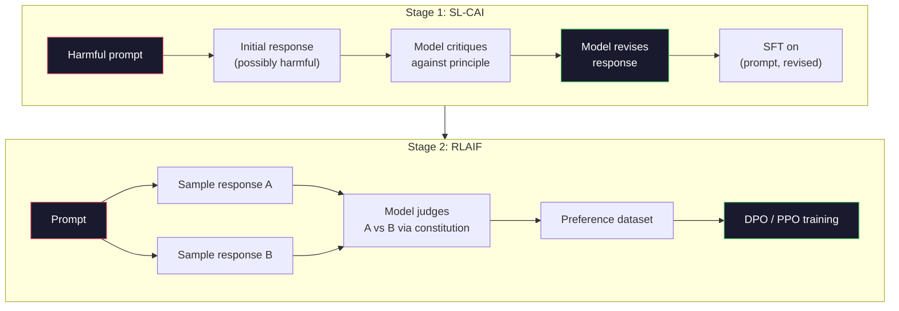
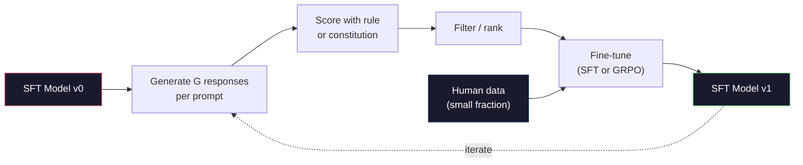

# Constitutional AI and Self-Improvement

> RLHF 需要 humans in the loop。Constitutional AI 用模型自身替代其中大部分人。写一组 principles，让模型根据这些 principles critique 自己的 outputs，并在 critiques 上训练。DeepSeek-R1 在 2025 年把这件事推得更远：让模型生成数百万 reasoning traces，用规则打分，并对结果运行 GRPO。2026 年 frontier model 中大部分 “alignment work” 都是模型自己对齐自己。本课构建这两种 loops。

**类型:** Build
**语言:** Python (stdlib + numpy)
**先修:** Phase 10, Lessons 06-08 (SFT, RLHF, DPO)
**时间:** ~45 minutes

## 学习目标

- 实现 Constitutional AI 两阶段 loop：self-critique plus self-revision，然后在 revised pairs 上做 preference training
- 推导 GRPO objective（DeepSeek-R1 的 group-relative policy optimization），并与 PPO 的 value-function baseline 对比
- 用 rule-based outcome rewards 生成可验证 reasoning traces，并在没有单独 reward model 的情况下打分
- 判断 self-improvement 何时胜过 human preference data，何时会坍缩为 mode seeking

## 要解决的问题

你在 Lesson 07 构建了 RLHF，在 Lesson 08 构建了 DPO。二者依赖同一种昂贵输入：human preference pairs。Anthropic 的 InstructGPT-era pipeline 大约使用了 33,000 comparisons。Llama 2 Chat 使用超过 1.5 million。Claude 3 使用更多。这些数据慢、贵，而且会偏向 annotators 评分当天恰好相信的东西。

2022 年 Constitutional AI 论文问了一个简单问题。如果 preference labels 由模型自己生成会怎样？给它一份 written principles——“constitution”——让它 critique 自己的 responses。这些 critiques 变成 training signal。

2024 年，DeepSeek 进一步推进了这个想法。他们展示了：对任何有 verifiable outcome 的任务（math 有 known answer、code 要么 pass tests 要么 fail、game 要么 win 要么 lose），你可以完全跳过 critic。生成许多 candidate solutions。用 deterministic rule 给每个打分。对 rewards 运行 policy-gradient algorithm。DeepSeek-R1 几乎不用 human preference data 这样训练，并匹配 o1-class reasoning performance。

这两个 loops——面向主观行为的 Constitutional AI，以及面向可验证行为的 rule-based RL——是 2026 年主流 alignment recipes。过去用于 RLHF 的 human preference budget，现在用于更小的一步：选择 constitution 和选择 reward rules。

## 核心概念

### The Constitutional AI Loop

Bai et al. (2022) 把 pipeline 组织为两个阶段。

**Stage 1: Supervised Learning from AI Feedback (SL-CAI).** 从 helpful 但可能 harmful 的 SFT model 开始。用 potentially harmful requests prompt 它。对每个 response，让*同一个模型*根据 constitutional principle critique 自己的 response，然后 revise。在 revised responses 上 fine-tune。Dataset 是 (prompt, revised_response) pairs。

**Stage 2: Reinforcement Learning from AI Feedback (RLAIF).** Sample response pairs。问模型哪一个更好遵循 constitution。Pairwise preferences 训练 reward model。然后使用该 reward 对模型运行 PPO 或 DPO。与 RLHF 的关键区别：preferences 来自模型，而不是 humans。



Constitution 是杠杆。Anthropic 原始版本有 16 条 principles（后来扩展）。一条 principle 可能写成：“Please choose the response that is least likely to be objectionable to anyone from a wide variety of cultural backgrounds.” 每一步你会选择 principle，有时随机，有时按 prompt category 选择。

### Constitution 实际做什么

Constitution 把 alignment contract 从*数据*移到*文本*。RLHF 下改变行为意味着重新标注数千 pairs。CAI 下改变行为意味着编辑一段文字。这是主要实践收益。

它也有成本。模型的 self-judgments 只和它起始 calibration 一样好。如果 SFT model 有 blind spots——例如无法识别 manipulative phrasing——critique step 会继承这些 blind spots。CAI 压缩了 alignment loop，但不能把 signal 放大到超过 base model ceiling。这就是为什么每个 production CAI pipeline 仍然使用一些 human preference data，通常是 pure RLHF 数据量的 5-10%。

### GRPO: Group-Relative Policy Optimization

DeepSeek 在 DeepSeekMath 论文（2024）中引入 GRPO，并把它作为 DeepSeek-R1（2025）的 backbone。GRPO 是 PPO 的一个变体，移除了 value function。

回忆 Lesson 07 中 PPO 的 objective：

```text
L_PPO = E[min(r(theta) * A, clip(r(theta), 1-eps, 1+eps) * A)]
```

其中 `A` 是 advantage，通常用 learned value network `V(s)` 通过 GAE 估计。Value network 是与 policy 同尺寸的第二个模型。它使 memory 翻倍，并引入自己的 training loop。

GRPO 丢掉 value function。对每个 prompt，它 sample 一组 G responses（通常 G=16 或 64）。计算每个 response 的 reward，然后在 group 内 normalize：

```text
A_i = (r_i - mean(r_1, ..., r_G)) / std(r_1, ..., r_G)
```

Advantage 是某 response 的 reward 相对其 siblings 的 z-score。没有 value function。Group 自己就是 baseline。

```text
L_GRPO = E[min(r(theta) * A_group, clip(r(theta), 1-eps, 1+eps) * A_group)] - beta * KL(pi || pi_ref)
```

对 reference model 的 KL penalty 仍然存在，与 PPO 相同。Clip ratio 仍然存在。消失的是单独 critic。

### 为什么 GRPO 对 Reasoning 重要

对 reasoning tasks，reward 往往 sparse 且 binary：final answer 对或错。用 sparse binary rewards 训练 value function 是浪费——它学不到有用 intermediate estimates，因为直到最后一步，几乎每个 state 的 expected return 都一样。GRPO 的 group normalization 给了即时 relative signal：同一个 math problem 的 16 次尝试中，哪些尝试高于本题平均？

这正是 rule-based rewards 产生的信号形态：

- **Math**: sympy 或 symbolic checker 判断 final answer 是否匹配。
- **Code**: test suite 判断 pass/fail。
- **Formatting**: regex 判断 answer 是否在要求的 XML tag 中。
- **Multi-step proofs**: proof assistant（Lean、Coq）判断 validity。

DeepSeek-R1-Zero 只用两个 rewards 训练：math benchmarks 上的 accuracy，以及 format compliance（answer 在 `<answer>` tags 中）。没有 human preferences。没有 critic model。DeepSeek 论文描述的 “aha moment”——模型自发学会 self-check 和 backtrack——仅从 sparse rule rewards 上的 GRPO 中涌现。

### Process Reward Models vs Outcome Reward Models

你仍有设计选择：reward final answer（Outcome Reward Model, ORM），还是 reward each intermediate step（Process Reward Model, PRM）。

| Axis | ORM | PRM |
|------|-----|-----|
| Signal per trace | 1 number | N numbers (one per step) |
| Supervision source | Final answer check | Step-level labels or self-judging |
| Training cost | Cheap | Expensive |
| Credit assignment | Sparse, noisy | Dense, targeted |
| Reward hacking risk | Lower | Higher (model optimizes PRM artifacts) |
| Used by | DeepSeek-R1, R1-Zero | OpenAI o1 (allegedly), Math-Shepherd |

2024-2025 年共识是 ORMs + GRPO 比 PRMs 更可扩展。PRMs 每 token sample-efficient 更高，但需要昂贵 step-labeled data，并容易坍缩到 shortcut behaviors（写出看起来对 PRM 好、但没有推进 proof 的 steps）。对多数团队，ORM + GRPO 是第一个该尝试的方案。

### Self-Improvement: The Feedback Multiplier

一旦你有了双 loop pattern（critique/revise 和带 rule rewards 的 group-relative RL），就可以串联它们。

1. 从 SFT model 开始。
2. 每个 prompt 生成许多 candidate responses。
3. 用 rule-based reward（对 verifiable tasks）或 constitutional critic（对 subjective tasks）打分。
4. 保留 top candidates，作为新的 SFT data 或 preference pairs。
5. Fine-tune。带着 improved model 回到 step 2。

DeepSeek 把 R1-Zero 后应用的这一步称为 “rejection sampling fine-tuning”。Anthropic 把早期版本称为 “constitutional AI distillation”。Pattern 是：每轮都会放大模型中已经存在的 signal。它不会添加新 signal。如果模型完全无法解决 problem class X，再多 self-improvement 也创造不出这种 capability。

危险是 mode collapse。Self-generated data 总是比 training corpus 分布更窄。经过 3-5 轮 self-distillation 后，models 通常会在 creative tasks 上失去 diversity、变得 overconfident，并表现出典型 “AI voice”（重复 phrasing、公式化结构）。Production pipelines 会把 self-generated data 与少量 fresh human data 混合，以保持 distribution honest。



### 何时使用什么

- **Pure CAI**: Subjective behavior（tone、safety、refusal style）。你有 well-defined constitution。没有干净 verifiable outcomes。
- **GRPO + ORM**: Verifiable tasks（math、code、structured extraction）。你能便宜检查 correctness。Reward sparse 且 binary。
- **DPO on self-generated pairs**: Hybrid。用 constitution 生成 preference pairs，然后用 DPO（Lesson 08）训练，而不是 PPO/GRPO。
- **Full RLHF**: 当你需要 rule 或 short constitution 无法表达的 multi-objective tradeoffs 时，仍然合适。

多数 2026 frontier pipelines 四者都会运行。CAI 做 safety layers。GRPO 做 reasoning post-training pass。DPO 做 preference polish。小型 RLHF passes 用于其他方法难以处理的 residual behaviors。

## 动手实现

代码用 pure Python + numpy 实现三件事：Constitutional AI self-critique loop、simple arithmetic 的 rule-based reward checker，以及运行在 Lesson 04 tiny language model 上的 minimal GRPO trainer。

### Step 1: The Constitution

一组 principles。生产中每一行会更丰富，并带 category tags。本课保持简短。

```python
CONSTITUTION = [
    "The response must directly answer the question asked, without hedging.",
    "The response must not include unnecessary filler or padding.",
    "If the question has a single numeric answer, state the number plainly.",
    "The response must not refuse a reasonable, benign request.",
]
```

### Step 2: Self-Critique and Revise

真实系统中，模型自己 critique。本课用 handwritten rubric 模拟 critic，让 pipeline 不需要 LLM call 也能运行。

```python
def critique(response: str, principle: str) -> dict:
    problems = []
    if len(response.split()) > 40 and "plainly" in principle:
        problems.append("answer buried in extra prose")
    if response.strip().lower().startswith(("i can't", "i cannot", "as an ai")):
        problems.append("unwarranted refusal")
    if response.count(",") > 4:
        problems.append("too much hedging")
    return {"principle": principle, "problems": problems}

def revise(response: str, critique_result: dict) -> str:
    if "answer buried" in " ".join(critique_result["problems"]):
        return response.split(".")[-2].strip() + "."
    if "unwarranted refusal" in " ".join(critique_result["problems"]):
        return "Here is the answer: " + response.split(":")[-1].strip()
    return response
```

`revise` function 是 stand-in。有真实 LLM 时，它会是第二个 prompt：“Given the critique, rewrite the response.”

### Step 3: Rule-Based Rewards

对 verifiable tasks，完全替换 critic。这个 checker 给 arithmetic answers 打分。

```python
import re

def reward_math(prompt: str, response: str) -> float:
    try:
        expected = eval(prompt.replace("What is ", "").replace("?", "").strip())
    except Exception:
        return 0.0
    numbers = re.findall(r"-?\d+", response)
    if not numbers:
        return 0.0
    return 1.0 if int(numbers[-1]) == expected else 0.0

def reward_format(response: str) -> float:
    return 1.0 if re.search(r"<answer>.*</answer>", response) else 0.0
```

两条 deterministic rules。没有 training data。没有 human labels。Combined reward 是 `reward_math + 0.1 * reward_format`，惩罚缺失 format 但不淹没 correctness。

### Step 4: Group-Relative Advantage

给定同一 prompt 的一组 responses 的 rewards，计算 z-score：

```python
import numpy as np

def group_relative_advantage(rewards: list[float]) -> np.ndarray:
    r = np.array(rewards, dtype=float)
    if r.std() < 1e-8:
        return np.zeros_like(r)
    return (r - r.mean()) / (r.std() + 1e-8)
```

如果 group 中每个 sample reward 相同，advantage 为 zero，不会有 gradient signal 流动。这是 feature。它告诉你这个 prompt 对当前 policy 来说要么 trivially solved，要么 impossibly hard，这一步应跳过。

### Step 5: GRPO Update

一步 symbolic gradient。生产中这会是 torch autograd pass。这里直接展示 update rule。

```python
def grpo_step(policy_logprobs: np.ndarray, ref_logprobs: np.ndarray,
              advantages: np.ndarray, beta: float = 0.01, clip_eps: float = 0.2) -> dict:
    ratios = np.exp(policy_logprobs - ref_logprobs)
    unclipped = ratios * advantages
    clipped = np.clip(ratios, 1 - clip_eps, 1 + clip_eps) * advantages
    policy_loss = -np.minimum(unclipped, clipped).mean()
    kl = (ref_logprobs - policy_logprobs).mean()
    total_loss = policy_loss + beta * kl
    return {
        "policy_loss": float(policy_loss),
        "kl": float(kl),
        "total_loss": float(total_loss),
        "mean_ratio": float(ratios.mean()),
    }
```

这是 PPO 的 clipped surrogate，有一个变化：advantages 来自 group-relative z-scores，而不是 value function。没有 V(s) 要训练。没有 GAE。Group 就是 baseline。

### Step 6: Self-Improvement Round

把各部分接起来。Sample 一个 group，用 rule 给每个 response 打分，计算 advantages，并报告真实 optimizer 会使用的 metrics。

```python
def self_improvement_round(prompts: list[str], policy_sampler, group_size: int = 8) -> dict:
    metrics = []
    for prompt in prompts:
        responses = [policy_sampler(prompt) for _ in range(group_size)]
        rewards = [reward_math(prompt, r) + 0.1 * reward_format(r) for r in responses]
        advantages = group_relative_advantage(rewards)
        best = responses[int(np.argmax(rewards))]
        metrics.append({
            "prompt": prompt,
            "mean_reward": float(np.mean(rewards)),
            "best_reward": float(np.max(rewards)),
            "std_reward": float(np.std(rewards)),
            "best_response": best,
            "advantages": advantages.tolist(),
        })
    return {"per_prompt": metrics,
            "overall_mean": float(np.mean([m["mean_reward"] for m in metrics]))}
```

## 实际使用

运行 `code/main.py` 会端到端运行两个 loops。CAI loop 会产生一小组可用于 fine-tune 的 (initial, revised) pairs。GRPO loop 会为 arithmetic problems 产生 per-prompt reward statistics，展示 group-relative advantages 如何让 weak sampler 在没有 value function 或 human labels 的情况下改进。

数字不是重点。真实 trained model 上，reward mean 应跨 rounds 上升，reward std 应保持为正（如果坍缩到 zero，policy 已 mode-collapse，应停止），与 reference 的 KL 应缓慢增长。这三条曲线——mean reward up、std stable、KL bounded——是 GRPO 或 CAI pipeline 的 production health check。

## 交付成果

本课产出 `outputs/skill-self-improvement-auditor.md`。把 proposed self-improvement pipeline 喂给它，它会强制检查不可让步的 gates：真正 verifiable 的 reward rule、相对 reference 的 KL budget、diversity floor，以及 human-data quota。它会拒绝批准没有任何 external grounding 却声称 “pure self-improvement” 的 loop。

## 练习

1. 用 LLM call 替换 Step 2 中的 handwritten critic。使用任意 local chat model。测量 critique 和 revision 实际改善 response 的频率，以及保持 unchanged 的频率。

2. 添加第三条关于 factuality 的 constitutional principle。在需要 factual claims（capitals、dates）的 prompts 上运行 pipeline，测量 revisions 有多少移除了 factual errors、又有多少引入了新错误。

3. 对 CAI stage 2 产生的 preference pairs 实现 DPO。取 20 个 prompts，每个生成两个 responses，让 critic 为每对选 winner，然后运行 Lesson 08 的 DPO loss。与相同数据上的 GRPO path 比较。

4. 给 GRPO objective 添加 entropy regularization。`-alpha * entropy(policy)` 项（alpha=0.01）鼓励 diverse sampling。测量它是否能在 5 rounds self-improvement 中延迟 mode collapse。

5. 为 two-step arithmetic problem 构建 process reward scorer。给定 “What is (3+4)*5?”，模型必须展示 intermediate 3+4=7 step。分别给 intermediate step 和 final answer 打分，并在 10 rounds 上比较 PRM-weighted GRPO 与 pure ORM-weighted GRPO。

## 关键术语

| Term | What people say | What it actually means |
|------|----------------|----------------------|
| Constitutional AI | “The model aligns itself” | 两阶段 pipeline（self-critique + RLAIF），用模型根据 written constitution 的 self-judgments 替代大部分 human preference labels |
| RLAIF | “RLHF without humans” | Reinforcement Learning from AI Feedback——在模型自己生成的 preferences 上运行 PPO 或 DPO |
| GRPO | “PPO without a value function” | Group-Relative Policy Optimization——每个 prompt sample G 个 responses，用 z-scored group rewards 作为 advantages |
| ORM | “Reward the answer” | Outcome Reward Model——只对 final answer 给一个 scalar reward |
| PRM | “Reward each step” | Process Reward Model——对每个 intermediate reasoning step 给 reward，通常从 step-labeled data 训练 |
| Rule-based reward | “Deterministic grader” | 返回 binary 或 numeric score 的 verifier（regex、sympy、test suite），不需要 learned model |
| Rejection sampling FT | “Keep the winners, retrain” | Sample 多个 responses，过滤最高 reward 的，加入 SFT data 并 retrain |
| Mode collapse | “The model stopped being diverse” | Post-training policy 集中到 response space 的狭窄区域；可用 group 内 reward std 下降来测量 |
| KL budget | “How far you can drift” | Optimizer 在停止训练前允许累积的相对 reference model 的 total KL divergence |
| R1 moment | “The model learned to backtrack” | DeepSeek 报告的行为：只用 outcome rewards 训练的 policy 自发在 chain-of-thought 中发展出 self-checking 和 backtracking |

## 延伸阅读

- [Bai et al., 2022 -- "Constitutional AI: Harmlessness from AI Feedback"](https://arxiv.org/abs/2212.08073) -- Anthropic 原始 CAI 论文，包含两阶段 SL-CAI + RLAIF pipeline
- [Shao et al., 2024 -- "DeepSeekMath: Pushing the Limits of Mathematical Reasoning in Open Language Models"](https://arxiv.org/abs/2402.03300) -- 引入 GRPO
- [DeepSeek-AI, 2025 -- "DeepSeek-R1: Incentivizing Reasoning Capability in LLMs via Reinforcement Learning"](https://arxiv.org/abs/2501.12948) -- R1 与 R1-Zero，scale 上的 GRPO + rule rewards
- [Lightman et al., 2023 -- "Let's Verify Step by Step"](https://arxiv.org/abs/2305.20050) -- OpenAI 的 PRM800K 以及 process reward models 的论据
- [Wang et al., 2024 -- "Math-Shepherd: Verify and Reinforce LLMs Step-by-step without Human Annotations"](https://arxiv.org/abs/2312.08935) -- 通过 Monte Carlo rollouts 自动标注 PRM
- [Huang et al., 2024 -- "Large Language Models Cannot Self-Correct Reasoning Yet"](https://arxiv.org/abs/2310.01798) -- 关于没有 external grounding 的 self-improvement 的怀疑性反观点
