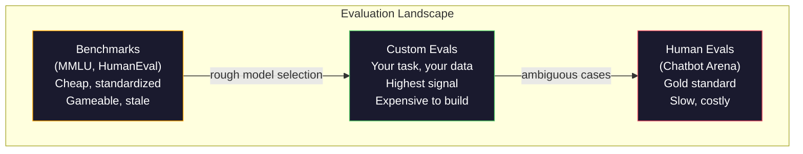
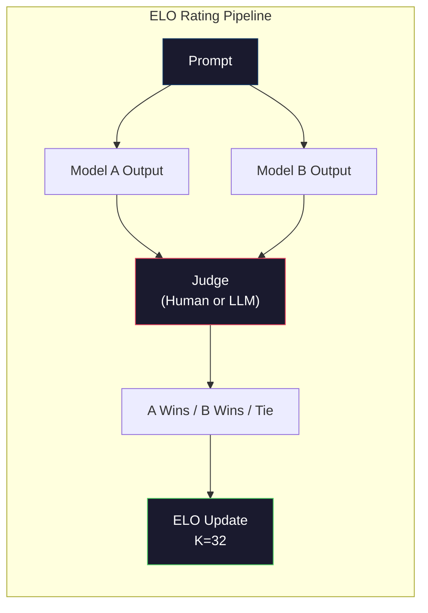

# 评估：基准、Evals 与 LM Harness

> 古德哈特定律：当一个指标成为目标，它就不再是好指标。每个前沿实验室都会“打榜”。MMLU 分数不断上升，而模型仍然不能可靠地数出 "strawberry" 里有几个 R。唯一真正重要的 eval 是你的 eval -- 用在你的任务、你的数据上。

**类型:** Build
**语言:** Python
**先修:** Phase 10, Lessons 01-05 (LLMs from Scratch)
**时间:** ~90 minutes

## 学习目标

- 构建一个自定义评估 harness，对语言模型运行多选和开放式 benchmark
- 解释为什么标准 benchmark（MMLU、HumanEval）会饱和，并且无法区分前沿模型
- 用合适的指标实现任务特定 eval：exact match、F1、BLEU 和 LLM-as-judge scoring
- 设计面向具体用例的自定义 evaluation suite，而不是只依赖公开 leaderboard

## 要解决的问题

MMLU 于 2020 年发布，包含 57 个学科的 15,908 道题。三年内，前沿模型就把它打到饱和。GPT-4 得到 86.4%。Claude 3 Opus 得到 86.8%。Llama 3 405B 得到 88.6%。leaderboard 被压缩到 3 个百分点的范围内，这里的差异更像统计噪声，而不是真实能力差距。

与此同时，这些模型会在 10 岁孩子不假思索就能完成的任务上失败。Claude 3.5 Sonnet 在 MMLU 上得分 88.7%，但最初无法数出 "strawberry" 里的字母数量 -- 这个任务不需要世界知识，也不需要推理，只需要字符级迭代。HumanEval 用 164 道题测试代码生成。模型在它上面拿到 90%+，但仍会生成在边界情况上崩溃的代码，而这些边界情况任何初级开发者都会注意到。

benchmark 表现与真实世界可靠性之间的差距，是 LLM 评估的核心问题。benchmark 只能告诉你模型在 benchmark 上表现如何。它几乎不能告诉你，这个模型在你的具体任务、你的具体数据、你的具体 failure mode 下会怎样表现。如果你在构建客服 bot，MMLU 无关紧要。如果你在构建代码助手，HumanEval 只覆盖函数级生成 -- 它不说明调试、重构，或跨文件解释代码的能力。

你需要 custom evals。不是因为 benchmark 毫无用处 -- 它们对粗略选型有帮助 -- 而是因为最终评估必须精确匹配你的部署条件。

## 核心概念

### Eval 版图

评估有三类，每类的成本和信号质量都不同。

**Benchmarks** 是标准化测试套件。MMLU、HumanEval、SWE-bench、MATH、ARC、HellaSwag。你让模型跑 benchmark，然后得到一个分数。优点：所有人使用同一套测试，所以可以比较模型。缺点：模型和训练数据越来越会污染这些 benchmark。实验室训练所用的数据中包含 benchmark 题目。分数会上升，能力未必会上升。

**Custom evals** 是你为自己的具体用例构建的测试套件。你定义输入、期望输出和 scoring function。法律文档总结器就用法律文档评估。SQL generator 就用你的数据库 schema 评估。这些 eval 创建成本高，但它们是唯一能预测生产表现的评估。

**Human evals** 使用付费标注员按有用性、正确性、流畅性和安全性等标准判断模型输出。对于自动评分失效的开放式任务，这是黄金标准。Chatbot Arena 已经在 100+ 个模型上收集了超过 200 万次人类偏好投票。缺点：成本（每次 judgment $0.10-$2.00）和速度（数小时到数天）。



### 为什么 Benchmark 会失效

有三种机制会让 benchmark 分数不再反映真实能力。

**Data contamination.** 训练语料会抓取互联网。benchmark 问题也在互联网上。模型在训练期间看到了答案。这不是传统意义上的作弊 -- 实验室并不会有意包含 benchmark 数据。但 web-scale scraping 让彻底排除这些数据几乎不可能。

**Teaching to the test.** 实验室会为了 benchmark 表现优化训练混合。如果训练混合中有 5% 是 MMLU 风格的多选题，模型就会学习这种格式和答案分布。MMLU 是四选一。模型会学到答案在 A/B/C/D 上大致均匀分布，即使模型不知道答案，这也会有帮助。

**Saturation.** 当每个前沿模型在某个 benchmark 上都得 85-90% 时，这个 benchmark 就停止区分模型。剩余 10-15% 的题目可能含糊、标错，或需要冷门领域知识。MMLU 从 87% 提升到 89%，可能只是模型记住了另外两道冷门题，而不是模型真的更聪明。

### Perplexity：快速健康检查

Perplexity 衡量模型对一串 token 有多惊讶。形式化地说，它是平均负 log-likelihood 的指数：

```text
PPL = exp(-1/N * sum(log P(token_i | context)))
```

perplexity 为 10 表示模型平均而言像是在每个 token 位置从 10 个选项中均匀选择一样不确定。越低越好。GPT-2 在 WikiText-103 上的 perplexity 约为 30。GPT-3 约为 20。Llama 3 8B 约为 7。

Perplexity 对于在同一测试集上比较模型很有用，但也有盲点。一个模型可以因为擅长预测常见模式而得到低 perplexity，同时在罕见但重要的模式上很糟糕。它也不说明 instruction following、reasoning 或 factual accuracy。把它当作 sanity check，而不是最终结论。

### LLM-as-Judge

用强模型评估弱模型的输出。想法很简单：让 GPT-4o 或 Claude Sonnet 按 1-5 分评价一个响应的 correctness、helpfulness 和 safety。用 GPT-4o-mini 时，每次 judgment 成本约 $0.01，并且与人类 judgment 的相关性出乎意料地好 -- 大多数任务上约 80% 一致。

scoring prompt 比模型本身更重要。模糊 prompt（"Rate this response"）会产生噪声分数。带 rubric 的结构化 prompt（"如果答案事实正确且引用来源则给 5 分，正确但没有来源给 4 分，部分正确给 3 分..."）会产生一致、可复现的分数。

failure mode：judge 模型会表现出 position bias（在成对比较中偏好第一个响应）、verbosity bias（偏好更长的响应）和 self-preference（GPT-4 给 GPT-4 输出的分数高于等价的 Claude 输出）。缓解方式：随机化顺序、按长度归一化、使用与被评估模型不同的 judge。

### 来自成对比较的 ELO Ratings

这是 Chatbot Arena 的方法。展示两个不同模型对同一 prompt 的响应。人类（或 LLM judge）选择更好的那个。根据数千次这样的比较，计算每个模型的 ELO rating -- 这与国际象棋使用的是同一套系统。

ELO 的优点：相对排序比绝对评分更可靠，能优雅处理平局，并且比独立给每个输出打分需要更少比较就能收敛。截至 2026 年初，Chatbot Arena 排名显示 GPT-4o、Claude 3.5 Sonnet 和 Gemini 1.5 Pro 在榜首相差不到 20 个 ELO points。



### Eval Frameworks

**lm-evaluation-harness** (EleutherAI)：标准开源 eval framework。支持 200+ 个 benchmark。用一条命令让任意 Hugging Face 模型跑 MMLU、HellaSwag、ARC 等。Open LLM Leaderboard 使用它。

**RAGAS**：专门面向 RAG pipeline 的 evaluation framework。衡量 faithfulness（答案是否匹配 retrieved context？）、relevance（retrieved context 是否与问题相关？）和 answer correctness。

**promptfoo**：面向 prompt engineering 的 config-driven eval。在 YAML 中定义 test case，对多个模型运行，得到 pass/fail report。它适合 prompt regression testing -- 确保一次 prompt 修改不会破坏已有 test case。

### 构建 Custom Evals

这是唯一对生产真正重要的 eval。流程如下：

1. **定义任务。** 模型到底应该做什么？要精确。"Answer questions" 太模糊。"给定一封客户投诉邮件，抽取 product name、issue category 和 sentiment" 才是可以评估的任务。

2. **创建 test cases。** 原型 eval 至少 50 个，生产 eval 需要 200+。每个 test case 是一个 (input, expected_output) 对。包含 edge cases：空输入、对抗输入、歧义输入、其他语言的输入。

3. **定义 scoring。** 结构化输出用 exact match。文本相似度用 BLEU/ROUGE。开放式质量用 LLM-as-judge。抽取任务用 F1。用权重组合多个 metric。

4. **自动化。** 每个 eval 都用一条命令运行。没有手工步骤。以支持随时间比较的格式存储结果。

5. **跟踪随时间变化。** 孤立的 eval score 没有意义。你需要 trendline。上次 prompt 修改后分数是否提升？切换模型后是否回退？把 eval 与 prompt 一起 version。

| Eval Type | Cost per judgment | Agreement with humans | Best for |
|-----------|------------------|----------------------|----------|
| Exact match | ~$0 | 100% (when applicable) | Structured output, classification |
| BLEU/ROUGE | ~$0 | ~60% | Translation, summarization |
| LLM-as-judge | ~$0.01 | ~80% | Open-ended generation |
| Human eval | $0.10-$2.00 | N/A (is the ground truth) | Ambiguous, high-stakes tasks |

## 动手实现

### Step 1：一个最小 Eval Framework

定义核心抽象。一个 eval case 有 input、expected output 和一个可选 metadata dict。scorer 接收 prediction 和 reference，并返回 0 到 1 之间的分数。

```python
import json
from collections import Counter

class EvalCase:
    def __init__(self, input_text, expected, metadata=None):
        self.input_text = input_text
        self.expected = expected
        self.metadata = metadata or {}

class EvalSuite:
    def __init__(self, name, cases, scorers):
        self.name = name
        self.cases = cases
        self.scorers = scorers

    def run(self, model_fn):
        results = []
        for case in self.cases:
            prediction = model_fn(case.input_text)
            scores = {}
            for scorer_name, scorer_fn in self.scorers.items():
                scores[scorer_name] = scorer_fn(prediction, case.expected)
            results.append({
                "input": case.input_text,
                "expected": case.expected,
                "prediction": prediction,
                "scores": scores,
            })
        return results
```

### Step 2：Scoring Functions

构建 exact match、token F1 和一个模拟的 LLM-as-judge scorer。

```python
def exact_match(prediction, expected):
    return 1.0 if prediction.strip().lower() == expected.strip().lower() else 0.0

def token_f1(prediction, expected):
    pred_tokens = set(prediction.lower().split())
    exp_tokens = set(expected.lower().split())
    if not pred_tokens or not exp_tokens:
        return 0.0
    common = pred_tokens & exp_tokens
    precision = len(common) / len(pred_tokens)
    recall = len(common) / len(exp_tokens)
    if precision + recall == 0:
        return 0.0
    return 2 * (precision * recall) / (precision + recall)

def llm_judge_simulated(prediction, expected):
    pred_words = set(prediction.lower().split())
    exp_words = set(expected.lower().split())
    if not exp_words:
        return 0.0
    overlap = len(pred_words & exp_words) / len(exp_words)
    length_penalty = min(1.0, len(prediction) / max(len(expected), 1))
    return round(overlap * 0.7 + length_penalty * 0.3, 3)
```

### Step 3：ELO Rating System

用 ELO updates 实现成对比较。这正是 Chatbot Arena 用来给模型排名的系统。

```python
class ELOTracker:
    def __init__(self, k=32, initial_rating=1500):
        self.ratings = {}
        self.k = k
        self.initial_rating = initial_rating
        self.history = []

    def _ensure_player(self, name):
        if name not in self.ratings:
            self.ratings[name] = self.initial_rating

    def expected_score(self, rating_a, rating_b):
        return 1 / (1 + 10 ** ((rating_b - rating_a) / 400))

    def record_match(self, player_a, player_b, outcome):
        self._ensure_player(player_a)
        self._ensure_player(player_b)

        ea = self.expected_score(self.ratings[player_a], self.ratings[player_b])
        eb = 1 - ea

        if outcome == "a":
            sa, sb = 1.0, 0.0
        elif outcome == "b":
            sa, sb = 0.0, 1.0
        else:
            sa, sb = 0.5, 0.5

        self.ratings[player_a] += self.k * (sa - ea)
        self.ratings[player_b] += self.k * (sb - eb)

        self.history.append({
            "a": player_a, "b": player_b,
            "outcome": outcome,
            "rating_a": round(self.ratings[player_a], 1),
            "rating_b": round(self.ratings[player_b], 1),
        })

    def leaderboard(self):
        return sorted(self.ratings.items(), key=lambda x: -x[1])
```

### Step 4：Perplexity Calculation

使用 token probabilities 计算 perplexity。实践中你会从模型 logits 中得到这些值。这里我们用 probability distribution 模拟。

```python
import numpy as np

def perplexity(log_probs):
    if not log_probs:
        return float("inf")
    avg_neg_log_prob = -np.mean(log_probs)
    return float(np.exp(avg_neg_log_prob))

def token_log_probs_simulated(text, model_quality=0.8):
    np.random.seed(hash(text) % 2**31)
    tokens = text.split()
    log_probs = []
    for i, token in enumerate(tokens):
        base_prob = model_quality
        if len(token) > 8:
            base_prob *= 0.6
        if i == 0:
            base_prob *= 0.7
        prob = np.clip(base_prob + np.random.normal(0, 0.1), 0.01, 0.99)
        log_probs.append(float(np.log(prob)))
    return log_probs
```

### Step 5：Aggregate Results

计算一次 eval run 的汇总统计：mean、median、某个 threshold 下的 pass rate，以及按 metric 拆分的结果。

```python
def summarize_results(results, threshold=0.8):
    all_scores = {}
    for r in results:
        for metric, score in r["scores"].items():
            all_scores.setdefault(metric, []).append(score)

    summary = {}
    for metric, scores in all_scores.items():
        arr = np.array(scores)
        summary[metric] = {
            "mean": round(float(np.mean(arr)), 3),
            "median": round(float(np.median(arr)), 3),
            "std": round(float(np.std(arr)), 3),
            "min": round(float(np.min(arr)), 3),
            "max": round(float(np.max(arr)), 3),
            "pass_rate": round(float(np.mean(arr >= threshold)), 3),
            "n": len(scores),
        }
    return summary

def print_summary(summary, suite_name="Eval"):
    print(f"\n{'=' * 60}")
    print(f"  {suite_name} Summary")
    print(f"{'=' * 60}")
    for metric, stats in summary.items():
        print(f"\n  {metric}:")
        print(f"    Mean:      {stats['mean']:.3f}")
        print(f"    Median:    {stats['median']:.3f}")
        print(f"    Std:       {stats['std']:.3f}")
        print(f"    Range:     [{stats['min']:.3f}, {stats['max']:.3f}]")
        print(f"    Pass rate: {stats['pass_rate']:.1%} (threshold >= 0.8)")
        print(f"    N:         {stats['n']}")
```

### Step 6：Run the Full Pipeline

把所有东西连接起来。定义一个任务，创建 test cases，模拟两个模型，运行 evals，基于成对比较计算 ELO，并打印 leaderboard。

```python
def demo_model_good(prompt):
    responses = {
        "What is the capital of France?": "Paris",
        "What is 2 + 2?": "4",
        "Who wrote Hamlet?": "William Shakespeare",
        "What language is PyTorch written in?": "Python and C++",
        "What is the boiling point of water?": "100 degrees Celsius",
    }
    return responses.get(prompt, "I don't know")

def demo_model_bad(prompt):
    responses = {
        "What is the capital of France?": "Paris is the capital city of France",
        "What is 2 + 2?": "The answer is four",
        "Who wrote Hamlet?": "Shakespeare",
        "What language is PyTorch written in?": "Python",
        "What is the boiling point of water?": "212 Fahrenheit",
    }
    return responses.get(prompt, "Unknown")

cases = [
    EvalCase("What is the capital of France?", "Paris"),
    EvalCase("What is 2 + 2?", "4"),
    EvalCase("Who wrote Hamlet?", "William Shakespeare"),
    EvalCase("What language is PyTorch written in?", "Python and C++"),
    EvalCase("What is the boiling point of water?", "100 degrees Celsius"),
]

suite = EvalSuite(
    name="General Knowledge",
    cases=cases,
    scorers={
        "exact_match": exact_match,
        "token_f1": token_f1,
        "llm_judge": llm_judge_simulated,
    },
)

results_good = suite.run(demo_model_good)
results_bad = suite.run(demo_model_bad)

print_summary(summarize_results(results_good), "Model A (concise)")
print_summary(summarize_results(results_bad), "Model B (verbose)")
```

"good" 模型给出精确答案。"bad" 模型给出冗长的改写。Exact match 会严重惩罚冗长模型。Token F1 和 LLM-as-judge 更宽容。这说明为什么 metric choice 重要：同一个模型看起来很棒还是很糟，取决于你如何给它打分。

### Step 7：ELO Tournament

在多轮中运行模型之间的成对比较。

```python
elo = ELOTracker(k=32)

for case in cases:
    pred_a = demo_model_good(case.input_text)
    pred_b = demo_model_bad(case.input_text)

    score_a = token_f1(pred_a, case.expected)
    score_b = token_f1(pred_b, case.expected)

    if score_a > score_b:
        outcome = "a"
    elif score_b > score_a:
        outcome = "b"
    else:
        outcome = "tie"

    elo.record_match("model_a_concise", "model_b_verbose", outcome)

print("\nELO Leaderboard:")
for name, rating in elo.leaderboard():
    print(f"  {name}: {rating:.0f}")
```

### Step 8：Perplexity Comparison

比较不同质量水平“模型”的 perplexity。

```python
test_text = "The quick brown fox jumps over the lazy dog in the garden"

for quality, label in [(0.9, "Strong model"), (0.7, "Medium model"), (0.4, "Weak model")]:
    log_probs = token_log_probs_simulated(test_text, model_quality=quality)
    ppl = perplexity(log_probs)
    print(f"  {label} (quality={quality}): perplexity = {ppl:.2f}")
```

## 实际使用

### lm-evaluation-harness (EleutherAI)

在任意模型上运行 benchmark 的标准工具。

```python
# pip install lm-eval
# Command line:
# lm_eval --model hf --model_args pretrained=meta-llama/Llama-3.1-8B --tasks mmlu --batch_size 8

# Python API:
# import lm_eval
# results = lm_eval.simple_evaluate(
#     model="hf",
#     model_args="pretrained=meta-llama/Llama-3.1-8B",
#     tasks=["mmlu", "hellaswag", "arc_easy"],
#     batch_size=8,
# )
# print(results["results"])
```

### promptfoo

面向 prompt engineering 的 config-driven eval。在 YAML 中定义 tests，并对多个 providers 运行。

```yaml
# promptfoo.yaml
providers:
  - openai:gpt-4o-mini
  - anthropic:claude-3-haiku

prompts:
  - "Answer in one word: {{question}}"

tests:
  - vars:
      question: "What is the capital of France?"
    assert:
      - type: contains
        value: "Paris"
  - vars:
      question: "What is 2 + 2?"
    assert:
      - type: equals
        value: "4"
```

### 用 RAGAS 做 RAG evaluation

```python
# pip install ragas
# from ragas import evaluate
# from ragas.metrics import faithfulness, answer_relevancy, context_precision
#
# result = evaluate(
#     dataset,
#     metrics=[faithfulness, answer_relevancy, context_precision],
# )
# print(result)
```

RAGAS 衡量的是通用 eval 会漏掉的东西：模型答案是否扎根于 retrieved context，而不只是答案在抽象层面上是否“正确”。

## 交付成果

本课产出 `outputs/prompt-eval-designer.md` -- 一个可复用 prompt，用来为任意任务设计 custom eval suites。给它一个任务描述，它会生成 test cases、scoring functions，以及 pass/fail threshold 建议。

它还产出 `outputs/skill-llm-evaluation.md` -- 一个决策框架，用于根据你的 task type、budget 和 latency requirements 选择正确的 evaluation strategy。

## 练习

1. 添加一个 "consistency" scorer：用同一输入运行模型 5 次，并衡量输出相同的频率。确定性输入上答案不一致，会暴露脆弱 prompt 或过高 temperature settings。

2. 扩展 ELO tracker，让它支持多个 judge functions（exact match、F1、LLM-as-judge）并为它们加权。比较当你重度加权 exact match 与重度加权 F1 时，leaderboard 如何变化。

3. 为一个具体任务构建 eval suite：把 email classification 分成 5 个类别。创建 100 个 test cases，包含多样例子和 edge cases（可能属于多个类别的 emails、空 emails、其他语言的 emails）。衡量不同“模型”（rule-based、keyword matching、simulated LLM）的表现。

4. 实现 contamination detection：给定一组 eval questions 和 training corpus，检查有多少比例的 eval questions（或接近改写）出现在训练数据中。这是研究者审计 benchmark validity 的方式。

5. 构建一个 "model diff" tool。给定两个 model versions 的 eval results，突出显示哪些具体 test cases 改善了、哪些回退了、哪些保持不变。这是 eval 版的 code diff -- 对理解一个变更是有帮助还是有伤害至关重要。

## 关键术语

| Term | What people say | What it actually means |
|------|----------------|----------------------|
| MMLU | "The benchmark" | Massive Multitask Language Understanding -- 15,908 multiple choice questions across 57 subjects, saturated above 88% by 2025 |
| HumanEval | "Code eval" | 164 Python function-completion problems from OpenAI, tests only isolated function generation |
| SWE-bench | "Real coding eval" | 2,294 GitHub issues from 12 Python repos, measures end-to-end bug fixing including test generation |
| Perplexity | "How confused the model is" | exp(-avg(log P(token_i given context))) -- lower means the model assigns higher probability to the actual tokens |
| ELO rating | "Chess ranking for models" | A relative skill rating computed from pairwise win/loss records, used by Chatbot Arena to rank 100+ models |
| LLM-as-judge | "Using AI to grade AI" | A strong model scores a weaker model's outputs against a rubric, ~80% agreement with human judges at ~$0.01/judgment |
| Data contamination | "The model saw the test" | Training data includes benchmark questions, inflating scores without improving real capability |
| Eval suite | "A bunch of tests" | A versioned collection of (input, expected_output, scorer) triples that measure a specific capability |
| Pass rate | "What percentage it gets right" | Fraction of eval cases scoring above a threshold -- more actionable than mean score because it measures reliability |
| Chatbot Arena | "Model ranking website" | LMSYS platform with 2M+ human preference votes, producing the most trusted LLM leaderboard via ELO ratings |

## 延伸阅读

- [Hendrycks et al., 2021 -- "Measuring Massive Multitask Language Understanding"](https://arxiv.org/abs/2009.03300) -- MMLU 论文；尽管已经饱和，它仍是被引用最多的 LLM benchmark
- [Chen et al., 2021 -- "Evaluating Large Language Models Trained on Code"](https://arxiv.org/abs/2107.03374) -- OpenAI 的 HumanEval 论文，确立了 code generation evaluation methodology
- [Zheng et al., 2023 -- "Judging LLM-as-a-Judge"](https://arxiv.org/abs/2306.05685) -- 对使用 LLMs 评估 LLMs 的系统分析，包含 position bias 和 verbosity bias 的发现
- [LMSYS Chatbot Arena](https://chat.lmsys.org/) -- crowdsourced model comparison platform，拥有 2M+ votes，通过 ELO ratings 生成最受信任的真实世界 LLM ranking
