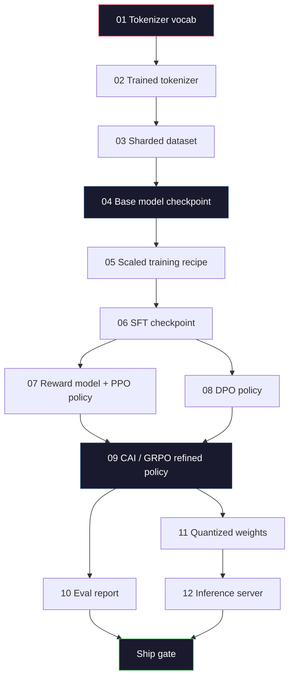
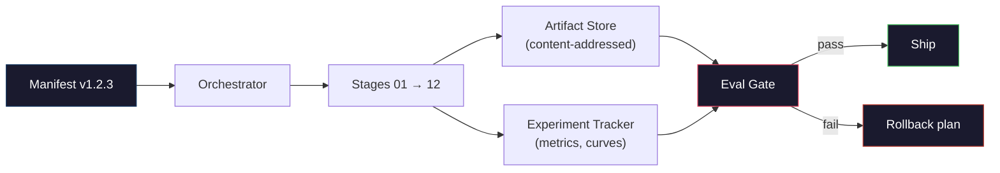

# 构建完整 LLM Pipeline

> Lessons 01 到 12 的所有内容，都是同一个 pipeline 的一个 stage。本课是把这些 stages 变成一次端到端运行的脚手架：tokenize、pre-train、scale、SFT、align、evaluate、quantize、serve。你不会在笔记本上训练 70B 模型。你会产出 orchestration layer、manifest、eval gate 和 rollback plan，这是 2026 年前沿团队用来决定什么能发布的东西。这是 capstone。

**类型:** Build
**语言:** Python (stdlib)
**先修:** All Phase 10 lessons 01-12
**时间:** ~120 minutes

## 学习目标

- 把前十一课（tokenizer、data、pre-training、scaling、SFT、RLHF、DPO、CAI、eval、quantization、inference）组合成一个可复现的 pipeline spec
- 定义 stages 之间的 artifact contract：每个 stage 消费什么、产出什么，以及下一个 stage 如何验证输入
- 构建一个 orchestrator，用来跟踪 experiments、hash artifacts，并基于 eval thresholds gate ship decisions
- 设计 rollback plan：哪些 artifacts 重新运行便宜，哪些昂贵，以及一个 corrupted checkpoint 代价有多高

## 要解决的问题

前面的课程各自都能工作。Tokenizer 训练好了。Tiny GPT 预训练完成了。SFT dataset 组好了。Reward model 训练了。DPO 运行了。Evals 测量了。Quantized weights 导出了。Inference server 启动了。每一个都是 notebook。每一个都有自己的 conventions、output paths 和 seed。

前沿训练运行不是 notebook。Llama 3 405B 在大约 54 天里用了 3000 万 H100 hours。DeepSeek-V3 用了约 280 万 H800 hours。在这期间，一个 corrupted checkpoint、一次 data contamination、一个 eval regression 都可能让团队损失一周 wall-clock 和一个月 GPU budget。团队靠 pipeline hygiene 活下来：每个 stage 都有 deterministic input、deterministic output、manifest、hash 和 gate。

这是 capstone。你不会在笔记本上端到端运行这个 pipeline。你会编写协调 stages 的 orchestrator、描述 run 的 manifest、gate ship decisions 的 verifier，以及让第三方能从单个文件 replay 你工作的 replay plan。代码很小；纪律很大。

这个模式从 100M 到 1T 参数都不变。同样四个组件 -- manifest、orchestrator、eval gate、artifact store -- 既能运行 Llama 3，也能运行你的 hobby GPT。差别是每个 stage config 里的数字大小，而不是 pipeline 的形状。

## 核心概念

### Twelve Stages

每个 Phase 10 lesson 都是一个 stage。完整 dependency graph 如下。



Stages 07 和 08 可以并行运行。其他所有内容都是硬依赖。stage 02（tokenizer）的变化会使所有 downstream artifact 失效。stage 10（eval）的变化只会使 ship decision 失效。

### Manifest

manifest 是一个单文件，它完整描述一次 run，完整到足以 replay。pipeline 产出的任何东西都不应该依赖 manifest 之外的状态。这些字段很无聊，但必不可少。

```text
pipeline_version: 1.2.3
seed: 42
git_commit: a1b2c3d4
stages:
  01_tokenizer:
    recipe: bpe_32k
    input_hash: sha256:...
    output_hash: sha256:...
    wall_clock_sec: 3600
    cost_usd: 12
```

stage N 的 output hash 是 stage N+1 的 input hash。任何偏差都会让 pipeline 停止。这就是你早期捕获 data corruption 的方式。它也是另一个大洲的队友验证他们 replay 是否产出与你相同 artifact 的方式。

实践中，团队会使用一个小型 YAML schema 加一个 manifest checker，与上一次成功 run 做 diff。任何超出预期字段（cost、wall clock）的 delta 都是红旗。

### Artifact Typing

每个 stage 的输出都是一个 typed artifact。不是 directory blob，不是 pickle，而是带已知 schema 的命名类型。

| Stage | Artifact Type | Key Fields |
|-------|--------------|-----------|
| 01-02 | Tokenizer | vocab.json, merges.txt, config.json, hash |
| 03 | Dataset | shards[], row count, token count, dedup stats |
| 04-05 | Checkpoint | weights.safetensors, config.json, optimizer state, step count |
| 06 | SFT Model | checkpoint + SFT recipe + data mix |
| 07 | Reward Model | RM checkpoint + preference data hash |
| 08-09 | Policy | checkpoint + reference hash + beta + KL budget consumed |
| 10 | Eval Report | benchmark scores + regression diffs + eval data hash |
| 11 | Quantized Model | quantized weights + calibration data + accuracy delta vs FP16 |
| 12 | Server Spec | endpoint + model hash + config + observability hooks |

typing 能防止最常见 failure mode：把 stage 08 output 当作 stage 06 input 使用，或者通过 SFT path 发布一个 DPO-trained model。Typed artifacts 和 typed stage signatures 让这些错误成为 compile-time failures，而不是第五天的失败。

### Eval Gate

Shipping 不是“训练完成”。Shipping 是“训练完成，并且 eval gate 通过”。gate 在 run 开始前定义。

```text
gates:
  mmlu:      >= baseline + 0.5   # no regression
  humaneval: >= baseline + 1.0
  truthfulqa: >= baseline         # no drop
  safety_refusal_rate: <= 0.05
  kl_from_reference: <= 25.0
  cost_total_usd: <= 50000
```

每个 gate 都是 numeric threshold。没有 "looks good" gates。没有主观 sign-offs。如果所有 gate 通过，artifact 会被标记为 shippable。如果任何 gate 失败，这次 run 会被 held，等待一个具名 reviewer 显式 override，而 override 本身也会记录在 manifest 中。

两个 gate 能抓住大多数灾难。*regression* gate（新模型在 core benchmarks 上至少不比旧模型差）抓训练 bug。*KL budget* gate（aligned policy 与 reference 的漂移不能超过 X）抓 alignment overcooking。每条生产 pipeline 都同时有这两个。

### Orchestrator

一小段代码，读取 manifest、dispatch stages、跟踪 artifacts，并在任何 contract violation 上停止。这不是 Airflow。不是 Kubeflow。为了 pipeline hygiene，你要的是自己写的无聊东西。

orchestrator 的职责很窄：

1. 从 manifest 解析 DAG。
2. 对每个 stage，检查 expected output 是否已存在且 hash 正确（如果是则跳过）。
3. 运行 stage，捕获 stdout/stderr，测量 wall clock 和 cost。
4. 根据 downstream stage 的 expected input hash 验证 output hash。
5. 失败时，写出包含精确 failing stage 的 partial manifest，并以非零状态退出。

这就是 200 行 Python。它会像本课的 `code/main.py`。在底层，真实 pipeline 使用 `torchrun` 或 `ray` 在 clusters 上执行单独 stages，但 orchestrator 本身运行在单台机器上。

### Experiment Tracking and Artifact Storage

两个外部系统锚定 pipeline。

**Experiment tracker (wandb, neptune, mlflow).** 按 stage 记录 loss curves、eval metrics、system telemetry。当你三周后需要比较 run A 和 run B 时，tracker 就是你去的地方。团队几乎总是使用 hosted tracker -- 自己写会浪费本该投入训练的时间。

**Artifact store (S3, R2, GCS).** 用于 checkpoints、datasets、tokenizers、eval reports 的 immutable object store。Artifacts 用 hash 寻址，而不是 filename。像 `latest.pt` 这样的 filename 是 foot-gun；`ckpt-7b-step-20000-sha256:abc123.safetensors` 是 contract。

orchestrator 会写入两者。tracker 是给人看图的。artifact store 是给下一个 stage 查找 inputs 的。

### Costing

前沿 run 绑定着美元数字。Budget discipline 发生在两个地方。

**Pre-run estimate.** 从 manifest 计算 expected FLOPs（pre-training：6 x params x tokens）、expected GPU hours（FLOPs / peak throughput / utilization），以及按当前租赁价格计算的 dollar cost。如果 estimate 超过 budget gate，pipeline 拒绝启动。

**In-run tracking.** 每个 stage 的 wall clock 和 cost 都会记录到 manifest。每个 stage 后都会检查 remaining budget。如果某个 stage 超支，下一个 stage 的 gate 会用新的 remaining budget 评估。你不会等到 VC 打电话时才发现没钱了。

Llama 3 报告的成本是 $61M。DeepSeek-V3 报告 main pre-training run 花费 $5.6M。这个比例主要来自 hardware efficiency 加 mixture-of-experts -- 但具体 cost 可见，是因为两个团队都按 stage 跟踪，而不是只按 run 跟踪。

### Reproducibility vs Determinism

这两者不同。*Reproducible* 意味着相同 manifest 加相同 code 加相同 infrastructure 会产生 downstream metrics 等价的 checkpoint。*Deterministic* 意味着 bit-identical output。

现代 LLM training 是 reproducible，但不是 deterministic。Distributed training 的 reduce-order、GPU kernel non-determinism（cuBLAS、flash-attn）和 mixed precision rounding 会共同产生在 1e-5 水平不同的 floats。这对 final metrics 没问题，因为指标不会移动。如果你试图用 bit-level diffs 调试，它就是致命的。解法是记录每个 stage 的 input hash、output hash 和 headline metrics -- 如果这些匹配，即使 weights 不是 bit-identical，这次 run 也算 "reproduced"。



### Rollback Plan

run 开始前，写下每个 stage 失败时要发生什么。三类。

- **Cheap to re-run**（小时级）：tokenizer、eval、quantization、inference server。直接重跑。
- **Medium**（天级）：SFT、DPO、CAI。保留 base model；只重跑 alignment stages。
- **Expensive**（周级且数百万美元）：pre-training。这里的 rollback plan 不是“重跑”。它是“使用最后一个 good checkpoint，并用修订后的数据重跑更便宜的 downstream stages”。

因为 stage dependencies 是 typed 和 hashed 的，orchestrator 可以自动计算 rollback set：使 failed stage 以及每个 descendant 失效。stage 06（SFT）失败会使 06、07、08、09、10、11、12 失效。stage 11（quantization）失败只会使 11 和 12 失效。提前命名它，能避免团队在凌晨 4 点筋疲力尽时即兴发挥。

### 2026 年观察到的 Production Recipes

大多数 frontier teams 收敛到了同一个骨架。

- Tokenizer：128k BPE with byte fallback。在一个小而均衡的 multilingual slice 上训练。
- Pre-training：10-20T tokens，主要是 web 加 code 加 synthetic。Muon 或 AdamW optimizer。FSDP2 或 DeepSpeed ZeRO-3。Gradient checkpointing。BF16 weights，FP32 master。
- SFT：500k-2M instruction pairs，human 和 synthetic 混合，并严格对 eval set 去重。
- Alignment：DPO 或 CAI + GRPO。RLHF 只用于 preference signal 对 DPO 来说过于多维的地方。
- Eval：MMLU-Pro、MATH、HumanEval+、GPQA、SWE-Bench Verified、LiveBench，加一个公众永远看不到的 private held-out set。
- Quantization：serving 用 4-bit GPTQ 或 AWQ；accuracy deltas 重要的 safety evals 用 8-bit。
- Serving：vLLM、TensorRT-LLM 或 in-house。Continuous batching。Speculative decoding。KV cache eviction。

数字每六个月都会变。骨架不会。

## 动手实现

本课代码是 orchestrator 和 manifest checker，而不是十二个 training scripts。每个 stage 都用 placeholder 模拟，产出形状和 hash 正确的 output artifact。在真正把 GPU 预算烧到真实 stages 之前，端到端运行 orchestrator 可以证明 pipeline plumbing 能工作。

完整实现见 `code/main.py`。关键部分：

- `Manifest` dataclass：pipeline version、seed、git commit、stages、gates。
- `Stage` dataclass：name、type、inputs（hashes）、output（hash）、wall clock、cost。
- `Orchestrator.run()`：解析 DAG、dispatch stages、verify hashes、更新 manifest。
- `EvalGate.check()`：读取 thresholds，对比 latest eval report，返回 pass/fail。
- `ArtifactStore`（in-memory stub）：按 hash put/get，模拟 S3。
- `CostTracker`：按 stage 和累计成本跟踪，超过 cap 时停止。

`main.py` 中的 pipeline 会运行十二个 placeholder stages、生成 manifest，并触发一个 failing eval gate 来展示 held run 的样子。把每个 placeholder 替换成对应 lesson 的真实 training script，你就拥有了真实 frontier pipeline 会用的骨架。

## 实际使用

canonical workflow 有三条命令。

```text
python code/main.py plan    # validate manifest, compute cost estimate, print DAG
python code/main.py run     # execute stages, writing to manifest.out.yaml
python code/main.py gate    # read manifest.out.yaml, apply eval gates, ship-or-hold
```

每次都先运行 `plan`。大多数 pipeline bugs 会在 plan time 暴露 -- 缺失 gate thresholds、陈旧 hashes、budget overruns。运行 `plan` 是免费的。运行 `run` 很昂贵。通过在便宜的一侧抓 bug 来省钱。

`gate` 的输出要么是 `SHIP`，要么是 `HOLD: <reason>`。held run 不是失败；它是一个 decision point。具名 reviewer 要么 override（并记录 override），要么批准 rollback。

## 交付成果

本课产出 `outputs/skill-llm-pipeline-reviewer.md`。把一个拟议 pipeline manifest 交给它，它会检查所有 contracts：stage typing、hash chain、gates、rollback plan、cost estimate。它会拒绝批准缺失 eval gate、没有上限的 KL budget，或混用了 eval 与 training data 的 run。

## 练习

1. 扩展 orchestrator，支持 stages 07 和 08 并行执行。使用 stdlib `concurrent.futures` module。确认 final manifest 记录了两个 stages 的 outputs，并且 stage 09 的 input hash 是二者的 deterministic combination。

2. 添加一个 "contamination check" gate。给定 eval dataset hash 和 training dataset shards，计算 overlap（exact string match 或 13-gram match）。如果 overlap 超过 0.1%，gate 失败。给它一个 contaminated training set，并确认 gate 会 hold run。

3. 从第一性原理实现 cost estimator。对 stage 04（pre-training），把 FLOPs 估为 6 x params x tokens，假设 H100 在 989 TFLOPs BF16 下有 40% MFU (model FLOPs utilization)，价格是 $2.50/GPU-hour。报告一个 7B model 在 2T tokens 上训练的 estimate。与公开 Llama 2 数字比较。

4. 构建 partial rollback。模拟 stage 09（CAI）失败，然后只重跑 stages 09 到 12，同时让 01-08 保持 cached。orchestrator 应该通过 hash 检测 cached artifacts 并跳过它们。测量相比 full re-run 节省的 wall-clock。

5. 添加 observability。为每个 stage 发出 OpenTelemetry spans，attributes 包含 params、tokens seen、loss 和 cost。把 spans 管道到 local collector。重点不是 dashboards；重点是每个 stage 的 health 都可以从单个 trace ID 追踪。

## 关键术语

| 术语 | 人们常说 | 实际含义 |
|------|----------|----------|
| Manifest | "The recipe file" | 描述 pipeline version、seed、per-stage config 和 gate thresholds 的 YAML 或 JSON，足以 replay 一次 run |
| Content-addressed | "By hash not name" | Artifacts 按内容的 SHA-256 存储，因此你永远不会混淆 version A 和 version B |
| Eval gate | "The ship criteria" | benchmark metrics 和 safety scores 上的 numeric thresholds，必须通过后 artifact 才能标记为 shippable |
| KL budget | "How far alignment drifted" | alignment stages 上累计 KL(policy || reference) 的上限，并作为 gate 强制执行 |
| MFU | "How much of the GPU you used" | Model FLOPs Utilization -- achieved FLOPs 除以 theoretical peak。70B 规模常见约 40%，7B 约 55% |
| Rollback plan | "What we do when it breaks" | 每个 stage 失败时预先写好的 actions：re-run、fall back、用修订 inputs 重新训练 |
| Orchestrator | "The conductor" | 读取 manifest、dispatch stages、verify hashes，并在任何 contract violation 上停止的进程 |
| Artifact store | "Versioned S3 for weights" | immutable content-addressed object store -- checkpoints、datasets、eval reports 的 single source of truth |
| Reproducible | "Same metrics on replay" | bit-level weights 不同，但 downstream metrics 等价 -- distributed LLM training 的现实目标 |
| Cost gate | "You cannot exceed X" | Pre-run cost estimate 加 in-run tracker -- 如果 estimate 超过 budget，pipeline 拒绝启动 |

## 延伸阅读

- [Dubey et al., 2024 -- "The Llama 3 Herd of Models"](https://arxiv.org/abs/2407.21783) -- 对 frontier pipeline 最详细的公开描述之一，包含 data、training、alignment、eval
- [DeepSeek-AI, 2024 -- "DeepSeek-V3 Technical Report"](https://arxiv.org/abs/2412.19437) -- efficiency-first pipeline，成本大约是 Llama 3 级训练的 1/10
- [Kaplan et al., 2020 -- "Scaling Laws for Neural Language Models"](https://arxiv.org/abs/2001.08361) -- 原始 compute-data-params scaling relationship
- [Hoffmann et al., 2022 -- "Training Compute-Optimal Large Language Models (Chinchilla)"](https://arxiv.org/abs/2203.15556) -- 修正 Kaplan 并重新校准现代 data budgets 的论文
- [PyTorch FSDP2 documentation](https://pytorch.org/docs/stable/fsdp.html) -- PyTorch 2.4+ 中替代 FSDP1 的 distributed training primitive
- [Weights & Biases LLM Reports](https://wandb.ai/site/llms) -- 开源 LLM runs 的真实 manifests 和 experiment tracker output，可作为可借鉴的 templates
