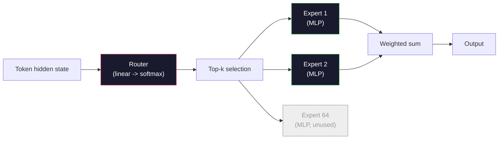

# Open Models：Architecture Walkthroughs

> 你在 Lesson 04 从零构建了 GPT-2 Small。2026 年的前沿 open models 属于同一个家族，只是有五六个具体变化。用 RMSNorm 替代 LayerNorm。用 SwiGLU 替代 GELU。用 RoPE 替代 learned positions。用 GQA 或 MLA 替代 full MHA。大规模使用 Mixture-of-Experts。你已经知道的数学覆盖了其中 95%。本课把 Llama 3、DeepSeek-V3、Mixtral、Qwen 和 Gemma 并排阅读，并指出每个 architecture 分叉的精确位置。

**类型:** Learn
**语言:** Python (stdlib)
**先修:** Phase 10, Lessons 04, 05, 12 (Pre-training, Scaling, Inference)
**时间:** ~45 minutes

## 学习目标

- 读取 Llama 3、Mistral、Mixtral、Gemma 2、Qwen 2.5 和 DeepSeek-V3 的 config.json，并解释每个字段
- 说出每个模型相对于 GPT-2 Small 的具体 architectural change，并从第一性原理说明理由
- 仅根据 config 计算任意 open model 的 parameter count、KV cache size 和 activation memory
- 在给定 latency、memory 和 capability constraints 的情况下，为 deployment target 选择合适的 open model

## 要解决的问题

在 Lesson 04 中，你写了 350 行 numpy，就有了一个 GPT-2 形状的模型。Llama 3 405B 有一份 200 页的 technical report。你的直觉可能是它们是不同物种。它们不是。那 200 页描述的是同一个对象，只是加上五六个动机明确的修改，以及上千个关于 scaling 的实现细节。骨架 -- embedding、transformer blocks、attention、MLP、norm、head -- 没变。

本课是一份 diff。对每个主要 open model family，我们列出它相对 GPT-2 具体改变了什么、为什么改变，以及代价是什么。完成后，你可以阅读一张新的 model card，并在脑中把它翻译回 GPT-2 baseline。

实际收益是：当 Meta 发布 Llama 5，或 DeepSeek 发布 V4 时，你不需要一个全新的 mental model。你会看 config，看到哪些 well-known knobs 被移动了，并知道 downstream implications。2026 年的 architectures 是一个有限工具箱。每个新模型只是选择不同子集。

## 核心概念

### 不变核心

所有 autoregressive open models 共享：

- Token embedding matrix（vocab_size x hidden_dim）。
- N 个 decoder blocks 的 stack：norm、self-attention、residual、norm、MLP、residual。
- Final norm 和 linear head，投影到 vocab_size（通常与 embeddings weight-tied）。
- Causal mask、next-token cross-entropy loss。

这就是形状。其余都是 knobs。

### 真正会移动的六个 Knobs

在每个 2024-2026 frontier open model 中，同样六个 design choices 会反复出现：

1. **Normalization.** LayerNorm -> RMSNorm。
2. **Positional encoding.** Learned absolute -> RoPE（加 variants：YaRN、NTK）。
3. **Activation.** GELU -> SwiGLU（或 GeGLU）。
4. **Attention head sharing.** MHA -> GQA -> MQA -> MLA。
5. **Dense vs sparse MLP.** Dense -> Mixture-of-Experts。
6. **Pre-norm placement.** Pre-norm 保留。Post-norm 消失。

其他所有东西（learning rate schedule、data mix、batch size、context length）都属于 training config，不属于 architecture。六个 knobs。

### Knob 1：RMSNorm

LayerNorm 减去均值、除以标准差、缩放并平移。RMSNorm 只保留 scale：

```text
RMSNorm(x) = x / sqrt(mean(x^2) + eps) * gamma
```

不减均值。没有 bias。每个 token 少一个 matmul。Zhang and Sennrich (2019) 认为它在 machine translation 上匹配 LayerNorm，同时快 10%。每个现代 open model 都使用它。

代价：无。收益：小幅 throughput 提升，代码更简单。

### Knob 2：RoPE

Learned position embeddings 在 GPT-2 中是一个 1024-slot lookup table。Context 1025 会越过表的末尾。模型无法外推到训练长度之外。

Rotary Position Embedding（RoPE，Su et al. 2021）通过在 attention dot product 之前按对旋转每个 Q 和 K vector 来注入位置。旋转角度是 position 的 deterministic function，所以没有需要学习的东西，也没有会用完的表。配合 scaling tricks（NTK-aware interpolation、YaRN），一个在 8k context 上训练的模型可以在 inference 时拉伸到 128k，且 accuracy loss 适中。

```text
q_rotated = rotate(q, angle(pos))
k_rotated = rotate(k, angle(pos))
score = q_rotated . k_rotated
```

每个 Llama、Mistral、Qwen、DeepSeek 和 Gemma 都使用 RoPE。Gemma 2 使用 hybrid（大多数 layers 用 RoPE，其他 layers 用 local sliding-window attention）。

### Knob 3：SwiGLU

GPT-2 的 MLP 是 `x -> gelu(xW1 + b1) -> (...)W2 + b2`。SwiGLU（Shazeer 2020）把 activation 换成 gated product：

```text
SwiGLU(x) = (xW1) * sigmoid(xW1) * xV
```

并行做两个 projections，而不是一个，用 Swish activation 做 gating。经验上，它在每参数 perplexity 上更强。Llama 2 采用后，所有人都跟进。MLP 的 hidden size 通常设置为让总 parameter count 匹配原 dense MLP：如果 GPT-2 用 `ff_dim = 4 * hidden`，SwiGLU 用 `ff_dim = (2/3) * 4 * hidden = 8/3 * hidden`。

### Knob 4：Attention Head Sharing

GPT-2 使用 **Multi-Head Attention (MHA)**：每个 head 都有自己的 Q、K、V projection。

**Multi-Query Attention (MQA, Shazeer 2019)** 在所有 heads 之间共享一个 K 和一个 V。它按 num_heads 缩小 KV cache，在典型模型上是 12x 到 32x reduction。准确率在困难 benchmark 上会略降。

**Grouped-Query Attention (GQA, Ainslie et al. 2023)** 是中间地带：G 组 Q heads 共享一个 K 和一个 V。Llama 3 8B 使用 32 Q heads 和 8 KV heads 的 GQA（G=8），所以相对 full MHA，KV cache 缩小 4x。

**Multi-Head Latent Attention (MLA, DeepSeek 2024)** 把 K 和 V 压缩成共享 low-rank latent，再按 head 投影回去。进一步减少 KV cache，同时保留 per-head expressiveness。DeepSeek-V2 和 V3 依赖它实现 long-context performance。

| Scheme | KV Heads | KV Cache | Accuracy |
|--------|----------|----------|----------|
| MHA    | num_heads | full | best |
| GQA    | num_groups (G < num_heads) | num_heads / G reduction | near-MHA |
| MQA    | 1 | num_heads reduction | small hit |
| MLA    | latent, per-head decompression | smaller than MQA | near-MHA |

对任何大于约 13B 参数的模型来说，GQA 或 MLA 实际上是强制选项。规模上用 full MHA 会让 KV cache 变成灾难。

### Knob 5：Mixture of Experts

dense MLP 会为每个 token 激活所有参数。MoE MLP 在每个 block 中有 K 个 experts，还有一个 router 为每个 token 选择 top-k experts（通常 top-2）。只有这些 experts 的 weights 会为该 token 进行 forward pass。

```text
router_logits = xW_r
indices, weights = top_k(router_logits, k=2)
output = sum_i weights[i] * expert[indices[i]](x)
```

吸引力在于：你可以有 64 个 size 7B 的 experts（总参数巨大），但每个 token 只运行其中 2 个（所以 per-token compute 匹配 dense 7B model）。Mixtral 8x7B 有 47B total parameters，但每个 token 只激活 13B。DeepSeek-V3 有 671B total parameters，但每个 token 只激活 37B。



优点：同样 compute、更多参数、更好 capacity。缺点：expert memory 仍然必须放在某处（所以 serving 比 dense equivalent 需要更多 VRAM），router 的 load-balancing 很难，而且 alignment 期间 fine-tune router 本身就是研究领域。

### Knob 6：Pre-norm 保留

原始 transformer 在每个 sublayer 后应用 layer norm。自 GPT-2 以来，每个 open model 都把它放在每个 sublayer *之前*。Pre-norm 在深层上严格更容易训练。没有争议。

### Model-by-Model Diff

这张表把所有内容具体化。

| Model | Year | Total Params | Active Params | Norm | Activation | Position | Attention | MoE | Context |
|-------|------|-------------|---------------|------|-----------|----------|-----------|-----|---------|
| GPT-2 Small | 2019 | 124M | 124M | LayerNorm | GELU | Learned | MHA (12 heads) | no | 1k |
| Llama 3 8B | 2024 | 8B | 8B | RMSNorm | SwiGLU | RoPE | GQA (32/8) | no | 128k |
| Llama 3 70B | 2024 | 70B | 70B | RMSNorm | SwiGLU | RoPE | GQA (64/8) | no | 128k |
| Llama 3 405B | 2024 | 405B | 405B | RMSNorm | SwiGLU | RoPE | GQA (128/16) | no | 128k |
| Mistral 7B | 2023 | 7.2B | 7.2B | RMSNorm | SwiGLU | RoPE | GQA | no | 32k |
| Mixtral 8x7B | 2023 | 47B | 13B | RMSNorm | SwiGLU | RoPE | GQA | yes (8 experts, top-2) | 32k |
| Gemma 2 9B | 2024 | 9B | 9B | RMSNorm (pre+post) | GeGLU | RoPE + sliding | GQA | no | 8k |
| Qwen 2.5 72B | 2024 | 72B | 72B | RMSNorm | SwiGLU | RoPE (YaRN) | GQA (64/8) | no | 128k |
| DeepSeek V2 236B | 2024 | 236B | 21B | RMSNorm | SwiGLU | RoPE | MLA | yes (160 experts, top-6) | 128k |
| DeepSeek V3 | 2024 | 671B | 37B | RMSNorm | SwiGLU | RoPE | MLA | yes (256 experts, top-8) | 128k |

扫一遍列。RMSNorm 是 universal。SwiGLU 或它的 GeGLU 表亲是 universal。RoPE 是 universal。7B 以上 GQA 是 universal，除非被 MLA 替代。MoE 是顶端模型的 differentiator。

### 读取 config.json

Llama 3 8B config：

```text
{
  "hidden_size": 4096,
  "intermediate_size": 14336,
  "num_hidden_layers": 32,
  "num_attention_heads": 32,
  "num_key_value_heads": 8,
  "max_position_embeddings": 131072,
  "rope_theta": 500000.0,
  "rms_norm_eps": 1e-5,
  "vocab_size": 128256
}
```

每个字段都对应你已经实现过的东西。

- `hidden_size`：embedding dimension。
- `intermediate_size`：MLP hidden size（3.5x hidden -- SwiGLU math）。
- `num_hidden_layers`：stack depth。
- `num_attention_heads`：Q heads。
- `num_key_value_heads`：KV heads（GQA）。
- `max_position_embeddings`：training context length。
- `rope_theta`：RoPE base frequency。Meta 为 long-context extrapolation 把它从默认 10k 缩放到 500k。
- `rms_norm_eps`：numerical stability。
- `vocab_size`：tokens。

仅凭这些，你就能计算 total parameters、KV cache 和 peak activation memory。精确公式见 `code/main.py`。

### Activation memory budget

Activations 在几十亿参数以上会主导 training memory。pre-training 的经验公式（带 gradient checkpointing）：

```text
activation_mem ~ batch_size * seq_len * hidden_size * num_layers * bytes_per_element
```

Llama 3 8B 在 batch 1、seq 8192、BF16、32 layers、hidden 4096 下：带 checkpointing 时，仅 activations 就约 8 GB；不带时约 40 GB。这就是 flash-attention 和 ring-attention 重要的原因 -- 它们会重写 attention computation，让 activations 装得下。

### KV Cache budget

max context 下 inference：

```text
kv_cache = 2 * num_layers * num_kv_heads * head_dim * max_seq_len * bytes_per_element
```

Llama 3 8B 在 128k context、BF16、head_dim = hidden / num_heads = 128 时：
`2 * 32 * 8 * 128 * 131072 * 2 = 17.2 GB` per sequence。

8B weights 在 BF16 下是 16 GB。单个 128k sequence 的 KV cache 比 weights 还大。这就是推动 GQA、MLA 和 KV cache quantization research 的 memory pressure。

### 每个模型什么时候胜出

- **Single 80GB GPU, no MoE**：Llama 3 8B、Mistral 7B、Gemma 2 9B。易于 serving，tooling 广泛。
- **Single node (8x80GB), big capacity**：Llama 3 70B、Qwen 2.5 72B。最高 dense open capability。
- **Biggest open capability, accept MoE complexity**：DeepSeek V3、Mixtral 8x22B。每 active FLOP 的 capability 最佳。
- **Long-context needs**：Llama 3（128k with RoPE scaling）、DeepSeek（MLA advantage）。
- **Low-latency serving**：Gemma 2 9B（sliding window 降低 long-context compute）。

## 动手实现

本课代码是一个 calculator。给定任意 config.json，它会打印按 component 拆分的 parameter count、max context 下的 KV cache、SwiGLU MLP ratio，以及一段关于 architecture（dense / GQA / MLA / MoE）的简短 verdict。

```python
config = {
    "hidden_size": 4096, "intermediate_size": 14336,
    "num_hidden_layers": 32, "num_attention_heads": 32,
    "num_key_value_heads": 8, "vocab_size": 128256,
    "max_position_embeddings": 131072,
}
```

这个 script 会逐字段遍历 architecture，计算 embedding、attention（带 GQA reduction）、MLP（带 SwiGLU expansion）、layernorms 和 head 的 param counts。然后它计算给定 context length 下的 KV cache，并打印 summary。

实现见 `code/main.py`。

## 实际使用

在 script 内置的 Llama 3 8B、Mistral 7B、Mixtral 8x7B 和 DeepSeek V3 configs 上运行 calculator。比较 parameter breakdowns。注意，MoE models 的 total param count 远超 dense models，但 active param count 常常更小。也注意，虽然 DeepSeek V3 有更多 total parameters，但它的 KV cache 小于 Llama 3 405B -- 这就是 MLA 的作用。

然后插入你本地任意模型的 config，阅读 summary，并决定它是否适合你的 GPU。

## 交付成果

本课产出 `outputs/skill-open-model-picker.md`。给定 deployment target（GPU type、VRAM、context length、latency budget）和 task profile（chat、code、reasoning、long-context），它会推荐一个 open model、来自 Lesson 11 的 quantization scheme，以及来自 Lesson 12 的 inference stack，并明确说明六个 architectural knobs 相关的推理。

## 练习

1. 从 HuggingFace 读取 Qwen 2.5 72B config。从零计算 total parameters。与 HF-reported value 比较，并识别任何 delta 的来源（head dim rounding、KV sharing factor 等）。

2. DeepSeek V3 使用 256 experts 和 top-8 routing。计算 activated experts 与 total experts 的比例，并与 Mixtral 8x7B 的 top-2 of 8 比较。从 sparse（25%）到 denser sparse（3%）的变化，对 capacity per FLOP 意味着什么？

3. 计算 Llama 3 405B 在 128k context 下的 FP8 和 BF16 KV cache。FP8 是 BF16 的一半。单个 8xH100 node（每张 80GB = 总 640GB，减去 weight memory）能服务多少 parallel sequences？

4. Gemma 2 交替使用 full-attention 和 sliding-window-attention layers。写出当半数 layers 使用 4096-token sliding window 而不是 full context 时的 KV cache 数学公式。在 8k total context 下能节省多少 memory？

5. 找一个在本课写完之后发布的 recent frontier open model。识别它选择了六个 knobs 中的哪些，以及是否引入了第七个 knob。新 architecture 发布的瞬间，curriculum 就会显得过时 -- 目标是在不重建 mental model 的情况下更新你的表。

## 关键术语

| 术语 | 人们常说 | 实际含义 |
|------|----------|----------|
| RMSNorm | "LayerNorm without the mean" | 只按 root mean square 归一化，带 learned scale -- 更便宜且可比 LayerNorm |
| RoPE | "Rotary positions" | 按 position 相关角度在 2D pairs 中旋转每个 Q 和 K vector -- 配合 scaling tricks 可外推超过训练长度 |
| SwiGLU | "The new MLP activation" | 带 Swish 的 gated linear unit：`(xW1) * sigmoid(xW1) * xV` -- 2024+ 每个 open model 的标准配置 |
| GQA | "Middle ground attention" | Grouped-Query Attention：G 组 Q heads 共享一个 K 和一个 V head -- 缩小 KV cache，避免 MQA 的 accuracy hit |
| MLA | "DeepSeek's attention" | Multi-Head Latent Attention：把 K/V 压缩为 shared low-rank latent，再按 head decompress -- 大模型中最小的 KV cache |
| MoE | "Sparse experts" | Mixture of Experts：每个 block 有 N 个 MLPs，router 为每个 token 选择 top-k -- 巨大 total params，较小 active params |
| Top-k routing | "Pick k experts per token" | router 为每个 expert 计算 score 并激活最高的 k 个 -- 典型 k 是 2（Mixtral）到 8（DeepSeek） |
| YaRN | "Stretch RoPE" | Yet another RoPE extension -- 插值 rotary angles，在 inference 时把 context 从 8k 扩展到 128k+ |
| Sliding-window attention | "Don't attend to everything" | 每个 token 只 attend 到最近 W 个 tokens -- 把每 token attention cost 限制为 O(W)，用于 Gemma 2 和早期 Mistral |
| Active params | "What runs per token" | 对 MoE models 来说，每个 token 做 forward pass 的 parameter count（远小于 total params）-- 决定 per-token FLOPs |

## 延伸阅读

- [Dubey et al., 2024 -- "The Llama 3 Herd of Models"](https://arxiv.org/abs/2407.21783) -- dense Llama 3 family 的 architecture 与 training reference
- [DeepSeek-AI, 2024 -- "DeepSeek-V3 Technical Report"](https://arxiv.org/abs/2412.19437) -- MLA 加 auxiliary-loss-free load balancing 加 671B MoE
- [Jiang et al., 2024 -- "Mixtral of Experts"](https://arxiv.org/abs/2401.04088) -- canonical MoE open model paper
- [Su et al., 2021 -- "RoFormer: Enhanced Transformer with Rotary Position Embedding"](https://arxiv.org/abs/2104.09864) -- RoPE 论文
- [Shazeer, 2020 -- "GLU Variants Improve Transformer"](https://arxiv.org/abs/2002.05202) -- SwiGLU、GeGLU 与相关变体
- [Ainslie et al., 2023 -- "GQA: Training Generalized Multi-Query Transformer Models"](https://arxiv.org/abs/2305.13245) -- GQA 论文
- [Gemma 2 Team, 2024 -- "Gemma 2: Improving Open Language Models at a Practical Size"](https://arxiv.org/abs/2408.00118) -- hybrid full+sliding attention、pre+post-norm
- [Qwen Team, 2024 -- "Qwen 2.5 Technical Report"](https://arxiv.org/abs/2412.15115) -- YaRN context extension 和 long-context training recipes
