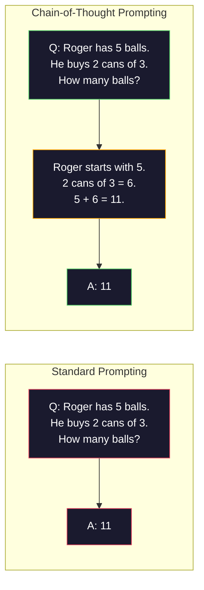
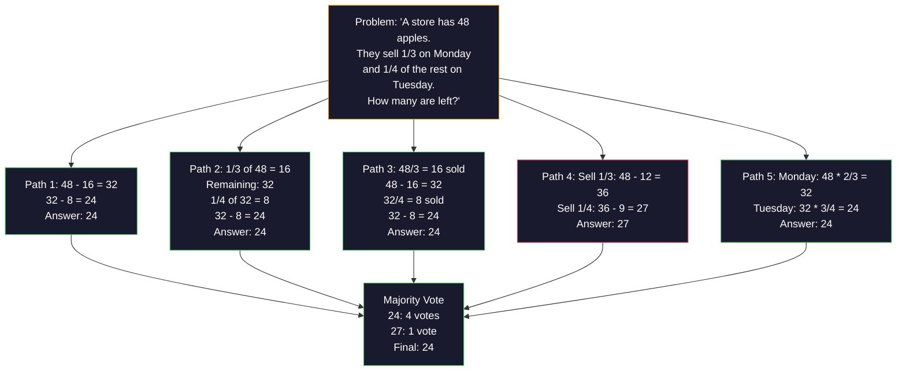
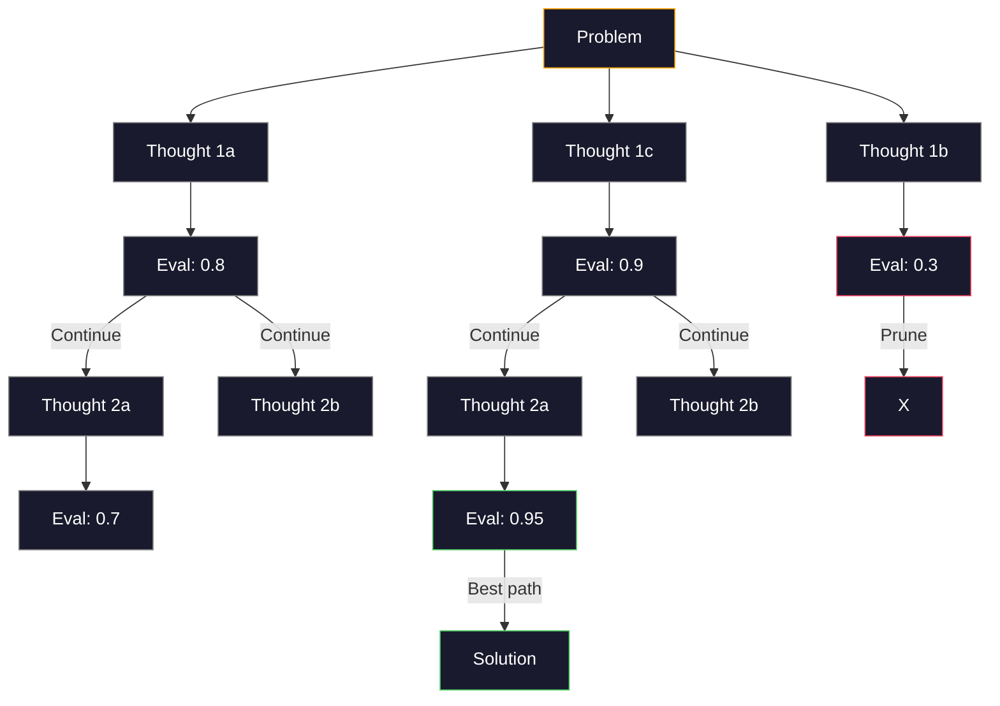

# Few-Shot、思维链与思维树

> 告诉模型做什么是 prompting。展示它如何思考才是 engineering。同一个模型、同一个任务、同一批数据，从 78% 到 91% 准确率的差距，不是更好的模型，而是更好的推理策略。

**类型：** Build
**语言：** Python
**先修：** Lesson 11.01 (Prompt Engineering)
**时间：** ~45 分钟

## 学习目标

- 通过选择和格式化能最大化任务准确率的 example demonstrations，实现 few-shot prompting
- 应用 chain-of-thought（CoT）reasoning，提高数学文字题等多步问题的准确率
- 构建 tree-of-thought prompt，探索多条 reasoning paths 并选择最佳路径
- 在标准 benchmark 上测量 zero-shot、few-shot 与 CoT 的准确率提升

## 要解决的问题

你正在构建一个数学辅导 app。你的 prompt 写着：“Solve this word problem.” GPT-5 在 GSM8K（标准小学数学 benchmark）上 94% 时间答对。你以为已经到顶了。其实没有，chain-of-thought 仍然能再加 3-4 个百分点。

加五个词——“Let's think step by step”——准确率跃升到 91%。再加几个 worked examples，达到 95%。同一个模型。同样的 temperature。同样的 API 成本。唯一差别是你给了模型草稿纸。

这不是 hack。这就是推理的工作方式。人类不会在一次心理跳跃中解决多步问题。transformers 也不会。当你强迫模型生成中间 tokens 时，这些 tokens 会成为下一个 token 的 context。每个 reasoning step 都会馈入下一步。模型确实是在一步步计算出答案。

但 “think step by step” 只是开始，不是终点。如果你采样五条 reasoning paths 并做多数投票呢？如果你让模型探索一棵可能性树，对 branches 评分并剪枝呢？如果你把 reasoning 和 tool use 交织在一起呢？这些不是假设，而是有实测提升的已发表技术，本课会全部实现。

## 核心概念

### Zero-Shot vs Few-Shot：示例何时胜过指令

Zero-shot prompting 只给模型任务，不给其他内容。Few-shot prompting 会先给它示例。

Wei et al. (2022) 在 8 个 benchmarks 上测量过这一点。对 sentiment classification 等简单任务，zero-shot 与 few-shot 的表现相差不到 2%。对 multi-step arithmetic 和 symbolic reasoning 等复杂任务，few-shot 能提升 10-25% 准确率。

直觉是：examples 是压缩后的指令。与其描述输出格式，不如直接展示。与其解释 reasoning process，不如演示。模型对 examples 的 pattern-match，通常比解释抽象指令更可靠。


**few-shot 获胜的场景：** format-sensitive tasks、classification、structured extraction、domain-specific jargon，以及任何需要模型匹配特定模式的任务。

**zero-shot 获胜的场景：** 简单事实问题、示例会限制创造力的 creative tasks，以及寻找好示例比写好指令更难的任务。

### Example Selection：相似胜过随机

并非所有 examples 都一样。选择与目标输入相似的 examples，在 classification tasks 上比随机选择高出 5-15%（Liu et al., 2022）。三个原则：

1. **Semantic similarity**：选择 embedding space 中最接近输入的 examples
2. **Label diversity**：让 examples 覆盖所有 output categories
3. **Difficulty matching**：匹配目标问题的复杂度水平

多数任务的最佳示例数量是 3-5。少于 3 个，模型没有足够信号提取模式。超过 5 个，收益递减，还会浪费 context window tokens。对有许多 labels 的 classification，每个 label 用一个 example。

### Chain-of-Thought：给模型草稿纸

Chain-of-Thought（CoT）prompting 由 Google Brain 的 Wei et al. (2022) 提出。想法很简单：不要只向模型要答案，而是先让它展示 reasoning steps。



为什么它在机制上有效？transformer 生成的每个 token 都会成为下一个 token 的 context。没有 CoT 时，模型必须把所有推理压缩进一次 forward pass 的 hidden state。使用 CoT 时，模型把中间计算外化为 tokens。每个 reasoning token 都扩展了有效计算深度。

**GSM8K benchmarks（小学数学，8.5K problems）：**

| Model | Zero-Shot | Zero-Shot CoT | Few-Shot CoT |
|-------|-----------|---------------|--------------|
| GPT-4o | 78% | 91% | 95% |
| GPT-5 | 94% | 97% | 98% |
| o4-mini (reasoning) | 97% | — | — |
| Claude Opus 4.7 | 93% | 97% | 98% |
| Gemini 3 Pro | 92% | 96% | 98% |
| Llama 4 70B | 80% | 89% | 94% |
| DeepSeek-V3.1 | 89% | 94% | 96% |

**关于 reasoning models。** OpenAI 的 o-series（o3、o4-mini）和 DeepSeek-R1 等模型，会在输出答案前在内部运行 chain-of-thought。给 reasoning model 添加 “Let's think step by step” 是冗余的，有时反而适得其反——它们已经做过了。

CoT 有两种形式：

**Zero-shot CoT**：在 prompt 末尾追加 “Let's think step by step”。不需要 examples。Kojima et al. (2022) 表明，这一句话能在 arithmetic、commonsense 和 symbolic reasoning tasks 上提升准确率。

**Few-shot CoT**：提供包含 reasoning steps 的 examples。它比 zero-shot CoT 更有效，因为模型看到了你期望的具体 reasoning format。

**CoT 有害的场景**：简单事实回忆（“What is the capital of France?”）、单步 classification、速度比准确率更重要的任务。CoT 每次 query 会增加 50-200 tokens 的 reasoning overhead。对高吞吐、低复杂度任务来说，这是浪费成本。

### Self-Consistency：多次采样，一次投票

Wang et al. (2023) 提出了 self-consistency。洞察是：单条 CoT path 可能有 reasoning errors。但如果采样 N 条独立 reasoning paths（使用 temperature > 0），并对最终答案做 majority vote，错误会相互抵消。



在最初的 PaLM 540B 实验中，self-consistency 把 GSM8K 准确率从 56.5%（single CoT）提升到 N=40 时的 74.4%。在 GPT-5 上，提升很小（97% 到 98%），因为基础准确率已经接近饱和。该技术最适合 base CoT accuracy 为 60-85% 的模型——这个甜蜜点上，单路径错误常见但并非系统性错误。对 reasoning models（o-series、R1）来说，self-consistency 已被内置内部采样吸收。

权衡：N samples 意味着 N 倍 API 成本和延迟。实践中，N=5 捕获了大部分收益。N=3 是有意义投票的最低值。对多数任务，N > 10 收益递减。

### Tree-of-Thought：分支式探索

Yao et al. (2023) 提出了 Tree-of-Thought（ToT）。CoT 沿着一条线性 reasoning path 前进，而 ToT 会探索多条 branches，并在继续之前评估哪些更有希望。



ToT 有三个组件：

1. **Thought generation**：产生多个 candidate next-steps
2. **State evaluation**：给每个 candidate 打分（可以用 LLM 自己当 evaluator）
3. **Search algorithm**：用 BFS 或 DFS 遍历 tree，剪掉低分 branches

在 Game of 24 任务（用 4 个数字通过四则运算得到 24）上，标准 prompting 的 GPT-4 只能解出 7.3%。使用 CoT 为 4.0%（CoT 在这里反而有害，因为 search space 很宽）。使用 ToT 达到 74%。

ToT 很贵。tree 中每个 node 都需要一次 LLM call。branching factor 为 3、depth 为 3 的 tree 最多需要 39 次 LLM calls。只在 search space 大但可评估的问题上使用它——planning、puzzle solving、带约束的 creative problem-solving。

### ReAct：思考 + 行动

Yao et al. (2022) 把 reasoning traces 与 actions 结合起来。模型在 thinking（生成 reasoning）和 acting（调用 tools、搜索、计算）之间交替。

```mermaid
graph LR
    Q["Question:\nWhat is the\npopulation of the\ncountry where\nthe Eiffel Tower\nis located?"]
    T1["Thought: I need to\nfind which country\nhas the Eiffel Tower"]
    A1["Action: search\n'Eiffel Tower location'"]
    O1["Observation:\nParis, France"]
    T2["Thought: Now I need\nFrance's population"]
    A2["Action: search\n'France population 2024'"]
    O2["Observation:\n68.4 million"]
    T3["Thought: I have\nthe answer"]
    F["Answer:\n68.4 million"]

    Q --> T1 --> A1 --> O1 --> T2 --> A2 --> O2 --> T3 --> F

    style Q fill:#1a1a2e,stroke:#ffa500,color:#fff
    style T1 fill:#1a1a2e,stroke:#51cf66,color:#fff
    style A1 fill:#1a1a2e,stroke:#e94560,color:#fff
    style O1 fill:#1a1a2e,stroke:#808080,color:#fff
    style T2 fill:#1a1a2e,stroke:#51cf66,color:#fff
    style A2 fill:#1a1a2e,stroke:#e94560,color:#fff
    style O2 fill:#1a1a2e,stroke:#808080,color:#fff
    style T3 fill:#1a1a2e,stroke:#51cf66,color:#fff
    style F fill:#1a1a2e,stroke:#51cf66,color:#fff
```



ReAct 在知识密集型任务上优于纯 CoT，因为它能把 reasoning 建立在真实数据上。在 HotpotQA（multi-hop question answering）上，GPT-4 的 ReAct 达到 35.1% exact match，而 CoT alone 是 29.4%。真正的力量在于 reasoning errors 会被 observations 修正——模型可以在执行中更新计划。

ReAct 是现代 AI agents 的基础。每个 agent framework（LangChain、CrewAI、AutoGen）都实现了某种 Thought-Action-Observation loop。Phase 14 会构建完整 agents。本课覆盖 prompting pattern。

### Structured Prompting：XML Tags、Delimiters、Headers

prompts 越复杂，结构越能防止模型混淆不同区块。三种方法：

**XML tags**（Claude 上效果最好，其他模型也稳定）：
```text
<context>
You are reviewing a pull request.
The codebase uses TypeScript and React.
</context>

<task>
Review the following diff for bugs, security issues, and style violations.
</task>

<diff>
{diff_content}
</diff>

<output_format>
List each issue with: file, line, severity (critical/warning/info), description.
</output_format>
```

**Markdown headers**（通用）：
```text
## Role
Senior security engineer at a fintech company.

## Task
Analyze this API endpoint for vulnerabilities.

## Input
{api_code}

## Rules
- Focus on OWASP Top 10
- Rate each finding: critical, high, medium, low
- Include remediation steps
```

**Delimiters**（最小但有效）：
```text
---INPUT---
{user_text}
---END INPUT---

---INSTRUCTIONS---
Summarize the above in 3 bullet points.
---END INSTRUCTIONS---
```

### Prompt Chaining：顺序分解

有些任务对单个 prompt 来说太复杂。Prompt chaining 把它们拆成多个步骤，其中一个 prompt 的输出成为下一个 prompt 的输入。


Chaining 胜过 single-prompt 有三个原因：

1. **每一步都更简单**：模型处理一个聚焦任务，而不是同时 juggling everything
2. **中间输出可检查**：你可以在步骤之间验证和修正
3. **不同步骤可以使用不同模型**：用便宜模型做 extraction，用昂贵模型做 reasoning

### Performance Comparison

| Technique | Best For | GSM8K Accuracy (GPT-5) | API Calls | Token Overhead | Complexity |
|-----------|----------|------------------------|-----------|----------------|------------|
| Zero-Shot | Simple tasks | 94% | 1 | None | Trivial |
| Few-Shot | Format matching | 96% | 1 | 200-500 tokens | Low |
| Zero-Shot CoT | Quick reasoning boost | 97% | 1 | 50-200 tokens | Trivial |
| Few-Shot CoT | Maximum single-call accuracy | 98% | 1 | 300-600 tokens | Low |
| Self-Consistency (N=5) | High-stakes reasoning | 98.5% | 5 | 5x token cost | Medium |
| Reasoning model (o4-mini) | Drop-in CoT replacement | 97% | 1 | hidden (2-10x internal) | Trivial |
| Tree-of-Thought | Search/planning problems | N/A (74% on Game of 24) | 10-40+ | 10-40x token cost | High |
| ReAct | Knowledge-grounded reasoning | N/A (35.1% on HotpotQA) | 3-10+ | Variable | High |
| Prompt Chaining | Complex multi-step tasks | 96% (pipeline) | 2-5 | 2-5x token cost | Medium |

正确技术取决于三个因素：accuracy requirement、latency budget 和 cost tolerance。对多数生产系统，few-shot CoT 加上 3-sample self-consistency fallback 能覆盖 90% 的用例。

## 动手实现

我们会构建一个数学问题求解器，把 few-shot prompting、chain-of-thought reasoning 和 self-consistency voting 组合到一个 pipeline 中。然后为难题加入 tree-of-thought。

完整实现在 `code/advanced_prompting.py`。下面是关键组件。

### Step 1: Few-Shot Example Store

第一个组件管理 few-shot examples，并为给定 problem 选择最相关的 examples。

```python
GSM8K_EXAMPLES = [
    {
        "question": "Janet's ducks lay 16 eggs per day. She eats three for breakfast every morning and bakes muffins for her friends every day with four. She sells every egg at the farmers' market for $2. How much does she make every day at the farmers' market?",
        "reasoning": "Janet's ducks lay 16 eggs per day. She eats 3 and bakes 4, using 3 + 4 = 7 eggs. So she has 16 - 7 = 9 eggs left. She sells each for $2, so she makes 9 * 2 = $18 per day.",
        "answer": "18"
    },
    ...
]
```

每个 example 有三部分：question、reasoning chain 和 final answer。reasoning chain 是把普通 few-shot example 转化为 CoT few-shot example 的关键。

### Step 2: Chain-of-Thought Prompt Builder

prompt builder 会把 system message、带 reasoning chains 的 few-shot examples 和目标 question 组装成一个 prompt。

```python
def build_cot_prompt(question, examples, num_examples=3):
    system = (
        "You are a math problem solver. "
        "For each problem, show your step-by-step reasoning, "
        "then give the final numerical answer on the last line "
        "in the format: 'The answer is [number]'."
    )

    example_text = ""
    for ex in examples[:num_examples]:
        example_text += f"Q: {ex['question']}\n"
        example_text += f"A: {ex['reasoning']} The answer is {ex['answer']}.\n\n"

    user = f"{example_text}Q: {question}\nA:"
    return system, user
```

格式约束（“The answer is [number]”）至关重要。没有它，self-consistency 无法从不同 samples 中提取并比较答案。

### Step 3: Self-Consistency Voting

采样 N 条 reasoning paths，并选择多数答案。

```python
def self_consistency_solve(question, examples, client, model, n_samples=5):
    system, user = build_cot_prompt(question, examples)

    answers = []
    reasonings = []
    for _ in range(n_samples):
        response = client.chat.completions.create(
            model=model,
            messages=[
                {"role": "system", "content": system},
                {"role": "user", "content": user}
            ],
            temperature=0.7
        )
        text = response.choices[0].message.content
        reasonings.append(text)
        answer = extract_answer(text)
        if answer is not None:
            answers.append(answer)

    vote_counts = Counter(answers)
    best_answer = vote_counts.most_common(1)[0][0] if vote_counts else None
    confidence = vote_counts[best_answer] / len(answers) if best_answer else 0

    return best_answer, confidence, reasonings, vote_counts
```

Temperature 0.7 很重要。在 temperature 0.0 下，所有 N samples 都会相同，失去意义。你需要足够随机性来获得多样 reasoning paths，但又不能高到模型生成胡话。

### Step 4: Tree-of-Thought Solver

对线性 reasoning 失败的问题，ToT 会探索多个 approaches，并评估哪个方向最有希望。

```python
def tree_of_thought_solve(question, client, model, breadth=3, depth=3):
    thoughts = generate_initial_thoughts(question, client, model, breadth)
    scored = [(t, evaluate_thought(t, question, client, model)) for t in thoughts]
    scored.sort(key=lambda x: x[1], reverse=True)

    for current_depth in range(1, depth):
        next_thoughts = []
        for thought, score in scored[:2]:
            extensions = extend_thought(thought, question, client, model, breadth)
            for ext in extensions:
                ext_score = evaluate_thought(ext, question, client, model)
                next_thoughts.append((ext, ext_score))
        scored = sorted(next_thoughts, key=lambda x: x[1], reverse=True)

    best_thought = scored[0][0] if scored else ""
    return extract_answer(best_thought), best_thought
```

evaluator 本身也是一次 LLM call。你问模型：“On a scale of 0.0 to 1.0, how promising is this reasoning path for solving the problem?” 这是 ToT 的关键洞察——模型评估自己的 partial solutions。

### Step 5: Full Pipeline

pipeline 用 escalation strategy 组合所有技术。

```python
def solve_with_escalation(question, examples, client, model):
    system, user = build_cot_prompt(question, examples)
    single_response = call_llm(client, model, system, user, temperature=0.0)
    single_answer = extract_answer(single_response)

    sc_answer, confidence, _, _ = self_consistency_solve(
        question, examples, client, model, n_samples=5
    )

    if confidence >= 0.8:
        return sc_answer, "self_consistency", confidence

    tot_answer, _ = tree_of_thought_solve(question, client, model)
    return tot_answer, "tree_of_thought", None
```

escalation logic：先尝试便宜路径（single CoT）。如果 self-consistency confidence 低于 0.8（5 个 samples 中少于 4 个一致），再升级到 ToT。这平衡了成本与准确率——多数问题便宜解决，难题获得更多 compute。

## 实际使用

### With LangChain

LangChain 提供对 prompt templates 和 output parsing 的内置支持，可简化 few-shot 和 CoT patterns：

```python
from langchain_core.prompts import FewShotPromptTemplate, PromptTemplate
from langchain_openai import ChatOpenAI

example_prompt = PromptTemplate(
    input_variables=["question", "reasoning", "answer"],
    template="Q: {question}\nA: {reasoning} The answer is {answer}."
)

few_shot_prompt = FewShotPromptTemplate(
    examples=examples,
    example_prompt=example_prompt,
    suffix="Q: {input}\nA: Let's think step by step.",
    input_variables=["input"]
)

llm = ChatOpenAI(model="gpt-4o", temperature=0.7)
chain = few_shot_prompt | llm
result = chain.invoke({"input": "If a train travels 120 km in 2 hours..."})
```

LangChain 还有用于 semantic similarity selection 的 `ExampleSelector` classes：

```python
from langchain_core.example_selectors import SemanticSimilarityExampleSelector
from langchain_openai import OpenAIEmbeddings

selector = SemanticSimilarityExampleSelector.from_examples(
    examples,
    OpenAIEmbeddings(),
    k=3
)
```

### With DSPy

DSPy 把 prompting strategies 当作可优化 modules。你无需手写 CoT prompts，而是定义 signature，让 DSPy 优化 prompt：

```python
import dspy

dspy.configure(lm=dspy.LM("openai/gpt-4o", temperature=0.7))

class MathSolver(dspy.Module):
    def __init__(self):
        self.solve = dspy.ChainOfThought("question -> answer")

    def forward(self, question):
        return self.solve(question=question)

solver = MathSolver()
result = solver(question="Janet's ducks lay 16 eggs per day...")
```

DSPy 的 `ChainOfThought` 会自动加入 reasoning traces。`dspy.majority` 实现 self-consistency：

```python
result = dspy.majority(
    [solver(question=q) for _ in range(5)],
    field="answer"
)
```

### Comparison：From-Scratch vs Frameworks

| Feature | From-Scratch (this lesson) | LangChain | DSPy |
|---------|--------------------------|-----------|------|
| Control over prompt format | Full | Template-based | Automatic |
| Self-consistency | Manual voting | Manual | Built-in (`dspy.majority`) |
| Example selection | Custom logic | `ExampleSelector` | `dspy.BootstrapFewShot` |
| Tree-of-Thought | Custom tree search | Community chains | Not built-in |
| Prompt optimization | Manual iteration | Manual | Automatic compilation |
| Best for | Learning, custom pipelines | Standard workflows | Research, optimization |

## 交付成果

本课会产出两个 artifacts。

**1. Reasoning Chain Prompt**（`outputs/prompt-reasoning-chain.md`）：一个 production-ready prompt template，用于带 self-consistency 的 few-shot CoT。插入你的 examples 和 problem domain 即可。

**2. CoT Pattern Selection Skill**（`outputs/skill-cot-patterns.md`）：一个决策框架，根据 task type、accuracy requirements 和 cost constraints 选择正确 reasoning technique。

## 练习

1. **Measure the gap**：取 10 个 GSM8K problems。分别用 zero-shot、few-shot、zero-shot CoT 和 few-shot CoT 求解。记录各自准确率。哪个 technique 在你的模型上提升最大？

2. **Example selection experiment**：对同样的 10 个 problems，比较 random example selection 与手工挑选的相似 examples。测量准确率差异。什么时候 example quality 比 example quantity 更重要？

3. **Self-consistency cost curve**：在 20 个 GSM8K problems 上用 N=1、3、5、7、10 运行 self-consistency。绘制 accuracy vs cost（total tokens）。你的模型的曲线拐点在哪里？

4. **Build a ReAct loop**：用 calculator tool 扩展 pipeline。当模型生成数学表达式时，用 Python 的 `eval()`（在 sandbox 中）执行它，并把结果喂回去。测量 tool-grounded reasoning 是否优于纯 CoT。

5. **ToT for creative tasks**：把 Tree-of-Thought solver 改造成 creative writing 任务：“Write a 6-word story that is both funny and sad.” 使用 LLM 作为 evaluator。branching exploration 是否比 single-shot generation 产生更好的创意输出？

## 关键术语

| Term | What people say | What it actually means |
|------|----------------|----------------------|
| Few-shot prompting | “给它一些例子” | 在 prompt 中包含 input-output demonstrations，以锚定模型的 output format 和 behavior |
| Chain-of-Thought | “让它一步步思考” | 引出中间 reasoning tokens，在生成 final answer 前扩展模型的有效计算 |
| Self-Consistency | “多跑几次” | 在 temperature > 0 下采样 N 条多样 reasoning paths，并通过多数投票选择最常见 final answer |
| Tree-of-Thought | “让它探索选项” | 对 reasoning branches 进行结构化搜索，评估每个 partial solution，只扩展有希望的 paths |
| ReAct | “思考 + 工具使用” | 在 Thought-Action-Observation loop 中交织 reasoning traces 与外部 actions（search、compute、API calls） |
| Prompt chaining | “拆成步骤” | 把复杂任务分解成顺序 prompts，每一步输出喂给下一步输入 |
| Zero-shot CoT | “只加 'think step by step'” | 在没有 examples 的 prompt 后追加 reasoning trigger phrase，依赖模型潜在 reasoning capability |

## 延伸阅读

- [Chain-of-Thought Prompting Elicits Reasoning in Large Language Models](https://arxiv.org/abs/2201.11903)——Wei et al. 2022。Google Brain 的原始 CoT 论文。阅读 sections 2-3 理解核心结果。
- [Self-Consistency Improves Chain of Thought Reasoning in Language Models](https://arxiv.org/abs/2203.11171)——Wang et al. 2023。self-consistency 论文。Table 1 有你需要的所有数字。
- [Tree of Thoughts: Deliberate Problem Solving with Large Language Models](https://arxiv.org/abs/2305.10601)——Yao et al. 2023。ToT 论文。section 4 中 Game of 24 的结果是亮点。
- [ReAct: Synergizing Reasoning and Acting in Language Models](https://arxiv.org/abs/2210.03629)——Yao et al. 2022。现代 AI agents 的基础。Section 3 解释 Thought-Action-Observation loop。
- [Large Language Models are Zero-Shot Reasoners](https://arxiv.org/abs/2205.11916)——Kojima et al. 2022。“Let's think step by step” 论文。简单到令人惊讶却很有效。
- [DSPy: Compiling Declarative Language Model Calls into Self-Improving Pipelines](https://arxiv.org/abs/2310.03714)——Khattab et al. 2023。把 prompting 视为 compilation problem。如果你想超越手工 prompt engineering，请阅读它。
- [OpenAI — Reasoning models guide](https://platform.openai.com/docs/guides/reasoning)——vendor guidance，说明 chain-of-thought 何时从 prompt-level trick 变成内部、按 token 计价的 “reasoning” mode。
- [Lightman et al., "Let's Verify Step by Step" (2023)](https://arxiv.org/abs/2305.20050)——process reward models（PRM），对 chain 中每一步打分；这是胜过 outcome-only rewards 的 reasoning supervision signal。
- [Snell et al., "Scaling LLM Test-Time Compute Optimally" (2024)](https://arxiv.org/abs/2408.03314)——系统研究 CoT length、self-consistency sampling 和 MCTS；当准确率比延迟更重要时，“think step by step” 会走向哪里。
