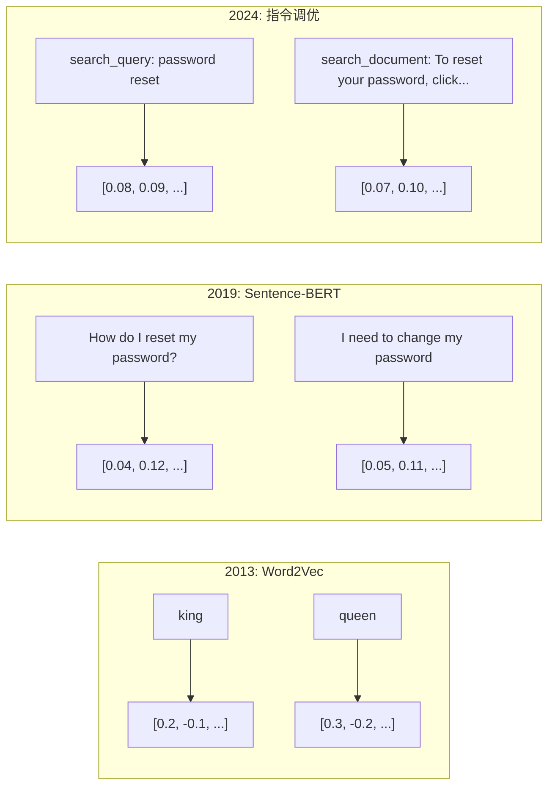
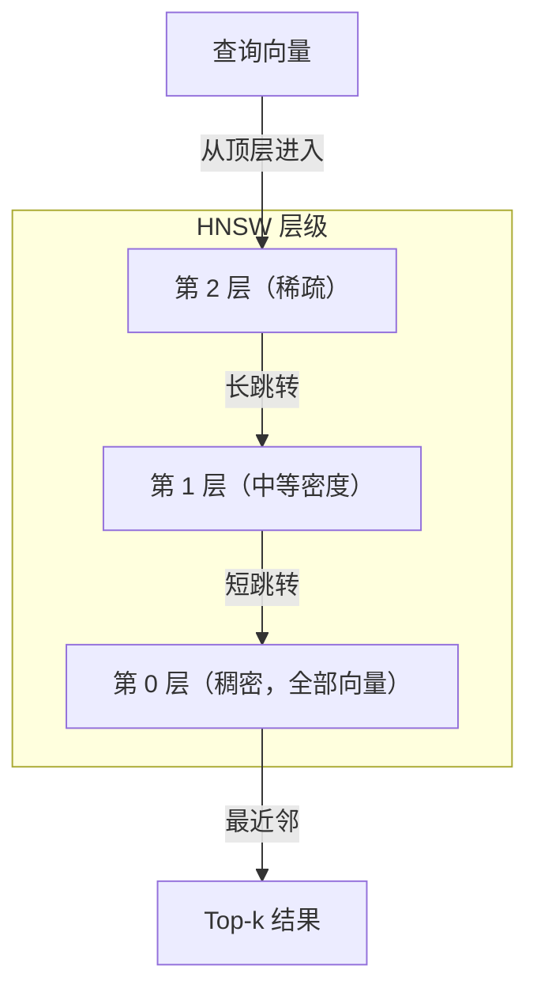

# 嵌入与向量表示

> 文本是离散的，数学是连续的。每次你让 LLM 查找“相似”文档、比较含义，或超越关键词做搜索时，你都在依赖一座连接两者的桥。这座桥就是 embedding。如果你不理解 embedding，就谈不上真正理解现代 AI，只是在调用它。

**类型：** Build
**语言：** Python, TypeScript
**先修：** Phase 11, Lesson 01 (Prompt Engineering)
**时间：** ~75 分钟
**相关：** Phase 5 · 22（Embedding Models Deep Dive）覆盖 dense、sparse、multi-vector、Matryoshka 截断，以及按评估轴选择模型。本课聚焦生产流水线：向量数据库、HNSW 和相似度数学。选模型前，建议先读 Phase 5 · 22。

## 学习目标

- 使用 API provider 和开源模型生成文本 embedding，并计算它们之间的余弦相似度
- 解释 embedding 为什么能解决关键词搜索无法处理的词汇不匹配问题
- 构建一个语义搜索索引，按含义而不是精确关键词匹配来检索文档
- 使用检索基准（precision@k、recall）评估 embedding 质量，并为任务选择合适的 embedding 模型

## 要解决的问题

你有 10,000 条客服工单。客户写道：“my payment didn't go through”。你需要找到相似的历史工单。关键词搜索会找到包含 “payment” 和 “didn't go through” 的工单，却漏掉 “transaction failed”、“charge was declined” 和 “billing error”。这些工单用完全不同的词描述同一个问题。

这就是词汇不匹配问题。人类语言有几十种方式表达同一件事。关键词搜索把每个词都当成彼此独立、没有含义的符号。它不知道 “declined” 和 “didn't go through” 指的是同一个概念。

你需要一种文本表示，让相似度由“含义”而不是“拼写”决定。你需要把 “my payment didn't go through” 和 “transaction was declined” 放到某个数学空间的相邻位置，同时把 “my payment arrived on time” 推远，哪怕它也包含 “payment”。

这种表示就是 embedding。

## 核心概念

### 什么是 Embedding？

embedding 是一个由浮点数组成的稠密向量，用来表示文本含义。“稠密”很重要：每个维度都携带信息，不像 bag-of-words、TF-IDF 这类稀疏表示那样大多数维度都是零。

“The cat sat on the mat” 会变成类似 `[0.023, -0.041, 0.087, ..., 0.012]` 的列表。取决于模型，它可能有 768 到 3072 个数字。这些数字编码含义。你不会直接检查每个数字，而是比较向量之间的关系。

### Word2Vec 的突破

2013 年，Google 的 Tomas Mikolov 和同事发表了 Word2Vec。核心洞察是：训练一个神经网络根据邻近词预测某个词（或根据某个词预测邻近词），隐藏层权重会变成有意义的向量表示。

著名结果是：

```text
king - man + woman = queen
```

word embedding 上的向量运算能捕捉语义关系。从 “man” 到 “woman” 的方向，大致等于从 “king” 到 “queen” 的方向。也正是这类结果，让领域意识到几何结构可以编码含义。

Word2Vec 生成 300 维向量。每个词无论上下文如何都只有一个向量。“Bank” 在 “river bank” 和 “bank account” 中拥有同一个 embedding。这个限制推动了之后十年的研究。

### 从词到句子

word embedding 表示单个 token。生产系统需要 embed 整个句子、段落或文档。四种方法逐渐出现：

**平均池化**：取句子中所有词向量的平均值。便宜、有损，但对短文本出人意料地还不错。它会完全丢失词序，因此 “dog bites man” 和 “man bites dog” 会得到相同的 embedding。

**CLS token**：Transformer 模型（BERT, 2018）会输出一个代表整个输入的特殊 `[CLS]` token embedding。它比简单平均更好，但 `[CLS]` token 原本是为下一句预测训练的，并不是专门为相似度训练的。

**对比学习**：显式训练模型，让相似样本对靠近，让不相似样本对远离。Sentence-BERT（Reimers & Gurevych, 2019）使用这种方法，并成为现代 embedding 模型的基础。给定 “How do I reset my password?” 和 “I need to change my password”，模型会学到它们应该拥有几乎相同的向量。

**指令调优 embedding**：较新的方法。E5 和 GTE 等模型接受任务前缀（`search_query:`、`search_document:`），告诉模型应该生成哪种 embedding。这样一个模型就能服务多种任务。



### 现代 Embedding 模型

市场已经收敛到少数生产级选项（截至 2026 年初的 MTEB v2 分数）：

| 模型 | 提供方 | 维度 | MTEB | 上下文 | 每 100 万 token 成本 |
|------|--------|------|------|--------|----------------------|
| Gemini Embedding 2 | Google | 3072 (Matryoshka) | 67.7 (retrieval) | 8192 | $0.15 |
| embed-v4 | Cohere | 1024 (Matryoshka) | 65.2 | 128K | $0.12 |
| voyage-4 | Voyage AI | 1024/2048 (Matryoshka) | 66.8 | 32K | $0.12 |
| text-embedding-3-large | OpenAI | 3072 (Matryoshka) | 64.6 | 8192 | $0.13 |
| text-embedding-3-small | OpenAI | 1536 (Matryoshka) | 62.3 | 8192 | $0.02 |
| BGE-M3 | BAAI | 1024 (dense+sparse+ColBERT) | 63.0 multilingual | 8192 | Open-weight |
| Qwen3-Embedding | Alibaba | 4096 (Matryoshka) | 66.9 | 32K | Open-weight |
| Nomic-embed-v2 | Nomic | 768 (Matryoshka) | 63.1 | 8192 | Open-weight |

MTEB（Massive Text Embedding Benchmark）v2 覆盖 retrieval、classification、clustering、reranking、summarization 等 100 多类任务。分数越高越好。到 2026 年，open-weight 模型（Qwen3-Embedding、BGE-M3）在多数评估轴上已经匹配或超过闭源托管模型。Gemini Embedding 2 领先纯检索；Voyage/Cohere 在 finance、law、code 等特定领域领先。提交模型选择之前，一定要在你自己的查询上做 benchmark。

### 相似度指标

给定两个 embedding 向量，常见的相似度衡量方式有三种：

**余弦相似度**：两个向量夹角的余弦。范围从 -1（相反）到 1（同向）。它忽略长度，所以只要方向相同，10 个词的句子和 500 个词的文档也可以得到 1.0。这是 90% 用例的默认选择。

```text
cosine_sim(a, b) = dot(a, b) / (||a|| * ||b||)
```

**点积**：两个向量的原始内积。当向量已经归一化为单位长度时，它与余弦相似度等价。点积计算更快。OpenAI embeddings 是归一化的，因此点积和余弦会给出相同排序。

```text
dot(a, b) = sum(a_i * b_i)
```

**欧氏（L2）距离**：向量空间中的直线距离。越小越相似。它对向量长度差异敏感。只有当空间中的绝对位置重要，而不仅是方向重要时才使用。

```text
L2(a, b) = sqrt(sum((a_i - b_i)^2))
```

如何选择：

| 指标 | 适用场景 | 避免场景 |
|------|----------|----------|
| 余弦相似度 | 比较不同长度的文本；多数检索任务 | 向量长度本身携带信息 |
| 点积 | embedding 已经归一化；需要最高速度 | 向量长度差异较大 |
| 欧氏距离 | 聚类；空间最近邻问题 | 比较长度差异很大的文档 |

### 向量数据库与 HNSW

暴力相似度搜索会把查询向量与每个已存向量比较。100 万个向量、每个 1536 维，就意味着每次查询要做约 15 亿次乘加运算。太慢。

向量数据库用近似最近邻（Approximate Nearest Neighbor, ANN）算法解决这个问题。主导算法是 HNSW（Hierarchical Navigable Small World）：

1. 构建一个多层向量图
2. 顶层稀疏，用长距离连接跨越远处簇
3. 底层稠密，用细粒度连接连起附近向量
4. 搜索从顶层开始，贪心下降并逐步细化
5. 用 O(log n) 而不是 O(n) 的时间返回近似 top-k 结果

HNSW 用很小的准确率损失（通常 95-99% recall）换取巨大的速度提升。1000 万个向量时，暴力搜索要几秒，HNSW 只要几毫秒。



生产选项：

| 数据库 | 类型 | 最适合 | 最大规模 |
|--------|------|--------|----------|
| Pinecone | 托管 SaaS | 零运维生产环境 | 数十亿 |
| Weaviate | 开源 | 自托管、混合搜索 | 100M+ |
| Qdrant | 开源 | 高性能、过滤 | 100M+ |
| ChromaDB | 嵌入式 | 原型、本地开发 | 1M |
| pgvector | Postgres 扩展 | 已经使用 Postgres | 10M |
| FAISS | 库 | 进程内搜索、研究 | 1B+ |

### 分块策略

文档通常太长，不能作为单个向量来 embed。一个 50 页 PDF 覆盖几十个主题，它的 embedding 会变成所有内容的平均，结果对任何具体内容都不够相似。你需要把文档切成 chunk，并分别 embed 每个 chunk。

**固定大小分块**：每 N 个 token 切一次，并保留 M 个 token 的 overlap。简单且可预测。当文档没有清晰结构时效果好。512-token chunk 加 50-token overlap：第 1 个 chunk 是 token 0-511，第 2 个 chunk 是 token 462-973。

**按句子分块**：在句子边界切分，把句子分组直到 token 上限。每个 chunk 至少包含一个完整句子。它比固定大小更好，因为不会把一个想法切成两半。

**递归分块**：先尝试按最大的边界切分，例如 section header。如果仍然太大，再尝试段落边界，然后句子边界，最后退到字符上限。这就是 LangChain 的 `RecursiveCharacterTextSplitter`，对混合格式语料很有效。

**语义分块**：embed 每个句子，然后把 embedding 相似的连续句子分到一组。当 embedding 相似度低于阈值时，开始新的 chunk。它很昂贵，因为需要单独 embed 每个句子，但生成的 chunk 最连贯。

| 策略 | 复杂度 | 质量 | 最适合 |
|------|--------|------|--------|
| 固定大小 | 低 | 尚可 | 非结构化文本、日志 |
| 按句子 | 低 | 好 | 文章、邮件 |
| 递归 | 中 | 好 | Markdown、HTML、混合文档 |
| 语义 | 高 | 最好 | 对检索质量要求很高的场景 |

多数系统的甜蜜点：256-512 token chunk，配 50-token overlap。

### Bi-Encoder 与 Cross-Encoder

bi-encoder 会分别 embed 查询和文档，然后比较向量。它很快：文档 embedding 可以预先计算，查询只需要 embed 一次，再与文档向量比较。这是检索阶段常用的方式。

cross-encoder 会把查询和某个文档作为单个输入，并输出相关性分数。它很慢：每个 query-document pair 都要通过完整模型。但它准确得多，因为模型可以同时 attend 查询和文档 token。

生产模式是：bi-encoder 先检索 top-100 候选，cross-encoder 再重排到 top-10。这就是 retrieve-then-rerank 流水线。


重排模型包括：Cohere Rerank 3.5（每 1000 个查询 $2）、BGE-reranker-v2（免费、开源）、Jina Reranker v2（免费、开源）。

### Matryoshka Embeddings

传统 embedding 是 all-or-nothing。一个 1536 维向量使用 1536 个 float。你不能在不重新训练的情况下把它截断到 256 维。

Matryoshka Representation Learning（Kusupati et al., 2022）修复了这一点。模型训练时会让前 N 个维度捕捉最重要的信息，就像俄罗斯套娃。把 1536 维 Matryoshka embedding 截断到 256 维会损失一些准确率，但仍然可用。

OpenAI 的 text-embedding-3-small 和 text-embedding-3-large 通过 `dimensions` 参数支持 Matryoshka 截断。请求 256 维而不是 1536 维，可以让存储降低 6x，在 MTEB benchmark 上准确率大约损失 3-5%。

### 二值量化

一个 1536 维 embedding 以 float32 存储需要 6,144 bytes。乘以 1000 万份文档：光向量就要 61 GB。

二值量化把每个 float 转换成一个 bit：正值变成 1，负值变成 0。存储从 6,144 bytes 降到 192 bytes，减少 32x。相似度用 Hamming distance 计算，也就是统计不同 bit 的数量，CPU 可以用单条指令完成。

检索 recall 的准确率损失大约是 5-10%。常见模式是：第一轮搜索在数百万向量上使用二值量化，然后用 full-precision 向量对 top-1000 重新打分。这样能用 32x 更少的内存获得 95%+ 的 full-precision 准确率。

## 动手实现

我们从零构建一个语义搜索引擎。不用向量数据库，不用外部 embedding API，只用 Python 和 numpy 做数学。

### Step 1: 文本分块

```python
def chunk_text(text, chunk_size=200, overlap=50):
    words = text.split()
    chunks = []
    start = 0
    while start < len(words):
        end = start + chunk_size
        chunk = " ".join(words[start:end])
        chunks.append(chunk)
        start += chunk_size - overlap
    return chunks


def chunk_by_sentences(text, max_chunk_tokens=200):
    sentences = text.replace("\n", " ").split(".")
    sentences = [s.strip() + "." for s in sentences if s.strip()]
    chunks = []
    current_chunk = []
    current_length = 0
    for sentence in sentences:
        sentence_length = len(sentence.split())
        if current_length + sentence_length > max_chunk_tokens and current_chunk:
            chunks.append(" ".join(current_chunk))
            current_chunk = []
            current_length = 0
        current_chunk.append(sentence)
        current_length += sentence_length
    if current_chunk:
        chunks.append(" ".join(current_chunk))
    return chunks
```

### Step 2: 从零构建 Embedding

我们用 TF-IDF + L2 归一化实现一个简单的稠密 embedding。它不是神经网络 embedding，但遵循同样的契约：输入文本，输出固定大小向量，相似文本产生相似向量。

```python
import math
import numpy as np
from collections import Counter

class SimpleEmbedder:
    def __init__(self):
        self.vocab = []
        self.idf = []
        self.word_to_idx = {}

    def fit(self, documents):
        vocab_set = set()
        for doc in documents:
            vocab_set.update(doc.lower().split())
        self.vocab = sorted(vocab_set)
        self.word_to_idx = {w: i for i, w in enumerate(self.vocab)}
        n = len(documents)
        self.idf = np.zeros(len(self.vocab))
        for i, word in enumerate(self.vocab):
            doc_count = sum(1 for doc in documents if word in doc.lower().split())
            self.idf[i] = math.log((n + 1) / (doc_count + 1)) + 1

    def embed(self, text):
        words = text.lower().split()
        count = Counter(words)
        total = len(words) if words else 1
        vec = np.zeros(len(self.vocab))
        for word, freq in count.items():
            if word in self.word_to_idx:
                tf = freq / total
                vec[self.word_to_idx[word]] = tf * self.idf[self.word_to_idx[word]]
        norm = np.linalg.norm(vec)
        if norm > 0:
            vec = vec / norm
        return vec
```

### Step 3: 相似度函数

```python
def cosine_similarity(a, b):
    dot = np.dot(a, b)
    norm_a = np.linalg.norm(a)
    norm_b = np.linalg.norm(b)
    if norm_a == 0 or norm_b == 0:
        return 0.0
    return float(dot / (norm_a * norm_b))


def dot_product(a, b):
    return float(np.dot(a, b))


def euclidean_distance(a, b):
    return float(np.linalg.norm(a - b))
```

### Step 4: 暴力搜索向量索引

```python
class VectorIndex:
    def __init__(self):
        self.vectors = []
        self.texts = []
        self.metadata = []

    def add(self, vector, text, meta=None):
        self.vectors.append(vector)
        self.texts.append(text)
        self.metadata.append(meta or {})

    def search(self, query_vector, top_k=5, metric="cosine"):
        scores = []
        for i, vec in enumerate(self.vectors):
            if metric == "cosine":
                score = cosine_similarity(query_vector, vec)
            elif metric == "dot":
                score = dot_product(query_vector, vec)
            elif metric == "euclidean":
                score = -euclidean_distance(query_vector, vec)
            else:
                raise ValueError(f"Unknown metric: {metric}")
            scores.append((i, score))
        scores.sort(key=lambda x: x[1], reverse=True)
        results = []
        for idx, score in scores[:top_k]:
            results.append({
                "text": self.texts[idx],
                "score": score,
                "metadata": self.metadata[idx],
                "index": idx
            })
        return results

    def size(self):
        return len(self.vectors)
```

### Step 5: 语义搜索引擎

```python
class SemanticSearchEngine:
    def __init__(self, chunk_size=200, overlap=50):
        self.embedder = SimpleEmbedder()
        self.index = VectorIndex()
        self.chunk_size = chunk_size
        self.overlap = overlap

    def index_documents(self, documents, source_names=None):
        all_chunks = []
        all_sources = []
        for i, doc in enumerate(documents):
            chunks = chunk_text(doc, self.chunk_size, self.overlap)
            all_chunks.extend(chunks)
            name = source_names[i] if source_names else f"doc_{i}"
            all_sources.extend([name] * len(chunks))
        self.embedder.fit(all_chunks)
        for chunk, source in zip(all_chunks, all_sources):
            vec = self.embedder.embed(chunk)
            self.index.add(vec, chunk, {"source": source})
        return len(all_chunks)

    def search(self, query, top_k=5, metric="cosine"):
        query_vec = self.embedder.embed(query)
        return self.index.search(query_vec, top_k, metric)

    def search_with_scores(self, query, top_k=5):
        results = self.search(query, top_k)
        return [
            {
                "text": r["text"][:200],
                "source": r["metadata"].get("source", "unknown"),
                "score": round(r["score"], 4)
            }
            for r in results
        ]
```

### Step 6: 比较相似度指标

```python
def compare_metrics(engine, query, top_k=3):
    results = {}
    for metric in ["cosine", "dot", "euclidean"]:
        hits = engine.search(query, top_k=top_k, metric=metric)
        results[metric] = [
            {"score": round(h["score"], 4), "preview": h["text"][:80]}
            for h in hits
        ]
    return results
```

## 实际使用

使用生产级 embedding API 时，整体架构保持不变，只需要替换 embedder：

```python
from openai import OpenAI

client = OpenAI()

def openai_embed(texts, model="text-embedding-3-small", dimensions=None):
    kwargs = {"model": model, "input": texts}
    if dimensions:
        kwargs["dimensions"] = dimensions
    response = client.embeddings.create(**kwargs)
    return [item.embedding for item in response.data]
```

OpenAI 的 Matryoshka 截断：同一个模型，更少维度，更低存储：

```python
full = openai_embed(["semantic search query"], dimensions=1536)
compact = openai_embed(["semantic search query"], dimensions=256)
```

256 维向量使用 6x 更少存储。对 1000 万份文档来说，是 10 GB vs 61 GB。标准 benchmark 上的准确率损失大约是 3-5%。

使用 Cohere 做重排：

```python
import cohere

co = cohere.ClientV2()

results = co.rerank(
    model="rerank-v3.5",
    query="What is the refund policy?",
    documents=["Full refund within 30 days...", "No refunds after 90 days..."],
    top_n=3
)
```

无 API 依赖的本地 embedding：

```python
from sentence_transformers import SentenceTransformer

model = SentenceTransformer("BAAI/bge-small-en-v1.5")
embeddings = model.encode(["semantic search query", "another document"])
```

本课构建的 `VectorIndex` class 可以和上述任意方式配合。替换 embedding function，保留 search logic。

## 交付成果

本课产出：
- `outputs/prompt-embedding-advisor.md`：一个 prompt，用于为特定用例选择 embedding 模型和策略
- `outputs/skill-embedding-patterns.md`：一个 skill，教 agents 如何在生产环境中有效使用 embeddings

## 练习

1. **指标对比**：用 cosine similarity、dot product 和 euclidean distance，对样本文档运行相同 5 个查询。记录每个指标的 top-3 结果。哪些查询下指标结果不一致？为什么？

2. **分块大小实验**：用 50、100、200、500 个词的 chunk size 索引样本文档。每个设置下运行 5 个查询，并记录 top-1 相似度分数。绘制 chunk size 与检索质量的关系，找出更大的 chunk 从哪里开始伤害效果。

3. **Matryoshka 模拟**：构建一个能产生 500 维向量的 `SimpleEmbedder`。截断到 50、100、200 和 500 维。测量每次截断下 retrieval recall 如何下降。这不需要真实训练技巧，也能模拟 Matryoshka 行为。

4. **二值量化**：取搜索引擎中的 embeddings，把它们转换为 binary（正值为 1，负值为 0），并实现 Hamming distance search。将 top-10 结果与 full-precision cosine similarity 对比，测量重叠比例。

5. **按句子分块**：用 `chunk_by_sentences` 替换固定大小分块。运行相同查询并比较检索分数。尊重句子边界是否改善结果？

## 关键术语

| 术语 | 常见说法 | 实际含义 |
|------|----------|----------|
| Embedding | “把文本变成数字” | 一个稠密向量，其中几何距离编码语义相似度 |
| Word2Vec | “最早出圈的 embedding” | 2013 年模型，通过预测上下文词学习词向量；证明向量运算可以编码含义 |
| Cosine similarity | “两个向量有多像” | 两个向量夹角的余弦；1 = 同向，0 = 正交，-1 = 相反 |
| HNSW | “快速向量搜索” | Hierarchical Navigable Small World graph，多层结构，支持 O(log n) 近似最近邻搜索 |
| Bi-encoder | “分开 embed，快速比较” | 独立把查询和文档编码成向量；支持预计算和快速检索 |
| Cross-encoder | “慢但准确的重排器” | 把 query-document pair 联合送入完整模型；准确率更高，但无法预计算 |
| Matryoshka embeddings | “可截断向量” | 经过训练让前 N 个维度捕捉最重要信息的 embedding，支持可变大小存储 |
| Binary quantization | “1-bit embedding” | 把 float 向量转换成 binary（只保留 sign bit），用 Hamming distance search 获得 32x 存储缩减 |
| Chunking | “把文档切开再 embed” | 把文档拆成 256-512 token 片段，让每段可独立 embedded 和 retrieved |
| Vector database | “embedding 的搜索引擎” | 专为存储向量并大规模执行近似最近邻搜索优化的数据存储 |
| Contrastive learning | “通过比较来训练” | 一种训练方法，把相似样本对的 embedding 拉近，把不相似样本对推远 |
| MTEB | “embedding 基准” | Massive Text Embedding Benchmark，跨 8 类任务的 56 个数据集，是比较 embedding 模型的标准 |

## 延伸阅读

- Mikolov et al., "Efficient Estimation of Word Representations in Vector Space" (2013)：开启 embedding 革命的 Word2Vec 论文，包含 king-queen 类比
- Reimers & Gurevych, "Sentence-BERT: Sentence Embeddings using Siamese BERT-Networks" (2019)：如何训练句子级相似度 bi-encoder，是现代 embedding 模型的基础
- Kusupati et al., "Matryoshka Representation Learning" (2022)：OpenAI text-embedding-3 采用的可变维度 embedding 背后的技术
- Malkov & Yashunin, "Efficient and Robust Approximate Nearest Neighbor using Hierarchical Navigable Small World Graphs" (2018)：HNSW 论文，大多数生产向量搜索背后的算法
- OpenAI Embeddings Guide (platform.openai.com/docs/guides/embeddings)：text-embedding-3 模型的实践参考，包括 Matryoshka 维度缩减
- MTEB Leaderboard (huggingface.co/spaces/mteb/leaderboard)：跨任务和语言比较所有 embedding 模型的实时 benchmark
- [Muennighoff et al., "MTEB: Massive Text Embedding Benchmark" (EACL 2023)](https://arxiv.org/abs/2210.07316)：定义 leaderboard 报告的 8 类任务（classification、clustering、pair classification、reranking、retrieval、STS、summarization、bitext mining）的 benchmark；信任单个 MTEB 分数前请先阅读
- [Sentence Transformers documentation](https://www.sbert.net/)：bi-encoder vs cross-encoder、pooling strategies，以及本课实现的 ingest-split-embed-store RAG pipeline 的规范参考
