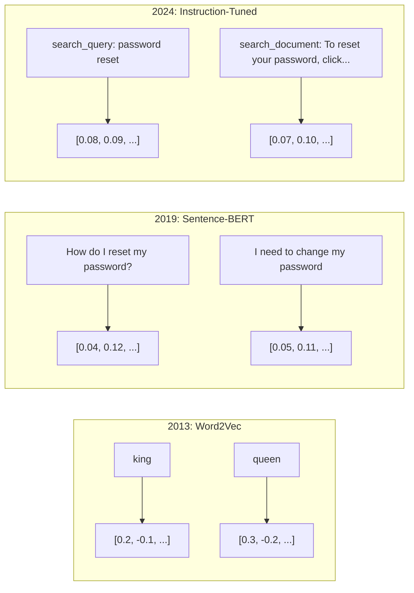
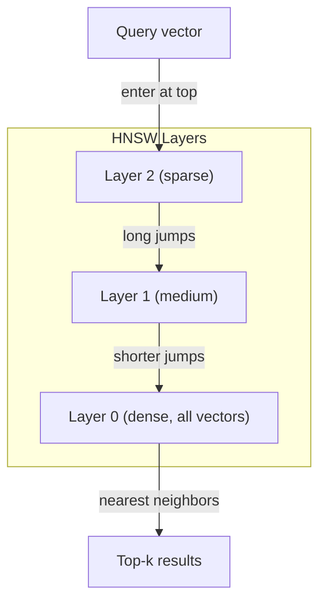
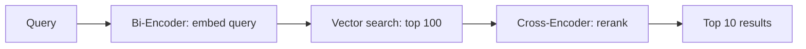

# Embeddings 与 Vector Representations

> 文本是离散的。数学是连续的。每次你让 LLM 查找“相似”文档、比较含义，或超越关键词搜索时，你都在依赖连接这两个世界的一座桥。那座桥就是 embedding。如果你不理解 embeddings，你就不理解现代 AI。你只是在使用它。

**类型：** Build
**语言：** Python
**先修：** Phase 11, Lesson 01 (Prompt Engineering)
**时间：** ~75 分钟
**相关：** Phase 5 · 22 (Embedding Models Deep Dive) 覆盖 dense vs sparse vs multi-vector、Matryoshka truncation，以及 per-axis model selection。本课聚焦生产 pipeline（vector DBs、HNSW、similarity math）。选模型前请先读 Phase 5 · 22。

## 学习目标

- 使用 API providers 和 open-source models 生成 text embeddings，并计算它们之间的 cosine similarity
- 解释 embeddings 为什么能解决 keyword search 无法处理的 vocabulary mismatch problem
- 构建一个 semantic search index，按 meaning 而非 exact keyword match 检索 documents
- 使用 retrieval benchmarks（precision@k、recall）评估 embedding quality，并为任务选择合适 embedding model

## 要解决的问题

你有 10,000 条 support tickets。客户写道 “my payment didn't go through”。你需要找到相似的历史 tickets。Keyword search 会找到包含 “payment” 和 “didn't go through” 的 tickets。它会漏掉 “transaction failed”、“charge was declined” 和 “billing error”。这些 tickets 用完全不同的词描述同一个问题。

这就是 vocabulary mismatch problem。人类语言有几十种方式表达同一件事。Keyword search 把每个词当作没有意义的独立符号。它无法知道 “declined” 和 “didn't go through” 指的是同一个概念。

你需要一种 text representation，其中 similarity 由 meaning 而不是 spelling 决定。你需要一种方法，把 “my payment didn't go through” 和 “transaction was declined” 放到某个数学空间中的相近位置，同时把 “my payment arrived on time” 推远，尽管它也包含 “payment”。

这种 representation 就是 embedding。

## 核心概念

### What Is an Embedding?

embedding 是一个 dense vector，由 floating-point numbers 组成，用来表示文本含义。“dense” 很重要——每个 dimension 都携带信息，不像 sparse representations（bag-of-words、TF-IDF）那样大多数 dimensions 都是零。

“The cat sat on the mat” 会变成类似 `[0.023, -0.041, 0.087, ..., 0.012]` 的东西——取决于模型，它可能是 768 到 3072 个数字组成的 list。这些数字编码 meaning。你不会直接 inspect 它们。你会 compare 它们。

### The Word2Vec Breakthrough

2013 年，Google 的 Tomas Mikolov 和同事发表了 Word2Vec。核心洞察是：训练一个 neural network 根据邻近词预测某个词（或根据某个词预测邻近词），hidden layer weights 会成为有意义的 vector representations。

著名结果：

```text
king - man + woman = queen
```

word embeddings 上的 vector arithmetic 能捕捉 semantic relationships。从 “man” 到 “woman” 的方向，大致等于从 “king” 到 “queen” 的方向。那一刻，领域意识到 geometry 可以编码 meaning。

Word2Vec 生成 300-dimensional vectors。每个 word 无论 context 如何都只有一个 vector。“Bank” 在 “river bank” 和 “bank account” 中拥有同一个 embedding。这个限制推动了接下来十年的研究。

### From Words to Sentences

Word embeddings 表示 single tokens。生产系统需要 embed 整个 sentences、paragraphs 或 documents。出现了四种方法：

**Averaging**：取句子中所有 word vectors 的 mean。便宜、有损，但对短文本出人意料地还不错。完全丢失 word order——“dog bites man” 和 “man bites dog” 会得到相同 embeddings。

**CLS token**：transformer models（BERT, 2018）输出一个代表整个输入的特殊 [CLS] token embedding。比 averaging 更好，但 [CLS] token 是为 next-sentence prediction 训练的，不是为 similarity 训练的。

**Contrastive learning**：显式训练模型，把 similar pairs 拉近、dissimilar pairs 推远。Sentence-BERT（Reimers & Gurevych, 2019）使用了这种方法，并成为现代 embedding models 的基础。给定 “How do I reset my password?” 和 “I need to change my password”，模型学到它们应该拥有几乎相同的 vectors。

**Instruction-tuned embeddings**：最新方法。E5 和 GTE 等模型接受 task prefix（“search_query:”、“search_document:”），告诉模型应该生成哪种 embedding。这让一个模型能服务多个任务。



### Modern Embedding Models

市场已经收敛到少数 production-grade options（截至 2026 年初的 MTEB scores，MTEB v2）：

| Model | Provider | Dimensions | MTEB | Context | Cost / 1M tokens |
|-------|----------|-----------|------|---------|------------------|
| Gemini Embedding 2 | Google | 3072 (Matryoshka) | 67.7 (retrieval) | 8192 | $0.15 |
| embed-v4 | Cohere | 1024 (Matryoshka) | 65.2 | 128K | $0.12 |
| voyage-4 | Voyage AI | 1024/2048 (Matryoshka) | 66.8 | 32K | $0.12 |
| text-embedding-3-large | OpenAI | 3072 (Matryoshka) | 64.6 | 8192 | $0.13 |
| text-embedding-3-small | OpenAI | 1536 (Matryoshka) | 62.3 | 8192 | $0.02 |
| BGE-M3 | BAAI | 1024 (dense+sparse+ColBERT) | 63.0 multilingual | 8192 | Open-weight |
| Qwen3-Embedding | Alibaba | 4096 (Matryoshka) | 66.9 | 32K | Open-weight |
| Nomic-embed-v2 | Nomic | 768 (Matryoshka) | 63.1 | 8192 | Open-weight |

MTEB（Massive Text Embedding Benchmark）v2 覆盖 retrieval、classification、clustering、reranking 和 summarization 等 100+ tasks。越高越好。到 2026 年，open-weight models（Qwen3-Embedding、BGE-M3）在多数 axes 上已经匹配或超过 closed hosted models。Gemini Embedding 2 领先 pure retrieval；Voyage/Cohere 领先特定 domains（finance、law、code）。提交之前永远要在你自己的 queries 上 benchmark。

### Similarity Metrics

给定两个 embedding vectors，有三种方式衡量它们相似度：

**Cosine similarity**：两个 vectors 夹角的 cosine。范围从 -1（相反）到 1（同向）。忽略 magnitude——如果方向相同，10-word sentence 和 500-word document 也能得到 1.0。90% 用例的默认选择。

```text
cosine_sim(a, b) = dot(a, b) / (||a|| * ||b||)
```

**Dot product**：两个 vectors 的 raw inner product。当 vectors 已经 normalized（unit length）时，它与 cosine similarity 等价。计算更快。OpenAI embeddings 是 normalized 的，因此 dot product 和 cosine 给出相同排名。

```text
dot(a, b) = sum(a_i * b_i)
```

**Euclidean (L2) distance**：vector space 中的直线距离。越小越相似。对 magnitude differences 敏感。当 space 中 absolute position 很重要，而不只是 direction 很重要时使用。

```text
L2(a, b) = sqrt(sum((a_i - b_i)^2))
```

何时使用哪种：

| Metric | Use when | Avoid when |
|--------|----------|------------|
| Cosine similarity | Comparing texts of different lengths; most retrieval tasks | Magnitude carries information |
| Dot product | Embeddings are already normalized; maximum speed | Vectors have varying magnitudes |
| Euclidean distance | Clustering; spatial nearest-neighbor problems | Comparing documents of wildly different lengths |

### Vector Databases and HNSW

brute-force similarity search 会把 query 与每个 stored vector 比较。100 万个 vectors、每个 1536 dimensions，就是每次 query 15 亿次 multiply-add operations。太慢。

Vector databases 用 Approximate Nearest Neighbor（ANN）algorithms 解决它。主导算法是 HNSW（Hierarchical Navigable Small World）：

1. 构建一个 multi-layer graph of vectors
2. 顶层 sparse——连接 distant clusters 的 long-range connections
3. 底层 dense——连接 nearby vectors 的 fine-grained connections
4. search 从 top layer 开始，greedily descending 逐步 refine
5. 以 O(log n) 而非 O(n) 时间返回 approximate top-k results

HNSW 用很小的 accuracy loss（通常 95-99% recall）换取巨大 speed gains。1000 万 vectors 时，brute force 要几秒。HNSW 要几毫秒。



生产选项：

| Database | Type | Best for | Max scale |
|----------|------|----------|-----------|
| Pinecone | Managed SaaS | Zero-ops production | Billions |
| Weaviate | Open source | Self-hosted, hybrid search | 100M+ |
| Qdrant | Open source | High performance, filtering | 100M+ |
| ChromaDB | Embedded | Prototyping, local dev | 1M |
| pgvector | Postgres extension | Already using Postgres | 10M |
| FAISS | Library | In-process, research | 1B+ |

### Chunking Strategies

Documents 太长，不能作为 single vectors embedding。一个 50 页 PDF 覆盖几十个 topics——它的 embedding 变成所有内容的平均，和任何具体内容都不相似。你要把 documents 切成 chunks，并 embed 每个 chunk。

**Fixed-size chunking**：每 N tokens 切分一次，并保留 M-token overlap。简单且可预测。当 documents 没有清晰结构时效果好。512-token chunk 加 50-token overlap：chunk 1 是 tokens 0-511，chunk 2 是 tokens 462-973。

**Sentence-based chunking**：在 sentence boundaries 切分，把 sentences 分组直到 token limit。每个 chunk 至少是一个完整 sentence。比 fixed-size 更好，因为不会把 thought 切成两半。

**Recursive chunking**：先尝试按最大 boundary 切分（section headers）。如果仍然太大，再尝试 paragraph boundaries。然后 sentence boundaries。最后 character limits。这就是 LangChain 的 `RecursiveCharacterTextSplitter`，对 mixed-format corpora 很有效。

**Semantic chunking**：embed 每个 sentence，然后把 embeddings 相似的连续 sentences 分到一组。当 embedding similarity 低于 threshold 时，开始新 chunk。昂贵（需要单独 embedding 每个 sentence），但生成最 coherent 的 chunks。

| Strategy | Complexity | Quality | Best for |
|----------|-----------|---------|----------|
| Fixed-size | Low | Decent | Unstructured text, logs |
| Sentence-based | Low | Good | Articles, emails |
| Recursive | Medium | Good | Markdown, HTML, mixed docs |
| Semantic | High | Best | Critical retrieval quality |

多数系统的甜蜜点：256-512 token chunks，配 50-token overlap。

### Bi-Encoders vs Cross-Encoders

bi-encoder 会独立 embed query 和 documents，然后比较 vectors。速度快——你只需要 embed query 一次，然后与 pre-computed document embeddings 比较。这是 retrieval 中使用的方式。

cross-encoder 把 query 和一个 document 作为 single input，并输出 relevance score。速度慢——它要让每个 query-document pair 通过完整模型。但准确得多，因为它能同时 attend query 和 document tokens。

生产模式：bi-encoder 检索 top-100 candidates，cross-encoder rerank 到 top-10。这就是 retrieve-then-rerank pipeline。



Reranking models：Cohere Rerank 3.5（$2 per 1000 queries）、BGE-reranker-v2（free, open source）、Jina Reranker v2（free, open source）。

### Matryoshka Embeddings

传统 embeddings 是 all-or-nothing。一个 1536-dimensional vector 使用 1536 floats。你不能在不重新训练的情况下截断到 256 dimensions。

Matryoshka Representation Learning（Kusupati et al., 2022）解决了它。模型训练时让前 N dimensions 捕捉最重要信息，就像俄罗斯套娃。把 1536-d Matryoshka embedding 截断到 256 dimensions 会损失一些准确率，但仍然可用。

OpenAI 的 text-embedding-3-small 和 text-embedding-3-large 通过 `dimensions` 参数支持 Matryoshka truncation。请求 256 dimensions 而不是 1536，可让 storage 降低 6x，在 MTEB benchmarks 上准确率大约损失 3-5%。

### Binary Quantization

一个 1536-dimensional embedding 以 float32 存储需要 6,144 bytes。乘以 1000 万 documents：光 vectors 就要 61 GB。

Binary quantization 把每个 float 转换成 single bit：正值变成 1，负值变成 0。存储从 6,144 bytes 降到 192 bytes——减少 32x。Similarity 使用 Hamming distance（计算不同 bits 数量），CPU 可以用一条 instruction 完成。

retrieval recall 上的 accuracy hit 大约是 5-10%。常见模式：first-pass search 对数百万 vectors 使用 binary quantization，然后用 full-precision vectors 对 top-1000 rescore。这让你以 32x 更少 memory 获得 95%+ full-precision accuracy。

## 动手实现

我们从零构建一个 semantic search engine。不用 vector database。不用 external embedding API。只用 Python 和 numpy 做数学。

### Step 1: Text Chunking

```python
def chunk_text(text, chunk_size=200, overlap=50):
    words = text.split()
    chunks = []
    start = 0
    while start < len(words):
        end = start + chunk_size
        chunk = " ".join(words[start:end])
        chunks.append(chunk)
        start += chunk_size - overlap
    return chunks


def chunk_by_sentences(text, max_chunk_tokens=200):
    sentences = text.replace("\n", " ").split(".")
    sentences = [s.strip() + "." for s in sentences if s.strip()]
    chunks = []
    current_chunk = []
    current_length = 0
    for sentence in sentences:
        sentence_length = len(sentence.split())
        if current_length + sentence_length > max_chunk_tokens and current_chunk:
            chunks.append(" ".join(current_chunk))
            current_chunk = []
            current_length = 0
        current_chunk.append(sentence)
        current_length += sentence_length
    if current_chunk:
        chunks.append(" ".join(current_chunk))
    return chunks
```

### Step 2: Building Embeddings from Scratch

我们用 TF-IDF + L2 normalization 实现一个简单 dense embedding。它不是 neural embedding，但遵循同样 contract：text in、fixed-size vector out、similar texts produce similar vectors。

```python
import math
import numpy as np
from collections import Counter

class SimpleEmbedder:
    def __init__(self):
        self.vocab = []
        self.idf = []
        self.word_to_idx = {}

    def fit(self, documents):
        vocab_set = set()
        for doc in documents:
            vocab_set.update(doc.lower().split())
        self.vocab = sorted(vocab_set)
        self.word_to_idx = {w: i for i, w in enumerate(self.vocab)}
        n = len(documents)
        self.idf = np.zeros(len(self.vocab))
        for i, word in enumerate(self.vocab):
            doc_count = sum(1 for doc in documents if word in doc.lower().split())
            self.idf[i] = math.log((n + 1) / (doc_count + 1)) + 1

    def embed(self, text):
        words = text.lower().split()
        count = Counter(words)
        total = len(words) if words else 1
        vec = np.zeros(len(self.vocab))
        for word, freq in count.items():
            if word in self.word_to_idx:
                tf = freq / total
                vec[self.word_to_idx[word]] = tf * self.idf[self.word_to_idx[word]]
        norm = np.linalg.norm(vec)
        if norm > 0:
            vec = vec / norm
        return vec
```

### Step 3: Similarity Functions

```python
def cosine_similarity(a, b):
    dot = np.dot(a, b)
    norm_a = np.linalg.norm(a)
    norm_b = np.linalg.norm(b)
    if norm_a == 0 or norm_b == 0:
        return 0.0
    return float(dot / (norm_a * norm_b))


def dot_product(a, b):
    return float(np.dot(a, b))


def euclidean_distance(a, b):
    return float(np.linalg.norm(a - b))
```

### Step 4: Vector Index with Brute-Force Search

```python
class VectorIndex:
    def __init__(self):
        self.vectors = []
        self.texts = []
        self.metadata = []

    def add(self, vector, text, meta=None):
        self.vectors.append(vector)
        self.texts.append(text)
        self.metadata.append(meta or {})

    def search(self, query_vector, top_k=5, metric="cosine"):
        scores = []
        for i, vec in enumerate(self.vectors):
            if metric == "cosine":
                score = cosine_similarity(query_vector, vec)
            elif metric == "dot":
                score = dot_product(query_vector, vec)
            elif metric == "euclidean":
                score = -euclidean_distance(query_vector, vec)
            else:
                raise ValueError(f"Unknown metric: {metric}")
            scores.append((i, score))
        scores.sort(key=lambda x: x[1], reverse=True)
        results = []
        for idx, score in scores[:top_k]:
            results.append({
                "text": self.texts[idx],
                "score": score,
                "metadata": self.metadata[idx],
                "index": idx
            })
        return results

    def size(self):
        return len(self.vectors)
```

### Step 5: The Semantic Search Engine

```python
class SemanticSearchEngine:
    def __init__(self, chunk_size=200, overlap=50):
        self.embedder = SimpleEmbedder()
        self.index = VectorIndex()
        self.chunk_size = chunk_size
        self.overlap = overlap

    def index_documents(self, documents, source_names=None):
        all_chunks = []
        all_sources = []
        for i, doc in enumerate(documents):
            chunks = chunk_text(doc, self.chunk_size, self.overlap)
            all_chunks.extend(chunks)
            name = source_names[i] if source_names else f"doc_{i}"
            all_sources.extend([name] * len(chunks))
        self.embedder.fit(all_chunks)
        for chunk, source in zip(all_chunks, all_sources):
            vec = self.embedder.embed(chunk)
            self.index.add(vec, chunk, {"source": source})
        return len(all_chunks)

    def search(self, query, top_k=5, metric="cosine"):
        query_vec = self.embedder.embed(query)
        return self.index.search(query_vec, top_k, metric)

    def search_with_scores(self, query, top_k=5):
        results = self.search(query, top_k)
        return [
            {
                "text": r["text"][:200],
                "source": r["metadata"].get("source", "unknown"),
                "score": round(r["score"], 4)
            }
            for r in results
        ]
```

### Step 6: Comparing Similarity Metrics

```python
def compare_metrics(engine, query, top_k=3):
    results = {}
    for metric in ["cosine", "dot", "euclidean"]:
        hits = engine.search(query, top_k=top_k, metric=metric)
        results[metric] = [
            {"score": round(h["score"], 4), "preview": h["text"][:80]}
            for h in hits
        ]
    return results
```

## 实际使用

使用 production embedding API 时，architecture 保持不变。只有 embedder 会变：

```python
from openai import OpenAI

client = OpenAI()

def openai_embed(texts, model="text-embedding-3-small", dimensions=None):
    kwargs = {"model": model, "input": texts}
    if dimensions:
        kwargs["dimensions"] = dimensions
    response = client.embeddings.create(**kwargs)
    return [item.embedding for item in response.data]
```

OpenAI 的 Matryoshka truncation——同一个 model，更少 dimensions，更低 storage：

```python
full = openai_embed(["semantic search query"], dimensions=1536)
compact = openai_embed(["semantic search query"], dimensions=256)
```

256-d vector 使用 6x 更少 storage。对 1000 万 documents，是 10 GB vs 61 GB。标准 benchmarks 上 accuracy loss 大约是 3-5%。

使用 Cohere reranking：

```python
import cohere

co = cohere.ClientV2()

results = co.rerank(
    model="rerank-v3.5",
    query="What is the refund policy?",
    documents=["Full refund within 30 days...", "No refunds after 90 days..."],
    top_n=3
)
```

无 API dependency 的 local embeddings：

```python
from sentence_transformers import SentenceTransformer

model = SentenceTransformer("BAAI/bge-small-en-v1.5")
embeddings = model.encode(["semantic search query", "another document"])
```

我们构建的 VectorIndex class 可与任意这些方式配合。替换 embedding function，保留 search logic。

## 交付成果

本课产出：
- `outputs/prompt-embedding-advisor.md`——一个 prompt，用于为特定 use cases 选择 embedding models 和 strategies
- `outputs/skill-embedding-patterns.md`——一个 skill，教 agents 如何在生产环境中有效使用 embeddings

## 练习

1. **Metric comparison**：用 cosine similarity、dot product 和 euclidean distance，对 sample documents 运行相同 5 个 queries。记录每个 metric 的 top-3 results。哪些 queries 下 metrics 不一致？为什么？

2. **Chunk size experiment**：用 50、100、200、500 words 的 chunk sizes 索引 sample documents。每个设置下运行 5 个 queries，并记录 top-1 similarity score。绘制 chunk size 与 retrieval quality 的关系。找出 larger chunks 开始伤害效果的点。

3. **Matryoshka simulation**：构建一个能产生 500-d vectors 的 SimpleEmbedder。截断到 50、100、200 和 500 dimensions。测量每次 truncation 下 retrieval recall 如何下降。这不需要真实训练技巧，也能模拟 Matryoshka behavior。

4. **Binary quantization**：取 search engine 中的 embeddings，把它们转换为 binary（正值为 1，负值为 0），并实现 Hamming distance search。将 top-10 results 与 full-precision cosine similarity 对比。测量 overlap percentage。

5. **Sentence-based chunking**：用 `chunk_by_sentences` 替换 fixed-size chunking。运行相同 queries 并比较 retrieval scores。尊重 sentence boundaries 是否改善结果？

## 关键术语

| Term | What people say | What it actually means |
|------|----------------|----------------------|
| Embedding | “Text to numbers” | 一个 dense vector，其中 geometric proximity 编码 semantic similarity |
| Word2Vec | “The OG embedding” | 2013 年模型，通过预测 context words 学习 word vectors；证明 vector arithmetic 可以编码 meaning |
| Cosine similarity | “How similar are two vectors” | 两个 vectors 夹角的 cosine；1 = identical direction，0 = orthogonal，-1 = opposite |
| HNSW | “Fast vector search” | Hierarchical Navigable Small World graph——multi-layer structure，支持 O(log n) approximate nearest neighbor search |
| Bi-encoder | “Embed separately, compare fast” | 独立把 query 和 document 编码为 vectors；支持 pre-computation 和快速 retrieval |
| Cross-encoder | “Slow but accurate reranker” | 把 query-document pair 联合送入完整模型；准确率更高，但无法 pre-computation |
| Matryoshka embeddings | “Truncatable vectors” | 经过训练使前 N dimensions 捕获最重要信息的 embeddings，支持 variable-size storage |
| Binary quantization | “1-bit embeddings” | 把 float vectors 转换为 binary（只保留 sign bit），用 Hamming distance search 获得 32x storage reduction |
| Chunking | “Split docs for embedding” | 把 documents 拆成 256-512 token segments，让每段可独立 embedded 和 retrieved |
| Vector database | “Search engine for embeddings” | 专为存储 vectors 并大规模执行 approximate nearest neighbor search 优化的数据存储 |
| Contrastive learning | “Train by comparison” | 一种训练方法，把 similar pair embeddings 拉近，把 dissimilar pair embeddings 推远 |
| MTEB | “The embedding benchmark” | Massive Text Embedding Benchmark——跨 8 类任务的 56 datasets；比较 embedding models 的标准 |

## 延伸阅读

- Mikolov et al., "Efficient Estimation of Word Representations in Vector Space" (2013)——开启 embedding 革命的 Word2Vec 论文，包含 king-queen analogy
- Reimers & Gurevych, "Sentence-BERT: Sentence Embeddings using Siamese BERT-Networks" (2019)——如何训练 sentence-level similarity 的 bi-encoders，是现代 embedding models 的基础
- Kusupati et al., "Matryoshka Representation Learning" (2022)——OpenAI text-embedding-3 采用的 variable-dimension embeddings 背后技术
- Malkov & Yashunin, "Efficient and Robust Approximate Nearest Neighbor using Hierarchical Navigable Small World Graphs" (2018)——HNSW 论文，大多数生产 vector search 背后的算法
- OpenAI Embeddings Guide (platform.openai.com/docs/guides/embeddings)——text-embedding-3 models 的实践参考，包括 Matryoshka dimension reduction
- MTEB Leaderboard (huggingface.co/spaces/mteb/leaderboard)——跨任务和语言比较所有 embedding models 的实时 benchmark
- [Muennighoff et al., "MTEB: Massive Text Embedding Benchmark" (EACL 2023)](https://arxiv.org/abs/2210.07316)——定义 leaderboard 报告的 8 类任务（classification、clustering、pair classification、reranking、retrieval、STS、summarization、bitext mining）的 benchmark；信任单个 MTEB score 前请先阅读
- [Sentence Transformers documentation](https://www.sbert.net/)——bi-encoder vs cross-encoder、pooling strategies，以及本课实现的 ingest-split-embed-store RAG pipeline 的规范参考
