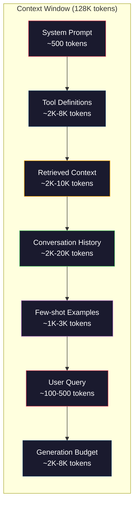
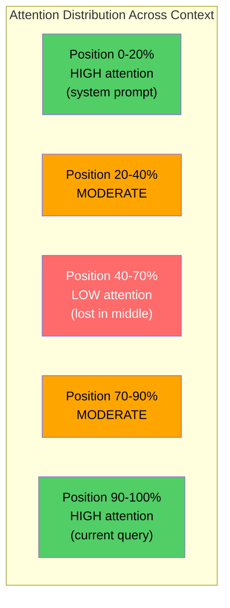
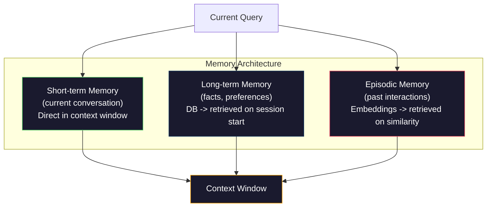

# Context Engineering：Windows、Budgets、Memory 与 Retrieval

> Prompt engineering 只是子集。Context engineering 才是全局。prompt 是你输入的一串文字。context 是进入模型窗口的一切：system instructions、retrieved documents、tool definitions、conversation history、few-shot examples，以及 prompt 本身。2026 年最好的 AI engineers 是 context engineers。他们决定什么放进去、什么留在外面，以及按什么顺序放。

**类型：** Build
**语言：** Python
**先修：** Phase 10 (LLMs from Scratch), Phase 11 Lesson 01-02
**时间：** ~90 分钟
**相关：** Phase 11 · 15 (Prompt Caching)——cache-friendly layout 是 context engineering 的延伸。Phase 5 · 28 (Long-Context Evaluation) 讨论如何用 NIAH/RULER 测量 lost-in-the-middle。

## 学习目标

- 计算所有 context window components（system prompt、tools、history、retrieved docs、generation headroom）的 token budgets
- 实现 context window management strategies：conversation history 的 truncation、summarization 和 sliding window
- 对 context components 进行优先级排序和顺序安排，让模型 attention 尽可能集中在最相关信息上
- 构建 context assembler，根据 query type 和可用 window space 动态分配 tokens

## 要解决的问题

Claude Opus 4.7 有 200K token window（beta 中 1M）。GPT-5 有 400K。Gemini 3 Pro 有 2M。Llama 4 声称 10M。这些数字听起来很大，直到你把它们填满。

下面是一个 coding assistant 的真实 breakdown。System prompt：500 tokens。50 个 tools 的 tool definitions：8,000 tokens。Retrieved documentation：4,000 tokens。Conversation history（10 turns）：6,000 tokens。Current user query：200 tokens。Generation budget（max output）：4,000 tokens。总计：22,700 tokens。这只占 128K window 的 18%。

但 attention 并不会随 context length 线性扩展。一个拥有 128K tokens context 的模型要付出 quadratic attention cost（vanilla transformers 中是 O(n^2)，虽然多数生产模型使用 efficient attention variants）。更重要的是，retrieval accuracy 会下降。“Needle in a Haystack” 测试显示，模型很难找到放在长上下文中间的信息。Liu et al. (2023) 的研究表明，LLMs 在长 contexts 的开头和结尾提取信息时准确率近乎完美，但当信息放在中间（context 的 40-70% 位置）时，准确率会下降 10-20%。这个 “lost-in-the-middle” effect 因模型而异，但影响所有当前 architectures。

实践教训是：可用 200K tokens 不代表使用 200K tokens 有效。精心筛选的 10K token context 往往胜过倾倒进去的 100K token context。Context engineering 是在 context window 内最大化 signal-to-noise ratio 的学科。

你放进窗口的每个 token，都会挤掉一个本可以承载更相关信息的 token。每个无关 tool definition、每个 stale conversation turn、每个无法回答问题的 retrieved text chunk——它们都会让模型在任务上稍微变差。

## 核心概念

### The Context Window is a Scarce Resource

把 context window 当作 RAM，而不是 disk。它速度快，可以被直接访问，但有限。你无法塞进所有东西。你必须选择。



每个 component 都在争夺空间。添加更多 tool definitions，就会减少 conversation history 的空间。添加更多 retrieved context，就会减少 few-shot examples 的空间。Context engineering 是分配这个 budget 以最大化 task performance 的艺术。

### Lost-in-the-Middle

这是 context engineering 中最重要的实证发现。模型对 context 开头和结尾的信息 attention 更好。中间的信息得到较低 attention scores，更容易被忽略。

Liu et al. (2023) 系统测试了这一点。他们把一个 relevant document 放在 20 个 irrelevant documents 中的不同位置，并测量回答准确率。当 relevant document 是第一个或最后一个时，准确率是 85-90%。当它在中间（20 个中的第 10 个位置）时，准确率下降到 60-70%。

这有直接 engineering implications：

- 把最重要的信息放在最前面（system prompt、critical instructions）
- 把 current query 和 most relevant context 放在最后（recency bias 有帮助）
- 把 context 中间视为最低优先级 zone
- 如果必须把信息放在中间，请在结尾重复 key point



### Context Components

**System prompt**：设置 persona、constraints 和 behavioral rules。它放在最前面，并跨 turns 保持不变。Claude Code 的 system prompt 大约使用 6,000 tokens，包含 tool definitions 和 behavioral instructions。保持紧凑。system prompt 中的每个 word 都会在每次 API call 中重复。

**Tool definitions**：每个 tool 增加 50-200 tokens（name、description、parameter schema）。50 个 tools 每个 150 tokens，在任何 conversation 发生前就是 7,500 tokens。Dynamic tool selection——只包含当前 query 相关的 tools——可减少 60-80%。

**Retrieved context**：来自 vector database 的 documents、search results、file contents。retrieval 质量直接决定 response 质量。坏 retrieval 比没有 retrieval 更糟——它会用噪声填满窗口，并主动误导模型。

**Conversation history**：每条以前的 user message 和 assistant response。随 conversation length 线性增长。50-turn conversation、每 turn 200 tokens，就是 10,000 tokens history。其中大部分与当前 query 无关。

**Few-shot examples**：展示目标 behavior 的 input/output pairs。两到三个选得好的 examples，往往比数千 tokens 指令更能提升输出质量。但它们也占空间。

**Generation budget**：为模型 response 预留的 tokens。如果把窗口填到 capacity，模型就没有空间回答。至少为 generation 预留 2,000-4,000 tokens。

### Context Compression Strategies

**History summarization**：不要逐字保留所有 previous turns，而是定期总结 conversation。用 100 tokens 写出 “We discussed X, decided Y, and the user wants Z”，替代占 2,000 tokens 的 10 turns。当 history 超过 threshold（例如 5,000 tokens）时运行 summarization。

**Relevance filtering**：把每个 retrieved document 与 current query 打分，并丢弃低于 threshold 的 documents。如果你 retrieved 10 个 chunks，但只有 3 个相关，就丢弃另外 7 个。3 个 highly relevant chunks 胜过 10 个 mediocre chunks。

**Tool pruning**：分类 user query intent，只包含与该 intent 相关的 tools。code question 不需要 calendar tools。scheduling question 不需要 file system tools。这可以把 tool definitions 从 8,000 tokens 降到 1,000。

**Recursive summarization**：对很长的 documents，分阶段总结。先总结每个 section，再总结 summaries。50 页 document 变成 500-token digest，并保留 key points。

### Memory Systems

Context engineering 跨越三个时间尺度。

**Short-term memory**：当前 conversation。直接存放在 context window 中。随每个 turn 增长。由 summarization 和 truncation 管理。

**Long-term memory**：跨 conversations 持久存在的 facts 和 preferences。“The user prefers TypeScript.” “The project uses PostgreSQL.” 存储在 database 中，在 session start 时 retrieved。Claude Code 把它存在 CLAUDE.md files。ChatGPT 把它存在 memory feature 中。

**Episodic memory**：可能相关的具体 past interactions。“Last Tuesday, we debugged a similar issue in the auth module.” 以 embeddings 存储，当当前 conversation 匹配过去 episode 时 retrieved。



### Dynamic Context Assembly

关键洞察：不同 queries 需要不同 context。static system prompt + static tools + static history 很浪费。最好的系统会按 query 动态 assemble context。

1. Classify the query intent
2. Select relevant tools（不是 all tools）
3. Retrieve relevant documents（不是固定集合）
4. Include relevant history turns（不是 all history）
5. Add few-shot examples that match the task type
6. Order everything by importance：critical first、important last、optional in the middle

这就是一个好 AI application 和一个优秀 AI application 的差距。模型相同。context 才是 differentiator。

## 动手实现

### Step 1: Token Counter

无法 measure，就无法 budget。构建一个简单 token counter（用 whitespace splitting 做近似，因为精确计数取决于 tokenizer）。

```python
import json
import numpy as np
from collections import OrderedDict

def count_tokens(text):
    if not text:
        return 0
    return int(len(text.split()) * 1.3)

def count_tokens_json(obj):
    return count_tokens(json.dumps(obj))
```

### Step 2: Context Budget Manager

核心抽象。budget manager 跟踪每个 component 使用了多少 tokens，并强制 limits。

```python
class ContextBudget:
    def __init__(self, max_tokens=128000, generation_reserve=4000):
        self.max_tokens = max_tokens
        self.generation_reserve = generation_reserve
        self.available = max_tokens - generation_reserve
        self.allocations = OrderedDict()

    def allocate(self, component, content, max_tokens=None):
        tokens = count_tokens(content)
        if max_tokens and tokens > max_tokens:
            words = content.split()
            target_words = int(max_tokens / 1.3)
            content = " ".join(words[:target_words])
            tokens = count_tokens(content)

        used = sum(self.allocations.values())
        if used + tokens > self.available:
            allowed = self.available - used
            if allowed <= 0:
                return None, 0
            words = content.split()
            target_words = int(allowed / 1.3)
            content = " ".join(words[:target_words])
            tokens = count_tokens(content)

        self.allocations[component] = tokens
        return content, tokens

    def remaining(self):
        used = sum(self.allocations.values())
        return self.available - used

    def utilization(self):
        used = sum(self.allocations.values())
        return used / self.max_tokens

    def report(self):
        total_used = sum(self.allocations.values())
        lines = []
        lines.append(f"Context Budget Report ({self.max_tokens:,} token window)")
        lines.append("-" * 50)
        for component, tokens in self.allocations.items():
            pct = tokens / self.max_tokens * 100
            bar = "#" * int(pct / 2)
            lines.append(f"  {component:<25} {tokens:>6} tokens ({pct:>5.1f}%) {bar}")
        lines.append("-" * 50)
        lines.append(f"  {'Used':<25} {total_used:>6} tokens ({total_used/self.max_tokens*100:.1f}%)")
        lines.append(f"  {'Generation reserve':<25} {self.generation_reserve:>6} tokens")
        lines.append(f"  {'Remaining':<25} {self.remaining():>6} tokens")
        return "\n".join(lines)
```

### Step 3: Lost-in-the-Middle Reordering

实现 reordering strategy：最重要 items 放在最前和最后，最不重要 items 放在中间。

```python
def reorder_lost_in_middle(items, scores):
    paired = sorted(zip(scores, items), reverse=True)
    sorted_items = [item for _, item in paired]

    if len(sorted_items) <= 2:
        return sorted_items

    first_half = sorted_items[::2]
    second_half = sorted_items[1::2]
    second_half.reverse()

    return first_half + second_half

def score_relevance(query, documents):
    query_words = set(query.lower().split())
    scores = []
    for doc in documents:
        doc_words = set(doc.lower().split())
        if not query_words:
            scores.append(0.0)
            continue
        overlap = len(query_words & doc_words) / len(query_words)
        scores.append(round(overlap, 3))
    return scores
```

### Step 4: Conversation History Compressor

总结 old conversation turns，以回收 token budget。

```python
class ConversationManager:
    def __init__(self, max_history_tokens=5000):
        self.turns = []
        self.summaries = []
        self.max_history_tokens = max_history_tokens

    def add_turn(self, role, content):
        self.turns.append({"role": role, "content": content})
        self._compress_if_needed()

    def _compress_if_needed(self):
        total = sum(count_tokens(t["content"]) for t in self.turns)
        if total <= self.max_history_tokens:
            return

        while total > self.max_history_tokens and len(self.turns) > 4:
            old_turns = self.turns[:2]
            summary = self._summarize_turns(old_turns)
            self.summaries.append(summary)
            self.turns = self.turns[2:]
            total = sum(count_tokens(t["content"]) for t in self.turns)

    def _summarize_turns(self, turns):
        parts = []
        for t in turns:
            content = t["content"]
            if len(content) > 100:
                content = content[:100] + "..."
            parts.append(f"{t['role']}: {content}")
        return "Previous: " + " | ".join(parts)

    def get_context(self):
        parts = []
        if self.summaries:
            parts.append("[Conversation Summary]")
            for s in self.summaries:
                parts.append(s)
        parts.append("[Recent Conversation]")
        for t in self.turns:
            parts.append(f"{t['role']}: {t['content']}")
        return "\n".join(parts)

    def token_count(self):
        return count_tokens(self.get_context())
```

### Step 5: Dynamic Tool Selector

只包含与 current query 相关的 tools。先 classify intent，再 filter。

```python
TOOL_REGISTRY = {
    "read_file": {
        "description": "Read contents of a file",
        "tokens": 120,
        "categories": ["code", "files"],
    },
    "write_file": {
        "description": "Write content to a file",
        "tokens": 150,
        "categories": ["code", "files"],
    },
    "search_code": {
        "description": "Search for patterns in codebase",
        "tokens": 130,
        "categories": ["code"],
    },
    "run_command": {
        "description": "Execute a shell command",
        "tokens": 140,
        "categories": ["code", "system"],
    },
    "create_calendar_event": {
        "description": "Create a new calendar event",
        "tokens": 180,
        "categories": ["calendar"],
    },
    "list_emails": {
        "description": "List recent emails",
        "tokens": 160,
        "categories": ["email"],
    },
    "send_email": {
        "description": "Send an email message",
        "tokens": 200,
        "categories": ["email"],
    },
    "web_search": {
        "description": "Search the web for information",
        "tokens": 140,
        "categories": ["research"],
    },
    "query_database": {
        "description": "Run a SQL query on the database",
        "tokens": 170,
        "categories": ["code", "data"],
    },
    "generate_chart": {
        "description": "Generate a chart from data",
        "tokens": 190,
        "categories": ["data", "visualization"],
    },
}

def classify_intent(query):
    query_lower = query.lower()

    intent_keywords = {
        "code": ["code", "function", "bug", "error", "file", "implement", "refactor", "debug", "test"],
        "calendar": ["meeting", "schedule", "calendar", "appointment", "event"],
        "email": ["email", "mail", "send", "inbox", "message"],
        "research": ["search", "find", "what is", "how does", "explain", "look up"],
        "data": ["data", "query", "database", "chart", "graph", "analytics", "sql"],
    }

    scores = {}
    for intent, keywords in intent_keywords.items():
        score = sum(1 for kw in keywords if kw in query_lower)
        if score > 0:
            scores[intent] = score

    if not scores:
        return ["code"]

    max_score = max(scores.values())
    return [intent for intent, score in scores.items() if score >= max_score * 0.5]

def select_tools(query, token_budget=2000):
    intents = classify_intent(query)
    relevant = {}
    total_tokens = 0

    for name, tool in TOOL_REGISTRY.items():
        if any(cat in intents for cat in tool["categories"]):
            if total_tokens + tool["tokens"] <= token_budget:
                relevant[name] = tool
                total_tokens += tool["tokens"]

    return relevant, total_tokens
```

### Step 6: Full Context Assembly Pipeline

把所有东西接起来。给定 query，动态 assemble optimal context。

```python
class ContextEngine:
    def __init__(self, max_tokens=128000, generation_reserve=4000):
        self.budget = ContextBudget(max_tokens, generation_reserve)
        self.conversation = ConversationManager(max_history_tokens=5000)
        self.system_prompt = (
            "You are a helpful AI assistant. You have access to tools for "
            "code editing, file management, web search, and data analysis. "
            "Use the appropriate tools for each task. Be concise and accurate."
        )
        self.knowledge_base = [
            "Python 3.12 introduced type parameter syntax for generic classes using bracket notation.",
            "The project uses PostgreSQL 16 with pgvector for embedding storage.",
            "Authentication is handled by Supabase Auth with JWT tokens.",
            "The frontend is built with Next.js 15 using the App Router.",
            "API rate limits are set to 100 requests per minute per user.",
            "The deployment pipeline uses GitHub Actions with Docker multi-stage builds.",
            "Test coverage must be above 80% for all new modules.",
            "The codebase follows the repository pattern for data access.",
        ]

    def assemble(self, query):
        self.budget = ContextBudget(self.budget.max_tokens, self.budget.generation_reserve)

        system_content, _ = self.budget.allocate("system_prompt", self.system_prompt, max_tokens=1000)

        tools, tool_tokens = select_tools(query, token_budget=2000)
        tool_text = json.dumps(list(tools.keys()))
        tool_content, _ = self.budget.allocate("tools", tool_text, max_tokens=2000)

        relevance = score_relevance(query, self.knowledge_base)
        threshold = 0.1
        relevant_docs = [
            doc for doc, score in zip(self.knowledge_base, relevance)
            if score >= threshold
        ]

        if relevant_docs:
            doc_scores = [s for s in relevance if s >= threshold]
            reordered = reorder_lost_in_middle(relevant_docs, doc_scores)
            doc_text = "\n".join(reordered)
            doc_content, _ = self.budget.allocate("retrieved_context", doc_text, max_tokens=3000)

        history_text = self.conversation.get_context()
        if history_text.strip():
            history_content, _ = self.budget.allocate("conversation_history", history_text, max_tokens=5000)

        query_content, _ = self.budget.allocate("user_query", query, max_tokens=500)

        return self.budget

    def chat(self, query):
        self.conversation.add_turn("user", query)
        budget = self.assemble(query)
        response = f"[Response to: {query[:50]}...]"
        self.conversation.add_turn("assistant", response)
        return budget


def run_demo():
    print("=" * 60)
    print("  Context Engineering Pipeline Demo")
    print("=" * 60)

    engine = ContextEngine(max_tokens=128000, generation_reserve=4000)

    print("\n--- Query 1: Code task ---")
    budget = engine.chat("Fix the bug in the authentication module where JWT tokens expire too early")
    print(budget.report())

    print("\n--- Query 2: Research task ---")
    budget = engine.chat("What is the best approach for implementing vector search in PostgreSQL?")
    print(budget.report())

    print("\n--- Query 3: After conversation history builds up ---")
    for i in range(8):
        engine.conversation.add_turn("user", f"Follow-up question number {i+1} about the implementation details of the system")
        engine.conversation.add_turn("assistant", f"Here is the response to follow-up {i+1} with technical details about the architecture")

    budget = engine.chat("Now implement the changes we discussed")
    print(budget.report())

    print("\n--- Tool Selection Examples ---")
    test_queries = [
        "Fix the bug in auth.py",
        "Schedule a meeting with the team for Tuesday",
        "Show me the database query performance stats",
        "Search for best practices on error handling",
    ]

    for q in test_queries:
        tools, tokens = select_tools(q)
        intents = classify_intent(q)
        print(f"\n  Query: {q}")
        print(f"  Intents: {intents}")
        print(f"  Tools: {list(tools.keys())} ({tokens} tokens)")

    print("\n--- Lost-in-the-Middle Reordering ---")
    docs = ["Doc A (most relevant)", "Doc B (somewhat relevant)", "Doc C (least relevant)",
            "Doc D (relevant)", "Doc E (moderately relevant)"]
    scores = [0.95, 0.60, 0.20, 0.80, 0.50]
    reordered = reorder_lost_in_middle(docs, scores)
    print(f"  Original order: {docs}")
    print(f"  Scores:         {scores}")
    print(f"  Reordered:      {reordered}")
    print(f"  (Most relevant at start and end, least relevant in middle)")
```

## 实际使用

### Claude Code's Context Strategy

Claude Code 用 layered approach 管理 context。system prompt 包含 behavioral rules 和 tool definitions（~6K tokens）。当你打开文件时，它的 contents 会作为 context 注入。当你搜索时，results 会加入。Old conversation turns 会被 summarized。CLAUDE.md 提供跨 sessions 持久化的 long-term memory。

关键 engineering decision：Claude Code 不会把你的 entire codebase 倒进 context。它按需 retrieve relevant files。这就是实践中的 context engineering。

### Cursor's Dynamic Context Loading

Cursor 把你的 entire codebase 索引成 embeddings。当你输入 query 时，它使用 vector similarity retrieve 最相关的 files 和 code blocks。只有这些 pieces 会进入 context window。一个 500K-line codebase 被压缩成 5-10 个最相关 code blocks。

这就是模式：embed everything，retrieve on demand，只包含重要内容。

### ChatGPT Memory

ChatGPT 把 user preferences 和 facts 存为 long-term memory。每次 conversation start 时，相关 memories 会被 retrieved 并包含进 system prompt。“The user prefers Python” 只花 5 tokens，却能在跨 conversations 中节省数百 tokens 的重复指令。

### RAG as Context Engineering

Retrieval-Augmented Generation 是形式化的 context engineering。它不把知识塞进模型 weights（training）或 system prompt（static context），而是在 query time retrieve relevant documents 并注入 context window。整个 RAG pipeline——chunking、embedding、retrieval、reranking——都为解决一个问题而存在：把正确的信息放进 context window。

## 交付成果

本课产出 `outputs/prompt-context-optimizer.md`——一个可复用 prompt，用来审计 context assembly strategy 并推荐 optimizations。向它输入你的 system prompt、tool count、average history length 和 retrieval strategy，它会识别 token waste 并提出改进建议。

它还产出 `outputs/skill-context-engineering.md`——一个决策框架，用于根据 task type、context window size 和 latency budget 设计 context assembly pipelines。

## 练习

1. 给 ContextBudget class 添加 “token waste detector”。它应标记占用超过 30% budget 的 components，并为每类 component 提供具体 compression strategies（summarize history、prune tools、re-rank documents）。

2. 为 retrieved context 实现 semantic deduplication。如果两个 retrieved documents 的相似度超过 80%（按 word overlap 或 embeddings 的 cosine similarity），只保留分数更高的一个。测量能回收多少 token budget。

3. 构建一个 “context replay” 工具。给定 conversation transcript，通过 ContextEngine replay 它，并可视化 budget allocation 如何逐 turn 变化。绘制各 component token usage over time。找出 context 开始被 compressed 的 turn。

4. 实现 priority-based tool selector。不要二元 include/exclude，而是为每个 tool 分配与 current query 的 relevance score。按 relevance 降序加入 tools，直到 tool budget 用尽。比较包含 5、10、20、50 个 tools 时的 task performance。

5. 构建 multi-strategy context compressor。实现三种 compression strategies（truncation、summarization、key sentences extraction），并在 20 个 documents 上 benchmark。测量 compression ratio 和 information retention 之间的权衡（compressed version 是否仍包含 query 的答案？）。

## 关键术语

| Term | What people say | What it actually means |
|------|----------------|----------------------|
| Context window | “How much the model can read” | 模型在单次 forward pass 中处理的最大 tokens 数（input + output）——GPT-5 为 400K，Claude Opus 4.7 为 200K（1M beta），Gemini 3 Pro 为 2M |
| Context engineering | “Advanced prompt engineering” | 决定什么进入 context window、按什么顺序、以什么优先级进入的学科——涵盖 retrieval、compression、tool selection 和 memory management |
| Lost-in-the-middle | “Models forget stuff in the middle” | 实证发现：LLMs 对 context 开头和结尾 attention 更好，中间信息会有 10-20% accuracy drop |
| Token budget | “How many tokens you have left” | 对 context window capacity 在 components（system prompt、tools、history、retrieval、generation）之间的显式分配，并设置 per-component limits |
| Dynamic context | “Loading stuff on the fly” | 基于 intent classification、relevant tool selection 和 retrieval results，为每个 query 以不同方式 assemble context window |
| History summarization | “Compressing the conversation” | 用 concise summary 替代逐字 old conversation turns，在保留 key information 的同时降低 token cost |
| Tool pruning | “Only including relevant tools” | classify query intent，只包含匹配的 tool definitions，可将 tool token cost 降低 60-80% |
| Long-term memory | “Remembering across sessions” | 存在 database 中并在 session start retrieve 的 facts 和 preferences——CLAUDE.md、ChatGPT Memory 与类似系统 |
| Episodic memory | “Remembering specific past events” | 把 past interactions 存为 embeddings，并在 current query 与过去 conversation 相似时 retrieve |
| Generation budget | “Room for the answer” | 为模型 output 预留的 tokens——如果 context 完全填满 window，模型就没有空间响应 |

## 延伸阅读

- [Liu et al., 2023 -- "Lost in the Middle: How Language Models Use Long Contexts"](https://arxiv.org/abs/2307.03172)——关于 position-dependent attention 的权威研究，展示模型难以处理 long contexts 中间的信息
- [Anthropic's Contextual Retrieval blog post](https://www.anthropic.com/news/contextual-retrieval)——Anthropic 如何进行 context-aware chunk retrieval，将 retrieval failure 降低 49%
- [Simon Willison's "Context Engineering"](https://simonwillison.net/2025/Jun/27/context-engineering/)——命名这门学科并区分它与 prompt engineering 的博客文章
- [LangChain documentation on RAG](https://python.langchain.com/docs/tutorials/rag/)——把 retrieval-augmented generation 作为 context engineering pattern 的实践实现
- [Greg Kamradt's Needle in a Haystack test](https://github.com/gkamradt/LLMTest_NeedleInAHaystack)——揭示所有主流模型中 position-dependent retrieval failures 的 benchmark
- [Pope et al., "Efficiently Scaling Transformer Inference" (2022)](https://arxiv.org/abs/2211.05102)——为什么 context length 会驱动 memory 和 latency，以及 KV cache、MQA、GQA 如何改变 budget calculation
- [Agrawal et al., "SARATHI: Efficient LLM Inference by Piggybacking Decodes with Chunked Prefills" (2023)](https://arxiv.org/abs/2308.16369)——inference 的两个阶段如何让 long prompts 在 TTFT 上昂贵但在 TPOT 上便宜；context-packing tradeoffs 背后的 ground truth
- [Ainslie et al., "GQA: Training Generalized Multi-Query Transformer Models from Multi-Head Checkpoints" (EMNLP 2023)](https://arxiv.org/abs/2305.13245)——grouped-query attention 论文，在 production decoders 中把 KV memory 降低 8×，且无质量损失
