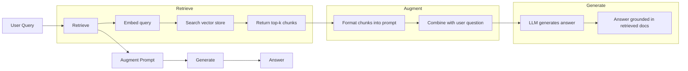
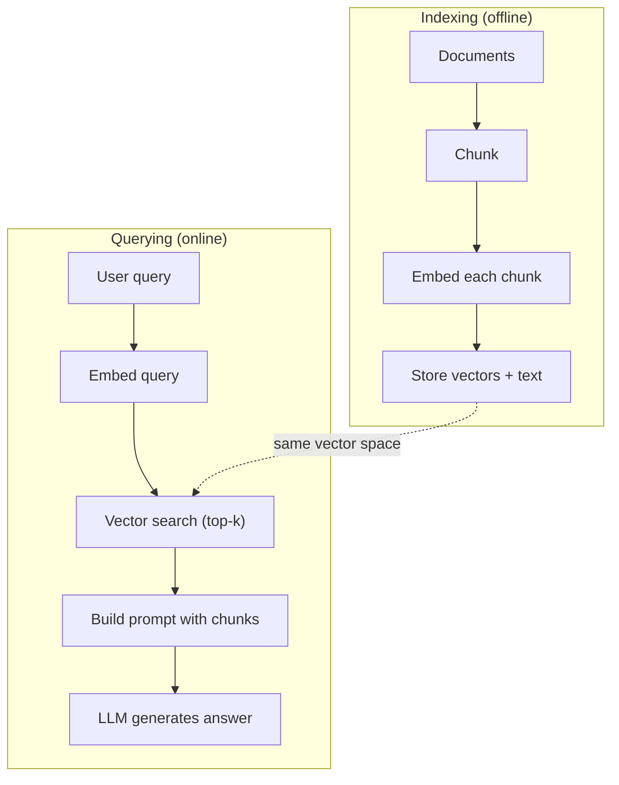

# RAG：检索增强生成

> 你的 LLM 知道训练截止日前的一切。它不知道你公司的 docs、你的 codebase，或上周的 meeting notes。RAG 通过检索相关 documents 并把它们塞进 prompt 来解决这个问题。它是生产 AI 中部署最多的模式。如果你只从本课程构建一个东西，请构建 RAG pipeline。

**类型：** Build
**语言：** Python
**先修：** Phase 10 (LLMs from Scratch), Phase 11 Lessons 01-05
**时间：** ~90 分钟
**相关：** Phase 5 · 23 (Chunking Strategies for RAG) 讲六种 chunking algorithms 以及各自何时胜出。Phase 5 · 22 (Embedding Models Deep Dive) 讲如何选择 embedder。Phase 11 · 07 (Advanced RAG) 讲 hybrid search、reranking 和 query transformation。

## 学习目标

- 构建完整 RAG pipeline：document loading、chunking、embedding、vector storage、retrieval 和 generation
- 使用 vector database（ChromaDB、FAISS 或 Pinecone）与合适 indexing 实现 semantic search
- 解释为什么在 knowledge-grounded applications 中，RAG 优于 fine-tuning（cost、freshness、attribution）
- 使用 retrieval metrics（precision、recall）和 generation metrics（faithfulness、relevance）评估 RAG quality

## 要解决的问题

你为公司构建 chatbot。客户问：“What's the refund policy for enterprise plans?” LLM 给出一段关于典型 SaaS refund policies 的通用回答。真实 policy 藏在一份 200 页 internal wiki 中：enterprise customers 有 60-day window，并且按比例退款。LLM 从未见过这份 document。它不可能知道没被训练过的内容。

Fine-tuning 是一种解决方案。拿 LLM，用你的 internal docs 训练它，并部署更新后的模型。这可行，但有严重问题。Fine-tuning 需要花费数千美元 compute。document 一变，模型立刻 stale。你无法知道模型答案来自哪个 source。如果公司下个月收购另一条 product line，你还得再 fine-tune 一次。

RAG 是另一种解决方案。保持模型不变。当问题到来时，搜索你的 document store 找到 relevant passages，把它们粘进问题前的 prompt 中，让模型把这些 passages 作为 context 来回答。document store 可以在几分钟内更新。你可以清楚看到哪些 documents 被 retrieved。模型本身从不改变。这就是 RAG 成为生产主导模式的原因：更便宜、更新鲜、更可审计，并且适用于任何 LLM。

## 核心概念

### The RAG Pattern

整个模式只有四步：



Query -> Retrieve -> Augment prompt -> Generate。每个 RAG system 都遵循这个模式。生产 RAG systems 的差异在每一步细节：如何 chunk、如何 embed、如何 search，以及如何构造 prompt。

### Why RAG Beats Fine-Tuning

| Concern | Fine-tuning | RAG |
|---------|------------|-----|
| Cost | $1,000-$100,000+ per training run | $0.01-$0.10 per query (embedding + LLM) |
| Freshness | Stale until retrained | Updated in minutes by re-indexing docs |
| Auditability | Cannot trace answer to source | Can show exact retrieved passages |
| Hallucination | Still hallucinates freely | Grounded in retrieved documents |
| Data privacy | Training data baked into weights | Documents stay in your vector store |

Fine-tuning 会永久改变模型 weights。RAG 会临时改变模型 context。对多数 applications，temporary context 正是你想要的。

fine-tuning 胜出的唯一情况：你需要模型采用某种 specific style、tone 或 reasoning pattern，而这种行为无法单靠 prompting 实现。对 factual knowledge retrieval 来说，RAG 每次都赢。

### Embedding Models

embedding model 把 text 转换成 dense vector。相似文本会在这个 high-dimensional space 中产生彼此接近的 vectors。“How do I reset my password?” 和 “I need to change my password” 虽然共享词很少，却会产生几乎相同的 vectors。“The cat sat on the mat” 会产生非常不同的 vector。

常见 embedding models（2026 lineup——完整分析见 Phase 5 · 22）：

| Model | Dimensions | Provider | Notes |
|-------|-----------|----------|-------|
| text-embedding-3-small | 1536 (Matryoshka) | OpenAI | Best price/performance for most use cases |
| text-embedding-3-large | 3072 (Matryoshka) | OpenAI | Higher accuracy, truncatable to 256/512/1024 |
| Gemini Embedding 2 | 3072 (Matryoshka) | Google | Top MTEB retrieval; 8K context |
| voyage-4 | 1024/2048 (Matryoshka) | Voyage AI | Domain variants (code, finance, law) |
| Cohere embed-v4 | 1024 (Matryoshka) | Cohere | Strong multilingual, 128K context |
| BGE-M3 | 1024 (dense + sparse + ColBERT) | BAAI (open-weight) | Three views from one model |
| Qwen3-Embedding | 4096 (Matryoshka) | Alibaba (open-weight) | Top open-weight retrieval score |
| all-MiniLM-L6-v2 | 384 | Open-weight (Sentence Transformers) | Prototyping baseline |

本课会用 TF-IDF 构建自己的 simple embedding。不是因为 TF-IDF 是生产系统使用的方式，而是因为它让概念变得具体：text goes in，vector comes out，similar texts produce similar vectors。

### Vector Similarity

给定两个 vectors，如何衡量 similarity？三种选项：

**Cosine similarity**：两个 vectors 夹角的 cosine。范围从 -1（相反）到 1（相同）。忽略 magnitude，只关心 direction。这是 RAG 默认选择。

```text
cosine_sim(a, b) = dot(a, b) / (||a|| * ||b||)
```

**Dot product**：raw inner product。更大的 vectors 会得到更高 scores。当 magnitude 携带信息时有用（更长 documents 可能更相关）。

```text
dot(a, b) = sum(a_i * b_i)
```

**L2 (Euclidean) distance**：vector space 中的直线距离。距离越小越相似。对 magnitude differences 敏感。

```text
L2(a, b) = sqrt(sum((a_i - b_i)^2))
```

Cosine similarity 是标准。它通过按 magnitude normalizing，优雅地处理不同长度 documents。有人说 “vector search” 时，几乎总是指 cosine similarity。

### Chunking Strategies

Documents 太长，不能作为 single vectors embedding。一个 50 页 PDF 可能产生糟糕 embedding，因为它包含几十个 topics。相反，你要把 documents 切成 chunks，并分别 embed 每个 chunk。

**Fixed-size chunking**：每 N tokens 切一次。简单且可预测。512-token chunk 加 50-token overlap 意味着 chunk 1 是 tokens 0-511，chunk 2 是 tokens 462-973，以此类推。overlap 确保你不会在倒霉边界切断 sentence。

**Semantic chunking**：在自然 boundaries 切分。Paragraphs、sections 或 markdown headers。每个 chunk 都是 coherent unit of meaning。实现更复杂，但 retrieval 更好。

**Recursive chunking**：先尝试按最大 boundary 切分（section headers）。如果 section 仍然太大，就按 paragraph boundaries 切。如果 paragraph 仍然太大，就按 sentence boundaries 切。这是 LangChain RecursiveCharacterTextSplitter approach，实践中效果很好。

Chunk size 比很多人想的更重要：

- 太小（64-128 tokens）：每个 chunk 缺少 context。“It increased 15% last quarter” 如果不知道 “it” 指什么，就没有意义。
- 太大（2048+ tokens）：每个 chunk 覆盖多个 topics，稀释 relevance。当你搜索 revenue data 时，会得到一个 10% 关于 revenue、90% 关于 headcount 的 chunk。
- 甜蜜点（256-512 tokens）：context 足够自包含，同时 focused enough to be relevant。

多数生产 RAG systems 使用 256-512 token chunks，并配 50-token overlap。Anthropic 的 RAG guidelines 推荐这个范围。

### Vector Databases

有了 embeddings 后，你需要地方存储和搜索它们。选项：

| Database | Type | Best for |
|----------|------|----------|
| FAISS | Library (in-process) | Prototyping, small to medium datasets |
| Chroma | Lightweight DB | Local development, small deployments |
| Pinecone | Managed service | Production without ops overhead |
| Weaviate | Open source DB | Self-hosted production |
| pgvector | Postgres extension | Already using Postgres |
| Qdrant | Open source DB | High-performance self-hosted |

本课会构建简单 in-memory vector store。它把 vectors 存在 list 中，并做 brute-force cosine similarity search。这相当于带 flat index 的 FAISS。在变慢前，它大概能扩展到 100,000 vectors。生产系统使用 HNSW 等 approximate nearest neighbor（ANN）algorithms，在毫秒内搜索数百万 vectors。

### The Full Pipeline



indexing phase 对每个 document 运行一次（或在 documents 更新时运行）。querying phase 在每次 user request 上运行。生产中，indexing 可能要在数小时内处理数百万 documents。querying 必须在一秒内响应。

### Real Numbers

多数生产 RAG systems 使用这些参数：

- **k = 5 to 10** retrieved chunks per query
- **Chunk size = 256 to 512 tokens** with 50-token overlap
- **Context budget**：每次 query 2,500-5,000 tokens retrieved content
- **Total prompt**：~8,000-16,000 tokens（system prompt + retrieved chunks + conversation history + user query）
- **Embedding dimension**：384-3072，取决于 model
- **Indexing throughput**：使用 API embeddings 时每秒 100-1,000 documents
- **Query latency**：retrieval 50-200ms，generation 500-3000ms

## 动手实现

### Step 1: Document Chunking

```python
def chunk_text(text, chunk_size=200, overlap=50):
    words = text.split()
    chunks = []
    start = 0
    while start < len(words):
        end = start + chunk_size
        chunk = " ".join(words[start:end])
        chunks.append(chunk)
        start += chunk_size - overlap
    return chunks
```

### Step 2: TF-IDF Embeddings

我们构建一个 simple embedding function。TF-IDF（Term Frequency-Inverse Document Frequency）不是 neural embedding，但它能用捕捉 word importance 的方式把 text 转成 vectors。某个 document 中频繁出现的 words 有更高 TF。整个 corpus 中罕见的 words 有更高 IDF。二者乘积生成一个 vector，让重要且独特的 words 拥有高 values。

```python
import math
from collections import Counter

def build_vocabulary(documents):
    vocab = set()
    for doc in documents:
        vocab.update(doc.lower().split())
    return sorted(vocab)

def compute_tf(text, vocab):
    words = text.lower().split()
    count = Counter(words)
    total = len(words)
    return [count.get(word, 0) / total for word in vocab]

def compute_idf(documents, vocab):
    n = len(documents)
    idf = []
    for word in vocab:
        doc_count = sum(1 for doc in documents if word in doc.lower().split())
        idf.append(math.log((n + 1) / (doc_count + 1)) + 1)
    return idf

def tfidf_embed(text, vocab, idf):
    tf = compute_tf(text, vocab)
    return [t * i for t, i in zip(tf, idf)]
```

### Step 3: Cosine Similarity Search

```python
def cosine_similarity(a, b):
    dot = sum(x * y for x, y in zip(a, b))
    norm_a = math.sqrt(sum(x * x for x in a))
    norm_b = math.sqrt(sum(x * x for x in b))
    if norm_a == 0 or norm_b == 0:
        return 0.0
    return dot / (norm_a * norm_b)

def search(query_embedding, stored_embeddings, top_k=5):
    scores = []
    for i, emb in enumerate(stored_embeddings):
        sim = cosine_similarity(query_embedding, emb)
        scores.append((i, sim))
    scores.sort(key=lambda x: x[1], reverse=True)
    return scores[:top_k]
```

### Step 4: Prompt Construction

这就是 RAG 中 “augmented” 发生的位置。取 retrieved chunks，把它们格式化进 prompt，并要求 LLM 基于提供的 context 回答。

```python
def build_rag_prompt(query, retrieved_chunks):
    context = "\n\n---\n\n".join(
        f"[Source {i+1}]\n{chunk}"
        for i, chunk in enumerate(retrieved_chunks)
    )
    return f"""Answer the question based ONLY on the following context.
If the context doesn't contain enough information, say "I don't have enough information to answer that."

Context:
{context}

Question: {query}

Answer:"""
```

### Step 5: The Complete RAG Pipeline

```python
class RAGPipeline:
    def __init__(self):
        self.chunks = []
        self.embeddings = []
        self.vocab = []
        self.idf = []

    def index(self, documents):
        all_chunks = []
        for doc in documents:
            all_chunks.extend(chunk_text(doc))
        self.chunks = all_chunks
        self.vocab = build_vocabulary(all_chunks)
        self.idf = compute_idf(all_chunks, self.vocab)
        self.embeddings = [
            tfidf_embed(chunk, self.vocab, self.idf)
            for chunk in all_chunks
        ]

    def query(self, question, top_k=5):
        query_emb = tfidf_embed(question, self.vocab, self.idf)
        results = search(query_emb, self.embeddings, top_k)
        retrieved = [(self.chunks[i], score) for i, score in results]
        prompt = build_rag_prompt(
            question, [chunk for chunk, _ in retrieved]
        )
        return prompt, retrieved
```

### Step 6: Generation (simulated)

生产中，这里会调用 LLM API。本课中，我们通过从 retrieved context 中提取最相关 sentence 来模拟 generation。

```python
def simple_generate(prompt, retrieved_chunks):
    query_words = set(prompt.lower().split("question:")[-1].split())
    best_sentence = ""
    best_score = 0
    for chunk in retrieved_chunks:
        for sentence in chunk.split("."):
            sentence = sentence.strip()
            if not sentence:
                continue
            words = set(sentence.lower().split())
            overlap = len(query_words & words)
            if overlap > best_score:
                best_score = overlap
                best_sentence = sentence
    return best_sentence if best_sentence else "I don't have enough information."
```

## 实际使用

使用真实 embedding model 和 LLM 时，代码几乎不变：

```python
from openai import OpenAI

client = OpenAI()

def embed(text):
    response = client.embeddings.create(
        model="text-embedding-3-small",
        input=text
    )
    return response.data[0].embedding

def generate(prompt):
    response = client.chat.completions.create(
        model="gpt-4o-mini",
        messages=[{"role": "user", "content": prompt}],
        temperature=0
    )
    return response.choices[0].message.content
```

或使用 Anthropic：

```python
import anthropic

client = anthropic.Anthropic()

def generate(prompt):
    response = client.messages.create(
        model="claude-sonnet-4-20250514",
        max_tokens=1024,
        messages=[{"role": "user", "content": prompt}]
    )
    return response.content[0].text
```

pipeline 是相同的。替换 embedding function。替换 generation function。retrieval logic、chunking、prompt construction——无论你使用哪些模型，它们都完全相同。

要做 scale 上的 vector storage，可以把 brute-force search 换成 proper vector database：

```python
import chromadb

client = chromadb.Client()
collection = client.create_collection("my_docs")

collection.add(
    documents=chunks,
    ids=[f"chunk_{i}" for i in range(len(chunks))]
)

results = collection.query(
    query_texts=["What is the refund policy?"],
    n_results=5
)
```

Chroma 会在内部处理 embedding（默认使用 all-MiniLM-L6-v2），并把 vectors 存储在 local database 中。同样模式，不同 plumbing。

## 交付成果

本课产出：
- `outputs/prompt-rag-architect.md`——一个 prompt，用于为特定 use cases 设计 RAG systems
- `outputs/skill-rag-pipeline.md`——一个 skill，教 agents 如何构建和调试 RAG pipelines

## 练习

1. 用 simple bag-of-words approach（binary：word 出现则 1，否则 0）替换 TF-IDF embeddings。在 sample documents 上比较 retrieval quality。TF-IDF 应该更好，因为它给 rare words 更高权重。

2. 试验 chunk sizes：在同一 document set 上尝试 50、100、200、500 words。每个 size 下运行相同 5 个 queries，并统计 top-3 中有多少返回 relevant chunk。找到 retrieval quality 峰值所在的 sweet spot。

3. 为每个 chunk 添加 metadata（source document name、chunk position）。修改 prompt template 以包含 source attribution，让 LLM cite sources。

4. 实现一个简单 evaluation：给定 10 个 question-answer pairs，让每个 question 通过 RAG pipeline，并测量 retrieved chunks 中包含答案的百分比。这就是 retrieval recall at k。

5. 构建 conversation-aware RAG pipeline：维护最近 3 轮 exchanges 的 history，并把它们和 retrieved chunks 一起放入 prompt。用 follow-up questions 测试，例如在问过 pricing 后问 “What about enterprise?”。

## 关键术语

| Term | What people say | What it actually means |
|------|----------------|----------------------|
| RAG | “AI that reads your docs” | Retrieve relevant documents，把它们粘进 prompt，并生成 grounded in those documents 的 answer |
| Embedding | “Convert text to numbers” | text 的 dense vector representation，其中 similar meanings 产生 similar vectors |
| Vector database | “Search engine for AI” | 针对存储 vectors 并按 similarity 查找 nearest neighbors 优化的数据存储 |
| Chunking | “Split docs into pieces” | 把 documents 拆成更小 segments（通常 256-512 tokens），让每段可以独立 embedded 和 retrieved |
| Cosine similarity | “How similar are two vectors” | 两个 vectors 夹角的 cosine；1 = identical direction，0 = orthogonal，-1 = opposite |
| Top-k retrieval | “Get the k best matches” | 从 vector store 返回与 query 最相似的 k 个 chunks |
| Context window | “How much text the LLM can see” | LLM 在 single request 中可处理的最大 tokens 数；retrieved chunks 必须放得进去 |
| Augmented generation | “Answer using given context” | 使用 retrieved documents 作为 context 生成 response，而不是只依赖 trained knowledge |
| TF-IDF | “Word importance scoring” | Term Frequency 乘以 Inverse Document Frequency；按 words 在 corpus 中的 distinctive 程度加权 |
| Indexing | “Preparing docs for search” | offline process：chunking、embedding、storing documents，让它们可在 query time 被搜索 |

## 延伸阅读

- Lewis et al., "Retrieval-Augmented Generation for Knowledge-Intensive NLP Tasks" (2020)——Facebook AI Research 的原始 RAG 论文，形式化了 retrieve-then-generate pattern
- Anthropic's RAG documentation (docs.anthropic.com)——chunk sizes、prompt construction 和 evaluation 的实践指南
- Pinecone Learning Center, "What is RAG?"——对 RAG pipeline 的清晰可视化解释，并包含 production considerations
- Sentence-BERT: Reimers & Gurevych (2019)——all-MiniLM embedding models 背后的论文，展示如何为 semantic similarity 训练 bi-encoders
- [Karpukhin et al., "Dense Passage Retrieval for Open-Domain Question Answering" (EMNLP 2020)](https://arxiv.org/abs/2004.04906)——DPR 论文，证明 dense bi-encoder retrieval 在 open-domain QA 上胜过 BM25，并奠定现代 RAG retrievers 的模式
- [LlamaIndex High-Level Concepts](https://docs.llamaindex.ai/en/stable/getting_started/concepts.html)——构建 RAG pipelines 时要知道的核心概念：data loaders、node parsers、indices、retrievers、response synthesizers
- [LangChain RAG tutorial](https://python.langchain.com/docs/tutorials/rag/)——另一种风格的 orchestrator；用 chain-of-runnables 视角看同一个 retrieve-then-generate pattern
