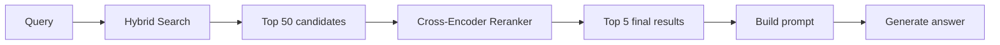
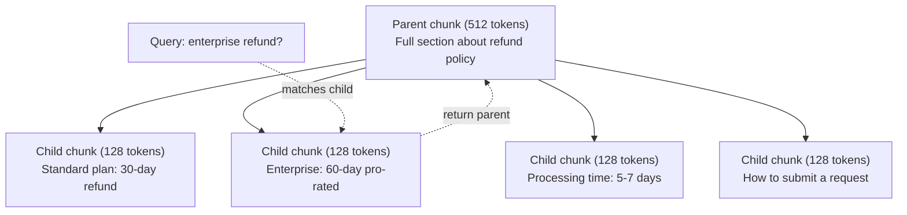
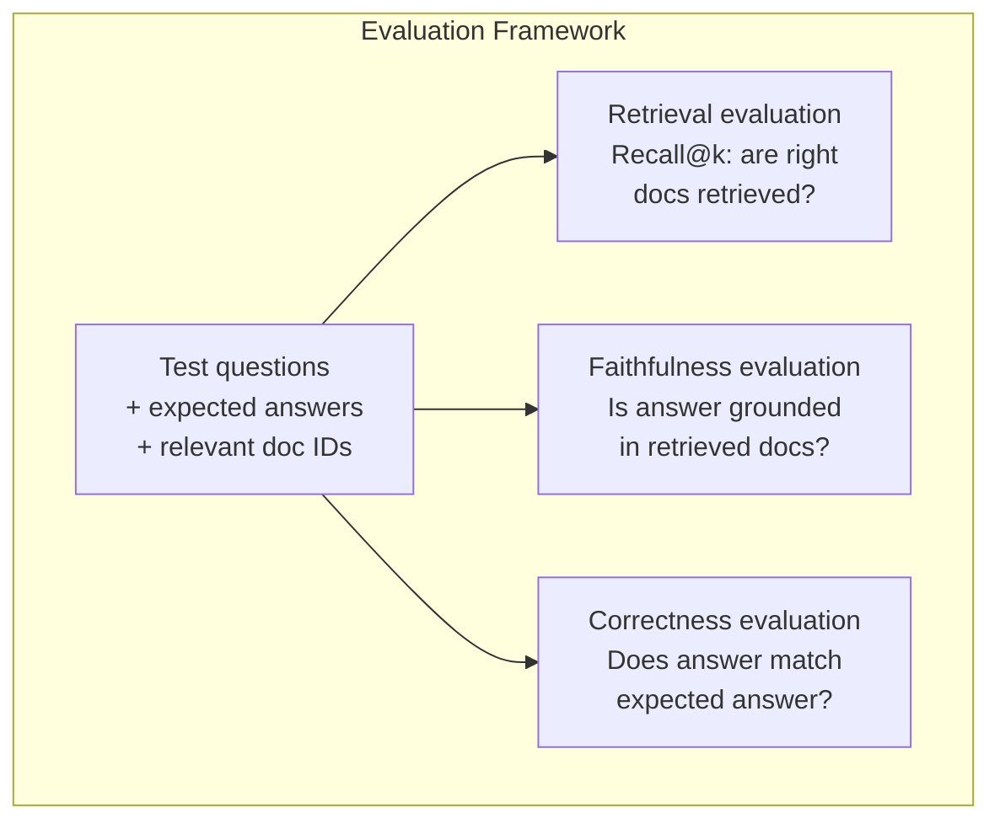

# 高级 RAG（分块、重排、混合搜索）

> 基础 RAG 会检索相似度最高的 top-k 个 chunk。它适合简单问题，却会在多跳推理、含糊查询和大规模语料中崩塌。高级 RAG 区分了能在 10 份文档上跑通的 demo，和能在 1000 万份文档上工作的系统。

**类型：** Build
**语言：** Python
**先修：** Phase 11, Lesson 06 (RAG)
**时间：** ~90 minutes
**相关：** Phase 5 · 23 (Chunking Strategies for RAG) 覆盖全部六种分块算法：recursive、semantic、sentence、parent-document、late chunking、contextual retrieval，并包含 Vectara/Anthropic benchmark。本课在此之上继续构建：hybrid search、reranking、query transformation。

## 学习目标

- 实现能保留文档结构和上下文的高级分块策略（semantic、recursive、parent-child）
- 构建结合 BM25 关键词匹配、语义向量搜索和 cross-encoder reranker 的混合搜索流水线
- 应用查询转换技术（HyDE、multi-query、step-back），提升含糊或复杂问题的检索效果
- 诊断并修复常见 RAG 失败：取回错误 chunk、答案不在上下文中、多跳推理崩溃

## 要解决的问题

你在 Lesson 06 构建了一个基础 RAG 流水线。它在小语料上的直接问题里表现不错。现在试试这些：

**含糊查询**："What was revenue last quarter?" 语义搜索会返回关于收入策略、收入预测、以及 CFO 对收入增长看法的 chunk。它们都与 "revenue" 这个词语义相近，却都不包含真实数字。正确 chunk 写的是 "$47.2M in Q3 2025"，但使用了 "earnings" 而不是 "revenue"。embedding model 认为 "revenue strategy" 比 "Q3 earnings were $47.2M" 更接近查询。

**多跳问题**："Which team had the highest customer satisfaction score improvement?" 这需要找到每个团队的满意度分数、进行比较，并识别最大值。没有单个 chunk 包含答案，信息散落在各个团队报告中。

**大规模语料问题**：你有 200 万个 chunk。正确答案在 chunk #1,847,293。你的 top-5 检索拿到了 chunk #14、#89,201、#1,200,000、#44 和 #901,333。它们在 embedding space 中接近，但都不包含答案。在这个规模下，approximate nearest neighbor search 会引入足够误差，把相关结果挤出 top-k。

基础 RAG 失败，是因为向量相似度不等于相关性。一个 chunk 可以与查询语义相似，却对回答问题没有用。高级 RAG 用四种技术解决这个问题：hybrid search（加入关键词匹配）、reranking（更仔细地给候选打分）、query transformation（搜索前修正查询）和更好的 chunking（以合适粒度检索）。

## 核心概念

### Hybrid Search：语义 + 关键词

语义搜索（vector similarity）擅长理解含义。"How do I cancel my subscription?" 即使与 "Steps to terminate your plan" 没有共同词，也能匹配上。但它会漏掉精确匹配。"Error code E-4021" 可能匹配不到包含 "E-4021" 的 chunk，因为 embedding model 可能把它当作噪声。

关键词搜索（BM25）正好相反。它擅长精确匹配。"E-4021" 会完美匹配。但如果文档写的是 "terminate your plan"，"cancel my subscription" 就会返回零结果。

Hybrid search 同时运行两者，然后合并结果。

**BM25**（Best Matching 25）是标准关键词搜索算法。自 20 世纪 90 年代以来，它一直是搜索引擎的支柱。公式如下：

```text
BM25(q, d) = sum over terms t in q:
    IDF(t) * (tf(t,d) * (k1 + 1)) / (tf(t,d) + k1 * (1 - b + b * |d| / avgdl))
```

其中 tf(t,d) 是词项 t 在文档 d 中的词频，IDF(t) 是逆文档频率，|d| 是文档长度，avgdl 是平均文档长度，k1 控制词频饱和（默认 1.2），b 控制长度归一化（默认 0.75）。

通俗地说：BM25 会在文档包含查询词（尤其是稀有词）时给更高分，但重复词带来的收益会递减。一个包含 "revenue" 50 次的文档，并不会比只包含 1 次的文档相关 50 倍。

### Reciprocal Rank Fusion (RRF)

你有两个排序列表：一个来自向量搜索，一个来自 BM25。怎样合并它们？Reciprocal Rank Fusion 是标准做法。

```text
RRF_score(d) = sum over rankings R:
    1 / (k + rank_R(d))
```

其中 k 是常数（通常为 60），用于防止排名第一的结果支配一切。

一个文档在向量搜索中排名 #1、在 BM25 中排名 #5，会得到：1/(60+1) + 1/(60+5) = 0.0164 + 0.0154 = 0.0318

一个文档在向量搜索中排名 #3、在 BM25 中排名 #2，会得到：1/(60+3) + 1/(60+2) = 0.0159 + 0.0161 = 0.0320

RRF 会自然平衡这两个信号。一个在两个列表中都排名靠前的文档会得到最高分。一个只在某个列表中排名 #1、在另一个列表中缺失的文档会得到中等分数。它很稳健，因为它使用排名而不是原始分数，所以两个系统之间分数分布差异并不重要。

### Reranking

检索（无论是向量、关键词还是混合）速度快但不精确。它使用 bi-encoder：查询和每个文档独立 embedding，然后再比较。embedding 会提前计算并缓存，因此可以扩展到数百万文档。

Reranking 使用 cross-encoder：把查询和候选文档一起送入模型，输出相关性分数。模型能同时看到两段文本，因此可以捕捉它们之间的细粒度交互。cross-encoder 能理解 "What were Q3 earnings?" 与包含 "$47.2M in Q3" 的 chunk 高度相关，即使 bi-encoder 漏掉了这种联系。

取舍是：cross-encoder 比 bi-encoder 慢 100-1000 倍，因为它要联合处理 query-document pair。你不能为 100 万份文档预先计算 cross-encoder 分数。解决方案是：先从 hybrid search 取回更大的候选集（top-50），再用 cross-encoder 重排得到最终 top-5。



常见 reranking model（2026 阵容）：
- Cohere Rerank 3.5：managed API，多语言，在混合语料上 recall gain 最好
- Voyage rerank-2.5：managed API，托管选项中延迟最低
- Jina-Reranker-v2 Multilingual：open-weight，支持 100+ 语言
- bge-reranker-v2-m3：open-weight，强 baseline
- cross-encoder/ms-marco-MiniLM-L-6-v2：open-weight，可在 CPU 上用于原型
- ColBERTv2 / Jina-ColBERT-v2：late-interaction multi-vector reranker，打分时是 O(tokens) 而不是 O(docs)

### Query Transformation

有时问题不在检索，而在查询本身。"What was that thing about the new policy change?" 是一个很差的搜索查询。它没有具体词项，embedding 很模糊。任何检索系统都很难据此找到正确文档。

**Query rewriting**：把用户查询改写成更好的搜索查询。LLM 可以做到：

```text
User: "What was that thing about the new policy change?"
Rewritten: "Recent policy changes and updates"
```

**HyDE（Hypothetical Document Embeddings）**：不直接用查询搜索，而是先生成一个假想答案，embedding 这个答案，再搜索与它相似的真实文档。

```text
Query: "What is the refund policy for enterprise?"
Hypothetical answer: "Enterprise customers are eligible for a full refund
within 60 days of purchase. Refunds are pro-rated based on the remaining
subscription period and processed within 5-7 business days."
```

对假想答案做 embedding，再搜索与它相似的真实文档。直觉是：假想答案在 embedding space 中比原始问题更接近真实答案。问题和答案有不同的语言结构。通过生成一个假想答案，你在 embedding 中弥合了 "question space" 和 "answer space" 的差距。

HyDE 会在检索前增加一次 LLM 调用。这会增加 500-2000ms 延迟。当原始查询的检索质量很差时，这个代价值得付出。

### Parent-Child Chunking

标准分块会迫使你在两者之间取舍：小 chunk 用于精确检索，大 chunk 用于提供足够上下文。Parent-child chunking 消除了这种取舍。

索引小 chunk（128 tokens）用于检索。当一个小 chunk 被取回时，把它的 parent chunk（512 tokens）返回给 prompt。小 chunk 精准匹配查询。parent chunk 为 LLM 生成好答案提供足够上下文。



查询 "enterprise refund?" 会精准匹配 child chunk C2。但 prompt 接收到完整的 parent chunk P，其中包含关于处理时间和提交流程的周边上下文。

### Metadata Filtering

运行向量搜索前，先按 metadata 过滤语料：日期、来源、类别、作者、语言。这会减少搜索空间并防止无关结果。

"What changed in the security policy last month?" 应该只搜索最近 30 天、security 类别的文档。没有 metadata filtering 时，你会搜索整套语料，并可能取回一份 2 年前、只是语义相似的 security 文档。

生产 RAG 系统会把 metadata 和每个 chunk 一起存储：源文档、创建日期、类别、作者、版本。Vector database 支持在 similarity search 前按 metadata 预过滤，这对大规模性能至关重要。

### 评估

你构建了一个 RAG 系统。怎么知道它是否有效？三个指标：

**Retrieval relevance (Recall@k)**：对于一组有已知相关文档的测试问题，相关文档有多大比例出现在 top-k 结果中？如果某个问题的答案在 chunk #47，那么 chunk #47 是否出现在 top-5 中？

**Faithfulness**：生成答案是否扎根于检索到的文档？如果取回的 chunk 写的是 "60-day refund window"，模型却说 "90-day refund window"，这就是 faithfulness failure。尽管有正确上下文，模型仍然幻觉了。

**Answer correctness**：生成答案是否匹配期望答案？这是端到端指标，结合了检索质量和生成质量。

一个简单的 faithfulness 检查：取生成答案里的每条声明，验证它是否（实质上）出现在取回的 chunk 中。如果答案包含任何取回 chunk 中不存在的事实，它就很可能是幻觉。



## 动手实现

### Step 1: BM25 Implementation

```python
import math
from collections import Counter

class BM25:
    def __init__(self, k1=1.2, b=0.75):
        self.k1 = k1
        self.b = b
        self.docs = []
        self.doc_lengths = []
        self.avg_dl = 0
        self.doc_freqs = {}
        self.n_docs = 0

    def index(self, documents):
        self.docs = documents
        self.n_docs = len(documents)
        self.doc_lengths = []
        self.doc_freqs = {}

        for doc in documents:
            words = doc.lower().split()
            self.doc_lengths.append(len(words))
            unique_words = set(words)
            for word in unique_words:
                self.doc_freqs[word] = self.doc_freqs.get(word, 0) + 1

        self.avg_dl = sum(self.doc_lengths) / self.n_docs if self.n_docs else 1

    def score(self, query, doc_idx):
        query_words = query.lower().split()
        doc_words = self.docs[doc_idx].lower().split()
        doc_len = self.doc_lengths[doc_idx]
        word_counts = Counter(doc_words)
        score = 0.0

        for term in query_words:
            if term not in word_counts:
                continue
            tf = word_counts[term]
            df = self.doc_freqs.get(term, 0)
            idf = math.log((self.n_docs - df + 0.5) / (df + 0.5) + 1)
            numerator = tf * (self.k1 + 1)
            denominator = tf + self.k1 * (1 - self.b + self.b * doc_len / self.avg_dl)
            score += idf * numerator / denominator

        return score

    def search(self, query, top_k=10):
        scores = [(i, self.score(query, i)) for i in range(self.n_docs)]
        scores.sort(key=lambda x: x[1], reverse=True)
        return scores[:top_k]
```

### Step 2: Reciprocal Rank Fusion

```python
def reciprocal_rank_fusion(ranked_lists, k=60):
    scores = {}
    for ranked_list in ranked_lists:
        for rank, (doc_id, _) in enumerate(ranked_list):
            if doc_id not in scores:
                scores[doc_id] = 0.0
            scores[doc_id] += 1.0 / (k + rank + 1)
    fused = sorted(scores.items(), key=lambda x: x[1], reverse=True)
    return fused
```

### Step 3: Hybrid Search Pipeline

```python
def hybrid_search(query, chunks, vector_embeddings, vocab, idf, bm25_index, top_k=5, fusion_k=60):
    query_emb = tfidf_embed(query, vocab, idf)
    vector_results = search(query_emb, vector_embeddings, top_k=top_k * 3)
    bm25_results = bm25_index.search(query, top_k=top_k * 3)
    fused = reciprocal_rank_fusion([vector_results, bm25_results], k=fusion_k)
    return fused[:top_k]
```

### Step 4: Simple Reranker

生产环境中，你会使用 cross-encoder model。这里我们构建一个 reranker，用词重叠、词项重要性和短语匹配来给 query-document relevance 打分。

```python
def rerank(query, candidates, chunks):
    query_words = set(query.lower().split())
    stop_words = {"the", "a", "an", "is", "are", "was", "were", "what", "how",
                  "why", "when", "where", "do", "does", "for", "of", "in", "to",
                  "and", "or", "on", "at", "by", "it", "its", "this", "that",
                  "with", "from", "be", "has", "have", "had", "not", "but"}
    query_terms = query_words - stop_words

    scored = []
    for doc_id, initial_score in candidates:
        chunk = chunks[doc_id].lower()
        chunk_words = set(chunk.split())

        term_overlap = len(query_terms & chunk_words)

        query_bigrams = set()
        q_list = [w for w in query.lower().split() if w not in stop_words]
        for i in range(len(q_list) - 1):
            query_bigrams.add(q_list[i] + " " + q_list[i + 1])
        bigram_matches = sum(1 for bg in query_bigrams if bg in chunk)

        position_boost = 0
        for term in query_terms:
            pos = chunk.find(term)
            if pos != -1 and pos < len(chunk) // 3:
                position_boost += 0.5

        rerank_score = (
            term_overlap * 1.0
            + bigram_matches * 2.0
            + position_boost
            + initial_score * 5.0
        )
        scored.append((doc_id, rerank_score))

    scored.sort(key=lambda x: x[1], reverse=True)
    return scored
```

### Step 5: HyDE (Hypothetical Document Embeddings)

```python
def hyde_generate_hypothesis(query):
    templates = {
        "what": "The answer to '{query}' is as follows: Based on our documentation, {topic} involves specific policies and procedures that define how the process works.",
        "how": "To address '{query}': The process involves several steps. First, you need to initiate the request. Then, the system processes it according to the defined rules.",
        "default": "Regarding '{query}': Our records indicate specific details and policies related to this topic that provide a comprehensive answer."
    }
    query_lower = query.lower()
    if query_lower.startswith("what"):
        template = templates["what"]
    elif query_lower.startswith("how"):
        template = templates["how"]
    else:
        template = templates["default"]

    topic_words = [w for w in query.lower().split()
                   if w not in {"what", "is", "the", "how", "do", "does", "a", "an",
                                "for", "of", "to", "in", "on", "at", "by", "and", "or"}]
    topic = " ".join(topic_words) if topic_words else "this topic"

    return template.format(query=query, topic=topic)


def hyde_search(query, chunks, vector_embeddings, vocab, idf, top_k=5):
    hypothesis = hyde_generate_hypothesis(query)
    hypothesis_emb = tfidf_embed(hypothesis, vocab, idf)
    results = search(hypothesis_emb, vector_embeddings, top_k)
    return results, hypothesis
```

### Step 6: Parent-Child Chunking

```python
def create_parent_child_chunks(text, parent_size=200, child_size=50):
    words = text.split()
    parents = []
    children = []
    child_to_parent = {}

    parent_idx = 0
    start = 0
    while start < len(words):
        parent_end = min(start + parent_size, len(words))
        parent_text = " ".join(words[start:parent_end])
        parents.append(parent_text)

        child_start = start
        while child_start < parent_end:
            child_end = min(child_start + child_size, parent_end)
            child_text = " ".join(words[child_start:child_end])
            child_idx = len(children)
            children.append(child_text)
            child_to_parent[child_idx] = parent_idx
            child_start += child_size

        parent_idx += 1
        start += parent_size

    return parents, children, child_to_parent
```

### Step 7: Faithfulness Evaluation

```python
def evaluate_faithfulness(answer, retrieved_chunks):
    answer_sentences = [s.strip() for s in answer.split(".") if len(s.strip()) > 10]
    if not answer_sentences:
        return 1.0, []

    grounded = 0
    ungrounded = []
    context = " ".join(retrieved_chunks).lower()

    for sentence in answer_sentences:
        words = set(sentence.lower().split())
        stop_words = {"the", "a", "an", "is", "are", "was", "were", "and", "or",
                      "to", "of", "in", "for", "on", "at", "by", "it", "this", "that"}
        content_words = words - stop_words
        if not content_words:
            grounded += 1
            continue

        matched = sum(1 for w in content_words if w in context)
        ratio = matched / len(content_words) if content_words else 0

        if ratio >= 0.5:
            grounded += 1
        else:
            ungrounded.append(sentence)

    score = grounded / len(answer_sentences) if answer_sentences else 1.0
    return score, ungrounded


def evaluate_retrieval_recall(queries_with_relevant, retrieval_fn, k=5):
    total_recall = 0.0
    results = []

    for query, relevant_indices in queries_with_relevant:
        retrieved = retrieval_fn(query, k)
        retrieved_indices = set(idx for idx, _ in retrieved)
        relevant_set = set(relevant_indices)
        hits = len(retrieved_indices & relevant_set)
        recall = hits / len(relevant_set) if relevant_set else 1.0
        total_recall += recall
        results.append({
            "query": query,
            "recall": recall,
            "hits": hits,
            "total_relevant": len(relevant_set)
        })

    avg_recall = total_recall / len(queries_with_relevant) if queries_with_relevant else 0
    return avg_recall, results
```

## 实际使用

使用真实 cross-encoder 做 reranking：

```python
from sentence_transformers import CrossEncoder

reranker = CrossEncoder("cross-encoder/ms-marco-MiniLM-L-6-v2")

def rerank_with_cross_encoder(query, candidates, chunks, top_k=5):
    pairs = [(query, chunks[doc_id]) for doc_id, _ in candidates]
    scores = reranker.predict(pairs)
    scored = list(zip([doc_id for doc_id, _ in candidates], scores))
    scored.sort(key=lambda x: x[1], reverse=True)
    return scored[:top_k]
```

使用 Cohere 的 managed reranker：

```python
import cohere

co = cohere.Client()

def rerank_with_cohere(query, candidates, chunks, top_k=5):
    docs = [chunks[doc_id] for doc_id, _ in candidates]
    response = co.rerank(
        model="rerank-english-v3.0",
        query=query,
        documents=docs,
        top_n=top_k
    )
    return [(candidates[r.index][0], r.relevance_score) for r in response.results]
```

使用真实 LLM 做 HyDE：

```python
import anthropic

client = anthropic.Anthropic()

def hyde_with_llm(query):
    response = client.messages.create(
        model="claude-sonnet-4-20250514",
        max_tokens=256,
        messages=[{
            "role": "user",
            "content": f"Write a short paragraph that would be a good answer to this question. Do not say you don't know. Just write what the answer would look like.\n\nQuestion: {query}"
        }]
    )
    return response.content[0].text
```

使用 Weaviate 做生产级 hybrid search：

```python
import weaviate

client = weaviate.connect_to_local()

collection = client.collections.get("Documents")
response = collection.query.hybrid(
    query="enterprise refund policy",
    alpha=0.5,
    limit=10
)
```

alpha 参数控制平衡：0.0 = 纯 keyword（BM25），1.0 = 纯 vector，0.5 = 等权。多数生产系统会使用 0.3 到 0.7 之间的 alpha。

## 交付成果

本课产出：
- `outputs/prompt-advanced-rag-debugger.md` -- 用于诊断并修复 RAG 质量问题的 prompt
- `outputs/skill-advanced-rag.md` -- 用于用 hybrid search 和 reranking 构建生产级 RAG 的 skill

## 练习

1. 在示例文档上比较 BM25、vector search 和 hybrid search。对 5 个测试查询中的每一个，记录哪种方法能在位置 #1 返回最相关 chunk。Hybrid search 应至少赢下 5 个中的 3 个。

2. 实现 metadata filter。给每个文档添加一个 "category" 字段（security、billing、api、product）。运行 vector search 前，把 chunk 过滤到相关类别。用 "What encryption is used?" 测试，并确认它只搜索 security-category chunk。

3. 使用 Lesson 06 的简单 generate 函数构建完整 HyDE 流水线。对全部 5 个测试查询，比较直接 query search 与 HyDE search 的检索质量（top-3 relevance）。HyDE 应该改善含糊查询的结果。

4. 在示例文档上实现 parent-child chunking 策略。使用 child_size=30 和 parent_size=100。用 child chunk 搜索，但在 prompt 中返回 parent chunk。将生成答案与 chunk_size=50 的标准分块进行比较。

5. 创建 evaluation dataset：10 个带已知答案 chunk 的问题。分别测量 (a) 仅 vector search、(b) 仅 BM25、(c) hybrid search、(d) hybrid + reranking 的 Recall@3、Recall@5 和 Recall@10。绘制结果，并识别 reranking 最有帮助的位置。

## 关键术语

| Term | What people say | What it actually means |
|------|----------------|----------------------|
| BM25 | "Keyword search" | 一种概率排序算法，按词频、逆文档频率和文档长度归一化为文档打分 |
| Hybrid search | "Best of both worlds" | 并行运行语义（vector）搜索和关键词（BM25）搜索，然后用 rank fusion 合并结果 |
| Reciprocal Rank Fusion | "Merge ranked lists" | 对每个文档跨所有列表求和 1/(k + rank)，从而组合多个排序列表 |
| Reranking | "Second pass scoring" | 使用更昂贵的 cross-encoder model 对初始检索得到的候选集重新打分 |
| Cross-encoder | "Joint query-document model" | 把 query 和 document 作为单个输入并产生相关性分数的模型；比 bi-encoder 更准确，但用于全语料搜索太慢 |
| Bi-encoder | "Independent embedding model" | 独立 embedding query 和 document 的模型；因为 embedding 可预计算所以很快，但不如 cross-encoder 准确 |
| HyDE | "Search with a fake answer" | 为查询生成一个假想答案，对它做 embedding，并搜索与它相似的真实文档 |
| Parent-child chunking | "Small search, big context" | 索引小 chunk 以实现精确检索，但返回更大的 parent chunk 以提供足够上下文 |
| Metadata filtering | "Narrow before searching" | 运行 vector search 前按属性（日期、来源、类别）过滤文档，以减少搜索空间 |
| Faithfulness | "Did it stay grounded" | 生成答案是否受到检索文档支持，而不是来自模型训练数据的幻觉 |

## 延伸阅读

- Robertson & Zaragoza, "The Probabilistic Relevance Framework: BM25 and Beyond" (2009) -- BM25 的权威参考，解释公式背后的概率基础
- Cormack et al., "Reciprocal Rank Fusion Outperforms Condorcet and Individual Rank Learning Methods" (2009) -- 原始 RRF 论文，展示它优于更复杂的融合方法
- Gao et al., "Precise Zero-Shot Dense Retrieval without Relevance Labels" (2022) -- HyDE 论文，证明 hypothetical document embeddings 无需训练数据也能提升检索
- Nogueira & Cho, "Passage Re-ranking with BERT" (2019) -- 展示在 BM25 之上使用 cross-encoder reranking 会显著提升检索质量
- [Khattab et al., "DSPy: Compiling Declarative Language Model Calls into Self-Improving Pipelines" (2023)](https://arxiv.org/abs/2310.03714) -- 把 prompt construction 和 weight selection 视为 retrieval pipeline 上的优化问题；读它是为了从 "prompt LLMs" 转向 "program LLMs."
- [Edge et al., "From Local to Global: A Graph RAG Approach to Query-Focused Summarization" (Microsoft Research 2024)](https://arxiv.org/abs/2404.16130) -- GraphRAG 论文：entity-relation extraction + Leiden community detection，用于 query-focused summarization；global vs local retrieval 的区别。
- [Asai et al., "Self-RAG: Learning to Retrieve, Generate, and Critique through Self-Reflection" (ICLR 2024)](https://arxiv.org/abs/2310.11511) -- 带 reflection tokens 的自评式 RAG；静态 retrieve-then-generate 之后的 agentic 前沿。
- [LangChain Query Construction blog](https://blog.langchain.dev/query-construction/) -- 如何把自然语言查询翻译成结构化数据库查询（Text-to-SQL、Cypher），作为预检索步骤。
