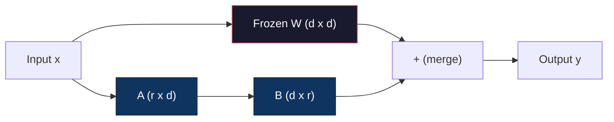
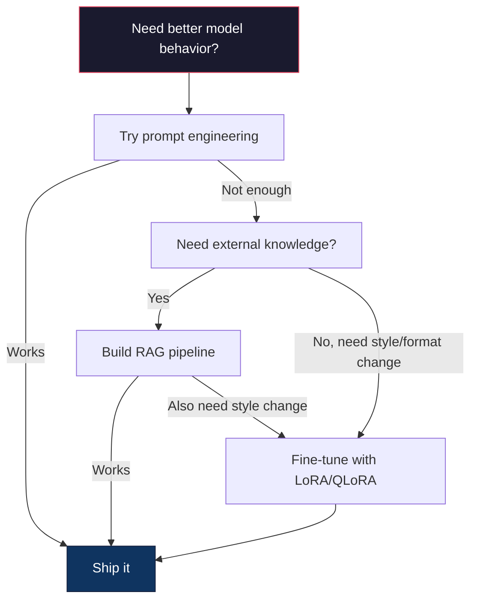

# 使用 LoRA 与 QLoRA 进行微调

> 对一个 7B 模型做 full fine-tuning 需要 56GB VRAM。你没有这么多。大多数公司也没有。LoRA 只训练不到 1% 的参数，就能让你在 6GB 显存里微调同一个模型。这不是妥协 -- 在多数任务上，它能匹配 full fine-tuning 的质量。整个开源微调生态都运行在这个技巧之上。

**类型：** Build
**语言：** Python
**先修：** Phase 10, Lesson 06 (Instruction Tuning / SFT)
**时间：** ~75 minutes
**相关：** Phase 10 从零覆盖 SFT/DPO loop。本课把那些 loop 接入 2026 年的 PEFT 工具链（PEFT、TRL、Unsloth、Axolotl、LLaMA-Factory）。

## 学习目标

- 通过向预训练模型的 attention layer 注入低秩 adapter matrix（A 和 B）来实现 LoRA
- 计算 LoRA 相比 full fine-tuning 节省的参数：rank r、d_model 维度时，训练 2*r*d 个参数，而不是 d^2 个参数
- 使用 QLoRA（4-bit 量化 base + LoRA adapter）微调模型，使其适配消费级 GPU 内存
- 将 LoRA weights 合并回 base model 用于部署，并比较有无 adapter 时的推理速度

## 要解决的问题

你有一个 base model。Llama 3 8B。你希望它用你公司的语气回答客服工单。SFT 是答案。但 SFT 有成本问题。

Full fine-tuning 会更新模型中的每一个参数。Llama 3 8B 有 80 亿参数。fp16 下每个参数占 2 字节。仅加载 weights 就需要 16GB。训练期间，你还需要 gradients（16GB）、Adam 的 optimizer states（momentum + variance 共 32GB）以及 activations。总计：单个 8B 模型大约需要 56GB VRAM。

A100 80GB 勉强能装下。云厂商上两张 A100 的价格是 $3-4/hour。在 50,000 个样本上训练 3 个 epoch 需要 6-10 小时。也就是每次实验 $30-40。为了调好 hyperparameters 跑 10 次实验，在部署任何东西之前你就花掉了 $400。

扩展到 Llama 3 70B，数字会变得荒唐。光 weights 就要 140GB。你需要一个集群。每次实验 $100+。

还有一个更深的问题。Full fine-tuning 会修改模型的每个 weight。如果你用客服数据微调，可能会损害模型的通用能力。这叫 catastrophic forgetting。模型在你的任务上变好，却在其他所有事情上变差。

你需要一种训练更少参数、使用更少内存、且不破坏模型既有知识的方法。

## 核心概念

### LoRA：Low-Rank Adaptation

Edward Hu 和 Microsoft 的同事在 2021 年 6 月发表了 LoRA。论文的洞见是：fine-tuning 期间的 weight updates 具有低 intrinsic rank。你不需要更新 4096x4096 weight matrix 中全部 1670 万个参数。更新里的有用信息可以由 rank 16 或 32 的矩阵捕捉。

数学如下。标准 linear layer 计算：

```text
y = Wx
```

其中 W 是 d_out x d_in 矩阵。对 4096x4096 attention projection 来说，这就是 16,777,216 个参数。

LoRA 冻结 W，并加入一个低秩分解：

```text
y = Wx + BAx
```

其中 B 是 (d_out x r)，A 是 (r x d_in)。rank r 远小于 d，通常为 8、16 或 32。

对 4096x4096 layer 使用 r=16：
- 原始参数：4096 x 4096 = 16,777,216
- LoRA 参数：(4096 x 16) + (16 x 4096) = 65,536 + 65,536 = 131,072
- 减少比例：131,072 / 16,777,216 = 0.78%

你只训练 0.78% 的参数，却获得 95-100% 的质量。



A 用随机 Gaussian 初始化。B 初始化为零。这意味着 LoRA contribution 从零开始，模型从原始行为开始训练，再逐渐学习 adaptation。

### Scaling Factor：Alpha

LoRA 引入 scaling factor alpha，用来控制低秩更新对输出的影响：

```text
y = Wx + (alpha / r) * BAx
```

当 alpha = r 时，scaling 是 1x。当 alpha = 2r（常见默认值）时，scaling 是 2x。这个 hyperparameter 独立于 base learning rate，控制 LoRA path 的学习率。

实践建议：
- alpha = 2 * rank 是常见社区约定（原始论文多数实验使用 alpha = rank）
- alpha = rank 给出 1x scaling，保守但稳定
- 更高 alpha 意味着每步更新更大，可能加快收敛，也可能导致不稳定

### LoRA 应用在哪里

Transformer 有许多 linear layer。你不需要给所有层都加 LoRA。原始论文测试了不同组合：

| Target Layers | Trainable Params (7B) | Quality |
|--------------|----------------------|---------|
| q_proj only | 4.7M | Good |
| q_proj + v_proj | 9.4M | Better |
| q_proj + k_proj + v_proj + o_proj | 18.9M | Best for attention |
| All linear (attention + MLP) | 37.7M | Marginal gain, 2x params |

多数任务的甜点区：q_proj + v_proj。这会瞄准 self-attention 中的 query 和 value projection，控制模型关注什么以及提取什么信息。为复杂任务（如代码生成）加入 MLP layer 会有帮助，但在更简单任务上收益递减，同时参数量翻倍。

### Rank Selection

rank r 控制 adaptation 的表达能力：

| Rank | Trainable Params (per layer) | Best For |
|------|---------------------------|----------|
| 4 | 32,768 | 简单分类、情感分析 |
| 8 | 65,536 | 单领域 Q&A、summarization |
| 16 | 131,072 | 多领域任务、instruction following |
| 32 | 262,144 | 复杂推理、代码生成 |
| 64 | 524,288 | 多数任务收益递减 |
| 128 | 1,048,576 | 很少有充分理由 |

Hu et al. 证明 r=4 已经能捕捉简单任务中的大部分 adaptation。实践中最常见的选择是 r=8 和 r=16。超过 r=64 很少提升质量，并开始失去 LoRA 的内存优势。

### QLoRA：4-Bit Quantization + LoRA

Tim Dettmers 和 University of Washington 的同事在 2023 年 5 月发表了 QLoRA。思路是：把冻结的 base model 量化到 4-bit precision，然后在其上附加 fp16 的 LoRA adapter。

这会大幅改变内存账：

| Method | Weight Memory (7B) | Training Memory (7B) | GPU Required |
|--------|-------------------|---------------------|-------------|
| Full fine-tune (fp16) | 14GB | ~56GB | 1x A100 80GB |
| LoRA (fp16 base) | 14GB | ~18GB | 1x A100 40GB |
| QLoRA (4-bit base) | 3.5GB | ~6GB | 1x RTX 3090 24GB |

QLoRA 有三项技术贡献：

**NF4 (Normal Float 4-bit)**：一种专门为 neural network weights 设计的新数据类型。神经网络权重近似服从正态分布。NF4 把 16 个量化级别放在标准正态分布的分位点上。对正态分布数据来说，这在信息论上最优。它比 uniform 4-bit quantization（INT4）或标准 Float4 损失更少信息。

**Double quantization**：量化常数本身也占内存。每 64 个 weights 的 block 需要一个 fp32 scale factor（4 字节）。对 7B 模型来说，这是额外的 0.4GB。Double quantization 把这些常数量化到 fp8，把开销降到 0.1GB。看起来很小，但会累加。

**Paged optimizers**：训练期间，optimizer states（Adam 的 momentum 和 variance）在长序列上可能超过 GPU 内存。Paged optimizers 使用 NVIDIA unified memory，在 GPU 内存耗尽时自动把 optimizer states 分页到 CPU RAM，并在需要时分页回来。这能防止 OOM crash，代价是牺牲一部分 throughput。

### 质量问题

减少参数或量化 base 会伤害质量吗？多篇论文的结果如下：

| Method | MMLU (5-shot) | MT-Bench | HumanEval |
|--------|--------------|----------|-----------|
| Full fine-tune (Llama 2 7B) | 48.3 | 6.72 | 14.6 |
| LoRA r=16 | 47.9 | 6.68 | 14.0 |
| QLoRA r=16 (NF4) | 47.5 | 6.61 | 13.4 |
| QLoRA r=64 (NF4) | 48.1 | 6.70 | 14.2 |

r=16 的 LoRA 在多数 benchmark 上距离 full fine-tuning 不到 1%。r=16 的 QLoRA 又损失几个千分点。r=64 的 QLoRA 基本匹配 full fine-tuning，同时少用 90% 内存。

### 真实世界成本

在 50,000 个样本上微调 Llama 3 8B（3 epochs）：

| Method | GPU | Time | Cost |
|--------|-----|------|------|
| Full fine-tune | 2x A100 80GB | 8 hours | ~$32 |
| LoRA r=16 | 1x A100 40GB | 4 hours | ~$8 |
| QLoRA r=16 | 1x RTX 4090 24GB | 6 hours | ~$5 |
| QLoRA r=16 (Unsloth) | 1x RTX 4090 24GB | 2.5 hours | ~$2 |
| QLoRA r=16 | 1x T4 16GB | 12 hours | ~$4 |

在单张消费级 GPU 上跑 QLoRA 的成本低过一顿午饭。这就是为什么 open-weight fine-tuning 社区在 2023 年爆发，也解释了为什么下面每个 training framework 到 2026 年都默认支持 QLoRA。

### 2026 PEFT stack

| Framework | What it is | Pick when |
|-----------|-----------|-----------|
| **Hugging Face PEFT** | 标准 LoRA/QLoRA/DoRA/IA3 library | 你想要原始控制力，并且 training loop 已经基于 `transformers.Trainer` |
| **TRL** | HF 的 reinforcement-from-feedback trainer（SFT、DPO、GRPO、PPO、ORPO） | 你需要在 SFT 之后做 DPO/GRPO；它构建在 PEFT 之上 |
| **Unsloth** | forward/backward pass 的 Triton-kernel 重写 | 你想要 2-5x 加速 + 一半 VRAM，且不损失准确度；Llama/Mistral/Qwen 系列 |
| **Axolotl** | PEFT + TRL + DeepSpeed + Unsloth 之上的 YAML-config wrapper | 你想要可复现、版本控制的 training runs |
| **LLaMA-Factory** | PEFT + TRL 之上的 GUI/CLI/API | 你想要 zero-code fine-tuning；支持 100+ model families |
| **torchtune** | 原生 PyTorch recipes，无 `transformers` 依赖 | 你想要最少依赖，且组织已经标准化使用 PyTorch |

经验法则：研究用途或一次性实验 → PEFT。可重复的生产流水线 → 启用 Unsloth kernels 的 Axolotl。一次性原型 → LLaMA-Factory。

### Merging Adapters

训练后，你有两样东西：冻结的 base model 和一个小 LoRA adapter（通常 10-100MB）。你可以：

1. **保持分离**：加载 base model，再在其上加载 adapter。为不同任务切换 adapter。这是从一个 base model 服务多个 fine-tuned variants 的方式。

2. **永久合并**：计算 W' = W + (alpha/r) * BA，并把结果保存为新的 full model。合并后的模型与原始模型大小相同。没有推理开销。无需管理 adapter。

如果要服务多个任务（customer support adapter、code adapter、translation adapter），保持分离。若部署单个专用模型，则合并。

用于组合多个 adapter 的高级合并技术：

- **TIES-Merging** (Yadav et al. 2023)：裁剪小幅值参数，解决符号冲突，然后合并。减少 adapter 之间的干扰。
- **DARE** (Yu et al. 2023)：合并前随机丢弃 adapter 参数，并重新缩放其余参数。组合能力时出人意料地有效。
- **Task arithmetic**：直接加减 adapter weights。把 "code" adapter 和 "math" adapter 相加，常常会得到同时擅长两者的模型。

### 什么时候不要微调

Fine-tuning 是第三选择，不是第一选择。

**第一：prompt engineering。** 写更好的 system prompt。加入 few-shot examples。使用 chain-of-thought。这不花钱，只需几分钟。如果 prompting 能让你走到 80%，你大概率不需要 fine-tune。

**第二：RAG。** 如果模型需要了解你的特定数据（文档、知识库、产品目录），检索比把知识烘进 weights 更便宜，也更易维护。见 Lesson 06。

**第三：fine-tuning。** 当你需要模型采用特定风格、格式或推理模式，而这些无法通过 prompting 实现时使用。需要稳定结构化输出时使用。需要把更大模型蒸馏进更小模型时使用。延迟很重要、且你负担不起 few-shot prompting 带来的额外 token 时使用。



## 动手实现

我们用纯 PyTorch 从零实现 LoRA。没有库。没有魔法。你会构建 LoRA layer，把它注入模型，训练它，并把 weights 合并回去。

### Step 1: The LoRA Layer

```python
import torch
import torch.nn as nn
import math

class LoRALayer(nn.Module):
    def __init__(self, in_features, out_features, rank=8, alpha=16):
        super().__init__()
        self.rank = rank
        self.alpha = alpha
        self.scaling = alpha / rank

        self.A = nn.Parameter(torch.randn(in_features, rank) * (1 / math.sqrt(rank)))
        self.B = nn.Parameter(torch.zeros(rank, out_features))

    def forward(self, x):
        return (x @ self.A @ self.B) * self.scaling
```

A 用缩放后的随机值初始化。B 初始化为零。乘积 BA 从零开始，所以模型以原始行为开始。

### Step 2: LoRA-Wrapped Linear Layer

```python
class LinearWithLoRA(nn.Module):
    def __init__(self, linear, rank=8, alpha=16):
        super().__init__()
        self.linear = linear
        self.lora = LoRALayer(
            linear.in_features, linear.out_features, rank, alpha
        )

        for param in self.linear.parameters():
            param.requires_grad = False

    def forward(self, x):
        return self.linear(x) + self.lora(x)
```

原始 linear layer 被冻结。只有 LoRA 参数（A 和 B）可训练。

### Step 3: Inject LoRA into a Model

```python
def inject_lora(model, target_modules, rank=8, alpha=16):
    for param in model.parameters():
        param.requires_grad = False

    lora_layers = {}
    for name, module in model.named_modules():
        if isinstance(module, nn.Linear):
            if any(t in name for t in target_modules):
                parent_name = ".".join(name.split(".")[:-1])
                child_name = name.split(".")[-1]
                parent = dict(model.named_modules())[parent_name]
                lora_linear = LinearWithLoRA(module, rank, alpha)
                setattr(parent, child_name, lora_linear)
                lora_layers[name] = lora_linear
    return lora_layers
```

首先冻结模型中的每个参数。然后遍历模型树，找到与你的 target names 匹配的 linear layer，并用 LoRA-wrapped 版本替换它们。LoRA A 和 B matrix 是整个模型中唯一可训练的参数。

### Step 4: Count Parameters

```python
def count_parameters(model):
    total = sum(p.numel() for p in model.parameters())
    trainable = sum(p.numel() for p in model.parameters() if p.requires_grad)
    frozen = total - trainable
    return {
        "total": total,
        "trainable": trainable,
        "frozen": frozen,
        "trainable_pct": 100 * trainable / total if total > 0 else 0
    }
```

### Step 5: Merge Weights Back

```python
def merge_lora_weights(model):
    for name, module in model.named_modules():
        if isinstance(module, LinearWithLoRA):
            with torch.no_grad():
                merged = (
                    module.lora.A @ module.lora.B
                ) * module.lora.scaling
                module.linear.weight.data += merged.T
            parent_name = ".".join(name.split(".")[:-1])
            child_name = name.split(".")[-1]
            if parent_name:
                parent = dict(model.named_modules())[parent_name]
            else:
                parent = model
            setattr(parent, child_name, module.linear)
```

合并后，LoRA layers 消失。模型与原始架构大小相同，adaptation 已经烘进 weights。没有推理开销。

### Step 6: Simulated QLoRA Quantization

```python
def quantize_to_nf4(tensor, block_size=64):
    blocks = tensor.reshape(-1, block_size)
    scales = blocks.abs().max(dim=1, keepdim=True).values / 7.0
    scales = torch.clamp(scales, min=1e-8)
    quantized = torch.round(blocks / scales).clamp(-8, 7).to(torch.int8)
    return quantized, scales

def dequantize_from_nf4(quantized, scales, original_shape):
    dequantized = quantized.float() * scales
    return dequantized.reshape(original_shape)
```

这通过把 weights 映射到每个 64 大小 block 内的 16 个离散级别，来模拟 4-bit quantization。生产 QLoRA 使用 bitsandbytes library 在 GPU 上实现真正的 NF4。

### Step 7: Training Loop

```python
def train_lora(model, data, epochs=5, lr=1e-3, batch_size=4):
    optimizer = torch.optim.AdamW(
        [p for p in model.parameters() if p.requires_grad], lr=lr
    )
    criterion = nn.MSELoss()

    losses = []
    for epoch in range(epochs):
        epoch_loss = 0.0
        n_batches = 0
        indices = torch.randperm(len(data["inputs"]))

        for i in range(0, len(indices), batch_size):
            batch_idx = indices[i:i + batch_size]
            x = data["inputs"][batch_idx]
            y = data["targets"][batch_idx]

            output = model(x)
            loss = criterion(output, y)

            optimizer.zero_grad()
            loss.backward()
            optimizer.step()

            epoch_loss += loss.item()
            n_batches += 1

        avg_loss = epoch_loss / n_batches
        losses.append(avg_loss)

    return losses
```

### Step 8: Full Demo

```python
def demo():
    torch.manual_seed(42)
    d_model = 256
    n_classes = 10

    model = nn.Sequential(
        nn.Linear(d_model, 512),
        nn.ReLU(),
        nn.Linear(512, 512),
        nn.ReLU(),
        nn.Linear(512, n_classes),
    )

    n_samples = 500
    x = torch.randn(n_samples, d_model)
    y = torch.randint(0, n_classes, (n_samples,))
    y_onehot = torch.zeros(n_samples, n_classes).scatter_(1, y.unsqueeze(1), 1.0)

    data = {"inputs": x, "targets": y_onehot}

    params_before = count_parameters(model)

    lora_layers = inject_lora(
        model, target_modules=["0", "2"], rank=8, alpha=16
    )

    params_after = count_parameters(model)

    losses = train_lora(model, data, epochs=20, lr=1e-3)

    merge_lora_weights(model)
    params_merged = count_parameters(model)

    return {
        "params_before": params_before,
        "params_after": params_after,
        "params_merged": params_merged,
        "losses": losses,
    }
```

这个 demo 创建一个小模型，把 LoRA 注入两层，训练它，再把 weights 合并回去。参数计数从 full trainable 降到 LoRA 训练期间约 1% trainable，然后在合并后回到原始架构。

## 实际使用

使用 Hugging Face 生态时，在真实模型上应用 LoRA 大约 20 行：

```python
from transformers import AutoModelForCausalLM, AutoTokenizer
from peft import LoraConfig, get_peft_model, TaskType

model = AutoModelForCausalLM.from_pretrained("meta-llama/Llama-3.1-8B")
tokenizer = AutoTokenizer.from_pretrained("meta-llama/Llama-3.1-8B")

lora_config = LoraConfig(
    task_type=TaskType.CAUSAL_LM,
    r=16,
    lora_alpha=32,
    lora_dropout=0.05,
    target_modules=["q_proj", "v_proj"],
)

model = get_peft_model(model, lora_config)
model.print_trainable_parameters()
```

对于 QLoRA，加入 bitsandbytes quantization：

```python
from transformers import BitsAndBytesConfig

bnb_config = BitsAndBytesConfig(
    load_in_4bit=True,
    bnb_4bit_quant_type="nf4",
    bnb_4bit_compute_dtype=torch.bfloat16,
    bnb_4bit_use_double_quant=True,
)

model = AutoModelForCausalLM.from_pretrained(
    "meta-llama/Llama-3.1-8B",
    quantization_config=bnb_config,
    device_map="auto",
)

model = get_peft_model(model, lora_config)
```

就是这样。同一个 training loop。同一个 data pipeline。base model 现在以 4-bit 存在，LoRA adapter 以 fp16 训练，整套东西能装进 6GB。

使用 Hugging Face Trainer 训练：

```python
from transformers import TrainingArguments, Trainer
from datasets import load_dataset

dataset = load_dataset("tatsu-lab/alpaca", split="train[:5000]")

training_args = TrainingArguments(
    output_dir="./lora-llama",
    num_train_epochs=3,
    per_device_train_batch_size=4,
    gradient_accumulation_steps=4,
    learning_rate=2e-4,
    fp16=True,
    logging_steps=10,
    save_strategy="epoch",
    optim="paged_adamw_8bit",
)

trainer = Trainer(
    model=model,
    args=training_args,
    train_dataset=dataset,
)

trainer.train()

model.save_pretrained("./lora-adapter")
```

保存的 adapter 只有 10-100MB。base model 保持不变。你可以在 Hugging Face Hub 上分享 adapter，而无需重新分发完整模型。

## 交付成果

本课产出：
- `outputs/prompt-lora-advisor.md` -- 一个 prompt，帮助你为具体任务决定 LoRA rank、target modules 和 hyperparameters
- `outputs/skill-fine-tuning-guide.md` -- 一个 skill，教 agent 判断何时以及如何 fine-tune 的决策树

## 练习

1. **Rank ablation study。** 用 ranks 2、4、8、16、32、64 运行 demo。绘制 final loss vs. rank。找到收益递减点，也就是 rank 翻倍不再让 loss 减半的位置。对 256-dim features 上的简单分类任务，这应该在 r=8-16 左右。

2. **Target module comparison。** 修改 inject_lora，让它只目标 layer "0"、只目标 layer "2"、只目标 layer "4"，以及目标全部三层。每个变体训练 20 epochs。比较收敛速度和 final loss。这对应现实中选择 q_proj、v_proj 还是 all linear layers 的决策。

3. **Quantization error analysis。** 取训练后模型在 quantize_to_nf4 / dequantize_from_nf4 前后的 weight matrix。计算 mean squared error、max absolute error，以及原始与重构 weights 的相关性。尝试 block_size 取 32、64、128 和 256。

4. **Multi-adapter serving。** 在数据的不同子集上训练两个 LoRA adapter（偶数索引 vs 奇数索引）。保存两个 adapter。只加载一次 base model，然后切换 adapter，并确认它们在相同输入上产生不同输出。这就是生产系统从一个 base 服务多个 fine-tuned models 的方式。

5. **Merge vs. unmerged inference。** 比较 LoRA model 在 merge_lora_weights 前后对同一批 100 个输入的输出。确认输出一致（在 1e-5 的 floating-point tolerance 内）。然后 benchmark 两者的推理速度 -- merged 应略快，因为它是一次 matrix multiply 而不是两次。

## 关键术语

| Term | What people say | What it actually means |
|------|----------------|----------------------|
| LoRA | "Efficient fine-tuning" | Low-Rank Adaptation：冻结 base weights，训练两个小矩阵 A 和 B，它们的乘积近似完整 weight update |
| QLoRA | "Fine-tune on a laptop" | Quantized LoRA：以 4-bit NF4 加载 base model，在其上用 fp16 训练 LoRA adapter，使 7B 微调能在 6GB VRAM 中完成 |
| Rank (r) | "How much the model can learn" | A 和 B matrix 的内部维度；控制表达能力与参数量之间的取舍 |
| Alpha | "LoRA learning rate" | 应用于 LoRA output 的 scaling factor；alpha/r 会缩放 adaptation 对最终输出的贡献 |
| NF4 | "4-bit quantization" | Normal Float 4：一种 4-bit data type，量化级别位于正态分布分位点上，对 neural network weights 最优 |
| Adapter | "The small trained part" | LoRA A 和 B matrix，作为单独文件保存（10-100MB），可加载到任意 base model 副本之上 |
| Target modules | "Which layers to LoRA" | 注入 LoRA adapter 的具体 linear layer（q_proj、v_proj 等） |
| Merging | "Bake it in" | 计算 W + (alpha/r) * BA 并替换原始 weight，从而消除推理时的 adapter overhead |
| Paged optimizers | "Don't OOM during training" | GPU 内存耗尽时，把 optimizer states（Adam momentum、variance）offload 到 CPU |
| Catastrophic forgetting | "Fine-tuning broke everything else" | 更新全部 weights 导致模型失去先前已学能力的现象 |

## 延伸阅读

- Hu et al., "LoRA: Low-Rank Adaptation of Large Language Models" (2021) -- 引入低秩分解方法的原始论文，在 GPT-3 175B 上测试，rank 低至 4
- Dettmers et al., "QLoRA: Efficient Finetuning of Quantized Language Models" (2023) -- 引入 NF4、double quantization 和 paged optimizers，使单张 48GB GPU 上微调 65B 成为可能
- PEFT library documentation (huggingface.co/docs/peft) -- Hugging Face 生态中 LoRA、QLoRA 和其他 parameter-efficient methods 的标准 library
- Yadav et al., "TIES-Merging: Resolving Interference When Merging Models" (2023) -- 无质量下降地组合多个 LoRA adapter 的技术
- [Rafailov et al., "Direct Preference Optimization: Your Language Model is Secretly a Reward Model" (NeurIPS 2023)](https://arxiv.org/abs/2305.18290) -- DPO 推导；SFT 之后的 preference-tuning 阶段，无需 reward model。
- [TRL documentation](https://huggingface.co/docs/trl/) -- `SFTTrainer`、`DPOTrainer`、`KTOTrainer` 以及与 PEFT/bitsandbytes/Unsloth 集成面的官方参考。
- [Unsloth documentation](https://docs.unsloth.ai/) -- 融合 kernels，使微调 throughput 翻倍、内存减半；TRL 底下的性能层。
- [Axolotl documentation](https://axolotl-ai-cloud.github.io/axolotl/) -- YAML-configured multi-GPU SFT/DPO/QLoRA trainer；手写脚本之外的 config-as-code 替代方案。
