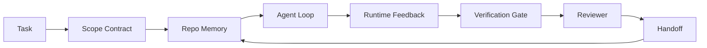

# Agent 工作台工程：为什么能力强的模型仍会失败

> 一个能力强的模型还不够。可靠 agents 需要一个工作台：instructions、state、scope、feedback、verification、review 和 handoff。把这些拿掉，即使是 frontier model 也会产出不能安全发布的工作。

**类型:** 学习 + 构建
**语言:** Python (stdlib)
**先修:** Phase 14 · 01 (Agent Loop), Phase 14 · 26 (Failure Modes)
**时间:** ~45 分钟

## 学习目标

- 区分模型能力与执行可靠性。
- 说出决定 agent 是否能交付的七个工作台表面。
- 在一个小型 repo 任务上比较 prompt-only run 与 workbench-guided run。
- 生成一份 failure-mode report，把每个缺失表面映射到它造成的症状。

## 要解决的问题

你把一个 frontier model 放进真实 repo，要求它添加 input validation。它打开四个文件，写出看似合理的代码，声明成功，然后停止。你运行 tests。两个失败。第三个被改动的文件与 validation 毫无关系。没有记录说明 agent 假设了什么、先尝试了什么、还剩什么要做。

模型并不是不懂 Python。它不懂的是这项工作。它不知道什么算完成、哪里允许写、哪些 tests 是权威的，或者下一次 session 应该如何接手。

这不是模型 bug。这是工作台 bug。Agent 周围的表面缺失了那些把一次性 generation 变成可靠、可恢复工程工作的部分。

## 核心概念

工作台是在任务期间包住模型的操作环境。它有七个表面：

| 表面 | 它承载什么 | 缺失时的失败 |
|------|------------|--------------|
| Instructions | 启动规则、禁止动作、done 的定义 | Agent 猜测什么算 shipping |
| State | 当前任务、已触碰文件、blockers、next action | 每个 session 都从零开始 |
| Scope | 允许文件、禁止文件、acceptance criteria | Edits 泄漏到无关代码 |
| Feedback | 捕获进循环的真实命令输出 | Agent 在 400 上声明成功 |
| Verification | Tests、lint、smoke run、scope check | “Looks good” 进入 main |
| Review | 由不同角色进行第二遍检查 | Builder 给自己的作业打分 |
| Handoff | 改了什么、为什么、还剩什么 | 下一个 session 重新发现一切 |

工作台独立于模型。你可以换模型并保留这些表面。你不能换掉表面还能保留可靠性。



循环闭合在 state file 上，而不是 chat history 上。Chat 是易失的。Repo 才是 system of record。

### 工作台 versus prompt engineering

Prompting 告诉模型这一轮你想要什么。工作台告诉模型如何跨轮次、跨 sessions 地做工作。大多数 agent 失败故事，本质上是披着 prompt-engineering 外衣的工作台失败。

### 工作台 versus framework

Framework 给你 runtime（LangGraph、AutoGen、Agents SDK）。工作台给 agent 一个在该 runtime 内工作的地方。两者都需要。这个 mini-track 讲的是第二个。

### 从原语推理，而不是从 vendor taxonomies 推理

现在关于“harness engineering”的写作很多。Addy Osmani、OpenAI、Anthropic、LangChain、Martin Fowler、MongoDB、HumanLayer、Augment Code、Thoughtworks、walkinglabs awesome list，以及 Medium 和 Hacker News 上持续不断的文章都在讨论它。它们对 harness 的边界、scope 内有什么、该用什么 vocabulary 并不一致。我们不必选边。七个表面是 UX layer；每个工作台下面，都是同一组支撑任何可靠 backend 的分布式系统原语。

先把 agent 标签拿掉片刻。一次 agent run 是跨越时间、进程和机器的 computation。要让它可靠，你需要任何生产系统都需要的同一批原语。

| 原语 | 它是什么 | 它为 agent 承载什么 |
|------|----------|---------------------|
| Function | Typed handler。尽可能纯。拥有自己的 inputs 和 outputs。 | 一次 tool call、一次 rule check、一个 verification step、一次 model invocation |
| Worker | 长生命周期 process，拥有一个或多个 functions 和 lifecycle | Builder、reviewer、verifier、一个 MCP server |
| Trigger | 调用 function 的 event source | Agent loop tick、HTTP request、queue message、cron、file change、hook |
| Runtime | 决定什么在哪里运行、带什么 timeouts 和 resources 的边界 | Claude Code 的 process、LangGraph 的 runtime、一个 worker container |
| HTTP / RPC | caller 和 worker 之间的 wire | Tool-call protocol、MCP request、model API |
| Queue | Trigger 和 worker 之间的 durable buffer；back-pressure、retry、idempotency | Task board、feedback log、review inbox |
| Session persistence | 能在 crashes、restarts、model swaps 后存活的 state | `agent_state.json`、checkpoints、KV stores、repo 本身 |
| Authorization policy | 谁可以用什么 scope 调用什么 function | Allowed/forbidden files、approval boundaries、MCP capability lists |

现在把七个工作台表面映射到这些原语上。

- **Instructions** — policy + function metadata。Rules 是 checks（functions）。Router（`AGENTS.md`）是附着在 runtime startup 上的 policy。
- **State** — session persistence。Runtime 每一步都会读取的 keyed store。File、KV 或 DB；重要的是 persistence semantics，不是 storage backend。
- **Scope** — 每个 task 的 authorization policy。Allowed/forbidden globs 是 ACL。需要 approvals 是 permission lattice。
- **Feedback** — 写入 queue 的 invocation log。每次 shell call 都是一条 record，durable、replayable。
- **Verification** — 一个 function。对 inputs 确定性。由 task close 触发。Fails closed。
- **Review** — 一个单独 worker，对 builder artifacts 只有 read-only authz，对 review reports 只有 write-only authz。
- **Handoff** — 由 session-end trigger 发出的 durable record。下一个 session 的 startup trigger 读取它。

Agent loop 本身就是一个消费 events（user message、tool result、timer tick）的 worker，调用 functions（先是 model，然后是 model 选择的 tools），写入 records（state、feedback），并发出 triggers（verify、review、handoff）。没有神秘感；它和 job processor 是同一种形状。

### 流通中的模式，翻译成原语

每个流行的 harness pattern 都可以归约为八个原语。翻译表如下。

| Vendor 或社区模式 | 它实际是什么 |
|-------------------|--------------|
| Ralph Loop（Claude Code、Codex、agentic_harness book）— 当 agent 过早尝试停止时，将原始意图重新注入到 fresh context window | 一个用 clean context 重新 enqueues task 的 trigger；session persistence 将 goal 向前承载 |
| Plan / Execute / Verify（PEV） | 三个 workers，每个角色一个，通过 state 和阶段间 queue 通信 |
| Harness-compute separation（OpenAI Agents SDK，April 2026）— 将 control plane 与 execution plane 分离 | 重述 control-plane / data-plane。早于 agent 标签几十年 |
| Open Agent Passport（OAP，March 2026）— 在执行前，根据 declarative policy 对每个 tool call 签名并审计 | 由 pre-action worker enforce 的 authorization policy，并带 signed audit queue |
| Guides and Sensors（Birgitta Böckeler / Thoughtworks）— feedforward rules + feedback observability | Authorization policy + verification functions + observability traces |
| Progressive compaction，5-stage（Claude Code reverse engineering，April 2026） | 一个 state-management worker，像 cron 一样周期性运行在 session persistence 上，把它保持在 budget 内 |
| Hooks / middleware（LangChain、Claude Code）— intercept model and tool calls | 包在 runtime invocation path 周围的 triggers + functions |
| Skills as Markdown with progressive disclosure（Anthropic、Flue） | 一个 function registry，其中 function metadata 被 just-in-time 加载进 context |
| Sandbox agents（Codex、Sandcastle、Vercel Sandbox） | Compute plane：带隔离 filesystem、network 和 lifecycle 的 runtime |
| MCP servers | 通过 stable RPC 暴露 functions 的 workers，capability lists 作为 authorization |

这张表里的每一项，都是 agent 社区抵达一个原本已有名字的原语，然后给它起了新名字。作为 marketing 标签有用；作为工程 vocabulary 没用。

### 证据实际说明了什么

harness-over-model 的主张现在有数字支撑。值得了解，因为这些也是反驳“只要等更聪明的模型就好了”的唯一诚实论据。

- Terminal Bench 2.0 — 同一个模型，仅 harness 改动就让一个 coding agent 从 top 30 之外移动到第 5 名（LangChain, *Anatomy of an Agent Harness*）。
- Vercel — 删除了其 agent 的 80% 工具；success rate 从 80% 跳到 100%（MongoDB）。
- Harvey — legal agents 仅通过 harness optimization 就让 accuracy 翻了一倍多（MongoDB）。
- 88% 的 enterprise AI agent projects 未能进入 production。失败集中在 runtime，而不是 reasoning（preprints.org, *Harness Engineering for Language Agents*, March 2026）。
- 一项 2025 年针对三个流行 open-source frameworks 的 benchmark study 报告约 50% task completion；long-context WebAgent 在 long-context conditions 下从 40-50% 崩到 10% 以下，主要原因是 infinite loops 和 goal loss（2026 年初的 writeups 广泛报道）。

结论不是“harness 永远获胜”。Models 会随着时间吸收 harness tricks。结论是今天的 load-bearing engineering 在模型周围，而不是模型内部；承载这份负载的原语，正是每个生产系统一直以来都需要的那些。

### Vendor writeups 止步之处

这一部分你不需要客气。

- LangChain 的 *Anatomy of an Agent Harness* 枚举了十一项组件：prompts、tools、hooks、sandboxes、orchestration、memory、skills、subagents，以及一个 runtime “dumb loop”。它没有命名 queues、作为 deployment unit 的 workers、trigger semantics、作为独立 concern 的 session persistence，或 authorization policy。它把 harness 当成一个你配置的 object，而不是一个你部署的 system。
- Addy Osmani 的 *Agent Harness Engineering* 提出了 `Agent = Model + Harness` framing 和 ratchet pattern，但没有说 harness 是用什么构建出来的。它读起来像一种 stance，而不是 spec。
- Anthropic 和 OpenAI 对 surfaces 讲得最深，但仍留在自己的 runtimes 内。April 2026 Agents SDK 中的 “harness-compute separation” 公告，是第一个明确 endorses control-plane / data-plane split 的 vendor piece。那是一个原语想法，不是新概念。
- agentic_harness book 把 harness 视为 config object（Jaymin West 的 *Agentic Engineering*，chapter 6），其中最强的一句是 “the harness is the primary security boundary in an agentic system.” 这只是 authorization policy 的重述。
- Hacker News threads 一直抵达同一个地方。2026 年 4 月的 thread *The agent harness belongs outside the sandbox* 认为 harness 应该坐在“more like a hypervisor that sits outside everything and authorises access based on context and user.” 这再次是作为 separate plane 的 authorization policy。

你不需要反对这些文章，就能看见缺口。它们是在写一个早已存在系统的 UX descriptions。我们是在写系统。系统构建正确时，七个表面会自然从原语中长出来。系统构建错误时，再多 `AGENTS.md` polish 也修不好缺失的 queue。

所以当你在别处听到“harness engineering”时，把它翻译回原语。Prompts 和 rules 是 policy 与 functions。Scaffolding 是 runtime。Guardrails 是 authorization + verification。Hooks 是 triggers。Memory 是 session persistence。Ralph Loop 是 requeue。Subagents 是 workers。Sandboxes 是 compute planes。Vocabulary 会变；engineering 不会。工作台是面向 agent 的 UX；而 harness，以能经受下一次 vendor reframe 的意义来说，是 functions、workers、triggers、runtimes、queues、persistence 和 policy 被正确接线。

## 动手实现

`code/main.py` 把一个 tiny repo task 运行两次。第一次是 prompt only，第二次接入七个表面。相同模型，相同任务。脚本统计 failed run 缺失了哪些表面，并打印 failure-mode report。

Repo task 刻意保持很小：给一个 one-file FastAPI-style handler 添加 input validation，并写出一个 passing test。

运行：

```text
python3 code/main.py
```

输出：两次运行的 side-by-side log、一个总结 prompt-only run 的 `failure_modes.json`，以及 workbench run 的一行 verdict。

这个 agent 是很小的 rule-based stub；重点是 surfaces，不是模型。在这个 mini-track 的其余部分，你会把每个 surface 重建成真实、可复用 artifact。

## 实际使用

野外已经存在三类工作台表面，哪怕没人这样称呼它们：

- **Claude Code、Codex、Cursor。** `AGENTS.md` 和 `CLAUDE.md` 是 instructions surface。Slash commands 是 scope。Hooks 是 verification。
- **LangGraph、OpenAI Agents SDK。** Checkpoints 和 session stores 是 state surface。Handoffs 是 handoff surface。
- **真实 repo 上的 CI。** Tests、lint 和 type-check 是 verification。PR template 是 handoff。CODEOWNERS 是 review。

Workbench engineering 是让这些表面显式且可复用的纪律，而不是让每个团队重新发现它们。

## 交付成果

`outputs/skill-workbench-audit.md` 是一个 portable skill，可以审计现有 repo 的七个工作台表面，并报告哪些缺失、哪些部分完成、哪些健康。把它放到任何 agent setup 旁边；它会告诉你应该先修什么。

## 练习

1. 选择一个你已经运行 agent 的 repo。把七个表面从 0（missing）到 2（healthy）打分。你最弱的 surface 是什么？
2. 扩展 `main.py`，让 prompt-only run 也产出一个假的 “success” claim。验证 verification gate 会捕捉它。
3. 为你自己的产品添加第八个 surface。说明为什么它不能被归并到现有七个之一。
4. 用另一个会 hallucinate 额外 file write 的 stub agent 重新运行脚本。哪个 surface 最先捕捉它？
5. 将 Phase 14 · 26 的五种行业反复出现失败模式映射到七个表面。每个 surface 设计来吸收哪种 mode？

## 关键术语

| 术语 | 人们通常怎么说 | 它实际意味着什么 |
|------|----------------|------------------|
| Workbench | “The setup” | 模型周围让工作可靠的 engineered surfaces |
| Surface | “A doc” or “a script” | Agent 每轮读取或写入的命名、machine-readable input |
| System of record | “The notes” | Chat history 消失时 agent 视为 truth 的文件 |
| Definition of done | “Acceptance” | 一个 objective、file-backed checklist，agent 不能伪造 |
| Workbench audit | “Repo readiness check” | 对七个 surfaces 的 pass，能在工作开始前标出缺失部分 |

## 延伸阅读

把这些当作数据点，而不是权威。每一个都是 partial taxonomy。在决定是否采用前，先把每个概念翻译回一个原语（function、worker、trigger、runtime、HTTP/RPC、queue、persistence、policy）。

Vendor framings：

- [Addy Osmani, Agent Harness Engineering](https://addyosmani.com/blog/agent-harness-engineering/) — `Agent = Model + Harness` 和 ratchet pattern；基础设施部分较薄
- [LangChain, The Anatomy of an Agent Harness](https://blog.langchain.com/the-anatomy-of-an-agent-harness/) — 十一项组件：prompts、tools、hooks、orchestration、sandboxes、memory、skills、subagents、runtime；遗漏 queues、deployment、authz
- [OpenAI, Harness engineering: leveraging Codex in an agent-first world](https://openai.com/index/harness-engineering/) — Codex team 对其 runtime 周围 surfaces 的看法
- [OpenAI, Unrolling the Codex agent loop](https://openai.com/index/unrolling-the-codex-agent-loop/) — agent loop 归约为 function calls 上的 `while`
- [Anthropic, Effective harnesses for long-running agents](https://www.anthropic.com/engineering/effective-harnesses-for-long-running-agents) — specific runtime 内的 long-horizon surfaces
- [Anthropic, Harness design for long-running application development](https://www.anthropic.com/engineering/harness-design-long-running-apps) — applied design notes
- [LangChain Deep Agents harness capabilities](https://docs.langchain.com/oss/python/deepagents/harness) — runtime config surface

Practitioner pieces with usable detail：

- [Martin Fowler / Birgitta Böckeler, Harness engineering for coding agent users](https://martinfowler.com/articles/harness-engineering.html) — guides（feedforward）+ sensors（feedback）；最清晰的 control-theory framing
- [HumanLayer, Skill Issue: Harness Engineering for Coding Agents](https://www.humanlayer.dev/blog/skill-issue-harness-engineering-for-coding-agents) — “it's not a model problem, it's a configuration problem”
- [MongoDB, The Agent Harness: Why the LLM Is the Smallest Part of Your Agent System](https://www.mongodb.com/company/blog/technical/agent-harness-why-llm-is-smallest-part-of-your-agent-system) — receipts：Vercel 80% to 100%、Harvey 2x accuracy、Terminal Bench Top 30 to Top 5
- [Augment Code, Harness Engineering for AI Coding Agents](https://www.augmentcode.com/guides/harness-engineering-ai-coding-agents) — constraint-first walkthrough
- [Sequoia podcast, Harrison Chase on Context Engineering Long-Horizon Agents](https://sequoiacap.com/podcast/context-engineering-our-way-to-long-horizon-agents-langchains-harrison-chase/) — runtime concerns over model concerns

Books, papers, and reference implementations：

- [Jaymin West, Agentic Engineering — Chapter 6: Harnesses](https://www.jayminwest.com/agentic-engineering-book/6-harnesses) — book-length treatment，把 harness 视为 primary security boundary
- [preprints.org, Harness Engineering for Language Agents (March 2026)](https://www.preprints.org/manuscript/202603.1756) — academic framing as control / agency / runtime
- [walkinglabs/awesome-harness-engineering](https://github.com/walkinglabs/awesome-harness-engineering) — context、evaluation、observability、orchestration 的 curated reading list
- [ai-boost/awesome-harness-engineering](https://github.com/ai-boost/awesome-harness-engineering) — alternate curated list（tools、evals、memory、MCP、permissions）
- [andrewgarst/agentic_harness](https://github.com/andrewgarst/agentic_harness) — production-ready reference implementation，带 Redis-backed memory 和 eval suite
- [HKUDS/OpenHarness](https://github.com/HKUDS/OpenHarness) — open agent harness，带 built-in personal agent

Hacker News threads worth reading for the disagreements, not the consensus：

- [HN: Effective harnesses for long-running agents](https://news.ycombinator.com/item?id=46081704)
- [HN: Improving 15 LLMs at Coding in One Afternoon. Only the Harness Changed](https://news.ycombinator.com/item?id=46988596)
- [HN: The agent harness belongs outside the sandbox](https://news.ycombinator.com/item?id=47990675) — argues for authorization as a separate plane

Cross-references inside this curriculum：

- Phase 14 · 23 — OpenTelemetry GenAI conventions：sensors literature 指向的 observability layer
- Phase 14 · 26 — failure modes catalog，七个 surfaces 设计来吸收它们
- Phase 14 · 27 — prompt injection defenses，位于 authorization-policy primitive
- Phase 14 · 29 — Production runtimes（queue、event、cron）：本课原语在 deployment 中的位置
