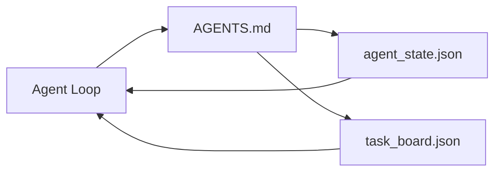

# 最小 Agent 工作台

> 最小有用工作台是三个文件：一个 root instructions router、一个 state file、一个 task board。其他一切都叠在它们之上。如果一个 repo 承载不了这三个文件，没有模型能救它。

**类型:** 构建
**语言:** Python (stdlib)
**先修:** Phase 14 · 31 (Why Capable Models Still Fail)
**时间:** ~45 分钟

## 学习目标

- 定义构成 minimum viable workbench 的三个文件。
- 解释为什么短小的 root router 胜过冗长的 monolithic `AGENTS.md`。
- 构建一个 agent 每轮都能读取、结束时能写回的 state file。
- 构建一个不依赖 chat history、能支撑 multi-session work 的 task board。

## 要解决的问题

大多数团队会通过写一个 3000 行 `AGENTS.md` 来搭工作台，然后就说完成了。模型加载它，忽略自己无法总结的部分，然后依旧在一贯失败的 surfaces 上失败。

你需要反过来做。一个很小的 root file，只在相关时把 agent 路由到更深层文件。Durable state，让 agent 行动前读取、行动后写入。一个 task board，说明什么正在进行、什么被阻塞、接下来是什么。

三个文件。每个文件有一个 job。每个文件都足够 machine-readable，以便以后演进成真实系统。

## 核心概念



### AGENTS.md 是 router，不是 manual

好的 `AGENTS.md` 很短。它把 agent 指向：

- State file（你在哪里）。
- Task board（还剩什么）。
- 更深的 rules（在 `docs/agent-rules.md` 下）。
- Verification command（如何知道它能工作）。

更长的内容放到更深层 docs，只在需要时加载。长 manual 会被忽略。短 router 会被遵循。

### agent_state.json 是 system of record

State 承载：active task id、touched files、assumptions made、blockers 和 next action。Agent 每一轮都会读取它。下一个 session 读取它，而不是 replay chat。

State 放在文件里，因为 chat history 不可靠。Sessions 会死。Conversations 会被裁剪。文件不会。

### task_board.json 是 queue

Task board 承载每个任务，status 为 `todo | in_progress | done | blocked`。它是 state 为空时 agent 拉取任务的 queue，也是你想知道 agent 是否走在正轨上时读取的 queue。

Board 上的 task 有 id、goal、owner（`builder`、`reviewer` 或 `human`）以及 acceptance criteria。Board 故意保持小：当它超过一屏时，你有的是 planning problem，不是 board problem。

### 三个文件是地板，不是天花板

后续课程会添加 scope contracts、feedback runners、verification gates、reviewer checklists 和 handoff packets。本课的三个文件是它们全部默认存在的基础。

## 动手实现

`code/main.py` 会把最小工作台写入空 repo，并演示一个单次 agent turn：

1. 读取 `agent_state.json`。
2. 如果 state 为空，就从 `task_board.json` 拉取下一个 task。
3. 只在 scope 内触碰一个文件。
4. 写回更新后的 state。

运行：

```text
python3 code/main.py
```

脚本会在自身旁边创建 `workdir/`，放下三个文件，运行一次 turn，并打印 diff。重新运行它，可以看到第二轮如何从第一轮留下的位置继续。

## 实际使用

在生产 agent 产品中，同样三个文件会以不同名称出现：

- **Claude Code：** `AGENTS.md` 或 `CLAUDE.md` 作为 router，`.claude/state.json`-style stores 作为 state，hooks 作为 board。
- **Codex / Cursor：** workspace rules 作为 router，session memory 作为 state，chat sidebar 中的 queued tasks 作为 board。
- **Custom Python agent：** 就是你刚刚写的同样文件。

名称会变。形状不会。

## 真实世界中的生产模式

当三个模式叠在最小工作台之上时，最小工作台可以经受真实 monorepos。它们彼此独立；只选择你的 repo 实际需要的。

**嵌套 `AGENTS.md`，nearest-wins precedence。** OpenAI 在主 repo 中放了 88 个 `AGENTS.md` 文件，每个 subcomponent 一个。Codex、Cursor、Claude Code 和 Copilot 都会从工作文件向 repo root 走，并连接沿途发现的每个 `AGENTS.md`。Sub-directory files 扩展 root file。Codex 额外加入了 `AGENTS.override.md`，用于替换而不是扩展；override mechanism 是 Codex-specific，跨工具工作时要避免。Augment Code 的测量才是关键句：最好的 `AGENTS.md` 文件带来的质量跃升等价于从 Haiku 升级到 Opus；最差的文件会让输出比完全没有文件还糟。

**即使看起来像覆盖也要拒绝的反模式。** 冲突指令会静默地把 agent 从 interactive mode 降到 greedy mode（ICLR 2026 AMBIG-SWE：48.8% → 28% resolve rate）；用编号优先级，而不是平铺堆叠。不可验证的 style rules（“follow the Google Python Style Guide”）如果没有 enforcement command，会让 agent 编造 compliance；每条 style rule 都要配精确 lint command。用 style 开头而不是 commands，会埋掉 verification path；commands first，style last。写给 humans 而不是 agents 会浪费 context budget；简短是一种 feature。

**跨工具 symlinks。** 一个 root file 加 symlinks（`ln -s AGENTS.md CLAUDE.md`、`ln -s AGENTS.md .github/copilot-instructions.md`、`ln -s AGENTS.md .cursorrules`）可以让每个 coding agent 共享同一个 source of truth。Nx 的 `nx ai-setup` 会从单一 config 自动为 Claude Code、Cursor、Copilot、Gemini、Codex 和 OpenCode 做这件事。

## 交付成果

`outputs/skill-minimal-workbench.md` 会为任何新 repo 生成三文件工作台：一个针对项目调优的 `AGENTS.md` router、一个带正确 keys 的 `agent_state.json`，以及一个用当前 backlog seed 的 `task_board.json`。

## 练习

1. 给 `agent_state.json` 添加 `last_run` timestamp。如果文件超过 24 小时没有更新，除非 operator 确认，否则拒绝运行。
2. 给 task board 添加 `priority` 字段，并修改 puller，让它总是选择最高优先级的 `todo`。
3. 将 `task_board.json` 迁移到 JSON Lines，这样每个 task 是一行，版本控制中的 diffs 更干净。
4. 编写一个 `lint_workbench.py`，如果 `AGENTS.md` 超过 80 行，或引用不存在的文件，就失败。
5. 决定三个文件中丢失哪一个伤害最大。为你的答案辩护。

## 关键术语

| 术语 | 人们通常怎么说 | 它实际意味着什么 |
|------|----------------|------------------|
| Router | `AGENTS.md` | 指向更深 docs 和 files 的短 root file |
| State file | “The notes” | 记录 agent 所处位置的 machine-readable record，每轮写入 |
| Task board | “The backlog” | 带 status、owner、acceptance 的 JSON work queue |
| System of record | “Source of truth” | Chat 消失时，工作台视为 authoritative 的文件 |

## 延伸阅读

- [agents.md — the open spec](https://agents.md/) — adopted by Cursor, Codex, Claude Code, Copilot, Gemini, OpenCode
- [Augment Code, A good AGENTS.md is a model upgrade. A bad one is worse than no docs at all](https://www.augmentcode.com/blog/how-to-write-good-agents-dot-md-files) — measured quality jumps
- [Blake Crosley, AGENTS.md Patterns: What Actually Changes Agent Behavior](https://blakecrosley.com/blog/agents-md-patterns) — what works empirically, what does not
- [Datadog Frontend, Steering AI Agents in Monorepos with AGENTS.md](https://dev.to/datadog-frontend-dev/steering-ai-agents-in-monorepos-with-agentsmd-13g0) — nested precedence in practice
- [Nx Blog, Teach Your AI Agent How to Work in a Monorepo](https://nx.dev/blog/nx-ai-agent-skills) — single-source generation across six tools
- [The Prompt Shelf, AGENTS.md Best Practices: Structure, Scope, and Real Examples](https://thepromptshelf.dev/blog/agents-md-best-practices/) — section ordering that survives review
- [Anthropic, Claude Code subagents and session store](https://docs.anthropic.com/en/docs/agents-and-tools/claude-code/sub-agents)
- Phase 14 · 31 — 这个 minimum 会吸收的 failure modes
- Phase 14 · 34 — 本课预览的 durable state schema
