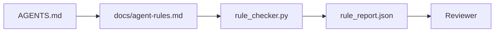

# 将代理指令写成可执行约束

> 写成散文的指令只是愿望。写成约束的指令才是测试。这个工作台会把每条规则变成代理可在运行时检查、评审者可在事后验证的东西。

**类型:** Build
**语言:** Python (stdlib)
**先修:** Phase 14 · 32 (Minimal Workbench)
**时间:** ~50 分钟

## 学习目标

- 将路由说明与操作性规则分离。
- 将启动规则、禁止动作、完成定义、不确定性处理和审批边界表达成机器可检查的约束。
- 实现一个规则检查器，按规则集为一次运行打分。
- 让规则集便于 diff，使评审能看清变化。

## 要解决的问题

典型的 `AGENTS.md` 读起来像入职文档。它告诉代理“要小心”“要彻底测试”“不确定就提问”。三天后，代理交付了一个没有测试的改动，写入了被禁止的目录，而且从未提问，因为它从来不知道边界在哪里。

当指令具备操作性时，它们很强；当指令只是愿景时，它们很弱。修复方法是写出工作台能够解释、评审者能够评分的规则。

## 核心概念

规则应放在 `docs/agent-rules.md` 中，和简短的根路由文件分开。每条规则都有名称、类别和检查项。



### 覆盖大多数规则的五个类别

| 类别 | 这条规则回答的问题 | 示例 |
|----------|---------------------------|---------|
| 启动 | 开始工作前必须满足什么？ | “状态文件存在且是新鲜的” |
| 禁止 | 什么绝不能发生？ | “不要编辑 `scripts/release.sh`” |
| 完成定义 | 什么能证明任务已完成？ | “pytest 退出码为 0，且验收行通过” |
| 不确定性 | 代理不确定时该怎么做？ | “打开一条问题备注，而不是猜测” |
| 审批 | 什么需要人工审批？ | “任何新依赖、任何生产写入” |

如果一条规则不适合这五类之一，它通常想成为两条规则。强制拆分。

### 规则是机器可读的

每条规则都有一个 slug、一个类别、一行描述，以及一个 `check` 字段，用来命名 `rule_checker.py` 中的函数。新增一条规则就意味着新增一个检查；检查器会随工作台一起增长。

### 规则便于 diff

规则在单个 markdown 文件中按标题逐条存放。重命名在 diff 中可见。新规则放在所属类别顶部。过时规则会被删除，而不是注释掉，因为工作台才是真相来源，不是团队上个季度感受如何的聊天记录。

### 规则与框架 guardrails

框架 guardrails（OpenAI Agents SDK guardrails、LangGraph interrupts）在运行时层面执行规则。本课的规则集是这些 guardrails 所实现的、人类可读且可评审的契约。两者都需要：运行时在一轮中捕获违规，规则集证明运行时正在做正确的事。

### 渐进披露：给地图，而不是百科全书

`AGENTS.md` 不断变长，是因为每次事故都会增加一条规则，却没有事故会删除一条规则。一年之后，文件有两千行，代理只读第一屏，就耗尽了注意力预算，然后只按被告知内容的一小部分行动。巨型指令文件会失败，原因和四十页入职文档会失败一样：读者只会粗略扫一遍，然后再也不会回到真正重要的部分。

修复方法不是写一个更短的文件，而是写一个分层的文件。根路由保持小到每个会话都能读完，并且只保存指针。深度内容放在主题文件中，只有当任务触及相应主题时，代理才加载它们。给代理一张地图，而不是整本百科全书，让它走到自己需要的那一页。

```text
AGENTS.md                  # router, < 50 lines: what this repo is, where to look, the 5 hard rules
docs/
  agent-rules.md           # the full rule set (this lesson)
  architecture.md          # loaded when the task touches module boundaries
  testing.md               # loaded when the task writes or runs tests
  deploy.md                # loaded only for release work, gated behind an approval rule
feature_list.json          # the backlog (Phase 14 · 36)
```

| 层级 | 存放位置 | 何时读取 | 大小预算 |
|------|----------|-----------|-------------|
| 路由 | `AGENTS.md` | 每个会话，始终读取 | 少于约 50 行 |
| 规则 | `docs/agent-rules.md` | 每个会话，启动时读取 | 每个类别一屏 |
| 主题文档 | `docs/<topic>.md` | 只有任务触及该主题时读取 | 按需要深入 |

两项测试能让分层保持诚实。可达性测试：代理从路由出发，最多两跳就应到达任意规则，所以路由必须按路径链接每个主题文档，而不是用散文描述它。新鲜度测试：路由足够短，评审者会在每个 PR 中重读它，这是阻止它悄悄长回百科全书的唯一方式。一个不再能解析的指针比缺失规则更糟，所以路由中的断链本身就是一次启动检查违规。

## 动手实现

`code/main.py` 提供：

- `agent-rules.md` 解析器，用来把规则加载进 dataclass。
- `rule_checker.py` 风格的检查函数，每个 `check` 引用对应一个函数。
- 一个演示代理运行，它违反两条规则，并用一次检查通过过程捕获它们。

运行：

```text
python3 code/main.py
```

输出：解析后的规则集、运行轨迹、每条规则的通过/失败结果，以及保存在脚本旁边的 `rule_report.json`。

## 真实生产中的模式

三个模式能区分一个能维持一个季度的规则集，和一个一周内就腐烂的规则集。

**写入时标注严重级别。** 每条规则都携带 `severity`：`block`、`warn` 或 `info`。检查器报告全部三种；运行时只会因 `block` 拒绝执行。大多数团队早期会夸大严重级别，然后在截止日期压力下悄悄削弱它；在写入时标注严重级别，会迫使校准一开始就发生。可以配合验证门（Phase 14 · 38）使用，它会把任何对 `block` 规则的覆盖签入 `overrides.jsonl` 审计日志。

**规则过期作为强制函数。** 每条规则都携带一个 `expires_at` 日期（默认是创建后 90 天）。当一条尚未过期的规则连续 60 天没有任何违规时，检查器会发出警告；下一次季度评审要么说明保留它的理由，要么将其弱化为 `info`，要么删除它。Cloudflare 的生产 AI Code Review 数据（2026 年 4 月，30 天内跨 5,169 个 repo 的 131,246 次评审运行）表明，有显式过期机制的规则集能保持在每个 repo 30 条规则以内；没有过期机制的规则集会增长到 80+，且大多数规则从未触发。

**Markdown-as-source，JSON-as-cache。** `agent-rules.md` 是作者编写的文件；`agent-rules.lock.json` 是检查器在热路径中读取的缓存。lock 文件由 pre-commit hook 重新生成。Markdown diff 便于评审；JSON 解析不会进入每一轮运行。它的形状与 `package.json` / `package-lock.json`、`Cargo.toml` / `Cargo.lock` 相同。

## 实际使用

在生产中：

- Claude Code、Codex、Cursor 在会话开始时读取规则，并在拒绝动作时引用它们。检查器会在 CI 中重新运行这些规则，以捕获静默漂移。
- OpenAI Agents SDK guardrails 会把同一组检查注册为输入和输出 guardrails。markdown 是文档表面；SDK 是运行时表面。
- LangGraph interrupts 会在运行中的节点违反规则时触发。interrupt 处理器读取规则，询问人类，然后继续运行。

这个规则集可以跨三者移植，因为它只是 markdown 加函数名。

## 交付成果

`outputs/skill-rule-set-builder.md` 会访谈项目负责人，将他们现有的散文式指令归类到五个类别，并输出一个带版本的 `agent-rules.md` 以及一个检查器 stub。

## 练习

1. 如果你的产品真的需要，添加第六个类别。说明为什么它不能归并到五类之一。
2. 扩展检查器，让一条规则可以携带严重级别（`block`、`warn`、`info`），并让报告按严重级别聚合。
3. 将检查器接入 CI：如果最新代理运行中有任何 block-severity 规则失败，就让构建失败。
4. 为每条规则添加一个“expiry”字段。90 天内没有检查失败的规则进入评审。
5. 找一个真实的 `AGENTS.md`，把它改写成五类规则。它有多少行是操作性的？多少行只是愿景性的？

## 关键术语

| 术语 | 人们常说 | 实际含义 |
|------|----------------|------------------------|
| 操作性规则 | “一条真正的指令” | 工作台能在运行时检查的规则 |
| 愿景性规则 | “要小心” | 没有检查的规则；要么删除，要么升级 |
| 完成定义 | “验收” | 任务已完成的、客观且由文件支撑的证明 |
| Block severity | “硬规则” | 违规会停止运行；没有操作员就不能静默处理 |
| 规则过期 | “清扫过时规则” | N 天内没有失败的规则进入退役评审 |

## 延伸阅读

- [OpenAI Agents SDK guardrails](https://platform.openai.com/docs/guides/agents-sdk/guardrails)
- [LangGraph interrupts](https://langchain-ai.github.io/langgraph/how-tos/human_in_the_loop/breakpoints/)
- [Anthropic, Building Effective Agents](https://www.anthropic.com/research/building-effective-agents)
- [Rick Hightower, Agent RuleZ: A Deterministic Policy Engine](https://medium.com/@richardhightower/agent-rulez-a-deterministic-policy-engine-for-ai-coding-agents-9489e0561edf) — 生产中的 block/warn/info 严重级别
- [Cloudflare, Orchestrating AI Code Review at Scale](https://blog.cloudflare.com/ai-code-review/) — 131k 次评审运行，以及规则组合经验
- [microservices.io, GenAI development platform — part 1: guardrails](https://microservices.io/post/architecture/2026/03/09/genai-development-platform-part-1-development-guardrails.html) — 规则与 CI 之间的纵深防御
- [Type-Checked Compliance: Deterministic Guardrails (arXiv 2604.01483)](https://arxiv.org/pdf/2604.01483) — 将 Lean 4 作为 rule-as-check 的上界
- [logi-cmd/agent-guardrails](https://github.com/logi-cmd/agent-guardrails) — merge-gate 实现：scope、mutation testing、violation budgets
- Phase 14 · 32 — 这个规则集要放入的 minimal workbench
- Phase 14 · 38 — 消费规则报告的 verification gate
- Phase 14 · 39 — 为规则合规性打分的 reviewer agent
