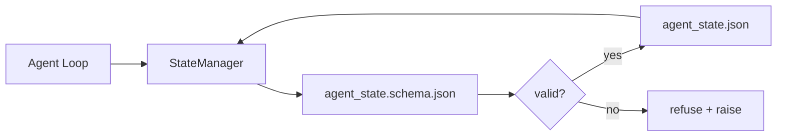

# Repo Memory 与持久状态

> 聊天历史是易失的。repo 是持久的。工作台把代理状态存进带版本的文件里，让下一个会话、下一个代理和下一个评审者都从同一个真相来源读取。

**类型:** Build
**语言:** Python (stdlib + `jsonschema` optional)
**先修:** Phase 14 · 32 (Minimal Workbench)
**时间:** ~60 分钟

## 学习目标

- 定义什么应属于 repo memory，什么应留在聊天历史中。
- 为 `agent_state.json` 和 `task_board.json` 编写 JSON Schemas。
- 构建一个状态管理器，用来原子地加载、校验、变更和持久化状态。
- 使用 schema 在坏写入腐蚀工作台之前拒绝它们。

## 要解决的问题

代理结束了一个会话。聊天关闭。下一个会话打开后问该从哪里开始。模型说“让我检查文件”，读到过时备注，然后重复已经完成的工作。更糟的是，它重写了一个已完成文件，因为没人告诉它这个文件已经完成。

工作台层面的修复方法是 repo memory：状态以 JSON 文件形式存在于 repo 中，在 schema 约束下写入，原子地持久化，并且在代码评审中便于 diff。聊天是临时 feed；repo 才是 system of record。

## 核心概念



### 什么属于 repo memory

| 应该属于 | 不应该属于 |
|---------|-----------------|
| 当前任务 id | 原始聊天 transcript |
| 本会话触及的文件 | token 级 reasoning traces |
| 代理做出的假设 | “用户看起来很沮丧” |
| 未解决的 blockers | sampled completions |
| 下一步动作 | 供应商特定的 model ids |

判断标准是持久性：三个月后在 CI 重新运行时，这条信息是否仍然有用？如果有，放进 repo。如果没有，归入 telemetry。

### Schema-first state

JSON Schema 是契约。没有它，每个代理都会发明新字段，每个评审者都要学习一种新形状，每个 CI 脚本都要为过去的版本写特例。有了它，坏写入就会成为被拒绝的写入。

schema 覆盖：

- 必填键。
- 允许的 `status` 值。
- 禁止值（例如数组中的 `null`）。
- pattern 约束（task ids 匹配 `T-\d{3,}`）。
- 用于迁移的版本字段。

### 原子写入

状态写入需要能承受部分失败：写入 tempfile、fsync、rename 覆盖目标。状态文件是真相来源；半写入状态文件比没有状态文件更糟。

### 迁移

当 schema 发生变化时，要在 schema bump 旁边交付一个迁移脚本。状态文件携带 `schema_version` 字段；管理器会拒绝加载来自无法迁移版本的文件。

## 动手实现

`code/main.py` 实现：

- `agent_state.schema.json` 和 `task_board.schema.json`。
- 一个只用 stdlib 的 validator（JSON Schema 子集：required、type、enum、pattern、items）。
- 带原子 temp-and-rename 写入的 `StateManager.load`、`StateManager.update`、`StateManager.commit`。
- 一个 demo，它变更状态、持久化、重新加载，并证明 round-trip。

运行：

```text
python3 code/main.py
```

脚本会写入 `workdir/agent_state.json` 和 `workdir/task_board.json`，跨两轮变更它们，并在每一步打印校验后的状态。

## 真实生产中的模式

四个模式能把本课的最小实现变成多代理 monorepo 也能承受的东西。

**Atomic temp-and-rename 不是可选项。** 2026 年 3 月的一份 Hive 项目 bug 报告清楚记录了失败模式：`state.json` 通过 `write_text()` 写入，并且异常被捕获后静默忽略。部分写入让会话在没有任何信号的情况下从损坏状态恢复。修复永远是：在目标文件同目录中使用 `tempfile.mkstemp`，写入，`fsync`，`os.replace`（POSIX 和 Windows 上的原子 rename）。本课的 `atomic_write` 正是这样做的。

**每个非幂等工具调用都需要 idempotency keys。** 如果代理在调用工具之后、checkpoint 结果之前崩溃，恢复时会重试该工具调用。读取是安全的；发送邮件、DB insert、文件上传就危险了。模式是：在执行前把每个 tool call ID 记录到 `pending_calls.jsonl`。重试时检查该 ID；如果存在，就跳过调用并使用缓存结果。Anthropic 和 LangChain 都在 2026 年指导中强调了这一点；LangGraph 的 checkpointer 也出于同样原因持久化 pending writes。

**将大型 artifact 与 state 分离。** 不要把 CSV、长 transcript 或生成文件存进 `agent_state.json`。把 artifact 保存为单独文件（或上传到 object storage），并且只在 state 中保留路径。checkpoint 保持小而快；artifact 独立增长。

**Event sourcing 用于审计，snapshot 用于恢复。** 每次 mutation 都追加到事件日志（`state.events.jsonl`）；定期 snapshot 到 `state.json`。恢复时读取 snapshot，然后 replay snapshot timestamp 之后的所有事件。这会多占磁盘，但能逐字 replay 代理决策，这在调试长周期运行时至关重要。形状与 Postgres 内部使用 WAL 的方式相同。

**要么做 schema migrations，要么拒绝加载。** `schema_version` 整数就是契约。当管理器加载未知版本文件时，它会拒绝读取。要在 schema bump 旁边交付迁移脚本；`tools/migrate_state.py` 会在每次启动时幂等运行。

## 实际使用

在生产中：

- **LangGraph checkpointers。** 同样的想法，不同的存储。checkpointer 将 graph state 持久化到 SQLite、Postgres 或自定义后端。本课讲授的 schema，是 checkpointer 出故障而你需要手动读取 state 时要伸手去拿的东西。
- **Letta memory blocks。** 带结构化 schema 的持久 blocks（Phase 14 · 08）。同一套纪律，但作用域限定在长运行 personas。
- **OpenAI Agents SDK session store。** 可插拔后端，schema-aware。本课的状态文件就是 local-file backend。

## 交付成果

`outputs/skill-state-schema.md` 会生成一对项目专用 JSON Schema（state + board）、一个连接到原子写入的 Python `StateManager`，以及一个迁移脚手架，这样下一次 schema bump 不会破坏工作台。

## 练习

1. 添加一个 `last_human_touch` timestamp。拒绝任何发生在人类编辑后五秒内的代理写入。
2. 扩展 validator 以支持 `oneOf`，这样任务可以是构建任务，也可以是评审任务，并各自拥有不同必填字段。
3. 添加 `schema_version` 字段，并编写从 v1 到 v2 的迁移（将 `blockers` 重命名为 `risks`）。
4. 将存储后端从本地文件迁移到 SQLite。保持 `StateManager` API 不变。
5. 让两个代理以 50 ms 写入竞争访问同一个状态文件。会出什么问题？原子 rename 如何帮你？

## 关键术语

| 术语 | 人们常说 | 实际含义 |
|------|----------------|------------------------|
| Repo memory | “备注文件” | 按 schema 存储在 repo 已跟踪文件中的状态 |
| Schema-first | “校验输入” | 先于 writer 定义契约，并拒绝漂移 |
| 原子写入 | “只是 rename” | 写入 temp、fsync、rename，使部分失败不能腐蚀状态 |
| 迁移 | “Schema bump” | 将 vN state 转换为 v(N+1) state 的脚本 |
| System of record | “Source of truth” | 工作台视为权威的 artifact |

## 延伸阅读

- [JSON Schema specification](https://json-schema.org/specification.html)
- [LangGraph checkpointers](https://langchain-ai.github.io/langgraph/concepts/persistence/)
- [Letta memory blocks](https://docs.letta.com/concepts/memory)
- [Fast.io, AI Agent State Checkpointing: A Practical Guide](https://fast.io/resources/ai-agent-state-checkpointing/) — 带 idempotency 的 schema-first checkpointing
- [Fast.io, AI Agent Workflow State Persistence: Best Practices 2026](https://fast.io/resources/ai-agent-workflow-state-persistence/) — concurrency control、TTL、event sourcing
- [Hive Issue #6263 — non-atomic state.json writes silently ignored](https://github.com/aden-hive/hive/issues/6263) — 真实项目中的失败模式
- [eunomia, Checkpoint/Restore Systems: Evolution, Techniques, Applications](https://eunomia.dev/blog/2025/05/11/checkpointrestore-systems-evolution-techniques-and-applications-in-ai-agents/) — 将 OS 历史中的 CR primitives 应用于 agents
- [Indium, 7 State Persistence Strategies for Long-Running AI Agents in 2026](https://www.indium.tech/blog/7-state-persistence-strategies-ai-agents-2026/)
- [Microsoft Agent Framework, Compaction](https://learn.microsoft.com/en-us/agent-framework/agents/conversations/compaction) — vendor checkpoint manager
- Phase 14 · 08 — memory blocks 与 sleep-time compute
- Phase 14 · 32 — 本课要 schema 化的三文件最小集
- Phase 14 · 40 — 从同一 schema 读取的 handoff packets
