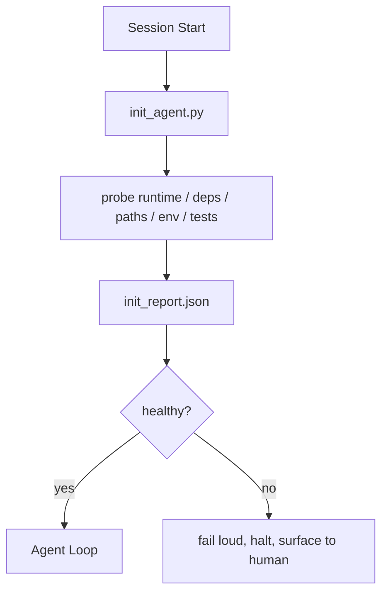

# 面向代理的初始化脚本

> 每个冷启动会话都会缴纳一笔税。代理反复读取同样的文件，重试同样的探测，重新发现同样的路径。init script 只缴一次税，并把答案写进 state。

**类型:** Build
**语言:** Python (stdlib)
**先修:** Phase 14 · 32 (Minimal Workbench), Phase 14 · 34 (Repo Memory)
**时间:** ~45 分钟

## 学习目标

- 识别代理绝不应该在每个会话里重复做的工作。
- 构建一个确定性的 init script，用来探测 runtime、dependencies 和 repo health。
- 持久化探测结果，让代理读取它，而不是重新运行检查。
- 当初始化失败时，大声、快速地失败，并且只有一个需要查看的位置。

## 要解决的问题

打开一个会话。代理猜 Python 版本。猜测试命令。列出 repo root 五次以寻找入口点。尝试导入一个未安装的包。询问用户 config file 在哪里。等它真正开始编辑时，一万 token 已经花在了本应由单个脚本完成的 setup work 上。

修复方法是一个初始化脚本：它在代理做任何其他事情之前运行，并写入一个代理在启动时读取的 `init_report.json`。

## 核心概念



### init script 探测什么

| 探测项 | 为什么重要 |
|-------|----------------|
| Runtime versions | 错误的 Python 或 Node 版本会造成静默的错版本 bug |
| Dependency availability | 缺失包如果晚些才发现，成本会是现在捕获的十倍 |
| Test command | 代理必须知道如何验证；如果命令缺失，工作台就是坏的 |
| Repo paths | 硬编码路径会漂移；解析一次并固定 |
| Environment variables | 缺失 `OPENAI_API_KEY` 是失败面，而不是运行时谜题 |
| State + board freshness | 崩溃会话留下的陈旧 state 是 footgun |
| Last-known-good commit | 会话结束时 handoff diff 的锚点 |

### 大声失败、快速失败、只在一个地方失败

一次 probe failure 意味着停止，并呈现给人类。不要说“代理会自己弄明白”。init 的全部意义，就是当工作台坏掉时拒绝启动。

### 幂等

连续运行两次。第二次除了新 timestamp 之外应是 no-op。幂等性让你可以把脚本接入 CI、hooks 或 pre-task slash command。

### Init 与 startup rules

规则（Phase 14 · 33）描述必须满足什么才能行动。Init 是建立这些规则可被检查这一事实的脚本。没有 init 的规则会退化成“要小心”。没有规则的 init 会变成精致的失败。

## 动手实现

`code/main.py` 实现 `init_agent.py`：

- 五个 probes：Python version、通过 `importlib.util.find_spec` 列出的 dependencies、test command resolvability、required env vars、state file freshness。
- 每个 probe 返回 `(name, status, detail)`。
- 脚本用完整 probe set 写入 `init_report.json`，并在任何 block-severity probe 失败时以非零状态退出。

运行：

```text
python3 code/main.py
```

脚本会打印 probes 表，写入 `init_report.json`，并在 happy path 上以零退出；如果失败，则以非零退出并列出失败 probes。

## 真实生产中的模式

三个模式能区分有用的 init script 和一种仪式。

**Last-known-good commit anchoring。** 将当前 commit 与上一次成功 merge 时写入的 `LKG` 文件对比。如果 diff 超过预算（默认 50 个文件），拒绝启动，并要求人类确认新的 baseline。这正是 Cloudflare 的 AI Code Review 用来限定 reviewer agents 范围的方式：每个 review session 都锚定同一个 last-known-good，绝不让漂移跨会话叠加。

**带 TTL 的 lock files。** 第一次成功 probe pass 后写入 `prereqs.lock`。之后的运行在 N 小时内（默认 24h）信任该 lock，并跳过昂贵 probes。init script 先读取 lock；如果它仍然新鲜，且 dependency manifest hash 匹配，就短路返回。这与 Docker 用于 layer caches 的模式相同：idempotent probe + content hash = skip。

**热路径中不放 network、不放 LLM、不放惊喜。** Init probes 是确定性的 plumbing。一个调用 LLM 来分类失败、或访问外部服务来检查 license 的 probe，不是 probe；它是 workflow。如果一个 probe 在 dry run 中超过三秒，就把它视为工作台异味，并将它移出 init 或缓存其结果。

## 实际使用

在生产中：

- **Claude Code hooks。** `pre-task` hook 调用 init script；如果失败，就拒绝启动代理。
- **GitHub Actions。** `setup-agent` job 运行 init script；agent job 依赖它。
- **Docker entrypoint。** 代理容器在 exec agent runtime 之前运行 init script；失败时浮出 logs。

init script 可移植，因为它不调用任何特定框架。Bash、Make 或 tasks file 都可以包裹它。

## 交付成果

`outputs/skill-init-script.md` 会访谈项目，将其 setup work 分类为 probes，并输出一个项目专用的 `init_agent.py` 以及一个在任何 agent step 之前运行它的 CI workflow。

## 练习

1. 添加一个 probe，将当前 commit 与 last-known-good commit 做 diff；如果变化超过 50 个文件，就拒绝启动。
2. 将脚本接线为写入 `prereqs.lock` 文件，并在 lock 早于七天时拒绝启动。
3. 添加一个 `--fix` flag，可以自动安装缺失的 dev dependencies，但在没有审批的情况下绝不修改 runtime dependencies。
4. 将 probes 从硬编码函数迁移到 YAML registry。说明这个取舍。
5. 为每个 probe 添加 timing budget。运行超过三秒的 probe 是工作台异味。

## 关键术语

| 术语 | 人们常说 | 实际含义 |
|------|----------------|------------------------|
| Probe | “一个检查” | 返回 `(name, status, detail)` 的确定性函数 |
| Init report | “Setup output” | 写在 state 旁边、包含 probe 结果的 JSON |
| Idempotent | “可以安全重跑” | 连续两次运行会产生除 timestamp 外相同的 reports |
| Fail loud | “不要吞掉” | 停止并呈现给人类；没有静默 fallback |
| Setup tax | “Bootstrap cost” | 代理每个会话为重新发现显而易见之事而消耗的 tokens |

## 延伸阅读

- [Anthropic, Effective harnesses for long-running agents](https://www.anthropic.com/engineering/effective-harnesses-for-long-running-agents)
- [GitHub Actions, composite actions for setup](https://docs.github.com/en/actions/sharing-automations/creating-actions/creating-a-composite-action)
- [microservices.io, GenAI dev platform: guardrails](https://microservices.io/post/architecture/2026/03/09/genai-development-platform-part-1-development-guardrails.html) — pre-commit + CI checks as init
- [Augment Code, How to Build Your AGENTS.md (2026)](https://www.augmentcode.com/guides/how-to-build-agents-md) — init expectations
- [Codex Blog, Codex CLI Context Compaction](https://codex.danielvaughan.com/2026/03/31/codex-cli-context-compaction-architecture/) — session start as compaction-aware init
- Phase 14 · 33 — 这个脚本启用的 rule set
- Phase 14 · 34 — 这个脚本播种的 state file
- Phase 14 · 38 — init script 输入的 verification gate
- Phase 14 · 40 — 消费 init report 的 last-known-good 的 handoff
