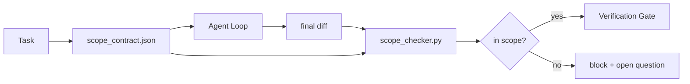

# Scope Contracts 与任务边界

> 模型不知道工作在哪里结束。scope contract 是一个按任务编写的文件，它说明工作从哪里开始、在哪里结束，以及如果越界该如何回滚。契约把“保持在范围内”从愿望变成检查。

**类型:** Build
**语言:** Python (stdlib)
**先修:** Phase 14 · 32 (Minimal Workbench), Phase 14 · 33 (Rules as Constraints)
**时间:** ~50 分钟

## 学习目标

- 编写一个代理在任务开始时读取、verifier 在任务结束时读取的 scope contract。
- 指定 allowed files、forbidden files、acceptance criteria、rollback plan 和 approval boundaries。
- 实现一个 scope checker，将 diff 与契约对比并标记违规。
- 让 scope creep 变得可见、自动且可评审。

## 要解决的问题

Agents 会蔓延。任务是“修复登录 bug”。diff 触及登录 route、email helper、database driver、README 和 release script。每一次触及在当时都有一个看似合理的理由。但放在一起，它们就变成了一个不同于已评审内容的改动。

Scope creep 是 agent work 中最缺乏监控的失败模式，因为代理会真诚地叙述每一步。修复方法不是更严格的 prompt。修复方法是磁盘上的契约：它说明承诺了什么，并用一个检查将结果与承诺对比。

## 核心概念



### scope contract 里放什么

| 字段 | 用途 |
|-------|---------|
| `task_id` | 链接到 board 上的任务 |
| `goal` | 评审者可以验证的一句话 |
| `allowed_files` | 代理可以写入的 globs |
| `forbidden_files` | 代理即使意外也绝不能触及的 globs |
| `acceptance_criteria` | 证明完成的测试命令或 assertion lines |
| `rollback_plan` | 如果需要 halt，operator 可以执行的一段回滚说明 |
| `approvals_required` | 范围外且需要明确人工 sign-off 的动作 |

没有 `forbidden_files` 的契约是不完整的。负空间是契约的一半。

### 使用 globs，而不是 raw paths

真实 repo 会移动文件。将契约固定到 globs（`app/**/*.py`、`tests/test_signup*.py`），这样会话之间发生 refactor 也不会让契约失效。

### Rollback 是 scope 的一部分

列出如何回滚，会迫使契约作者思考可能出错的地方。一个无法回滚的契约，就是不应该被批准的契约。

### Scope check 是 diff check

代理写出一个 diff。checker 读取 diff、allowed globs、forbidden globs，以及任何已运行 acceptance commands 的列表。每个违规都是一个带标签的 finding，verification gate 可以拒绝它。

### 两种 scope 高度：feature list 与 task contract

scope contract 限定一个任务。它不限定整个项目。代理可以在登录修复的契约内完美行动，但在下一轮又决定项目还需要 settings page、dark mode toggle，以及重写 router。契约从未被要求回答项目层面哪些工作在范围内，只被要求回答任务层面哪些文件在范围内。

第二种高度需要自己的原语：代理在会话开始时读取的 `feature_list.json`。它是项目 backlog 的机器可读、有序文件。代理只选择一个 `status` 为 `todo` 的 feature，把它的 `id` 写进 active scope contract，并被禁止在同一会话中开始第二个 feature。“一次只做一个 feature”不再是 prompt 中可被代理合理化绕过的一句话，而是它从磁盘读取的值，以及 gate 会执行的检查。

```json
{
  "project": "knowledge-base",
  "active": "import-pdf",
  "features": [
    { "id": "import-pdf",   "status": "in_progress", "goal": "import a PDF into the library",        "done_when": "pytest tests/test_import.py && a sample PDF appears in the library view" },
    { "id": "full-text-search", "status": "todo",     "goal": "search document text and rank hits",   "done_when": "query returns ranked results with snippets" },
    { "id": "cite-answers", "status": "todo",         "goal": "answers carry source citations",        "done_when": "every answer renders at least one clickable citation" }
  ]
}
```

| 字段 | 用途 |
|-------|---------|
| `active` | 当前会话可以触及的唯一 feature；为空表示选择一个并设置它 |
| `features[].id` | scope contract 的 `task_id` 指向的稳定 slug |
| `features[].status` | `todo`、`in_progress`、`done`、`blocked`；同一时间只能有一个 `in_progress` |
| `features[].goal` | 评审者可以验证的一句话 |
| `features[].done_when` | 将 `in_progress` 翻转为 `done` 的 acceptance line |

两条规则让这个 list 成为承重结构，而不是装饰。第一，不变量“最多一个 `in_progress`”本身就是 startup check（Phase 14 · 33）：如果 list 显示两个，会话会拒绝启动，直到人类解决。第二，feature list 是一个文件，不是聊天消息，因为聊天会滚出上下文，而文件会跨会话、跨代理持久存在。handoff（Phase 14 · 40）会把已完成 feature 的 status 写回 `done`，所以下一个会话打开的是准确 board，而不是重新推导还剩什么。

contract 与 list 通过 least privilege 组合，也就是下面描述的同一类 merge：task contract 的 `allowed_files` 必须落在 active feature 所触及的范围内，绝不能超出。

## 动手实现

`code/main.py` 实现：

- `scope_contract.json` schema（JSON Schema 子集，glob arrays）。
- 一个 diff parser，将 touched files 列表和 run commands 列表转换成 `RunSummary`。
- 一个 `scope_check`，它会根据契约返回 `(violations, in_scope, off_scope)`。
- 两个 demo runs：一个保持在 scope 内，一个发生 creep。checker 会用确切文件和原因标记 creep。

运行：

```text
python3 code/main.py
```

输出：contract、两个 runs、每次运行的 verdicts，以及保存的 `scope_report.json`。

## 真实生产中的模式

一位运行“specsmaxxing”（在调用代理之前用 YAML 编写 scope contracts）的实践者报告说，三周内 rabbit-hole rate 从 52% 降到 21%，且没有改变代理。起作用的是契约，不是模型。三个模式能让收益持续。

**Violation budgets，而不是二元失败。** `agent-guardrails`（Claude Code、Cursor、Windsurf、Codex 通过 MCP 使用的 OSS merge gate）为每个任务提供 `violationBudget`：预算内的轻微 scope slips 会作为 warnings 浮出；只有超过预算时，merge gate 才会拒绝。配合 `violationSeverity: "error" | "warning"` 使用。budget 是一个 gate 能真正交付，还是被厌恶它的团队禁用之间的差别。

**按 path family 做 severity asymmetry。** 对 `docs/**` 的 off-scope writes 通常是 `warn`；对 `scripts/**`、`migrations/**`、`config/prod/**` 的 off-scope writes 永远是 `block`。这种不对称必须存在于契约中，而不是 runtime 中，因为它是项目专用的，并且会随任务变化。

**Time 和 network budgets 应与 file budgets 并列。** `time_budget_minutes` 字段限定 wall clock；runtime 在没有重新审批时拒绝继续超时运行。hostname 上的 `network_egress` allowlist 防止代理悄悄访问并不属于任务的外部 API。这些也都是 scope 维度；file globs 是必要的，但并不充分。

**Multi-contract merge semantics（least privilege）。** 当两个 scope contracts 同时适用时（例如一个项目级 contract 加一个任务专用 contract），merge 方式是：**intersect** `allowed_files`（两个契约都必须允许该路径），**union** `forbidden_files`（任一契约可禁止），`time_budget_minutes` 取最严格值（min），`approvals_required` 累积。`network_egress` 中，`None` 表示不执行 enforcement，`[]` 表示 deny-all，`[...]` 表示 allowlist；merge 时，`None` 让位给另一边，两个 lists 取交集，deny-all 保持 deny-all。把这些写入 contract schema，让 merge 成为机械且可评审的动作。

## 实际使用

生产模式：

- **Claude Code slash commands。** `/scope` command 写入契约，并将它 pin 为 session context。Subagents 在行动前读取契约。
- **GitHub PRs。** 将契约作为 JSON 文件推送到 PR body 中，或作为 checked-in artifact。CI 针对 merge diff 运行 scope checker。
- **LangGraph interrupts。** scope violation 触发 interrupt；handler 询问人类是需要扩展契约，还是需要代理退回。

契约随任务移动。任务关闭时，契约会归档到 `outputs/scope/closed/`。

## 交付成果

`outputs/skill-scope-contract.md` 会为一个任务描述生成 scope contract，以及一个 glob-aware checker，它会在 CI 中对每个 agent diff 运行。

## 练习

1. 添加一个 `network_egress` 字段，列出允许的外部 hosts。拒绝触及其他 hosts 的 runs。
2. 扩展 checker，使其对 `docs/**` fail soft，对 `scripts/**` fail hard。说明这种不对称的理由。
3. 让 contract 用静态 rule set（不用 LLM）从 `goal` 字段推导 `allowed_files`。第一个 edge case 会出什么问题？
4. 添加 `time_budget_minutes`，并在 wall clock 超过它时拒绝继续。
5. 对同一个 diff 运行两个 contracts。二者都适用时，正确的 merge semantics 是什么？

## 关键术语

| 术语 | 人们常说 | 实际含义 |
|------|----------------|------------------------|
| Scope contract | “任务 brief” | 按任务编写的 JSON，列出 allowed/forbidden files、acceptance、rollback |
| Scope creep | “它还 touched...” | 同一任务中发生了 contract 外文件改动 |
| Rollback plan | “我们可以 revert” | 用于 halt 的一段 operator runbook |
| Approval boundary | “需要 sign-off” | contract 中列为需要明确人工审批的动作 |
| Diff check | “Path audit” | 将 touched files 与 contract globs 对比 |

## 延伸阅读

- [LangGraph human-in-the-loop interrupts](https://langchain-ai.github.io/langgraph/concepts/human_in_the_loop/)
- [OpenAI Agents SDK tool approval policies](https://platform.openai.com/docs/guides/agents-sdk)
- [logi-cmd/agent-guardrails — merge gates and scope validation](https://github.com/logi-cmd/agent-guardrails) — violation budgets、severity tiers
- [Dev|Journal, Preventing AI Agent Configuration Drift with Agent Contract Testing](https://earezki.com/ai-news/2026-05-05-i-built-a-tiny-ci-tool-to-keep-ai-agent-configs-from-drifting-in-my-repo/) — 无外部依赖的 `--strict` mode
- [Agentic Coding Is Not a Trap (production logs)](https://dev.to/jtorchia/agentic-coding-is-not-a-trap-i-answered-the-viral-hn-post-with-my-own-production-logs-33d9) — specsmaxxing receipts: 52% → 21%
- [OpenCode permission globs](https://opencode.ai/docs/agents/) — fine-grained per-permission scope
- [Knostic, AI Coding Agent Security: Threat Models and Protection Strategies](https://www.knostic.ai/blog/ai-coding-agent-security) — scope as part of least privilege
- [Augment Code, AI Spec Template](https://www.augmentcode.com/guides/ai-spec-template) — three-tier boundary system (must/ask/never)
- Phase 14 · 27 — 与 scope locks 搭配的 prompt injection defenses
- Phase 14 · 33 — 这个 contract 按任务专门化的 rule set
- Phase 14 · 38 — checker 报告流入的 verification gate
