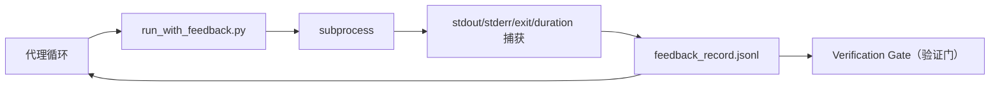

# 运行时反馈循环

> 看不到真实命令输出的代理只能猜。feedback runner 会把 stdout、stderr、exit code 和耗时捕获成结构化记录，下一轮可以读取它。于是代理响应事实，而不是响应自己对事实的预测。

**类型:** Build
**语言:** Python (stdlib)
**先修:** Phase 14 · 32 (Minimal Workbench), Phase 14 · 35 (Init Script)
**时间:** ~50 分钟

## 学习目标

- 区分 runtime feedback 与 observability telemetry。
- 构建一个 feedback runner，包裹 shell 命令并持久化结构化 record。
- 确定性地截断大型输出，让循环保持在 token budget 内。
- 当 feedback 缺失时拒绝推进循环。

## 要解决的问题

代理说“现在运行测试”。下一条消息说“所有测试通过”。现实是没有任何测试运行。代理想象了输出，或者它运行了命令却从未读取结果，或者它读了结果但静默截断了失败行。

feedback runner 会消除这个空隙。每个命令都通过 runner。每条 record 携带 command、捕获到的 stdout 和 stderr、exit code、wall-clock duration，以及一行 agent note。代理在下一轮读取该 record。verification gate 在任务结束时读取这些 record。

## 核心概念



### feedback record 里放什么

| 字段 | 为什么重要 |
|-------|----------------|
| `command` | 精确 argv，避免 shell expansion 带来的意外 |
| `stdout_tail` | 最后 N 行，确定性截断 |
| `stderr_tail` | 最后 N 行，与 stdout 分开 |
| `exit_code` | 无歧义的成功信号 |
| `duration_ms` | 暴露慢探针和失控进程 |
| `started_at` | 用于重放的时间戳 |
| `agent_note` | 代理写下的一行预期说明 |

### 截断是确定性的

50 MB log 会摧毁循环。runner 会捕获 head 和 tail，并插入 `...truncated N lines...` marker；过程是确定性的，所以相同输出始终产生相同 record。不要随机采样；代理需要看到的部分（最终错误、最终摘要）通常位于 tail。

### Feedback 与 telemetry

Telemetry（Phase 14 · 23，OTel GenAI conventions）服务于人类 operator，用于跨时间审查运行。Feedback 服务于本次运行的下一轮。二者共享字段，但存在不同文件中，并有不同保留周期。

### 没有 feedback 就拒绝推进

如果 runner 在捕获 exit 之前报错，record 会携带 `exit_code: null` 和 `error: <reason>`。agent loop 必须拒绝在 `null` exit 上声称成功。没有 exit，就没有进展。

## 动手实现

`code/main.py` 实现：

- `run_with_feedback(command, agent_note)`：包裹 `subprocess.run`，捕获 stdout/stderr/exit/duration，确定性截断，并追加到 `feedback_record.jsonl`。
- 一个小 loader，将 JSONL 流式读取为 Python list。
- 一个 demo，运行多个命令（成功、泄漏、失败、重试、缺失 binary），并打印每个命令的最后一条 record。

运行：

```bash
python3 code/main.py
```

输出：多条 feedback record 会追加到 `feedback_record.jsonl`，每类 record 的关键信息会直接打印。跨多次运行用 `tail` 查看这个文件，可以看到循环不断累积。

## 真实生产中的模式

三个模式能把 runner 硬化到足以交付。

**在写入时 redact，而不是在读取时 redact。** 任何触及 stdout 或 stderr 的 record 都可能泄漏 secret。runner 在追加 JSONL 之前运行一遍 redaction 流程：剥离匹配 `^Bearer `、`password=`、`api[_-]?key=`、`AKIA[0-9A-Z]{16}`（AWS）、`xox[baprs]-`（Slack）的行。只在读取时 redaction 是陷阱；磁盘上的文件才是攻击者能拿到的东西。每季度根据生产 runtime 中观察到的 secret 格式审计 redaction 规则。

**使用 rotation policy，而不是单个无限增长文件。** 将 `feedback_record.jsonl` 限制为每个文件 1 MB；溢出时 rotate 到 `.1`、`.2`，丢弃 `.5`。agent loop 只读取当前文件，所以运行时成本是有界的。CI artifact 存储保存轮转后的完整集合。没有 rotation，这个文件会成为每次 loader 调用的瓶颈。

**为 retry chain 记录 parent command id（父命令 ID）。** 每条 record 都获得 `command_id`；retry 携带 `parent_command_id` 指向上一次尝试。reviewer 的“失败尝试”列表（Phase 14 · 40）和 verification gate 的 audit 都会沿着这条 chain。没有这个链接，retry 看起来像彼此独立的成功，audit 会隐藏失败历史。

## 实际使用

生产模式：

- **Claude Code Bash tool。** 这个工具已经捕获 stdout、stderr、exit 和 duration。本课的 runner 是适用于任何 agent 产品、与框架无关的等价实现。
- **LangGraph node。** 用 runner 包裹任何 shell node，让 record 持久存在于 graph state 外部。
- **CI log。** 将 JSONL pipe 到你的 CI artifact 存储；reviewer 可以在不重新运行会话的情况下重放任意 command。

runner 是一层很薄的包装层，因为它拥有 record 的形状，所以能在每次框架迁移后幸存。

## 交付成果

`outputs/skill-feedback-runner.md` 会生成一个项目专用的 `run_with_feedback.py`，带正确的 truncation budget、连接到工作台的 JSONL writer，以及代理每轮读取的 loader。

## 练习

1. 为每条 record 添加一个 `cwd` 字段，这样从不同目录运行的相同命令可以被区分。
2. 添加一个 `redaction` step，剥离匹配 `^Bearer ` 或 `password=` 的行。在 fixture record 上测试。
3. 将 `feedback_record.jsonl` 总大小限制为 1 MB，并 rotate 到 `.1`、`.2` 文件。说明 rotation policy。
4. 添加 `parent_command_id`，让 retry chain 可见：哪个 command 产生了下一个 command 消费的输入。
5. 将 JSONL pipe 到一个小 TUI，突出显示最新的 non-zero exit。列出这个 TUI 在 review 中有用所必须显示的八个关键特性。

## 关键术语

| 术语 | 人们常说 | 实际含义 |
|------|----------------|------------------------|
| Feedback record（反馈记录） | “运行日志” | 带 command、output、exit、duration 的结构化 JSONL entry |
| Tail truncation（尾部截断） | “裁剪日志” | 确定性的 head+tail capture，让 record 能放进 token budget |
| Refuse-on-null | “缺数据就阻塞” | 当 `exit_code` 为 null 时，loop 不得推进 |
| Agent note | “预期标签” | 代理在读取结果前写下的一行预测 |
| Telemetry split（遥测拆分） | “两个日志文件” | Feedback 服务下一轮，telemetry 服务 operator |

## 延伸阅读

- [OpenTelemetry GenAI semantic conventions](https://opentelemetry.io/docs/specs/semconv/gen-ai/)
- [Anthropic, Effective harnesses for long-running agents](https://www.anthropic.com/engineering/effective-harnesses-for-long-running-agents)
- [Guardrails AI x MLflow — deterministic safety, PII, quality validators](https://guardrailsai.com/blog/guardrails-mlflow) — 将脱敏规则当作回归测试
- [Aport.io, Best AI Agent Guardrails 2026: Pre-Action Authorization Compared](https://aport.io/blog/best-ai-agent-guardrails-2026-pre-action-authorization-compared/) — pre/post-tool capture
- [Andrii Furmanets, AI Agents in 2026: Practical Architecture for Tools, Memory, Evals, Guardrails](https://andriifurmanets.com/blogs/ai-agents-2026-practical-architecture-tools-memory-evals-guardrails) — observability surfaces
- Phase 14 · 23 — telemetry 侧的 OTel GenAI conventions
- Phase 14 · 24 — agent observability platform（Langfuse、Phoenix、Opik）
- Phase 14 · 33 — 要求声明完成前必须有 feedback 的规则
- Phase 14 · 38 — 读取 JSONL 的 verification gate
