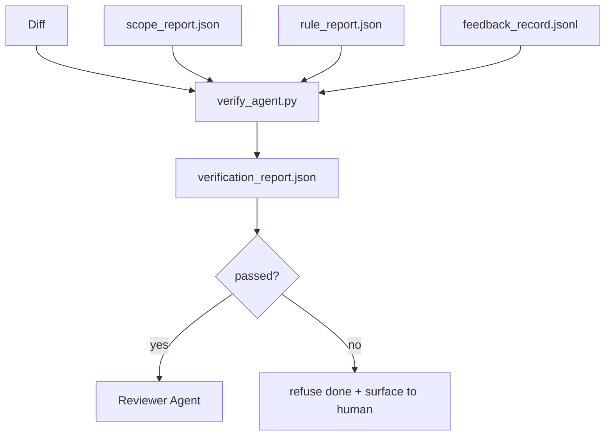

# Verification Gates

> 代理不能自己把自己的工作标记为完成。verification gate 会读取 scope contract、feedback log、rule report 和 diff，并回答一个问题：这个任务真的完成了吗？如果 gate 说没有，那么不管聊天里怎么说，任务都没有完成。

**类型:** Build
**语言:** Python (stdlib)
**先修:** Phase 14 · 33 (Rules), Phase 14 · 36 (Scope), Phase 14 · 37 (Feedback)
**时间:** ~55 分钟

## 学习目标

- 将 verification gate 定义为作用于 workbench artifacts 的确定性函数。
- 将 rule report、scope report、feedback records 和 diff 合并成一个 verdict。
- 发出一个 reviewer agent 和 CI 都能读取的 `verification_report.json`。
- 对任何 block-severity failure 无例外地拒绝推进任务。

## 要解决的问题

Agents 太容易声明成功。三种失败形状占主导：

- “Looks good.” 模型读了自己的 diff，然后决定它是正确的。
- “Tests passed.” 说得很自信。没有测试实际运行的记录。
- “Acceptance met.” Acceptance criteria 被解释得足够宽松，宽松到意味着“任何类似 done 的东西”。

工作台层面的修复是一道 verification gate：它读取代理已经产生的 artifacts，并作出判断。gate 是确定性的。gate 在版本控制中。gate 接入 CI。代理不能收买它。

## 核心概念



### gate 检查什么

| 检查 | 来源 artifact | 严重级别 |
|-------|-----------------|----------|
| 所有 acceptance commands 都已运行 | `feedback_record.jsonl` | block |
| 所有 acceptance commands 都以零退出 | `feedback_record.jsonl` | block |
| Scope check 没有 forbidden writes | `scope_report.json` | block |
| Scope check 没有 off-scope writes | `scope_report.json` | block or warn |
| 所有 block-severity rules 通过 | `rule_report.json` | block |
| feedback 中没有 `null` exit codes | `feedback_record.jsonl` | block |
| Touched files 匹配 `scope.allowed_files` | both | warn |

一个 `warn` finding 会给 verdict 添加标注；一个 `block` finding 会阻止 `passed: true`。

### 确定性，而不是概率性

对于同一组 artifact，gate 必须每次都产生相同 verdict。不要 LLM judges。LLM judges 属于 reviewer 侧（Phase 14 · 39），那里目标是定性 evaluation，而不是 status。

### 一个 report，一个 path

gate 在每次 task close-out 时发出一个 `verification_report.json`，写在 `outputs/verification/<task_id>.json` 下。CI 消费同一路径。多个 gate 加不同路径会 fork 真相来源。

### 无例外拒绝

Block-severity findings 不能被代理覆盖。它们只能由人类覆盖，并且需要记录 `override_reason` 和 `overridden_by` user id。override 是一次签名改动，不是代理决策。

## 动手实现

`code/main.py` 实现：

- 每个 input artifact 的 loader，都在本地 stub，使 lesson 自包含。
- 一个 `verify(task_id, artifacts) -> VerdictReport` pure function。
- 一个 printer，展示每项检查结果和最终 pass/fail。
- 一个包含三种 task scenarios 的 demo：clean pass、scope creep、missing acceptance。

运行：

```text
python3 code/main.py
```

输出：三个 verdict reports，每个都保存到脚本旁边。

## 真实生产中的模式

四个模式能把 gate 从“又一个 lint job”提升为“最终决定边界”。

**Defense-in-depth，而不是单一 gate。** Pre-commit hook → CI status check → pre-tool authz hook → pre-merge gate。每一层都是确定性的，所以一层漏掉的失败会被下一层捕获。microservices.io 的 2026 年 3 月 playbook 明确指出：pre-commit hook 是不可绕过的，因为它不像 model-side skill 那样依赖代理遵循指令。verification gate 位于 CI / pre-merge 层。

**用确定性检查做防御，model-judge 只处理 nuance。** Anthropic 的 2026 Hybrid Norm pairing：verifiable rewards（unit tests、schema checks、exit codes）回答“代码是否解决了问题？”——LLM rubrics 回答“代码是否可读、安全、符合风格？”gate 运行第一类；reviewer（Phase 14 · 39）运行第二类。把它们混在一起会让信号坍缩。

**Signed override log，而不是 Slack threads。** 每个 override 都会在 `outputs/verification/overrides.jsonl` 发出一行，包含：timestamp、finding code、reason、signing user、current HEAD commit。runtime 拒绝任何缺少 signature 的 override；audit trail 由 git 跟踪。这是 override policy 和 override theater 之间的分界线。

**Coverage floor 作为一等检查。** `coverage_report.json` 输入一个 `coverage_floor`（默认 80%）检查。如果 measured coverage 低于 floor，或比上一次 merge 的 floor 低超过 1 个百分点，gate 就失败。没有这个检查，agents 会悄悄删除失败的 tests，而 verification reports 仍然保持绿色。

**`--strict` mode 将 warns 提升为 blocks。** 对于 release branches、ship-blocking PRs 或 post-incident triage，`--strict` 会让每个 warning 都成为 hard fail。这个 flag 按 branch opt-in；不是全局默认，因为 strict-on-everything 会腐蚀日常流程。

## 实际使用

生产模式：

- **CI step。** `verify_agent` job 针对代理的 final artifacts 运行 gate。没有 `passed: true`，merge protection 就拒绝。
- **Pre-handoff hook。** agent runtime 在生成 handoff doc 之前调用 gate。没有绿色 verdict，就没有 handoff。
- **Manual triage。** 当代理声称成功而人类怀疑它时，operators 读取 report。

gate 是 workbench flow 中的决定边界。其他每个 surface 都在它上游。

## 交付成果

`outputs/skill-verification-gate.md` 会把 gate 接入一个具体项目：哪些 acceptance commands 输入它，哪些 rules 是 block-severity，哪些 off-scope writes 可被容忍，以及 override audit log 如何存储。

## 练习

1. 添加一个 `coverage_floor` 检查：test command 必须产生一个至少 80% 的 coverage report。决定由哪个 artifact 携带 floor。
2. 支持一个 `--strict` mode，将每个 `warn` 提升为 `block`。记录 strict mode 适合作为默认值的场景。
3. 让 gate 除 JSON 外还生成一个 Markdown summary。说明哪些字段应该进入 summary。
4. 添加一个 `time_since_last_human_touch` 检查：人类 keystroke 后 60 秒内编辑的任何文件，都免于 off-scope flags。
5. 在你产品的真实 agent diff 上运行 gate。有多少 findings 是真实的，有多少是 noise？gate 需要在哪里成长？

## 关键术语

| 术语 | 人们常说 | 实际含义 |
|------|----------------|------------------------|
| Verification gate | “阻止事情的检查” | 作用于 workbench artifacts、产生 pass/fail verdict 的确定性函数 |
| Block severity | “Hard fail” | 阻止 `passed: true` 且需要 signed override 的 finding |
| Override log | “我们为什么放它过去” | 带 reason 和 user id 的 signed entries，由 review 审计 |
| Acceptance command | “证明” | 其零退出定义 `done` 的 shell command |
| One report path | “Source of truth” | `outputs/verification/<task_id>.json`，由 CI 和 humans 共同消费 |

## 延伸阅读

- [Anthropic, Harness design for long-running application development](https://www.anthropic.com/engineering/harness-design-long-running-apps)
- [OpenAI Agents SDK guardrails](https://platform.openai.com/docs/guides/agents-sdk/guardrails)
- [microservices.io, GenAI dev platform: guardrails](https://microservices.io/post/architecture/2026/03/09/genai-development-platform-part-1-development-guardrails.html) — pre-commit 与 CI 之间的 defense in depth
- [ICMD, The 2026 Playbook for Agentic AI Ops](https://icmd.app/article/the-2026-playbook-for-agentic-ai-ops-guardrails-costs-and-reliability-at-scale-1776661990431) — approval-gate ladder（draft → approval → auto under thresholds）
- [Type-Checked Compliance: Deterministic Guardrails (arXiv 2604.01483)](https://arxiv.org/pdf/2604.01483) — 将 Lean 4 作为 deterministic gating 的上界
- [logi-cmd/agent-guardrails — merge gate spec](https://github.com/logi-cmd/agent-guardrails) — scope + mutation-testing gates
- [Guardrails AI x MLflow](https://guardrailsai.com/blog/guardrails-mlflow) — deterministic validators as CI scorers
- [Akira, Real-Time Guardrails for Agentic Systems](https://www.akira.ai/blog/real-time-guardrails-agentic-systems) — pre/post-tool gates
- Phase 14 · 27 — prompt injection defenses（gate 的 adversarial pair）
- Phase 14 · 36 — 这个 gate 执行的 scope contract
- Phase 14 · 37 — 这个 gate 打分的 feedback log
- Phase 14 · 39 — gate handoff 到的 reviewer agent
