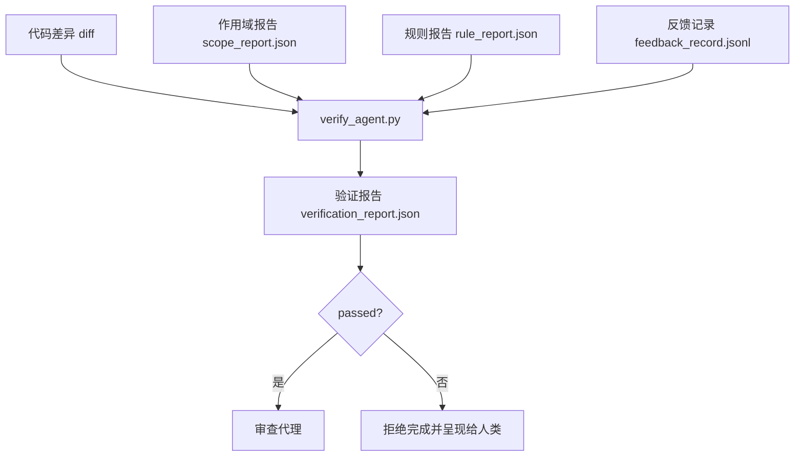

# 验证门

> 代理不能自己把自己的工作标记为完成。验证门（verification gate）会读取作用域契约（scope contract）、反馈日志（feedback log）、规则报告（rule report）和 diff，并回答一个问题：这个任务真的完成了吗？如果 gate 说没有，那么不管聊天里怎么说，任务都没有完成。

**类型:** Build
**语言:** Python (stdlib)
**先修:** Phase 14 · 33 (Rules), Phase 14 · 36 (Scope), Phase 14 · 37 (Feedback)
**时间:** ~55 分钟

## 学习目标

- 将验证门定义为作用于工作台 artifact 的确定性函数。
- 将规则报告、作用域报告、反馈记录和 diff 合并成一个判定（verdict）。
- 发出一份审查代理（reviewer agent）和 CI 都能读取的 `verification_report.json`。
- 对任何阻断级失败无例外地拒绝推进任务。

## 要解决的问题

代理太容易声明成功。三种失败形状占主导：

- “看起来不错。” 模型读了自己的 diff，然后决定它是正确的。
- “测试通过。” 说得很自信。没有测试实际运行的记录。
- “验收已满足。” 验收标准被解释得足够宽松，宽松到意味着“任何类似完成的东西”。

工作台层面的修复是一道验证门：它读取代理已经产生的 artifact，并作出判断。gate 是确定性的。gate 在版本控制中。gate 接入 CI。代理不能收买它。

## 核心概念



### gate 检查什么

| 检查 | 来源 artifact | 严重级别 |
|-------|-----------------|----------|
| 所有验收命令都已运行 | `feedback_record.jsonl` | block |
| 所有验收命令都以零退出 | `feedback_record.jsonl` | block |
| 作用域检查没有禁止写入 | `scope_report.json` | block |
| 作用域检查没有越界写入 | `scope_report.json` | block 或 warn |
| 所有阻断级规则都通过 | `rule_report.json` | block |
| 反馈记录中没有 `null` 退出码 | `feedback_record.jsonl` | block |
| 改动文件匹配 `scope.allowed_files` | 两者 | warn |

一个 `warn` 级发现会给判定添加标注；一个 `block` 级发现会阻止 `passed: true`。

### 确定性，而不是概率性

对于同一组 artifact，gate 必须每次都产生相同 verdict。不要在 gate 里放 LLM judge。LLM judge 应当留在 reviewer 侧（Phase 14 · 39），那里目标是定性评估，而不是状态判定。

### 一份报告，一个路径

gate 在每次任务收尾时发出一份 `verification_report.json`，写在 `outputs/verification/<task_id>.json` 下。CI 消费同一路径。多个 gate 使用不同路径会分叉真相来源。

### 无例外拒绝

阻断级发现不能被代理覆盖。它们只能由人类覆盖，并且需要记录 `override_reason` 和 `overridden_by` 用户 id。override 是一次签名改动，不是代理决策。

## 动手实现

`code/main.py` 实现：

- 每类输入 artifact 的加载器都在本地 stub，使课程自包含。
- 一个 `verify(task_id, artifacts) -> VerdictReport` 纯函数。
- 一个打印器，展示每项检查结果和最终通过/失败。
- 一个包含三种任务场景的 demo：干净通过、作用域蔓延、缺失验收。

运行：

```text
python3 code/main.py
```

输出：三份验证报告，每份都保存到脚本旁边。

## 真实生产中的模式

四个模式能把 gate 从“又一个 lint 任务”提升为“最终决定边界”。

**纵深防御（defense-in-depth），而不是单一 gate。** 预提交 hook → CI 状态检查 → 工具调用前授权 hook → 合并前 gate。每一层都是确定性的，所以一层漏掉的失败会被下一层捕获。microservices.io 的 2026 年 3 月 playbook 明确指出：预提交 hook 是不可绕过的，因为它不像模型侧 skill 那样依赖代理遵循指令。验证门位于 CI / 合并前这一层。

**用确定性检查做防御，模型裁判（model-judge）只处理细微判断。** Anthropic 的 2026 Hybrid Norm pairing：可验证奖励（单元测试、schema 检查、退出码）回答“代码是否解决了问题？”；LLM rubric 回答“代码是否可读、安全、符合风格？”gate 运行第一类；reviewer（Phase 14 · 39）运行第二类。把它们混在一起会让信号坍缩。

**签名 override 日志（signed override log），而不是 Slack 线程。** 每个 override 都会在 `outputs/verification/overrides.jsonl` 发出一行，包含：timestamp、finding code、reason、signing user、current HEAD commit。运行时拒绝任何缺少 signature 的 override；审计轨迹由 git 跟踪。这是 override 策略和“走过场式 override”之间的分界线。

**覆盖率下限（coverage floor）作为一等检查。** `coverage_report.json` 输入一个 `coverage_floor`（默认 80%）检查。如果实测覆盖率低于下限，或比上一次 merge 的下限低超过 1 个百分点，gate 就失败。没有这个检查，代理会悄悄删除失败的测试，而验证报告仍然保持绿色。

**`--strict` mode 将 warn 提升为 block。** 对于发布分支、阻塞发布的 PR 或事故后分诊，`--strict` 会让每个 warning 都成为硬失败。这个 flag 按分支选择开启；不是全局默认，因为“所有场景都 strict”会腐蚀日常流程。

## 实际使用

生产模式：

- **CI 步骤。** `verify_agent` job 针对代理的最终 artifact 运行 gate。没有 `passed: true`，merge protection 就拒绝。
- **移交前 hook。** agent runtime 在生成交接文档之前调用 gate。没有绿色判定，就没有 handoff。
- **人工分诊。** 当代理声称成功而人类怀疑它时，operator 读取报告。

gate 是 workbench flow 中的决定边界。其他每个交互面都在它上游。

## 交付成果

`outputs/skill-verification-gate.md` 会把 gate 接入一个具体项目：哪些验收命令输入它，哪些规则是阻断级，哪些越界写入可被容忍，以及 override 审计日志如何存储。

## 练习

1. 添加一个 `coverage_floor` 检查：测试命令必须产生一份至少 80% 的覆盖率报告。决定由哪个 artifact 携带 floor。
2. 支持一个 `--strict` mode，将每个 `warn` 提升为 `block`。记录 strict mode 适合作为默认值的场景。
3. 让 gate 除 JSON 外还生成一份 Markdown 摘要。说明哪些字段应该进入摘要。
4. 添加一个 `time_since_last_human_touch` 检查：人类按键后 60 秒内编辑的任何文件，都免于越界 flag。
5. 在你产品的真实代理 diff 上运行 gate。有多少 finding 是真实问题，有多少只是噪声？gate 需要在哪里成长？

## 关键术语

| 术语 | 人们常说 | 实际含义 |
|------|----------------|------------------------|
| 验证门（Verification gate） | “阻止事情的检查” | 作用于 workbench artifact、产生通过/失败判定的确定性函数 |
| 阻断严重级别（Block severity） | “硬失败” | 阻止 `passed: true` 且需要签名 override 的 finding |
| Override log | “我们为什么放它过去” | 带 reason 和 user id 的 signed entry，由审查流程审计 |
| 验收命令（Acceptance command） | “证明” | 零退出才定义为 `done` 的 shell 命令 |
| 单一报告路径（One report path） | “单一真相来源” | `outputs/verification/<task_id>.json`，由 CI 和人类共同消费 |

## 延伸阅读

- [Anthropic, Harness design for long-running application development](https://www.anthropic.com/engineering/harness-design-long-running-apps)
- [OpenAI Agents SDK guardrails](https://platform.openai.com/docs/guides/agents-sdk/guardrails)
- [microservices.io, GenAI dev platform: guardrails](https://microservices.io/post/architecture/2026/03/09/genai-development-platform-part-1-development-guardrails.html) — pre-commit 与 CI 之间的纵深防御
- [ICMD, The 2026 Playbook for Agentic AI Ops](https://icmd.app/article/the-2026-playbook-for-agentic-ai-ops-guardrails-costs-and-reliability-at-scale-1776661990431) — approval-gate ladder（draft → approval → auto under thresholds）
- [Type-Checked Compliance: Deterministic Guardrails (arXiv 2604.01483)](https://arxiv.org/pdf/2604.01483) — 将 Lean 4 作为确定性 gating 的上界
- [logi-cmd/agent-guardrails — merge gate spec](https://github.com/logi-cmd/agent-guardrails) — 作用域 gate 与 mutation-testing gate
- [Guardrails AI x MLflow](https://guardrailsai.com/blog/guardrails-mlflow) — 把确定性 validator 用作 CI 打分器
- [Akira, Real-Time Guardrails for Agentic Systems](https://www.akira.ai/blog/real-time-guardrails-agentic-systems) — 工具调用前/后的 gate
- Phase 14 · 27 — prompt injection 防御（gate 的对抗搭档）
- Phase 14 · 36 — 这个 gate 执行的 scope contract
- Phase 14 · 37 — 这个 gate 打分的 feedback log
- Phase 14 · 39 — gate 移交给的 reviewer agent
