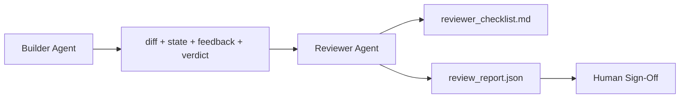

# Reviewer Agent：将 Builder 与 Marker 分开

> 写代码的代理不能给它自己的代码打分。reviewer 是第二个循环，带着不同的 system prompt、不同的目标，并且对 builder 产生的一切只有只读访问权。builder 与 reviewer 之间的间隙，正是大多数可靠性所在。

**类型:** Build
**语言:** Python (stdlib)
**先修:** Phase 14 · 38 (Verification Gate)
**时间:** ~55 分钟

## 学习目标

- 说明为什么同一个代理不能可靠地评审自己的工作。
- 构建一个 reviewer agent loop，消费 builder artifacts 并发出结构化 review report。
- 编写 reviewer rubric，按具体维度评分，而不是按感觉评分。
- 将 reviewer 接入 workbench，让 human review step 从真实 artifact 开始。

## 要解决的问题

你让代理修复一个 bug。它编辑四个文件，运行测试，并报告完成。verification gate（Phase 14 · 38）确认 acceptance 已运行且 scope 保持住了。gate 说 `passed: true`。你 merge。两天后你发现，这个修复解决了 bug 的错误一半。

Acceptance 是必要的，但不充分。reviewer 会问 acceptance 无法询问的问题：这是否解决了正确的问题？它是否在没有标记的情况下扩展了 scope？它是否记录了本该被质疑的 assumptions？它是否让 workbench 处于下个会话可以接手的状态？

## 核心概念



### Reviewer rubric

五个维度，每个维度从 0 到 2 打分。

| 维度 | 问题 |
|-----------|----------|
| Problem fit | 这次改动解决的是任务陈述的问题，而不是附近的另一个任务吗？ |
| Scope discipline | edits 被限制在 contract 内了吗，或者 contract 是被有意扩展的吗？ |
| Assumptions | 所有 hidden assumptions 是否都写在某个可评审的位置？ |
| Verification quality | acceptance command 是否真的证明了 goal，还是只证明了一个更弱版本？ |
| Handoff readiness | 下一个会话能否从当前 state 干净地接手？ |

总分 10 分。低于 7 分是 soft fail；低于 5 分是 hard fail。

### reviewer 是独立角色，不是独立模型

你可以用和 builder 相同的 model 来运行 reviewer。纪律在于角色分离：不同 system prompt、不同 inputs、对 diff 没有 write access。姿态的变化就是信号的变化。

### reviewer 不能编辑 diff

reviewer 读取 diff、state、feedback、verdict。它写 report。它不 patch diff。如果 report 说“fix this”，下一轮 builder 负责修复；reviewer 回到评审。混合角色会击败这道间隙。

### Reviewer rubric 与 verification gate

gate（Phase 14 · 38）检查确定性事实：acceptance 是否运行、rules 是否通过、scope 是否保持。reviewer 做定性判断：这是否是正确的工作，是否有文档记录，handoff 是否可用。两者都必需。

## 动手实现

`code/main.py` 实现：

- 一个 `ReviewerInputs` dataclass，打包 reviewer 读取的 artifacts。
- 一个 rubric scorer，每个维度一个函数。每个函数都是确定性的，并且为了本课做了 stub-grade；真实实现会调用 LLM。
- 一个 `review_report.json` writer，包含五个 scores、total 和 verdict（`pass`、`soft_fail`、`hard_fail`）。
- 两个 demo cases：一个 clean change，以及一个“right tests, wrong problem” change。

运行：

```text
python3 code/main.py
```

输出：两个 review reports 写入磁盘，并在 console 中打印一个 dimensional scores 表。

## 真实生产中的模式

证据：Cloudflare 的 2026 年 4 月 AI Code Review system 在 30 天内跨 5,169 个 repos、48,095 个 merge requests 运行了 131,246 次 review runs。review 完成时间中位数为 3 分 39 秒。最多七个 specialist reviewers（security、performance、code quality、docs、release management、compliance、Engineering Codex）在一个 Review Coordinator 之下并行运行，由 coordinator 去重 findings 并判断 severity。顶级 model 只保留给 coordinator；specialists 运行在更便宜 tiers 上。

四个模式让它能规模化工作。

**Specialist pool，而不是一个巨大 reviewer。** 带 5 维 rubric 的单个 reviewer 适合 solo repos。一旦 codebase 拥有 security-critical、performance-critical 和 docs surfaces，就拆成 prompts 更小的 specialists。coordinator 负责 deduplication；specialists 从不运行完整 rubric。Model-tier separation 会自然出现：便宜 specialists，昂贵 coordinator。

**Bias mitigation 是设计要求，不是优化项。** LLM judges 表现出四种可靠 biases（Adnan Masood，2026 年 4 月）：position bias（GPT-4 在 (A,B) 与 (B,A) ordering 上约 40% 不一致）、verbosity bias（更长输出约有 15% score inflation）、self-preference（judges 偏好同 model family 的 outputs）、authority（judges 会高估对知名作者的 references）。缓解方法：评估两种 ordering，只统计 consistent wins；使用 1-4 scales，并显式奖励简洁；跨 model families 轮换 judges；评分前移除 author names。

**Calibration set，而不是 vibes。** 准备 10-20 个历史 tasks，带已知 correct verdicts。每次 prompt change 都在其上运行 reviewer。如果与历史记录的一致率低于 80%，rubric 需要在 reviewer 交付前修订。每个团队最终都会重新发现这一点；最好一开始就这样做。

**与 gate 组成 Hybrid norm。** Verification gate（Phase 14 · 38）处理确定性检查（acceptance 是否运行、tests 是否通过、scope 是否保持）。Reviewer 处理语义检查（这是否是正确工作、assumptions 是否记录、handoff 是否可用）。Anthropic 的 2026 指导明确强调这个分离：不要让 reviewer 重做 gate 已经证明的东西。

## 实际使用

生产模式：

- **Claude Code subagents。** reviewer subagent 在 builder 关闭任务后运行。它会在 PR 上发布带 rubric scores 的 comment。
- **OpenAI Agents SDK handoffs。** Builder 在任务完成时 hand off 给 Reviewer。Reviewer 可以带 findings 列表交回，或上交给 human。
- **Two-model pairing。** Builder 运行在更快、更便宜的 model 上。Reviewer 运行在更强的 model 上，context 更小，专注 judgment。

reviewer 是当 humans 无法亲自做每次 review 时，workbench 长出的第二双眼睛。

## 交付成果

`outputs/skill-reviewer-agent.md` 会生成一个项目专用 reviewer rubric、一个接入 builder artifacts 的 reviewer agent stub，以及与 verification gate 的集成，这样 human review 会从 written report 开始，而不是从空白页开始。

## 练习

1. 添加第六个与你产品领域相关的维度。说明为什么它不能被现有五个维度吸收。
2. 用两个不同 system prompts（terse、verbose）运行 reviewer。哪一个生成的人类更可能阅读的 report？
3. 为每个维度添加一个 `confidence` 字段。当最低维度的 confidence 低于 0.6 时，拒绝交付 report。
4. 构建一个 calibration set：10 个历史 task close-outs，带已知 correct verdicts。在它们上运行 reviewer。它在哪些地方与历史记录不一致？
5. 添加一个“request more evidence” affordance：reviewer 可以在评分前要求 builder 运行一个具体 test。正确的 back-off 是什么，才能避免循环？

## 关键术语

| 术语 | 人们常说 | 实际含义 |
|------|----------------|------------------------|
| Reviewer rubric | “Checklist” | 五维 0-2 scoring，每个维度有一个 written question |
| Soft fail | “Needs revisions” | 总分低于 7；builder 获得需要处理的 findings |
| Hard fail | “Reject” | 总分低于 5，或任意维度为 0；halt 并呈现给 human |
| Role separation | “Different prompt” | 同一 model 可扮演两个角色；纪律在 inputs 和 posture |
| Confidence floor | “不要交付低信号 reports” | 当 rubric 不确定时拒绝发出 verdict |

## 延伸阅读

- [OpenAI Agents SDK handoffs](https://platform.openai.com/docs/guides/agents-sdk/handoffs)
- [Anthropic Claude Code subagents](https://docs.anthropic.com/en/docs/agents-and-tools/claude-code/sub-agents)
- [Cloudflare, Orchestrating AI Code Review at Scale](https://blog.cloudflare.com/ai-code-review/) — 7-specialist + coordinator architecture，131k runs / 30 days
- [Agent-as-a-Judge: Evaluating Agents with Agents (OpenReview / ICLR)](https://openreview.net/forum?id=DeVm3YUnpj) — DevAI benchmark，366 hierarchical solution requirements
- [Adnan Masood, Rubric-Based Evaluations and LLM-as-a-Judge: Methodologies, Biases, Empirical Validation](https://medium.com/@adnanmasood/rubric-based-evals-llm-as-a-judge-methodologies-and-empirical-validation-in-domain-context-71936b989e80) — 4 biases and mitigations
- [MLflow, LLM-as-a-Judge Evaluation](https://mlflow.org/llm-as-a-judge) — production tooling for separated builder/evaluator
- [LangChain, How to Calibrate LLM-as-a-Judge with Human Corrections](https://www.langchain.com/articles/llm-as-a-judge) — calibration-set workflow
- [Evidently AI, LLM-as-a-judge: a complete guide](https://www.evidentlyai.com/llm-guide/llm-as-a-judge)
- [Arize, LLM as a Judge — Primer and Pre-Built Evaluators](https://arize.com/llm-as-a-judge/)
- Phase 14 · 05 — Self-Refine and CRITIC（single-agent self-review baseline）
- Phase 14 · 30 — Eval-driven agent development（calibration set generator）
- Phase 14 · 38 — reviewer 读取的 verification gate
- Phase 14 · 40 — reviewer report 输入的 handoff packet
