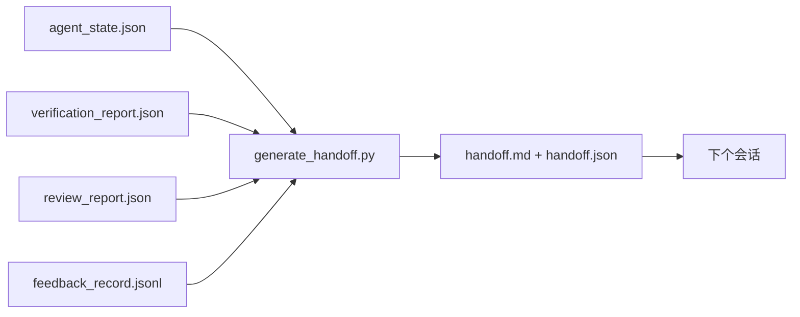

# 多会话交接

> 会话会结束。工作不会。交接包这个工件，会把“agent 工作了一个小时”变成“下一个会话第一分钟就能高效推进”。要有意识地构建它，而不是事后补一段总结。

**类型：** 构建
**语言：** Python (stdlib)
**先修：** Phase 14 · 34 (Repo Memory), Phase 14 · 38 (Verification), Phase 14 · 39 (Reviewer)
**时间：** ~50 分钟

## 学习目标

- 识别每个交接包都需要的七个字段。
- 从 workbench 工件生成交接，而不是手写说明文字。
- 将庞大的 feedback 日志裁剪成交接大小的摘要。
- 让下一个会话的第一个动作变得确定。

## 要解决的问题

会话结束了。agent 说“很好，我们取得了进展。”下一个会话打开。下一个 agent 问“我们上次停在哪里？”第一个 agent 的答案已经消失了。下一个 agent 重新发现、重新运行相同命令、重新向人类询问相同问题，然后花三十分钟恢复上一个会话最后三十秒的状态。

糟糕交接的成本会在任务生命周期中的每个会话里反复支付。修复方式是在会话结束时自动生成一个包：改了什么、为什么改、尝试过什么、什么失败了、还剩什么、下次第一步做什么。

## 核心概念



### 每个交接都携带的七个字段

| 字段 | 它回答的问题 |
|-------|---------------------|
| `summary` | 已完成工作的单段摘要 |
| `changed_files` | 一眼看清 diff |
| `commands_run` | 实际执行过什么 |
| `failed_attempts` | 尝试过什么，以及为什么没有奏效 |
| `open_risks` | 下个会话可能踩到什么坑，并附严重程度 |
| `next_action` | 下个会话要采取的第一个具体步骤 |
| `verdict_pointer` | 指向 verification + review reports 的路径 |

`next_action` 字段是承重字段。一个交接如果除了 `next_action` 什么都有，那它是状态报告，不是交接。

### 交接是生成出来的，不是写出来的

手写交接，就是那种一遇到艰难日子就会被跳过的交接。生成器读取 workbench 工件并产出交接包。agent 的职责是让 workbench 处于生成器能够摘要的状态，而不是亲自写摘要。

### 两种形式：人类可读和机器可读

`handoff.md` 是给人读的。`handoff.json` 是下一个 agent 加载的。二者来自同一组源工件。如果它们发生分歧，以 JSON 为准。

### Feedback 日志裁剪

完整的 `feedback_record.jsonl` 可能有数百条记录。交接只携带最后 K 条，以及每条非零退出记录。下一个会话如果需要，可以加载完整日志，但交接包保持小巧。

### 留下干净状态

交接描述工作。干净状态让工作可恢复。它们不是同一件事。如果下一个会话打开时看到的是半应用的 diff、agent 忘掉的临时文件、游离分支，以及还没开始跑就报错的测试，那么再完美的 `handoff.md` 也毫无价值。下一个 agent 会先花十分钟替上一个会话收拾残局，而不是继续构建；这个成本会在任务生命周期中的每个会话里复利增长。

所以会话不是在功能能跑时结束。它结束于 workbench 处在生成器可摘要、下个会话可信任的状态时。清理是它自己的阶段，在交接之前运行；它是一次检查，而不是习惯，因为习惯正是艰难日子里会被跳过的东西。

| 检查 | 干净意味着 | 脏状态会阻塞，因为 |
|-------|-------------|----------------------|
| 工作树（working tree） | 每个改动都已提交，或带注释明确 stash | 半应用的 diff 在下一个 agent 看来像是有意为之的工作 |
| 临时产物 | 没有 `*.tmp`、scratch dirs、debug prints，或遗留的注释块 | 零散文件会污染 diff 和下一个 agent 的心智模型 |
| 测试 | 绿色；或红色但失败已在 `open_risks` 中点名 | 静默的红色测试是下个会话会踩进去的陷阱 |
| 功能看板 | `feature_list.json` 状态反映现实（Phase 14 · 36） | 过期看板会把下个会话派去做已经完成的工作 |
| 分支 | 位于预期分支，没有 detached HEAD，没有孤儿分支 | 分支错误意味着下个会话的第一笔提交会落到错误位置 |

清理阶段会产出一个 `clean_state.json`，里面列出阻塞问题；空列表是交接生成器在写包之前断言的前置条件。建立在脏树上的交接不是交接，而是转发出去的混乱。两个工件配对出现：清理证明 workbench 可以安全离开，交接证明下个会话知道从哪里开始。

## 动手实现

`code/main.py` 实现：

- 一个 loader，将 state、verdict、review 和 feedback 汇总为单个 `WorkbenchSnapshot`。
- 一个 `generate_handoff(snapshot) -> (markdown, payload)` 函数。
- 一个过滤器，选取最后 K 条 feedback 记录以及所有非零退出记录。
- 一个演示运行，在脚本旁边写出 `handoff.md` 和 `handoff.json`。

运行：

```text
python3 code/main.py
```

输出：打印出的交接正文，以及磁盘上的两个文件。

## 生产中的模式

Codex CLI、Claude Code 和 OpenCode 各自提供不同的 compaction 方案；结构化交接包位于三者之上。

**Compaction 策略会变；交接包 schema 不变。** Codex CLI 的 POST /v1/responses/compact 是服务端不透明 AES blob（OpenAI 模型的快速路径）；fallback 是本地 “handoff summary”，作为 `_summary` user-role message 追加进去。Claude Code 在 context 达到 95% 时运行五阶段渐进式 compaction。OpenCode 使用基于 timestamp 的 message hiding，加上 5 个标题的 LLM summary。三种不同机制，同一个需求：把压缩后幸存的内容序列化成可移植工件。这个交接包就是那个工件。

**fresh-session 交接不是 compaction。** Compaction 延长一个会话；handoff 干净地关闭一个会话并启动下一个。Hermes Issue #20372（2026 年 4 月）的 framing 是对的：当原地压缩开始让质量退化时，agent 应该写出紧凑交接，结束会话，并在 fresh context 中恢复。交接包让这个转换变得便宜。错误做法是一直压缩到质量崩塌；修复方式是为早期、干净的交接预留预算。

**每个 branch 和 topic 只保留一个 active handoff。** 多 agent 协作更多是因为过期交接而崩，而不是因为模型输出差。始终包含 `branch`、`last_known_good_commit`，以及 `active | superseded | archived` 之一的 `status`。过期交接会被归档；只有 active 的那个驱动下一个会话。这就是 handoff-as-notes 和 handoff-as-state 的区别。

**在 50-75% context 前收尾，不要等到撞墙。** 手写模式 playbook（CLAUDE.md + HANDOVER.md）报告说，在 50-75% context budget 时结束会话，比在 95% 时结束效果更好。交接生成器会在压缩伪影污染源状态之前干净运行。context 还完整时写起来很便宜；模型已经找不到位置时就很贵。

## 实际使用

生产模式：

- **会话结束 hook。** 用户关闭聊天时，runtime 触发生成器。交接包进入 `outputs/handoff/<session_id>/`。
- **PR 模板。** 生成器产出的 markdown 也可以作为 PR body。Reviewer 不用打开另外五个文件就能阅读它。
- **跨 agent 交接。** 用一个产品构建（Claude Code），用另一个产品继续（Codex）。交接包是通用语言。

这个包很小、规整、生产成本低。节省的成本会随每个会话复利累积。

## 交付成果

`outputs/skill-handoff-generator.md` 会生成一个针对项目工件路径调好的生成器、一个运行它的 end-of-session hook，以及下一个 agent 启动时读取的 `handoff.json` schema。

## 练习

1. 添加一个 `assumptions_to_validate` 字段，浮现 builder 记录过但 reviewer 没有打到 1 分以上的每个假设。
2. 对失败运行和通过运行采用不同的 feedback summary 裁剪方式。为这种不对称辩护。
3. 加入一个“给人类的问题”列表。一个问题进入交接包而不是聊天消息的阈值是什么？
4. 让生成器幂等：运行两次产出同一个包。哪些东西必须稳定才能成立？
5. 添加一个“下个会话先修条件”章节，准确列出下个会话在行动前必须加载的工件。

## 关键术语

| 术语 | 人们常说 | 实际含义 |
|------|----------------|------------------------|
| 交接包（handoff packet） | “会话摘要” | 携带七个字段的生成工件，同时有 markdown 和 JSON |
| 下个动作（next action） | “先做什么” | 启动下个会话的那个具体步骤 |
| feedback 裁剪 | “日志摘要” | 最后 K 条记录加上每条非零退出 |
| 状态报告（status report） | “我们做了什么” | 缺少 `next_action` 的文档；有用，但不是交接 |
| 判定指针（verdict pointer） | “回执” | 指向 verification + review reports 的路径，用于可追溯性 |

## 延伸阅读

- [Anthropic, Effective harnesses for long-running agents](https://www.anthropic.com/engineering/effective-harnesses-for-long-running-agents)
- [OpenAI Agents SDK handoffs](https://platform.openai.com/docs/guides/agents-sdk/handoffs)
- [Codex Blog, Codex CLI Context Compaction: Architecture, Configuration, Managing Long Sessions](https://codex.danielvaughan.com/2026/03/31/codex-cli-context-compaction-architecture/) — POST /v1/responses/compact 和本地 fallback
- [Justin3go, Shedding Heavy Memories: Context Compaction in Codex, Claude Code, OpenCode](https://justin3go.com/en/posts/2026/04/09-context-compaction-in-codex-claude-code-and-opencode) — 三家 vendor 的 compaction 对比
- [JD Hodges, Claude Handoff Prompt: How to Keep Context Across Sessions (2026)](https://www.jdhodges.com/blog/ai-session-handoffs-keep-context-across-conversations/) — CLAUDE.md + HANDOVER.md, 50-75% context budget
- [Mervin Praison, Managing Handoffs in Multi-Agent Coding Sessions: Fresh Context Without Losing Continuity](https://mer.vin/2026/04/managing-handoffs-in-multi-agent-coding-sessions-fresh-context-without-losing-continuity/) — 分布式系统视角
- [Hermes Issue #20372 — automatic fresh-session handoff when compression becomes risky](https://github.com/NousResearch/hermes-agent/issues/20372)
- [Hermes Issue #499 — Context Compaction Quality Overhaul](https://github.com/NousResearch/hermes-agent/issues/499) — Codex CLI 中交接导向的 prompts
- [Microsoft Agent Framework, Compaction](https://learn.microsoft.com/en-us/agent-framework/agents/conversations/compaction)
- [OpenCode, Context Management and Compaction](https://deepwiki.com/sst/opencode/2.4-context-management-and-compaction)
- [LangChain, Context Engineering for Agents](https://www.langchain.com/blog/context-engineering-for-agents)
- Phase 14 · 34 — 生成器读取的 state file
- Phase 14 · 38 — 交接包指向的 verification verdict
- Phase 14 · 39 — 打包进交接的 reviewer report
