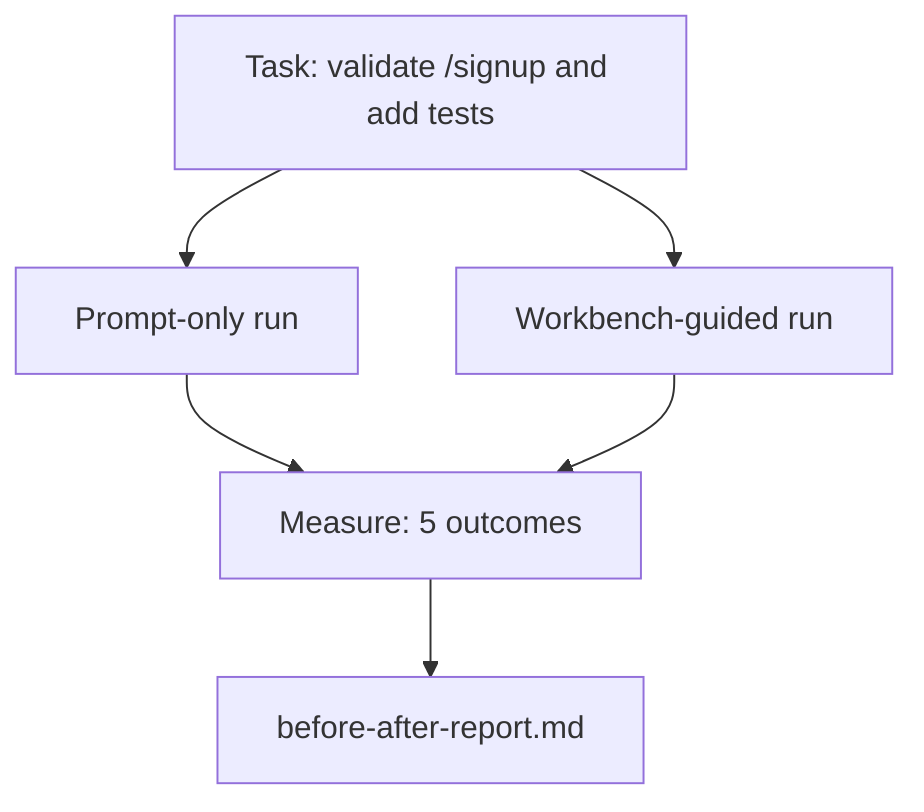

# 真实 Repo 上的 Workbench

> 十一节关于 surface 的课，如果不能经受真实 codebase 的接触，就一文不值。本课会在一个小型示例 app 上把同一项任务跑两遍：prompt-only 与 workbench-guided。让数字来辩论。

**类型：** 构建
**语言：** Python (stdlib)
**先修：** Phases 14 · 32 to 14 · 40
**时间：** ~60 分钟

## 学习目标

- 在一个小应用中汇合七个 workbench surface。
- 将同一项任务运行两遍（prompt-only 和 workbench-guided），并衡量五个结果。
- 阅读 before/after report，并判断哪些 surface 带来了最大杠杆。
- 面对“但我的模型已经足够好”的质疑，为 workbench 辩护。

## 要解决的问题

玩具任务上的 demo 说服不了任何人。当一个有真实感的任务在一个有真实感的 repo 上，以更少失败、更少 revert、以及下个会话能使用的交接包进入生产时，workbench 的论据才成立。

这节课会交付那个有真实感的 repo，并让同一项任务通过两条 pipeline。结果是一份 before/after report，你可以把它交给怀疑者。

## 核心概念



### 示例 app

`sample_app/` 中的最小 FastAPI 风格 handler：

- `app.py`，包含 `/signup`（尚无验证）。
- `test_app.py`，包含一个 happy-path test。
- `README.md` 和 `scripts/release.sh`，作为 forbidden-zone bait。

### 任务

> 为 `/signup` 添加输入验证：拒绝短于 8 个字符的密码，返回 422 和 typed error envelope。添加一个测试证明新行为。

### 两条 pipeline

Prompt-only：

1. 阅读 README。
2. 阅读 `app.py`。
3. 编辑文件。
4. 宣称完成。

Workbench-guided：

1. 运行 init script（Lesson 35）。
2. 阅读 scope contract（Lesson 36）。
3. 阅读 state（Lesson 34）。
4. 只编辑允许的文件。
5. 通过 feedback runner 运行 acceptance command（Lesson 37）。
6. 运行 verification gate（Lesson 38）。
7. 运行 reviewer（Lesson 39）。
8. 生成 handoff（Lesson 40）。

### 衡量的五个结果

| 结果 | 为什么重要 |
|---------|----------------|
| `tests_actually_run` | 大多数 “tests passed” 声称无法验证 |
| `acceptance_met` | 证明目标的测试必须就是实际运行的测试 |
| `files_outside_scope` | Scope creep 是占主导的静默失败 |
| `handoff_quality` | 下个会话会为此付出代价，或从中受益 |
| `reviewer_total` | 在 gate 之上的定性判断 |

## 动手实现

`code/main.py` 会针对同一个 sample app fixture 编排两条 pipeline。两条 pipeline 都是脚本化的（loop 中没有 LLM），所以测量可复现。脚本将对比写入 `before-after-report.md` 和 `comparison.json`。

运行：

```text
python3 code/main.py
```

输出：控制台中每条 pipeline 的 outcome 表、保存在脚本旁边的 markdown report，以及给想画图的人使用的 JSON。

## 生产中的模式

怀疑者的问题是：“workbench 到底有多大帮助？”2026 年的数字比解释更有说服力。

**同一个模型在 Terminal Bench 上从 Top-30 之外到 Top-5。** LangChain 的 *Anatomy of an Agent Harness*（2026 年 4 月）：一个 coding agent 只改变 harness，就从 Terminal Bench 2.0 的前 30 名之外跃升到第五名。同一个模型。不同 surface。二十五名的 delta。

**Vercel 删除工具后从 80% 到 100%。** Vercel 报告说，删除 agent 80% 的工具后，成功率从 80% 提升到 100%。更小的 tool surface、更锐利的 scope、更少失败路径。负空间获胜。

**Harvey 仅靠 harness 就让准确率 2x。** Legal agents 通过 harness optimization 将准确率提升到两倍以上，没有更换模型。

**88% 的企业 AI agent 项目没有进入生产。** preprints.org 的 *Harness Engineering for Language Agents* 论文（2026 年 3 月）把失败追溯到 runtime，而不是 reasoning：过期 state、脆弱 retry、膨胀 context、对中间错误恢复不佳。

**Long-context collapse。** WebAgent baseline 的 40-50% success 在 long-context 条件下降到低于 10%，主要来自 infinite loops 和 goal loss。Ralph Loop 和 handoff packet 就是为了吸收这个问题而存在的。

**False negatives 仍然存在。** 单步事实任务、单行 lint、formatter runs、任何模型已经逐字记住的东西，prompt-only 都会更快。benchmark 应该诚实枚举它们，这样 workbench 才不会被包装成过度设计。

要点不是“harness 永远胜利”。模型会随着时间吸收 harness tricks。要点是今天的工程负载落在七个 surface 上，而数字证明了这一点。

## 实际使用

当出现这些情况时，可以引用这节课的 case file：

- 有人问为什么每个 PR 都带着 `agent-rules.md` 和 scope contract。
- 团队想“就这个 sprint”去掉 verification gate。
- 一个新的 agent 产品发布，而你需要一个可移植 benchmark 来判断它是否真的节省时间。

数字比解释走得更远。

## 交付成果

`outputs/skill-workbench-benchmark.md` 是一个可移植 evaluation harness，可将任何 agent 产品通过两条 pipeline 跑在项目自己的 sample app 上，并报告五个 outcome。

## 练习

1. 添加第六个 outcome：time-to-first-meaningful-edit。如何干净地测量它？
2. 在你 codebase 中一个真实的 second-day task 上运行对比。workbench 的数字在哪里滑落？
3. 添加一个 “false negative” pass：prompt-only 更快且 workbench overhead 是真实成本的任务。为仍然保留 workbench 辩护。
4. 将脚本化 “agent” 替换为真实 LLM 调用。哪些 outcome 会变得更嘈杂？
5. 写一页面向非工程师的摘要。什么内容会留下？

## 关键术语

| 术语 | 人们常说 | 实际含义 |
|------|----------------|------------------------|
| Sample app | “Toy repo” | 小但足够真实，能触发七个 surface |
| Pipeline | “Workflow” | agent 遵循的有序 surface 读写序列 |
| Before/after report | “The receipts” | 交给怀疑者的工件 |
| False negative | “Workbench overkill” | prompt-only 更快的任务；值得诚实枚举 |
| Workbench benchmark | “Reliability score” | 在你的 codebase 上运行对比的可移植 harness |

## 延伸阅读

- [LangChain, The Anatomy of an Agent Harness](https://blog.langchain.com/the-anatomy-of-an-agent-harness/) — Terminal Bench Top-30 到 Top-5 的 receipt
- [MongoDB, The Agent Harness: Why the LLM Is the Smallest Part of Your Agent System](https://www.mongodb.com/company/blog/technical/agent-harness-why-llm-is-smallest-part-of-your-agent-system) — Vercel + Harvey 数字
- [preprints.org, Harness Engineering for Language Agents](https://www.preprints.org/manuscript/202603.1756) — 88% 企业失败率、runtime 根因
- [HN: Improving 15 LLMs at Coding in One Afternoon. Only the Harness Changed](https://news.ycombinator.com/item?id=46988596) — 在 15 个模型上复现
- [Cloudflare, Orchestrating AI Code Review at Scale](https://blog.cloudflare.com/ai-code-review/) — 生产中 30 天 131k 次 review runs
- [Anthropic, Building Effective Agents](https://www.anthropic.com/research/building-effective-agents)
- Phases 14 · 32 to 14 · 40 — 本课端到端演练的 surface
- Phase 14 · 19 — SWE-bench、GAIA、AgentBench，作为本课补充的 macro benchmark
- Phase 14 · 30 — 同一个 harness 接入的 eval-driven agent development
