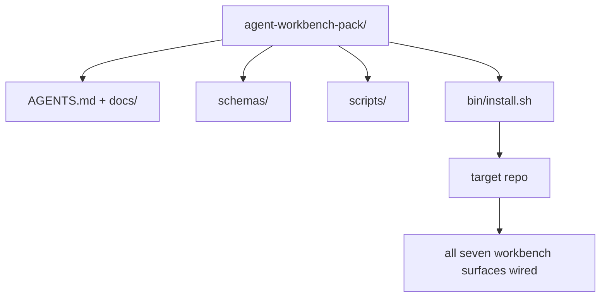

# Capstone：交付可复用的 Agent Workbench Pack

> 这个 mini-track 以一个可以放进任意 repo 的 pack 收尾。十一节关于 surface 的课，被压缩成一个目录，你可以 `cp -r` 过去，让 agent 第二天早上就可靠工作。capstone 就是这套课程赖以交易的工件。

**类型：** 构建
**语言：** Python (stdlib)
**先修：** Phases 14 · 31 to 14 · 41
**时间：** ~75 分钟

## 学习目标

- 将七个 workbench surface 打包成一个 drop-in 目录。
- 固定 schemas、scripts 和 templates，让新 repo 获得已知良好的 baseline。
- 添加一个单一 installer script，以幂等方式铺设 pack。
- 决定哪些东西留在 pack 里、哪些留在外面，并为每个取舍辩护。

## 要解决的问题

一个活在 Google Doc、聊天历史和三个半记住脚本里的 workbench，会每个季度被重建一次。解法是一个 versioned pack：一个 repo 或目录，包含 surface、schema、script，以及一个一条命令可运行的 installer。

你会在本课结束时把 `outputs/agent-workbench-pack/` 交付到磁盘上，并拥有一个能把它铺设到任意目标 repo 的 `bin/install.sh`。

## 核心概念



### Pack layout

```text
outputs/agent-workbench-pack/
├── AGENTS.md
├── docs/
│   ├── agent-rules.md
│   ├── reliability-policy.md
│   ├── handoff-protocol.md
│   └── reviewer-rubric.md
├── schemas/
│   ├── agent_state.schema.json
│   ├── task_board.schema.json
│   └── scope_contract.schema.json
├── scripts/
│   ├── init_agent.py
│   ├── run_with_feedback.py
│   ├── verify_agent.py
│   └── generate_handoff.py
├── bin/
│   └── install.sh
└── README.md
```

### 什么留在里面，什么留在外面

In：

- Surface schemas。它们是 contract。
- 上面的四个 scripts。它们是 runtime。
- 四份 docs。它们是规则和 rubric。

Out：

- Project-specific tasks。任务属于目标 repo 的 board，不属于 pack。
- Vendor SDK calls。pack 是 framework-agnostic 的。
- Onboarding prose。pack 位于团队既有 onboarding 旁边，而不是里面。

### Installer

一个简短的 `bin/install.sh`（或 `bin/install.py`）：

1. 没有 `--force` 时，拒绝覆盖现有 pack。
2. 将 pack 复制到目标 repo。
3. 如果存在 `.github/workflows/`，则接好 CI。
4. 打印 next steps：填写 board、设置 acceptance commands、运行 init script。

### Versioning

pack 携带一个 `VERSION` 文件。需要 migration 的 schema bump 和 script change 会 bump major。Doc-only change 会 bump patch。目标 repo 的 `agent_state.json` 会记录它基于哪个 pack version 初始化。

## 动手实现

`code/main.py` 会在 lesson 旁边把 pack 组装到 `outputs/agent-workbench-pack/`，内容用这个 mini-track 前面课程里的 schemas 和 scripts，以及你已经写好的 docs 做种子。

运行：

```text
python3 code/main.py
```

脚本会复制并固定 surface，写入 README，打印 pack tree，并以 zero 退出。重复运行是幂等的。

## 生产中的模式

一个 pack 只有在能承受 fork、更新和不友好的 upstream 时才有价值。四种模式让它可行。

**`VERSION` 是 contract，不是 marketing。** Major bump 需要 state migration。Minor bump 需要重新运行 checker。Patch bump 只用于 doc-only。installer 每次安装都会把 `.workbench-version` 写入目标 repo；如果目标 lock 与 pack 的 `VERSION` 不一致，`lint_pack.py` 拒绝发布。这就是 `npm`、`Cargo` 和 `pyproject.toml` 能经受 10 年 churn 的方式；agent 并没有改变这些规则。

**跨工具分发使用单一来源。** Nx 提供一个 `nx ai-setup`，从单个 config 铺设 `AGENTS.md`、`CLAUDE.md`、`.cursor/rules/`、`.github/copilot-instructions.md` 和一个 MCP server。pack 也应该这样做；installer 产出 symlinks（`ln -s AGENTS.md CLAUDE.md`），让单一事实来源扩散到每个 coding agent。为了支持某个工具而 fork pack，是一种 failure mode。

**`uninstall.sh` 遇到 non-trivial state 就拒绝。** 卸载 pack 绝不能删除用户的 `agent_state.json`、`task_board.json` 或 `outputs/`。uninstaller 移除 schemas、scripts、docs 和 `AGENTS.md`（带 `--keep-agents-md` opt-out），并在 state files 有任何 uncommitted changes 时拒绝继续。State 属于用户；pack 不拥有它。

**Skill-as-publishable。SkillKit 风格分发。** pack 作为 SkillKit skill 交付：`skillkit install agent-workbench-pack` 会从单一来源把它铺到 32 个 AI agents 上。pack repo 是事实来源；SkillKit 是分发渠道。Vendor lock-in 坍缩；七个 surface 保持不变。

## 实际使用

pack 在三个地方交付：

- **作为一个可放进 repo 的目录。** `cp -r outputs/agent-workbench-pack /path/to/repo`。
- **作为公开 template repo。** Fork-and-customize，用 `VERSION` 控制 drift。
- **作为 SkillKit skill。** 接入你的 agent 产品，让一条命令把它铺好。

pack 是配方。每次 install 是一份成品。

## 交付成果

`outputs/skill-workbench-pack.md` 会生成一个针对项目调好的 pack：规则根据团队历史 sharpen，scope globs 匹配 repo，rubric dimensions 增加一个 domain-specific entry。

## 练习

1. 决定哪一份可选第五 doc 值得提升进 canonical pack。为这个取舍辩护。
2. 用 Python 重写 installer，并添加 `--dry-run` flag。和 bash 对比 ergonomics。
3. 添加一个 `bin/uninstall.sh`，安全移除 pack，并在 state files 有 non-trivial history 时拒绝。什么算 non-trivial？
4. 添加一个 `lint_pack.py`，当 pack 偏离 `VERSION` 时失败。把它接入 pack 自己 repo 的 CI。
5. 写一份从 hand-rolled workbench 迁移到这个 pack 的 runbook。什么操作顺序最能减少 downtime？

## 关键术语

| 术语 | 人们常说 | 实际含义 |
|------|----------------|------------------------|
| Workbench pack | “The starter kit” | 携带全部七个 surface 的 versioned directory |
| Installer | “Setup script” | 以幂等方式铺设 pack 的 `bin/install.sh` |
| Pack version | “VERSION” | schema/script changes 用 major bumps，doc-only 用 patch |
| Drop-in pack | “cp -r and go” | pack 第一天无需 per-repo customization 就能工作 |
| Forkable template | “GitHub template” | GitHub 的 “Use this template” 能克隆的 public repo |

## 延伸阅读

- Phases 14 · 31 to 14 · 41 — 这个 pack 打包的每个 surface
- [SkillKit](https://github.com/rohitg00/skillkit) — 将这个 skill 安装到 32 个 AI agents
- [Nx Blog, Teach Your AI Agent How to Work in a Monorepo](https://nx.dev/blog/nx-ai-agent-skills) — 跨六个工具的 single-source generator
- [agents.md — the open spec](https://agents.md/) — 你的 pack router 必须实现的内容
- [HKUDS/OpenHarness](https://github.com/HKUDS/OpenHarness) — pack-equivalent 的 reference implementation
- [andrewgarst/agentic_harness](https://github.com/andrewgarst/agentic_harness) — 带 eval suite 的 Redis-backed reference
- [Augment Code, A good AGENTS.md is a model upgrade](https://www.augmentcode.com/blog/how-to-write-good-agents-dot-md-files) — pack docs quality bar
- [Anthropic, Effective harnesses for long-running agents](https://www.anthropic.com/engineering/effective-harnesses-for-long-running-agents)
- [Anthropic, Harness design for long-running application development](https://www.anthropic.com/engineering/harness-design-long-running-apps)
- Phase 14 · 30 — 消费这个 pack verification gate 的 eval-driven agent development
- Phase 14 · 41 — 这个 pack 要改进的 before/after benchmark
