# Communication Protocols

> 不能说同一种语言的 agents 不是团队。它们只是对着虚空喊话的陌生人。

**类型：** 构建
**语言：** TypeScript
**先修：** Phase 14 (Agent Engineering), Lesson 16.01 (Why Multi-Agent)
**时间：** ~120 分钟

## 学习目标

- 实现 MCP tool discovery 和 invocation，让 agents 能使用外部 servers 暴露的 tools
- 构建 A2A agent card 和 task endpoint，让一个 agent 能通过 HTTP 把工作委派给另一个 agent
- 比较 MCP（tool access）、A2A（agent-to-agent）、ACP（enterprise audit）和 ANP（decentralized trust），并解释每种 protocol 解决哪个问题
- 在同一个系统中接入多个 protocols，让 agents 通过 MCP 发现 tools，并通过 A2A 委派 tasks

## 要解决的问题

你把系统拆成了多个 agents。一个 researcher、一个 coder、一个 reviewer。它们各自的工作都做得很好。但现在你需要它们真的互相交谈。

你的第一次尝试很明显：到处传 strings。researcher 返回一大段 text，coder 尽力解析。它能工作，直到 coder 误解 research summary，或者两个 agents 互相等待导致 deadlock，或者你需要由不同团队构建的 agents 协作。突然，“just pass strings” 分崩离析。

这就是 communication protocol problem。没有共享 contract 来规定 agents 如何交换 information，multi-agent systems 就会脆弱、不可审计，并且无法扩展到超过少数几个你亲自写的 agents。

AI ecosystem 用四种 protocols 回应了这个问题，每一种解决不同切片：

- **MCP** 用于 tool access
- **A2A** 用于 agent-to-agent collaboration
- **ACP** 用于 enterprise auditability
- **ANP** 用于 decentralized identity and trust

本课会深入。你会阅读每个 spec 的真实 wire formats，构建可运行实现，并把四者连接成统一系统。

## 核心概念

### Protocol Landscape

把这四种 protocols 想成 layers，每一层处理不同问题：

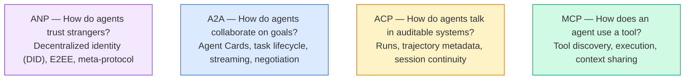

它们不是 competitors。它们在不同 levels 解决不同 problems。

### MCP（回顾）

MCP 已在 Phase 13 深入覆盖。快速回顾：MCP 标准化 LLM 如何连接 external tools 和 data sources。它是一个 **client-server** protocol，其中 agent（client）发现并调用 server 暴露的 tools。

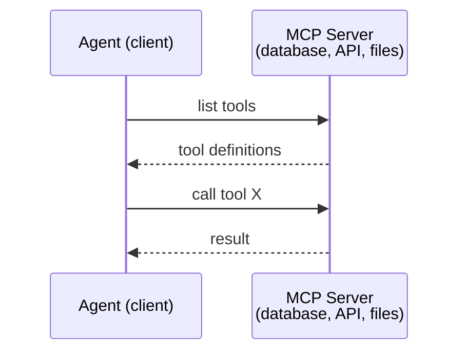

MCP 是 **agent-to-tool** communication。它不能帮助 agents 彼此交谈。

### A2A (Agent2Agent Protocol)

**Created by:** Google（现在位于 Linux Foundation，名为 `lf.a2a.v1`）
**Spec version:** 1.0.0
**Problem:** autonomous agents 如何彼此 collaborate、negotiate 和 delegate tasks？

A2A 是 **peer-to-peer agent collaboration** 的 protocol。MCP 将 agent 连接到 tools，而 A2A 将 agent 连接到其他 agents。每个 agent 在 well-known URL 发布 **Agent Card**，其他 agents 发现它、与其 negotiate，并向它 delegate tasks。

#### A2A 如何工作

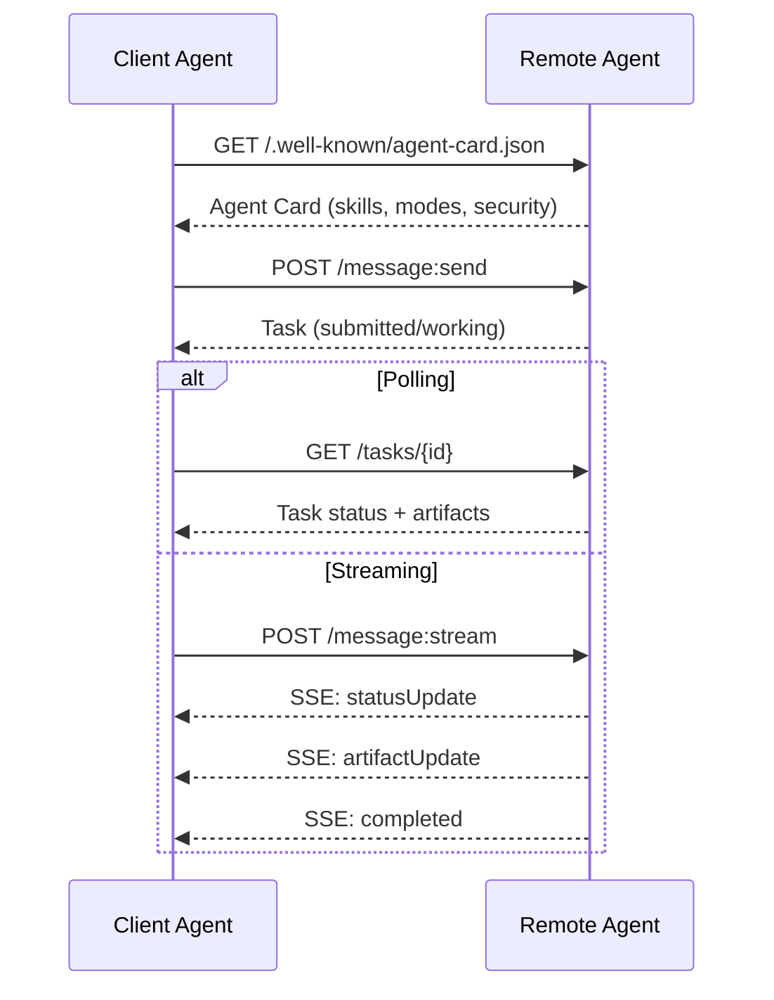

#### 真实 Agent Card

下面是野外真实 A2A Agent Card 的样子。通过 `GET /.well-known/agent-card.json` 提供：

```json
{
  "name": "Research Agent",
  "description": "Searches documentation and summarizes findings",
  "version": "1.0.0",
  "supportedInterfaces": [
    {
      "url": "https://research-agent.example.com/a2a/v1",
      "protocolBinding": "JSONRPC",
      "protocolVersion": "1.0"
    },
    {
      "url": "https://research-agent.example.com/a2a/rest",
      "protocolBinding": "HTTP+JSON",
      "protocolVersion": "1.0"
    }
  ],
  "provider": {
    "organization": "Your Company",
    "url": "https://example.com"
  },
  "capabilities": {
    "streaming": true,
    "pushNotifications": false
  },
  "defaultInputModes": ["text/plain", "application/json"],
  "defaultOutputModes": ["text/plain", "application/json"],
  "skills": [
    {
      "id": "web-research",
      "name": "Web Research",
      "description": "Searches the web and synthesizes findings",
      "tags": ["research", "search", "summarization"],
      "examples": ["Research the latest changes in React 19"]
    },
    {
      "id": "doc-analysis",
      "name": "Documentation Analysis",
      "description": "Reads and analyzes technical documentation",
      "tags": ["docs", "analysis"],
      "inputModes": ["text/plain", "application/pdf"],
      "outputModes": ["application/json"]
    }
  ],
  "securitySchemes": {
    "bearer": {
      "httpAuthSecurityScheme": {
        "scheme": "Bearer",
        "bearerFormat": "JWT"
      }
    }
  },
  "security": [{ "bearer": [] }]
}
```

需要注意的关键点：
- **Skills** 是 agent 能做什么。每个 skill 都有 ID、tags，以及支持的 input/output MIME types。这就是 client agent 判断 remote agent 是否能处理请求的方式。
- **supportedInterfaces** 列出多个 protocol bindings。单个 agent 可以同时说 JSON-RPC、REST 和 gRPC。
- **Security** 内置在 card 中。client 在发起第一次 request 前就知道需要什么 auth。

#### Task Lifecycle

Tasks 是 A2A 的核心工作单元。它们会穿过定义好的 states：

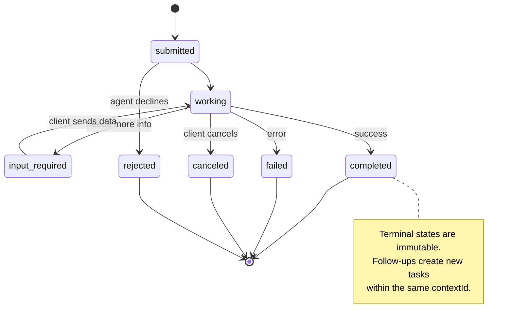

全部 8 个 states（spec 还定义了 `UNSPECIFIED` sentinel，这里省略）：

| State | Terminal? | Meaning |
|---|---|---|
| `TASK_STATE_SUBMITTED` | No | 已确认，还未 processing |
| `TASK_STATE_WORKING` | No | 正在 actively processed |
| `TASK_STATE_INPUT_REQUIRED` | No | Agent 需要 client 提供更多信息 |
| `TASK_STATE_AUTH_REQUIRED` | No | 需要 authentication |
| `TASK_STATE_COMPLETED` | Yes | 成功完成 |
| `TASK_STATE_FAILED` | Yes | 带 error 完成 |
| `TASK_STATE_CANCELED` | Yes | 完成前被取消 |
| `TASK_STATE_REJECTED` | Yes | Agent 拒绝 task |

一旦 task 达到 terminal state，它就是 immutable。没有 further messages。Follow-ups 会在同一个 `contextId` 中创建新 task。

#### Wire Format

A2A 使用 JSON-RPC 2.0。下面是真实 message exchange 的样子：

**Client sends a task:**
```json
{
  "jsonrpc": "2.0",
  "id": 1,
  "method": "SendMessage",
  "params": {
    "message": {
      "messageId": "msg-001",
      "role": "ROLE_USER",
      "parts": [{ "text": "Research React 19 compiler features" }]
    },
    "configuration": {
      "acceptedOutputModes": ["text/plain", "application/json"],
      "historyLength": 10
    }
  }
}
```

**Agent responds with a task:**
```json
{
  "jsonrpc": "2.0",
  "id": 1,
  "result": {
    "task": {
      "id": "task-abc-123",
      "contextId": "ctx-xyz-789",
      "status": {
        "state": "TASK_STATE_COMPLETED",
        "timestamp": "2026-03-27T10:30:00Z"
      },
      "artifacts": [
        {
          "artifactId": "art-001",
          "name": "research-results",
          "parts": [{
            "data": {
              "findings": [
                "React 19 compiler auto-memoizes components",
                "No more manual useMemo/useCallback needed",
                "Compiler runs at build time, not runtime"
              ]
            },
            "mediaType": "application/json"
          }]
        }
      ]
    }
  }
}
```

**Streaming via SSE:**
```text
POST /message:stream HTTP/1.1
Content-Type: application/json
A2A-Version: 1.0

data: {"task":{"id":"task-123","status":{"state":"TASK_STATE_WORKING"}}}

data: {"statusUpdate":{"taskId":"task-123","status":{"state":"TASK_STATE_WORKING","message":{"role":"ROLE_AGENT","parts":[{"text":"Searching documentation..."}]}}}}

data: {"artifactUpdate":{"taskId":"task-123","artifact":{"artifactId":"art-1","parts":[{"text":"partial findings..."}]},"append":true,"lastChunk":false}}

data: {"statusUpdate":{"taskId":"task-123","status":{"state":"TASK_STATE_COMPLETED"}}}
```

### ACP (Agent Communication Protocol)

**Created by:** IBM / BeeAI
**Spec version:** 0.2.0 (OpenAPI 3.1.1)
**Status:** 正在 Linux Foundation 下 merge into A2A
**Problem:** agents 如何在具备 full auditability、session continuity 和 trajectory tracking 的情况下通信？

ACP 是 **enterprise protocol**。不同于很多 summaries 的说法，ACP **不**使用 JSON-LD。它是一个通过 OpenAPI 定义的直接 REST/JSON API。它特别之处在于 **TrajectoryMetadata**：每个 agent response 都可以携带详细日志，记录产生它的 reasoning steps 和 tool calls。

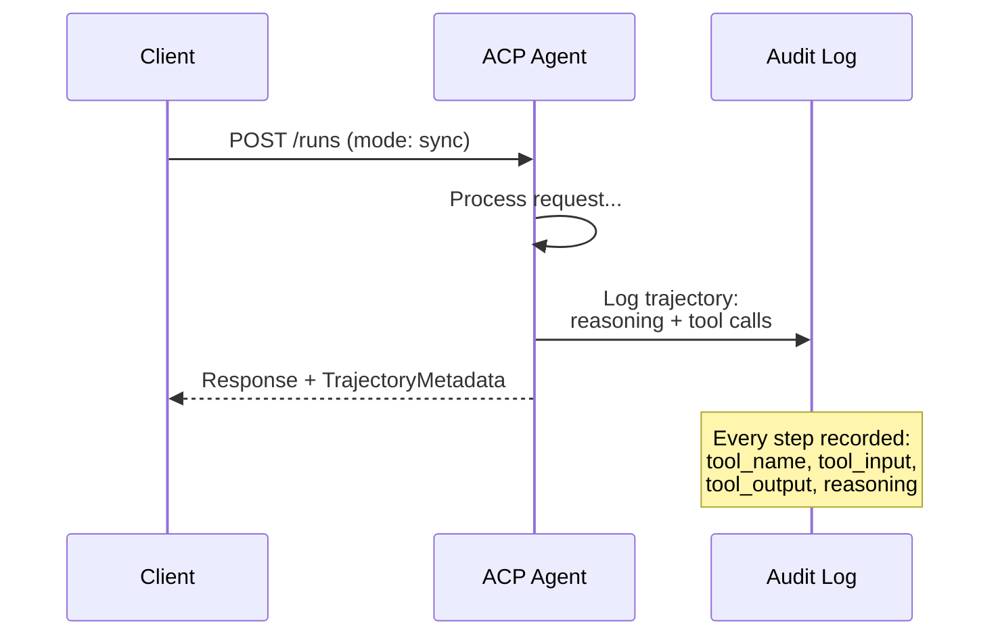

#### ACP 中的 Agent Discovery

ACP 定义四种 discovery methods：

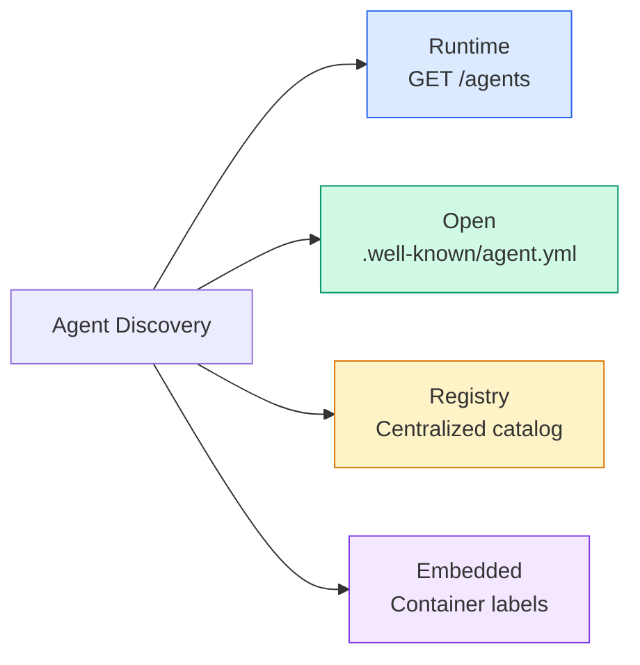

**AgentManifest** 比 A2A 的 Agent Card 更简单：

```json
{
  "name": "summarizer",
  "description": "Summarizes documents with source citations",
  "input_content_types": ["text/plain", "application/pdf"],
  "output_content_types": ["text/plain", "application/json"],
  "metadata": {
    "tags": ["summarization", "RAG"],
    "framework": "BeeAI",
    "capabilities": [
      {
        "name": "Document Summarization",
        "description": "Condenses long documents into key points"
      }
    ],
    "recommended_models": ["llama3.3:70b-instruct-fp16"],
    "license": "Apache-2.0",
    "programming_language": "Python"
  }
}
```

#### Run Lifecycle

ACP 使用 “Runs” 而不是 “Tasks”。一个 Run 是三种 modes 之一的 agent execution：

| Mode | Behavior |
|---|---|
| `sync` | Blocking。Response 包含 complete result。 |
| `async` | 立即返回 202。轮询 `GET /runs/{id}` 获取 status。 |
| `stream` | SSE stream。Events 在 agent 工作时触发。 |

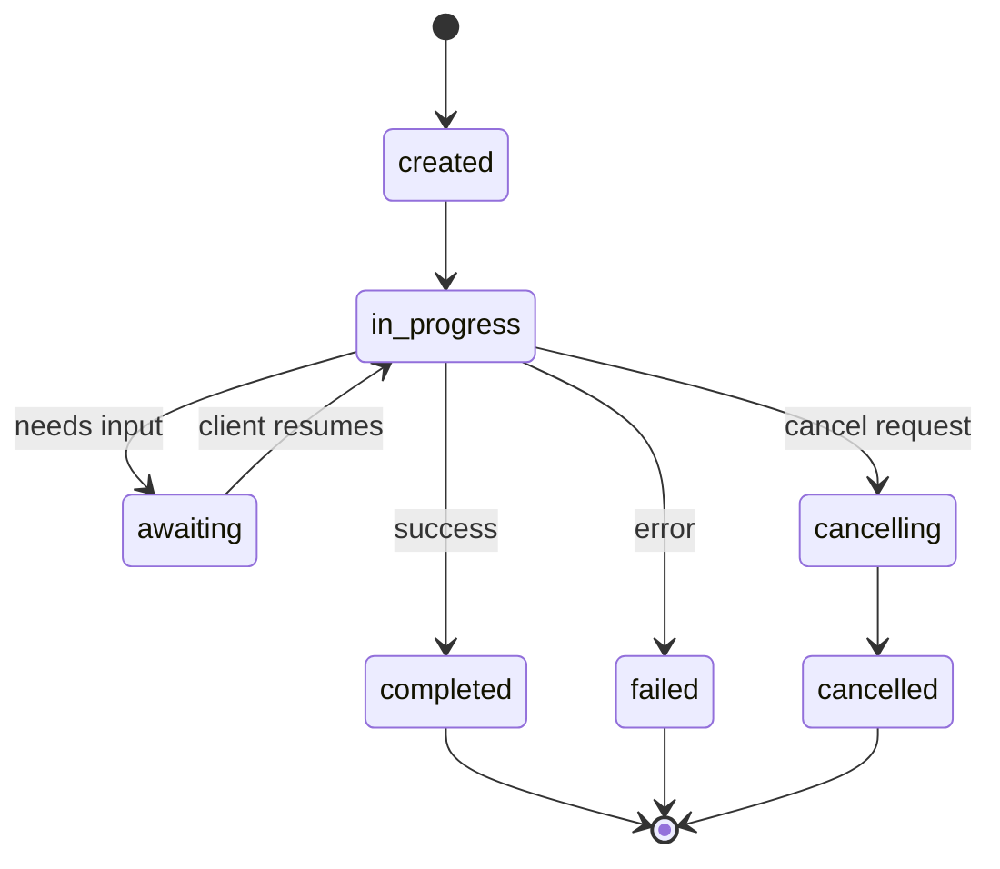

#### TrajectoryMetadata（Audit Trail）

这是 ACP 的关键 differentiator。每个 message part 都可以包含 metadata，精确展示 agent 做了什么：

```json
{
  "role": "agent/researcher",
  "parts": [
    {
      "content_type": "text/plain",
      "content": "The weather in San Francisco is 72F and sunny.",
      "metadata": {
        "kind": "trajectory",
        "message": "I need to check the weather for this location",
        "tool_name": "weather_api",
        "tool_input": { "location": "San Francisco, CA" },
        "tool_output": { "temperature": 72, "condition": "sunny" }
      }
    }
  ]
}
```

对 regulated industries 来说，这是黄金。每个 answer 都带着可证明的 reasoning chain：调用了哪些 tools、使用了什么 inputs、收到什么 outputs。没有 black box。

ACP 也支持用于 source attribution 的 **CitationMetadata**：

```json
{
  "kind": "citation",
  "start_index": 0,
  "end_index": 47,
  "url": "https://weather.gov/sf",
  "title": "NWS San Francisco Forecast"
}
```

### ANP (Agent Network Protocol)

**Created by:** Open-source community（由 GaoWei Chang founded）
**Repo:** [github.com/agent-network-protocol/AgentNetworkProtocol](https://github.com/agent-network-protocol/AgentNetworkProtocol)
**Problem:** 来自不同 organizations 的 agents 如何在没有 central authority 的情况下彼此信任？

ANP 是 **decentralized identity protocol**。它使用 W3C Decentralized Identifiers（DIDs）和 end-to-end encryption 建立 trust。不同于 A2A 通过 known endpoints 发现 agents，ANP 让 agents 能 cryptographically prove their identity。

ANP 有三层：

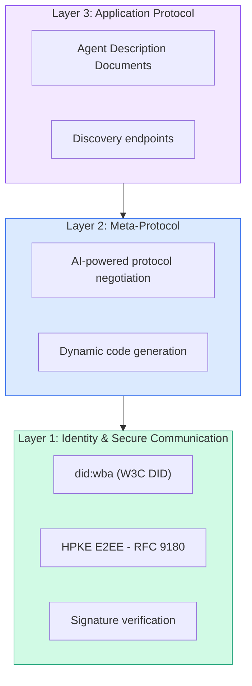

#### DID Documents（真实结构）

ANP 使用一个名为 `did:wba`（Web-Based Agent）的 custom DID method。DID `did:wba:example.com:user:alice` 会 resolve 到 `https://example.com/user/alice/did.json`：

```json
{
  "@context": [
    "https://www.w3.org/ns/did/v1",
    "https://w3id.org/security/suites/jws-2020/v1",
    "https://w3id.org/security/suites/secp256k1-2019/v1"
  ],
  "id": "did:wba:example.com:user:alice",
  "verificationMethod": [
    {
      "id": "did:wba:example.com:user:alice#key-1",
      "type": "EcdsaSecp256k1VerificationKey2019",
      "controller": "did:wba:example.com:user:alice",
      "publicKeyJwk": {
        "crv": "secp256k1",
        "x": "NtngWpJUr-rlNNbs0u-Aa8e16OwSJu6UiFf0Rdo1oJ4",
        "y": "qN1jKupJlFsPFc1UkWinqljv4YE0mq_Ickwnjgasvmo",
        "kty": "EC"
      }
    },
    {
      "id": "did:wba:example.com:user:alice#key-x25519-1",
      "type": "X25519KeyAgreementKey2019",
      "controller": "did:wba:example.com:user:alice",
      "publicKeyMultibase": "z9hFgmPVfmBZwRvFEyniQDBkz9LmV7gDEqytWyGZLmDXE"
    }
  ],
  "authentication": [
    "did:wba:example.com:user:alice#key-1"
  ],
  "keyAgreement": [
    "did:wba:example.com:user:alice#key-x25519-1"
  ],
  "humanAuthorization": [
    "did:wba:example.com:user:alice#key-1"
  ],
  "service": [
    {
      "id": "did:wba:example.com:user:alice#agent-description",
      "type": "AgentDescription",
      "serviceEndpoint": "https://example.com/agents/alice/ad.json"
    }
  ]
}
```

需要注意的关键点：
- **Key separation** 被强制执行。Signing keys（secp256k1）与 encryption keys（X25519）分离。
- **`humanAuthorization`** 是 ANP 独有的。这些 keys 在使用前要求 explicit human approval（biometric、password、HSM）。fund transfers 等 high-risk operations 会走这条路径。
- **`keyAgreement`** keys 用于 HPKE end-to-end encryption（RFC 9180）。
- **service** section 链接到 Agent Description document。

#### ANP 中的 Trust 如何工作

ANP **不**使用 web-of-trust 或 endorsement graph。Trust 是 bilateral，并在每次 interaction 中验证：

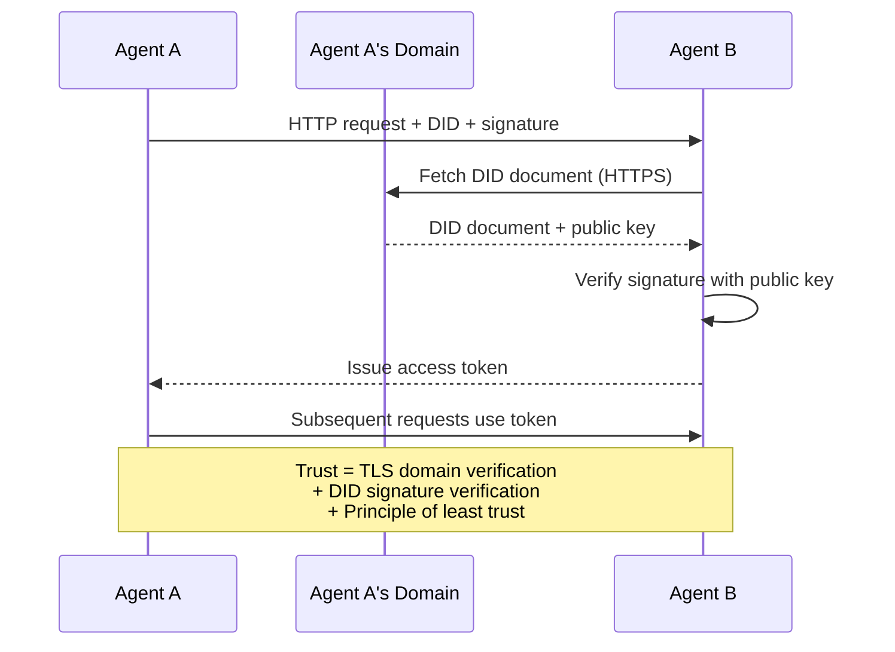

Trust 来自三个来源：
1. **Domain-level TLS** 验证 DID document host
2. **DID cryptographic signatures** 验证 agent identity
3. **Principle of least trust** 只授予 minimum permissions

没有 gossip-based trust propagation 或 PageRank scoring。你通过 DID 直接验证每个 agent。

#### Meta-Protocol Negotiation

这是 ANP 最新颖的 feature。当两个来自不同 ecosystems 的 agents 相遇时，它们不需要预先 agreed data formats。它们用 natural language negotiate：

```json
{
  "action": "protocolNegotiation",
  "sequenceId": 0,
  "candidateProtocols": "I can communicate using:\n1. JSON-RPC with hotel booking schema\n2. REST with OpenAPI 3.1 spec\n3. Natural language over HTTP",
  "modificationSummary": "Initial proposal",
  "status": "negotiating"
}
```

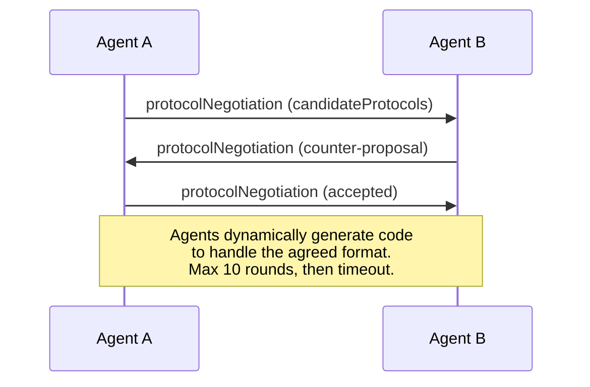

agents 往返协商（最多 10 轮），直到它们同意一种 format，然后动态生成 code 来处理它。Status values：`negotiating`、`rejected`、`accepted`、`timeout`。

这意味着两个从未见过彼此的 agents，可以在没有任何人预先定义 shared schema 的情况下，找出如何通信。

### Comparison（修正版）

| | MCP | A2A | ACP | ANP |
|---|---|---|---|---|
| **Created by** | Anthropic | Google / Linux Foundation | IBM / BeeAI | Community |
| **Spec format** | JSON-RPC | JSON-RPC / REST / gRPC | OpenAPI 3.1 (REST) | JSON-RPC |
| **Primary use** | Agent to Tool | Agent to Agent | Agent to Agent | Agent to Agent |
| **Discovery** | Tool listing | `/.well-known/agent-card.json` | `GET /agents`, `/.well-known/agent.yml` | `/.well-known/agent-descriptions`, DID service endpoints |
| **Identity** | Implicit (local) | Security schemes (OAuth, mTLS) | Server-level | W3C DID (`did:wba`) with E2EE |
| **Audit trail** | N/A | Basic (task history) | TrajectoryMetadata (tool calls, reasoning) | Not formally specified |
| **State machine** | N/A | 9 task states | 7 run states | N/A |
| **Streaming** | N/A | SSE | SSE | Transport-agnostic |
| **Unique feature** | Tool schemas | Agent Cards + Skills | Trajectory audit trail | Meta-protocol negotiation |
| **Best for** | Tools & data | Dynamic collaboration | Regulated industries | Cross-org trust |
| **Status** | Stable | Stable (v1.0) | Merging into A2A | Active development |

### 它们如何一起工作

这些 protocols 并不互斥。一个现实的 enterprise system 会使用多个：

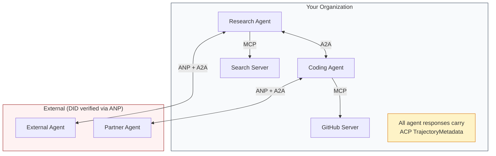

- **MCP** 将每个 agent 连接到它的 tools
- **A2A** 处理 agents 之间的 collaboration（internal 和 external）
- **ACP** 用 trajectory metadata 包装 responses，以支持 auditability
- **ANP** 为你不控制的 agents 提供 identity verification

## 动手实现

### Step 1：Core Message Types

每个 multi-agent system 都从 message format 开始。我们定义映射到真实 protocols 所用内容的 types：

```typescript
import crypto from "node:crypto";

type MessageRole = "user" | "agent";

type MessagePart =
  | { kind: "text"; text: string }
  | { kind: "data"; data: unknown; mediaType: string }
  | { kind: "file"; name: string; url: string; mediaType: string };

type TrajectoryEntry = {
  reasoning: string;
  toolName?: string;
  toolInput?: unknown;
  toolOutput?: unknown;
  timestamp: number;
};

type AgentMessage = {
  id: string;
  role: MessageRole;
  parts: MessagePart[];
  trajectory?: TrajectoryEntry[];
  replyTo?: string;
  timestamp: number;
};

function createMessage(
  role: MessageRole,
  parts: MessagePart[],
  replyTo?: string
): AgentMessage {
  return {
    id: crypto.randomUUID(),
    role,
    parts,
    replyTo,
    timestamp: Date.now(),
  };
}

function textMessage(role: MessageRole, text: string): AgentMessage {
  return createMessage(role, [{ kind: "text", text }]);
}
```

注意：`MessagePart` 是 multimodal（text、structured data、files），和真实 A2A 与 ACP specs 一样。`TrajectoryEntry` 捕获 reasoning chain，匹配 ACP 的 TrajectoryMetadata。

### Step 2：A2A Agent Card and Registry

构建与真实 A2A spec 匹配的 agent discovery：

```typescript
type Skill = {
  id: string;
  name: string;
  description: string;
  tags: string[];
  inputModes: string[];
  outputModes: string[];
};

type AgentCard = {
  name: string;
  description: string;
  version: string;
  url: string;
  capabilities: {
    streaming: boolean;
    pushNotifications: boolean;
  };
  defaultInputModes: string[];
  defaultOutputModes: string[];
  skills: Skill[];
};

class AgentRegistry {
  private cards: Map<string, AgentCard> = new Map();

  register(card: AgentCard) {
    this.cards.set(card.name, card);
  }

  discoverBySkillTag(tag: string): AgentCard[] {
    return [...this.cards.values()].filter((card) =>
      card.skills.some((skill) => skill.tags.includes(tag))
    );
  }

  discoverByInputMode(mimeType: string): AgentCard[] {
    return [...this.cards.values()].filter(
      (card) =>
        card.defaultInputModes.includes(mimeType) ||
        card.skills.some((skill) => skill.inputModes.includes(mimeType))
    );
  }

  resolve(name: string): AgentCard | undefined {
    return this.cards.get(name);
  }

  listAll(): AgentCard[] {
    return [...this.cards.values()];
  }
}
```

这比简单的 name-to-capability map 丰富得多。你可以按 skill tags、input MIME types 或 name 发现 agents，就像真实 A2A spec 支持的那样。

### Step 3：A2A Task Lifecycle

构建完整 task state machine：

```typescript
type TaskState =
  | "submitted"
  | "working"
  | "input-required"
  | "auth-required"
  | "completed"
  | "failed"
  | "canceled"
  | "rejected";

const TERMINAL_STATES: TaskState[] = [
  "completed",
  "failed",
  "canceled",
  "rejected",
];

type TaskStatus = {
  state: TaskState;
  message?: AgentMessage;
  timestamp: number;
};

type Artifact = {
  id: string;
  name: string;
  parts: MessagePart[];
};

type Task = {
  id: string;
  contextId: string;
  status: TaskStatus;
  artifacts: Artifact[];
  history: AgentMessage[];
};

type TaskEvent =
  | { kind: "statusUpdate"; taskId: string; status: TaskStatus }
  | {
      kind: "artifactUpdate";
      taskId: string;
      artifact: Artifact;
      append: boolean;
      lastChunk: boolean;
    };

type TaskHandler = (
  task: Task,
  message: AgentMessage
) => AsyncGenerator<TaskEvent>;

class TaskManager {
  private tasks: Map<string, Task> = new Map();
  private handlers: Map<string, TaskHandler> = new Map();
  private listeners: Map<string, ((event: TaskEvent) => void)[]> = new Map();

  registerHandler(agentName: string, handler: TaskHandler) {
    this.handlers.set(agentName, handler);
  }

  subscribe(taskId: string, listener: (event: TaskEvent) => void) {
    const existing = this.listeners.get(taskId) ?? [];
    existing.push(listener);
    this.listeners.set(taskId, existing);
  }

  async sendMessage(
    agentName: string,
    message: AgentMessage,
    contextId?: string
  ): Promise<Task> {
    const handler = this.handlers.get(agentName);
    if (!handler) {
      const task = this.createTask(contextId);
      task.status = {
        state: "rejected",
        timestamp: Date.now(),
        message: textMessage("agent", `No handler for ${agentName}`),
      };
      return task;
    }

    const task = this.createTask(contextId);
    task.history.push(message);
    task.status = { state: "submitted", timestamp: Date.now() };

    this.processTask(task, handler, message).catch((err) => {
      task.status = {
        state: "failed",
        timestamp: Date.now(),
        message: textMessage("agent", String(err)),
      };
    });
    return task;
  }

  getTask(taskId: string): Task | undefined {
    return this.tasks.get(taskId);
  }

  cancelTask(taskId: string): boolean {
    const task = this.tasks.get(taskId);
    if (!task || TERMINAL_STATES.includes(task.status.state)) return false;
    task.status = { state: "canceled", timestamp: Date.now() };
    this.emit(taskId, {
      kind: "statusUpdate",
      taskId,
      status: task.status,
    });
    return true;
  }

  private createTask(contextId?: string): Task {
    const task: Task = {
      id: crypto.randomUUID(),
      contextId: contextId ?? crypto.randomUUID(),
      status: { state: "submitted", timestamp: Date.now() },
      artifacts: [],
      history: [],
    };
    this.tasks.set(task.id, task);
    return task;
  }

  private async processTask(
    task: Task,
    handler: TaskHandler,
    message: AgentMessage
  ) {
    task.status = { state: "working", timestamp: Date.now() };
    this.emit(task.id, {
      kind: "statusUpdate",
      taskId: task.id,
      status: task.status,
    });

    try {
      for await (const event of handler(task, message)) {
        if (TERMINAL_STATES.includes(task.status.state)) break;

        if (event.kind === "statusUpdate") {
          task.status = event.status;
        }
        if (event.kind === "artifactUpdate") {
          const existing = task.artifacts.find(
            (a) => a.id === event.artifact.id
          );
          if (existing && event.append) {
            existing.parts.push(...event.artifact.parts);
          } else {
            task.artifacts.push(event.artifact);
          }
        }
        this.emit(task.id, event);
      }
    } catch (err) {
      task.status = {
        state: "failed",
        timestamp: Date.now(),
        message: textMessage("agent", String(err)),
      };
      this.emit(task.id, {
        kind: "statusUpdate",
        taskId: task.id,
        status: task.status,
      });
    }
  }

  private emit(taskId: string, event: TaskEvent) {
    for (const listener of this.listeners.get(taskId) ?? []) {
      listener(event);
    }
  }
}
```

这实现了真实 A2A task lifecycle：submitted、working、input-required、terminal states。Handlers 是 async generators，会 yield events（status updates 和 artifact chunks），匹配 SSE streaming model。

### Step 4：ACP-Style Audit Trail

用 trajectory tracking 包装 communication：

```typescript
type AuditEntry = {
  runId: string;
  agentName: string;
  input: AgentMessage[];
  output: AgentMessage[];
  trajectory: TrajectoryEntry[];
  status: "created" | "in-progress" | "completed" | "failed" | "awaiting";
  startedAt: number;
  completedAt?: number;
  sessionId?: string;
};

class AuditableRunner {
  private log: AuditEntry[] = [];
  private handlers: Map<
    string,
    (input: AgentMessage[]) => Promise<{
      output: AgentMessage[];
      trajectory: TrajectoryEntry[];
    }>
  > = new Map();

  registerAgent(
    name: string,
    handler: (input: AgentMessage[]) => Promise<{
      output: AgentMessage[];
      trajectory: TrajectoryEntry[];
    }>
  ) {
    this.handlers.set(name, handler);
  }

  async run(
    agentName: string,
    input: AgentMessage[],
    sessionId?: string
  ): Promise<AuditEntry> {
    const entry: AuditEntry = {
      runId: crypto.randomUUID(),
      agentName,
      input: structuredClone(input),
      output: [],
      trajectory: [],
      status: "created",
      startedAt: Date.now(),
      sessionId,
    };
    this.log.push(entry);

    const handler = this.handlers.get(agentName);
    if (!handler) {
      entry.status = "failed";
      return entry;
    }

    entry.status = "in-progress";
    try {
      const result = await handler(input);
      entry.output = structuredClone(result.output);
      entry.trajectory = structuredClone(result.trajectory);
      entry.status = "completed";
      entry.completedAt = Date.now();
    } catch (err) {
      entry.status = "failed";
      entry.trajectory.push({
        reasoning: `Error: ${String(err)}`,
        timestamp: Date.now(),
      });
      entry.completedAt = Date.now();
    }
    return entry;
  }

  getFullAuditLog(): AuditEntry[] {
    return structuredClone(this.log);
  }

  getAuditLogForAgent(agentName: string): AuditEntry[] {
    return structuredClone(
      this.log.filter((e) => e.agentName === agentName)
    );
  }

  getAuditLogForSession(sessionId: string): AuditEntry[] {
    return structuredClone(
      this.log.filter((e) => e.sessionId === sessionId)
    );
  }

  getTrajectoryForRun(runId: string): TrajectoryEntry[] {
    const entry = this.log.find((e) => e.runId === runId);
    return entry ? structuredClone(entry.trajectory) : [];
  }
}
```

每次 agent execution 都会产生完整 audit entry：输入了什么、输出了什么，以及中间完整的 tool calls 与 reasoning steps trajectory。你可以按 agent、session 或单个 run 查询。

### Step 5：ANP-Style Identity Verification

构建 DID-based identity 和 verification：

```typescript
type VerificationMethod = {
  id: string;
  type: string;
  controller: string;
  publicKeyDer: string;
};

type DIDDocument = {
  id: string;
  verificationMethod: VerificationMethod[];
  authentication: string[];
  keyAgreement: string[];
  humanAuthorization: string[];
  service: { id: string; type: string; serviceEndpoint: string }[];
};

type AgentIdentity = {
  did: string;
  document: DIDDocument;
  privateKey: crypto.KeyObject;
  publicKey: crypto.KeyObject;
};

class IdentityRegistry {
  private documents: Map<string, DIDDocument> = new Map();

  publish(doc: DIDDocument) {
    this.documents.set(doc.id, doc);
  }

  resolve(did: string): DIDDocument | undefined {
    return this.documents.get(did);
  }

  verify(did: string, signature: string, payload: string): boolean {
    const doc = this.documents.get(did);
    if (!doc) return false;

    const authKeyIds = doc.authentication;
    const authKeys = doc.verificationMethod.filter((vm) =>
      authKeyIds.includes(vm.id)
    );

    for (const key of authKeys) {
      const publicKey = crypto.createPublicKey({
        key: Buffer.from(key.publicKeyDer, "base64"),
        format: "der",
        type: "spki",
      });
      const isValid = crypto.verify(
        null,
        Buffer.from(payload),
        publicKey,
        Buffer.from(signature, "hex")
      );
      if (isValid) return true;
    }
    return false;
  }

  requiresHumanAuth(did: string, operationKeyId: string): boolean {
    const doc = this.documents.get(did);
    if (!doc) return false;
    return doc.humanAuthorization.includes(operationKeyId);
  }
}

function createIdentity(domain: string, agentName: string): AgentIdentity {
  const did = `did:wba:${domain}:agent:${agentName}`;
  const { publicKey, privateKey } = crypto.generateKeyPairSync("ed25519");

  const publicKeyDer = publicKey
    .export({ format: "der", type: "spki" })
    .toString("base64");

  const keyId = `${did}#key-1`;
  const encKeyId = `${did}#key-x25519-1`;

  const document: DIDDocument = {
    id: did,
    verificationMethod: [
      {
        id: keyId,
        type: "Ed25519VerificationKey2020",
        controller: did,
        publicKeyDer,
      },
      {
        id: encKeyId,
        type: "X25519KeyAgreementKey2019",
        controller: did,
        publicKeyDer,
      },
    ],
    authentication: [keyId],
    keyAgreement: [encKeyId],
    humanAuthorization: [],
    service: [
      {
        id: `${did}#agent-description`,
        type: "AgentDescription",
        serviceEndpoint: `https://${domain}/agents/${agentName}/ad.json`,
      },
    ],
  };

  return { did, document, privateKey, publicKey };
}

function signPayload(identity: AgentIdentity, payload: string): string {
  return crypto
    .sign(null, Buffer.from(payload), identity.privateKey)
    .toString("hex");
}
```

这镜像了真实 ANP identity model：agents 有 DID documents，其中 authentication、key agreement 和 human authorization keys 分开。`IdentityRegistry` 模拟 DID resolution（生产中这会是对 agent domain 的 HTTP fetches）。

### Step 6：Protocol Gateway

将四个 protocols 连接成统一系统：

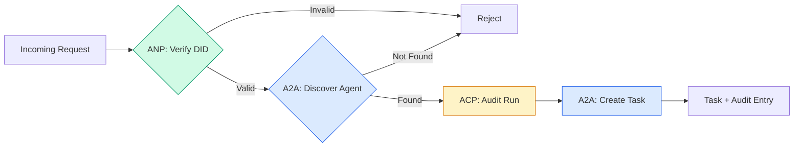

```typescript
class ProtocolGateway {
  private registry: AgentRegistry;
  private taskManager: TaskManager;
  private auditRunner: AuditableRunner;
  private identityRegistry: IdentityRegistry;

  constructor(
    registry: AgentRegistry,
    taskManager: TaskManager,
    auditRunner: AuditableRunner,
    identityRegistry: IdentityRegistry
  ) {
    this.registry = registry;
    this.taskManager = taskManager;
    this.auditRunner = auditRunner;
    this.identityRegistry = identityRegistry;
  }

  async delegateTask(
    fromDid: string,
    signature: string,
    targetAgent: string,
    message: AgentMessage,
    sessionId?: string
  ): Promise<{ task: Task; audit: AuditEntry } | { error: string }> {
    if (!this.identityRegistry.verify(fromDid, signature, message.id)) {
      return { error: "Identity verification failed" };
    }

    const card = this.registry.resolve(targetAgent);
    if (!card) {
      return { error: `Agent ${targetAgent} not found in registry` };
    }

    const audit = await this.auditRunner.run(
      targetAgent,
      [message],
      sessionId
    );
    const task = await this.taskManager.sendMessage(targetAgent, message);

    return { task, audit };
  }

  discoverAndDelegate(
    fromDid: string,
    signature: string,
    skillTag: string,
    message: AgentMessage
  ): Promise<{ task: Task; audit: AuditEntry } | { error: string }> {
    const candidates = this.registry.discoverBySkillTag(skillTag);
    if (candidates.length === 0) {
      return Promise.resolve({
        error: `No agents found with skill tag: ${skillTag}`,
      });
    }
    return this.delegateTask(
      fromDid,
      signature,
      candidates[0].name,
      message
    );
  }
}
```

gateway 在一次调用中做四件事：
1. **ANP**：通过 DID signature 验证 caller identity
2. **A2A**：发现 target agent 并检查 capabilities
3. **ACP**：用 audit trail 和 trajectory 包装 execution
4. **A2A**：创建带完整 lifecycle tracking 的 task

### Step 7：Wire It All Together

```typescript
async function protocolDemo() {
  const registry = new AgentRegistry();
  registry.register({
    name: "researcher",
    description: "Searches and summarizes findings",
    version: "1.0.0",
    url: "https://researcher.local/a2a/v1",
    capabilities: { streaming: true, pushNotifications: false },
    defaultInputModes: ["text/plain"],
    defaultOutputModes: ["text/plain", "application/json"],
    skills: [
      {
        id: "web-research",
        name: "Web Research",
        description: "Searches the web",
        tags: ["research", "search", "summarization"],
        inputModes: ["text/plain"],
        outputModes: ["application/json"],
      },
    ],
  });
  registry.register({
    name: "coder",
    description: "Writes code from specs",
    version: "1.0.0",
    url: "https://coder.local/a2a/v1",
    capabilities: { streaming: false, pushNotifications: false },
    defaultInputModes: ["text/plain", "application/json"],
    defaultOutputModes: ["text/plain"],
    skills: [
      {
        id: "code-gen",
        name: "Code Generation",
        description: "Generates code",
        tags: ["coding", "generation"],
        inputModes: ["text/plain", "application/json"],
        outputModes: ["text/plain"],
      },
    ],
  });

  const taskManager = new TaskManager();
  const auditRunner = new AuditableRunner();

  const researchTrajectory: TrajectoryEntry[] = [];

  taskManager.registerHandler(
    "researcher",
    async function* (task, message) {
      yield {
        kind: "statusUpdate" as const,
        taskId: task.id,
        status: { state: "working" as const, timestamp: Date.now() },
      };

      researchTrajectory.push({
        reasoning: "Searching for React 19 documentation",
        toolName: "web_search",
        toolInput: { query: "React 19 compiler features" },
        toolOutput: {
          results: ["react.dev/blog/react-19", "github.com/react/react"],
        },
        timestamp: Date.now(),
      });

      researchTrajectory.push({
        reasoning: "Extracting key findings from search results",
        toolName: "doc_analysis",
        toolInput: { url: "react.dev/blog/react-19" },
        toolOutput: {
          summary:
            "React 19 compiler auto-memoizes, no manual useMemo needed",
        },
        timestamp: Date.now(),
      });

      yield {
        kind: "artifactUpdate" as const,
        taskId: task.id,
        artifact: {
          id: crypto.randomUUID(),
          name: "research-results",
          parts: [
            {
              kind: "data" as const,
              data: {
                findings: [
                  "React 19 compiler auto-memoizes components",
                  "No more manual useMemo/useCallback needed",
                  "Compiler runs at build time, not runtime",
                ],
                sources: ["react.dev/blog/react-19"],
              },
              mediaType: "application/json",
            },
          ],
        },
        append: false,
        lastChunk: true,
      };

      yield {
        kind: "statusUpdate" as const,
        taskId: task.id,
        status: { state: "completed" as const, timestamp: Date.now() },
      };
    }
  );

  auditRunner.registerAgent("researcher", async () => ({
    output: [
      textMessage("agent", "React 19 compiler auto-memoizes components"),
    ],
    trajectory: researchTrajectory,
  }));

  const identityRegistry = new IdentityRegistry();

  const coderIdentity = createIdentity("coder.local", "coder");
  const researcherIdentity = createIdentity("researcher.local", "researcher");

  identityRegistry.publish(coderIdentity.document);
  identityRegistry.publish(researcherIdentity.document);

  const gateway = new ProtocolGateway(
    registry,
    taskManager,
    auditRunner,
    identityRegistry
  );

  console.log("=== Protocol Demo ===\n");

  console.log("1. Agent Discovery (A2A)");
  const researchAgents = registry.discoverBySkillTag("research");
  console.log(
    `   Found ${researchAgents.length} agent(s):`,
    researchAgents.map((a) => a.name)
  );

  console.log("\n2. Identity Verification (ANP)");
  const message = textMessage("user", "Research React 19 compiler features");
  const signature = signPayload(coderIdentity, message.id);
  const verified = identityRegistry.verify(
    coderIdentity.did,
    signature,
    message.id
  );
  console.log(`   Coder DID: ${coderIdentity.did}`);
  console.log(`   Signature verified: ${verified}`);

  console.log("\n3. Task Delegation (A2A + ACP + ANP)");
  const result = await gateway.delegateTask(
    coderIdentity.did,
    signature,
    "researcher",
    message,
    "session-001"
  );

  if ("error" in result) {
    console.log(`   Error: ${result.error}`);
    return;
  }

  console.log(`   Task ID: ${result.task.id}`);
  console.log(`   Task state: ${result.task.status.state}`);
  console.log(`   Artifacts: ${result.task.artifacts.length}`);

  console.log("\n4. Audit Trail (ACP)");
  console.log(`   Run ID: ${result.audit.runId}`);
  console.log(`   Status: ${result.audit.status}`);
  console.log(`   Trajectory steps: ${result.audit.trajectory.length}`);
  for (const step of result.audit.trajectory) {
    console.log(`     - ${step.reasoning}`);
    if (step.toolName) {
      console.log(`       Tool: ${step.toolName}`);
    }
  }

  console.log("\n5. Full Audit Log");
  const fullLog = auditRunner.getFullAuditLog();
  console.log(`   Total runs: ${fullLog.length}`);
  for (const entry of fullLog) {
    const duration = entry.completedAt
      ? `${entry.completedAt - entry.startedAt}ms`
      : "in-progress";
    console.log(`   ${entry.agentName}: ${entry.status} (${duration})`);
  }
}

protocolDemo().catch((err) => {
  console.error("Protocol demo failed:", err);
  process.exitCode = 1;
});
```

## What Goes Wrong

Protocols 解决 happy path。生产中会破的是这些：

**Schema drift.** Agent A 发布 Agent Card，宣称有 `application/json` output。但 JSON schema 在版本之间变化。Agent B 按旧 format 解析，得到 garbage。修复：version your skills and output schemas。A2A spec 为这个原因支持 Agent Cards 上的 `version`。

**State machine violations.** 一个 agent handler yield 了 `completed` event，然后试图 yield 更多 artifacts。task 是 immutable。你的代码要么静默丢弃 updates，要么 throw。修复：yield 前检查 terminal state。上面的 `TaskManager` 用 terminal states 之后的 `break` 强制这一点。

**Trust resolution failures.** Agent A 尝试验证 Agent B 的 DID，但 Agent B 的 domain 宕机。DID document 无法 fetch。你是 fail open（接受 unverified agents）还是 fail closed（拒绝全部）？ANP 建议用 principle of least trust fail closed。

**Trajectory bloat.** ACP trajectory logging 很强大，但昂贵。一个每次 run 发起 200 次 tool calls 的 complex agent 会产生巨大的 audit entries。修复：以 configurable verbosity levels 记录 trajectory。为 compliance 记录 tool names 和 IO，对 non-regulated workloads 跳过 reasoning steps。

**Discovery thundering herd.** 50 个 agents 启动时同时查询 `GET /agents`。修复：用 TTL 缓存 Agent Cards，错开 discovery intervals，或用 push-based registration 替代 polling。

## 实际使用

### Real Implementations

**A2A** 最成熟。Google 的 [official spec](https://github.com/google/A2A) 在 Linux Foundation 下 open-source。提供 Python 和 TypeScript SDKs。如果你的 agents 需要 dynamic discovery 和 collaboration，从这里开始。

**ACP** 正在 merge into A2A。IBM 的 [BeeAI project](https://github.com/i-am-bee/acp) 创建 ACP 作为 REST-first alternative，但 trajectory metadata concept 正被吸收到 A2A ecosystem 中。即便用 A2A 做 transport，也可以使用 ACP patterns（trajectory logging、run lifecycle）。

**ANP** 最 experimental。[community repo](https://github.com/agent-network-protocol/AgentNetworkProtocol) 有 Python SDK（AgentConnect）。meta-protocol negotiation concept 是真正新颖的。值得关注 cross-organizational agent deployments。

**MCP** 已在 Phase 13 覆盖。如果你希望 agents 使用 tools，MCP 是 standard。

### 选择正确 Protocol

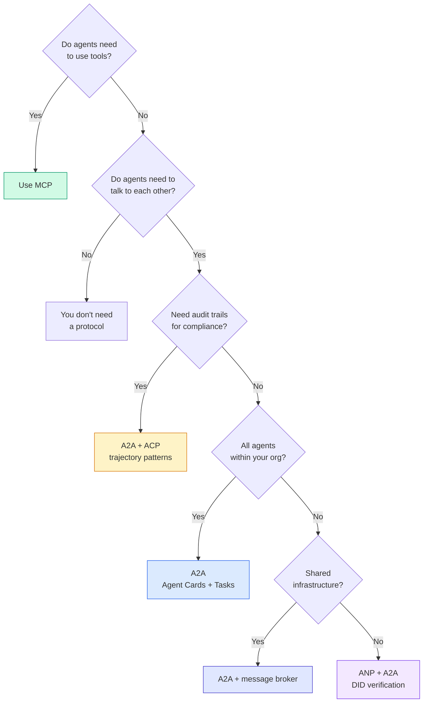

## 交付成果

本课产出：
- `code/main.ts` -- 四种 protocol patterns 的完整实现
- `outputs/prompt-protocol-selector.md` -- 帮你为系统选择 protocols 的 prompt

## 练习

1. **Multi-hop task delegation.** 扩展 `TaskManager`，让 agent handler 可以把 subtasks 委派给其他 agents。researcher 接收 task，将 “search” 和 “summarize” subtasks 委派给两个 specialist agents，等待二者完成，然后把结果 merge 进自己的 artifacts。

2. **Streaming audit trail.** 修改 `AuditableRunner` 以支持 streaming mode。不要等待完整 result，而是在 trajectory entries 加入时实时 yield `AuditEntry` updates。使用一个产出 audit snapshots 的 async generator。

3. **DID rotation.** 给 `IdentityRegistry` 添加 key rotation。agent 应该能发布带 updated keys 的新 DID document，同时维护 `previousDid` reference。Verifiers 应该在 grace period 内接受 current 和 previous key 的 signatures。

4. **Protocol negotiation.** 实现 ANP 的 meta-protocol concept。两个 agents 交换带 candidate formats 的 `protocolNegotiation` messages（例如 “I can speak JSON-RPC” vs “I prefer REST”）。最多 3 轮后，它们同意一个 format 或 timeout。agreed format 决定它们使用哪个 `TaskManager` 或 `AuditableRunner`。

5. **Rate-limited discovery.** 添加一个 `RateLimitedRegistry` wrapper，使用 configurable TTL 缓存 Agent Card lookups，并限制每个 agent 每秒的 discovery queries。模拟 100 个 agents 在 startup 时互相 discovery 的 thundering herd，并测量差异。

## 关键术语

| 术语 | 人们常说 | 实际含义 |
|------|----------------|----------------------|
| MCP | “The protocol for AI tools” | agents 发现并使用 tools 的 client-server protocol。agent-to-tool，不是 agent-to-agent。 |
| A2A | “Google's agent protocol” | Linux Foundation 下用于 agent collaboration 的 peer-to-peer protocol。通过 Agent Cards discovery，9-state task lifecycle，通过 SSE streaming。支持 JSON-RPC、REST 和 gRPC bindings。 |
| ACP | “Enterprise agent messaging” | IBM/BeeAI 的 REST API，用于带 TrajectoryMetadata 的 agent runs：每个 response 都携带完整 reasoning chain 和 tool calls。正在 merge into A2A。 |
| ANP | “Decentralized agent identity” | community protocol，使用 `did:wba`（DID）做 cryptographic identity、HPKE 做 E2EE，并用 AI-powered meta-protocol negotiation 支持从未见过彼此的 agents。 |
| Agent Card | “An agent's business card” | 位于 `/.well-known/agent-card.json` 的 JSON document，描述 skills、supported MIME types、security schemes 和 protocol bindings。 |
| DID | “Decentralized ID” | W3C standard，用于托管在 agent 自己 domain 上的 cryptographically verifiable identities。ANP 使用 `did:wba` method。 |
| TrajectoryMetadata | “The audit receipt” | ACP 机制：将 reasoning steps、tool calls 以及它们的 inputs/outputs 附加到每个 agent response。 |
| Meta-protocol | “Agents negotiating how to talk” | ANP 的方法：agents 用 natural language 动态协商 data formats，然后生成 code 处理它们。 |
| Task | “A unit of work” | A2A 的 stateful object，用于从 submission 到 completion 追踪 work。到达 terminal 后 immutable。 |

## 延伸阅读

- [Google A2A specification](https://github.com/google/A2A) -- official spec and SDKs (v1.0.0, Linux Foundation)
- [IBM/BeeAI ACP specification](https://github.com/i-am-bee/acp) -- agent runs 和 trajectory metadata 的 OpenAPI 3.1 spec
- [Agent Network Protocol](https://github.com/agent-network-protocol/AgentNetworkProtocol) -- DID-based identity、E2EE、meta-protocol negotiation
- [Model Context Protocol docs](https://modelcontextprotocol.io/) -- Anthropic 的 MCP specification（Phase 13 已覆盖）
- [W3C Decentralized Identifiers](https://www.w3.org/TR/did-core/) -- 支撑 ANP 的 identity standard
- [RFC 9180 (HPKE)](https://www.rfc-editor.org/rfc/rfc9180) -- ANP 用于 E2EE 的 encryption scheme
- [FIPA Agent Communication Language](http://www.fipa.org/specs/fipa00061/SC00061G.html) -- modern agent protocols 的 academic precursor
