# 通信协议

> 不能说同一种语言的智能体不是团队。它们只是对着虚空喊话的陌生人。

**类型：** 构建
**语言：** TypeScript
**先修：** 第 14 阶段（智能体工程），第 16.01 课（为什么需要多智能体）
**时间：** ~120 分钟

## 学习目标

- 实现 MCP 工具发现和调用，让智能体能使用外部服务器暴露的工具
- 构建 A2A 智能体卡片和任务 endpoint，让一个智能体能通过 HTTP 把工作委派给另一个智能体
- 比较 MCP（工具访问）、A2A（智能体到智能体）、ACP（企业审计）和 ANP（去中心化信任），并解释每种协议解决哪个问题
- 在同一个系统中接入多个协议，让智能体通过 MCP 发现工具，并通过 A2A 委派任务

## 要解决的问题

你把系统拆成了多个智能体：一个研究员、一个编码员、一个审查员。它们各自的工作都做得很好。但现在你需要它们真的互相交谈。

你的第一次尝试很明显：到处传字符串。研究员返回一大段文本，编码员尽力解析。它能工作，直到编码员误解研究摘要，或者两个智能体互相等待导致死锁，或者你需要由不同团队构建的智能体协作。突然，“只传字符串”分崩离析。

这就是通信协议问题。没有共享契约来规定智能体如何交换信息，多智能体系统就会脆弱、不可审计，并且无法扩展到超过少数几个你亲自写的智能体。

AI 生态用四种协议回应了这个问题，每一种解决不同切片：

- **MCP** 用于工具访问
- **A2A** 用于智能体到智能体协作
- **ACP** 用于企业级可审计性
- **ANP** 用于去中心化身份与信任

本课会深入。你会阅读每个规范的真实线缆格式，构建可运行实现，并把四者连接成统一系统。

## 核心概念

### 协议地图

把这四种协议想成分层，每一层处理不同问题：

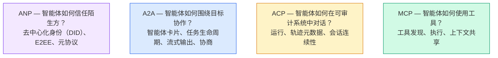

它们不是竞争对手。它们在不同层级解决不同问题。

### MCP（回顾）

MCP 已在第 13 阶段深入覆盖。快速回顾：MCP 标准化 LLM 如何连接外部工具和数据源。它是一个 **client-server** 协议，其中智能体（客户端）发现并调用服务器暴露的工具。

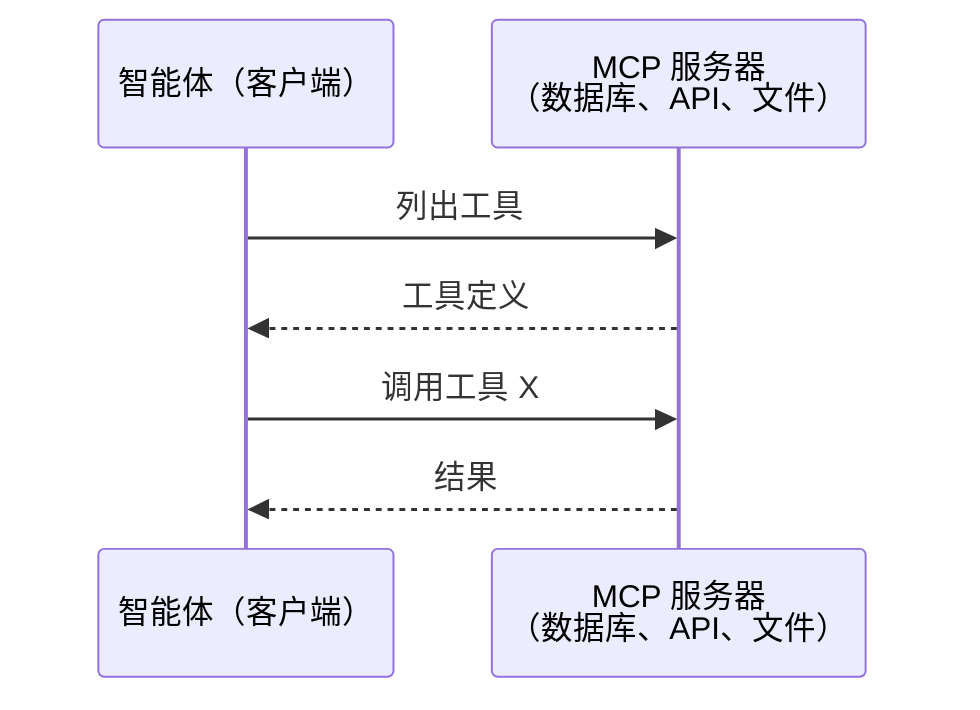

MCP 是 **智能体到工具** 的通信。它不能帮助智能体彼此交谈。

### A2A (Agent2Agent Protocol)

**创建者：** Google（现在位于 Linux Foundation，名为 `lf.a2a.v1`）
**规范版本：** 1.0.0
**问题：** 自主智能体如何彼此协作、协商和委派任务？

A2A 是 **点对点智能体协作** 协议。MCP 将智能体连接到工具，而 A2A 将智能体连接到其他智能体。每个智能体在 well-known URL 发布 **Agent Card**，其他智能体发现它、与其协商，并向它委派任务。

#### A2A 如何工作

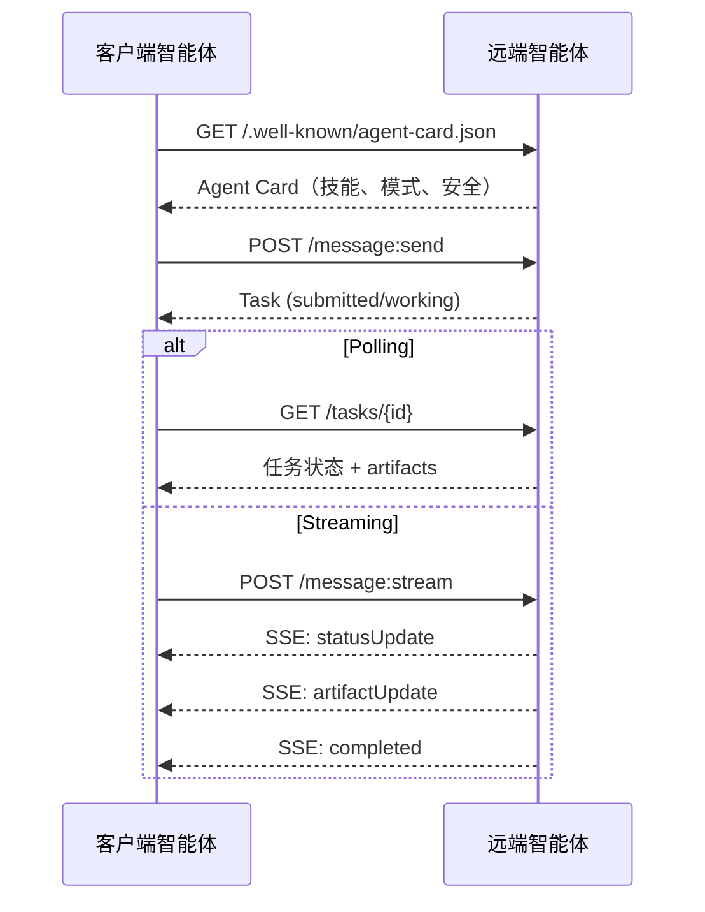

#### 真实 Agent Card

下面是野外真实 A2A Agent Card 的样子。通过 `GET /.well-known/agent-card.json` 提供：

```json
{
  "name": "Research Agent",
  "description": "Searches documentation and summarizes findings",
  "version": "1.0.0",
  "supportedInterfaces": [
    {
      "url": "https://research-agent.example.com/a2a/v1",
      "protocolBinding": "JSONRPC",
      "protocolVersion": "1.0"
    },
    {
      "url": "https://research-agent.example.com/a2a/rest",
      "protocolBinding": "HTTP+JSON",
      "protocolVersion": "1.0"
    }
  ],
  "provider": {
    "organization": "Your Company",
    "url": "https://example.com"
  },
  "capabilities": {
    "streaming": true,
    "pushNotifications": false
  },
  "defaultInputModes": ["text/plain", "application/json"],
  "defaultOutputModes": ["text/plain", "application/json"],
  "skills": [
    {
      "id": "web-research",
      "name": "Web Research",
      "description": "Searches the web and synthesizes findings",
      "tags": ["research", "search", "summarization"],
      "examples": ["Research the latest changes in React 19"]
    },
    {
      "id": "doc-analysis",
      "name": "Documentation Analysis",
      "description": "Reads and analyzes technical documentation",
      "tags": ["docs", "analysis"],
      "inputModes": ["text/plain", "application/pdf"],
      "outputModes": ["application/json"]
    }
  ],
  "securitySchemes": {
    "bearer": {
      "httpAuthSecurityScheme": {
        "scheme": "Bearer",
        "bearerFormat": "JWT"
      }
    }
  },
  "security": [{ "bearer": [] }]
}
```

需要注意的关键点：
- **Skills** 是智能体能做什么。每个 skill 都有 ID、标签，以及支持的输入/输出 MIME 类型。这就是客户端智能体判断远端智能体是否能处理请求的方式。
- **supportedInterfaces** 列出多个协议绑定。单个智能体可以同时使用 JSON-RPC、REST 和 gRPC。
- **Security** 内置在卡片中。客户端在发起第一次请求前就知道需要什么认证。

#### 任务生命周期

任务是 A2A 的核心工作单元。它们会穿过定义好的状态：

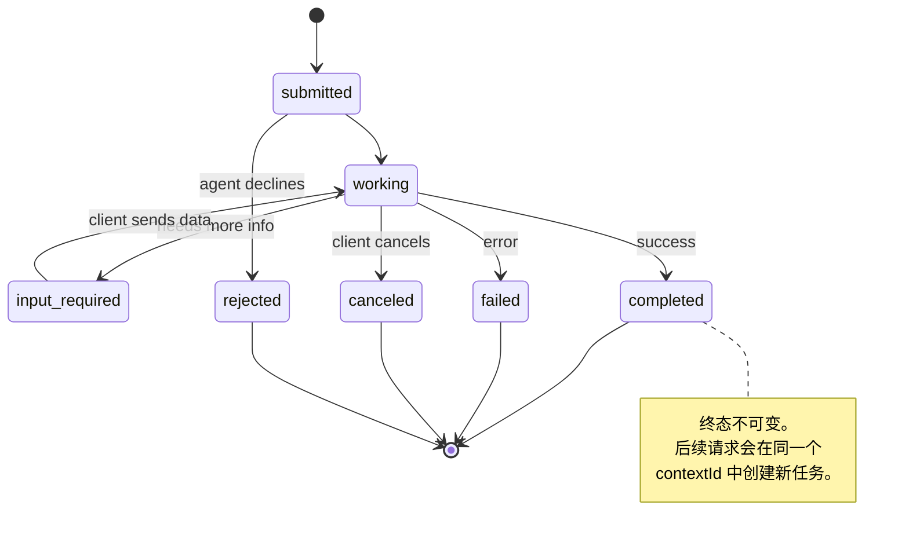

全部 8 个状态（规范还定义了 `UNSPECIFIED` sentinel，这里省略）：

| 状态 | 终态？ | 含义 |
|---|---|---|
| `TASK_STATE_SUBMITTED` | 否 | 已确认，还未处理 |
| `TASK_STATE_WORKING` | 否 | 正在主动处理 |
| `TASK_STATE_INPUT_REQUIRED` | 否 | 智能体需要客户端提供更多信息 |
| `TASK_STATE_AUTH_REQUIRED` | 否 | 需要认证 |
| `TASK_STATE_COMPLETED` | 是 | 成功完成 |
| `TASK_STATE_FAILED` | 是 | 带错误完成 |
| `TASK_STATE_CANCELED` | 是 | 完成前被取消 |
| `TASK_STATE_REJECTED` | 是 | 智能体拒绝任务 |

一旦任务达到终态，它就是不可变的。没有后续消息。后续请求会在同一个 `contextId` 中创建新任务。

#### 线缆格式

A2A 使用 JSON-RPC 2.0。下面是真实消息交换的样子：

**客户端发送任务：**
```json
{
  "jsonrpc": "2.0",
  "id": 1,
  "method": "SendMessage",
  "params": {
    "message": {
      "messageId": "msg-001",
      "role": "ROLE_USER",
      "parts": [{ "text": "Research React 19 compiler features" }]
    },
    "configuration": {
      "acceptedOutputModes": ["text/plain", "application/json"],
      "historyLength": 10
    }
  }
}
```

**智能体返回任务：**
```json
{
  "jsonrpc": "2.0",
  "id": 1,
  "result": {
    "task": {
      "id": "task-abc-123",
      "contextId": "ctx-xyz-789",
      "status": {
        "state": "TASK_STATE_COMPLETED",
        "timestamp": "2026-03-27T10:30:00Z"
      },
      "artifacts": [
        {
          "artifactId": "art-001",
          "name": "research-results",
          "parts": [{
            "data": {
              "findings": [
                "React 19 compiler auto-memoizes components",
                "No more manual useMemo/useCallback needed",
                "Compiler runs at build time, not runtime"
              ]
            },
            "mediaType": "application/json"
          }]
        }
      ]
    }
  }
}
```

**通过 SSE 流式输出：**
```text
POST /message:stream HTTP/1.1
Content-Type: application/json
A2A-Version: 1.0

data: {"task":{"id":"task-123","status":{"state":"TASK_STATE_WORKING"}}}

data: {"statusUpdate":{"taskId":"task-123","status":{"state":"TASK_STATE_WORKING","message":{"role":"ROLE_AGENT","parts":[{"text":"Searching documentation..."}]}}}}

data: {"artifactUpdate":{"taskId":"task-123","artifact":{"artifactId":"art-1","parts":[{"text":"partial findings..."}]},"append":true,"lastChunk":false}}

data: {"statusUpdate":{"taskId":"task-123","status":{"state":"TASK_STATE_COMPLETED"}}}
```

### ACP（Agent Communication Protocol）

**创建者：** IBM / BeeAI
**规范版本：** 0.2.0（OpenAPI 3.1.1）
**状态：** 正在 Linux Foundation 下并入 A2A
**问题：** 智能体如何在具备完整可审计性、会话连续性和轨迹跟踪的情况下通信？

ACP 是 **企业协议**。不同于很多摘要的说法，ACP **不**使用 JSON-LD。它是一个通过 OpenAPI 定义的直接 REST/JSON API。它特别之处在于 **TrajectoryMetadata**：每个智能体响应都可以携带详细日志，记录产生它的推理步骤和工具调用。

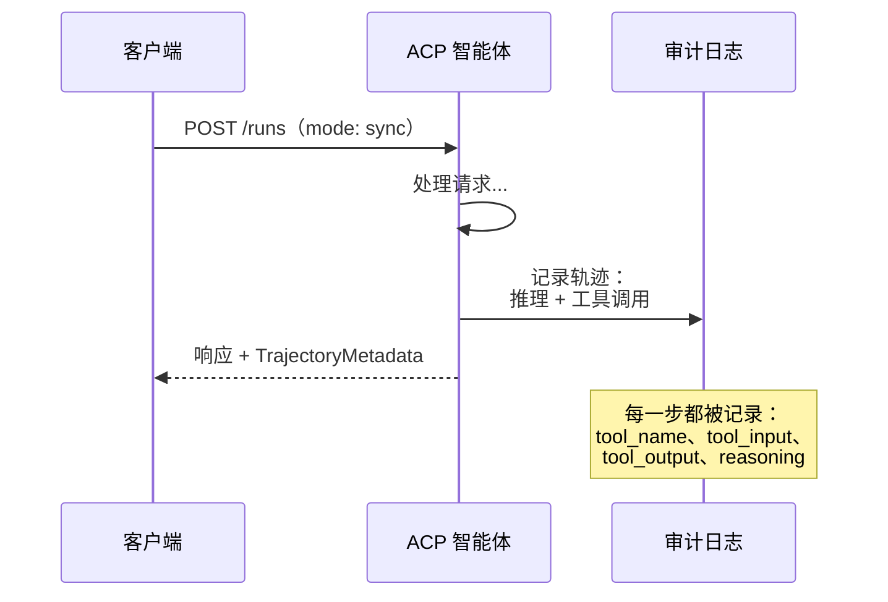

#### ACP 中的智能体发现

ACP 定义四种发现方式：

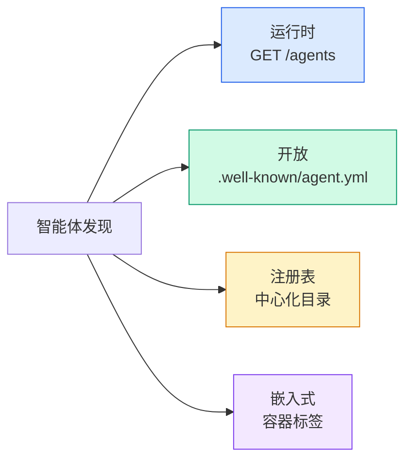

**AgentManifest** 比 A2A 的 Agent Card 更简单：

```json
{
  "name": "summarizer",
  "description": "Summarizes documents with source citations",
  "input_content_types": ["text/plain", "application/pdf"],
  "output_content_types": ["text/plain", "application/json"],
  "metadata": {
    "tags": ["summarization", "RAG"],
    "framework": "BeeAI",
    "capabilities": [
      {
        "name": "Document Summarization",
        "description": "Condenses long documents into key points"
      }
    ],
    "recommended_models": ["llama3.3:70b-instruct-fp16"],
    "license": "Apache-2.0",
    "programming_language": "Python"
  }
}
```

#### Run 生命周期

ACP 使用 “Runs” 而不是 “Tasks”。一个 Run 是三种模式之一的智能体执行：

| 模式 | 行为 |
|---|---|
| `sync` | 阻塞。响应包含完整结果。 |
| `async` | 立即返回 202。轮询 `GET /runs/{id}` 获取状态。 |
| `stream` | SSE 流。事件在智能体工作时触发。 |

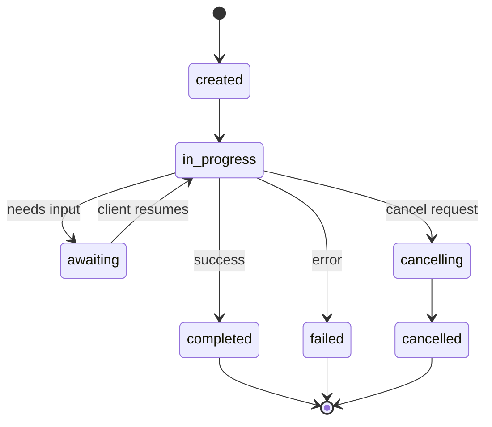

#### TrajectoryMetadata（审计轨迹）

这是 ACP 的关键差异点。每个消息片段都可以包含元数据，精确展示智能体做了什么：

```json
{
  "role": "agent/researcher",
  "parts": [
    {
      "content_type": "text/plain",
      "content": "The weather in San Francisco is 72F and sunny.",
      "metadata": {
        "kind": "trajectory",
        "message": "I need to check the weather for this location",
        "tool_name": "weather_api",
        "tool_input": { "location": "San Francisco, CA" },
        "tool_output": { "temperature": 72, "condition": "sunny" }
      }
    }
  ]
}
```

对受监管行业来说，这是黄金。每个答案都带着可证明的推理链：调用了哪些工具、使用了什么输入、收到什么输出。没有黑盒。

ACP 也支持用于来源归因的 **CitationMetadata**：

```json
{
  "kind": "citation",
  "start_index": 0,
  "end_index": 47,
  "url": "https://weather.gov/sf",
  "title": "NWS San Francisco Forecast"
}
```

### ANP (Agent Network Protocol)

**创建者：** 开源社区（由 GaoWei Chang 创立）
**仓库：** [github.com/agent-network-protocol/AgentNetworkProtocol](https://github.com/agent-network-protocol/AgentNetworkProtocol)
**问题：** 来自不同组织的智能体如何在没有中心权威的情况下彼此信任？

ANP 是 **去中心化身份协议**。它使用 W3C Decentralized Identifiers（去中心化标识符，DID）和端到端加密建立信任。不同于 A2A 通过已知 endpoint 发现智能体，ANP 让智能体能用密码学方式证明自己的身份。

ANP 有三层：

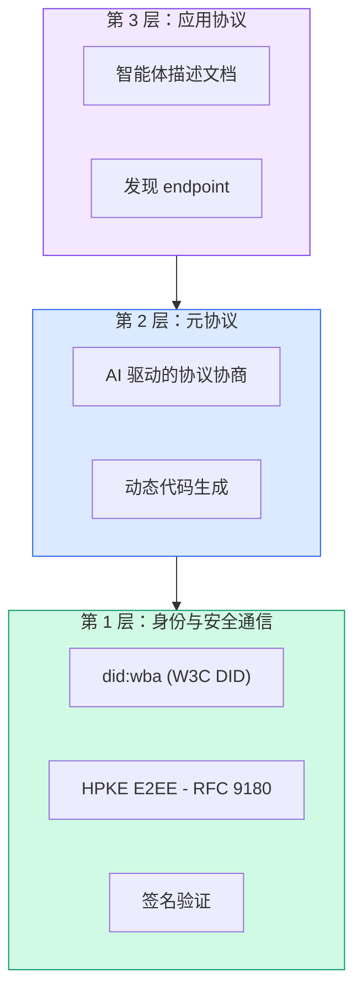

#### DID Documents（真实结构）

ANP 使用一个名为 `did:wba`（Web-Based Agent）的自定义 DID 方法。DID `did:wba:example.com:user:alice` 会解析到 `https://example.com/user/alice/did.json`：

```json
{
  "@context": [
    "https://www.w3.org/ns/did/v1",
    "https://w3id.org/security/suites/jws-2020/v1",
    "https://w3id.org/security/suites/secp256k1-2019/v1"
  ],
  "id": "did:wba:example.com:user:alice",
  "verificationMethod": [
    {
      "id": "did:wba:example.com:user:alice#key-1",
      "type": "EcdsaSecp256k1VerificationKey2019",
      "controller": "did:wba:example.com:user:alice",
      "publicKeyJwk": {
        "crv": "secp256k1",
        "x": "NtngWpJUr-rlNNbs0u-Aa8e16OwSJu6UiFf0Rdo1oJ4",
        "y": "qN1jKupJlFsPFc1UkWinqljv4YE0mq_Ickwnjgasvmo",
        "kty": "EC"
      }
    },
    {
      "id": "did:wba:example.com:user:alice#key-x25519-1",
      "type": "X25519KeyAgreementKey2019",
      "controller": "did:wba:example.com:user:alice",
      "publicKeyMultibase": "z9hFgmPVfmBZwRvFEyniQDBkz9LmV7gDEqytWyGZLmDXE"
    }
  ],
  "authentication": [
    "did:wba:example.com:user:alice#key-1"
  ],
  "keyAgreement": [
    "did:wba:example.com:user:alice#key-x25519-1"
  ],
  "humanAuthorization": [
    "did:wba:example.com:user:alice#key-1"
  ],
  "service": [
    {
      "id": "did:wba:example.com:user:alice#agent-description",
      "type": "AgentDescription",
      "serviceEndpoint": "https://example.com/agents/alice/ad.json"
    }
  ]
}
```

需要注意的关键点：
- **密钥分离** 被强制执行。签名密钥（secp256k1）与加密密钥（X25519）分离。
- **`humanAuthorization`** 是 ANP 独有的。这些密钥在使用前要求明确的人类批准（生物识别、密码、HSM）。资金转账等高风险操作会走这条路径。
- **`keyAgreement`** 密钥用于 HPKE 端到端加密（RFC 9180）。
- **service** section 链接到智能体描述文档。

#### ANP 中的信任如何工作

ANP **不**使用信任网络或背书图。信任是双边的，并在每次交互中验证：

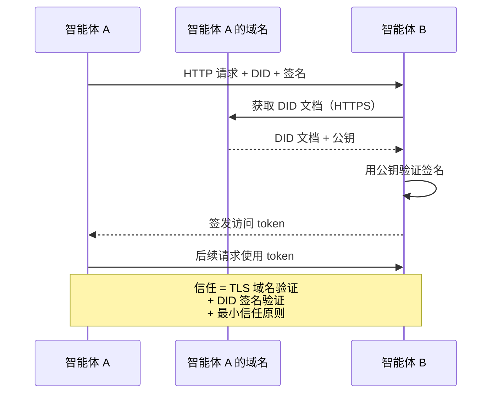

信任来自三个来源：
1. **域名级 TLS** 验证 DID 文档主机
2. **DID 密码学签名** 验证智能体身份
3. **最小信任原则** 只授予最低权限

没有基于 gossip 的信任传播，也没有 PageRank 评分。你通过 DID 直接验证每个智能体。

#### 元协议协商

这是 ANP 最新颖的功能。当两个来自不同生态的智能体相遇时，它们不需要预先约定数据格式。它们用自然语言协商：

```json
{
  "action": "protocolNegotiation",
  "sequenceId": 0,
  "candidateProtocols": "I can communicate using:\n1. JSON-RPC with hotel booking schema\n2. REST with OpenAPI 3.1 spec\n3. Natural language over HTTP",
  "modificationSummary": "Initial proposal",
  "status": "negotiating"
}
```

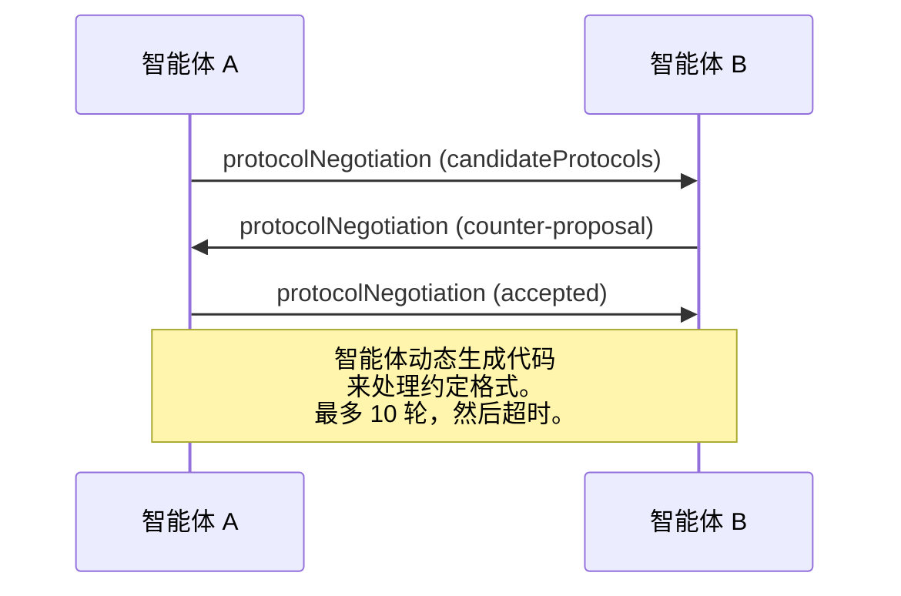

智能体往返协商（最多 10 轮），直到它们同意一种格式，然后动态生成代码来处理它。状态值：`negotiating`、`rejected`、`accepted`、`timeout`。

这意味着两个从未见过彼此的智能体，可以在没有任何人预先定义共享 schema 的情况下，找出如何通信。

### 对比（修正版）

| | MCP | A2A | ACP | ANP |
|---|---|---|---|---|
| **创建者** | Anthropic | Google / Linux Foundation | IBM / BeeAI | 社区 |
| **规范格式** | JSON-RPC | JSON-RPC / REST / gRPC | OpenAPI 3.1（REST） | JSON-RPC |
| **主要用途** | 智能体到工具 | 智能体到智能体 | 智能体到智能体 | 智能体到智能体 |
| **发现方式** | 工具列表 | `/.well-known/agent-card.json` | `GET /agents`、`/.well-known/agent.yml` | `/.well-known/agent-descriptions`、DID service endpoint |
| **身份** | 隐式（本地） | 安全方案（OAuth、mTLS） | 服务器级 | W3C DID（`did:wba`）+ E2EE |
| **审计轨迹** | N/A | 基础（任务历史） | TrajectoryMetadata（工具调用、推理） | 未正式规定 |
| **状态机** | N/A | 9 个任务状态 | 7 个 run 状态 | N/A |
| **流式输出** | N/A | SSE | SSE | 传输无关 |
| **独特功能** | 工具 schema | Agent Card + Skill | 轨迹审计日志 | 元协议协商 |
| **最适合** | 工具与数据 | 动态协作 | 受监管行业 | 跨组织信任 |
| **状态** | 稳定 | 稳定（v1.0） | 正在并入 A2A | 活跃开发 |

### 它们如何一起工作

这些协议并不互斥。一个现实的企业系统会使用多个：

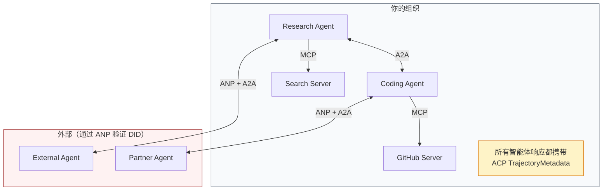

- **MCP** 将每个智能体连接到它的工具
- **A2A** 处理智能体之间的协作（内部和外部）
- **ACP** 用轨迹元数据包装响应，以支持可审计性
- **ANP** 为你不控制的智能体提供身份验证

## 动手实现

### 步骤 1：核心消息类型

每个多智能体系统都从消息格式开始。我们定义映射到真实协议所用内容的类型：

```typescript
import crypto from "node:crypto";

type MessageRole = "user" | "agent";

type MessagePart =
  | { kind: "text"; text: string }
  | { kind: "data"; data: unknown; mediaType: string }
  | { kind: "file"; name: string; url: string; mediaType: string };

type TrajectoryEntry = {
  reasoning: string;
  toolName?: string;
  toolInput?: unknown;
  toolOutput?: unknown;
  timestamp: number;
};

type AgentMessage = {
  id: string;
  role: MessageRole;
  parts: MessagePart[];
  trajectory?: TrajectoryEntry[];
  replyTo?: string;
  timestamp: number;
};

function createMessage(
  role: MessageRole,
  parts: MessagePart[],
  replyTo?: string
): AgentMessage {
  return {
    id: crypto.randomUUID(),
    role,
    parts,
    replyTo,
    timestamp: Date.now(),
  };
}

function textMessage(role: MessageRole, text: string): AgentMessage {
  return createMessage(role, [{ kind: "text", text }]);
}
```

注意：`MessagePart` 是多模态的（文本、结构化数据、文件），和真实 A2A 与 ACP 规范一样。`TrajectoryEntry` 捕获推理链，匹配 ACP 的 TrajectoryMetadata。

### 步骤 2：A2A 智能体卡片与注册表

构建与真实 A2A 规范匹配的智能体发现：

```typescript
type Skill = {
  id: string;
  name: string;
  description: string;
  tags: string[];
  inputModes: string[];
  outputModes: string[];
};

type AgentCard = {
  name: string;
  description: string;
  version: string;
  url: string;
  capabilities: {
    streaming: boolean;
    pushNotifications: boolean;
  };
  defaultInputModes: string[];
  defaultOutputModes: string[];
  skills: Skill[];
};

class AgentRegistry {
  private cards: Map<string, AgentCard> = new Map();

  register(card: AgentCard) {
    this.cards.set(card.name, card);
  }

  discoverBySkillTag(tag: string): AgentCard[] {
    return [...this.cards.values()].filter((card) =>
      card.skills.some((skill) => skill.tags.includes(tag))
    );
  }

  discoverByInputMode(mimeType: string): AgentCard[] {
    return [...this.cards.values()].filter(
      (card) =>
        card.defaultInputModes.includes(mimeType) ||
        card.skills.some((skill) => skill.inputModes.includes(mimeType))
    );
  }

  resolve(name: string): AgentCard | undefined {
    return this.cards.get(name);
  }

  listAll(): AgentCard[] {
    return [...this.cards.values()];
  }
}
```

这比简单的 name-to-capability map 丰富得多。你可以按技能标签、输入 MIME 类型或名称发现智能体，就像真实 A2A 规范支持的那样。

### 步骤 3：A2A 任务生命周期

构建完整任务状态机：

```typescript
type TaskState =
  | "submitted"
  | "working"
  | "input-required"
  | "auth-required"
  | "completed"
  | "failed"
  | "canceled"
  | "rejected";

const TERMINAL_STATES: TaskState[] = [
  "completed",
  "failed",
  "canceled",
  "rejected",
];

type TaskStatus = {
  state: TaskState;
  message?: AgentMessage;
  timestamp: number;
};

type Artifact = {
  id: string;
  name: string;
  parts: MessagePart[];
};

type Task = {
  id: string;
  contextId: string;
  status: TaskStatus;
  artifacts: Artifact[];
  history: AgentMessage[];
};

type TaskEvent =
  | { kind: "statusUpdate"; taskId: string; status: TaskStatus }
  | {
      kind: "artifactUpdate";
      taskId: string;
      artifact: Artifact;
      append: boolean;
      lastChunk: boolean;
    };

type TaskHandler = (
  task: Task,
  message: AgentMessage
) => AsyncGenerator<TaskEvent>;

class TaskManager {
  private tasks: Map<string, Task> = new Map();
  private handlers: Map<string, TaskHandler> = new Map();
  private listeners: Map<string, ((event: TaskEvent) => void)[]> = new Map();

  registerHandler(agentName: string, handler: TaskHandler) {
    this.handlers.set(agentName, handler);
  }

  subscribe(taskId: string, listener: (event: TaskEvent) => void) {
    const existing = this.listeners.get(taskId) ?? [];
    existing.push(listener);
    this.listeners.set(taskId, existing);
  }

  async sendMessage(
    agentName: string,
    message: AgentMessage,
    contextId?: string
  ): Promise<Task> {
    const handler = this.handlers.get(agentName);
    if (!handler) {
      const task = this.createTask(contextId);
      task.status = {
        state: "rejected",
        timestamp: Date.now(),
        message: textMessage("agent", `No handler for ${agentName}`),
      };
      return task;
    }

    const task = this.createTask(contextId);
    task.history.push(message);
    task.status = { state: "submitted", timestamp: Date.now() };

    this.processTask(task, handler, message).catch((err) => {
      task.status = {
        state: "failed",
        timestamp: Date.now(),
        message: textMessage("agent", String(err)),
      };
    });
    return task;
  }

  getTask(taskId: string): Task | undefined {
    return this.tasks.get(taskId);
  }

  cancelTask(taskId: string): boolean {
    const task = this.tasks.get(taskId);
    if (!task || TERMINAL_STATES.includes(task.status.state)) return false;
    task.status = { state: "canceled", timestamp: Date.now() };
    this.emit(taskId, {
      kind: "statusUpdate",
      taskId,
      status: task.status,
    });
    return true;
  }

  private createTask(contextId?: string): Task {
    const task: Task = {
      id: crypto.randomUUID(),
      contextId: contextId ?? crypto.randomUUID(),
      status: { state: "submitted", timestamp: Date.now() },
      artifacts: [],
      history: [],
    };
    this.tasks.set(task.id, task);
    return task;
  }

  private async processTask(
    task: Task,
    handler: TaskHandler,
    message: AgentMessage
  ) {
    task.status = { state: "working", timestamp: Date.now() };
    this.emit(task.id, {
      kind: "statusUpdate",
      taskId: task.id,
      status: task.status,
    });

    try {
      for await (const event of handler(task, message)) {
        if (TERMINAL_STATES.includes(task.status.state)) break;

        if (event.kind === "statusUpdate") {
          task.status = event.status;
        }
        if (event.kind === "artifactUpdate") {
          const existing = task.artifacts.find(
            (a) => a.id === event.artifact.id
          );
          if (existing && event.append) {
            existing.parts.push(...event.artifact.parts);
          } else {
            task.artifacts.push(event.artifact);
          }
        }
        this.emit(task.id, event);
      }
    } catch (err) {
      task.status = {
        state: "failed",
        timestamp: Date.now(),
        message: textMessage("agent", String(err)),
      };
      this.emit(task.id, {
        kind: "statusUpdate",
        taskId: task.id,
        status: task.status,
      });
    }
  }

  private emit(taskId: string, event: TaskEvent) {
    for (const listener of this.listeners.get(taskId) ?? []) {
      listener(event);
    }
  }
}
```

这实现了真实 A2A 任务生命周期：submitted、working、input-required 和终态。Handler 是异步生成器，会 yield event（状态更新和 artifact chunk），匹配 SSE 流式模型。

### 步骤 4：ACP 风格审计轨迹

用轨迹跟踪包装通信：

```typescript
type AuditEntry = {
  runId: string;
  agentName: string;
  input: AgentMessage[];
  output: AgentMessage[];
  trajectory: TrajectoryEntry[];
  status: "created" | "in-progress" | "completed" | "failed" | "awaiting";
  startedAt: number;
  completedAt?: number;
  sessionId?: string;
};

class AuditableRunner {
  private log: AuditEntry[] = [];
  private handlers: Map<
    string,
    (input: AgentMessage[]) => Promise<{
      output: AgentMessage[];
      trajectory: TrajectoryEntry[];
    }>
  > = new Map();

  registerAgent(
    name: string,
    handler: (input: AgentMessage[]) => Promise<{
      output: AgentMessage[];
      trajectory: TrajectoryEntry[];
    }>
  ) {
    this.handlers.set(name, handler);
  }

  async run(
    agentName: string,
    input: AgentMessage[],
    sessionId?: string
  ): Promise<AuditEntry> {
    const entry: AuditEntry = {
      runId: crypto.randomUUID(),
      agentName,
      input: structuredClone(input),
      output: [],
      trajectory: [],
      status: "created",
      startedAt: Date.now(),
      sessionId,
    };
    this.log.push(entry);

    const handler = this.handlers.get(agentName);
    if (!handler) {
      entry.status = "failed";
      return entry;
    }

    entry.status = "in-progress";
    try {
      const result = await handler(input);
      entry.output = structuredClone(result.output);
      entry.trajectory = structuredClone(result.trajectory);
      entry.status = "completed";
      entry.completedAt = Date.now();
    } catch (err) {
      entry.status = "failed";
      entry.trajectory.push({
        reasoning: `Error: ${String(err)}`,
        timestamp: Date.now(),
      });
      entry.completedAt = Date.now();
    }
    return entry;
  }

  getFullAuditLog(): AuditEntry[] {
    return structuredClone(this.log);
  }

  getAuditLogForAgent(agentName: string): AuditEntry[] {
    return structuredClone(
      this.log.filter((e) => e.agentName === agentName)
    );
  }

  getAuditLogForSession(sessionId: string): AuditEntry[] {
    return structuredClone(
      this.log.filter((e) => e.sessionId === sessionId)
    );
  }

  getTrajectoryForRun(runId: string): TrajectoryEntry[] {
    const entry = this.log.find((e) => e.runId === runId);
    return entry ? structuredClone(entry.trajectory) : [];
  }
}
```

每次智能体执行都会产生完整审计条目：输入了什么、输出了什么，以及中间完整的工具调用与推理步骤轨迹。你可以按智能体、会话或单个 run 查询。

### 步骤 5：ANP 风格身份验证

构建基于 DID 的身份与验证：

```typescript
type VerificationMethod = {
  id: string;
  type: string;
  controller: string;
  publicKeyDer: string;
};

type DIDDocument = {
  id: string;
  verificationMethod: VerificationMethod[];
  authentication: string[];
  keyAgreement: string[];
  humanAuthorization: string[];
  service: { id: string; type: string; serviceEndpoint: string }[];
};

type AgentIdentity = {
  did: string;
  document: DIDDocument;
  privateKey: crypto.KeyObject;
  publicKey: crypto.KeyObject;
};

class IdentityRegistry {
  private documents: Map<string, DIDDocument> = new Map();

  publish(doc: DIDDocument) {
    this.documents.set(doc.id, doc);
  }

  resolve(did: string): DIDDocument | undefined {
    return this.documents.get(did);
  }

  verify(did: string, signature: string, payload: string): boolean {
    const doc = this.documents.get(did);
    if (!doc) return false;

    const authKeyIds = doc.authentication;
    const authKeys = doc.verificationMethod.filter((vm) =>
      authKeyIds.includes(vm.id)
    );

    for (const key of authKeys) {
      const publicKey = crypto.createPublicKey({
        key: Buffer.from(key.publicKeyDer, "base64"),
        format: "der",
        type: "spki",
      });
      const isValid = crypto.verify(
        null,
        Buffer.from(payload),
        publicKey,
        Buffer.from(signature, "hex")
      );
      if (isValid) return true;
    }
    return false;
  }

  requiresHumanAuth(did: string, operationKeyId: string): boolean {
    const doc = this.documents.get(did);
    if (!doc) return false;
    return doc.humanAuthorization.includes(operationKeyId);
  }
}

function createIdentity(domain: string, agentName: string): AgentIdentity {
  const did = `did:wba:${domain}:agent:${agentName}`;
  const { publicKey, privateKey } = crypto.generateKeyPairSync("ed25519");

  const publicKeyDer = publicKey
    .export({ format: "der", type: "spki" })
    .toString("base64");

  const keyId = `${did}#key-1`;
  const encKeyId = `${did}#key-x25519-1`;

  const document: DIDDocument = {
    id: did,
    verificationMethod: [
      {
        id: keyId,
        type: "Ed25519VerificationKey2020",
        controller: did,
        publicKeyDer,
      },
      {
        id: encKeyId,
        type: "X25519KeyAgreementKey2019",
        controller: did,
        publicKeyDer,
      },
    ],
    authentication: [keyId],
    keyAgreement: [encKeyId],
    humanAuthorization: [],
    service: [
      {
        id: `${did}#agent-description`,
        type: "AgentDescription",
        serviceEndpoint: `https://${domain}/agents/${agentName}/ad.json`,
      },
    ],
  };

  return { did, document, privateKey, publicKey };
}

function signPayload(identity: AgentIdentity, payload: string): string {
  return crypto
    .sign(null, Buffer.from(payload), identity.privateKey)
    .toString("hex");
}
```

这镜像了真实 ANP 身份模型：智能体有 DID 文档，其中 authentication、key agreement 和 human authorization keys 分开。`IdentityRegistry` 模拟 DID 解析（生产中这会是对智能体域名的 HTTP 获取）。

### 步骤 6：协议网关

将四个协议连接成统一系统：

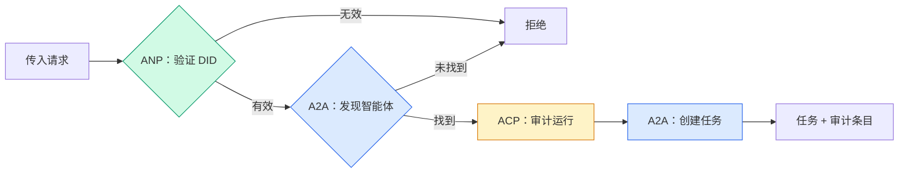

```typescript
class ProtocolGateway {
  private registry: AgentRegistry;
  private taskManager: TaskManager;
  private auditRunner: AuditableRunner;
  private identityRegistry: IdentityRegistry;

  constructor(
    registry: AgentRegistry,
    taskManager: TaskManager,
    auditRunner: AuditableRunner,
    identityRegistry: IdentityRegistry
  ) {
    this.registry = registry;
    this.taskManager = taskManager;
    this.auditRunner = auditRunner;
    this.identityRegistry = identityRegistry;
  }

  async delegateTask(
    fromDid: string,
    signature: string,
    targetAgent: string,
    message: AgentMessage,
    sessionId?: string
  ): Promise<{ task: Task; audit: AuditEntry } | { error: string }> {
    if (!this.identityRegistry.verify(fromDid, signature, message.id)) {
      return { error: "Identity verification failed" };
    }

    const card = this.registry.resolve(targetAgent);
    if (!card) {
      return { error: `Agent ${targetAgent} not found in registry` };
    }

    const audit = await this.auditRunner.run(
      targetAgent,
      [message],
      sessionId
    );
    const task = await this.taskManager.sendMessage(targetAgent, message);

    return { task, audit };
  }

  discoverAndDelegate(
    fromDid: string,
    signature: string,
    skillTag: string,
    message: AgentMessage
  ): Promise<{ task: Task; audit: AuditEntry } | { error: string }> {
    const candidates = this.registry.discoverBySkillTag(skillTag);
    if (candidates.length === 0) {
      return Promise.resolve({
        error: `No agents found with skill tag: ${skillTag}`,
      });
    }
    return this.delegateTask(
      fromDid,
      signature,
      candidates[0].name,
      message
    );
  }
}
```

网关在一次调用中做四件事：
1. **ANP**：通过 DID 签名验证调用方身份
2. **A2A**：发现目标智能体并检查能力
3. **ACP**：用审计轨迹和运行轨迹包装执行
4. **A2A**：创建带完整生命周期跟踪的任务

### 步骤 7：把所有部分接在一起

```typescript
async function protocolDemo() {
  const registry = new AgentRegistry();
  registry.register({
    name: "researcher",
    description: "Searches and summarizes findings",
    version: "1.0.0",
    url: "https://researcher.local/a2a/v1",
    capabilities: { streaming: true, pushNotifications: false },
    defaultInputModes: ["text/plain"],
    defaultOutputModes: ["text/plain", "application/json"],
    skills: [
      {
        id: "web-research",
        name: "Web Research",
        description: "Searches the web",
        tags: ["research", "search", "summarization"],
        inputModes: ["text/plain"],
        outputModes: ["application/json"],
      },
    ],
  });
  registry.register({
    name: "coder",
    description: "Writes code from specs",
    version: "1.0.0",
    url: "https://coder.local/a2a/v1",
    capabilities: { streaming: false, pushNotifications: false },
    defaultInputModes: ["text/plain", "application/json"],
    defaultOutputModes: ["text/plain"],
    skills: [
      {
        id: "code-gen",
        name: "Code Generation",
        description: "Generates code",
        tags: ["coding", "generation"],
        inputModes: ["text/plain", "application/json"],
        outputModes: ["text/plain"],
      },
    ],
  });

  const taskManager = new TaskManager();
  const auditRunner = new AuditableRunner();

  const researchTrajectory: TrajectoryEntry[] = [];

  taskManager.registerHandler(
    "researcher",
    async function* (task, message) {
      yield {
        kind: "statusUpdate" as const,
        taskId: task.id,
        status: { state: "working" as const, timestamp: Date.now() },
      };

      researchTrajectory.push({
        reasoning: "Searching for React 19 documentation",
        toolName: "web_search",
        toolInput: { query: "React 19 compiler features" },
        toolOutput: {
          results: ["react.dev/blog/react-19", "github.com/react/react"],
        },
        timestamp: Date.now(),
      });

      researchTrajectory.push({
        reasoning: "Extracting key findings from search results",
        toolName: "doc_analysis",
        toolInput: { url: "react.dev/blog/react-19" },
        toolOutput: {
          summary:
            "React 19 compiler auto-memoizes, no manual useMemo needed",
        },
        timestamp: Date.now(),
      });

      yield {
        kind: "artifactUpdate" as const,
        taskId: task.id,
        artifact: {
          id: crypto.randomUUID(),
          name: "research-results",
          parts: [
            {
              kind: "data" as const,
              data: {
                findings: [
                  "React 19 compiler auto-memoizes components",
                  "No more manual useMemo/useCallback needed",
                  "Compiler runs at build time, not runtime",
                ],
                sources: ["react.dev/blog/react-19"],
              },
              mediaType: "application/json",
            },
          ],
        },
        append: false,
        lastChunk: true,
      };

      yield {
        kind: "statusUpdate" as const,
        taskId: task.id,
        status: { state: "completed" as const, timestamp: Date.now() },
      };
    }
  );

  auditRunner.registerAgent("researcher", async () => ({
    output: [
      textMessage("agent", "React 19 compiler auto-memoizes components"),
    ],
    trajectory: researchTrajectory,
  }));

  const identityRegistry = new IdentityRegistry();

  const coderIdentity = createIdentity("coder.local", "coder");
  const researcherIdentity = createIdentity("researcher.local", "researcher");

  identityRegistry.publish(coderIdentity.document);
  identityRegistry.publish(researcherIdentity.document);

  const gateway = new ProtocolGateway(
    registry,
    taskManager,
    auditRunner,
    identityRegistry
  );

  console.log("=== Protocol Demo ===\n");

  console.log("1. Agent Discovery (A2A)");
  const researchAgents = registry.discoverBySkillTag("research");
  console.log(
    `   Found ${researchAgents.length} agent(s):`,
    researchAgents.map((a) => a.name)
  );

  console.log("\n2. Identity Verification (ANP)");
  const message = textMessage("user", "Research React 19 compiler features");
  const signature = signPayload(coderIdentity, message.id);
  const verified = identityRegistry.verify(
    coderIdentity.did,
    signature,
    message.id
  );
  console.log(`   Coder DID: ${coderIdentity.did}`);
  console.log(`   Signature verified: ${verified}`);

  console.log("\n3. Task Delegation (A2A + ACP + ANP)");
  const result = await gateway.delegateTask(
    coderIdentity.did,
    signature,
    "researcher",
    message,
    "session-001"
  );

  if ("error" in result) {
    console.log(`   Error: ${result.error}`);
    return;
  }

  console.log(`   Task ID: ${result.task.id}`);
  console.log(`   Task state: ${result.task.status.state}`);
  console.log(`   Artifacts: ${result.task.artifacts.length}`);

  console.log("\n4. Audit Trail (ACP)");
  console.log(`   Run ID: ${result.audit.runId}`);
  console.log(`   Status: ${result.audit.status}`);
  console.log(`   Trajectory steps: ${result.audit.trajectory.length}`);
  for (const step of result.audit.trajectory) {
    console.log(`     - ${step.reasoning}`);
    if (step.toolName) {
      console.log(`       Tool: ${step.toolName}`);
    }
  }

  console.log("\n5. Full Audit Log");
  const fullLog = auditRunner.getFullAuditLog();
  console.log(`   Total runs: ${fullLog.length}`);
  for (const entry of fullLog) {
    const duration = entry.completedAt
      ? `${entry.completedAt - entry.startedAt}ms`
      : "in-progress";
    console.log(`   ${entry.agentName}: ${entry.status} (${duration})`);
  }
}

protocolDemo().catch((err) => {
  console.error("Protocol demo failed:", err);
  process.exitCode = 1;
});
```

## 哪里会出错

协议解决正常路径。生产中会出问题的是这些：

**Schema 漂移。** 智能体 A 发布 Agent Card，宣称有 `application/json` 输出。但 JSON schema 在版本之间变化。智能体 B 按旧格式解析，得到垃圾结果。修复：给 skills 和输出 schema 做版本管理。A2A 规范正是为此支持 Agent Card 上的 `version`。

**状态机违规。** 一个智能体 handler yield 了 `completed` event，然后试图 yield 更多 artifact。任务是不可变的。你的代码要么静默丢弃更新，要么抛错。修复：yield 前检查终态。上面的 `TaskManager` 用终态之后的 `break` 强制这一点。

**信任解析失败。** 智能体 A 尝试验证智能体 B 的 DID，但智能体 B 的域名宕机。DID 文档无法获取。你是 fail open（接受未验证智能体）还是 fail closed（全部拒绝）？ANP 建议按最小信任原则 fail closed。

**轨迹膨胀。** ACP 轨迹日志很强大，但昂贵。一个每次 run 发起 200 次工具调用的复杂智能体会产生巨大的审计条目。修复：用可配置的详细级别记录轨迹。为合规记录工具名和 IO，对非监管负载跳过推理步骤。

**发现阶段惊群。** 50 个智能体启动时同时查询 `GET /agents`。修复：用 TTL 缓存 Agent Card，错开发现间隔，或用基于推送的注册替代轮询。

## 实际使用

### 真实实现

**A2A** 最成熟。Google 的 [official spec](https://github.com/google/A2A) 在 Linux Foundation 下开源。提供 Python 和 TypeScript SDK。如果你的智能体需要动态发现和协作，从这里开始。

**ACP** 正在并入 A2A。IBM 的 [BeeAI project](https://github.com/i-am-bee/acp) 创建 ACP 作为 REST-first 替代方案，但轨迹元数据概念正被吸收到 A2A 生态中。即便用 A2A 做传输，也可以使用 ACP 模式（轨迹日志、run 生命周期）。

**ANP** 最实验性。[community repo](https://github.com/agent-network-protocol/AgentNetworkProtocol) 有 Python SDK（AgentConnect）。元协议协商概念是真正新颖的。值得关注跨组织智能体部署。

**MCP** 已在第 13 阶段覆盖。如果你希望智能体使用工具，MCP 是标准选择。

### 选择正确协议

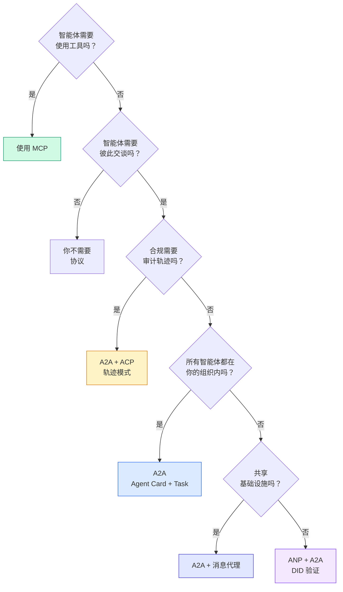

## 交付成果

本课产出：
- `code/main.ts` -- 四种协议模式的完整实现
- `outputs/prompt-protocol-selector.md` -- 帮你为系统选择协议的提示词

## 练习

1. **多跳任务委派。** 扩展 `TaskManager`，让智能体 handler 可以把子任务委派给其他智能体。researcher 接收任务，将 “search” 和 “summarize” 子任务委派给两个专门智能体，等待二者完成，然后把结果合并进自己的 artifact。

2. **流式审计轨迹。** 修改 `AuditableRunner` 以支持流式模式。不要等待完整结果，而是在轨迹条目加入时实时 yield `AuditEntry` 更新。使用一个产出审计快照的异步生成器。

3. **DID 轮换。** 给 `IdentityRegistry` 添加密钥轮换。智能体应该能发布带新密钥的新 DID 文档，同时维护 `previousDid` 引用。验证方应该在宽限期内接受当前密钥和上一个密钥的签名。

4. **协议协商。** 实现 ANP 的元协议概念。两个智能体交换带候选格式的 `protocolNegotiation` 消息（例如 “I can speak JSON-RPC” 和 “I prefer REST”）。最多 3 轮后，它们同意一种格式或超时。约定格式决定它们使用哪个 `TaskManager` 或 `AuditableRunner`。

5. **限速发现。** 添加一个 `RateLimitedRegistry` wrapper，使用可配置 TTL 缓存 Agent Card 查找，并限制每个智能体每秒的发现查询。模拟 100 个智能体在启动时互相发现造成的惊群，并测量差异。

## 关键术语

| 术语 | 人们常说 | 实际含义 |
|------|----------------|----------------------|
| MCP | “AI 工具协议” | 智能体发现并使用工具的 client-server 协议。agent-to-tool，不是 agent-to-agent。 |
| A2A | “Google 的智能体协议” | Linux Foundation 下用于智能体协作的点对点协议。通过 Agent Card 发现，9 状态任务生命周期，通过 SSE 流式输出。支持 JSON-RPC、REST 和 gRPC 绑定。 |
| ACP | “企业智能体消息” | IBM/BeeAI 的 REST API，用于带 TrajectoryMetadata 的智能体运行：每个响应都携带完整推理链和工具调用。正在并入 A2A。 |
| ANP | “去中心化智能体身份” | 社区协议，使用 `did:wba`（DID）做密码学身份、HPKE 做 E2EE，并用 AI 驱动的元协议协商支持从未见过彼此的智能体。 |
| Agent Card | “智能体名片” | 位于 `/.well-known/agent-card.json` 的 JSON 文档，描述技能、支持的 MIME 类型、安全方案和协议绑定。 |
| DID | “去中心化 ID” | W3C 标准，用于托管在智能体自己域名上的可密码学验证身份。ANP 使用 `did:wba` 方法。 |
| TrajectoryMetadata | “审计回执” | ACP 机制：将推理步骤、工具调用以及它们的输入/输出附加到每个智能体响应。 |
| Meta-protocol | “智能体协商如何对话” | ANP 的方法：智能体用自然语言动态协商数据格式，然后生成代码处理它们。 |
| Task | “工作单元” | A2A 的有状态对象，用于从提交到完成追踪工作。到达终态后不可变。 |

## 延伸阅读

- [Google A2A specification](https://github.com/google/A2A) -- 官方规范和 SDK（v1.0.0，Linux Foundation）
- [IBM/BeeAI ACP specification](https://github.com/i-am-bee/acp) -- 智能体 run 和轨迹元数据的 OpenAPI 3.1 规范
- [Agent Network Protocol](https://github.com/agent-network-protocol/AgentNetworkProtocol) -- 基于 DID 的身份、E2EE、元协议协商
- [Model Context Protocol docs](https://modelcontextprotocol.io/) -- Anthropic 的 MCP 规范（第 13 阶段已覆盖）
- [W3C Decentralized Identifiers](https://www.w3.org/TR/did-core/) -- 支撑 ANP 的身份标准
- [RFC 9180 (HPKE)](https://www.rfc-editor.org/rfc/rfc9180) -- ANP 用于 E2EE 的加密方案
- [FIPA Agent Communication Language](http://www.fipa.org/specs/fipa00061/SC00061G.html) -- 现代智能体协议的学术先驱
