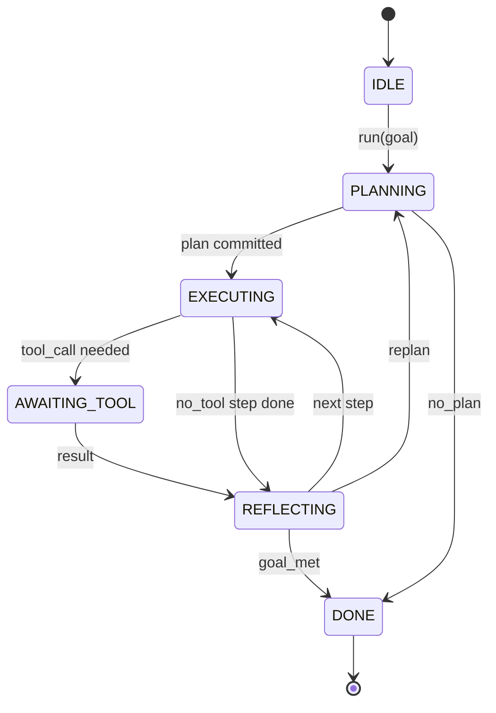

# Agent Harness 循环契约

> Harness 就是 agent。Model 是 coprocessor。本课冻结 loop contract，让你可以把任何 model 接进来。

**类型:** Build
**语言:** Python
**先修:** Phase 13 lessons 01-07，Phase 14 lesson 01
**时间:** ~90 分钟

## 学习目标
- 将 agent harness loop 规定为带显式 transitions 的确定性 state machine。
- 实现 10 个 lifecycle hook topics，让 operators 可以把 policy、telemetry 和 guardrails 接入其中。
- 定义两个 pull points，让 loop 把控制权交还给 caller，并在新输入上 resume。
- 在不泄露 partial state 的前提下，在超限时强制 per-session budgets（turns、tool calls、wall-clock）。
- 发出包含 11 种 event types 的 typed stream，让下游 UIs 和 tracers 无需直接 inspect loop 就能订阅。

## 框架

一个无人值守运行四十轮的 coding agent 不是 chat loop。它是一个 state machine：operator 可以拦截其中的 nodes，也可以审计其中的 edges。一旦你把 contract 写下来，替换 models、tools 或 policies 就不再是 refactor，而是一次 registration call。

本课构建这个 contract。我们会命名六个 states、十个 hook topics、两个 pull points、十一种 event types，以及一个 budget envelope。Harness 中的其他所有东西（tool registry、JSON-RPC transport、dispatcher、planner）都会插入这个形状。

## 状态

Loop 有六个 states。五个是 active。一个是 terminal。



`IDLE` 是唯一合法入口。`DONE` 是唯一合法出口。`AWAITING_TOOL` 是唯一会 yield 一个 pull point 的状态。其他每个 transition 都是内部 transition。

这个 state machine 是确定性的。给定相同 event log，harness 会重新进入相同 state。这个性质让你可以 replay sessions 做 debugging，而不必再次调用 model。

## 钩子主题

Hooks 是 operator 接入 loop 的 seam。Harness 触发十个 topics。每个 topic 接受任意数量 subscribers。Subscribers 按 registration order 触发。Subscriber 可以 mutate payload、raise 以 abort 本轮，或返回 sentinel 来 skip next step。

```text
before_plan         after_plan
before_tool_call    after_tool_call
before_step         after_step
on_error
on_pause
on_budget_exceeded
on_complete
```

这个形状映射了 Claude Code、Cursor 和 OpenCode 到 2025 年中都收敛出的模式。名称是功能性的，不是品牌化的。阻止 `rm -rf` 的 hook 属于 `before_tool_call`。发送 OpenTelemetry span 的 hook 属于 `after_step`。在 paused session 上 resume 的 hook 属于 `on_pause`。

## 拉取点

Loop 会两次 yield control。第一次是在 `AWAITING_TOOL`，当它没有 tool result 就无法继续时。第二次是在 `on_pause`，当 budget exhausted，或某个 hook 明确要求 human review 时。

Pull point 不是 exception，而是 return。Caller inspect harness state，fetch harness 请求的内容，然后调用 `resume(payload)`。Harness 会从停止的位置继续。这与 Python generator 是同一种形状。Pull point 上的 transport 由你选择。在 TUI 中它是 keypress。通过 MCP 时它是 `tools/call`。通过 queue 时它是 job poll。

## 事件流

Loop 会在 contract 的特定点把 events append 到 typed stream。Stream 是 append-only，subscribers 可以从任意 offset replay。实现的 11 种 event types 是：

- `session.start` — 调用 `run(goal)` 时发出一次
- `plan.draft` — planner 返回 draft plan 时发出
- `plan.commit` — draft 被提交为 active plan 后发出
- `step.start` — 每个 executing step 开始时发出
- `step.end` — 每个 executing step 结束时发出
- `tool.call` — 需要 tool 的 step 把控制权 yield 给 caller 时发出
- `tool.result` — 带 tool result resume 时发出
- `tool.error` — 带 error resume，或 hook aborts call 时发出
- `budget.warn` — 到达 budget limit 时发出
- `session.pause` — loop 因 pause（budget 或 hook）yield 时发出
- `session.complete` — loop 到达 `DONE` 时发出一次

Events 不复制 hook payloads。Hooks 是 imperative 的（mutate、abort）。Events 是 observational 的（record、ship）。把它们当作 orthogonal。

## 预算包络

Session 携带三个 limits。Turn count、tool call count、wall-clock seconds。每一轮 turns 加一。每次 tool call tool calls 加一。每个 state transition 都检查 wall-clock。当任一 limit 到达时，loop 触发 `on_budget_exceeded`，发出 `budget.warn`，然后在下一个 pull point 上以 budget-exceeded reason transition 到 `IDLE`。

Budget 不是 kill switch。它是 yield。Caller 决定是 extend budget 并 resume，还是 close session。

## 本课不做什么

它不调用 model。它不注册真实 tools。它不实现 transport。这些是接下来的四课。本课钉住 contract，让后面四课可以插入其中，而不用重写。

`main.py` 中的 deterministic planner 是 stand-in。它返回一个 hardcoded plan，包含三个 steps，其中两个需要 tool result。重点是 loop，而不是 plan。

## 如何阅读代码

`HarnessLoop` 是主类。它持有 state、触发 hooks、发出 events。`Budget` 跟踪 limits。`Event` 是 stream 上的 typed envelope。`HookRegistry` 是 dispatch table。`_transition` 是唯一会改变 state 的函数，因此 state machine invariants 都集中在一个地方。

从头到尾阅读 `main.py`。然后阅读 `code/tests/test_loop.py`。Tests 固定了每个 transition 和每个 hook firing order。

## 继续深入

在生产中构建 harness 最难的部分不是 state machine，而是让 contract 可强制执行。Contract 必须能承受 planner 的 hot reload。它必须能承受返回 malformed JSON 的 tool。它必须能承受在四十轮 session 进行到三分之二时，某个 hook 在 `before_tool_call` 中 raise。这个 lesson 中的 tests 会练习这些 failure modes。运行它们。打破它们。添加 cases。

下一课会添加 tool registry。之后是 JSON-RPC transport。再之后是 dispatcher。到第二十四课，本文件中的 loop 会在真实 budgets enforced 下针对真实 tools 运行真实 plan。
