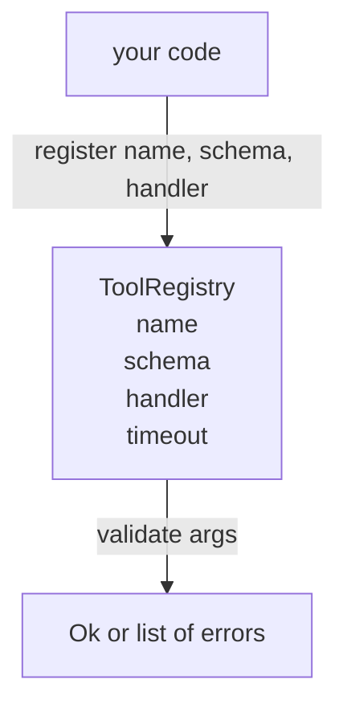

# 带 Schema Validation 的 Tool Registry

> Agent 无法 validate 的 tool，就是 agent 无法 call 的 tool。先构建 registry 和 schema checker，再构建 tools。

**类型:** Build
**语言:** Python
**先修:** Phase 13 lessons 01-07, Phase 14 lesson 01
**时间:** ~90 minutes

## 学习目标
- 持有一个 typed registry，映射 tool name → schema → handler，让 dispatcher 查询一次之后就能信任。
- 实现 JSON Schema 2020-12 的一个 subset，覆盖实际 tool calls 中九成会用到的 keywords。
- 返回精确、json-pointer-shaped error paths，让模型能在一次 round trip 中自我修正。
- 没有显式 override 时拒绝 re-registration，因为 silent overwrites 正是 production tool catalogs 漂移的原因。
- 保持 validator 纯净（无 I/O、无时间、无 globals），这样它可以在 replay log 上重新运行。

## 为什么 registry 要先于 tool

2026 年的 coding agent 注册的 tools 数量会超过模型在单个 context window 中能放下的数量。一个非平凡 harness 会注册两百个 tools，并在任意给定 turn 暴露十到四十个。Registry 是 “有哪些 tools”、“它们的 arguments 是什么 shape”、“我该 call 哪个 handler” 的 source of truth。一旦这三个答案固定，harness 的其余部分就不必猜。

我们要避免的错误是发布没有 schemas 的 handlers，或发布没有 validation 的 schemas。这两者都很常见。两者都会把下一层（第二十三课的 dispatcher）变成猜谜游戏，而唯一 failure mode 是 handler 抛出的 stack trace。

## Tool record 的样子

```text
ToolRecord
  name        : str          (unique, lowercase alphanumeric and underscore segments separated by dots, e.g., snake_case.segment.case)
  description : str          (one line, shown to the model)
  schema      : dict         (JSON Schema 2020-12 subset)
  handler     : Callable     (async or sync, returns Any)
  idempotent  : bool         (dispatcher uses this for retry decisions)
  timeout_ms  : int          (override per-tool dispatcher default)
```

Schema 是 validator 会触碰的唯一字段。Handler 对它是不透明的。我们故意把二者分开。Schema 是 data。Handler 是 code。混合它们会诱使你把 validation logic 放进 handler，而这正是我们要阻止的 bug。

## JSON Schema 2020-12 subset

完整的 2020-12 spec 像一篇论文。我们需要八个 keywords。

```text
type           string / number / integer / boolean / object / array / null
properties     map of property name -> schema
required       list of property names
enum           list of allowed primitive values
minLength      integer, applies to strings
maxLength      integer, applies to strings
pattern        ECMA-262-compatible regex, applies to strings
items          schema applied to every array element
```

这足以覆盖 tool API 实际需要的内容。我们不添加的 keywords（oneOf、anyOf、allOf、$ref、conditionals）在 production schemas 中是有效的，但会把 validator 变成带 cycles 的 tree walker。我们在构建 registry，而不是 JSON Schema engine。

## Json pointer error paths

Validation 失败时，validator 返回 errors 列表。每个 error 都带有一个指向 input 的 json-pointer path。Pointer 是一个以 slash 为前缀的 property names 和 array indices 序列。

```text
{"a": {"b": [1, 2, "x"]}}
                    ^
                    /a/b/2
```

模型读取 error paths 比读取句子更好。如果 schema 要求 `args.user.email`，而模型传了 integer，那么 error 应该是 `/user/email`，并带 `expected_type: string`。模型会在下一次 call 中修复，而不需要一轮自然语言解释。

## Registration 和 override

`register(name, schema, handler, **opts)` 默认拒绝 re-registration。Caller 必须传 `override=True` 才能替换。这是 operational hygiene。代码库的两个部分悄悄注册同一个 tool name，是那种会在 production 中花一周才找到的 bug。

Registry 暴露三个 read methods。`get(name)` 返回 record 或 raise。`validate(name, args)` 返回 `Ok` 或 errors 列表。`names()` 按 registration order 返回 tool names。

## Validator 是什么，不是什么

它是对 schema tree 的 single pass、recursive。它是 pure。它不 call handlers。它不 coerce types（字符串 `"42"` 不能通过 number schema）。它不会 silent truncate。

它不是 security boundary。Validation 通过之后，malicious handler 仍然可能 misbehave。第二十三课的 dispatcher 会添加 timeout 和 sandbox layers。Registry 添加的是 shape。

## Shape



## 如何阅读代码

`code/main.py` 定义 `ToolRegistry`、`ToolRecord`、`ValidationError` 和八个 validator functions。Validator 根据 `schema["type"]` dispatch（或把带 `enum` 的 schema 当作 untyped enum check）。每个 type validator 返回空列表或 `ValidationError` 列表。Top-level walker 会 concat errors，并在下降时 prepend path segments。

`code/tests/test_registry.py` 覆盖 registration、override、validation success、带 paths 的 validation failure，以及 subset 中每个 keyword。

## 继续深入

这课落地后，你会想要两个 extensions：针对 local definitions block 的 `$ref` resolution，以及用于 strict shape 的 `additionalProperties: false`。二者都很小。随着 tool catalog 超过五十个 tools，二者都很常见。我们把它们留在课外，是为了让文件在一次读取内保持可读。

下一课（二十二）构建 JSON-RPC stdio transport，把这个 registry 暴露给 model client。再下一课（二十三）把二者包在带 timeouts 和 retries 的 dispatcher 后面。
