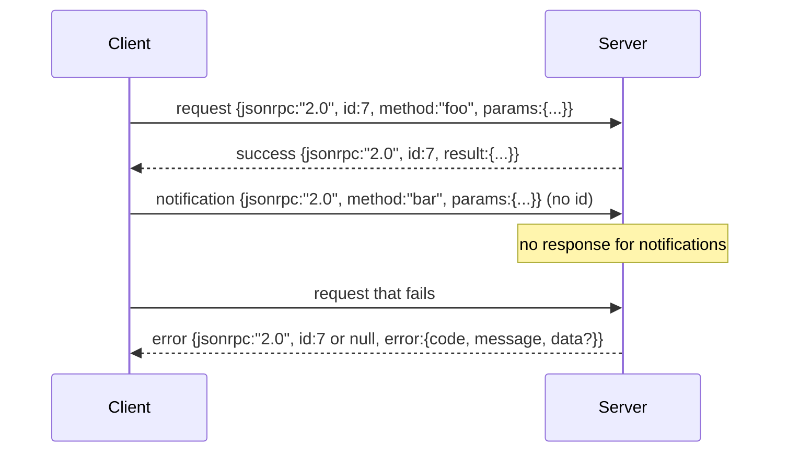

# Newline-Delimited Stdio 上的 JSON-RPC 2.0

> Model client 与 tool server 之间的 transport 是 stdio 上的 JSON-RPC。手写一次会让你理解每个 framing layer 到底在付出什么代价。

**类型:** Build
**语言:** Python
**先修:** Phase 13 lessons 01-07, Phase 14 lesson 01
**时间:** ~90 minutes

## 学习目标
- 使用 newline-delimited JSON over stdin and stdout 来讲 JSON-RPC 2.0。
- 映射五个标准 error codes（-32700、-32600、-32601、-32602、-32603），并用正确语义暴露它们。
- 区分 requests、responses、notifications 和 batches，而不发明新的 envelope keys。
- 每行处理一个 parse error，不污染 stream 的其余部分。
- 使用 io.BytesIO 构建 self-terminating demo，让课程无需 spawn child process 即可运行。

## 为什么 JSON-RPC 仍是 lingua franca

2026 年的 coding agent 在单个 session 中可能会与十二个 tool servers 通信。每个 server 都是一个独立 process 或 remote endpoint。Wire format 自 2013 年以来一直一样。JSON-RPC 2.0 是两页 spec。它能存活，是因为替代方案（gRPC、每次 call 一个 HTTP、custom binary）都会强加 JSON-RPC 不强加的 tradeoff：它们会在 streaming、batching 或 transport-coupling 中做取舍。JSON-RPC 在 stdio、sockets、websockets 和 HTTP 上都是 symmetric 的；只要双方遵守 spec，client 就能驱动一个从未见过的 server。

本课构建 stdio 变体。Newline-delimited JSON。每个 request 一行。每个 response 一行。Transport boundary 是 `\n`。

## Wire shape

存在四种 envelope shapes。两种由 client 说。两种由 server 说。



Notification 没有 `id`。Server 不能回应 notification。如果 server 给 notification 返回 response，client 就无法把它附着到 call site。这个单一规则让 framing math 保持简单。

Batch 是 requests 或 notifications 的 JSON array。Server 用 responses array 回复，顺序任意，对每个 non-notification entry 回复一个 response。如果 batch 中每个 entry 都是 notification，server 不发送任何内容。

## 五个 error codes

```text
-32700  Parse error      JSON could not be parsed
-32600  Invalid Request  Envelope shape is wrong
-32601  Method not found
-32602  Invalid params
-32603  Internal error
```

-32000 到 -32099 之间的 codes 保留给 server-defined errors。其他都是 application-defined。本课只使用这五个。如果 handler raise，transport 会把它包成 -32603，并在 `data.exception` 中放 exception class name。

Parse error 有一个特殊规则。Response 中的 `id` 是 `null`，因为 request 还没 parse 到足以抽取 id。

## Newline framing 与 BytesIO demo

Transport 一次读取一行。一行是直到并包括 `\n` 的 bytes。如果某行不能 parse，transport 会写入带 `id: null` 的 -32700 response 并继续。Stream 不会被污染。下一行会重新 parse。

本课把一对 `io.BytesIO` 包装成 stdin 和 stdout。Server 读取 requests 直到 EOF，为每个 request 写 responses，然后返回。Client 再读取 responses。没有 process spawn。没有 timeouts。Transport behavior 与真实 subprocess pipe 相同，因为 Python 的 `io` interface 提供同样的 `.readline()` 和 `.write()` contract。

## Method dispatch

Transport 不知道有哪些 methods。它把工作交给 harness 提供的 callable `handler(method, params)`。Handler 返回 result 或 raise。三个 exception classes 暴露特定 codes。

```text
MethodNotFound -> -32601
InvalidParams  -> -32602
Anything else  -> -32603 with exception name in data
```

Transport 从不看到 tool registry。Registry 位于 handler 后面。这是我们想要的 layering。Transport 讲 JSON-RPC。Registry 讲 tool shapes。Dispatcher（第二十三课）把它们缝起来。

## Errors 下的 stream behavior

```text
client writes              server reads             server writes
---------------            -----------              -------------
{...valid request...}      parses ok                {...response, id matches...}
{...broken json...         parse fails              {id:null, error: -32700}
{...valid request...}      parses ok                {...response, id matches...}
{...missing method...}     invalid envelope         {id:X, error: -32600}
```

Broken JSON line 不会停止 loop。缺少 `method` field 不会停止 loop。Handler exception 不会停止 loop。Transport 会持续读取直到 EOF。

## Notifications 与 asymmetric flows

Notification 是 fire-and-forget。Harness 使用 notifications 发送 progress events、cancellation signals 和 log lines。Notifications 让 long-running tool 可以 stream status updates，而不必每条状态都 round-trip。

本课实现一个 outbound notification helper：`write_notification`。Server 用它在 request in flight 时 emit progress。Demo 展示模式：request 进入，handler emit 两个 progress notifications，然后写 final response。

## 如何阅读代码

`code/main.py` 定义 `StdioTransport`、parse helper（`parse_request`）、三个 write helpers（`write_response`、`write_error`、`write_notification`）以及 dispatch loop `serve`。Error code constants 位于 module scope。

`code/tests/test_transport.py` 覆盖五个 error codes、notifications（不写 response）、batches（array in、array out、跳过 notifications）、broken JSON（parse error 后继续），以及 handler 在 mid-call 写 notification 的 asymmetric flow。

## 继续深入

这个 transport 足够后续课程使用。Production transports 会增加三件事。一个能穿过 forwarding 的 correlation id field（你的 `id` 已经是这个，但在 mesh 中还需要 outer trace id）。一个 cancellation channel（例如带 in-flight call id 的 `$/cancelRequest` notification）。以及 content-type negotiation handshake，让同一个 socket 能讲 JSON-RPC 和 Streamable HTTP。这些都不改变 wire。它们增加 metadata。
