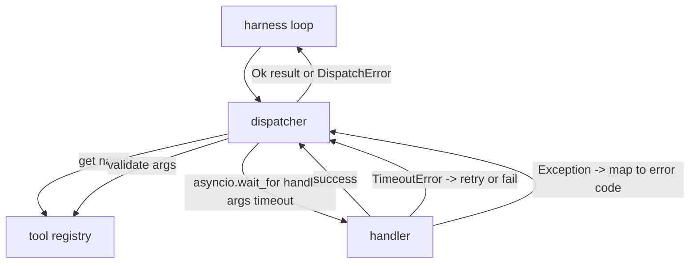
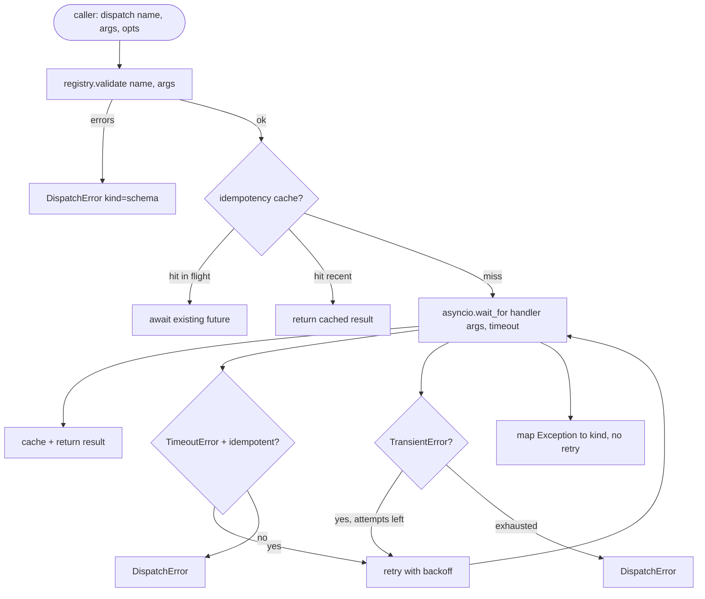

# 函数调用分发器

> Dispatcher 是 harness 为 schema 所承诺的一切付账的地方。Timeouts、retries、dedupe、error mapping。全部集中在一处。

**类型:** Build
**语言:** Python
**先修:** Phase 13 lessons 01-07, Phase 14 lesson 01
**时间:** ~90 minutes

## 学习目标
- 用 per-call timeout 包裹 tool handler，返回 typed error，而不是让 loop 挂住。
- 应用带 jitter 和最大 attempt count 的 exponential backoff retry。
- 在 idempotency key 上 deduplicate retries，避免与慢速 original 竞争的 retry 运行两次。
- 把 handler exceptions 和 transport faults 映射到 harness loop 已经理解的单一 error envelope。
- 用 concurrency limit 约束 parallel dispatch，避免四十个 tool calls 的 fan-out 耗尽 event loop。

## Dispatcher 位于哪里

位于 harness loop（第二十课）和 tool registry（第二十一课）之间。Transport（第二十二课）喂给 loop。Loop 把 tool call 交给 dispatcher。Dispatcher 调用 registry、运行 handler，然后返回 result 或 JSON-RPC-shaped error envelope。



Dispatcher 是唯一知道 timers、retries 和 idempotency 的层。Loop 不知道。Registry 不知道。Handler 不知道。这种隔离就是重点。

## Timeouts

每个 tool 有默认 timeout。Registry record 携带 `timeout_ms`。当 harness 传入 per-call override 时，dispatcher 会覆盖它。我们使用 `asyncio.wait_for`。Timeout 时，handler task 被 cancelled，dispatcher 返回 `DispatchError(kind="timeout")`。

对 non-idempotent tools，timeout 默认不是 retryable error。一个 timed out 的 `db.write` 可能已经 commit，也可能没有。Retry 会 duplicate write。Dispatcher 遵守 registry record 中的 `idempotent` flag。Idempotent tools 会 retry。Non-idempotent tools 不会。

## 带 exponential backoff 的 retries

Retry policy 最多三次 attempts。Backoff 是带 jitter 的 exponential。

```text
attempt 1  -> delay 0
attempt 2  -> delay 0.1s * (1 + random[0..0.5])
attempt 3  -> delay 0.4s * (1 + random[0..0.5])
```

只有 `timeout` 和 `transient` errors 会 retry。`schema` error、`not_found` 或 `internal` error 不 retry。Schema errors 是确定性的。Retry 不会改变 outcome，只会烧 budget。

Retry loop 尊重 harness 的 budget。如果 caller 的 budget 中 remaining tool calls 为零，dispatcher 在第一次 attempt 上 fast fail，并返回 `kind="budget_exceeded"`。

## Idempotency key dedupe

当 original 仍在 in flight 时触发 retry，是一个真实 production bug。第一次 call 在四点九秒时挂住（刚好低于 timeout）。五秒时 retry 触发。现在两个 requests 对同一个 backend 竞争。如果 tool 是 `payments.charge`，你就 charged twice。

Dispatcher 接受可选的 `idempotency_key`。如果同一个 key 在 call 到达时 in flight，dispatcher 会等待 in-flight future 并返回其 result。Cache 在 completion 后保留 keys 六十秒，以吸收 late retries。

Key 是 caller 的责任。Harness 从 planner 派生它：`f"{step_id}:{tool_name}:{hash(args)}"`。Dispatcher 不发明 keys，因为仅从 arguments 派生 key 会让两个语义不同但 args 相同的 calls 看起来一样。

## Error envelope

失败的 dispatch 返回单一 shape。

```text
DispatchError
  kind        : "timeout" | "transient" | "schema" | "not_found" | "internal" | "budget_exceeded"
  message     : str
  attempts    : int
  jsonrpc_code: int   (one of -32601, -32602, -32603)
```

Harness loop 会把 `kind` 映射到 next state。`schema` 和 `not_found` 进入 `on_error` 并触发 replan。`timeout` 和 `transient` 进入 `on_error`，可能 replan，也可能不 replan，取决于 attempts。`budget_exceeded` 触发 `on_budget_exceeded`。

## Fan-out 上的 concurrency limit

`gather(*calls)` 会同时运行所有 coroutines。四十个 tool calls 意味着四十个 open sockets 或四十个 subprocess pipes。大多数 backends 不喜欢来自同一个 client 的四十个 parallel connections。

Dispatcher 用 semaphore 包裹 `gather`。默认 concurrency limit 是八。每个 call 在 dispatch 前 acquire semaphore，在 completion 后 release。Caller 看到的仍是 `gather`-shaped output，但实际 scheduling 是 bounded 的。

## 单次 call 的 flow



## 如何阅读代码

`code/main.py` 定义 `Dispatcher`、`DispatchError` 和 `TransientError`。Dispatcher 在构造时接收 registry。Async `dispatch(name, args, ...)` 是唯一入口。Per-attempt timeouts 在 `_run_with_retries` 内部用 `asyncio.wait_for` inline 应用。`gather_bounded(calls)` 用 concurrency limit 运行多个 dispatches。

`code/tests/test_dispatcher.py` 覆盖 timeout firing、transient 上的 retry、schema error 不 retry、idempotency dedupe（两个同 key concurrent calls collapse 成一次 handler invocation），以及 concurrency limiting（semaphore 生效）。

Tests 使用 `asyncio.sleep(0)` 和 deterministic `Counter`-based handlers，因此会在毫秒内完成，不依赖 wall-clock timing。

## 继续深入

Production dispatchers 会添加两个 extensions。第一，在每个 transition 上做 structured logging（loop 的 event stream 已经给了你这个，但 dispatcher 也应该 emit `dispatch.attempt` 和 `dispatch.retry` events）。第二，circuit breakers：在一个 window 内 N 次失败后，tool 进入 cool-down period，dispatches 会立即返回 `kind="circuit_open"`，而不是尝试 handler。二者都可以叠加在这个 dispatcher 之上，而不改变 contract。

第二十四课会把 dispatcher 粘到 plan-and-execute agent 上，让你看到四个 pieces 一起运动。
