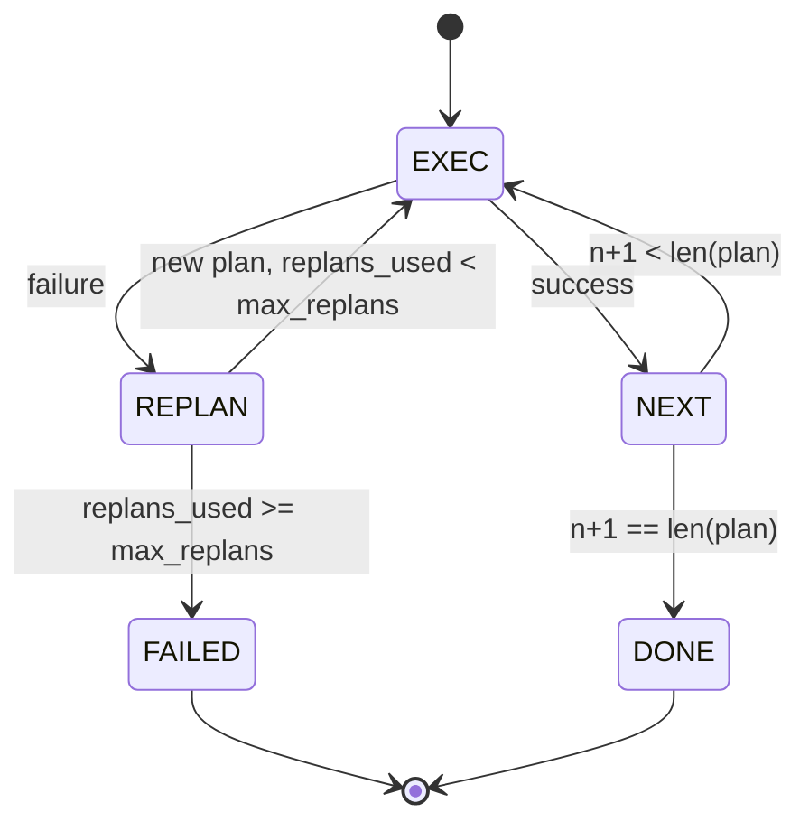

# Plan-Execute Control Flow

> 无法在 failure 后存活的 plan 只是 script。能够 replan 的 script 才是 agent。先构建 replanner。

**类型:** Build
**语言:** Python
**先修:** Phase 13 lessons 01-07, Phase 14 lesson 01
**时间:** ~90 minutes

## 学习目标
- 把 plan 表示为有序的 typed steps 列表，让 executor 能推理 progress 和 outcome。
- 以受控 failure handoff 的方式顺序执行 steps，并把控制交回 planner。
- 从 current cursor 重新 plan，并把 prior error 放进 context，让下一个 plan 有信息。
- 每次 revision 都 emit plan diff，让 downstream tracer 或 UI 可以展示 plan 为什么改变。
- 强制两个 budgets：hard step ceiling 和 hard replan ceiling。

## Plan and execute，而不是 chain-of-thought

Chain-of-thought agent emit tokens，并让 loop 猜 tool call 在哪里结束。Plan-and-execute agent 先 emit 一个 structured plan，然后 deterministically 执行每个 step。Plan 是 harness 可以 introspect 的 data。Execution 是 harness 把这些 data 通过 dispatcher 运行。

两个部分。一个产生 plan 的 planner。一个运行 plan 的 executor。有意思的是 executor 遇到 failure 时发生什么。三个选项：

```text
1. Abort         (return failed, surface the error)
2. Skip          (mark step failed, continue with the rest)
3. Replan        (hand the error to the planner, get a new plan from the cursor)
```

Replan 是把 script 变成 agent 的那一步。

## Step shape

```text
Step
  id              : int           (monotonic within a plan revision)
  tool_name       : str
  args            : dict
  expected_outcome: str           (planner's stated success condition)
  result          : Any | None
  error           : str | None
```

`expected_outcome` 是 planner 与 step 一起 emit 的短句。Executor 不强制检查它。它服务于两件事：replanner 在修订 plan 时读取它；event stream emit 它，让 tracer 能显示 “this step was supposed to do X.”

## Planner shape

```python
def planner(goal: str, history: list[Step], last_error: str | None) -> list[Step]:
    ...
```

一个 pure function。`goal` 是用户目标。`history` 是已经执行过的 steps（填入了 results 和 errors）。`last_error` 在第一次 call 时为 None，在之后每次 call 时是最近的 failure message。Planner 返回从 cursor 开始的 next plan。

Planner 不知道 executor。它不知道 retries。它不知道 timeouts。它产生 plan。仅此而已。

## Executor

Executor 是一个小 state machine。每个 step 都通过 dispatcher 运行。Outcome 是三者之一：success、failure-replannable、failure-fatal。Replannable failures 会交回 planner。Fatal failures（budget exceeded、replan ceiling hit）会返回一个 `FAILED` session result。



## Revision 上的 plan diffs

当 planner 在 failure 后返回新 plan 时，executor emit 一个 `plan.diff` event，带三个 fields。

```text
removed: list of step ids that were in the old plan and are not in the new
added  : list of step ids in the new plan that were not in the old
revised: list of step ids whose tool_name or args changed
```

Tracer 或 UI 可以把它 render 成 removed steps 上的 strikethrough 和 added steps 上的 highlight。重点不是 diff format。重点是 revision 是可见 event，而不是 silent rewrite。

## 两个 budgets，都是 hard

`max_steps` 限制整个 session 中的 total step executions，包括 replans。默认是十二。一个线性的 five-step plan 如果 replan 两次且每次添加三个 steps，就会达到十六次 execution 并超过 budget。Executor 会拒绝 replan 并返回 FAILED。

`max_replans` 限制第一次 plan 之后 planner 被调用的次数。默认是五。这是更重要的限制。一个连续五次返回同一个 broken plan 的 planner，否则会一直循环，直到 step budget 抓住它。限制 replans 让 failure 更快，原因也更清晰。

## 本课中的 deterministic planner

本课不 call 模型。课程提供一个 deterministic planner，根据 `last_error` 选择 plan。

```text
last_error is None    -> emit a four-step plan
last_error matches X  -> emit a three-step plan that routes around X
last_error matches Y  -> emit a two-step plan that gives up gracefully
otherwise             -> return [] (signals nothing to replan)
```

这足以测试 executor 在每条 transition path 上的行为：success、replan-once、replan-twice、replan-exhaustion 和 step-budget exhaustion。

## Result shape

```text
SessionResult
  status      : "completed" | "failed"
  reason      : str     ("goal_met" | "step_budget" | "replan_budget" | "no_plan")
  history     : list[Step]
  revisions   : list[PlanDiff]
  events      : list[Event]
```

第二十课的 harness loop 可以直接读取它。第二十三课的 dispatcher 负责执行每个 step。第二十一课的 registry 负责 validate 每个 step 的 args。第二十二课的 transport 会通过 JSON-RPC 把整个 flow 暴露给 model client。

## 如何阅读代码

`code/main.py` 定义 `PlanExecuteAgent`、`Step`、`PlanDiff`、`SessionResult` 和 deterministic planner。Executor 是单个 `run(goal)` method，返回 `SessionResult`。Plan diff 通过比较 step ids 和 `(tool_name, args)` tuples 来计算。

`code/tests/test_agent.py` 覆盖 linear success、mid-plan failure 后 replan once、返回 `failed:replan_budget` 的 replan exhaustion、step-budget exhaustion，以及 plan-diff event format。

## 继续深入

当你把它接到真实模型上后，会想要两个 extensions。第一，partial-plan caching：当 plan 的前六步中前三步成功、第四步失败时，你不想重新运行前三步。Executor 已经保留 history；planner 只需要读取它。第二，parallel branches：当前 executor 是严格 sequential。一个 emit independent branch（`gather_step` 而不是 `next_step`）的 planner 可以通过 dispatcher 并发运行两个 tool calls。

二者都增加真实复杂度。在线性 executor 被固定之后，添加它们会更容易。这就是本课所做的事。
