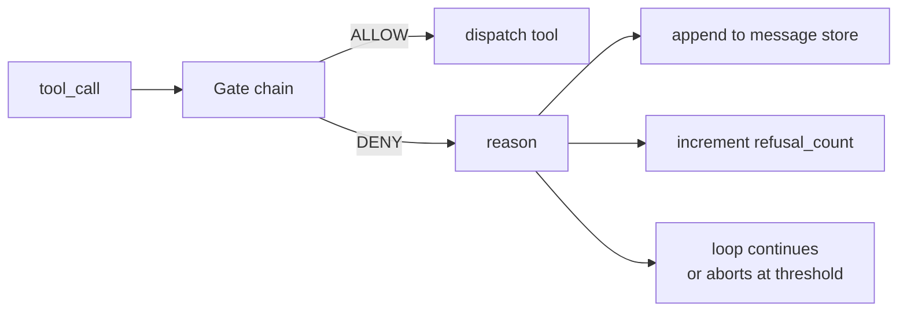
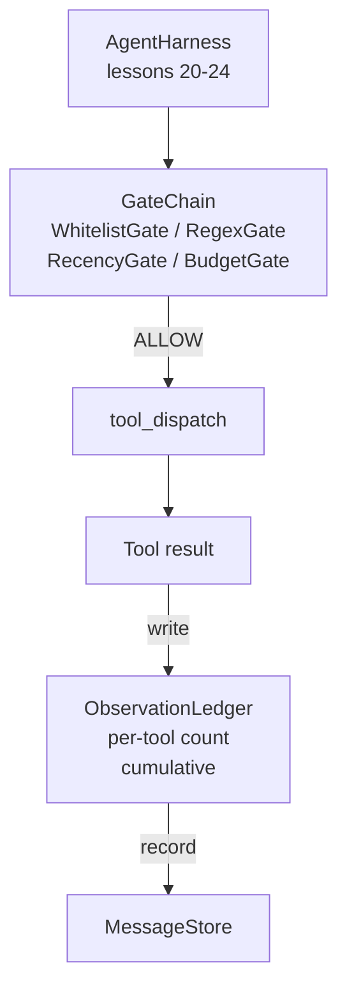

# Capstone Lesson 25：Verification Gates 与 Observation Budget

> 没有 verification layer 的 agent harness 只是披着外套的愿望。本课构建 deterministic gate chain，用来决定 tool call 是否允许发出、agent 能看到多少 output，以及何时因为 agent 已经读取太多而必须停止 loop。这个 chain 由小而有名的 gates 加上 observation ledger 组成，后者跟踪模型看到过的每一个 token。

**类型:** Build
**语言:** Python (stdlib)
**先修:** Phase 19 · 20-24 (Track A1: agent loop, tool registry, message store, prompt builder, model router), Phase 14 · 33 (instructions as constraints), Phase 14 · 36 (scope contracts), Phase 14 · 38 (verification gates)
**时间:** ~90 minutes

## 学习目标

- 构建一个带 deterministic `evaluate(call)` method 的 `VerificationGate` protocol。
- 把 budget、recency、whitelist 和 regex gates 组合成带 short-circuit semantics 的 chain。
- 通过按 tool 和 turn keyed 的 `ObservationLedger` 跟踪每个 observation。
- 当 cumulative observation budget 将被超过时，拒绝 tool call。
- 暴露 structured `GateDecision` record，供 downstream observability ingest。

## 要解决的问题

当 agent harness 允许模型自由 call tools，真实使用第一小时内就会出现三类 bug。

第一类是 unbounded observation。对一个 200K-line repo 做 grep 会向下一轮 dump 五十万 tokens output。模型每 KB 只看到一个 match，其余 context 被浪费。Token bill 很大，agent 现在反而更差，不是更好。

第二类是 stale recency。Long-running task 累积了五十个 tool calls。模型把第三轮的第一个 read_file 当成 live state 重新读取。第四十七轮做的 edits 没有出现，因为 prompt builder 先 serialized 最早的 observations。

第三类是 privilege creep。Research task 一开始 call `web_search`，然后不知为何跑了 `shell`，因为模型 invented 一个 tool name，而 harness 默认 permissive。等有人读 trace 时，/tmp 中已经有一个 junk file，而且 curl 打到了 private API。

Verification gate 是 harness 中负责说不的组件。它不是模型。它不是 judge。它是 `(call, history, ledger)` 的 deterministic function，返回 ALLOW 或 DENY，并带 reason。Reason 会被 log。模型会被告知。Loop 继续或 abort。

## 核心概念



Gate 是任何拥有 `evaluate(call, ctx) -> GateDecision` method 的东西。Chain 是一个 ordered list。Evaluation 在第一个 deny 处 short-circuit。顺序很重要：cheap structural gates 在 expensive token-counting gates 前运行。

本课提供四个 gates：

- `WhitelistGate`。Allowed tool names 是显式集合。集合之外全部 denied。这是最便宜的 gate，最先运行。
- `RegexGate`。Tool arguments 与 regex 匹配。适合拒绝带 `rm -rf` 的 shell calls，或指向 internal IPs 的 HTTP calls。对 call payload 是 pure 的。
- `RecencyGate`。模型只能看到最近 N turns 的 observations。更旧的 observations 被 masked。Gate 会拒绝其 result 会扩展一个已经 aged out 的 observation window 的 tool call。
- `BudgetGate`。模型在整个 session 中读取的 cumulative tokens 有 ceiling。当 ledger 表示 ceiling 已达到，所有后续 tool calls 都 denied。

Observation ledger 是 bookkeeping。每个成功的 tool call 写一行：tool name、turn、tokens emitted、cumulative。Ledger 回答两个问题：模型总共看到了多少，以及模型看到了 tool X 的多少。Budget gate 读取第一个。作为练习你会写的 per-tool budget gate 读取第二个。

## 架构



Harness 询问 chain。Chain 要么点头，要么拒绝。如果点头，tool 运行，ledger 前进，result 被 append 到 message store。如果拒绝，model 会收到一条 system message 中的 refusal，loop 决定 retry 还是 abort。

## 你将构建什么

Implementation 是单个 `main.py` 加 tests。

1. `Observation` 和 `ToolCall` dataclasses 定义 wire shapes。
2. `ObservationLedger` 记录 `(turn, tool, tokens)` rows，并回答 `cumulative()` 和 `per_tool(name)`。
3. `GateDecision` 携带 `(allow, reason, gate_name)`。
4. `VerificationGate` 是 protocol。每个 gate 实现 `evaluate(call, ctx)`。
5. `GateChain` 包装 ordered list。它调用每个 gate，返回第一个 deny；如果所有 gate 通过，则返回 allow。
6. Demo 运行一个小 synthetic agent loop。三轮。第三轮触发 budget gate，loop 报告带非零 refusal count 的干净拒绝。

Token counter 故意是一个愚蠢的 `len(text) // 4` heuristic。本课重点是 gate plumbing，不是 tokenizer。Production 中换成真正 tokenizer。

## 为什么 chain order 重要

Deny 比 allow 更便宜。`WhitelistGate` 是 O(1) hash lookup。`RegexGate` 是 O(pattern * argv)。`RecencyGate` 读取 message store 的小 slice。`BudgetGate` 读取整个 ledger。你按 ascending cost 排序，这样被 denied 的 call 在做昂贵工作前 short-circuit。

你还按 blast radius 排序。Whitelist 是最强 claim：这个 tool 不在 contract 中。Regex gate 下一位：这个 argument 不在 contract 中。Recency 在后面：harness 仍然关心，但 call 在结构上合法。Budget 最后，因为按定义，它只会在其他都通过时触发。

## 它如何与 Track A 其余部分组合

前几课给了你 loop、tool registry、message store、prompt builder 和 model router。本课添加 model 与 tools 之间的 layer。第 26 课提供 sandbox：一旦 gate chain 说 ALLOW，dispatcher 就把 tool call 交给它。第 27 课提供 eval harness，把 refusal counts 记录为 quality signal。第 28 课把 gate decisions 接入 OpenTelemetry spans。第 29 课把这些拼成可工作的 coding agent。

## 运行它

```bash
cd phases/19-capstone-projects/25-verification-gates-observation-budget
python3 code/main.py
python3 -m pytest code/tests/ -v
```

Demo 打印一个逐 turn trace，包含每个 gate decision，并以零退出。Tests 覆盖 ledger、每个 gate 的 isolation、chain short-circuit，以及 synthetic loop 的 end-to-end。
