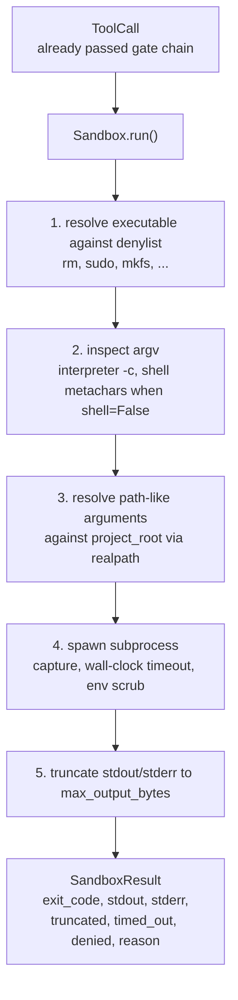
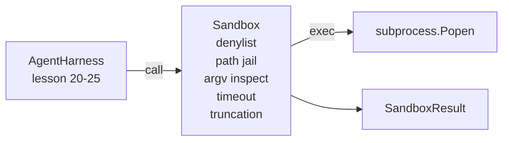

# Capstone Lesson 26：带 Denylist 和 Path Jail 的 Sandbox Runner

> Verification gate 决定 tool call 是否应该运行。Sandbox 决定它运行时会发生什么。本课提供一个 subprocess runner：拒绝危险 executables，拒绝危险 argv shapes，把每个 file path 囚禁到 project root，截断 oversized output，并在 wall-clock timeout 时杀掉 runaway processes。它是位于模型与操作系统之间的两个 layers 中的第二个。

**类型:** Build
**语言:** Python (stdlib)
**先修:** Phase 19 · 25 (verification gates and observation budget), Phase 14 · 33 (instructions as constraints), Phase 14 · 38 (verification gates)
**时间:** ~90 minutes

## 学习目标

- 构建一个 `Sandbox` class，用 timeout、capture 和 truncation 包裹 `subprocess.run`。
- 按 name 对 denylist、按 structure 对 argv inspector 拒绝 command。
- 拒绝任何解析到 declared project root 外部的 path argument。
- 当 shell mode 关闭时拒绝 shell metacharacters。
- 返回 structured `SandboxResult`，供 downstream observability 和 eval harness ingest。

## 要解决的问题

一个能 shell out 的 coding agent 可以在 single turn 中安装 backdoors、exfiltrate keys、brick 开发者 laptop，并刷出 cloud bill。成本最低的防御是不赋予 shell。第二低成本的防御是一个会对精确模式列表说不的 sandbox。

Agent traces 中反复出现三类 failure。

第一类是 dangerous executables。一个被催促去修 path issue 的模型会尝试 `sudo`、`chmod -R 777`、`rm -rf`、`mkfs`、`dd`。这些都不属于 agent run。Denylist 会按 name 和 alias 捕获它们。

第二类是 argv tricks。一个被告知不能用 shell 的模型，会通过 interpreter 管道化攻击：`python3 -c "import os; os.system('rm -rf /')"`、`bash -c '...'`、`node -e '...'`、`perl -e '...'`。Sandbox 需要知道，任何带 `-c`-like flag 的 interpreter run，都只是多绕一步的 shell call。

第三类是 path escape。模型被要求读取 `./src/main.py`，却读取 `../../etc/passwd`。Sandbox 通过 `os.path.realpath` resolve 每个 path argument，并 assert prefix，从而把它们囚禁起来。

Sandbox 不是 operating system 意义上的 security boundary。一个具备 code execution 的坚定 attacker 仍可能 break out。Sandbox 是 development-time guardrail：它让常见 failure modes 变得响亮，并阻止 agent 因纯粹笨拙造成伤害。

## 核心概念



Sandbox 有四条 refusal axes：name、argv、path、structure。每条 axis 都是 call 的 pure function，此时还没有 subprocess。只有每条 axis 通过后，subprocess 才会 spawn。

`SandboxResult` exit codes 使用惯例：0 success，non-zero failure，外加三个 sentinel codes：denied（-100）、timed_out（-101）、truncated（exit code 是真实值，另设 flag）。后续课程读取这个 structured result，而不是 parse stderr。

## 架构



Denylist 是 executable basenames 的 frozenset。Aliases（`/bin/rm`、`/usr/bin/rm`）都会解析到同一个 basename。Argv inspector 知道 interpreter shape：任何 argv[0] 是 interpreter 且后续任一 arg 以 `-c` 或 `-e` 开头的 argv 都会被 denied。当 call 没有显式请求 shell 时，shell metacharacters（`;`、`|`、`&`、`>`、`<`、backticks、`$()`）会导致 refusal。

Path jail 是最微妙的部分。Sandbox 在构造时接受 `project_root`。任何看起来像 path 的 argument（包含 `/` 或匹配 existing file）都会通过 `os.path.realpath` normalized，然后与 project root 的 realpath 对比。如果 resolved target 不在 root 下，则 refusal。Symlink escape attempts（project root 中一个指向外部的 symlink）会被 realpath 检查阻止，而不是按 literal path 检查。

## 你将构建什么

Implementation 是 `main.py` 加 tests dir。

1. `SandboxResult` dataclass：exit_code、stdout、stderr、truncated、timed_out、denied、reason、duration_ms。
2. `SandboxConfig` dataclass：project_root、max_output_bytes、timeout_seconds、denylist、interpreter_block。
3. `Sandbox` class：`run(argv, *, shell=False, cwd=None)` 返回 `SandboxResult`。
4. Internal refusal helpers：`_check_executable_denylist`、`_check_argv_interpreter`、`_check_shell_metachars`、`_check_path_jail`。
5. Output truncation 带清晰的 `truncated` flag，并在 captured stream 中加入 marker line。
6. 底部 demo：一系列 legitimate 和 adversarial calls。每个都展示其 result。

Sandbox 默认使用 `subprocess.run`，`shell=False`，`capture_output=True`。Wall-clock timeout 使用 `timeout` argument；遇到 `TimeoutExpired` 时，sandbox 杀掉 process group 并合成 SandboxResult。

## 为什么这不是真正的 sandbox

本课 sandbox 不使用 namespaces、cgroups、seccomp、gVisor、Firecracker 或任何 kernel-level isolation。Subprocess 能做的事情，sandbox 也能做。保护是结构性的：agent 被拒绝最常见的危险 invocations，响亮 refusal 进入 observability，而不是悄悄运行。

Production agents 会在其上叠加：在 unprivileged Docker container 中运行，在 microVM 中运行，drop capabilities，把 project root 以 read-only 挂载并提供 read-write scratch dir，设置 memory 和 CPU 的 ulimit，把 environment scrub 成 known-safe whitelist。第 29 课做了一部分。Operating-system isolation 超出本课范围。

## 运行它

```bash
cd phases/19-capstone-projects/26-sandbox-runner-denylist
python3 code/main.py
python3 -m pytest code/tests/ -v
```

Demo 创建 temp directory，放入一个 clean file，然后运行一组 calls。Legal calls 成功。Denied calls 返回 `denied=True` 且带 reason 的 SandboxResult。Timeouts 返回 `timed_out=True`。Truncation 设置 `truncated=True`。Demo 打印 outcomes 的 JSON table，并以零退出。

## 它如何与 Track A 其余部分组合

第 25 课产生 gate chain。第 26 课是 gate ALLOW 后运行的 executor。第 27 课的 eval harness 把 sandbox results 与每个 task 的 expected exit-code 对比。第 28 课围绕每个 `Sandbox.run` invocation emit `gen_ai.tool.execution` span。第 29 课的 end-to-end demo 让一个真实 coding agent 穿过两层。
