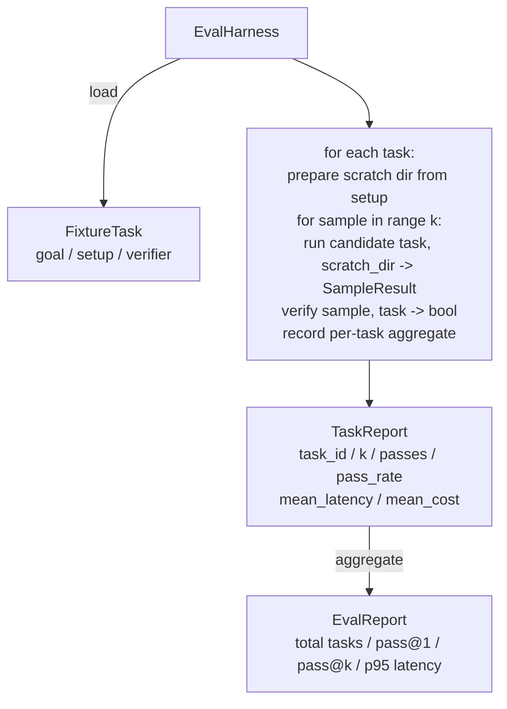

# Capstone Lesson 27：带 Fixture Tasks 的 Eval Harness

> Coding agent 的好坏取决于你用来测量它的 task suite。本课构建一个 evaluation harness：它接收一组 fixture tasks folder，让 candidate agent 逐个运行，通过 deterministic verifier 评分 pass 或 fail，并聚合成 pass@1、pass@k、mean latency 和 mean cost。Harness 是 source of truth，让你能区分 regression 与 refactor。

**类型:** Build
**语言:** Python (stdlib)
**先修:** Phase 19 · 25 (verification gates), Phase 19 · 26 (sandbox runner), Phase 14 · 30 (eval-driven agent development), Phase 14 · 19 (SWE-bench and GAIA benchmarks)
**时间:** ~90 minutes

## 学习目标

- 把 fixture task 定义为 goal、setup 和 verifier 的三元组。
- 对每个 task 的多个 sample runs 打分，并计算 pass@1 与 pass@k。
- 把 latency 和 cost 聚合为 mean 与 95th-percentile metrics。
- 把 deterministic verifiers（file diff、exit code、regex match）接成 reusable functions。
- Emit structured JSON report，供 regression-tracking script ingest。

## 要解决的问题

没有 eval harness 的 agent benchmarks 会遭遇三种 failure modes。

第一种是 unverified pass。Agent 说它修好了 bug，人类瞥一眼 diff，suite 被标绿，三周后 regression test 露出同一个 bug。Agent 只是 plausibly reasoned，实际上没有修复任何东西。

第二种是 undetected regression。Prompt template 的一个改动让 agent 在 loud task 上好 4%，在 quiet one 上差 14%。没有 goldset 和 per-task score，regression 会进入 main，直到客户抱怨才出现。

第三种是 per-task drift。Eval 周一用 100 tasks 跑，周五用 95 个跑，因为有人 rename 了五个 fixtures。Pass rate 看起来提升了 5%。其实没有。

Harness 是把这些 failures 变成事实的程序。它每次都按 reproducible order 运行每个 fixture，并用 deterministic check 返回 true 或 false 的 verifier 评分。

## 核心概念

```mermaid
flowchart LR
  F1[fixtures/task_001/<br/>task.json + expected/] --> Harness
  F2[fixtures/task_002/<br/>...] --> Harness
  Harness[Harness<br/>for each task:<br/>setup / run agent k samples /<br/>verify each sample /<br/>record latency, cost]
  Harness --> Report[EvalReport<br/>pass@1 / pass@k<br/>mean ms / p95 ms<br/>mean cost]
```

`FixtureTask` 是一个小 JSON file 加一个可选 `expected/` directory。JSON 声明 `id`、`goal`（喂给 agent 的 prompt）、`setup` block（放入 scratch dir 的 files）以及 `verifier` block。Verifier block 命名 harness verifier registry 中的 function，并提供其 arguments。

三种 verifier shapes 覆盖大多数有用 tasks。

第一种是 `file_equals`。Agent 运行后，把指定 file 与 expected content 比较。它捕捉 “用这个精确方式修复这个 bug” 的 tasks。

第二种是 `regex_match`。把指定 file 内容与 regex 匹配。它捕捉 “function 必须存在并返回 X” 的 tasks，其中 acceptable solutions 有很多种。

第三种是 `shell_exit_zero`。Harness 运行一个 shell command（通过第 26 课的 sandbox），只有 command exit zero 时 task 才 pass。它捕捉 “tests must pass” tasks。

Harness 对每个 task 运行 `k` 次。Pass@k 是 `1 - (1 - p)^k`，其中 p 是 empirical pass rate；harness 也报告 raw counts，让你能发现 variance。Latency 是每个 sample 的 wall-clock。Cost 是 agent self-reports 的任何东西（token count、USD 或二者）；harness 跨 samples sum，并呈现 per-task 和 aggregate numbers。

## 架构



Candidate 是 callable：`Callable[[FixtureTask, str], SampleResult]`。Harness 通过 `tempfile.mkdtemp()` 创建 scratch directory，并把其 path 作为 plain string 传入。Harness 不关心 candidate 如何工作。Candidate 可以是 deterministic patch applier（对 harness self-tests 很有用）、真实 LLM agent、fuzzer。Contract 是 SampleResult。

## 你将构建什么

`main.py` 提供：

1. `FixtureTask` dataclass。
2. `SampleResult` dataclass：success_self_reported、latency_ms、cost_units、edits。
3. `TaskReport`、`EvalReport` dataclasses，带 `to_dict()`。
4. `VerifierRegistry`，把 verifier name 映射到 function。内置 verifiers：file_equals、regex_match、shell_exit_zero。
5. `EvalHarness` class。对 candidate 运行一个 tasks directory。返回 EvalReport。
6. `tasks/` 中捆绑五个 fixture tasks：
   - `fizzbuzz` 中的 off-by-one
   - `factorial` 中缺少 return
   - error message 中的 typo
   - empty function body
   - linked-list traversal 中的 off-by-one
7. Deterministic reference candidate（`apply_known_fixes`），harness 用它展示干净的 pass@1 = 1.0。
8. Demo 打印 EvalReport JSON，并以零退出。

Fixture tasks 以 JSON files 形式捆绑在 `tasks/` 中，并配有 `tasks/<id>/buggy/` 和 `tasks/<id>/expected/` 中的 paired source files。Harness 把 buggy 复制进 scratch dir，交给 candidate，并用 expected 验证。

## 为什么是 pass@k，而不只是 pass@1

真实 LLM agents 是 stochastic。pass@1 为 0.6 看起来像失败。pass@5 为 0.95 则说明 agent 大多数时候能得到正确答案，但早期 samples 选错了。修复方向是 sampling 和 ranking，而不总是更多训练。Pass@k 让这一点可见。

Pass@k 与 pass@1 一起报告，因为 pass@k 会掩盖真实失败：如果模型二十次里只对一次，你没有一个有用 agent。Harness 会显示二者。

## 它如何与 Track A 其余部分组合

第 25 课产生 gate chain。第 26 课产生 sandbox。Harness 对任何 `shell_exit_zero` verifier 使用 sandbox。第 28 课把每个 harness run 包在 OTel trace 中。第 29 课对 bundled fixtures 中的一个运行 end-to-end demo，并断言 reference candidate 的 pass@1 = 1.0。

## 运行它

```bash
cd phases/19-capstone-projects/27-eval-harness-fixture-tasks
python3 code/main.py
python3 -m pytest code/tests/ -v
```

Demo 以 JSON 打印 EvalReport，包括 pass@1、pass@5、mean latency 和 per-task breakdown。Exit code 是零。Tests 覆盖 verifier functions、pass@k math、fixture loading，以及 harness 针对 bundled reference candidate 的 end-to-end。
