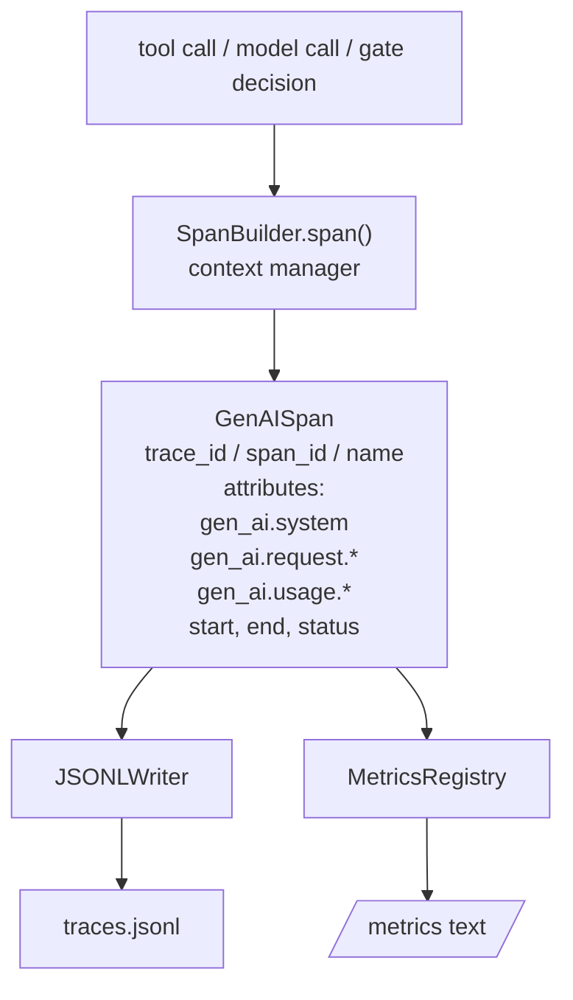
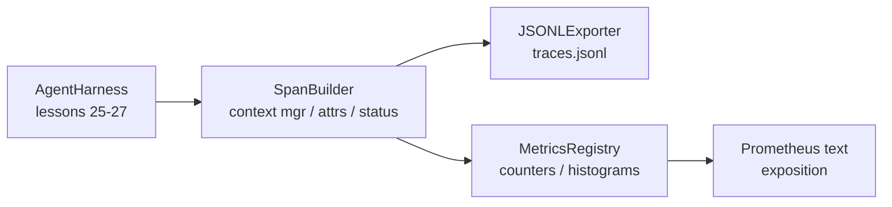

# Capstone Lesson 28：使用 OTel GenAI Spans 和 Prometheus Metrics 做 Observability

> 没有 observability 的 agent harness 是一个会花钱的黑盒。本课手写一个 span builder：它发出符合 OpenTelemetry GenAI semantic conventions 的 records，把它们写入 JSON-Lines 文件（每行一个 span），并以 Prometheus text format 暴露 counters 和 histograms。整套实现都是 stdlib Python，并且离线运行。

**类型:** Build
**语言:** Python (stdlib)
**先修:** Phase 19 · 25 (verification gates), Phase 19 · 26 (sandbox), Phase 19 · 27 (eval harness), Phase 13 · 20 (OpenTelemetry GenAI), Phase 14 · 23 (OTel GenAI conventions)
**时间:** ~90 minutes

## 学习目标

- 构建一个形状符合 OpenTelemetry GenAI semantic conventions 的 span data class。
- 实现一个 JSONL exporter，每行写入一个自包含 span。
- 构建带 labels 的 counters 和 histograms，并能以 Prometheus text-format exposition 输出。
- 用 span context manager 包裹任意 callable，记录 duration、status 和 exceptions。
- 验证 emitted spans 能通过 `json.loads` roundtrip，并匹配 spec shape。

## 要解决的问题

生产中的 coding agent 每个 turn 会产生三类 artifact：model call、tool execution 和 verification gate decision。没有 structured telemetry，这些都没什么用。

第一类 failure mode 是 missing trace。周二出了问题，但唯一记录是一份 500 行 chat log。没有记录哪个 tool 跑了、耗时多久、prompt 里进了多少 tokens，或 gate 是否拒绝了什么。Agent author 只能猜。

第二类 failure mode 是 unparseable trace。Harness 写了 spans，但用了自己的 ad-hoc field names。Grafana、Honeycomb、Jaeger 或 local CLI 都读不了。团队 stack 中已有的 tooling 全被浪费了，因为 spans 非标准。

第三类 failure mode 是 unaggregated metric。你能在 trace 中看到一次慢 tool call，但没法回答“过去一小时 `read_file` calls 的 p95 latency 是多少？”，因为只有 traces，没有 metrics。

OpenTelemetry GenAI semantic conventions 正是为此存在。它们定义了一小组标准 attributes，供各类 LLM framework 的 span emitters 共享。如果你的 harness 写这些 attributes，任何 OTel-compatible backend 都能读。

## 核心概念



Harness 中的每个 operation 都会产生一个 span。Span 有 trace id（整个 agent invocation）、span id（这一次 operation）、name（例如 `gen_ai.chat`、`gen_ai.tool.execution`）、遵循 GenAI conventions 的 attributes、start 和 end time，以及 status。

GenAI conventions 标准化了这些 attribute keys：`gen_ai.system`（哪个 provider，例如 `anthropic`、`openai`）、`gen_ai.request.model`（model id）、`gen_ai.request.max_tokens`、`gen_ai.usage.input_tokens`、`gen_ai.usage.output_tokens`、`gen_ai.response.model`、`gen_ai.response.id`、`gen_ai.operation.name`，以及 tool-specific keys `gen_ai.tool.name` 和 `gen_ai.tool.call.id`。

Exporter 写 JSONL。每行一个 JSON object。这是下游 tooling 能 stream、grep 和 import 的最简单格式。真实 OTel exporter 会讲 OTLP gRPC；本课的 JSONL exporter 是离线等价物，在每台 workstation 上都以零退出。

Metrics 与 traces 放在一起。每次 tool call 都 increment 一个 counter：`tools_called_total{tool="read_file"}`。Histogram 记录观测到的 latency：`tool_latency_ms{tool="read_file"}`。二者都会序列化为 Prometheus text exposition format，这是 pull-based metrics 的事实标准。

## 架构



Span builder 是一个小 class，拥有 `span(name, attrs)` method，返回 context manager。Context manager 在 enter 时记录 start time，在 exit 时记录 end time；如果 raised exception，则附加 exception，并把 finalized span 推给 exporter。

Metrics registry 是两个 dict。Counters 是 `{(name, frozen_labels): int}`。Histograms 把 raw samples 保存在 list 中，并在 exposition time 序列化为 Prometheus histogram buckets。

## 你将构建什么

`main.py` 提供：

1. `GenAISpan` dataclass：trace_id, span_id, parent_span_id, name, attributes, start_unix_nano, end_unix_nano, status, status_message, events。
2. `SpanBuilder` class，带 `span(name, attrs, parent=None)` context manager。
3. `JSONLExporter` class，带 `export(span)`，append 一行。
4. `Counter` 和 `Histogram` classes，以及 `MetricsRegistry`。
5. `prometheus_exposition(registry)`，生成 text-format output。
6. `wrap_tool_call(name)` decorator，emit 一个 span 并更新 metrics。
7. Demo：合成一个完整 agent invocation（围绕 tool spans 的 gen_ai.chat span），写入 traces.jsonl，打印 Prometheus exposition，并以零退出。

Span id 和 trace id 是 16-byte hex strings，由 `os.urandom` 生成。这匹配 OTel 的 W3C trace context。Exporter 永不抛出；IO errors 会被 surfaced，但 harness 会继续运行。

Histogram 有一组固定 bucket（OTel 默认 latency milliseconds：5、10、25、50、100、250、500、1000、2500、5000、10000、+Inf）。Samples 存成 list；exposition 会按需计算每个 bucket 的 counts。

## 为什么手写而不是使用 opentelemetry-sdk

OTel Python SDK 是一个真实 dependency。它也有几千行代码、用于 OTLP exporter 的多个 processes，以及会压过 lesson budget 的 runtime cost。手写版本教授 wire format。Production 中你把同样 attributes 接入真实 SDK，就能免费获得 OTLP exporter、batching 和 resource detection。

Conventions 是稳定的。本课发出的 wire format 到 2030 年仍会被解析，因为 OTel 不会破坏 GenAI attribute names；它们只会添加新的。

## 它如何与 Track A 其余部分组合

第 25 课产出了 gate chain。第 26 课产出了 sandbox。第 27 课产出了 eval harness。第 28 课让这三者都 observable。第 29 课把 end-to-end demo 的每一步都包进 spans，并在最后打印 Prometheus text。

## 运行它

```bash
cd phases/19-capstone-projects/28-observability-otel-traces
python3 code/main.py
python3 -m pytest code/tests/ -v
```

Demo 会在 lesson 的 working dir 中 emit 一个 `traces.jsonl`（最后清理），然后打印三个 spans 的 sample，再打印 counters 和 histograms 的 Prometheus exposition。Tests 会验证 spans 能 serialize round-trip、canonical GenAI attributes 存在、counters 正确 increment，以及 histogram exposition 包含预期 bucket counts。
