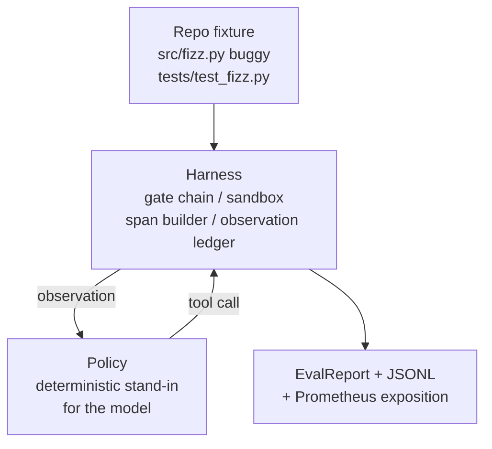
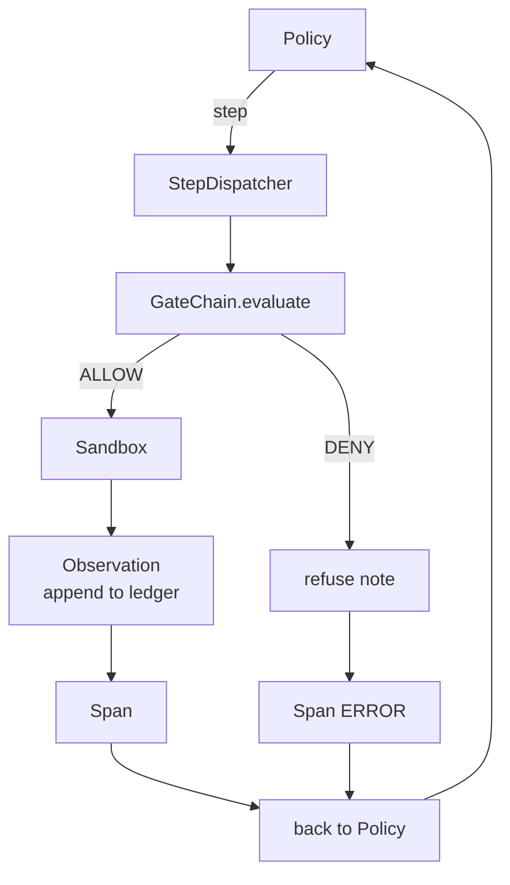

# Capstone Lesson 29：Harness 上的端到端 Coding Agent

> Track A 的 payoff。本课把 gate chain、sandbox、eval harness 和 OTel spans 缝合成一个可工作的 coding agent，用来修复一个多文件 Python project 中真实但很小的 fixture-scale bug。Agent 是 deterministic policy，不是 LLM；这个替换让课程可复现，并说明 harness 才一直是有趣的部分。Contract 完全相同：真实 model 可以插在 policy seam 上。

**类型:** Build
**语言:** Python (stdlib)
**先修:** Phase 19 · 25 (verification gates), Phase 19 · 26 (sandbox), Phase 19 · 27 (eval harness), Phase 19 · 28 (observability), Phase 14 · 38 (verification gates), Phase 14 · 41 (workbench for real repos), Phase 14 · 42 (agent workbench capstone)
**时间:** ~90 minutes

## 学习目标

- 把 gate chain、sandbox、eval harness 和 span builder 组合成一个 agent loop。
- 实现一个 deterministic policy，使用 read_file、run_tests 和 write_file 修复 fixture bug。
- 在一次 end-to-end run 中强制执行 global step budget 和 observation token budget。
- 为完整 run emit 完整 OTel GenAI traces 和 Prometheus metrics。
- 验证 agent 用少于 12 步解决 fixture，并且 legal tools 上没有 gate trips。

## 要解决的问题

大多数 agent demos 都是孤立工作的：单独的 sandbox、单独的 eval harness、单独的 span emitter。看起来都不错。把它们组合起来，seams 就露出来了。

Gate chain 说 ALLOW，但 sandbox 因为 chain 没预料到的原因拒绝了。Eval harness 记录 pass，但 OTel spans 显示 gate 拒绝了 agent 声称自己用过的 tool。Prometheus counter 被 increment 两次，实际应当只 increment 一次。Observation budget 已经超出，但 agent 继续运行，因为 budget 在 chain 中跟踪，而 sandbox 并不知道。

本课是整条 track 的 integration test。Agent 必须按顺序做四件事：读取 project、运行 tests、从 test failure 中识别 bug、写入 fix、重新运行 tests，然后停止。每个 operation 都经过 gate chain。每次 tool execution 都经过 sandbox。每一步都包在 span 中。Eval harness 最后给整体打分。

## 核心概念



Agent 的 policy 是一个 state machine。五个 states。

`SURVEY`：agent 读取 project listing。下一个 state 是 RUN_TESTS。

`RUN_TESTS`：agent 运行 test command。如果 tests pass，state machine 以 success halt。否则下一个 state 是 INSPECT。

`INSPECT`：agent 读取 failing source file。下一个 state 是 FIX。

`FIX`：agent 写入 corrected file。下一个 state 是 VERIFY。

`VERIFY`：agent 再次运行 test command。如果 tests pass，则 halt success。否则 halt failure。

每个 state 对应一次 tool call。每次 tool call 都经过 gate chain。如果某个 tool call 被 denied，agent 会在 trace 中报告 refusal 并 halt。

Fixture bug 是 `fizz.py` 中的 off-by-one。Deterministic policy 通过 regex 从 test failure message 中检测 bug，并 emit corrected file。把 policy 替换成 LLM 不会改变 harness contract。

## 架构



本课是 self-contained。每个 prior-lesson primitive 都在 `main.py` 中以 minimal scale 重新实现（gate、sandbox、ledger、span），所以本课运行时无需 import sibling lessons。名称与 lessons 25-28 完全一致，让概念映射不含糊。

## 你将构建什么

`main.py` 提供：

1. Minimal harness primitives，使用与 lessons 25-28 相同的名称复制而来：`GateChain`、`Sandbox`、`ObservationLedger`、`SpanBuilder`、`MetricsRegistry`。
2. `CodingAgentPolicy` class：带五个 states 的 state machine。
3. `Repo` helper：准备一个带 bundled buggy fixture 的 scratch dir。
4. `AgentRun` class：驱动 policy，通过 harness dispatch，并返回 `AgentRunReport`。
5. 一个 bundled fixture（`fixture_repo/`），包含 src/fizz.py、tests/test_fizz.py，以及 eval harness 的 expected/ tree。
6. Demo：端到端运行 policy，打印 step-by-step trace，assert pass，并打印 metrics。

Bundled fixture 与 lesson 27 的 task structure 形状相同：一个 buggy file 和一个 tests file。Test failure message 包含足够信息，让 deterministic policy 识别 fix。真实 LLM 会完成同一工作，速度更慢、recall 更广，但不会改变 harness 的 expectations。

## 为什么 policy 不是 LLM

真实 LLM 需要 API key、network call，以及不可验证的 stochasticity。Harness 才是本课关心的部分。换成 deterministic policy 让课程能在任何 developer laptop 上零外部依赖运行，并让 test suite assert 精确 step counts。

本课的 policy 是 LLM agent 所做事情的 strict subset。Policy 读取 repo、看到 failing test、识别 line，并 emit fix。LLM 会用同样 harness contract 走过同一个 loop；bookkeeping 完全相同。

## Demo assert 什么

End-to-end demo 在退出时 assert 五件事，test suite 会以程序方式再次 assert。

Policy 用少于 12 步解决了 fixture。

Observation budget 从未超出。

Legal tools 上 fired 的 gate denials 为零。（Agent 从未 invent 一个 denied tool name。）

Traces.jsonl 中每一步都有对应 span。

Prometheus exposition 包含 `tools_called_total{tool="read_file"}` entry 和 `tool_latency_ms` histogram。

## 它如何与 Track A 其余部分组合

本课是 integration。第 25 课写了 gate chain。第 26 课写了 sandbox。第 27 课写了 eval harness。第 28 课写了 observability。第 29 课证明它们能作为一个 system 工作。真实 agent harness 从这里扩展：把 deterministic policy 换成 model，把 bundled fixture 换成 real-repo task，把 JSONL exporter 换成 OTLP。

## 运行它

```bash
cd phases/19-capstone-projects/29-end-to-end-coding-task-demo
python3 code/main.py
python3 -m pytest code/tests/ -v
```

Demo 打印 per-step trace、final eval report 和 Prometheus exposition。Exit code 是零。Tests 覆盖 policy state transitions、synthetic tool calls 上的 gate refusals、bundled fixture 上的 end-to-end run，以及 step-budget invariants。
