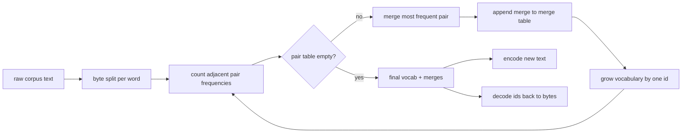
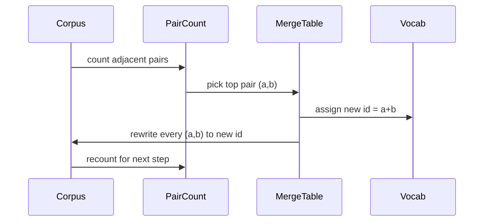

# 从零实现 BPE Tokenizer

> Bytes in, ids out, ids 再回到同一串 bytes。构建每个现代 text model 依然从它开始的 tokenizer。

**类型:** Build
**语言:** Python
**先修:** Phase 04 lessons, Phase 07 transformer lessons
**时间:** ~90 minutes

## 学习目标
- 通过反复 merge 最频繁的相邻 symbol pair，从 raw text corpus 训练 Byte-Pair Encoding vocabulary。
- 实现 deterministic merge table，并把它应用到 fresh text，生成 subword ids stream。
- 将任意 UTF-8 input round-trip 到 ids 再回到原文，且没有 information loss。
- Reserve 并保护 special tokens（`<|endoftext|>`、`<|pad|>`），让它们在 training 和 decoding 中存活。
- 推理为什么 byte-level alphabet 是 general-purpose tokenizer 的正确底层。

## 框架

Language model 从不会看到 text。它看到的是 integers。把 string 映射为 integer list 再映射回来的层，就是 tokenizer。这个 layer 一旦错了，training run 里的每条 loss curve 都在测量错误的东西。

通用 text models 最主流的 subword tokenizers 家族是 Byte-Pair Encoding。想法很小。从一个已知 alphabet 开始。找到 training corpus 中出现最频繁的相邻 symbol pair。把它 merge 成一个新 symbol。重复，直到 vocabulary 达到 target size。Encoding new text 会按同样顺序复用同一份 merge list。

我们会构建 byte-level variant。Alphabet 是 256 个 raw bytes，而不是 Unicode code points。正是这个选择，让 tokenizer 可以处理任意 UTF-8 input，而不用 fallback 到 unknown token。

## Pipeline

Training side 和 inference side 共享 merge table。这种共享就是 contract。如果你在 inference 时改变 merge order，就会 decode 出另一串 ids。

## Byte alphabet

前 256 个 ids 保留给 raw bytes 0x00 到 0xFF。这保证每个 input string 在任何 merge 发生之前，都能被表达在 vocabulary 中。Byte block 之后，我们为 special tokens 保留一小段范围。Training loop 永远不会提出这些 ids 作为 merge targets，因为我们会把它们完全排除在 pretokenized stream 外。

Pretokenizer 会在 training 看到 corpus 之前，先按 whitespace 和 punctuation boundaries 切分。如果没有这一步，BPE merge step 会很乐意学习跨 word boundaries 的 merges，vocabulary 会被常见 whole phrases 填满。有了 split，merges 会留在 word 内部，结果也更容易 generalize。

## Training loop

每个 training step 中，loop 做三件事。它遍历 corpus 中的每个 word，统计当前 symbols 的每个相邻 pair 出现多少次，并按 word 自身出现频率加权。它选择 count 最高的 pair。它把每个出现的 pair 重写成一个新 symbol，其 id 是 vocabulary 中的下一个 free slot。然后记录这个 merge。

每一步的 cost 与 corpus 作为 symbol sequences list 表示时的大小线性相关。对于一百万个 words 和一万个 ids 的 target vocabulary，loop 会在数秒内跑完，因为 symbol sequences 会随着 merges 落地而缩短。

## Encoding fresh text

Inference 不会调用 merge counter。它按 learned 顺序应用 merge table。对于一个 fresh word，encoder 从 byte split 开始。它扫描当前 sequence，寻找 lowest-ranked merge（最早 learned 且适用的 merge）。执行该 merge。再次扫描。当当前 sequence 中没有 merge table 里的 merge 可用时，loop 结束。

按 rank 排序这个性质让 encoding deterministic，并与 training 在相同 input 上的行为匹配。最早 learned 的 merge 位于 table 顶部，并最先应用。如果两个 merges 能在同一位置应用，lower-rank 的那个获胜。

## Special tokens

Special tokens 是 byte stream 永远无法产生的 ids。我们手动 reserve 它们。本课两个就够。

- `<|endoftext|>` 在 pretraining 中分隔 documents。它告诉 model：“一个新 document 从这里开始，不要让前一个 document 的 context 泄露进来。”
- `<|pad|>` 填充短 sequences，让 batch 能成为 rectangular tensor。Training 时 loss mask 会隐藏它。

Encoder 接受一个 flag，决定是否允许 input 中出现 special tokens。Flag 关闭时，strings `<|endoftext|>` 和 `<|pad|>` 会被 tokenized 成拼出它们的 bytes。Flag 开启时，这些 literal strings 会映射到 reserved ids，并且不参与任何 merge。

## Round-trip guarantee

先 encode 再 decode 必须精确返回 input bytes。Decoder 按顺序 concatenates 每个 id 的 byte expansion。由于每个 id 要么是 raw byte，要么是两个先前已知 ids 的 concatenation，recursive expansion 总会终止在 raw bytes 上。然后 decoding 返回这些 bytes 拼出的 UTF-8 string。

本课 test suite 会在 unseen sentence、带 Unicode emoji 的 sentence，以及包含 literal `<|endoftext|>` token 的 sentence 上检查这个性质。

## 本课不做什么

它不会构建大型 production tokenizers 风格的 regex-driven pretokenizer。这里的 pretokenizer 是一个小型 whitespace 和 punctuation split。它足以在小 training corpus 上产生合理 merges，并且与后续 lesson chain 的 contract 保持不变。下一课会把 tokenizer 当作 black box，并在其上构建 sliding-window dataset。

它不会 parallelize pair counter。Python 中一个 loop 跑几千个 words 的 corpus 用不了一秒。对于更大的 corpora，显然的做法是 per word 并行 count pairs，然后 reduce。

## 如何阅读代码

`main.py` 定义四个 objects。`BPETokenizer` 持有 vocabulary、merge table 和 special-token table。`train` 是 training loop。`encode` 是 inference path。`decode` 是 byte concatenation。底部 demo 会在 built-in corpus 上训练一个小 tokenizer，encode 一个 held-out sentence，把 ids decode 回来，并打印二者。`code/tests/test_bpe.py` 中的 tests 会 pin 住 round-trip property、special-token reservation 和 merge ordering。

运行 demo。然后把 demo 中的 target vocabulary size 从 300 改成 600，观察 held-out sentence 的 encoded length 如何下降。那条曲线就是 BPE compression curve。
