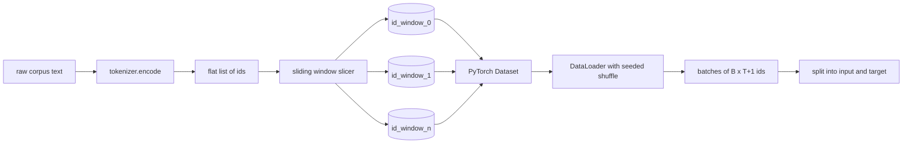
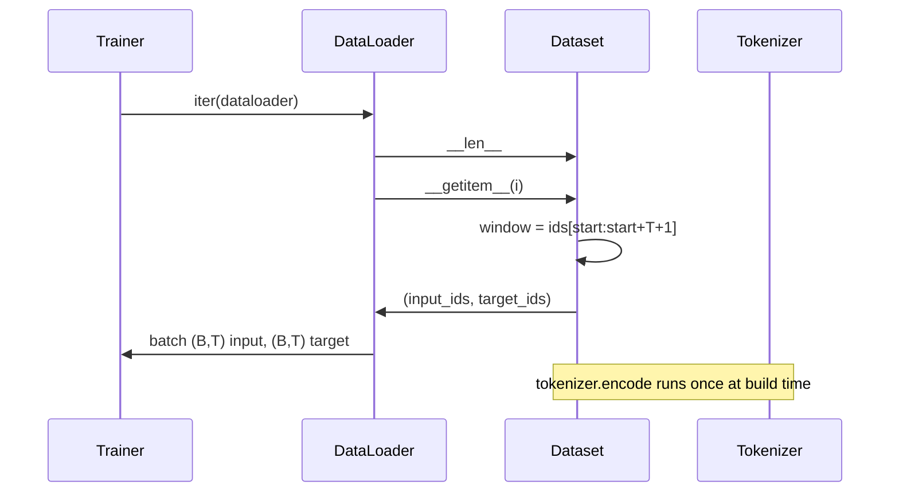

# 使用 Sliding Window 构建 Tokenized Dataset

> 一次 pretraining run 是从 token ids 到 gradients 的函数。本课构建把 ids 喂进去的 conveyor。

**类型:** Build
**语言:** Python
**先修:** Phase 04 lessons, Phase 07 transformer lessons, Lesson 30 of this phase
**时间:** ~90 minutes

## 学习目标
- 通过调用 tokenizer 一次，把 raw corpus 转换为 token ids stream。
- 用可配置 overlap stride，把 id stream 切成固定长度 windows。
- 构建一个 PyTorch Dataset，返回 next-token prediction 所需的 input 和 target tensors。
- 用 per epoch seeded 的 deterministic shuffle，把 dataset 包进 DataLoader。
- 推理 stride、redundancy 和 effective dataset size 之间的 trade-off。

## 框架

一次 pretraining run 每次读取一个 batch 的 token ids，并更新 model。每个 batch 的 shape 由 training contract 固定。对于 causal language model，batch 保存 `(B, T)` input ids 和 `(B, T)` target ids，其中 target 是 input 向左 shift 一位。Data pipeline 的工作，是从可能有数 GB raw text 的 corpus 中，以 deterministic 且 reproducible 的方式按需产出这个 contract。

本课构建这条 pipeline。上一课的 tokenizer 会把 text 转成一条很长的 flat ids list。Sliding window 把这个 list 切成 training examples。Custom Dataset 把 examples 暴露为 tensors。DataLoader 将它们 batch 起来，并用已知 seed shuffle。

## Shape contract

Causal LM 消费 shape 为 `(B, T)` 的 ids，其中 `B` 是 batch size，`T` 是 context length。Position `t` 的 target 是 position `t+1` 的 input。这意味着每个 training example 覆盖 `T+1` 个 raw ids。Window stride 控制连续 examples 之间有多少 overlap。

Slicer 永远不会跨越 corpus boundary。如果最后一个 window 没有足够 ids 填满 `T+1` 个位置，slicer 会丢弃它。用 `<|pad|>` padding tail 也是有效选择，但它会让 loss mask 复杂化。本课选择 drop。

## 为什么使用 sliding window

Pretraining corpus 是一条很长的 ids stream。如果 model 只看到 non-overlapping windows，每个 training example 都会教它同样的 `T` boundaries。调整 stride 会移动这些 boundaries，让 model 看到更多样的 predict-next-token tasks。

Stride 为 `T` 会产生 non-overlapping windows。Stride 为 `T // 2` 会产生百分之五十 overlap，并让 effective dataset 翻倍。Stride 为 `1` 会产生最大 overlap，并让 dataset 增加 `T` 倍。成本是每个 epoch 的 compute 更多。收益是 boundary diversity 更多。大多数 pretraining runs 使用等于 context length 的 stride，因为 corpus 已经远大于 model 在一个 epoch 内能跑完的量，所以 boundary diversity 的论点较弱。

## Dataset class

PyTorch Dataset 有两个 required methods。`__len__` 返回 examples 数量。`__getitem__` 以一对 tensors 形式返回一个 example。我们的 Dataset 存储 encoded id stream 和 stride。Indexing into it 会即时计算 window 起点，所以 memory cost 是 id stream 的一份 copy，不受 stride 产生多少 examples 影响。

Shift-by-one 发生在 `__getitem__` 内部。Dataset 返回 `(input, target)`，其中 `input = window[:-1]`，`target = window[1:]`。二者都是 PyTorch long tensors。Training loop 把它们当作 ground truth。

## Deterministic shuffle

带 `shuffle=True` 的 DataLoader 会从 PyTorch random generator 读取。通过传入 per epoch seeded 的显式 `torch.Generator`，我们能让 run 每次 restart 都看到相同 shuffle。当你想比较两个只差一个 hyperparameter 的 runs 时，这个性质很重要。没有 seed，两个 runs 看到的数据顺序不同，loss curves 会因与改动无关的原因 diverge。

本课中的 seed contract 很简单。`epoch_seed = base_seed + epoch_index`。Base seed 在 construction 时传入。Epoch index 由 trainer 在每个 epoch 顶部 increment。使用相同 base seed 的 re-run 总会在每个 epoch 看到相同 order。

## Batch sampler

PyTorch 默认 sampler 会 uniform random 地挑选 indices，且 disabled replacement。这正是 pretraining 想要的。对于小 dataset 上的 finetuning，contract 也一样。DataLoader 通过调用 `__getitem__` `B` 次并 stack 结果来 assemble 一个 batch。因为每个 example 按 construction 都有相同长度，所以不需要 padding logic。

本课保持 `num_workers=0`，为了简单。Production run 中 workers 会 parallelize `__getitem__` calls。对我们的 pipeline 来说，这大多是 no-op，因为工作只是 slice 一个 in-memory tensor，但同一个 Dataset API 能干净支持 workers。

## Counting examples

对于长度为 `N` 的 id stream、context length `T` 和 stride `S`，examples 数量是 `max(0, 1 + (N - (T + 1)) // S)`。本课把这个 calculation 暴露为 Dataset 上的 static method，这样 trainer 可以不迭代就计算 total steps per epoch。

## 本课不做什么

它不会从 disk stream。Corpus 会完整 encode 在 memory 中，并以单个 tensor 持有。几百万 ids 的 corpus 远低于一百 MB，对本课来说是正确形状。Disk streaming 是另一个 concern，可以通过替换 storage 插入，但保持 Dataset contract 不变。

它不会处理多个 documents。Corpus 被当作一条 continuous id stream。当 corpus 从多个 documents 构建时，next-document boundary 会通过插入 `<|endoftext|>` ids 编码。Model 会学习在 boundary 周围预测。

## 如何阅读代码

`main.py` 定义两个 classes 和一个 helper。`SlidingWindowDataset` 是 PyTorch Dataset。`make_dataloader` 返回一个带 seeded generator 的 configured DataLoader。`_encode_corpus_to_ids` 是 one-shot tokenizer call。底部 demo 会在进程内构建一个小 tokenizer，encode built-in corpus，构建 dataset 和 dataloader，打印一个 batch，并 assert shape contract。`code/tests/test_dataset.py` 中的 tests 会 pin window count formula、shift-by-one property、deterministic shuffle 和 stride trade-off。

运行 demo。然后把 context length 从 16 改成 32，观察每个 epoch 的 examples 数量如何下降。那个数字就是你的 steps-per-epoch budget。
