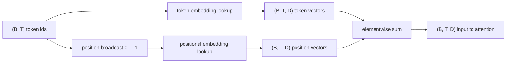
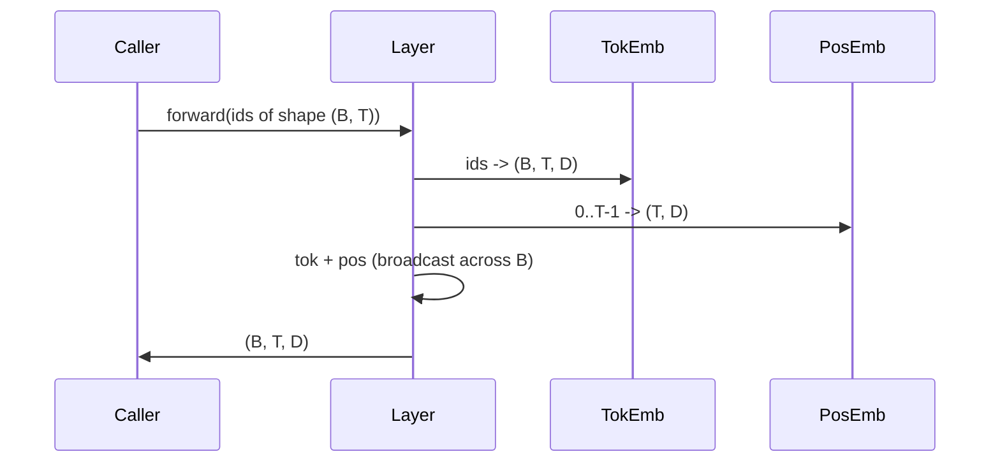

# Token 和位置嵌入

> Id 是整数。模型想要向量。两张查找表位于它们之间，而位置表的选择会塑造模型能学到什么。

**类型:** 构建
**语言:** Python
**先修:** Phase 04 lessons, Phase 07 transformer lessons, 本阶段 Lessons 30 and 31
**时间:** ~90 分钟

## 学习目标
- 构建一个 token-embedding 查找表，将 vocabulary id 映射为稠密向量。
- 构建一个按位置索引的 learned positional-embedding 查找表。
- 构建一个无参数、按位置索引的固定 sinusoidal positional embedding。
- 将 token embedding 和 positional embedding 组合成 transformer block 的单个输入。
- 从长度泛化和参数量角度对比 learned embedding 与 sinusoidal embedding。

## 背景框架

模型第一次接触 token id 时，是在 token-embedding 矩阵中做一次行查找。这个矩阵每个 vocabulary id 一行，每个模型维度一列。查找会返回一个向量，模型其余部分会把它当作该 id 的含义。反向传播会更新前向传播中用到的那些行。随着训练进行，这些行的几何结构会学会在方向中编码相似性。

只有 token id 没有顺序。模型需要第二个信号，告诉它位置一和位置十七不同。这个信号的两种主流选择是 learned positional embedding（第二张查找表，每个位置一行）和固定 sinusoidal positional embedding（无参数的数学公式）。选择会带来后果。learned table 是参数，并且受训练时最大上下文长度限制。sinusoidal table 理论上无参数，公式可扩展到任意位置，但本课的 `SinusoidalPositionalEmbedding` 会在 `max_context_length` 处预计算一张固定表，并且它的 `forward` 在越过该边界时会抛错；因此这里两个模块都会强制最大上下文长度。即使表足够大，可以索引更长位置，模型在超过训练长度时仍可能表现吃力。

本课会构建这两种方式，并把它们与 token embedding 组合成下一课 attention block 的单个输入。

## 形状契约

embedding 阶段的输入是一批 token id，形状为 `(B, T)`。输出是形状为 `(B, T, D)` 的张量，其中 `D` 是模型维度。每个 batch 元素都有相同的上下文长度 `T`。每个位置都有相同的向量维度 `D`。



组合方式是求和，不是拼接。求和会让 `D` 在整个网络中保持不变，并让模型能在每个特征维度上自行决定 token 含义和位置中谁在每一层占主导。

## token embedding 矩阵

token embedding 是形状为 `(V, D)` 的参数张量，其中 `V` 是词表大小。PyTorch 将它暴露为 `nn.Embedding(V, D)`。初始化时，条目来自一个较小的 Gaussian，transformer 规模模型传统上使用均值为零、标准差约 `0.02` 的分布。精确初始化没那么重要，重要的是跨运行保持一致。

前向传播是一次单纯的索引操作。PyTorch 通过收集行，把 `(B, T)` 的 int64 id 映射为 `(B, T, D)` 的浮点数。反向传播只会把梯度累积到前向传播中触碰过的行。batch 中从未出现过的两行，在这一步会收到零梯度。

一个细节。token embedding 和模型末尾的输出投影经常共享权重（weight tying）。发生这种情况时，每次反向传播都会通过输出侧触碰 embedding 的每一行。本课将两者暴露为独立模块，但在完整模型中同一个矩阵可以同时扮演两个角色。

## learned positional embedding

learned positional embedding 是第二个 `nn.Embedding`，形状为 `(max_context_length, D)`。查找键是位置 id `0, 1, 2, ..., T-1`。前向传播会把这个位置向量广播到 batch 维度。

learned table 的缺点是：如果模型只训练到位置 `T-1`，就不能查询位置 `T`。那一行不存在。使用这种方案的生产 decoder-only 模型会把最大上下文长度烘焙进架构，并拒绝处理更长输入。

## sinusoidal positional embedding

sinusoidal positional embedding 是从位置到向量的函数。位置 `p` 和特征 `i` 生成：

```python
angle = p / (10000 ** (2 * (i // 2) / D))
emb[p, 2k]     = sin(angle)
emb[p, 2k + 1] = cos(angle)
```

这个函数没有参数。每个位置都有唯一向量。波长会沿特征维度按几何方式变化，因此低维编码粗粒度位置，高维编码细粒度位置。

`sin` 和 `cos` 成对使用带来的性质是，位置 `p + k` 的向量是位置 `p` 向量的线性函数。这给 attention 层学习相对位置偏移提供了一条简单路径。模型不需要额外参数来表达“向前看五个 token”。

本课会在构造时计算完整 sinusoidal table，并在前向传播时索引它。

## 组合

输入流水线按顺序做三件事。读取 token id。查找 token 向量。加上位置向量。返回总和。



求和步骤中的广播会沿 batch 维度复制 `(T, D)` 的位置张量。PyTorch 会自动处理这一点，因为位置张量在 unsqueeze 之后形状为 `(1, T, D)`。

## 对比分析

本课会在相同输入上运行两个变体，并打印两个诊断。

第一个是参数量。learned 变体会在 token embedding 之外增加 `max_context_length * D` 个参数。sinusoidal 变体增加零个参数。

第二个是相邻位置 embedding 之间的余弦相似度。sinusoidal 变体因为函数连续，所以有平滑且可预测的衰减。learned 变体在初始化时相似度近乎随机，因为各行是独立抽样的。训练后，learned 变体通常也会发展出类似的平滑结构，但它必须从数据中发现这种结构。

## 本课不做什么

本课不构建 rotary positional encoding（RoPE）或 AliBi。它们是生产 transformer 中的现代选择。它们都遵循与这里 embedding 相同的形状契约（对形状为 `(B, T, D)` 的向量应用位置相关变换），但它们作用在 attention projection 步骤，而不是输入处。下一课会构建 attention block，其中一个可选扩展是在 query-key 投影中折入 rotary。

本课不训练 embedding。训练需要 loss，而 loss 需要模型输出，模型输出需要 attention 和 LM head。那是下一课和再下一课的内容。

## 如何阅读代码

`main.py` 定义三个模块。`TokenEmbedding` 包装 `nn.Embedding(V, D)`。`LearnedPositionalEmbedding` 包装 `nn.Embedding(L, D)`。`SinusoidalPositionalEmbedding` 预计算表，并把它暴露为 buffer。`EmbeddingComposer` 将一个 token embedding 和一个 positional embedding 绑定在一起。底部 demo 会打印形状、参数量，以及相邻位置相似度诊断。`code/tests/test_embeddings.py` 中的测试固定了形状、广播行为、参数量和 sinusoidal 公式。

运行 demo。然后把模型维度 `D` 从 64 改为 32，观察 sinusoidal 波长带如何变化。
